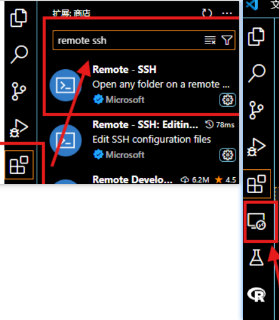
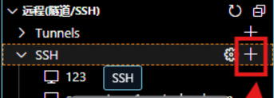

# 服务器远程VSCode跑代码


## 笔记1

相关链接：https://blog.csdn.net/weixin_46336532/article/details/143116956

服务器信息：

> ssh -p 2222
> root@connect.xxx1.xxxxx.com（还有一种为xxx@192.168.111.111，后面为ip地址。Linux中为`用户名@服务器ip地址`）
> 密码：123123123

在VSCode的扩展中搜索`remote ssh`并下载。下载完成后，会出现一个远程连接的图标。



点击该图标，在`SSH`右方点击`+`，新建远程。




## 笔记2

VSCode代码同步到服务器的简单步骤：https://mbd.baidu.com/newspage/data/dtlandingsuper?nid=dt_5060053327927906380&sourceFrom=search_a

vscode远程连接服务器（remote ssh）+上传本地文件到服务器(sftp)：https://huaweicloud.csdn.net/654a122791098a10412752cb.html

- 打开VSCode，进入扩展商店，搜索并安装SFTP插件。推荐使用SFTP/FTP sync插件，它支持多种协议，包括SFTP和FTP。
- 创建本地配置文件（快捷键ctrl+shift+P，搜sftp，点击SFTP.config）。在需要同步的文件夹上创建一个名为.vscode的配置文件，这个文件将包含服务器连接的相关信息。
- 配置服务器端FTP服务。确保服务器端已经开通了FTP服务，VSCode才能通过SFTP插件将代码上传到服务器。
- 配置VSCode服务器设置。打开.vscode文件的sftp.json文件，添加以下内容，保存并同步代码。

```json
    "name": "My Server",
    "host": "服务器地址",
    "protocol": "sftp",
    "port": 21,
    "username": "用户名",
    "password": "密码",
    "remotePath": "/xxx",
    "uploadOnSave": true,
    "useTempFile": false,
    "openSsh": false
```

- 进入本地vscode的窗口，右键需要上传的文件（不能上传根目录文件），点击Upload Folder即可上传。

如果上传文件出现问题，或者是需要上传大文件夹，建议用xftp进行上传。


