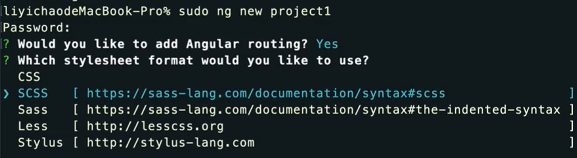
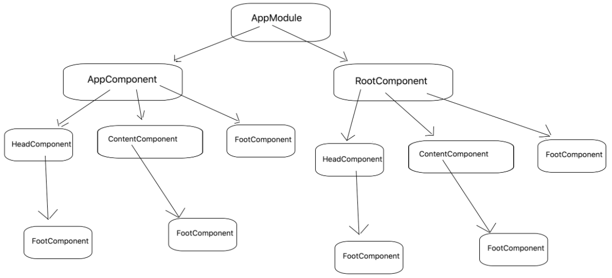
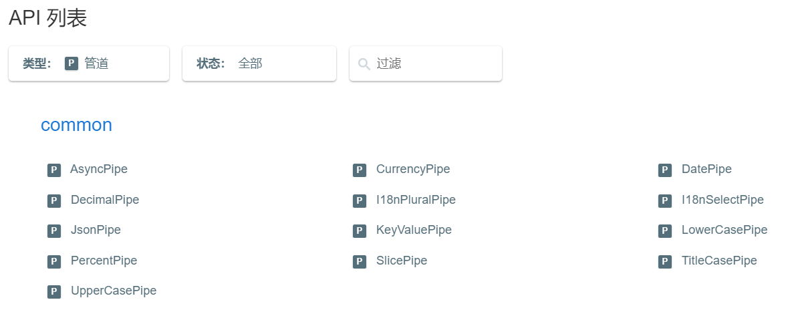

# Angular教程笔记

相关链接：https://www.bilibili.com/video/BV1qWpKecEZb/


本教程的Angular版本：Angular9。

AngularJS诞生于2009年，由Misko Hevery 等人创建，是一款构建用户界面的前端框架，后为Google所收购。Angular是AngularJS的重写，Angular2以后官方命名为Angular，2.0以前版本称为AngularJS。AngularJS是用JavaScript编写，而Angular采用TypeScript语言编写，是ECMAScript 6的超集。

vscode插件推荐：`angular language service`，用于angular的指令的提示。

Angular官网：https://www.angular.cn/overview或https://angular.dev/overview

中文官网：https://www.angular.cn/overview

v9版本中文官网：https://v9.angular.cn/docs

## 基础

Github上的Angular的版本：https://github.com/angular/angular/releases

Angular9需要的Node版本，最低为10.9。

生成环境，创建项目：https://stackblitz.com/。如：https://stackblitz.com/angular/jdyaoxdavpy?file=src%2Fapp%2Fapp.component.ts。

### 创建和运行angular项目

安装 CLI：`npm install -g @angular/cli`。

指定v9的版本：`npm install -g @angular/cli@9`

创建应用：`ng new my-app`。



在创建项目时，可以携带一些参数。如：`--routing`表示需要一个路由文件；`--style=scss`表示使用scss编写样式；`--skipInstall`表示不会自动安装依赖包（node_modules）。

运行：`ng serve -open`或`ng serve`（可以使用localhost进行访问）或`ng serve --port 3000`（指定端口号）或`ng serve --port 3000 --host 0.0.0.0`（这样就可以使用ip地址进行访问）。

安装组件库：`ng add ng-zorro-antd`（官网：https://ng.ant.design/components/overview/zh）。

### 目录结构

工作空间的顶层包含着全工作空间级的配置文件、根应用的配置文件以及一些包含根应用的源文件和测试文件的子文件夹。

| 工作空间的文件或文件夹          | 用途                                                         |
| :------------------------------ | :----------------------------------------------------------- |
| `src/`                          | 根项目的源文件。其子文件夹中包含应用源代码和应用的专属配置。 |
| `src/app/`                      | 包含定义应用逻辑和数据的组件文件。                           |
| `src/app/app.component.ts`      | 为应用的根组件定义逻辑，名为 `AppComponent` 。当向应用中添加组件和服务时，与这个根组件相关联的视图就会成为[视图树](https://v9.angular.cn/guide/glossary#view-hierarchy)的根。 |
| `src/app/app.component.html`    | 定义与根组件 `AppComponent` 关联的 HTML 模板。               |
| `src/app/app.component.css`     | 为根组件 `AppComponent` 定义了基本的 CSS 样式表。            |
| `src/app/app.component.spec.ts` | 为根组件 `AppComponent` 定义了一个单元测试。                 |
| `src/app/app.module.ts`         | 定义了名为 `AppModule` 的根模块，它会告诉 Angular 如何组装应用。这里最初只声明一个 `AppComponent`。当向应用中添加更多组件时，它们也必须在这里声明。 |
| `src/assets/`                   | 包含要在构建应用时，应该按原样复制的图像和其它静态资源文件。 |
| `src/environments/`             | 包含特定目标环境的构建配置选项。默认情况下，有一个无名的标准开发环境和一个生产（“prod”）环境。还可以定义其它的目标环境配置。 |
| `src/favicon.ico`               | 用作该应用在标签栏中的图标。                                 |
| `src/index.html`                | 当有人访问站点时，提供服务的主要 HTML 页面。CLI 会在构建应用时，自动添加所有的 JavaScript 和 CSS 文件，所以通常不用手动添加任何 `<script>` 或 `<link>` 标签。 |
| `src/main.ts`                   | 应用的主要切入点。用 [JIT 编译器](https://angular.io/guide/glossary#jit)编译应用，然后引导应用的根模块（AppModule）在浏览器中运行。也可以在不改变任何代码的情况下，改用 [AOT 编译器](https://angular.io/guide/aot-compiler)， 只要在 CLI 的 `build` 和 `serve` 命令中加上 `--aot` 标志就可以了。 |
| `src/polyfills.ts`              | 为浏览器支持提供了腻子（polyfill）脚本。                     |
| `src/styles.sass`               | 列出为项目提供样式的 CSS 文件。该扩展还反映了为该项目配置的样式预处理器。 |
| `src/test.ts`                   | 单元测试的主入口点，带有一些Angular特有的配置。通常不需要编辑这个文件。 |
| `.editorconfig`                 | 代码编辑器的配置。参见[EditorConfig](https://editorconfig.org/)。 |
| `.gitignore`                    | 指定 [Git](https://git-scm.com/) 应忽略的不必追踪的文件。    |
| `README.md`                     | 根应用的简介文档.                                            |
| `angular.json`                  | 为工作区中的所有项目指定 CLI 的默认配置，包括 CLI 要用到的构建、启动开发服务器和测试工具的配置项，比如 [TSLint](https://palantir.github.io/tslint/)，[Karma](https://karma-runner.github.io/) 和 [Protractor](http://www.protractortest.org/)。参阅 [Angular 工作空间配置](https://v9.angular.cn/guide/workspace-config) 部分。 |
| `package.json`                  | 配置工作空间中所有项目可用的 [npm包依赖](https://v9.angular.cn/guide/npm-packages) 。 |
| `package-lock.json`             | 提供 npm 客户端安装到 `node_modules` 的所有软件包的版本信息。如果使用的是 yarn 客户端，那么该文件就是 yarn.lock 。 |
| `node_modules/README.md`        | 根应用的介绍性文档。                                         |
| `tsconfig.json`                 | 工作空间中各个项目的默认 [TypeScript](https://www.typescriptlang.org/) 配置。 |
| `tslint.json`                   | 工作空间中各个项目的默认 [TSLint](https://palantir.github.io/tslint/) 配置。 |
| `browserslist`                  | 配置各种前端工具之间共享的目标浏览器和 Node.js 版本。参阅 [GitHub 上的浏览器列表](https://github.com/browserslist/browserslist) 。 |
| `karma.conf.js`                 | 应用专属的 [Karma](https://karma-runner.github.io/2.0/config/configuration-file.html) 配置。 |
| `tsconfig.app.json`             | 应用专属的 [TypeScript](https://www.typescriptlang.org/) 配置，包括 TypeScript 和 Angular 模板编译器的选项。参见 [TypeScript 配置](https://v9.angular.cn/guide/typescript-configuration) 。 |
| `tsconfig.spec.json`            | 应用测试的 [TypeScript](https://www.typescriptlang.org/) 配置。参见 [TypeScript 配置](https://v9.angular.cn/guide/typescript-configuration) 。 |
| `tslint.json`                   | 应用专属的 [TSLint](https://palantir.github.io/tslint/) 配置。 |

### angular.json文件

```json
{
  "$schema": "./node_modules/@angular/cli/lib/config/schema.json",
  "version": 1,
  "newProjectRoot": "projects",
  "projects": {
    "angular.io-example": {
      "projectType": "application",
      "schematics": {},
      "root": "",
      "sourceRoot": "src",
      "prefix": "app",
      "architect": { // 里面的节点与`package.json`里的scripts节点下的命令相对应
        "build": { // （`ng serve`？和）`ng build`都会用到该build配置
          "builder": "@angular-devkit/build-angular:browser",
          "options": {
            "outputPath": "dist",
            "index": "src/index.html",
            "main": "src/main.ts",
            "polyfills": "src/polyfills.ts",
            "tsConfig": "tsconfig.app.json",
            "assets": [
              "src/favicon.ico",
              "src/assets"
            ],
            "styles": [ // 配置样式文件，全局生效
              "src/styles.css"
            ],
            "scripts": []
          },
          "configurations": {
            "production": {
              "fileReplacements": [
                {
                  "replace": "src/environments/environment.ts",
                  "with": "src/environments/environment.prod.ts"
                }
              ],
              "optimization": true,
              "outputHashing": "all",
              "sourceMap": false,
              "extractCss": true,
              "namedChunks": false,
              "aot": true,
              "extractLicenses": true,
              "vendorChunk": false,
              "buildOptimizer": true,
              "budgets": [
                {
                  "type": "initial",
                  "maximumWarning": "2mb",
                  "maximumError": "5mb"
                }
              ]
            }
          }
        },
        "serve": {
          "builder": "@angular-devkit/build-angular:dev-server",
          "options": {
            "browserTarget": "angular.io-example:build"
          },
          "configurations": {
            "production": {
              "browserTarget": "angular.io-example:build:production"
            }
          }
        },
        "extract-i18n": {
          "builder": "@angular-devkit/build-angular:extract-i18n",
          "options": {
            "browserTarget": "angular.io-example:build"
          }
        },
        "test": {
          "builder": "@angular-devkit/build-angular:karma",
          "options": {
            "main": "src/test.ts",
            "polyfills": "src/polyfills.ts",
            "tsConfig": "tsconfig.spec.json",
            "karmaConfig": "karma.conf.js",
            "assets": [
              "src/favicon.ico",
              "src/assets"
            ],
            "styles": [
              "src/styles.css"
            ],
            "scripts": []
          }
        },
        "lint": {
          "builder": "@angular-devkit/build-angular:tslint",
          "options": {
            "tsConfig": [
              "tsconfig.app.json",
              "tsconfig.spec.json",
              "e2e/tsconfig.json"
            ],
            "exclude": [
              "**/node_modules/**"
            ]
          }
        },
        "e2e": {
          "builder": "@angular-devkit/build-angular:protractor",
          "options": {
            "protractorConfig": "e2e/protractor.conf.js",
            "devServerTarget": "angular.io-example:serve"
          },
          "configurations": {
            "production": {
              "devServerTarget": "angular.io-example:serve:production"
            }
          }
        }
      }
    }
  },
  "defaultProject": "angular.io-example"
}
```


### ngModule（angular module）

Module就是一个普通的类，但是这个类一旦被@NgModule所装饰，那这个类就可以被称为`angular module`。

ngModule是在创建项目时，angular自动生成的module，也是整个项目的根模块。

#### @NgModule元数据

[@NgModule](https://angular.cn/api/core/NgModule)获取一个元数据对象（接收的参数），告诉 Angular 如何编译和启动本应用。

该对象的属性有：
①declarations：该模块的依赖项。
②providers：提供各种服务。
③imports：导入其它的ngModule。
④exports。
⑤bootstrap：根组件，Angular创建它并插入 index.html 宿主页面。
⑥entryComponents。

```typescript
示例：
// src/app/app.module.ts
import { BrowserModule } from '@angular/platform-browser';
import { NgModule } from '@angular/core';
import { AppRoutingModule } from './app-routing.module';
import { AppComponent } from './app.component';
@NgModule({
	declarations: [
		AppComponent,
	],
	imports: [
		BrowserModule,
		AppRoutingModule,
	],
	providers: [],
	bootstrap: [AppComponent]
})
export class AppModule { }
```


##### declarations（数组）

某个模块想要正常工作，可能会依赖一些组件、指令和管道，那就必须将它们声明到declarations中。

引入有一些规则，以组件为例（也适用于指令和管道）：
①模块中不能使用未声明过（没有添加到declarations中）的组件。
②一个组件只能被一个模块声明。
③在declarations中的组件默认只能在当前模块中使用，要想让其他模块使用，必须exports出去。

##### providers（数组）

提供一系列服务。


##### imports（数组）

imports数组只会出现在@NgModule装饰器中，一个模块想要正常工作，除了本身的依赖项（declarations），还可能需要其它模块导出的依赖项。
只要是`angular module`，都可以导入imports数组中，如自定义的模块、第三方、ng内置的等。

##### bootstrap（数组）

应用是通过引导根模块 AppModule 来启动的，引导过程还会创建 bootstrap 数组中列出的组件，并把它们逐个插入到浏览器的 DOM 中。
该数组中的每个组件，都作为组件树的根（根组件）。所有组件都是基于根组件的。

虽然可以在宿主页面中放多个组件，但大多数应用都只有一个组件树，并且只从一个根组件开始引导。这个根组件通常叫做 AppComponent，并且位于根模块的bootstrap数组中。


### 显示数据

ng的模版中，默认用双大括号 `{{ }}`绑定组件中的变量，并显示。

```typescript
// src/app/app.component.ts
import { Component } from '@angular/core';
// 使用内联模式
@Component({
  selector: 'app-root',
  template: `
    <h1>{{title}}</h1>
    <h2>My favorite hero is: {{myHero}}</h2>
    `,
  styles: [`h1 { color: red }`]
})
export class AppComponent {
  title = '标题啊';
  myHero = '哈哈哈';
}
```

模板中的 HTML：大部分html标签都能在模版中使用，有一些标签虽然也能显示，但其是毫无意义的，如html、body、script、base。

### 模板表达式、绑定语法

- 当使用模板表达式时，应该遵循的原则：非常简单、执行迅速、没有可见的副作用（即模版中的逻辑不能改变组件的变量）。
  在模板表达式中，可以绑定变量、绑定方法。
- 绑定语法，可以绑定普通属性（使用中括号`[]`的方式，或`bind-`的方式）、绑定自定义属性、使用插值表达式、绑定单个class、绑定多个class、绑定单个style、绑定多个style。
  [样式优先级](https://angular.cn/guide/template-syntax#styling-precedence)：某个类或样式，绑定得越具体，它的优先级就越高；绑定总是优先于静态属性。

```typescript
// src/app/app.component.ts
import { Component } from '@angular/core';
// 使用单独的文件
@Component({
	selector: 'app-root', // 普通的HTML选择器。对于组件，大部分都是用标签选择器。
	templateUrl: './app.component.html', // 提供模板的文件
	styleUrls: ['./app.component.less'] // 提供样式的文件
})
export class AppComponent {
	title = '标题啊';
	myHero = '哈哈哈';
	price = 30;
	// 绑定属性相关
	madaoSrc = '../assets/images/madao.jpg';
	user = {
		name: 'madao',
		pic: this.madaoSrc
	};
	colSpan = 2;
	isDisabled = false;
	customTitle = 'bbb';
	// 绑定样式相关
	theme = 'primary';
	isSuccess = true;
	btnCls = 'btn btn-primary';
	btnCls2 = ['btn', 'btn-success'];
	btnCls3 = {
		btn: true,
		'btn-info': true
	};
	style1 = 'width: 200px;height: 50px;text-align: center;border: 1px solid;';
	style2 = {
		width: '200px',
		height: '50px',
		'text-align': 'center',
		border: '1px solid',
		// 属性名可以使用小驼峰命名法形式，也可以使用短横线命名法格式
		// 'backgroundColor': '#ce5ce4',
		// 'background-color': '#ce5ce4'
	};
	// 文档上虽然支持下面数组字符串的写法，但（可能）不生效
	// style3 = ['width', '200px'];
	// style3 = ['width', '200px', 'height', '50px', 'text-align', 'center', 'border', '1px solid']; // 有问题
	// 绑定变量相关
	getJob(): string {
		return '战士';
	}
	// 绑定方法相关
	getVal(): number {
		return 33;
	}
	// 绑定事件相关
    onClick(str: string, event: MouseEvent): void {
        console.log('onClick', str);
        console.log('onClick', event.target);
    }
    clickParent() {
        console.log('clickParent'); // 点击子元素时，不会打印，因为在冒泡时，子元素已触发阻止冒泡方法
    }
    onInput(event: KeyboardEvent) {
        console.log('onInput', (event.target as HTMLInputElement).value); // 因为不是所有的元素都有value属性，所以这里使用断言将target转换为输入元素，否则（虽然能正常打印，但）命令行会报错
    }
}
```

```html
// src/app/app.component.html
<!-- 绑定变量 -->
<h1>{{ title }}</h1>
<h2>My favorite hero is: {{ myHero }}</h2>
<div>Job: {{ getJob }}</div>
<!-- 绑定方法 -->
<div>Value: {{ getVal() }}</div>
<!-- 模版中还可以写些简单的逻辑，如判断、运算 -->
<p>The sum of 1 + 1 is {{ 1 + 1 }}。</p>
<p>price的7折 {{ price * 0.7 }}。</p>
<p>与方法结合 {{ price * 0.7 + getVal() }}。</p>

<!-- 绑定普通属性 -->
<!--  -->


<table class="table-bordered">
	<tr>
		<th>name</th>
		<th>phone</th>
		<th>age</th>
	</tr>
	<tr>
		<td>张三</td>
		<td>13288888888</td>
		<td>33</td>
	</tr>
	<tr>
		<!-- <td colspan="2">李四</td> -->
		<!-- 有些属性要用小驼峰的形式，否则命令行和浏览器都会报错 -->
		<td [colSpan]="colSpan">李四</td>
		<td>13266666666</td>
		<td>22</td>
	</tr>
</table>
<button class="btn btn-primary" [disabled]="isDisabled">click</button>
<!-- 绑定自定义属性。带有`data-`的自定义属性，要加`attr.`；其它单个单词的自定义属性，加`attr.`和不加的效果是一样的 -->
<span [attr.data-title]="customTitle">一行文字</span>
<span [attr.title]="customTitle">test title</span>
<span [title]="customTitle">test title</span>
<!-- 使用插值表达式。插值也可用于属性，但常规做法还是用中括号`[]`，建议整个项目保持风格统一 -->

<button class="btn btn-primary" [disabled]="isDisabled">click</button>

<!-- 绑定单个class。精确地绑定某一个类样式 -->
<button type="button" class="btn" [class.btn-primary]="theme === 'primary'">Primary</button>
<button type="button" class="btn" [class.btn-secondary]="true">secondary</button>
<button type="button" class="btn" [class.btn-success]="isSuccess">success</button>
<button type="button" class="btn" [class.btn-danger]="'啦啦啦'">'啦啦啦'为真，所以样式生效。danger</button>
<button type="button" class="btn" [class.btn-danger]="0">danger</button>
<button type="button" class="btn" [class.btn-danger]="null">danger</button>
<button type="button" class="btn" [class.btn-danger]="undefined">danger</button>

<!-- 绑定多个class -->
<button type="button" [class]="btnCls">btnCls</button>
<button type="button" [class]="btnCls2">btnCls2</button>
<button type="button" [class]="btnCls3">btnCls3</button>
<!-- 也可以用内置指令ngClass。效果一样 -->
<button type="button" [ngClass]="btnCls">btnCls</button>
<button type="button" [ngClass]="btnCls2">btnCls2</button>
<button type="button" [ngClass]="btnCls3">btnCls3</button>

<!-- 绑定单个style -->
<p [style.color]="'#f60'">一段文字</p>
<p [style.height]="'50px'" [style.border]="'1px solid'">设置高度</p>
<p [style.height.px]="50" [style.border]="'1px solid'">设置高度</p>
<p [style.height.px]="'50'" [style.border]="'1px solid'">设置高度</p>

<!-- 绑定多个style -->
<p [style]="style1">style1</p>
<p [style]="style2">style2</p>
<p [style]="style3">style3</p>
<!-- 也可以用内置指令ngStyle, 但不推荐，以后可能会弃用。ngStyle只接收对象，其它数据格式会报错 -->
<p [ngStyle]="style2">style3</p>
<!--  <p [ngStyle]="style1">style1</p>-->
<!--  <p [ngStyle]="style3">style2</p>-->

<!-- 绑定事件 -->
<button type="button" class="btn btn-primary" (click)="onClick('aaa', $event)">Primary</button>
<div (click)="clickParent()" style="width: 200;height: 200;color: #000000;">
    <div (click)="$event.stopPropagation()" style="width: 100;height: 100;color: #ffffff;"></div>
</div>
<input type="text" (input)="onInput($event)" />
```


### 输入属性和输出属性

#### 基础

```typescript
// src/app/app.module.ts
import { BrowserModule } from '@angular/platform-browser';
import { NgModule } from '@angular/core';
import { AppRoutingModule } from './app-routing.module';
import { AppComponent } from './app.component';
import { DialogComponent } from './components/dialog/dialog.component';
@NgModule({
	declarations: [
		AppComponent,
		DialogComponent
	],
	imports: [
		BrowserModule,
		AppRoutingModule
	],
	providers: [],
	bootstrap: [AppComponent]
})
export class AppModule { }
```

父组件：

```typescript
// src/app/app.component.ts
import { Component } from '@angular/core';
@Component({
	selector: 'app-root',
	templateUrl: './app.component.html',
	styleUrls: ['./app.component.scss'],
})
export class AppComponent {
	title = 'hero';
	showModal = false
	onClose() {
		this.showModal = false;
	}
}
```

```html
<!-- src/app/app.component.html -->
<button (click)="showModal = true">show modal</button>
<!-- 将showModal的属性值传入show，show则在子组件里接收。如果绑定的值是静态的，就不需要`[]`，如下面的title -->
<app-dialog [show]="showModal" title="一个标题static" (closed)="onClose()" (backdropClick)="onClose()"></app-dialog>
<!-- <app-dialog [visible]="showModal" title="一个标题static" (hide)="onClose()" (backdropClick)="onClose()"></app-dialog> -->
```

子组件：

```typescript
// src/app/components/dialog/dialog.component.ts
import { Component, EventEmitter, Input, OnInit, Output } from '@angular/core';
@Component({
	selector: 'app-dialog',
	templateUrl: './dialog.component.html',
})
export class DialogComponent implements OnInit {
	// 经过@Input()装饰，item的值，不由组件内部决定，而是由调用者决定。调用者指定item是什么，则item就是什么。在子组件里，无法改变item的值。
	// @Input() item: string; // decorate the property with @Input()

	// @Input()和@Output()可以接收一个参数，作为变量的别名，则在父组件中，只能用别名绑定
	// @Input('visible') show = false; // @Input可传入参数，如visible，则在外部的标签上则写visible属性。但一般不这么做，因为容易逻辑混乱
	@Input() show = false; // decorate the property with @Input()
	@Input() title = '';
	// @Output('hide') closed = new EventEmitter<void>(); // @Output可传入参数，如hide，则在外部的标签上则写hide属性
	@Output() closed = new EventEmitter<void>();
	@Output() backdropClick = new EventEmitter<void>();
	constructor() { }
	ngOnInit(): void {
	}
	onClose() {
		// this.show = false; // 不建议在该组件内部直接修改，否则在外部重新点击显示则无效果
		this.closed.emit();
	}
}
```

```html
<!-- src/app/components/dialog/dialog.component.html -->
<div (click)="backdropClick.emit()" [class.d-block]="show">
	<div (click)="$event.stopPropagation();">
		<h5>{{ title }}</h5>
		<button (click)="onClose()" type="button" class="close" data-dismiss="modal" aria-label="Close">
			<span aria-hidden="true">&times;</span>
		</button>
		<div>...</div>
	</div>
</div>
```

虽然可以在元数据中声明输入属性和输出属性，即可以在 @Directive 和 @Component 元数据中声明 inputs 和 outputs，但[不推荐](https://angular.cn/guide/styleguide#decorate-input-and-output-properties)。如：

```typescript
// src/app/components/dialog/dialog.component.ts
import { Component, EventEmitter, OnInit } from '@angular/core';
@Component({
	selector: 'app-dialog',
	templateUrl: './dialog.component.html',
	inputs: ['show'],
	outputs: ['closed']
})
export class DialogComponent implements OnInit {
	show = false;
	closed = new EventEmitter<void>();
	constructor() { }
	ngOnInit(): void {
	}
}
```

#### 监听输入属性的变化

例子：监听父组件传给子组件的list1的变化。

```typescript
// 方式一：通过OnChanges
import { Component, Input, OnChanges, OnInit, SimpleChanges } from '@angular/core';
interface TransferItem {
  checked: boolean;
  key: string;
  value: string;
}
@Component({
  selector: 'app-transfer-panel',
  templateUrl: './transfer-panel.component.html',
  styleUrls: ['./transfer-panel.component.scss'],
})
export class TransferPanelComponent implements OnInit, OnChanges { // 引入和继承OnChanges
  @Input() list1: TransferItem[] = []; // 即使在父组件和该子组件都赋值为空数组，但初始化的list1的previousValue为undefined
  @Input() list2: TransferItem[] = []; // 假设list2不变化
  constructor() { }
  ngOnChanges(changes: SimpleChanges): void {
    // list1第一次（初始化）时，打印{ list1: { currentValue: 。。。, firstChange: true, previousValue: undefined } }
    console.log(changes); // {list1: SimpleChange}
    // 其它逻辑
    const { list1 } = changes;
    if (list1) {
      console.log('list', list1.currentValue);
    }
  }
  ngOnInit(): void { }
}
```

```typescript
// 方式二：通过set
import { Component, Input, OnInit } from '@angular/core';
interface TransferItem {
  checked: boolean;
  key: string;
  value: string;
}
@Component({
  selector: 'app-transfer-panel',
  templateUrl: './transfer-panel.component.html',
  styleUrls: ['./transfer-panel.component.scss'],
})
export class TransferPanelComponent implements OnInit {
  @Input()
  set list1(list: TransferItem[]) {
    // 逻辑
  }
  constructor() { }
  ngOnInit(): void { }
}
```

### 基本的双向绑定

父组件：

```typescript
// src/app/app.component.ts
import { Component } from '@angular/core';
@Component({
	selector: 'app-root',
	templateUrl: './app.component.html',
	styleUrls: ['./app.component.scss'],
})
export class AppComponent {
	size = 16;
}
```

```html
<!-- src/app/app.component.html -->
<p>
    <label [style.font-size.px]="size">FontSize: {{size}}px</label>
</p>
<app-sizer [(size)]="size"></app-sizer>
```

子组件：

```typescript
// src/app/components/sizer/sizer.component.ts
import { Component, EventEmitter, Input, OnInit, Output } from '@angular/core';
@Component({
	selector: 'app-sizer',
	templateUrl: './sizer.component.html',
	styleUrls: ['./sizer.component.scss'],
})
export class DialogComponent implements OnInit {
	@Input() size = 16;
	@Output() sizeChange = new EventEmitter<number>();
	constructor() { }
	ngOnInit(): void {
	}
	inc() {
		this.sizeChange.emit(this.size + 1);
	}
}
```

```html
<!-- src/app/components/sizer/sizer.component.html -->
<div>
	<button class="btn btn-primary" (click)="inc()" title="bigger">+</button>
	<label [style.font-size.px]="size">FontSize: {{size}}px</label>
</div>
```

### 表单的双向绑定

```typescript
// src/app/app.module.ts
import { BrowserModule } from '@angular/platform-browser';
import { NgModule } from '@angular/core';
import { AppRoutingModule } from './app-routing.module';
import { AppComponent } from './app.component';
import { FormsModule } from '@angular/forms';
@NgModule({
	declarations: [
		AppComponent,
	],
	imports: [
		BrowserModule,
		AppRoutingModule,
		FormsModule, // 需要引入FormsModule才能使用`[(ngModel)]`
	],
	providers: [],
	bootstrap: [AppComponent]
})
export class AppModule { }
```

```typescript
// src/app/app.component.ts
import { Component } from '@angular/core';
import { NgModel } from '@angular/forms';
@Component({
	selector: 'app-root',
	templateUrl: './app.component.html',
	styleUrls: ['./app.component.scss'],
})
export class AppComponent {
	inputVal = '';
    // 完整写法相关
	expandVal = '';
    // 在表单中使用ngModel相关
	inFormVal = 'form val';
	seFormVal = '';
    // 拓展知识
	@ViewChild(NgModel) private ngModel: NgModel; // private表示私有，只在类的内部用
	getVal() {
		console.log('viewModel');
		console.log(this.ngModel.viewModel); // 可以打印出inputVal的值
	}
	setVal() {
		this.ngModel.viewToModelUpdate('aaa') // inputVal的值会变为aaa，页面会更新，但输入框的内容不会更新
		// this.inputVal = 'aaa' // inputVal的值会变为aaa，页面会更新，输入框的内容也会更新
	}
}
```

```html
<!-- src/app/app.component.html -->
<div>
	<p>inputVal is {{ inputVal }}</p>
	<!-- 原始写法： -->
	<!-- <input type="text" [value]="inputVal" (input)="inputVal = $event.target.value" /> -->
	<!-- 效果等同于： -->
	<input type="text" [(ngModel)]="inputVal" />
</div>
<div>
	<h2>完整写法</h2>
	<p>expandVal is {{ expandVal }}</p>
	<input type="text" [ngModel]="expandVal" (ngModelChange)="expandVal = $event" />
</div>

<div>
	<h2>在表单中使用ngModel</h2>
	<p>inFormVal is {{ inFormVal }}</p>
	<form>
		<!-- 在form标签里，不能直接使用`[(ngModel)]`，否则会报错。可以在控件上加name属性，也可以设置standalone为true -->
		<!-- <input type="text" [(ngModel)]="inFormVal" name="name" /> -->
		<!-- <input type="text" [(ngModel)]="inFormVal" [ngModelOptions]="{ name: 'name' }" /> -->
		<input type="text" [(ngModel)]="inFormVal" [ngModelOptions]="{ standalone: true }" />
		<select [(ngModel)]="seFormVal" name="job">
			<option value="">职业</option>
			<option value="0">啊啊</option>
			<option value="1">哈哈</option>
		</select>
	</form>
</div>

<div>
	<button (click)="getVal()">get val</button>
	<button (click)="setVal()">set val</button>
</div>
```


### 指令

angular的指令分为组件（拥有模版的指令）、结构型指令（如NgIf、ngSwitchCase、NgFor）和属性型指令（如ngSwitch、NgStyle）。两者主要区别是调用的方法不同。

结构型指令可以以`*`开头来使用，而属性型指令则不可以。

组件是继承于指令的；指令有的，组件也有；组件有的，指令可能也有。

### 组件指令

组件是一种特殊的指令。例子：

```typescript
// src/app/components/example/example.component.ts
import { Component } from '@angular/core';
@Component({
  selector: '[app-example]', // 注意，这里写成属性选择器的形式（但可能tslint语法检查会在编辑器报错）
  template: `
    <div>example组件的内容</div>
  `,
})
export class ForComponent {
  title = '';
  constructor() { }
}
```

```html
<!-- src/app/app.component.html -->
<!-- 因为`example.component.ts`中的selector是`[app-example]`的形式，所以不会显示`<app-example></app-example>`的内容 -->
<!-- 写在标签的属性上，则显示app-example组件的内容 -->
<div app-example>dasfsada</div>
```

### 结构型指令

结构型指令的职责是 HTML 布局，用于塑造或重塑 DOM 的结构，如添加、移除或维护这些元素。

#### ng-template

ng-template是一块内嵌模板，类型是[TemplateRef](https://angular.cn/api/core/TemplateRef)。

`<ng-template>`是一个 Angular 元素，用来渲染 HTML，它永远不会直接显示出来。事实上，在渲染视图之前，Angular 会把` <ng-template>`及其内容替换为一个注释。如果`<ng-template>`上面没有使用结构型指令，而只是把一些别的元素包装进`<ng-template>`中，则这些元素就是不可见的。

```html
<!-- src/app/components/template/template.component.html -->
<p>你好哈哈</p>
<!-- 下面的没有使用结构型指令的ng-template标签是不可见的 -->
<ng-template>
  <p>啊啊。不可见的</p>
</ng-template>
<!-- 只会显示下面的注释 -->
<!--container-->
```

#### ng-container

`<ng-container>`是一个分组元素，但它不会污染样式或元素布局，因为Angular不会把它放进 DOM 中。`<ng-container>`是一个由 Angular 解析器负责识别处理的语法元素，它不是一个指令、组件、类或接口，而更像是 JavaScript 中的if块中的花括号（如`if (。。。)`）。

```html
<!-- src/app/components/container/container.component.html -->
<p>
  啊啊啊啊。会显示
  <ng-container *ngIf="hero">
    哈哈哈哈。根据hero判断显示，且ng-container标签会被移除
  </ng-container>
  <ng-container>
    嘿嘿嘿嘿。直接显示，且不会显示ng-container标签
  </ng-container>
  呀呀呀呀会显示
</p>
<!-- 另外，会在相应的DOM元素（可能有，也可能没有）下方显示下面的注释 -->
<!--ng-container-->
```

#### NgIf

NgIf是内置结构型指令，用于控制宿主元素的添加或删除，且取决于绑定的值是否为真。`*ngIf`是语法糖。

```typescript
// src/app/app.module.ts
import { BrowserModule } from '@angular/platform-browser';
import { NgModule } from '@angular/core';
import { AppRoutingModule } from './app-routing.module';
import { AppComponent } from './app.component';
@NgModule({
	declarations: [
		AppComponent,
	],
	imports: [
		BrowserModule, // 包含了一些指令（如NgIf）、管道（如uppercase）
		AppRoutingModule,
	],
	providers: [],
	bootstrap: [AppComponent]
})
export class AppModule { }
```

```typescript
// src/app/components/if/if.component.ts
import { Component, OnInit, TemplateRef, ViewChild } from '@angular/core';
@Component({
  selector: 'app-if',
  templateUrl: './if.component.html'
})
export class IfComponent implements OnInit {
  showBlock0 = true;
  showBlock1 = true;
  showBlock2 = true;
  showBlock3 = true;
  elseBlock3: TemplateRef<any>;
  @ViewChild('firstBlock', { static: true }) private firstBlock: TemplateRef<any>;
  constructor() { }
  ngOnInit(): void {
    this.elseBlock3 = this.firstBlock;
  }
}
```

```html
<!-- src/app/components/if/if.component.html -->
<div>
  <div>
    <h3>基本使用</h3>
    <button (click)="showBlock0 = !showBlock0">toggle showBlock0</button>
    <div>
      <!-- 先判断showBlock0是否为真，为假则显示elseBlock0的结构。也可以写成`*ngIf="showBlock0; else elseBlock0"`？ -->
      <!-- 这里elseBlock0并非组件中的某变量，而是TemplateRef（模板）的引用 -->
      <div *ngIf="showBlock0 else elseBlock0">
        Hello, world!
      </div>
      <ng-template #elseBlock0>
        <p> showBlock0为假时显示 </p>
      </ng-template>
    </div>
  </div>

  <div>
    <h3>扩展写法</h3>
    <button (click)="showBlock1 = !showBlock1">toggle showBlock1</button>
    <div>
      <!-- <div class="block" *ngIf="showBlock1">
        又是一段block
      </div> -->
      <!-- 写法等同于： -->
      <ng-template [ngIf]="showBlock1">
        <div class="block">
          又是一段block
        </div>
      </ng-template>
    </div>
    <div>
      <!-- 这里elseBlock1并非组件中的某变量，而是TemplateRef（模板）的引用 -->
      <ng-template [ngIf]="showBlock1" [ngIfElse]="elseBlock1">
        <div class="block">
          又是一段block
        </div>
      </ng-template>
      <ng-template #elseBlock1>
        <p> showBlock1为假时显示 </p>
      </ng-template>
    </div>
  </div>

  <div>
    <h3>ngIfThen</h3>
    <button (click)="showBlock2 = !showBlock2">toggle showBlock2</button>
    <div>
      <!-- 该写法和上述写法的效果一样，所以没必要这么写 -->
      <!-- 这里elseBlock2并非组件中的某变量，而是TemplateRef（模板）的引用 -->
      <div *ngIf="showBlock2; then thenBlock else elseBlock2">
        这里无论写什么都不会显示
      </div>
      <ng-template #thenBlock>showBlock2为true时显示</ng-template>
      <ng-template #elseBlock2>showBlock2为false时显示</ng-template>
    </div>
  </div>

  <div>
    <h3>使用TemplateRef</h3>
    <button (click)="showBlock3 = !showBlock3">toggle showBlock3</button>
    <div>
      <!-- 这里elseBlock3是组件中的变量 -->
      <div *ngIf="showBlock3 else elseBlock3">
        Hello, world!
      </div>
      <ng-template #firstBlock>
        <p> showBlock3为假时显示 </p>
      </ng-template>
    </div>
  </div>

  <div>
    <h3>使用别名的方式（显示`true`），但该别名只能在对应的标签内部使用</h3>
    <div>
      <!-- 方式一： -->
      <div *ngIf="showBlock0 as s">
        显示{{ s }}
      </div>
      <!-- 方式二： -->
      <div *ngIf="showBlock0; let s">
        显示{{ s }}
      </div>
      <!-- 方式三： -->
      <ng-template [ngIf]="showBlock0" let-s>
        <div>显示{{ s }}</div>
      </ng-template>
    </div>
  </div>
</div>
```

#### NgSwitch

ngSwitchCase和ngSwitchDefault是内置结构型指令。

```typescript
// src/app/components/switch/switch.component.ts
import { Component, OnInit } from '@angular/core';
@Component({
  selector: 'app-switch',
  templateUrl: './switch.component.html',
  styles: [
  ]
})
export class SwitchComponent implements OnInit {
  fruit = '';
  constructor() { }
  ngOnInit(): void {
  }
}
```

```html
<!-- src/app/components/switch/switch.component.html -->
<p>
  <input type="radio" name="fruit" value="apple" id="apple" [(ngModel)]="fruit" />
  <label for="apple">苹果，选择后下面显示“这是苹果”</label>
</p>
<p>
  <input type="radio" name="fruit" value="pear" id="pear" [(ngModel)]="fruit" />
  <label for="pear">梨，选择后下面显示“这是梨”</label>
</p>
<p>
  <input type="radio" name="fruit" value="other" id="other" [(ngModel)]="fruit" />
  <label for="other">other，选择后下面显示“啥都不是”</label>
</p>
<!-- fruit初始为空，则默认显示“啥都不是” -->
selected fruit: {{ fruit }}
<!-- 方式一： -->
<div class="content" [ngSwitch]="fruit">
  <p *ngSwitchCase="'apple'">这是苹果</p>
  <p *ngSwitchCase="'pear'">这是梨</p>
  <p *ngSwitchCase="'grape'">这是葡萄</p>
  <p *ngSwitchDefault>啥都不是</p>
</div>
<!-- 方式二： -->
<div class="content" [ngSwitch]="fruit">
  <ng-template ngSwitchCase="apple">
    <p>这是苹果</p>
  </ng-template>
  <ng-template ngSwitchCase="pear">
    <p>这是梨</p>
  </ng-template>
  <ng-template ngSwitchCase="grape">
    <p>这是葡萄</p>
  </ng-template>
  <ng-template ngSwitchDefault>
    <p>啥都不是</p>
  </ng-template>
</div>
```

#### NgFor

NgFor是内置结构型指令。

局部变量：
①`$implicit: T`：迭代目标（绑定到ngForOf）中每个条目的值。
②`ngForOf: NgIterable<T>`：迭代表达式的值；当表达式不局限于访问某个属性时，会非常有用，比如在使用 async 管道时（`userStreams | async`）。③`index: number`：可迭代对象中当前条目的索引。
④`count: number`：可迭代对象的长度。
⑤`first: boolean`：如果当前条目是可迭代对象中的第一个条目，则为 true。
⑥`last: boolean`：如果当前条目是可迭代对象中的最后一个条目，则为 true。
⑦`even: boolean`：如果当前条目在可迭代对象中的索引号为偶数，则为 true。
⑧`odd: boolean`：如果当前条目在可迭代对象中的索引号为奇数，则为 true。

```typescript
// src/app/components/for/for.component.ts
import { Component } from '@angular/core';
interface Hero {
  id: string;
  name: string;
}
@Component({
  selector: 'app-for',
  templateUrl: './for.component.html',
  styles: [`
      .even {
          color: #82fa54;
      }

      .odd {
          color: #fa6993;
      }
  `]
})
export class ForComponent {
  value = '';
  heros: Hero[] = [
    { id: '11', name: '啊啊' },
    { id: '22', name: '嘿嘿' },
    { id: '33', name: '哈哈' }
  ];
  constructor() { }
  trackByHero(hero: Hero): string {
    return hero.id;
  }
}
```

```html
<!-- src/app/components/for/for.component.html -->
<ul class="list">
  <!-- 每一项的索引都是index，且重新命名为i；数组长度为count，且重新命名为len； -->
  <!-- 如果某一项，为偶数项则ev为true，为奇数项则od为true -->
  <!-- 如果某一项，为第一项则f为true，为最后一项则l为true -->
  <!-- trackBy接收一个函数，返回NgFor应该跟踪的值（如id），则在刷新列表时，id相同的dom不会触发更新。 -->
  <!-- 对应的trackByHero方法返回一个索引，可提高DOM渲染效率 -->
  <li
    *ngFor="let item of heros; index as i; count as len; let ev = even; let od = odd; let f = first; let l = last; trackBy: trackByHero"
    [class.even]="ev" [class.odd]="od"
  >
    <p>index: {{ i }}</p>
    <p>count: {{ len }}</p>
    <p>name: {{ item.name }}</p>
    <p>first: {{ f }} -- last: {{ l }}</p>
  </li>
  <!-- 扩展写法： -->
  <ng-template
    ngFor
    [ngForOf]="heros"
    let-item
    let-i="index"
    let-len="count"
    let-ev="even"
    let-od="odd"
    let-f="first"
    let-l="last"
    [ngForTrackBy]="trackByHero"
  >
    <li [class.even]="ev" [class.odd]="od">。。。</li>
  </ng-template>
</ul>
```

#### 自定义结构型指令

自定义一个`UnlessDirective`的结构型指令，`UnlessDirective`会在条件为 `false` 时显示模板内容。

下面的`src/app/directives/unless.directive.ts`中的自定义的结构型指令，会从 Angular 生成的 `<ng-template>` 元素中创建一个[内嵌视图](https://v9.angular.cn/api/core/EmbeddedViewRef)（EmbeddedViewRef），并把这个视图插入到一个[视图容器](https://v9.angular.cn/api/core/ViewContainerRef)（ViewContainerRef）中，紧挨着本指令原来的宿主元素`<p>`（注意，不是子节点，而是兄弟节点）。

```javascript
<!-- 视图容器，会转换为注释 -->
<ng-container>
  <!-- 内嵌的视图，会转换为注释 -->
  <ng-template>
    <p>内容</p>
  </ng-template>
</ng-container>
```

```typescript
// src/app/app.module.ts
import { BrowserModule } from '@angular/platform-browser';
import { NgModule } from '@angular/core';
import { AppRoutingModule } from './app-routing.module';
import { AppComponent } from './app.component';
import { UnlessDirective } from './directives/unless.directive';
@NgModule({
	declarations: [
		AppComponent,
		UnlessDirective
	],
	imports: [
		BrowserModule,
		AppRoutingModule
	],
	providers: [],
	bootstrap: [AppComponent]
})
export class AppModule { }
```

```typescript
// src/app/app.component.ts
import { Component } from '@angular/core';
import { NgModel } from '@angular/forms';
@Component({
	selector: 'app-root',
	templateUrl: './app.component.html',
	styleUrls: ['./app.component.scss'],
})
export class AppComponent {
	showUnless = false;
}
```

```html
<!-- src/app/app.component.html -->
<div>
  <h3>unless</h3>
  <button class="btn btn-primary" (click)="showUnless = !showUnless">toggle unless {{ showUnless }}</button>
  <!-- 该自定义指令前面的`*`表示会用构造函数内部的templateRef来创建 -->
  <p *appUnless="showUnless">显示（第一次false）{{ showUnless }}</p>
  <!-- 开启createEmbeddedView方法的第二个参数并设置相应的属性后，可显示as语法和let语法对应的别名的值 -->
  <p *appUnless="showUnless as un">显示（第一次false）{{ un }}</p>
  <p *appUnless="showUnless; let un">显示（第一次false）{{ un }}</p>
  <p *appUnless="showUnless; let un; let attr = attr;">显示（第一次false）{{ un }}；显示（aa）{{ attr }}</p>
  <!-- 扩展写法： -->
  <ng-template [appUnless]="showUnless" let-ar="attr" let-un>
    <p>显示（第一次false）{{ un }}；显示（aa）{{ ar }}</p>
  </ng-template>
</div>
```

```typescript
// src/app/directives/unless.directive.ts
import { Directive, Input, TemplateRef, ViewContainerRef } from '@angular/core';
export class UnlessContext<T = unknown> {
  $implicit: T = null;
  appUnless: T = null;
  attr: T = null;
}
@Directive({
  selector: '[appUnless]'
})
export class UnlessDirective {
  private hasView = false;
  private context = new UnlessContext();
  @Input()
  set appUnless(condition: boolean) { // 通过set监听传入的appUnless的变化
    this.context.$implicit = this.context.appUnless = condition;
    this.context.attr = 'aa';
    if (!condition && !this.hasView) {
      // createEmbeddedView方法的第二个参数可以传入一个对象。
      // 对于模板的let语法对应的别名的属性值，如果在该对象里找到相应的属性（如attr），则获取到该属性的属性值（如'aa'）；
      // 如果没有相应的属性，则获取$implicit的属性值（默认值）；如果$implicit也没有值，则显示为空。
      // this.viewContainer.createEmbeddedView(this.templateRef, { $implicit: condition, attr: 'aa' }); // 此时，模板中的un显示false、attr显示'aa'
      this.viewContainer.createEmbeddedView(this.templateRef, this.context); // 此时，模板中的un显示false、attr显示'aa'
      this.hasView = true;
    } else if (condition && this.hasView) {
      this.viewContainer.clear();
      this.hasView = false;
    }
  }
  // 结构型指令要提供templateRef（要么是外部传入的，要么是构造函数中创建的）
  constructor(private templateRef: TemplateRef<any>, private viewContainer: ViewContainerRef) {
    console.log(this.templateRef);
    console.log(this.viewContainer);
  }
}
```

### 属性型指令

属性型指令是用于改变DOM元素、组件或其它指令的外观或行为的指令。

#### 自定义属性型指令

```typescript
// src/app/app.module.ts
import { BrowserModule } from '@angular/platform-browser';
import { NgModule } from '@angular/core';
import { AppRoutingModule } from './app-routing.module';
import { AppComponent } from './app.component';
import { HighlightDirective } from './directives/highlight.directive';
@NgModule({
	declarations: [
		AppComponent,
		HighlightDirective
	],
	imports: [
		BrowserModule,
		AppRoutingModule
	],
	providers: [],
	bootstrap: [AppComponent]
})
export class AppModule { }
```

```html
<!-- src/app/app.component.html -->
<!-- 不传入参数，则子组件的highlightColor则为默认的yellow -->
<!-- 方式一： -->
<!-- <p appHighlight highlightColor="green"> test highlight directive </p> -->
<!-- 方式二： -->
<p appHighlight="blue"> test highlight directive </p>
```

```typescript
// src/app/directives/highlight.directive.ts
// 效果：默认设置元素的背景色为red，鼠标移入则为highlightColor，移出则为red
import { Directive, ElementRef, HostListener, Input } from '@angular/core';
@Directive({
  selector: '[appHighlight]'
})
export class HighlightDirective {
  // @Input() highlightColor = 'yellow'; // 方式一
  @Input('appHighlight') highlightColor = 'yellow'; // 方式二。如果@Input传入参数（设置别名为appHighlight），则该appHighlight自定义属性指令在父组件可以传入参数，并被该子组件的highlightColor接收
  constructor(private el: ElementRef) {
    console.log(this.el);
    // nativeElement是背后的原生元素，如果不支持直接访问原生元素，则为 `null`（如在 Web Worker 环境下运行此应用的时候）。
    // 设置对应的标签的背景色为red
    this.el.nativeElement.style.backgroundColor = 'red';
  }
  // 内部监听。@HostListener装饰器可以订阅某个属性型指令所在的宿主DOM元素的事件
  // 虽然也可以通过标准的 JavaScript 方式，手动给宿主 DOM 元素附加一个事件监听器，但是这样做，则在指令被销毁的时候，要拆卸事件监听器，否则会导致内存泄露；而且这样还会直接和DOM API打交道，除非程序只运行在浏览器端，否则不建议这样做。
  // 监听鼠标移入对应的标签的事件
  @HostListener('mouseenter', ['$event']) onMouseEnter(event) {
    console.log(event); // @HostListener的第二个参数设置为`['$event']`，则onMouseEnter函数才有event事件对象数据，否则为undefined
    this.highlight(this.highlightColor);
  }
  // 监听鼠标移出对应的标签的事件
  @HostListener('mouseleave') onMouseLeave() {
    this.highlight('red');
  }
  private highlight(color: string) {
    this.el.nativeElement.style.backgroundColor = color;
  }
}
```


### 模版引用变量

使用`#`或`ref-`声明模板引用变量，可以获取DOM 元素、指令、组件、TemplateRef 或 Web Component。

如果用在组件上，则为获取组件的实例；如果用在ng-template上，则为获取TemplateRef。

```typescript
// src/app/components/tpl-var/tpl-var.component.ts
import { Component, OnInit } from '@angular/core';
@Component({
  selector: 'app-tpl-var',
  templateUrl: './tpl-var.component.html',
  styles: []
})
export class TplVarComponent implements OnInit {
  fontSize = 16;
  constructor() { }
  ngOnInit(): void {
  }
  callPhone(value: string) {
    console.log('callPhone', value);
  }
}
```

```html
<!-- src/app/components/tpl-var/tpl-var.component.html -->
<!--<input #phone placeholder="phone number" />-->
<input ref-phone placeholder="phone number" />
<button class="btn btn-primary" (click)="callPhone(phone.value)">Call</button>

<p>用在组件上，调用组件上的方法：</p>
<button class="btn btn-primary" (click)="sizer.inc()">inc</button>
<app-sizer [(size)]="fontSize" #sizer></app-sizer>
```

### 模板运算符

模板表达式中的运算符：

①**管道（`|`）**：管道可以理解为把模板上的值丢进一条或多条管道，经过管道的处理，输出一条新的值。所有内置管道：https://v9.angular.cn/api?type=pipe



②**安全导航运算符（`?`）**：安全导航运算符是 es2020 中的新语法，又叫可选链。

③**非空断言（`!`）**：在ts中，开启`--strictNullChecks`后，将一个可能是undefined或null的变量赋给一个有确切类型的变量时，会报错；但在特定情况下，如果确定那个变量一定不是undefined或null，这个时候就可以用非空断言操作符。非空断言生效的前提是开启`--strictNullChecks`。

使用非空断言的两个步骤：`tsconfig.json`中设置`"strictNullChecks": true,`；`tslint.json`中设置`"no-non-null-assertion": false`。

```typescript
// src/app/components/tpl-operators/tpl-operators.component.ts
import { Component, OnInit } from '@angular/core';
interface Hero {
  id: string;
  name: string;
}
@Component({
  selector: 'app-tpl-operators',
  templateUrl: './tpl-operators.component.html'
})
export class TplOperatorsComponent implements OnInit {
  title = 'aBc';
  obj = {
    name: 'aaa',
    time: '1980-02-25T05:00:00.000Z',
    price: '$333'
  };
  now = Date.now();
  hero: Hero;
  name: string | null;
  constructor() {
    setTimeout(() => {
      this.hero = {
        id: '11',
        name: '啊啊'
      };
    }, 1000);
  }
  ngOnInit(): void {
    // 报错。因为this.name可能为null（即使上面写`name: string | null = 'aaa';`来明确赋值）, 所以不能赋给heroName
    // const heroName: string = this.name!;

    // 不报错。使用非空断言后，ts则判定this.name一定不是null
    const heroName: string = this.name!;
    // 写法等同于：
    // if (this.name) {
    //   const heroName: string = this.name;
    // }
  }
}
```

```html
<!-- src/app/components/tpl-operators/tpl-operators.component.html -->
<section>
  <h3>管道</h3>
  <!-- 显示ABC -->
  <p>uppercase title：{{ title | uppercase }}</p>
  <!-- 显示abc -->
  <p>uppercase -> lowercase title：{{ title | uppercase | lowercase }}</p>
  <!-- 显示[object Object] -->
  <p>obj: {{ obj }}</p>
  <!-- 显示{"name":"aaa","time":"1980-02-25T05:00:00.000Z","price":"$333"} -->
  <p>json obj: {{ obj | json }}</p>
  <!-- 如显示1593736024445 -->
  <p>now: {{ now }}</p>
  <!-- 如显示Jul 3, 2020 -->
  <p>date now: {{ now | date }}</p>

  <h3>带参数的管道（如date管道）</h3>
  <!-- 如显示July 3, 2020 -->
  <p>long date now: {{ now | date: 'longDate' }}</p>
  <!-- 如显示2020-07-03 -->
  <p>格式化 date now: {{ now | date: 'yyyy-MM-dd' }}</p>
</section>

<section>
  <h3>安全导航运算符</h3>
  <p>hero name: {{ hero?.name }}</p>
</section>
```

### 内置模板函数

**类型转换函数（`$any()`）**：有时候，绑定的表达式不能或很难指定类型，要消除这种报错，则可以使用`$any()`转换函数，把表达式转换成 any 类型。

```html
<section>
  <h3>类型转换函数</h3>
  <!-- 假设无法确定item的类型，也就不能确定item是否有bestByDate，这时就会报错，可以用$any()把item视为any类型，避免其报错 -->
  <p>The item's undeclared best by date is: {{$any(item).bestByDate}}</p>
  <!-- 也可以用该函数绑定组件中不存在的变量 -->
  <p>The item's undeclared best by date is: {{$any(this).bestByDate}}</p>
</section>
```


### （core）ViewChild和ViewChildren

①对于ViewChild。

ViewChild是属性装饰器，用于配置一个视图查询。 变更检测器会在视图的 DOM 中查找能匹配上该选择器的第一个元素或指令。如果视图的 DOM 发生了变化，出现了匹配该选择器的新的子节点，该属性就会被更新。

在调用 `NgAfterViewInit` 回调函数之前就会设置这些视图查询。

元数据属性：selector（用于查询的指令类型或名字）、read（从查询到的元素中读取另一个令牌）、static（设置在变更检测之前或之后，拿到实例。默认在之后，为false）。

②对于ViewChildren。


### （core）EmbeddedViewRef和ViewRef

ViewRef的子类为EmbeddedViewRef（视图对象、内嵌视图、内嵌视图对象）。

```typescript
// ViewRef及其属性和方法：
abstract class ViewRef extends ChangeDetectorRef {
  // core/ViewRef
  abstract destroyed: boolean
  abstract destroy(): void
  abstract onDestroy(callback: Function): any
  // 继承自 core/ChangeDetectorRef
  abstract markForCheck(): void
  abstract detach(): void
  abstract detectChanges(): void
  abstract checkNoChanges(): void
  abstract reattach(): void
}
```


### （core）TemplateRef和ViewContainerRef

在模板上，一般用不到这两个类，但在组件的逻辑里可能会用到。

①对于TemplateRef（内嵌模板），表示一个内嵌模板，可用于实例化内嵌的视图。方法有：

- `createEmbeddedView()`，用于创建一个视图对象（EmbeddedViewRef），即内嵌视图对象，并把它附着到父视图的视图容器上；参数为context，即这个新视图的上下文环境，继承自所附着的元素；返回这个新的视图对象。

②对于ViewContainerRef（视图容器），表示可以将一个或多个视图附着到组件中的容器。方法有：

- `createEmbeddedView()`，用于实例化一个内嵌视图对象，并把它插入到该容器中；参数为templateRef、context、index；返回值为新创建的这个视图的 ViewRef 实例。
- `insert()`，用于把一个视图插入到当前容器中；参数为viewRef、index；返回值为插入后的`ViewRef`实例。注意，如果之前已经用TemplateRef的`createEmbeddedView()`方法实例化了内嵌视图了，则可以直接使用该`insert()`方法。

例子一：使用TemplateRef的`createEmbeddedView()`方法：

```typescript
// src/app/components/tpl-container/tpl-container.component.ts
import {AfterViewInit, Component, ElementRef, OnInit, TemplateRef, ViewChild} from '@angular/core';
@Component({
  selector: 'app-tpl-container',
  templateUrl: './tpl-container.component.html',
  styleUrls: ['./tpl-container.component.scss']
})
export class TplContainerComponent implements OnInit, AfterViewInit {
  // @ViewChild用于获取模板中的元素（组件、ng-template、dom）
  @ViewChild('box') readonly boxEl: ElementRef;
  @ViewChild('firstTpl', { read: TemplateRef }) readonly firstTpl: TemplateRef<any>;
  constructor() {
    console.log('打印顺序1');
  }
  ngOnInit(): void {
    console.log('打印顺序2');
  }
  ngAfterViewInit(): void {
    console.log('打印顺序3');
    console.log(this.firstTpl); // TemplateRef {_declarationView: LComponentView_TplContainerComponent(22), _declarationTContainer: TNode$1, elementRef: ElementRef}
    console.log(this.firstTpl.elementRef); // ElementRef {nativeElement: comment} // comment表示为注释类型的Node节点
    // 注意，这里只是创建一个视图对象，但模板中的ng-template标签的内容仍然不会显示
    const viewRef = this.firstTpl.createEmbeddedView(null); // 不同于ViewContainerRef的createEmbeddedView。这里已经指定了templateRef，即`this.firstTpl`，所以只传context即可，这里的context传null
    console.log(viewRef); // ViewRef {_lView: LEmbeddedView_TplContainerComponent_ng_template_0(22), _cdRefInjectingView: undefined, _appRef: null, _viewContainerRef: null, context: (...), destroyed: (...), rootNodes: Array(1)}
    console.log(this.boxEl); // ElementRef {nativeElement: div.box}
    // 把ng-template标签的内容显示在boxEl里
    this.boxEl.nativeElement.appendChild(viewRef.rootNodes[0]); // 把firstTpl里的p元素和span元素插入到boxEl里
  }
}
```

```html
<!-- src/app/components/tpl-container/tpl-container.component.html -->
<!-- 这里firstTpl是在ng-template标签上的，所以不会显示。可以直接加上`*ngIf="true"`，则显示 -->
<ng-template #firstTpl>
  <p>啊啊p</p>
  <span>哈哈span</span>
</ng-template>
<div class="box" #box></div>
```

例子二：使用ViewContainerRef的`createEmbeddedView()`方法：

```typescript
// src/app/components/tpl-container/tpl-container.component.ts
import { AfterViewInit, Component, EmbeddedViewRef, OnInit, TemplateRef, ViewChild, ViewContainerRef } from '@angular/core';
@Component({
	selector: 'app-tpl-container',
	templateUrl: './tpl-container.component.html',
	styleUrls: ['./tpl-container.component.scss']
})
export class TplContainerComponent implements OnInit, AfterViewInit {
	@ViewChild('firstTpl', { read: TemplateRef }) readonly firstTpl: TemplateRef<any>;
	@ViewChild('firstContainer', { read: ViewContainerRef, static: true }) readonly firstContain: ViewContainerRef;
	constructor() {
	}
	ngAfterViewInit(): void {
		console.log(this.firstContain); // ViewContainerRef { _lContainer: LContainer(10), _hostTNode: TNode1, _hostView: LComponentView_TplContainerComponent(26), element: ElementRef, injector: (...), length: (...), parentInjector: (...) }
		console.log(this.firstContain.element); // ElementRef {nativeElement: comment}
		this.firstContain.createEmbeddedView(this.firstTpl); // 把firstTpl里的p元素和span元素插入到firstContain里
	}
}
```

```html
<!-- src/app/components/tpl-container/tpl-container.component.html -->
<ng-template #firstTpl>
  <p>啊啊p</p>
  <span>哈哈span</span>
</ng-template>
<ng-container #firstContainer></ng-container>
```

例子三：使用TemplateRef的`createEmbeddedView()`方法，以及ViewContainerRef的`createEmbeddedView()`方法和`insert()`方法和`move()`方法和`detach()`方法和`get()`方法和`indexOf()`方法：

```typescript
// src/app/components/tpl-container/tpl-container.component.ts
import { AfterViewInit, Component, EmbeddedViewRef, OnInit, TemplateRef, ViewChild, ViewContainerRef } from '@angular/core';
@Component({
	selector: 'app-tpl-container',
	templateUrl: './tpl-container.component.html',
	styleUrls: ['./tpl-container.component.scss']
})
export class TplContainerComponent implements OnInit, AfterViewInit {
	@ViewChild('freeTpl', { read: TemplateRef }) readonly freeTpl: TemplateRef<any>;
	@ViewChild('firstTpl', { read: TemplateRef }) readonly firstTpl: TemplateRef<any>;
	@ViewChild('secondTpl', { read: TemplateRef }) readonly secondTpl: TemplateRef<any>;
	@ViewChild('thirdTpl', { read: TemplateRef }) readonly thirdTpl: TemplateRef<any>;
	// 设置static为true，否则模板上的`firstContain?.length`在变更前位0null、变更后为0，会报错
	@ViewChild('firstContainer', { read: ViewContainerRef, static: true }) readonly firstContain: ViewContainerRef;
	@ViewChild('secondContainer', { read: ViewContainerRef, static: true }) readonly secondContain: ViewContainerRef;
	private freeViewRef: EmbeddedViewRef<any>;
	constructor() {
	}
	insert(tpl: TemplateRef<any>) {
		this.firstContain.insert(tpl.createEmbeddedView(null));
	}
	insertAll() {
		// 把secondTpl和thirdTpl里的p元素插入到firstContain里
		[this.secondTpl, this.thirdTpl].forEach(tpl => {
			this.firstContain.insert(tpl.createEmbeddedView(null));
		});
	}
	getMessage() {
		console.log(this.firstContain.get(1)); // ViewRef {。。。} // 获取firstContain里的第2个模板，是ViewRef的一个实例对象
		console.log(this.firstContain.indexOf(this.freeViewRef));
	}
	insertFree() { // 如果点击多次，是无效果的，即不会重复插入，因为freeViewRef是同一个内嵌视图
		this.firstContain.insert(this.freeViewRef); // 默认插入到最后面
		// this.firstContain.insert(this.freeViewRef, 0); // 插入到第一个位置
	}
	moveFree() {
		// 不需要事先插入也可以移动（定好位置再插入）
		this.firstContain.move(this.freeViewRef, 2); // 移动freeViewRef到第三个位置
	}
	move2To4() {
		const view = this.firstContain.detach(1); // 把第二个内嵌视图拿出来
		this.firstContain.insert(view, 3); // 插入到第四个位置
	}
	move2ToOther() {
		const view = this.firstContain.detach(1); // 把第二个内嵌视图拿出来
		this.secondContain.insert(view); // 插入到第二个容器
	}
	ngAfterViewInit(): void {
		this.freeViewRef = this.freeTpl.createEmbeddedView({ $implicit: 'defaultValue', free: 'aa' });
		setTimeout(() => { // 延迟执行（在变更检测之后执行），否则模板上的`firstContain?.length`在变更前位0、变更后为1，会报错
			this.firstContain.createEmbeddedView(this.firstTpl);
		}, 0);
	}
}
```

```html
<!-- src/app/components/tpl-container/tpl-container.component.html -->
<ng-template #freeTpl let-fr="free" let-def>
	<p>显示（aa）{{ fr }}；显示（defaultValue）{{ def }}</p>
</ng-template>

<div>
	<p>长度：{{ firstContain?.length }}</p>
	<button (click)="insert(secondTpl)">insert second</button>
	<button (click)="insert(thirdTpl)">insert third</button>
	<button (click)="insertAll()">insert all</button>
	<button (click)="getMessage()">get message</button>
	<button (click)="insertFree()">insert free</button>
	<button (click)="moveFree()">move free</button>
	<button (click)="move2To4()">把第二个移动到第四个位置</button>
	<button (click)="move2ToOther()">把第二个移动到secondContain容器</button>
</div>

<ng-template #firstTpl>
	<p>first tpl content</p>
</ng-template>
<ng-template #secondTpl>
	<p>第二段template</p>
</ng-template>
<ng-template #thirdTpl>
	<p>第三段template</p>
</ng-template>
<hr>

<ng-container #firstContainer></ng-container>
<hr>
<ng-container #secondContainer></ng-container>
```


### （common）NgTemplateOutlet

NgTemplateOutlet指令，根据一个提前备好的 `TemplateRef`，插入一个内嵌视图。

```html
<!-- src/app/app.component.html -->
<div>
    <!-- 把customTpl传入app-tpl-outlet组件 -->
	<app-tpl-outlet [render]="customTpl"></app-tpl-outlet>
</div>

<ng-template #customTpl let-def let-val="value">
  <span>customTpl rendered，{{ def }}；{{ val }}</span>
</ng-template>
```

```typescript
// src/app/components/tpl-outlet/tpl-outlet.component.ts
import { Component, Input, OnInit, TemplateRef } from '@angular/core';
@Component({
  selector: 'app-tpl-outlet',
  templateUrl: './tpl-outlet.component.html'
})
export class TplOutletComponent implements OnInit {
  @Input() render: TemplateRef<any>;
  myContext = { $implicit: 'World', value: 'Hello' };
  constructor() { }
  ngOnInit(): void {
  }
}
```

```html
<!-- src/app/components/tpl-outlet/tpl-outlet.component.html -->
<div>
  <h3>内容：</h3>
  <div>
    <!-- 该ng-container标签会显示传入的customTpl对应的内嵌视图内容。如果在父组件不传入render，则不显示 -->
    <ng-container [ngTemplateOutlet]="render"></ng-container>
    <!-- 如果在父组件不传入render，则显示defaultTpl对应的内嵌视图内容 -->
    <ng-container [ngTemplateOutlet]="render || defaultTpl1"></ng-container>

    <!-- 传入context上下文 -->
    <ng-container [ngTemplateOutlet]="render || defaultTpl2" [ngTemplateOutletContext]="myContext"></ng-container>
    <!-- 效果等同于： -->
    <ng-container *ngTemplateOutlet="render || defaultTpl2; context: myContext"></ng-container>
    <!-- 也可以用在ng-template标签上 -->
    <ng-template [ngTemplateOutlet]="render || defaultTpl2" [ngTemplateOutletContext]="myContext"></ng-template>
    <ng-template *ngTemplateOutlet="render || defaultTpl2; context: myContext"></ng-template>
  </div>
</div>

<ng-template #defaultTpl1>
  <span>啊啊啊啊</span>
</ng-template>

<ng-template #defaultTpl2 let-def let-val="value">
  <span>啊啊啊啊，显示（World）{{ def }}；显示（Hello）{{ val }}</span>
</ng-template>
```


### 内容投影

内容投影（组件投影）是从组件外部导入 HTML 内容，并把它插入在组件模板中的指定位置上的一种途径。

例子一：

```html
<!-- src/app/app.component.html -->
<div>
	<section>
		<app-shadow>
			<div class="body">
				<h2>example</h2>
				这里是默认的主体内容
			</div>
		</app-shadow>
	</section>
</div>
```

```html
<!-- src/app/components/shadow/shadow.component.html -->
<div>
  <h3>内容：</h3>
  <div>
    <ng-content></ng-content>
  </div>
  <div>
    <!-- 前面的ng-content不显示内容，后面的ng-content会覆盖前面的 -->
    <ng-content></ng-content>
  </div>
</div>
```

例子二：

```html
<!-- src/app/app.component.html -->
<div>
	<section>
		<app-shadow>
			<!-- 标签上有类名为head的样式 -->
			<div class="head">
				这里是.head的内容
			</div>
			<!-- 标签上有content属性 -->
			<div content>
				这是[content]的内容
			</div>
			<!-- 标签为article标签 -->
			<article>
				这是article的内容
			</article>
			<!-- 标签及其属性没有app-shadow子组件里的ng-content能对应的，则显示到默认的ng-content上 -->
			<div class="body">
				<h2>example</h2>
				这里是默认的主体内容
			</div>
		</app-shadow>
	</section>
</div>
```

```html
<!-- src/app/components/shadow/shadow.component.html -->
<div>
  <h3>内容：</h3>
  <div>
    <!-- select的属性值可以是类选择器的形式，也可以是标签选择器、属性选择器等形式 -->
    <ng-content select=".head"></ng-content>
  </div>
  <div>
    <ng-content select="[content]"></ng-content>
    <ng-content select="article"></ng-content>
    <!-- ng-content标签内部不能设置内容，也不能设置默认值，否则（编辑器也会）报错。但可以通过使用NgTemplateOutlet指令设置默认值 -->
    <ng-content></ng-content>
  </div>
</div>
```


### CLI命令参考

#### `ng generate`

##### component

`ng generate component <组件名> [options]`（简写为`ng g c <组件名> [options]`）用于生成组件。

常用参数：changeDetection、displayBlock、export、inlineStyle（简写`-s`，不生成scss文件，而在component.ts文件使用template）、inlineTemplate（简写`-t`，不生成html文件，而在component.ts文件使用styles）、skipTests。

如`ng generate component null-comp`（可简写为`ng g c null-comp`），会在src/app目录下生成`null-comp`文件夹，并在该文件夹下生成`null-comp.component.html`、`null-comp.component.scss`、`null-comp.component.spec.ts`、`null-comp.component.ts`文件。

也可以某文件夹下生成组件文件，如`ng g c components/my-comp`。

##### module

用于生成模块文件。

如`ng generate module my-module`（可简写为`ng g m my-module`），会在src/app目录下生成`my-module`文件夹，并在该文件夹下生成`my-module.module.ts`文件。

也可以某模块下生成模块文件，如`ng g m my-module/m1`。

##### directive

`ng generate directive <name> [options]`（简写为`ng g d <name> [options]`）用于生成指令。

如`ng generate directive directives/highlight`（可简写为`ng g d directives/highlight`），会在src/app/directives目录下生成`highlight.directive.ts`文件。


### 组件Component

创建方式：1、手动；2、指令：`ng generate component component-name`（简写：`ng g c component-name `）。

另外，创建路由：`ng generate module module-name`


## 模板语法


## 依赖注入


## RXJS


## 路由


## 表单


## 8、项目？


## 动画


## 实战


## 其它


直接讲项目的，笔记较少，文档也不打开，语速和说话输出较慢，ng版本是18太新了。（2024.12.8）Angular零基础入门教程-2024最新版：https://www.bilibili.com/video/BV1QDcye6Ep1/

（2022.12.31）angular15：https://www.bilibili.com/video/BV1s3411D71T/

（2021.5.12）【前端框架零基础】Angular教程 | 2023最新前端开发快速上手实操已完结（angular/前端/开发/框架/实战）T0001：https://www.bilibili.com/video/BV1PQ4y1W7TB/

有看文档。（2020.6.25）最新版Angular10完全解读从基础到项目实战【已完结】：https://www.bilibili.com/video/BV1qWpKecEZb/


（2023.3.25）【保姆级教学】 微前端从0到1手写：https://www.bilibili.com/video/BV1izU3YdE19/


## Angular和i18n

https://v9.angular.io/guide/i18n

。。。。。。

使用 Angular CLI 设置本地化，第一步是将`@angular/localize`包添加到项目中（`ng add @angular/localize`）。

。。。。。。

src/app/app.module.ts

```typescript
import { registerLocaleData } from '@angular/common';
import localeFr from '@angular/common/locales/fr';

// the second parameter 'fr-FR' is optional
registerLocaleData(localeFr, 'fr-FR');
```

src/app/app.module.ts

```typescript
import { registerLocaleData } from '@angular/common';
import localeFr from '@angular/common/locales/fr';

// the second parameter 'fr-FR' is optional
registerLocaleData(localeFr, 'fr-FR');
```

。。。。。。

在下面的例子中，自定义ID（`myId`）用于两条不同的消息：

```html
<h3 i18n="@@myId">Hello</h3>
<!-- ... -->
<p i18n="@@myId">Good bye</p>
```

考虑一下这个法语翻译：

```xml
<trans-unit id="myId" datatype="html">
  <source>Hello</source>
  <target state="new">Bonjour</target>
</trans-unit>
```

由于自定义 ID 相同，因此生成的翻译中的两个元素都包含相同的文本`Bonjour`：

```html
<h3>Bonjour</h3>
<!-- ... -->
<p>Bonjour</p>
```

。。。。。。

如果有一段文字需要翻译，你可以将其包裹在`<span>`标签中。但是，如果你不想仅仅为了方便翻译而创建新的 DOM 元素，你可以将文本包裹在元素中`<ng-container>`。这`<ng-container>`将转换为 html 注释：

src/app/app.component.html

```html
<ng-container i18n>I don't output any element</ng-container>
```

。。。。。。

要将属性标记为需要翻译，请以`i18n-x`的形式添加属性，其中`x`是需要翻译的属性的名称。以下示例显示如何通过`i18n-title`，在`img`标签`title`上添加属性，来将属性标记为需要翻译：

src/app/app.component.html

```html

```

此技术适用于任何元素的任何属性。

还可以使用语法指定含义、描述和ID，如`i18n-x="<meaning>|<description>@@<id>"` 。

。。。。。。

src/app/app.component.html

```html
<span i18n>Updated {minutes, plural, =0 {just now} =1 {one minute ago} other {{{minutes}} minutes ago}}</span>
```

。。。。。。

src/app/app.component.html

```html
<span i18n>Updated: {minutes, plural,
  =0 {just now}
  =1 {one minute ago}
  other {{{minutes}} minutes ago by {gender, select, male {male} female {female} other {other}}}}
</span>
```

。。。。。。

使用 Angular CLI 将标有`i18n`的文本消息和标有`i18n-x`的属性提取到翻译源文件中：`ng xi18n`。

可以提供命令选项来更改提取文件的格式、名称、位置和源语言环境。例如，要在文件`src/locale`夹中创建文件，请指定输出路径：`ng xi18n --output-path src/locale`。

默认情况下，该`xi18n`命令会生成一个以 [XML 本地化交换文件格式（XLIFF，版本 1.2）](https://en.wikipedia.org/wiki/XLIFF)命名的翻译文件`messages.xlf`。该命令可以读写三种翻译格式的文件：XLIFF 1.2（默认）、XLIFF 2、XML Message Bundle (XMB)。

可以使用命令选项明确指定转换格式`--format`，如：`ng xi18n  --format=xlf`、`ng xi18n  --format=xlf2`、`ng xi18n  --format=xmb`。

XLIFF 文件的扩展名为 .xlf。XMB 格式生成 .xmb 源文件，但使用 .xtb（XML 翻译包：XTB）翻译文件。

。。。。。。

可以使用`--outFile`命令选项，更改提取工具生成的翻译源文件的名称：`ng xi18n --out-file source.xlf`。

可以使用`--i18n-locale`命令选项，指定应用程序的基本语言环境：`ng xi18n --i18n-locale fr`。

。。。。。。

src/locale/messages.fr.xlf (<trans-unit>)

```html
<trans-unit id="introductionHeader" datatype="html">
  <source>Hello i18n!</source>
  <note priority="1" from="description">An introduction header for this sample</note>
  <note priority="1" from="meaning">User welcome</note>
</trans-unit>
```

src/locale/messages.fr.xlf (<trans-unit>，翻译后)

```html
<trans-unit id="introductionHeader" datatype="html">
  <source>Hello i18n!</source>
  <target>Bonjour i18n !</target>
  <note priority="1" from="description">An introduction header for this sample</note>
  <note priority="1" from="meaning">User welcome</note>
</trans-unit>
```

以同样的方式翻译其他文本节点：src/locale/messages.fr.xlf (<trans-unit>)

```html
<trans-unit id="ba0cc104d3d69bf669f97b8d96a4c5d8d9559aa3" datatype="html">
  <source>I don&apos;t output any element</source>
  <target>Je n'affiche aucun élément</target>
</trans-unit>
<trans-unit id="701174153757adf13e7c24a248c8a873ac9f5193" datatype="html">
  <source>Angular logo</source>
  <target>Logo d'Angular</target>
</trans-unit>
```

。。。。。。

翻译嵌套表达式：有两个翻译单元；第一个包含嵌套表达式之外的文本；第二个包含完整的嵌套表达式。

src/locale/messages.fr.xlf (<trans-unit>)

```html
<trans-unit id="972cb0cf3e442f7b1c00d7dab168ac08d6bdf20c" datatype="html">
  <source>Updated: <x id="ICU" equiv-text="{minutes, plural, =0 {...} =1 {...} other {...}}"/></source>
  <target>Mis à jour: <x id="ICU" equiv-text="{minutes, plural, =0 {...} =1 {...} other {...}}"/></target>
</trans-unit>
<trans-unit id="7151c2e67748b726f0864fc443861d45df21d706" datatype="html">
  <source>{VAR_PLURAL, plural, =0 {just now} =1 {one minute ago} other {<x id="INTERPOLATION" equiv-text="{{minutes}}"/> minutes ago by {VAR_SELECT, select, male {male} female {female} other {other} }} }</source>
  <target>{VAR_PLURAL, plural, =0 {à l'instant} =1 {il y a une minute} other {il y a <x id="INTERPOLATION" equiv-text="{{minutes}}"/> minutes par {VAR_SELECT, select, male {un homme} female {une femme} other {autre} }} }</target>
</trans-unit>
```

。。。。。。

CLI 配置文件中的 project选项的`i18n`节点，用于定义项目的语言环境。

`sourceLocale`，应用程序源代码中使用的语言环境，默认为`en-US`；`locales`，区域标识符到翻译文件的映射。

使用该`localize`选项时，CLI 会将输出放置在特定于语言环境的目录中，以使其与应用程序的其他语言环境版本分开。

angular.json

```json
"projects": {
  ...
  "angular.io-example": {
    ...
    "i18n": {
      "sourceLocale": "en-US",
      "locales": {
        "fr": "src/locale/messages.fr.xlf"
      }
    }
    ...
    "targets": {
      ...
    }
  }
}
```

。。。。。。

还可以使用现有配置`--localize`，为命令提供选项。在这种情况下，CLI 将构建项目配置中，i18n 下定义的所有语言环境，`ng build --prod --localize`。

。。。。。。

要将特定构建选项仅应用于一个语言环境，可以创建自定义语言环境特定配置。比如，localize 选项指定单个语言环境。

angular.json

```json
"build": {
  ...
  "configurations": {
    ...
    "fr": {
      "localize": ["fr"],
      "main": "src/main.fr.ts",
      ...
    }
  }
},
"serve": {
  ...
  "configurations": {
    ...
    "fr": {
      "browserTarget": "*project-name*:build:fr"
    }
  }
}
```

然后可以将此配置传递给`ng serve`或`ng build`命令，`ng serve --configuration=fr`。

注意，CLI 开发服务器 ( `ng serve`) 只能与单一语言环境一起使用。


