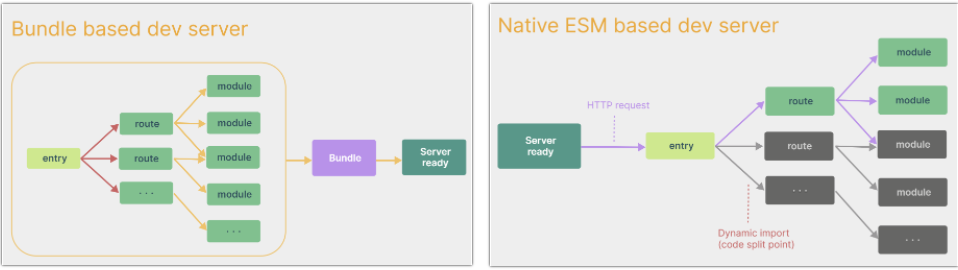
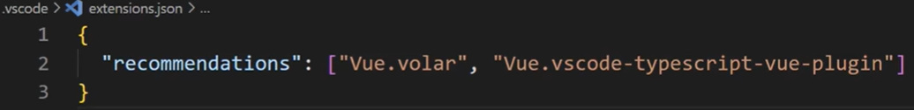
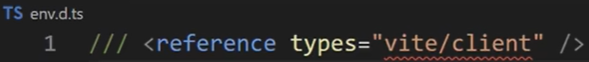
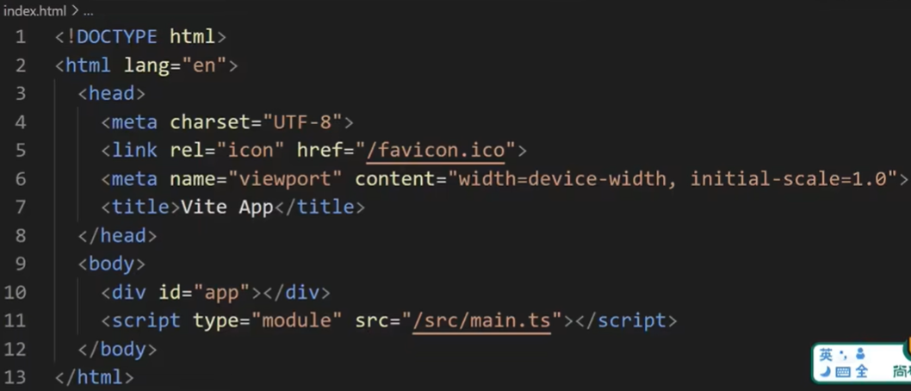
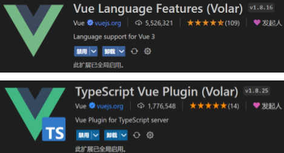

# Vue3入门到实战

核心：ref、reactive、computed、watch、生命周期等。常用：hooks、自定义ref、路由、pinia、mitt等。其它：组件通信、响应式相关API等。

## Vue3简介

在Vue3中，编码语言可以是JS，也可以是TS，实际上往往搭配着一起使用。代码风格可以是组合式API（官方推荐），也可以是选项式API。有许多简写形式，比如最重要的是`setup语法糖`。本课程采用的是`TS+组合式API+setup语法糖`的讲解方式。

2020年9月18日，`Vue.js`发布版`3.0`版本，代号：`One Piece`（海贼王）。

官方发版地址：[Release v3.0.0 One Piece · vuejs/core](https://github.com/vuejs/core/releases/tag/v3.0.0)

截止2023年10月，最新的公开版本为：`3.3.4`

### 优势

①性能的提升：打包大小减少`41%`；初次渲染快`55%`，更新渲染快`133%`；内存减少`54%`。

②源码的升级：使用`Proxy`代替`defineProperty`实现响应式；重写虚拟`DOM`的实现和`Tree-Shaking`。

③拥抱TypeScript：`Vue3`可以更好的支持`TypeScript`。

④新的特性：`Composition API`（组合式`API`），如`setup`、`ref`与`reactive`、`computed`与`watch`等；新的内置组件，如`Fragment`、`Teleport`、`Suspense`等。

⑤其它：新的生命周期钩子、`data` 选项应始终被声明为一个函数、移除`keyCode`支持作为` v-on`的修饰符等。

## 创建Vue3工程

### 基于 vue-cli 创建
[官方文档](https://cli.vuejs.org/zh/guide/creating-a-project.html#vue-create)。目前`vue-cli`已处于维护模式，官方推荐基于 `Vite` 创建项目。

```powershell
## 查看@vue/cli版本，确保@vue/cli版本在4.5.0以上
vue --version
## 安装或者升级@vue/cli 
npm install -g @vue/cli
## 执行创建命令
vue create vue_test
##  选择3.x
##  Choose a version of Vue.js that you want to start the project with (Use arrow keys)
##  > 3.x
##    2.x
## 启动
cd vue_test
npm run serve
```

### 基于vite创建
`vite` 是新一代前端构建工具，官网地址：[https://vitejs.cn](https://vitejs.cn/)。优势：

- 轻量快速的热重载（`HMR`），能实现极速的服务启动。
- 对 `TypeScript`、`JSX`、`CSS` 等支持开箱即用。
- 真正的按需编译，不再等待整个应用编译完成。
- `webpack`构建与 `vite`构建（流程）对比如下：vite是一上来就Server ready，需要看哪个模块就处理哪个模块。



具体操作：https://cn.vuejs.org/guide/quick-start.html#creating-a-vue-application

```powershell
## 1.创建命令
npm create vue@latest
## 2.具体配置
## 配置项目名称
√ Project name: vue3_test
## 是否添加TypeScript支持
√ Add TypeScript?  Yes
## 是否添加JSX支持
√ Add JSX Support?  No
## 是否添加路由环境
√ Add Vue Router for Single Page Application development?  No
## 是否添加pinia环境
√ Add Pinia for state management?  No
## 是否添加单元测试
√ Add Vitest for Unit Testing?  No
## 是否添加端到端测试方案
√ Add an End-to-End Testing Solution? » No
## 是否添加ESLint语法检查
√ Add ESLint for code quality?  Yes
## 是否添加Prettiert代码格式化
√ Add Prettier for code formatting?  No
```
**项目目录：**


1、`.vscode/extensions.json`：提示要安装的插件。



2、`public`：脚手架的根目录（放公共资源的目录？）。

3、`env.d.ts`：因为引用了相关依赖（`vite/client.d.ts`），使用`npm i`安装依赖后，则不报红。该文件的作用是让ts识别jpg、txt等文件。



4、`index.html`：在`Vite`项目中，`index.html` 是项目的入口文件，在项目最外层。不像webpack是以`main.js`或`main.ts`为入口文件的。



5、`src/main.ts`：加载`index.html`后，`Vite` 解析 `<script type="module" src="xxx">` 指向的`JavaScript`。`Vue3`中是通过`createApp` 函数创建一个应用实例。

```typescript
import {createApp} from 'vue'
import App from './App.vue'
// 创建应用和挂载应用
createApp(App).mount('#app')
```

6、`src/App.vue`：根组件。如：

```vue
<template>
  <div class="app">
    <h1>你好啊！</h1>
  </div>
</template>

<script lang="ts">
  export default {
    name:'App' // 组件名
  }
</script>

<style>
  .app {
    background-color: #ddd;
    box-shadow: 0 0 10px;
    border-radius: 10px;
    padding: 20px;
  }
</style>
```

**安装官方推荐的`vscode`插件：**



## Vue3项目可用Vue2语法

`Vue3`向下兼容`Vue2`语法，且`Vue3`中的模板中可以没有根标签。例子：

```vue
<template>
	<div class="person">
		<h2>姓名：{{ name }}</h2>
		<h2>年龄：{{ age }}</h2>
		<button @click="changeName">修改名字</button>
		<button @click="changeAge">年龄+1</button>
		<button @click="showTel">点我查看联系方式</button>
	</div>
</template>

<script lang="ts">
export default {
	name: 'App',
	data() {
		return {
			name: '张三',
			age: 18,
			tel: '13888888888'
		}
	},
	methods: {
		changeName() {
			this.name = 'zhang-san'
		},
		changeAge() {
			this.age += 1
		},
		showTel() {
			alert(this.tel)
		}
	},
}
</script>
```


## Vue3核心语法

`Vue2`的`API`设计是`Options`（配置）风格的（选项式API、配置式API）。

`Options API`的弊端：`Options`类型的 `API`，数据、方法、计算属性等，是分散在`data`、`methods`、`computed`中的，若想新增或者修改一个需求，就需要分别修改`data`、`methods`、`computed`，不便于维护和复用。

`Vue3`的`API`设计是`Composition`（组合）风格的（组合式API）。

`Composition API`的优势：可以用函数的方式，更加优雅的组织代码，让相关功能的代码更加有序的组织在一起。


## setup

### 介绍

`setup`是`Vue3`中一个新的配置项，值是一个函数，组件中所用到的数据、方法、计算属性、监视等，均配置在`setup`中。

特点：
Vue3中已经开始弱化this，`setup`中访问的`this`是`undefined`；
`setup`函数若返回一个对象，则对象中的属性、方法等，可直接在模板中直接使用；
`setup`函数若返回一个函数，则可以自定义渲染内容（页面中就只渲染返回的内容）；
`setup`函数会在`beforeCreate`之前调用，是先于所有钩子执行的。

```vue
<template>
	<div class="person">
		<h2>姓名：{{ name }}</h2>
		<h2>年龄：{{ age }}</h2>
		<button @click="changeName">修改名字</button>
		<button @click="changeAge">年龄+1</button>
		<button @click="showTel">点我查看联系方式</button>
	</div>
</template>

<script lang="ts">
export default {
	name: 'Person',
	setup() {
		console.log(this) // undefined
		// 这里的数据原来是写在data中的。此时的数据都不是响应式数据
		let name = '张三'
		let age = 18
		let tel = '13888888888'
		// 这里的方法原来是写在methods中的。
		function changeName() {
			name = 'zhang-san' // 这样修改name，name确实改了，但name不是响应式的，页面是不变化的
			console.log(name)
		}
		function changeAge() {
			age += 1
			console.log(age)
		}
		function showTel() {
			alert(tel)
		}
		return { name, age, tel, changeName, changeAge, showTel }
		// return () => '你好啊！' // 返回函数则页面只渲染返回的内容。页面只渲染`你好啊！`
	}
}
</script>
```
### 与`Options API`的关系

setup和Vue2的配置（`data`、`methods`等）可以同时存在。
在Vue2的配置中，可以访问到`setup`中的属性、方法，但在`setup`中不能访问到Vue2的配置。
如果与Vue2冲突，则`setup`优先。
建议在Vue3项目中，就不要使用Vue2的配置了。

### setup语法糖
`setup`函数有一个语法糖，可以把`setup`独立出去。示例：

```vue
<template>
	<div class="person">
		<h2>姓名：{{ name }}</h2>
		<h2>年龄：{{ age }}</h2>
		<button @click="changName">修改名字</button>
		<button @click="changAge">年龄+1</button>
		<button @click="showTel">点我查看联系方式</button>
	</div>
</template>

<!-- 下面的script里的写法是专门用于配置组件名字的 -->
<script lang="ts">
export default {
	name: 'Person',
}
</script>

<!-- 下面的写法是setup语法糖。注意，lang的值需要是同一种语言（如ts），否则报错 -->
<!-- 下面的script里的写法是专门用于配置组合式API的 -->
<script setup lang="ts">
let name = '张三'
let age = 18
let tel = '13888888888'
function changName() {
	name = '李四'
}
function changAge() {
	console.log(age)
	age += 1
}
function showTel() {
	alert(tel)
}
</script>
```
另外，如果需要在写`setup`的`script`标签上，去指定组件名字，则可借助`vite`中的插件简化：

①`npm i vite-plugin-vue-setup-extend -D`；

②在`vite.config.ts`里：

```jsx
import { defineConfig } from 'vite'
import VueSetupExtend from 'vite-plugin-vue-setup-extend'
export default defineConfig({
  plugins: [ VueSetupExtend() ]
})
```

③编写`<script setup lang="ts" name="Person">`。


## ref创建基本类型的响应式数据

作用：定义响应式变量。
语法：`let xxx = ref(初始值)`。
返回值：一个`RefImpl`的实例对象，简称`ref对象`或`ref`，`ref`对象的`value`属性是响应式的。

注意点：
`JS`中操作数据（获取和修改）需要用`xxx.value`，但模板中不需要`.value`，直接使用即可，如果写则没有效果；
对于`let name = ref('xxx')`来说，`name`不是响应式的，`name.value`才是响应式的。

```vue
<template>
	<div class="person">
		<h2>姓名：{{ name }}</h2>
		<h2>年龄：{{ age }}</h2>
		<button @click="changeName">修改名字</button>
		<button @click="changeAge">年龄+1</button>
		<button @click="showTel">点我查看联系方式</button>
	</div>
</template>

<script setup lang="ts" name="Person">
import { ref } from 'vue'
// 猜测：ref定义的，返回一个对象`{ value: '张三' }`，因为要设置get和set，而又无法在'张三'字符串这个值上面设置，所以返回一个对象，并在这个对象里的value属性上面设置。但其实可以让一个引用指向该字符串值，并在这个引用上面设置get和set，但如果返回这个引用的话，则name也不会是响应式的，而是这个引用的get的返回值。
let name = ref('张三') // name是一个`RefImpl`的实例对象，简称ref对象，它的value属性是响应式的。
let age = ref(18)
let tel = '13888888888' // tel就是一个普通的字符串，不是响应式的
function changeName() {
	name.value = '李四' // JS中操作ref对象时候需要.value
	// name不是响应式的，所以`name = ref('zhang-san')`的代码不会引起页面更新
	console.log(name.value)
}
function changeAge() {
	age.value += 1
	console.log(age.value)
}
function showTel() {
	alert(tel)
}
</script>
```
## ref创建对象类型的响应式数据

`ref`接收的数据可以是基本类型或对象类型。若`ref`接收的是对象类型，内部其实是调用了`reactive`函数。

```vue
<template>
	<div class="person">
		<h2>汽车信息：一台{{ car.brand }}汽车，价值{{ car.price }}万</h2>
		<h2>游戏列表：</h2>
		<ul>
			<li v-for="g in games" :key="g.id">{{ g.name }}</li>
		</ul>
		<h2>测试：{{ obj.a.b.c.d }}</h2>
		<button @click="changeCarPrice">修改汽车价格</button>
		<button @click="changeFirstGame">修改第一游戏</button>
		<button @click="test">测试</button>
	</div>
</template>

<script lang="ts" setup name="Person">
import { ref } from 'vue'
let car = ref({ brand: '奔驰', price: 100 })
let games = ref([
	{ id: '01', name: '英雄联盟' },
	{ id: '02', name: '王者荣耀' },
	{ id: '03', name: '原神' }
])
let obj = ref({
	a: {
		b: {
			c: {
				d: 666
			}
		}
	}
})
console.log(car)
function changeCarPrice() {
	car.value.price += 10
}
function changeFirstGame() {
	games.value[0].name = '流星蝴蝶剑'
}
function test() {
	obj.value.a.b.c.d = 999
}
</script>
```

## reactive创建对象类型的响应式数据

作用：定义一个响应式对象（但如果是基本类型则不要用它，要用`ref`，否则报错）。
语法：`let 响应式对象 = reactive(源对象)`。
返回值：一个`Proxy`的实例对象，简称`响应式对象`。

注意：`reactive`定义的响应式数据是“深层次”的。

```vue
<template>
	<div class="person">
		<h2>汽车信息：一台{{ car.brand }}汽车，价值{{ car.price }}万</h2>
		<h2>游戏列表：</h2>
		<ul>
			<li v-for="g in games" :key="g.id">{{ g.name }}</li>
		</ul>
		<h2>测试：{{ obj.a.b.c.d }}</h2>
		<button @click="changeCarPrice">修改汽车价格</button>
		<button @click="changeFirstGame">修改第一游戏</button>
		<button @click="test">测试</button>
	</div>
</template>
<script lang="ts" setup name="Person">
import { reactive } from 'vue'
// 猜测：reactive定义的，返回一个对象，但对象本身不是响应式的，而对象里面的属性才是响应式的。因为返回的对象，就算给它一个引用，并在这个引用上面设置get和set，那如果返回这个引用的话，则这个引用本身也不会是响应式的，而是这个引用的get的返回值，而且只能是这个（对象）引用里面的属性才是响应式的。
let car = reactive({ brand: '奔驰', price: 100 })
let games = reactive([
	{ id: '01', name: '英雄联盟' },
	{ id: '02', name: '王者荣耀' },
	{ id: '03', name: '原神' }
])
let obj = reactive({
	a: {
		b: {
			c: {
				d: 666
			}
		}
	}
})
// 注意：如果新定义一个引用a，如`let { a } = obj`，则虽然`obj.a`是响应式的，但解构之后的a却不是响应式的（修改a后，页面不会变化）。猜测：因为这个新定义的a的值是`obj.a`的get的返回值，这个返回值不是响应式的。
function changeCarPrice() {
	car.price += 10
}
function changeFirstGame() {
	games[0].name = '流星蝴蝶剑'
}
function test() {
	obj.a.b.c.d = 999
}
// 注意，如果reactive定义的对象里面，存在某属性的属性值为ref定义的数据。
let obj1 = reactive({
	a: 1,
	b: ref(3)
})
console.log(obj1.a) // 1
console.log(obj1.b) // 3 // 获取该属性值是通过reactive定义的对象点出来的，则获取该属性值无需通过`.value`获取
console.log(obj1.b.value) // undefined
</script>
```
## ref对比reactive

区别：

①使用`ref`创建的变量必须使用`.value`（可以使用`volar`插件自动添加`.value`）。 

②给`reactive`重新分配一个新对象，会失去响应式（可以使用`Object.assign`去整体替换）。如：

```typescript
。。。。。。
const car = reactive({ brand: '奔驰', price: 100 })
function changeCar() {
	// car = { brand: '奥拓', price: 1 } // 这样写页面不更新
	// car = reactive({ brand: '奥拓', price: 1 }) // 这样写页面不更新
	Object.assign(car, { brand: '奥拓', price: 1 }) // 页面更新
}
```

③使用`ref`创建的对象变量可以直接重新分配一个新对象。如：

```typescript
。。。。。。
const car = ref({ brand: '奔驰', price: 100 })
function changeCar() {
	car.value = { brand:'奥拓', price:1 } // 页面更新
}
```

使用原则：若需要一个基本类型的响应式数据，必须使用`ref`；若需要一个响应式对象，层级不深，则`ref`或`reactive`都可以；若需要一个响应式对象，且层级较深，推荐使用`reactive`。

## toRefs与toRef

作用：将一个响应式对象中的每一个属性，转换为`ref`对象。`toRefs`与`toRef`功能一致，但`toRefs`可以批量转换。示例：

```vue
<template>
	<div class="person">
		<h2>姓名：{{ person.name }}</h2>
		<h2>年龄：{{ person.age }}</h2>
		<h2>性别：{{ person.gender }}</h2>
		<!-- 经过toRefs之后，也可以单独写，是响应式的 -->
		<h2>姓名：{{ name }}</h2>
		<h2>年龄：{{ age }}</h2>
		<h2>性别：{{ gender }}</h2>
		<button @click="changeName">修改名字</button>
		<button @click="changeAge">修改年龄</button>
		<button @click="changeGender">修改性别</button>
	</div>
</template>

<script lang="ts" setup name="Person">
import { ref, reactive, toRefs, toRef } from 'vue'
let person = reactive({ name: '张三', age: 18, gender: '男' })
// toRefs接收一个由reactive定义的一个响应式对象，并把响应式对象里的每一组键值对，重整形成新对象
// 通过toRefs将person对象中的n个属性批量取出，且依然保持响应式的能力
let { name, gender } = toRefs(person) // 后面如果改了name或gender，则person里的name或gender也会跟着变
console.log(toRefs(person)) // { name: ObjectRefImpl, gender: ObjectRefImpl }
console.log(name) // 一个`ObjectRefImpl`的实例对象
// 通过toRef将person对象中的gender属性（单独）取出，且依然保持响应式的能力
let age = toRef(person, 'age') // 后面如果改了age，则person里的age也会跟着变
function changeName() {
	name.value += '~' // 注意，经过toRefs（并解构）之后，要加上`.value`
}
function changeAge() {
	age.value += 1
}
function changeGender() {
	gender.value = '女'
}
</script>
```


## computed

computed是一个函数，要求必须有返回值；有缓存特性。

作用：根据已有数据计算出新数据。  

```vue
<template>
	<div class="person">
		姓：<input type="text" v-model="firstName"> <br>
		名：<input type="text" v-model="lastName"> <br>
		全名：<span>{{ fullName }}</span> <br>
		<button @click="changeFullName">全名改为：li-si</button>
	</div>
</template>

<script setup lang="ts" name="App">
import { ref, computed } from 'vue'
let firstName = ref('zhang')
let lastName = ref('san')
// 计算属性写法一：只能读取，不能修改，否则控制台输出警告`Write operation failed: computed value is readonly`
// let fullName = computed(() => {
//   return firstName.value + '-' + lastName.value
// })
// 计算属性写法二：既能读取，又能修改
let fullName = computed({
	get() { // 读取
		return firstName.value + '-' + lastName.value
	},
	set(val) { // 修改
		console.log(val) // li-si
		firstName.value = val.split('-')[0]
		lastName.value = val.split('-')[1] // 修改后，fullName才真正修改。
	}
})
function changeFullName() {
	console.log(fullName) // 一个`ComputedRefImpl`的实例对象
	fullName.value = 'li-si' // 该修改不会让页面的fullName显示发生变化，而是把该值传到计算属性的set方法。
} 
</script>
```


## watch

作用：监视数据的变化。

`Vue3`中的`watch`只能监视以下四种数据：①`ref`定义的数据。②`reactive`定义的数据。③返回一个值的函数（`getter`函数）。④一个包含上述内容的数组。

在使用时，通常会遇到的情况：

**①监视`ref`定义的【基本类型】数据：直接写数据名即可，监视的是其`value`值的改变。**

```vue
<template>
	<div class="person">
		<h2>当前求和为：{{ sum }}</h2>
		<button @click="changeSum">点我sum+1</button>
	</div>
</template>

<script lang="ts" setup name="Person">
import { ref, watch } from 'vue'
let sum = ref(0)
function changeSum() {
	sum.value += 1
}
// 调用watch，返回一个函数
const stopWatch = watch(sum, (newValue, oldValue) => {
	console.log('sum变化了', newValue, oldValue)
	if (newValue >= 10) {
		stopWatch() // 停止监视
	}
})
</script>
```
**②监视`ref`定义的【对象类型】数据：直接写数据名，监视的是对象的【地址值】，若想监视对象内部的数据，则要手动开启深度监视。**

注意：若修改的是`ref`定义的对象中的属性，则`newValue` 和 `oldValue` 都是新值，是同一个对象（修改后的）；若修改整个`ref`定义的对象，`newValue` 是新值，`oldValue` 是旧值，因为不是同一个对象。

```vue
<template>
	<div class="person">
		<h2>姓名：{{ person.name }}</h2>
		<h2>年龄：{{ person.age }}</h2>
		<button @click="changeName">修改名字</button>
		<button @click="changeAge">修改年龄</button>
		<button @click="changePerson">修改整个人</button>
	</div>
</template>

<script lang="ts" setup name="Person">
import { ref, watch } from 'vue'
let person = ref({
	name: '张三',
	age: 18
})
function changeName() {
	person.value.name += '~'
}
function changeAge() {
	person.value.age += 1
}
function changePerson() {
	person.value = { name: '李四', age: 90 }
}
// 第一个参数是被监视的数据；第二个参数是监视的回调；第三个参数是配置对象（deep、immediate等）。
watch(person, (newValue, oldValue) => {
	console.log('person变化了', newValue, oldValue)
}, { deep: true }) // 如果不开启深度监视，则单独修改对象里的属性是不会触发回调函数的。

</script>
```
**③监视`reactive`定义的【对象类型】数据（默认开启深度监视，且不可以关闭）。**

```vue
<template>
	<div class="person">
		<h2>姓名：{{ person.name }}</h2>
		<h2>年龄：{{ person.age }}</h2>
		<button @click="changeName">修改名字</button>
		<button @click="changeAge">修改年龄</button>
		<button @click="changePerson">修改整个人</button>
	</div>
</template>

<script lang="ts" setup name="Person">
import { reactive, watch } from 'vue'
let person = reactive({
	name: '张三',
	age: 18
})
function changeName() {
	person.name += '~'
}
function changeAge() {
	person.age += 1
}
function changePerson() {
	Object.assign(person, { name: '李四', age: 80 })
}
watch(person, (newValue, oldValue) => { // 对于person本身，因为是reactive定义的，所以不能重新赋值，也无法监听person本身的变化
	console.log('person变化了', newValue, oldValue)
})
</script>
```
**④监视`ref`或`reactive`定义的【对象类型】数据中的某个属性。**

若该属性值不是【对象类型】，则要写成函数形式；
若该属性值是是【对象类型】，则可以直接编写（可以监听该对象里的属性，但无法监听该对象本身），也可写成函数形式（无法监听该对象里的属性，但可以监听该对象本身），建议写成函数形式并手动开启深度监视（可以监听该对象里的属性，也可以监听该对象本身）。

```vue
<template>
	<div class="person">
		<h2>姓名：{{ person.name }}</h2>
		<h2>年龄：{{ person.age }}</h2>
		<h2>汽车：{{ person.car.c1 }}、{{ person.car.c2 }}</h2>
		<button @click="changeName">修改名字</button>
		<button @click="changeAge">修改年龄</button>
		<button @click="changeC1">修改第一台车</button>
		<button @click="changeC2">修改第二台车</button>
		<button @click="changeCar">修改整个车</button>
	</div>
</template>

<script lang="ts" setup name="Person">
import { reactive, watch } from 'vue'
let person = reactive({
	name: '张三',
	age: 18,
	car: {
		c1: '奔驰',
		c2: '宝马'
	}
})
function changeName() {
	person.name += '~'
}
function changeAge() {
	person.age += 1
}
function changeC1() {
	person.car.c1 = '奥迪'
}
function changeC2() {
	person.car.c2 = '大众'
}
function changeCar() {
	person.car = { c1: '雅迪', c2: '爱玛' }
}
watch(() => person.name, (newValue, oldValue) => {
	console.log('person.name变化了', newValue, oldValue)
})
watch(() => person.car, (newValue, oldValue) => { // 写成函数形式
	console.log('person.car变化了', newValue, oldValue)
}, { deep: true }) // 手动开启深度监视
</script>
```
**⑤监视上述的多个数据。**

```vue
<template>
。。。。。。
watch([ () => person.name, person.car ], (newValue, oldValue) => {
	console.log('person.car变化了', newValue, oldValue)
}, {deep: true })
</script>
```
## watchEffect

立即运行一个函数，同时响应式地追踪其依赖，并在依赖更改时重新执行该函数。

`watch`和`watchEffect`都能监听响应式数据的变化，不同的是监听数据变化的方式不同。
`watch`要明确指出监视的数据；`watchEffect`不用明确指出监视的数据（函数中用到哪些属性就监视哪些属性）。

```vue
<template>
	<div class="person">
		<h1>需求：水温达到50℃，或水位达到20cm，则联系服务器</h1>
		<h2 id="demo">水温：{{ temp }}</h2>
		<h2>水位：{{ height }}</h2>
		<button @click="changePrice">水温+1</button>
		<button @click="changeSum">水位+10</button>
	</div>
</template>

<script lang="ts" setup name="Person">
import { ref, watch, watchEffect } from 'vue'
let temp = ref(0)
let height = ref(0)
function changePrice() {
	temp.value += 10
}
function changeSum() {
	height.value += 1
}
const stopWtach = watchEffect(() => {
	if (temp.value >= 50 || height.value >= 20) { // 室温达到50，或水位达到20，立刻联系服务器
		console.log(document.getElementById('demo')?.innerText)
		console.log('联系服务器')
	}
	if (temp.value === 100 || height.value === 50) { // 水温达到100，或水位达到50，取消监视
		console.log('清理了')
		stopWtach()
	}
})
</script>
```


## 标签的ref属性

用于注册模板引用。用在普通`DOM`标签上，获取的是`DOM`节点；用在组件标签上，获取的是组件实例对象。

```vue
案例一：
<template>
	<div class="person">
		<h1 id="title1">尚硅谷</h1>
		<h2 ref="title2">前端</h2>
		<h3 ref="title3">Vue</h3>
		<input type="text" ref="inpt"> <br><br>
		<button @click="showLog">点我打印内容</button>
	</div>
</template>

<script lang="ts" setup name="Person">
import { ref } from 'vue'
let title2 = ref()
let title3 = ref()
function showLog() {
	const t1 = document.getElementById('title1') // 通过id获取元素
	console.log((t1 as HTMLElement).innerText)
	console.log((<HTMLElement>t1).innerText)
	console.log(t1?.innerText)
	console.log(title2.value) // 通过ref获取元素
	console.log(title3.value)
}
</script>
```

```vue
案例二：
<!-- 父组件App.vue -->
<template>
	<Person ref="ren" />
	<button @click="test">测试</button>
</template>
<script lang="ts" setup name="App">
import Person from './components/Person.vue'
import { ref } from 'vue'
let ren = ref()
function test() {
	console.log(ren.value.name) // 张三
	console.log(ren.value.age) // 18
    // ren.value.age = 1 // 可以修改子组件的数据
}
</script>

<!-- 子组件Person.vue -->
<script lang="ts" setup name="Person">
import { ref, defineExpose } from 'vue'
let name = ref('张三')
let age = ref(18)
// 要使用defineExpose暴露内容，将组件中的数据交给外部
defineExpose({name,age}) // defineXXX一般都属于宏函数，在Vue3中可以无需引入，直接使用即可
</script>
```


## props

```vue
<!-- 父组件App.vue -->
<template>
	<Person :list="personList3" />
</template>
<script lang="ts" setup name="App">
import Person from './components/Person.vue'
import { reactive } from 'vue'
// 回顾Typescript：
/* 
	// src/types/index.ts
	// 定义一个接口，用于限定person对象的具体属性
	export interface PersonInter {
			id:string,
			name:string,
			age:number,
			x?:number // ?表示该属性可写可不写（可有可无）
	}
	// 一个自定义类型
	// export type Persons = Array<PersonInter>
	export type Persons = PersonInter[]
*/
import { type PersonInter, type Persons } from '@/types' // 对于TS的内容的导入，需要加type
// 使用接口
let person: PersonInter = { id: '01', name: '张三', age: 60 }
// 使用泛型
// 或写成：let personList1:Array<PersonInter> = [
let personList1: Persons = [ // 如果出现不规范，则数组里的具体的位置报红色波浪线
	{ id: '02', name: '李四', age: 18 },
	{ id: '03', name: '王五', age: 5 }
]
let personList2: Persons = reactive([ // 如果出现不规范，则personList2报红色波浪线
	{ id: '02', name: '李四', age: 18 },
	{ id: '03', name: '王五', age: 5 }
])
let personList3 = reactive<Persons>([ // 如果出现不规范，则数组里的具体的位置报红色波浪线
	{ id: '02', name: '李四', age: 18 },
	{ id: '03', name: '王五', age: 5, x: 9 }
])
</script>

<!-- 子组件Person.vue -->
<template>
	<div class="person">
		<ul>
			<li v-for="item in list" :key="item.id">
				{{ item.name }}--{{ item.age }}
			</li>
		</ul>
	</div>
</template>
<script lang="ts" setup name="Person">
import { defineProps } from 'vue' // 也可以不引入
import { type Persons } from '@/types'
// 写法一：仅接收
// const props = defineProps(['list'])
// 在JS逻辑里使用：props.list
// 写法二：接收+限制类型（如果限制类型，则必须传递）
// defineProps<{ list: Persons }>()
// 写法三：接收+限制类型+限制必要性（使用`?`则可传可不传）+指定默认值
const props = withDefaults(defineProps<{ list?: Persons }>(), {
	list: () => [ { id: 'a01', name: '一一', age: 18 } ]
})
console.log(props)
</script>
```


## 生命周期

`Vue`组件实例在创建时要经历一系列的初始化步骤，在此过程中`Vue`会在合适的时机，调用特定的函数，从而让开发者有机会在特定阶段运行自己的代码，这些特定的函数统称为生命周期钩子。

Vue2的生命周期整体分为四个阶段，分别是创建（`beforeCreate`、`created`）、挂载（`beforeMount`、`mounted`）、更新（`beforeUpdate`、`updated`）、销毁（`beforeDestroy`、`destroyed`）。

Vue3的生命周期：创建阶段（`setup`）、挂载阶段（`onBeforeMount`、`onMounted`）、更新阶段（`onBeforeUpdate`、`onUpdated`）、卸载阶段（`onBeforeUnmount`、`onUnmounted`）。
常用的钩子：挂载完毕（`onMounted`）、更新完毕（`onUpdated`）、卸载之前（`onBeforeUnmount`）。

```vue
<template>
	<div class="person">
		<h2>当前求和为：{{ sum }}</h2>
		<button @click="changeSum">点我sum+1</button>
	</div>
</template>

<script lang="ts" setup name="Person">
import {
	ref,
	onBeforeMount,
	onMounted,
	onBeforeUpdate,
	onUpdated,
	onBeforeUnmount,
	onUnmounted
} from 'vue'
let sum = ref(0)
function changeSum() {
	sum.value += 1
}
console.log('setup')
onBeforeMount(() => {
	console.log('挂载之前')
})
onMounted(() => {
	console.log('挂载完毕')
})
onBeforeUpdate(() => {
	console.log('更新之前')
})
onUpdated(() => {
	console.log('更新完毕')
})
onBeforeUnmount(() => {
	console.log('卸载之前')
})
onUnmounted(() => {
	console.log('卸载完毕')
})
</script>
```


## 自定义hook

自定义`hook`本质是一个函数，把`setup`函数中使用的`Composition API`进行了封装（类似于`vue2.x`中的`mixin`）。
优势：复用代码，让`setup`中的逻辑更清楚易懂。

```js
// src/hooks/useSum.ts（跟Sun相关的功能，写在该文件，文件以`use`开头）
import { ref, onMounted } from 'vue'
export default function () {
	let sum = ref(0)
	const increment = () => {
		sum.value += 1
	}
	const decrement = () => {
		sum.value -= 1
	}
	onMounted(() => { // 可以写钩子函数
		increment()
	})
	return { sum, increment, decrement } // 向外部暴露数据，也可以暴露计算属性。
}		
```

```js
// src/hooks/useDog.ts
import { reactive, onMounted } from 'vue'
import axios, { AxiosError } from 'axios'
export default function () {
	let dogList = reactive<string[]>([])
	async function getDog() {
		try {
			let { data } = await axios.get('https://dog.ceo/api/breed/pembroke/images/random')
			dogList.push(data.message)
		} catch (error) {
			const err = <AxiosError>error
			console.log(err.message)
		}
	}
	onMounted(() => {
		getDog()
	})
	return { dogList, getDog }
}
```

```vue
<!-- src/App.vue -->
<template>
	<h2>当前求和为：{{ sum }}</h2>
	<button @click="increment">点我+1</button>
	<button @click="decrement">点我-1</button>
	<hr>
	
	<span v-show="dogList.isLoading">加载中......</span><br>
	<button @click="getDog">再来一只狗</button>
</template>

<script lang="ts">
import { defineComponent } from 'vue'

export default defineComponent({
	name: 'App',
})
</script>

<script setup lang="ts">
import useSum from './hooks/useSum'
import useDog from './hooks/useDog'

let { sum, increment, decrement } = useSum()
let { dogList, getDog } = useDog()
</script>
```


# 路由

## 基本案例

```js
// src/router/index.ts（路由配置文件）
import { createRouter, createWebHistory, createWebHashHistory } from 'vue-router'
import Home from '@/pages/Home.vue'
import News from '@/pages/News.vue'
import About from '@/pages/About.vue'
import Detail from '@/pages/Detail.vue'
const router = createRouter({
	history: createWebHistory(), // history模式。另外，hash模式则是createWebHashHistory()
	routes: [
		{
			name: 'zhuye',
			path: '/home',
			component: Home
		},
		{
			name: 'xinwen',
			path: '/news',
			component: News,
			children: [
				{
					name: 'xiang',
					// 子级路由无需在前面加`/`
					path: 'detail',
					component: Detail
				}
				// params参数传参示例：
				// {
				// 	name: 'xiang',
				// 	// 占位的属性，在传参时必须要传。如果加`?`，则对应的属性就可传可不传。
				// 	// 如`'detail/:id/:title/:content?'`，代表content可传可不传。
				// 	path: 'detail/:id/:title/:content',
				// 	component: Detail,
				// 	// 路由的props配置：
				// 	// ①props的对象写法。作用：把对象中的每一组key-value作为props传给Detail组件（路由组件）。
				// 	// props: { a: 1, b: 2, c: 3 }, 
				// 	// ②props的函数写法。作用：把返回的对象中的每一组key-value作为props传给Detail组件。
				// 	// props(route) { // 参数route是路由对象
				// 	// 	return route.query
				// 	// },
				// 	// ③props的布尔值写法。作用：把收到的每一组params参数，作为props传给Detail组件。
				// 	// props: true, // 相当于props(route) => route.params
				// }
			]
		},
		{
			name: 'guanyu',
			path: '/about',
			component: About
		}
	]
})
export default router
```

```js
// src/main.ts
import { createApp } from 'vue' // 引入createApp用于创建应用
import App from './App.vue' // 引入App根组件
import router from './router' // 引入路由器
const app = createApp(App) // 创建一个应用
app.use(router) // 使用路由器
app.mount('#app') // 挂载整个应用到app容器中
```

```vue
<!-- src/App.vue -->
<template>
	<div class="app">
		<h2 class="title">Vue路由测试</h2>
		<!-- 导航区 -->
		<div class="navigate">
			<RouterLink to="/home" active-class="active">首页</RouterLink>
			<RouterLink to="/news" active-class="active">新闻</RouterLink>
			<RouterLink to="/about" active-class="active">关于</RouterLink>
		</div>
		<!-- 展示区 -->
		<div class="main-content">
			<RouterView></RouterView>
		</div>
	</div>
</template>

<script lang="ts" setup name="App">
import { RouterLink, RouterView } from 'vue-router'  
</script>
```

```vue
<!-- src/pages/News.vue -->
<template>
	<div class="news">
		<ul>
			<li v-for="news in newsList" :key="news.id">
				<!-- query参数传参示例： -->
				<!-- 写法一 -->
				<!-- <RouterLink :to="`/news/detail?id=${news.id}&title=${news.title}&content=${news.content}`">
					{{ news.title }}
					</RouterLink> -->
				<!-- 写法二：query参数会在url路径上；`path: '/news/detail'`也可以通过命名路由的写法`name: 'xiang'` -->
				<RouterLink
					:to="{
						path: '/news/detail',
						query: {
							id: news.id,
							title: news.title,
							content: news.content
						}
					}"
				>
					{{ news.title }}
				</RouterLink>
				<!-- params参数传参示例： -->
				<!-- 写法一 -->
				<!-- <RouterLink :to="`/news/detail/${news.id}/${news.title}/${news.content}`">
					{{ news.title }}
					</RouterLink> -->
				<!-- 写法二：只能通过命名路由的写法`name: 'xiang'`，否则控制台会有忽略的警告，且点击后会有问题；params里面的属性的属性值不能传对象和数组；如果路由配置里有相关属性的占位（除非有`?`，则可传可不传），则该属性及其属性值就必须要传，否则报错 -->
				<RouterLink
					:to="{
						name: 'xiang',
						params: {
							id: news.id,
							title: news.title,
							content: news.content
						}
					}"
				>
					{{ news.title }}
				</RouterLink>
			</li>
		</ul>
		<!-- 展示区 -->
		<div class="news-content">
			<RouterView />
			<!-- 或写成<RouterView></RouterView> -->
		</div>
	</div>
</template>
。。。。。。
```

```vue
<!-- src/pages/Detail.vue -->
<template>
	<ul class="news-list">
		<!-- query参数示例： -->
		<li>编号：{{ route.query.id }}</li>
		<li>标题：{{ route.query.title }}</li>
		<li>内容：{{ route.query.content }}</li>
		<li>编号：{{ query.id }}</li>
		<li>标题：{{ query.title }}</li>
		<li>内容：{{ query.content }}</li>
		<!-- params参数示例： -->
		<!-- <li>编号：{{ route.params.id }}</li>
		<li>标题：{{ route.params.title }}</li>
		<li>内容：{{ route.params.content }}</li>
		<li>编号：{{ params.id }}</li>
		<li>标题：{{ params.title }}</li>
		<li>内容：{{ params.content }}</li> -->
		<!-- 路由的props配置： -->
		<!-- <li>编号：{{ id }}</li>
		<li>标题：{{ title }}</li>
		<li>内容：{{ content }}</li> -->
	</ul>
</template>
<script setup lang="ts" name="About">
import { toRefs } from 'vue'
import { useRoute } from 'vue-router'
let route = useRoute()
// 接收query参数：
console.log(route.query)
let { query } = toRefs(route)
// 接收params参数：
// console.log(route.params)
// let { params } = toRefs(route)
// 路由的props配置：
// defineProps(['id', 'title', 'content'])
</script>
<style scoped>
。。。。。。
</style>
```

注意：路由组件通常存放在`pages`或`views`文件夹，一般组件通常存放在`components`文件夹；通过点击导航，视觉效果上“消失” 的路由组件，默认是被**卸载**掉的，需要的时候再**挂载**。

## 路由器工作模式

①`history`模式。

优点：`URL`更加美观，不带有`#`，更接近传统的网站`URL`。缺点：后期项目上线，需要服务端配合处理路径问题，否则刷新会有`404`错误。

②`hash`模式。

优点：兼容性更好，因为不需要服务器端处理路径。缺点：`URL`带有`#`不太美观，且在`SEO`优化方面相对较差（所以`hash`模式的常用于后台项目，而`history`模式的常用于C端项目）。

## replace属性

作用：控制路由跳转时，操作浏览器的历史记录的模式。

浏览器的历史记录有两种写入方式：`push`和`replace`。`push`是追加历史记录（默认值）；`replace`是替换当前记录。

开启`replace`模式：如`<RouterLink replace to="/news" active-class="active">新闻</RouterLink>`。

## to的写法

```vue
<!-- to的字符串写法 -->
<router-link to="/home" active-class="active">主页</router-link>

<!-- to的对象写法 -->
<router-link :to="{ path: '/home' }" active-class="active">Home</router-link>
或通过命名路由（给路由规则命名，可以简化路由跳转及传参）的写法（to的对象写法配合name属性）：
<router-link :to="{ name: 'guanyu' }">跳转</router-link>

<!-- 嵌套路由（步骤：编写相关的子路由；配置路由规则，使用`children`配置项；写跳转路由（如下）；在相关组件预留个`<router-view>`）的写法 -->
<router-link to="/news/detail">跳转</router-link>
<router-link :to="{ path: '/news/detail' }">xxxx</router-link>
```

## 路由传参

①query参数。

②params参数。注意：传递`params`参数时，若使用`to`的对象写法，则必须使用`name`配置项，不能用`path`；传递`params`参数时，需要提前在规则中占位。

## 路由的props配置

作用：让路由组件更方便的收到参数（可以将路由参数作为`props`传给组件）。

## 重定向

作用：将特定的路径，重新定向到已有路由。例子：

```js
// src/router/index.ts
。。。。。。
		},
		{
			path: '/',
			redirect: '/home'
		}
。。。。。。
```

## 编程式导航

路由组件的两个重要的属性：`$route`和`$router`，即变成了两个`hooks`。

编程式路由导航，能够实现脱离`<RouterLink>`并实现路由跳转。在Vue2里，重复跳转会报错，而在Vue3里则不会。例子：

```js
。。。。。。
import { useRouter } from 'vue-router'
const router = useRouter()
console.log(router.push)
console.log(router.replace)
// router.push('/') // push所传的参数包含了RouterLink的to的写法，即能字符串形式，也能写对象形式。
interface NewsInter {
    id: string,
    title: string,
    content: string
}

function showNewsDetail(news: NewsInter) { // 或简单地直接写`function showNewsDetail(news: any) {`
	router.push({
		name: 'xiang',
		query: {
			id: news.id,
			title: news.title,
			content: news.content
		}
	})
}
```


# 组件通信

`Vue3`和`Vue2`的组件通信的区别：

①移出事件总线，使用`mitt`代替；②`vuex`换成了`pinia`；③把`.sync`优化到`v-model`里面；④把`$listeners`所有的东西，合并到`$attrs`中；⑤`$children`被砍掉了。

**常见搭配形式：**

①父传子。props；v-model；$refs；默认插槽、具名插槽。

②子传父。props；自定义事件；v-model；$parent；作用域插槽。

③祖传孙、孙传祖。$attrs；provide、inject。

④兄弟间、任意组件间。mitt；pinia。 

## props

`props`是使用频率最高的一种通信方式，常用于父传子。若父传子，则属性值是**非函数**；若 子传父，则属性值是**函数**。

```vue
<!-- src/pages/props/Father.vue -->
<template>
	<div class="father">
		<h3>父组件</h3>
		<h4>父的东西：{{ car }}</h4>
		<h4>子给的东西：{{ toy }}</h4>
		<Child :car="car" :sendToy="getToy" />
	</div>
</template>
<script setup lang="ts" name="Father">
import Child from './Child.vue'
import { ref } from 'vue'
const car = ref('大大')
const toy = ref('')
function getToy(value: string) {
	toy.value = value
}
</script>

<!-- src/pages/props/Child.vue -->
<template>
	<div class="child">
		<h3>子组件</h3>
		<h4>子的东西：{{ toy }}</h4>
		<h4>父给子的东西：{{ car }}</h4>
		<button @click="sendToy(toy)">玩具给父亲</button>
	</div>
</template>
<script setup lang="ts" name="Child">
import { ref } from 'vue'
defineProps(['car', 'sendToy'])
const toy = ref('小小')
</script>
```

## 自定义事件

自定义事件常用于子传父。

注意：原生事件的事件名是特定的（`click`、`mosueenter`等），其事件对象`$event`是包含事件相关信息的对象（`pageX`、`pageY`、`target`、`keyCode`等）；自定义事件的事件名是任意名称，事件对象`$event`是调用`emit`时所提供的数据，可以是任意类型。

```html
<template>
	<div class="father">
		<h3>父组件</h3>
		<h4>子给的东西：{{ toy }}</h4>
		<!-- 在父组件中，给子组件绑定自定义事件： -->
		<Child @send-toy="saveToy" />
	</div>
</template>
<script setup lang="ts" name="Father">
import Child from './Child.vue'
import { ref } from 'vue'
const toy = ref('')
function saveToy(value: string) {
	console.log('saveToy', value)
	toy.value = value
}
</script>

<template>
	<div class="child">
		<h3>子组件</h3>
		<h4>东西：{{ toy }}</h4>
		<!-- 子组件中，触发事件： -->
		<button @click="emit('send-toy', toy)">测试</button>
	</div>
</template>
<script setup lang="ts" name="Child">
import { ref } from 'vue'
const emit = defineEmits([ 'send-toy' ]) // 声明事件
const toy = ref('小小')
</script>
<style scoped></style>
```

## v-model

`v-model`指令用于实现父子之间相互通信。

```vue
<template>
	<div class="father">
		<h3>父组件</h3>
		<h4>{{ userName }}</h4>
		<h4>{{ password }}</h4>
		<!-- 1、`v-model`用在html标签上： -->
		<!-- <input type="text" v-model="userName"> -->
		<!-- `v-model`的本质 -->
		<!-- <input type="text" :value="userName" @input="userName = (<HTMLInputElement>$event.target).value"> -->
		<!-- 2、`v-model`用在组件标签上： -->
		<!-- <AtguiguInput v-model="userName" /> -->
		<!-- 组件标签上的`v-model`的本质是`:moldeValue`和`update:modelValue`事件 -->
		<!-- <AtguiguInput :modelValue="userName" @update:modelValue="userName = $event" /> -->
		<!-- 3、可以更换`value`，也可以在组件标签上多次使用`v-model` -->
		<AtguiguInput v-model:ming="userName" v-model:mima="password" />
		<!-- 本质 -->
		<!-- <AtguiguInput :ming="userName" @update:ming="userName = $event" :mima="password" @update:mima="password = $event" /> -->
	</div>
</template>
<script setup lang="ts" name="Father">
import AtguiguInput from './AtguiguInput.vue'
import { ref } from 'vue'
const userName = ref('wang')
const password = ref('123456')
</script>

<template>
	<div class="box">
		<!-- 将接收的value值赋给input元素的value属性，目的是呈现数据；给input元素绑定原生input事件，触发input事件时，进而触发`update:modelValue`事件 -->
		<!-- <input type="text" :value="modelValue" @input="emit('update:modelValue', (<HTMLInputElement>$event.target).value)"> -->
		<input type="text" :value="ming" @input="emit('update:ming', (<HTMLInputElement>$event.target).value)">
		<input type="text" :value="mima" @input="emit('update:mima', (<HTMLInputElement>$event.target).value)">
	</div>
</template>
<script setup lang="ts" name="AtguiguInput">
// defineProps([ 'modelValue' ])
// const emit = defineEmits([ 'update:modelValue' ])
defineProps(['ming', 'mima'])
const emit = defineEmits(['update:ming', 'update:mima'])
</script>
```


## mitt

跟消息的订阅和发布（`pubsub`）功能类似，可以实现任意组件间通信。安装`mitt`：`npm i mitt`。

```javascript
// src/utils/emitter.ts
// 引入mitt
import mitt from 'mitt'
const emitter = mitt() // 创建emitter，可用于绑定事件、触发事件
// emitter.all // 拿到所有绑定的事件
// emitter.emit // 触发某一个事件
// emitter.off // 解绑某一个事件
// emitter.on // 绑定某一个事件
/*
	// 绑定事件
	emitter.on('abc', (value) => {
		console.log('abc事件被触发', value)
	})
	emitter.on('xyz', (value) => {
		console.log('xyz事件被触发', value)
	})
	setInterval(() => {
		// 触发事件
		emitter.emit('abc', 666)
		emitter.emit('xyz', 777)
	}, 1000);
	setTimeout(() => {
		// emitter.off('test1') // 解绑某个事件
		emitter.all.clear() // 清理事件
	}, 3000);
*/
export default emitter // 暴露mitt
```

```typescript
<!-- 子组件1：接收数据的组件 -->
import { ref, onUnmounted } from "vue";
import emitter from "@/utils/emitter";
let toy = ref('')
emitter.on('send-toy',(value) => { // 绑定事件
	toy.value = value
})
onUnmounted(()=>{
  emitter.off('send-toy') // 在销毁前解绑事件
})
```

```javascript
<!-- 子组件2：提供数据的组件 -->
import { ref } from "vue";
import emitter from '@/utils/emitter'
let toy = ref('小小的')
function sendToy() {
	emitter.emit('send-toy', toy.value) // 触发事件
}
```

## $attrs

`$attrs`用于实现**当前组件的父组件**向**当前组件的子组件**通信，即祖传孙。

`$attrs`是一个对象，包含所有父组件传入的标签属性，但`$attrs`会自动排除`props`中声明的属性（可认为声明过的`props`被子组件自己“消费”了）。

```vue
<template>
	<div class="father">
		<h3>父组件</h3>
		<!-- `v-bind="{ x: 100, y: 200 }"`相当于`:x="100" :y="200"` -->
		<Child :a="a" :b="b" :c="c" :d="d" v-bind="{ x: 100, y: 200 }" />
		<!-- <Child :a="a" :b="b" :c="c" :d="d" v-bind="{ x: 100, y: 200 }" :updateA="updateA" /> -->
	</div>
</template>
<script setup lang="ts" name="Father">
import Child from './Child.vue'
import { ref } from 'vue'
const a = ref(1)
const b = ref(2)
const c = ref(3)
const d = ref(4)
// function updateA(value) {
// 	a.value += value
// }
</script>

<template>
	<div class="child">
		<h3>子组件</h3>
		<!-- $attrs为{ "b": 2, "c": 3, "d": 4, "x": 100, "y": 200 } -->
		<GrandChild v-bind="$attrs" />
	</div>
</template>
<script setup lang="ts" name="Child">
import GrandChild from './GrandChild.vue'
defineProps([ 'a' ]) // 如果不接收，则props里的所有参数都会到$attrs里
</script>

<template>
	<div class="grand-child">
		<h3>孙组件</h3>
		<h4>b：{{ b }}</h4>
		<h4>c：{{ c }}</h4>
		<h4>d：{{ d }}</h4>
		<h4>x：{{ x }}</h4>
		<h4>y：{{ y }}</h4>
		<!-- <button @click="updateA(6)">点我将更新父组件的a，并又传回孙组件</button> -->
	</div>
</template>
<script setup lang="ts" name="GrandChild">
defineProps(['a', 'b', 'c', 'd', 'x', 'y'])
// defineProps(['a', 'b', 'c', 'd', 'x', 'y', 'updateA'])
</script>
```

## $refs和$parent

`$refs`用于父传子，值为对象，包含所有被`ref`属性标识的`DOM`元素或组件实例；`$parent`用于子传父，值为对象，当前组件的父组件的实例对象。

```vue
<template>
	<div class="father">
		<h3>父组件</h3>
		<h4>房子数量：{{ house }}</h4>
		<button @click="getAllChild($refs)">获取所有子组件的实例对象</button>
		<Child1 ref="c1" />
		<Child2 ref="c2" />
	</div>
</template>
<script setup lang="ts" name="Father">
import Child1 from './Child1.vue'
import Child2 from './Child2.vue'
// import { getCurrentInstance } from 'vue'
// const { proxy } = getCurrentInstance()
// console.log(proxy.$refs.msg)
import { ref } from 'vue'
const house = ref(5)
function getAllChild(refs: { [key: string]: any }) { // 或直接写function getAllChild(refs: any) {
	// console.log(refs) // Proxy(Object) {c1: Proxy(Object), c2: Proxy(Object)}
	// console.log(refs.c1.toy)
	for (const key in refs) {
		refs[key].book += 3 // 此处的book的属性值是通过reactive定义的对象点出来的（猜测？），则获取该属性值无需通过`.value`获取
	}
}
defineExpose({ house }) // 向外部提供数据，否则子组件获取不到house
</script>

<template>
	<div class="Child1">
		<h3>子组件1</h3>
		<h4>玩具：{{ toy }}</h4>
		<h4>书本数量：{{ book }}</h4>
		<button @click="minusHouse($parent)">减少父组件的房子数量</button>
		<Child1 ref="c1" />
		<Child2 ref="c2" />
	</div>
</template>
<script setup lang="ts" name="Child1">
import { ref } from 'vue'
const toy = ref('玩玩')
const book = ref(3)
function minusHouse(parent: any) {
	parent.house -= 1
}
defineExpose({ toy, book })
</script>

<template>
	<div class="child2">
		<h3>子组件2</h3>
		<h4>电脑：{{ computer }}</h4>
		<h4>书本数量：{{ book }}</h4>
		<Child1 ref="c1" />
		<Child2 ref="c2" />
	</div>
</template>
<script setup lang="ts" name="Child2">
import { ref } from 'vue'
const computer = ref('电电')
const book = ref(4)
defineExpose({ computer, book })
</script>
```

## provide和inject

`provide`和`inject`用于实现**祖孙组件**的直接通信。在祖先组件中，通过`provide`配置，向后代组件提供数据；在后代组件中，通过`inject`配置，声明接收数据。

```vue
<template>
	<div class="father">
		<h3>父组件</h3>
		<h4>{{ money }}</h4>
		<h4>{{ car.brand }}-{{ car.price }}</h4>
		<Child />
	</div>
</template>
<script setup lang="ts" name="Father">
import Child from './Child.vue'
import { ref, reactive, provide } from 'vue'
const number = ref(8)
const money = ref(100)
const car = reactive({
	brand: '品牌',
	price: 100
})
function updateMoney(value: number) { // 用于更新money的方法
	money.value -= value
}
// 提供数据
provide('shuliang', number) // 如果传number.value，则该组件的number如果发生变化，后代组件就不会收到响应
provide('moneyContext', { money, updateMoney })
provide('car', car)
</script>

<template>
	<div class="grand-child">
		<h3>孙组件</h3>
		<h4>{{ sl }}</h4>
		<h4>{{ money }}</h4>
		<h4>{{ car.brand }}-{{ car.price }}</h4>
		<button @click="updateMoney(6)">减少父组件的money</button>
	</div>
</template>
<script setup lang="ts" name="GrandChild">
import { inject } from 'vue'
// 注入数据
const sl = inject('shuliang')
const { money, updateMoney } = inject('moneyContext', { money: 0, updateMoney: (param: number) => { } }) // 第二个参数是默认值
const car = inject('car', { brand: '未知', price: 0 })
</script>
```

## slot

### 默认插槽

```vue
<template>
	<div class="father">
		<h3>父组件</h3>
		<div>
			<Category title="今日热门">
				<ul>
					<li v-for="g in games" :key="g.id">{{ g.name }}</li>
				</ul>
			</Category>
			<Category title="今日图片">
				
			</Category>
		</div>
	</div>
</template>
<script setup lang="ts" name="Category">
import Category from './Category.vue'
import { ref, reactive } from 'vue'
// 如果没有其它变化，则可以不需要ref或reactive
const games = reactive([{ id: '001', name: '一一' }, { id: '002', name: '二二' }, { id: '003', name: '三三' }])
const imgUrl = ref('https://xxx.com/xxx')
</script>

<template>
	<div class="category">
		<h4>标题</h4>
		<!-- 默认插槽 -->
		<slot>默认内容</slot>
	</div>
</template>
<script setup lang="ts" name="Category">
</script>
```

### 具名插槽

```vue
<template>
	<div class="content">
		<h3>父组件</h3>
		<div>
			<!-- `v-slot:s2`写在Category组件上，则该组件标签内套的所有内容都会放到s2插槽上 -->
			<!-- <Category v-slot:s2>
				<ul>
					<li v-for="g in games" :key="g.id">{{ g.name }}</li>
				</ul>
				<h2>热门列表</h2>
			</Category> -->
			<Category>
				<!-- `v-slot:s2`可简写为`#s2` -->
				<template v-slot:s2>
					<ul>
						<li v-for="g in games" :key="g.id">{{ g.name }}</li>
					</ul>
				</template>
				<template v-slot:s1>
					<h2>热门列表</h2>
				</template>
			</Category>
		</div>
	</div>
</template>
<script setup lang="ts" name="Category">
import Category from './Category.vue'
import { reactive } from 'vue'
const games = reactive([{ id: '001', name: '一一' }, { id: '002', name: '二二' }, { id: '003', name: '三三' }])
</script>

<template>
	<div class="category">
		<slot name="s1">默认内容1</slot>
		<slot name="s2">默认内容2</slot>
	</div>
</template>
<script setup lang="ts" name="Category">
</script>
```

### 作用域插槽 

数据在组件的自身，但根据数据生成的结构，由组件的使用者来决定。

```vue
<template>
	<div class="father">
		<h3>父组件</h3>
		<div class="content">
			<Game>
				<template v-slot="params">
					<ul>
						<li v-for="y in params.youxi" :key="y.id">{{ y.name }}</li>
					</ul>
				</template>
			</Game>
			<Game>
				<template v-slot="params">
					<ol>
						<li v-for="item in params.youxi" :key="item.id">{{ item.name }}</li>
					</ol>
				</template>
			</Game>
			<Game>
				<!-- `v-slot="{ youxi }"`相当于`v-slot:default="{ youxi }"`或`#default="{ youxi }"` -->
				<template v-slot="{ youxi }">
					<h3 v-for="g in youxi" :key="g.id">{{ g.name }}</h3>
				</template>
			</Game>
		</div>
	</div>
</template>
<script setup lang="ts" name="Father">
import Game from './Game.vue'
</script>

<template>
	<div class="game">
		<h2>列表</h2>
		<slot :youxi="games" x="哈哈" y="你好"></slot>
	</div>
</template>
<script setup lang="ts" name="Game">
import { reactive } from 'vue'
const games = reactive([{ id: '001', name: '一一' }, { id: '002', name: '二二' }, { id: '003', name: '三三' }])
</script>
```

## Pinia

符合直觉的Vue.js状态管理库。用于集中式状态（数据）管理。

### 搭建pinia环境

安装：`npm install pinia`。

```typescript
// src/main.ts
import { createApp } from 'vue'
import App from './App.vue'
import { createPinia } from 'pinia' // 引入createPinia用于创建pinia
const pinia = createPinia() // 创建pinia
const app = createApp(App)
app.use(pinia) // 使用插件
app.mount('#app')
```

### 存储和读取和修改数据

`Store`是一个保存‘状态’和‘业务逻辑’的实体，每个组件都可以进行读取、写入。它有三个概念：`state`、`getter`、`action`，相当于组件中的`data`、`computed`和`methods`。

```ts
// src/store/count.ts
import { defineStore } from 'pinia' // 引入defineStore用于创建store
// 定义并暴露一个store
export const useCountStore = defineStore('count', {
	// 动作
	actions: {
		increment(value: number) {
			if (this.sum < 10) {
				this.sum += value // 操作countStore中的sum。这里的this指的是当前的Store，即countStore
			}
		}
	},
	// 状态
	state() {
		return {
			sum: 6,
			school: '学校啊',
			address: '地址啊'
		}
	},
	// 计算。当`state`中的数据，需要经过处理后再使用时，可以使用`getters`配置。
	getters: {
		bigSum: (state) => state.sum * 10,
		upperSchool(): string { // upperSchool(state) {
			return this.school.toUpperCase() // 也可以通过this获取
		}
	}
})

// src/store/loveTalk.ts
import { defineStore } from 'pinia'
import axios from 'axios'
import { nanoid } from 'nanoid'
// 选项式写法：
export const useTalkStore = defineStore('talk', {
	actions: {
		async getATalk() {
			let { data: { content: title } } = await axios.get('https://api.xxxx.com');
			let obj = { id: nanoid(), title }
			this.talkList.unshift(obj)
		}
	},
	state() {
		return {
			talkList: JSON.parse(localStorage.getItem('talkList') as string)
				|| [{ id: '001', content: '哈哈哈哈' }, { id: '002', content: '嘿嘿嘿嘿' }, { id: '003', content: '呵呵呵呵' }]
		}
	},
	getters: {}
})
// 组合式写法：
// import { reactive } from 'vue'
// export const useTalkStore = defineStore('talk', () => {
// 	// 下面的变量相当于state里的变量
// 	const talkList = reactive(
// 		JSON.parse(localStorage.getItem('talkList') as string)
// 		|| [{ id: '001', content: '哈哈哈哈' }, { id: '002', content: '嘿嘿嘿嘿' }, { id: '003', content: '呵呵呵呵' }]
// 	)
// 	// 下面的方法相当于actions里的方法
// 	async function getATalk() {
// 		let { data: { content: title } } = await axios.get('https://api.xxxx.com');
// 		let obj = { id: nanoid(), title }
// 		this.talkList.unshift(obj)
// 	}
// 	return { talkList, getATalk }
// })
```

```vue
<!-- src/components/Count.vue -->
<template>
	<div>
        <!-- 在组件中，使用state里的数据： -->
		<h2>当前求和为：{{ countStore.sum }}</h2>
		<h3>{{ countStore.school }}-{{ countStore.address }}</h3>
		<button @click="add">加</button>
		<h3>{{ sum }}-{{ school }}-{{ address }}-放大十倍后：{{ bigSum }}-大写：{{ upperSchool }}</h3>
	</div>
</template>
<script setup lang="ts" name="Count">
import { ref, reactive, toRefs } from 'vue' // 引入对应的useXxxStore
import { storeToRefs } from 'pinia' // 引入对应的useXxxStore
import { useCountStore } from '@/store/sum' // 引入对应的useXxxStore
const countStore = useCountStore() // 调用useXxxStore得到对应的store
console.log(countStore) // Proxy(Object) {$id: 'count', $onAction: f, $patch: f, $reset: f, ...} // 一个`Proxy`的实例对象
console.log(countStore.sum) // 6 // 一个`ObjectRefImpl`的实例对象。一般来讲需要通过`.value`获取，但此处的sum的属性值是通过reactive定义的对象点出来的（猜测？），则获取该属性值无需通过`.value`获取
console.log(countStore.$state.sum) // 6
// -------------------------------
// const { sum, school, address } = toRefs(countStore) // 不建议使用toRefs，因为这样会把countStore里面的所有属性、方法等都解构出来
// 可以借助storeToRefs，将store中的数据转为ref对象，方便在模板中使用。pinia提供的storeToRefs只会将数据做转换，而Vue的toRefs会转换store中的所有东西
const { sum, school, address, bigSum, upperSchool } = storeToRefs(countStore) // storeToRefs只会关注Store中的数据（只会解构countStore里面的属性？），不会对方法进行ref包裹
console.log(sum) // 一个`ObjectRefImpl`的实例对象
console.log(sum.value) // 6
// -------------------------------
const n = ref(1)
// 修改数据：
function add() {
	// 第一种修改方式：可以直接修改，且浏览器的vue插件里的数据也会随之变化
	// countStore.sum = 666
	// 第二种修改方式：批量修改
	// countStore.$patch({
	// 	sum: 999,
	// 	school: 'atguigu'
	// })
	// 第三种修改方式：借助action修改（调用对应的action，action中可以编写一些业务逻辑）
	countStore.increment(n.value)
}
</script>

<!-- src/components/LoveTalk.vue -->
<template>
	<div>
		<button @click="getLoveTalk">获取一个</button>
		<ul>
			<li v-for="talk in talkStore.talkList" :key="talk.id">
				{{ talk.content }}
			</li>
		</ul>
	</div>
</template>
<script setup lang="ts" name="Count">
import { useTalkStore } from '@/store/talk'
const talkStore = useTalkStore()
talkStore.$subscribe((mutate, state) => { // 通过store的`$subscribe`方法侦听state及其变化
	console.log('talkStore里面保存的数据发生变化，就会执行')
	console.log(mutate) // {storeId: 'talk', type: 'direct', events: {effect: ReactiveEffect, target: Array(4), type: 'set', key: '0', newValue: {...}, ...}}
	console.log(state) // Proxy(Object) {talkList: Array(4)} // 一个`Proxy`的实例对象
	localStorage.setItem('talkList', JSON.stringify(state.talkList))
})
function getLoveTalk() {
	talkStore.getATalk()
}
</script>
```


# 其它API

## shallowRef与shallowReactive

`shallowRef`用于创建一个响应式数据，但只对顶层属性进行响应式处理（只跟踪引用值的变化，不关心值内部的属性变化）；
`shallowReactive`用于创建一个浅层响应式对象，只会使对象的最顶层属性变成响应式的，对象内部的嵌套属性则不会变成响应式的。

通过使用[`shallowRef()`](https://cn.vuejs.org/api/reactivity-advanced.html#shallowref)和[`shallowReactive()`](https://cn.vuejs.org/api/reactivity-advanced.html#shallowreactive)来绕开深度响应。浅层式`API`创建的状态只在其顶层是响应式的，对所有深层的对象不会做任何处理，避免了对每一个内部属性做响应式所带来的性能成本，这使得属性的访问变得更快，可提升性能。

```vue
<template>
	<div class="father">
		<h2>{{ sum }}</h2>
		<h2>{{ person.name }}</h2>
		<h2>{{ person.age }}</h2>
		<button @click="changeSum">修改sum</button>
		<button @click="changePerson">修改person</button>
		<button @click="changeName">修改name</button>
		<button @click="changeAge">修改age</button>
		<h2>{{ car }}</h2>
		<button @click="changeBrand">修改brand</button>
		<button @click="changeColor">修改color</button>
		<button @click="changeEngine">修改engine</button>
	</div>
</template>
<script setup lang="ts" name="App">
import { shallowRef, shallowReactive } from 'vue'
const sum = shallowRef(0)
const person = shallowRef({
	name: '哈哈',
	age: 18
})
function changeSum() {
	sum.value += 1
}
function changePerson() {
	person.value = { name: '嘿嘿', age: 100 }
}
// 对于changeName和changeAge，虽然改了数据，但不是响应式的，所以页面不会更新。等到下一次触发页面更新的时候（changeSum或changePerson或changeBrand），才会更新
function changeName() {
	person.value.name = '嘻嘻'
}
function changeAge() {
	person.value.age += 1
}
const car = shallowReactive({
	brand: '品牌',
	options: {
		color: '红色',
		engine: 'V8'
	}
})
function changeBrand() {
	car.brand = '车车'
}
// 对于changeColor和changeEngine，虽然改了数据，但不是响应式的，所以页面不会更新。等到下一次触发页面更新的时候（changeSum或changePerson或changeBrand），才会更新
function changeColor() {
	car.options.color = '黄色'
}
function changeEngine() {
	car.options.engine = 'V12'
}
</script>
```

## readonly与shallowReadonly

①`readonly`用于创建一个对象的深只读副本。
特点：对象的所有嵌套属性都将变为只读，任何尝试修改这个对象的操作都会被阻止（在开发模式下，会在控制台中发出警告）。
应用场景：创建不可变的状态快照；保护全局状态或配置，让其不被修改。

②`shallowReadonly`与 `readonly` 类似，但只作用于对象的顶层属性。
特点：只将对象的顶层属性设置为只读，对象内部的嵌套属性仍然是可变的。
应用场景：适用于只需保护对象顶层属性的场景。

```vue
<template>
	<div class="app">
		<h2>{{ sum1 }}</h2>
		<h2>{{ sum2 }}</h2>
		<button @click="changeSum1">点击sum1+1</button>
		<button @click="changeSum2">点击sum2+1</button>
		<h2>{{ car1 }}</h2>
		<h2>{{ car2 }}</h2>
		<button @click="changeBrand2">修改brand（car2）</button>
		<button @click="changeColor2">修改color（car2）</button>
		<button @click="changePrice2">修改price（car2）</button>
	</div>
</template>
<script setup lang="ts" name="App">
import { ref, reactive, readonly, shallowReadonly } from 'vue'
const sum1 = ref(0)
const sum2 = readonly(sum1)
// 对于changeSum1，可以修改数据
function changeSum1() {
	sum1.value += 1
}
// 对于changeSum2，无法修改数据
function changeSum2() {
	sum2.value += 1
}
const car1 = reactive({
	brand: '品牌',
	options: {
		color: '红色',
		price: 100
	}
})
// const car2 = readonly(car1) // 如果使用readonly，则changeBrand2和changeColor2和changePrice2都无法修改数据
const car2 = shallowReadonly(car1)
// 对于changeBrand2，无法修改数据
function changeBrand2() {
	car2.brand = '车车'
}
// 对于changeColor2和changePrice2，可以修改数据
function changeColor2() {
	car2.options.color = '黄色'
}
function changePrice2() {
	car2.options.price += 10
}
</script>
```

## toRaw与markRaw

①`toRaw`用于获取一个响应式对象的原始对象，`toRaw`返回的对象不再是响应式的，不会触发视图更新。`toRaw`是一个可以用于临时读取而不引起代理访问/跟踪开销，或是写入而不触发更改的特殊方法。但不建议保存对原始对象的持久引用，请谨慎使用。可以在需要将响应式对象传递给非`Vue`的库或外部系统时，使用`toRaw`，可以确保它们收到的是普通对象。

```vue
<template>
	<div class="app">
		<h2>{{ person.name }}</h2>
		<h2>{{ person.age }}</h2>
		<button @click="changePersonAge">修改age</button>
		<button @click="changeRawPersonAge">修改rawPerson的age</button>
	</div>
</template>
<script setup lang="ts" name="App">
import { reactive, toRaw, isReactive } from 'vue'
const person = reactive({
	name: '一一',
	age: 18
})
const rawPerson = toRaw(person)
console.log('响应式对象', person) // Proxy(Object) {name: '一一', age: 18} // 一个`Proxy`的实例对象
console.log('原始对象', rawPerson) // {name: '一一', age: 18} // 一个普通对象
console.log(isReactive(person)) // true
console.log(isReactive(rawPerson)) // false
function changePersonAge() {
	person.age += 1
	// 点击一次后。修改rawPerson的age会修改person和rawPerson的数据，也会引起页面更新
	console.log(person) // Proxy(Object) {name: '一一', age: 19}
	console.log(rawPerson) // {name: '一一', age: 19}
}
function changeRawPersonAge() {
	rawPerson.age += 1
	// 点击一次后。修改rawPerson的age会修改person和rawPerson的数据，但不会引起页面更新
	console.log(person) // Proxy(Object) {name: '一一', age: 19}
	console.log(rawPerson) // {name: '一一', age: 19}
}
</script>
```

②`markRaw`用于标记一个对象，使其永远不会变成响应式的。如在使用`mockjs`（第三方库）时，为了防止误把`mockjs`变为响应式对象，可以使用`markRaw`去标记`mockjs`。

```vue
<template>
	<div class="app">
		<!-- <h2>{{ car2 }}</h2>
			<button @click="changeCar1">修改car1</button>
			<button @click="changeCar2">修改car2</button> -->
		<h2>{{ car4 }}</h2>
		<button @click="changeCar3">修改car3</button>
		<button @click="changeCar4">修改car4</button>
	</div>
</template>
<script setup lang="ts" name="App">
import { reactive, markRaw, isReactive } from 'vue'
// const car1 = { brand: '一一', price: 100 }
// const car2 = reactive(car1)
// console.log(car1) // {brand: '一一', price: 100}
// console.log(car2) // Proxy(Object) {brand: '一一', price: 100}
// function changeCar1() {
// 	car1.price += 10
// 	// 点击一次后。修改car1的price会修改car1和car2的数据，但不会引起页面更新
// 	console.log(car1) // {brand: '一一', price: 110}
// 	console.log(car2) // Proxy(Object) {brand: '一一', price: 110}
// }
// function changeCar2() {
// 	car2.price += 10
// 	// 点击一次后。修改car2的price会修改car1和car2的数据，也会引起页面更新
// 	console.log(car1) // {brand: '一一', price: 110}
// 	console.log(car2) // Proxy(Object) {brand: '一一', price: 110}
// }
const car3 = markRaw({ brand: '一一', price: 100 })
const car4 = reactive(car3) // 根据原始对象car3去创建响应式对象car4，创建失败，因为citys被markRaw标记了
console.log(car3) // {brand: '一一', price: 100, __v_skip: true}
console.log(car4) // {brand: '一一', price: 100, __v_skip: true}
console.log(car3 === car4) // true
console.log(isReactive(car3)) // false
console.log(isReactive(car4)) // false
function changeCar3() {
	car3.price += 10
	// 点击一次后。修改car3的price会修改car3和car4的数据，但不会引起页面更新
	console.log(car3) // {brand: '一一', price: 110, __v_skip: true}
	console.log(car4) // {brand: '一一', price: 110, __v_skip: true}
}
function changeCar4() {
	car4.price += 10
	// 点击一次后。修改car4的price会修改car3和car4的数据，但不会引起页面更新
	console.log(car3) // {brand: '一一', price: 110, __v_skip: true}
	console.log(car4) // {brand: '一一', price: 110, __v_skip: true}
}
</script>
```

## customRef

`customRef`用于创建一个自定义的`ref`，并对其依赖项进行跟踪、更新触发和进行逻辑控制。

```vue
<template>
	<div class="app">
		<h2>{{ msg }}</h2>
		<input v-model="msg" type="text">
	</div>
</template>
<script setup lang="ts" name="App">
import useMsgRef from './useMsgRef'
// 使用useMsgRef来自定义一个响应式数据，且具有延迟效果
const { msg } = useMsgRef('你好', 2000)
</script>
```

```typescript
// src/useMsgRef.ts
import { customRef } from 'vue'
export default function (initValue: string, delay: number) {
	// let initValue = '你好'
	let timer: number
    // track-跟踪，trigger-触发
	const msg = customRef((track, trigger) => ({
		// get在msg被读取时调用
		get() {
			console.log('get') // 页面初始化时，会打印两次，因为页面有两处地方用到msg
			track() // 类似`Dep.target && dep.addSub(Dep.target);`。可通过Dep中的target获取观察者,在创建观察者时确定target属性。里面要收集依赖，就是将观察者（watcher对象）添加到subs数组中
			return initValue
		},
		// set在msg被修改时调用
		set(value) {
			clearTimeout(timer)
			timer = setTimeout(() => {
				console.log('set', value)
				// initValue = value
				trigger() // 类似`dep.notify();`。发送通知，更新视图
			}, delay)
		}
	}))
	return { msg }
}
```


# Vue3新组件

## Teleport

Teleport是一种能够将**组件html结构**移动到指定位置的技术。

```html
<template>
	<div class="outer">
		<h2>我是App组件</h2>
		
		<br>
		<Modal />
	</div>
</template>
<script setup lang="ts" name="App">
import Modal from './Modal.vue'
</script>
<style>
.outer{
	background-color: #ddd;
	border-radius: 10px;
	padding: 5px;
	box-shadow: 0 0 10px;
	width: 400px;
	height: 400px;
	filter: saturate(200%);
}
img{
	width: 270px;
}
</style>
```

```vue
<template>
	<button @click="isShow = true">展示弹窗</button>
	<!-- 将相关的标签结构放到teleport标签内，并设置to属性为body（也可以设置为其它元素，可以使用标签选择器、类选择器等）之后，其将会展示在body标签之下 -->
	<teleport to="body">
		<div v-show="isShow" class="modal">
			<h2>我是弹窗的标题</h2>
			<p>我是弹窗的内容</p>
			<button @click="isShow = false">关闭弹窗</button>
		</div>
	</teleport>
</template>
<script setup lang="ts" name="App">
import { ref } from 'vue'
const isShow = ref(false)
</script>
```

## Suspense

实验性功能。

用于在等待异步组件时，渲染一些额外内容，让应用有更好的用户体验。
使用步骤：异步引入组件，使用`Suspense`包裹组件，并配置好`default`与`fallback`。

```tsx
<template>
	<div class="app">
		<h2>App组件</h2>
		<!-- 使用场景：Child组件里包含异步任务，且需要及时地用到其返回的数据的时候。 -->
		<Suspense>
			<template v-slot:default>
				<Child />
			</template>
			<template v-slot:fallback>
				<h2>加载中......</h2>
			</template>
		</Suspense>
	</div>
</template>
<script setup lang="ts" name="App">
import { Suspense } from 'vue'
import Child from './Child.vue'
</script>
```

```vue
<template>
	<div class="child">
		<h2>Child组件</h2>
		<h3>{{ sum }}</h3>
	</div>
</template>
<script setup lang="ts">
import { ref } from 'vue'
import axios from 'axios'
const sum = ref(0)
const { data: { content } } = await axios.get('http://api.xxx')
console.log(content)
</script>
```

## 全局API转移到应用对象

```typescript
// src/main.ts
import { createApp } from 'vue'
import App from './App.vue'
const app = createApp(App)
// 1、`app.component`（全局注册组件）
app.component('Hello', Hello)
// 2、`app.config`（全局属性）
app.config.globalProperties.x = 99
// 下面的声明能够在用到x时，不出现波浪线报错
declare module 'vue' {
	interface componentCustomProperties {
		x: number
	}
}
// 3、`app.directive`（注册全局指令）
app.directive('beauty', (element, { value }) => {
	element.innerText += value
	element.style.color = 'green'
	element.style.backgroundColor = 'yellow'
})
// 4、`app.mount`
app.mount('#app')
// 5、`app.unmount`
setTimeout(() => {
	app.unmount()
}, 2000);
// 6、其它：`app.use`
```

```vue
<template>
	<div class="app">
		<h2>App组件</h2>
		<Hello />
		<h3>{{ x }}</h3>
		<h4 v-beauty="sum">你好</h4>
	</div>
</template>
<script setup lang="ts" name="App">
import { ref } from 'vue'
const sum = ref(1)
</script>
```


## 其它

Vue2对Vue3的所有非兼容性改变：https://v3-migration.vuejs.org/breaking-changes/。如：

1、过渡类名 `v-enter` 修改为 `v-enter-from`、过渡类名 `v-leave` 修改为 `v-leave-from`。

2、`keyCode` 作为 `v-on` 修饰符的支持。

3、`v-model` 指令在组件上的使用已经被重新设计，替换掉了 `v-bind.sync。`

4、`v-if` 和 `v-for` 在同一个元素身上使用时的优先级发生了变化。

5、移除了`$on`、`$off` 和 `$once` 实例方法。

6、移除了过滤器 `filter`。

7、移除了`$children` 实例 `propert`。

8、。。。


