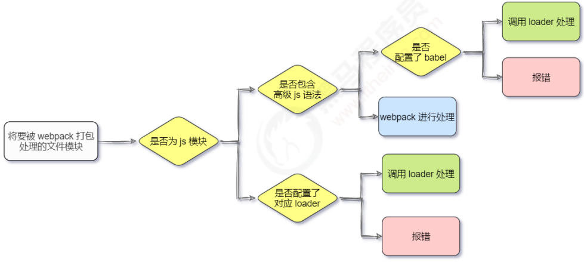

# 带你快速入门Vue.js

Vue简介：JavaScript框架、简化Dom操作、响应式数据驱动。

文档：https://cn.vuejs.org

Vue实例的作用范围：Vue会管理el选项命中的元素及其内部的后代元素。

`el`可以使用多种选择器，但建议使用ID选择器。

`el`可以使用双标签，但不能使用HTML和BODY。

`el`是用来设置Vue实例挂载（管理）的元素。

Vue中用到的数据定义在data中， data中可以写复杂类型的数据， 渲染复杂类型数据时，遵守js的语法即可。

注意，上述的`el`指挂载点，data指数据对象，methods指方法。


Vue指令：
①内容绑定：v-text、v-html。
②事件绑定：v-on。
③显示切换：v-show、v-if。
④属性绑定：v-bind。
⑤列表循环：v-for。
⑥表单元素绑定：v-model。


**本地应用：**

Vue指令：指以v-开头的一组特殊语法。

```vue
v-text指令的作用：设置标签的内容（textContent）。默认写法会替换全部内容，使用差值表达式`{{ }}`可以替换指定内容，其内部支持写表达式。
示例：
    <div id="app">
      <h2 v-text="message+’!’"></h2>
      <h2>深圳{{ message + "!"}}</h2>
    </div>
。。。。。。
        var app = new Vue({
            el:"#app",
            data:{
                message:"黑马程序员"
            }
        })

v-html指令的作用：设置元素的innerHTML。内容中有html结构会被解析为标签。

v-on指令的作用：为元素绑定事件。事件名不需要写on，指令可以简写为@，绑定的方法定义在methods属性中，方法内部通过this关键字可以访问定义在data中数据。
示例：
    <div id="app">
      <input type="button" value="事件绑定" v-on:click=“doIt">
      <input type="button" value="事件绑定" v-on:monseenter=“doIt">
      <input type="button" value="事件绑定" v-on:dblclick=“doIt">
      <input type="button" value="事件绑定" @dblclick=“doIt">
    </div>
。。。。。。
        var app = new Vue({
            el:"#app",
            methods:{
              doIt:function(){
                // 逻辑
              }
            }
        })
另外，事件绑定的方法写成函数调用的形式，可以传入自定义参数；定义方法时要定义形参来接收传入的实参；事件的后面跟上`.修饰符`，可以对事件进行限制；`.enter`可以限制触发的按键为回车；
示例：
    <div id="app">
      <input type="button" @click="doIt(p1,p2)" />
      <input type="text" @keyup.enter="sayHi">
    </div>
。。。。。。
        methods: {
          doIt: function(p1,p2) {  },
          sayHi: function() {  }
        }

v-show指令的作用：根据表达值的真假，切换元素的显示状态。其原理是修改元素的display，实现显示隐藏。指令后面的内容，最终都会解析为布尔值；值为true则元素显示，值为false则元素隐藏；数据改变之后，对应元素的显示状态会同步更新。（适用Vue所有）
示例：
    <div id="app">
      
      
      =18">
    </div>
。。。。。。
            data:{
                isShow:false,
                age:16
            }

v-if指令的作用：根据表达式的真假切换元素的显示状态。其本质是通过操纵dom元素来切换显示状态；若其后的表达式的值为true，则元素存在于dom树中，为false，则从dom树中移除；若元素频繁地切换显示状态，则使用v-show，因为该切换消耗小，反之使用v-if。


v-bind指令的作用：为元素绑定属性。写法是`v-bind:属性名=表达式`，简写可省略v-bind，只保留`:`，若要动态的增删表达式，则建议使用对象的方式。
示例：
    <div id="app">
      
      
      
      
    </div>
。。。。。。
            data:{
              imgSrc:"图片地址",
              imgTitle:"黑马程序员",
              isActive:false
           	}

v-for指令的作用：根据数据生成列表结构，其经常和数组结合使用。
语法：`(item, index) in 数据`或`item in 数据`。数组（长度）的更新会同步到页面上，是响应式的。
示例：
    <div id="app">
      <ul>
         <li v-for="(item,index) in arr" :title="item">
         {{ index }}{{ item }}
        </li>
         <li v-for="(item,index) in objArr">
         {{ item.name }}
        </li>
      </ul>
    </div>
。。。。。。
        data: {
          arr: [1, 2, 3, 4, 5],
          objArr: [
            { name: "jack" }, 
            { name: "rose" }
          ]
        }

v-model指令的作用：便捷的设置和获取表单元素的值。`绑定的数据`会和`表单元素值`相关联（双向绑定）。
示例：
    <div id="app">
      <input type="button" value="修改message" @click="setM" />
      <input type="text" v-model="message" @keyup.enter="getM">
      <h2>{{ message }}</h2>
    </div>
。。。。。。
        methods: {
          doIt: function(p1,p2) {},
          sayHi:function(){}
        }
```


**网络应用：**

axios文档：https://github.com/axios/

axios是功能强大的网络请求库，其必须先导入才可使用。使用get或post方法即可发送对应的请求。

安装：`npm i axios -S`。导入：`import axios from 'axios'`。

`.then`方法中的回调函数会在请求成功或失败时触发。通过回调函数的形参可以获取响应内容或错误信息。

```javascript
    <script src="https://unpkg.com/axios/dist/axios.min.js"></script>
    axios.get(地址?key=value&key2=values).then(function(response){},function(err){})
    axios.post(地址,{key:value,key2:value2}).then(function(response){},function(err){})
```

axios+vue（结合）：axios回调函数中的this已改变，无法访问到data中的数据，解决方案是把this保存起来，回调函数中直接使用保存的this即可；两者结合和本地应用最大的区别是改变了数据来源。示例：

```javascript
<div id="app">
    <input type="button" value="获取笑话" @click="getToken">
    <p>{{ joke }}</p>
</div>
<script src="https://unpkg.com/axios/dist/axios.min.js"></script>
<script src="https://cdn.jsdelirr.net/npm/vue/dist/vue.js"></script>
<script>
      var app = new Vue({
        el: "#app",
        data: {
          joke: "搞笑的笑话"
        },
        methods: {
          getJokes: function() {
            var that = this;
            axios.get("https://接口").then(function(response) {
              console.log(response.data);
              that.joke = response.data
            }, function(err) {});
          }
        }
      })
</script>
```


methods中定义的方法内部，可以通过this关键字`.`其它的方法。

不同的接口需要的数据是不同的，文档的阅读需要仔细。

页面结构复杂，可通过审查元素的方式去快速定位相关元素。

响应式的数据都需要在data中定义。


# Vue2

## 前端工程化与webpack

实际的前端开发：
①模块化（js的模块化、css的模块化、资源的模块化）；
②组件化（复用现有的 UI 结构、样式、行为）；
③规范化（目录结构的划分、编码规范化、接口规范化、文档规范化、Git 分支管理）；
④自动化（自动化构建、自动部署、自动化测试）。

前端工程化：指在企业级的前端项目开发中，把前端开发所需的工具、技术、流程、经验等进行规范化、标准化。

早期的前端工程化解决方案：grunt（ https://www.gruntjs.net/ ）；gulp（ https://www.gulpjs.com.cn/ ）。

目前主流的前端工程化解决方案：webpack（ https://www.webpackjs.com/ ）；parcel（ https://zh.parceljs.org/ ）。

webpack主要功能：它提供了友好的前端模块化开发支持，以及代码压缩混淆、处理浏览器端 JavaScript 的兼容性、性能优化等强大的功能。

目前 Vue、React 等前端项目，基本上都是基于 webpack 进行工程化开发（打包构建）的。


**webpack 的基本使用：**

①在终端运行如下的命令，安装 webpack 相关的两个包：`npm install webpack@5.42.1`、`webpack-cli@4.7.2 -D`（@4.7.2即可指定版本号，`-D`即`--save-dev`的简写）。

②在项目中配置 webpack：

1、在项目根目录中，创建名为 webpack.config.js 的 webpack 配置文件，并初始化如下的基本配置：

```javascript
module.exports = {
    mode: 'development' // mode用来指定构建模式，可选值有development和production
}
```

2、在 package.json 的 scripts 节点下，新增 dev 脚本如下：

```javascript
	"scripts": {
        "dev": "webpack"
    }
```

3、在终端中运行 `npm run dev` 命令，启动 webpack 进行项目的打包构建。


mode 节点的可选值：
①development：开发环境；不会对打包生成的文件进行代码压缩和性能优化；打包速度快，适合在开发阶段使用。
②production：生产环境；会对打包生成的文件进行代码压缩和性能优化；打包速度很慢，仅适合在项目发布阶段使用。

webpack.config.js 是 webpack 的配置文件。webpack 在真正开始打包构建之前，会先读取这个配置文件，从而基于给定的配置，对项目进行打包。

由于 webpack 是基于 node.js 开发出来的打包工具，因此在它的配置文件中，支持使用 node.js 相关的语法和模块进行 webpack 的个性化配置。

在 webpack 4.x 和 5.x 的版本中：①默认的打包入口文件为 src -> index.js；②默认的输出文件路径为 dist -> main.js。

```javascript
可在 webpack.config.js 配置文件中，通过 entry 节点指定打包的入口，通过 output 节点指定打包的出口。如：
const path = require('path')
module.exports = {
    entry: path.join(__dirname, './src/index.js'),
    output: {
        path: path.join(__dirname, './dist'),
        filename: 'bundle.js'
    }
}
```


通过安装和配置第三方的插件，可以拓展 webpack 的能力，**最常用的 webpack 插件有如下两个**：

**①webpack-dev-server**：可以让 webpack 监听项目源代码的变化，从而进行自动打包构建，`npm install webpack-dev-server@3.11.2 -D`。

配置：

1、修改 package.json -> scripts 中的 dev 命令。

```javascript
	"scripts": {
        "dev": "webpack serve"
    }
```

2、运行 `npm run dev` 命令，进行项目的打包。

3、在浏览器中访问 http://localhost:8080 地址，查看自动打包地址。

注：不配置 webpack-dev-server 的情况下，webpack 打包生成的文件，会存放到实际的物理磁盘中；配置该插件之后，打包生成的文件存放到了内存中，不再根据 output 节点指定的路径存放到实际的物理磁盘上，而是放到了项目的根目录中（默认），而且是虚拟的、不可见的，可以直接用 `/` 表示项目根目录，后面跟上要访问的文件名称，即可访问内存中的文件，这样提高了实时打包输出的性能，因为内存比物理磁盘速度快很多。

**②html-webpack-plugin**：是webpack 中的 HTML 插件（类似于一个模板引擎插件），可以通过此插件自定制 index.html 页面的内容（路径），如通过该插件，将 src 目录下的 index.html 首页，复制到项目根目录中一份：`npm install html-webpack-plugin@5.3.2 -D`。

配置：

```javascript
1、导入该插件，得到一个构造函数。
const HtmlPlugin = require('html-webpack-plugin')

2、创建该插件的实例对象。
const htmlPlugin = new HtmlPlugin({
    template: './src/index.html', // 指定原文件的存放路径
    filename: './index.html' // 指定生成的文件的存放路径
})

3、在module.exports里通过plugins节点，使htmlPlugin插件生效。
module.exports = {
    mode: 'development',
    plugins: [htmlPlugin]
}
```

注：通过该插件复制到项目根目录中的 index.html 页面，也被放到了内存中；且该插件在生成的 index.html 页面，自动注入了打包的 bundle.js 文件（自动写入生成了相应的引入该文件`<script>`的脚本）。

也可以通过 devServer 节点对 webpack-dev-server 插件进行更多的配置，如：

```json
devServer: {
	open: true, // 初次打包完成后，自动打开浏览器
	host: '127.0.0.1', // 实时打包所使用的主机地址
    port: 80 // 实时打包所使用的端口号
}
```

凡是修改了 webpack.config.js 配置文件，或修改了 package.json 配置文件，必须重启实时打包的服务器，否则最新的配置文件无法生效。


在实际开发过程中，webpack 默认只能打包处理以 `.js` 后缀名结尾的模块。其他非 `.js` 后缀名结尾的模块，webpack 默认处理不了，需要调用 loader 加载器才可以正常打包，否则会报错。

**loader 加载器的作用**：协助 webpack 打包处理特定的文件模块。

loader 的调用过程：



①css-loader 可以打包处理 .css 相关的文件。

1、运行 `npm i style-loader@3.0.0 css-loader@5.2.6 -D` 命令，安装处理 css 文件的 loader。

2、在 webpack.config.js 的 module（节点） -> rules 数组中，添加 loader 规则：

```json
module: { // 所有第三方文件模块的匹配规则
    rules: [ // 文件后缀名的匹配规则
        { test: /\.css$/, use: ['style-loader', 'css-loader'] }
    ]
}
```

test 表示匹配的文件类型， use 表示对应要调用的 loader。use 数组中指定的 loader 顺序是固定的，多个 loader 的调用顺序是从后往前调用。

②less-loader 可以打包处理 .less 相关的文件。

1、运行 `npm i less-loader@10.0.1 less@4.1.1 -D` 命令。

2、在 webpack.config.js 的 module -> rules 数组中，添加 loader 规则：

```json
		{ test: /\.less$/, use: ['style-loader', 'css-loader', 'less-loader'] }
```

③url-loader 可打包处理样式表中与url 路径相关的文件。

如img标签里的src可写图片路径，也可以将图片转换成base64格式内容写入（不过此法会使源文件大小变大一些，适用于小图片）
（`import logo from './images/logo.jpg'`）。

1、运行 `npm i url-loader@4.1.1 file-loader@6.2.0 -D` 命令。

2、在 webpack.config.js 的 module -> rules 数组中，添加 loader 规则：

```json
		{ test: /\.jpg|png|gif$/, use: 'url-loader?limit=22229'] }
其中 ? 之后的是 loader 的参数项：limit 用来指定图片的大小，单位是字节（byte），只有 ≤ limit 大小的图片，才会被转为 base64 格式的图片，否则转为原图片文件路径。
```

④babel-loader 可以打包处理 webpack 无法处理的高级 JS 语法。

webpack 只能打包处理一部分高级的 JavaScript 语法，对于那些 webpack 无法处理的高级 js 语法，需要：

1、运行`npm i babel-loader@8.2.2 @babel/core@7.14.6 @babel/plugin-proposal-decorators@7.14.5 -D`。

2、在 webpack.config.js 的 module -> rules 数组中，添加 loader 规则：

```json
		{ test: /\.js$/, use: 'babel-loader', exclude: /node_modules/ }
```

3、配置 babel-loader：

在项目根目录下，创建名为 babel.config.js 的配置文件，定义 Babel 的配置项如下：

```json
module: {
    plugins: [ [ '@babel/plugin-proposal-decorators', { legacy: true } ] ]
}
```

Babel 的官网：https://babeljs.io/docs/en/babel-plugin-proposal-decorators


项目开发完成之后，需要使用 webpack 对项目进行打包发布，主要原因是为了让项目能够在生产环境中高性能的运行：①不存放于内存而在物理磁盘；②进行代码压缩和性能优化。

**①配置 webpack 的打包发布：**在 package.json 文件的 scripts 节点下，新增 build 命令，`"build": "webpack --mode production"`。

当项目发布时，运行build命令，通过 --model 指定的参数项，会覆盖 webpack.config.js 中的 model 选项。

**②把图片文件统一生成到image目录中：**修改 webpack.config.js 中的 url-loader 配置项，新增 outputPath 选项即可指定图片文件的输出路径。

```json
		{ test: /\.jpg|png|gif$/, use: 'url-loader?limit=470&output=images' }
images表示放到dist目录下的images目录下。
或写成：
        {
            test: /\.jpg|png|gif$/,
            use: {
                loader: 'url-loader',
                options: {
                    limit: 470,
                    outputPath: 'images'
                }
            }
        }
```

**③在每次打包发布时自动清理掉 dist 目录中的旧文件（先删除再生成），可以安装并配置 clean-webpack-plugin 插件：**

```javascript
运行`npm install clean-webpack-plugin@3.0.0 -D`命令。

配置：
按需导入插件，得到插件的构造函数，创建插件的实例对象：
const { CleanWebpackPlugin } = require('clean-webpack-plugin')
const cleanPlugin = new CleanWebpackPlugin()
将其挂载到plugins节点中：
plugins: [htmlPlugin, cleanPlugin]
```

**④把JS文件统一生成到js目录中：**

修改 webpack.config.js 配置文件的output节点下的filename属性为：`filename: 'js/bundle.js'`。


前端项目在投入生产环境之前，都需要对 JavaScript 源代码进行压缩混淆，从而减小文件的体积，提高文件的加载效率。但对压缩混淆之后的代码除错（debug）非常困难，因为其中的变量被替换成没有任何语义的名称，且空行和注释被剔除。

`Source Map`是一个信息文件，里面储存着位置信息。即`Source Map`文件（bundle.js.map文件）中存储着压缩混淆后的代码所对应的转换前的位置。

在开发环境下，webpack 默认启用了 Source Map 功能。当程序运行出错时，可以直接在控制台提示错误行的位置，并定位到具体的源代码（打包后的）（在内存中）。

开发环境下，默认生成的 Source Map，记录的是生成后（打包后的）的代码的位置，会导致运行时报错的行数与源代码的行数不一致的问题。而在 webpack.config.js 中添加`devtool: 'eval-source-map'`的配置（节点），即可保证运行时报错的行数与源代码（未打包前）的行数保持一致（但不建议在生产环境中使用）。

在生产环境下，如果省略了 devtool 选项，则最终生成的文件中不包含 Source Map，这能防止原始代码暴露，保证安全性。

在生产环境下，如果只想定位报错的具体行数，且不想暴露源代码，则`devtool: nosources-source-map`。

在生产环境下，如果想在定位报错行数的同时，展示具体报错的源码，则`devtool: source-map`（但此法不安全）。采用此选项后，应该将服务器配置为不允许普通用户访问 `source map` 文件。


在实际开发中，不需要自己配置 webpack；实际开发中会使命令行工具（CLI）一键生成带有 webpack 的项目，所有 webpack 配置项都是现成的。


webpack中的@：在webpack.config.js中的module.exports里添加如下配置（节点），可用@符号表示src这一层目录：

```json
    resolve: {
        alias: {
            '@': path.join(__dirname, './src/')
        }
    }
```

建议使用@表示源代码目录（src），从外往里找；不建议使用`../`从里往外找，如`import msg from '@/msg.js'`。


## vue基础入门

在Chrome浏览器中安装vue-devtools调试工具：
点击》更多工具》扩展程序》打开开发者模式》将插件（如`vue_devtools_chrome_5.3.4.crx`）拖入安装》关闭开发者模式》打开该插件的详细信息》将‘允许访问文件网址’打开。


Vue：一套用于构建用户界面的前端框架。

vue框架的特性主要体现在：数据驱动视图（单向的数据绑定）、双向数据绑定（表单元素）。

MVVM 是 vue 实现数据驱动视图和双向数据绑定的核心原理，其把每个 HTML 页面都拆分成了三个部分：
①Model 表示当前页面渲染时所依赖的数据源；②View 表示当前页面所渲染的 DOM 结构；③ViewModel 表示 vue 的实例，是 MVVM 的核心，是它把当前页面的数据源（Model）和页面结构（View）连接在了一起。


**vue 的版本：**
1.x 版本的 vue 几乎被淘汰，不再建议学习与使用；
2.x 版本的 vue 是目前企业级项目开发中的主流版本，在未来几年内会被逐渐淘汰；
3.x 版本的 vue 的生态还不完善，尚未在企业级项目开发中普及和推广，但却是未来企业级项目开发的趋势。

**基本使用步骤**：①导入 vue.js 的 script 脚本文件；②在页面中声明一个将被 vue 所控制的 DOM 区域；③ 创建vue实例对象。


快速切换大小写字母的做法：shift+字母键。


vue 官方提供的 vue-devtools 调试工具，能够方便开发者对 vue 项目进行调试与开发。

Chrome 浏览器在线安装vue-devtools：https://chrome.google.com/webstore/detail/vuejs-devtools/nhdogjmejiglipccpnnnanhbledajbpd。
FireFox 浏览器在线安装vue-devtools：https://addons.mozilla.org/zh-CN/firefox/addon/vue-js-devtools/。

注意：安装并修改完配置项，须重启浏览器才能生效。


指令（Directives）是 vue 为开发者提供的模板语法，用于辅助开发者渲染页面的基本结构。vue 中的指令按照不同的用途可以分为如下 6 大类：

①内容渲染指令。

常用的有：
1、v-text：会覆盖元素内默认的值。
2、{{ }}语法（插值表达式）：Mustache，在开发中更常用。
3、v-html：把包含 HTML 标签的字符串渲染为页面的 HTML 元素。

②属性绑定指令。

v-bind （简写为英文的`: `），为元素的属性动态绑定属性值。

在 vue 提供的模板渲染语法中，除了支持绑定简单的数据值之外，还支持 Javascript 表达式的运算。

③事件绑定指令。

v-on 事件绑定指令（简写为英文的@），为DOM元素绑定事件监听，如`v-on:click`、`v-on:input`、`v-on:keyup`等。通过 v-on 绑定的事件处理函数，需要在 methods 节点中进行声明。

如果事件处理函数中的代码足够简单，只有一行代码，则可以简写到行内，如`<button @click="count += 1">+1</button>`。

在使用 v-on 指令绑定事件时，可以使用 `()` 进行传参，且同样可以接收事件参数对象event，但此时要么不能带`()`传实参，要么使用$event（vue提供的特殊变量），用来表示原生的事件参数对象event，从而解决事件参数对象event被实参覆盖的问题。如：

```javascript
示例1：
<button v-on:click="addCount">+1</button>
。。。。。。
methods: {
    addCount(e) { // 接收事件参数对象event，简写为e
        const nowBgColor = e.target.style.backgroundColor
        e.target.style.backgroundColor = nowBgColor === 'red' ? '' : 'red'
        this.count += 1
    }
}

示例2：（$event是固定写法，可不按顺序写该参数）
<button @click="addNewCount(2, $event)">+2</button>
。。。。。。
methods: {
    addNewCount(step, e) { // e，可更名
        console.log(e)
    }
}
```

事件修饰符，常见的有：
1、`.prevent`，阻止默认行为（如阻止 a 连接的跳转、阻止表单的提交等）;
2、`.stop`，阻止事件冒泡；
3、`.capture`，以捕获模式触发当前的事件处理函数；
4、`.once`，绑定的事件只触发一次；
5、`.self`，只有在 event.target 是当前元素自身时，触发事件处理函数。

按键修饰符：如`<input @keyup.enter="submit">`，还可以是`.esc`等。

④双向绑定指令。

v-model，在不操作 DOM 的前提下，快速获取表单的数据。

v-model指令的修饰符：
1、`.number`，自动将用户的输入值转为数值类型；
2、`.trim`，自动过滤（去掉）用户输入的首尾空白字符 ；
3、`.lazy`，在“change”时而非“input”时更新，即在表单失去焦点时才更新。

⑤条件渲染指令。

按需控制 DOM 的显示与隐藏。

v-if 指令会动态地创建或移除 DOM 元素，有更高的切换开销，可在运行时条件很少改变，或刚进入页面时元素不需要被展示的情况下使用；
v-show 指令会动态地为元素添加或移除 `style="display: none;"` 样式，有更高的初始渲染开销，可在需要频繁切换时使用。

实际开发中，绝大多数情况下，不用考虑性能问题，直接使用v-if。

v-else-if和v-else指令，必须配合 v-if 指令一起使用，否则不会被识别。

```html
示例：
<div v-if="type === 'A'">优秀</div>
<div v-else-if="type === 'B'">良好</div>
<div v-else-if="type === 'C'">一般</div>
<div v-else>差</div>
```

⑥列表渲染指令。

v-for，基于一个数组来渲染（循环）一个列表结构。v-for 指令的第二个可选参数，即当前项的索引，语法格式为`(item, index) in items`。注意：item项和index索引都是形参，可重命名。

当列表的数据变化时，默认情况下，vue 会尽可能的复用已存在的 DOM 元素，从而提升渲染的性能，但这种默认的性能优化策略，会导致有状态的列表无法被正确更新。
为了给 vue 一个提示，以便它能跟踪每个节点的身份，从而在保证有状态的列表被正确更新的前提下，提升渲染的性能，此时，需要为每项提供一个唯一的key属性：
1、key 的值只能是字符串或数字类型；
2、key 的值必须具有唯一性（即key的值不能重复，且能与每项绑定）；
3、使用 index 的值当作 key 的值没有任何意义（因为index索引不能与每项绑定）；
3、建议把数据项 id 属性的值作为 key 的值（具有唯一性）；
4、建议使用 v-for 指令时，一定要指定 key 的值。

```html
示例：
<li v-for="user in userList" :key="user.id">
    <input type="checkbox">
    姓名:{{user.name}}
</li>
```


在表单里，点击提交按钮，form表单元素有（默认的）submit事件，可以通过`.prevent`阻止表单提交（提交数据后，阻止页面刷新或跳转），如：

```html
<form @submit.prevent="add"> // 点击后触发add事件
    。。。。。。
    <button type="submit"
    。。。。。。
</form>
```

if判断语句，若return上面只有一行语句，则可简写为一行，return后的代码不再执行，如：

```javascript
if(。。。) {
    alert('。。。')
    return
}
可简写成：
if(。。。) return alert('。。。')
```

推荐安装的VScode中的Vue的插件：
①Vue3 Snippets：https://marketplace.visualstudio.com/items?itemName=hellowtree.vue-snippets。
②Vetur：https://marketplace.visualstudio.com/items?itemName=octref.vetur。


过滤器（Filters），常用于文本的格式化，可用在插值表达式和v-bind属性绑定。


