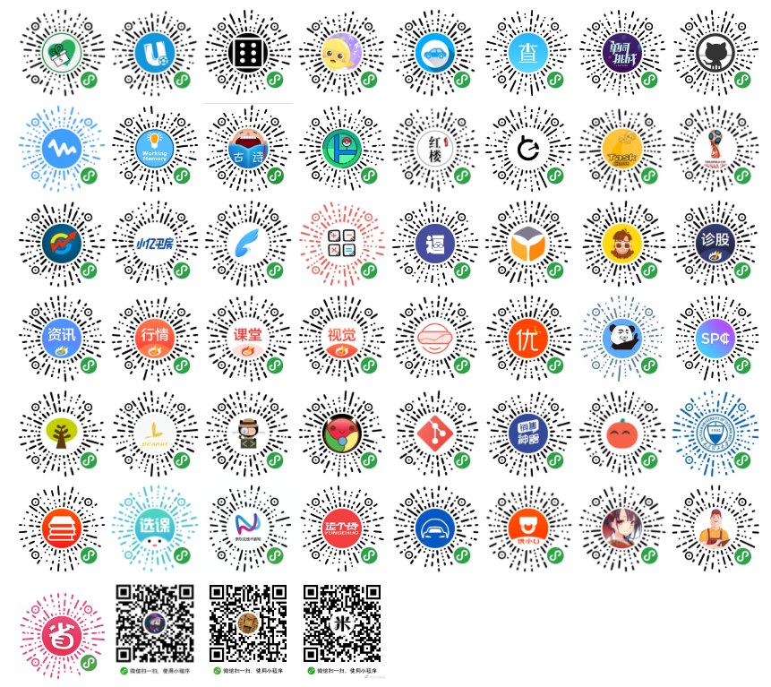
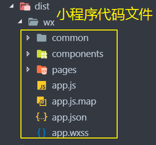
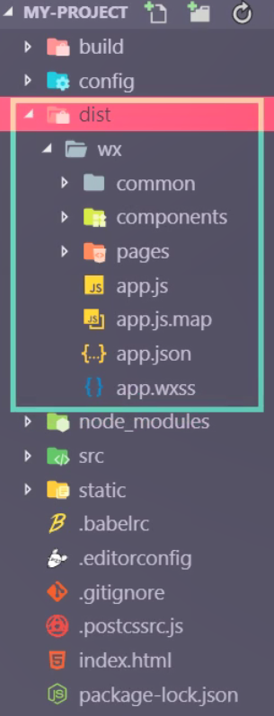

# 1. mpvue-介绍

**mpvue** 是美团团队开发的语法类似 [Vue.js](https://vuejs.org/) 的小程序的前端框架。[官网](http://mpvue.com/)。[开发文档](http://mpvue.com/mpvue/)。

## 1.1. 主要特性

主要有以下特性：

- 彻底的组件化开发能力：提高代码复用性
- 完整的 `Vue.js` 开发体验
- 方便的 `Vuex` 数据管理方案：方便构建复杂应用
- 快捷的 `webpack` 构建机制：自定义构建策略、开发阶段 hotReload
- 支持使用 npm 外部依赖
- 使用 `Vue.js` 命令行工具 vue-cli 快速初始化项目
- H5 代码转换编译成小程序目标代码的能力

## 1.2. 优秀案例



## 1.3. 前置知识

- 前端基本功 `html` + `css` + `javascript`
- [nodejs](https://nodejs.org/en/)
- es6
- [webpack](https://webpack.js.org/)
- [vue](https://cn.vuejs.org/)
- [微信小程序](https://developers.weixin.qq.com/miniprogram/dev/)

### 1.3.1. 代码示例

```javascript
new Vue({
  data: {
    a: 1
  },
  created () {
    // `this` 指向 vm 实例
    console.log('a is: ' + this.a)
  },
  onShow () {
    // `this` 指向 vm 实例
    console.log('a is: ' + this.a, '小程序触发的 onshow')
  }
})
```

# 2. 启动项目

## 2.1. 全局安装vue脚手架工具

```bash
npm install --global vue-cli
```

## 2.2. 创建项目

mpvue 提供了开发企业级的模板 [quickstart](http://mpvue.com/mpvue/quickstart/) 和 页面级的模板 [simple](http://mpvue.com/mpvue/simple/)。 

```bash
vue init mpvue/mpvue-quickstart my-project
```

## 2.3. 安装依赖

```bash
cd my-project
npm install
```

## 2.4. 修改微信入口地址


由于 mpvue中的 小程序入口路径和打包编译后的路径  对应不上，因此需要手动地修改 入口路径。

修改 `project.config.json` 文件

```json
	// 源代码
	"miniprogramRoot": "./dist/",
	
	// 修改为
	"miniprogramRoot": "./dist/wx/",
```

## 2.5. 启动项目

```bash
npm run dev
```

## 2.6. 使用小程序开发者工具打开

编译成功后，可以看到在 `dist/wx`内有我们熟悉的小程序代码文件，此时，使用小程序开发者工具直接打开 项目的根目录(因为直接在配置文件中配置过 `/dist/wx/`入口路径  )



# 3. 项目目录结构

编译成功后，可以看到如下的项目结构

```
├─build	               打包构建相关配置文件
├─config                 用于打包的一些变量文件
├─dist	               小程序页面文件
├─src                    mpvue源代码
├─static	               一些静态资源
└─test	               测试相关
│  .babelrc	          js的编译配置
│  .editorconfig	     编辑器风格
│  .gitignore	          git文件忽略清单
│  .postcssrc.js         转换css到wxss的
│  index.html	          入口模板
│  package-lock.json	node包版本说明文件
│  package.json	     项目描述文件
│  project.config.json	小程序开发者工具配置文件
│  README.md             项目说明文档

```




注意，若新增一个页面（在pages目录下），则要在app.json文件里增加相应的内容，然后要重新编译。

# 4. 生命周期图示

mpvue的生命周期结合了[vue](https://cn.vuejs.org/v2/guide/instance.html#生命周期图示)和[小程序](https://developers.weixin.qq.com/miniprogram/dev/framework/app-service/page.html)的生命周期。

## 4.1. vue 生命周期

- beforeCreate

  在实例初始化之后，数据观测 (data observer) 和 event/watcher 事件配置之前被调用

- created

  在实例创建完成后被立即调用，`$el` 属性目前不可见，data中的数据可以使用

- beforeMount

  在挂载开始之前被调用：相关的 `render` 函数首次被调用。

- mounted

  示例和对应的dom都被创建后开始调用，子组件不一定全部被挂载，如要确保，使用 [vm.$nextTick](https://cn.vuejs.org/v2/api/#vm-nextTick) 来代替。$el可用。

- beforeUpdate

  数据更新时调用,这里适合在更新之前访问现有的 DOM，data中的数据更新了，但是视图还没有更新

- updated

  由于数据更改导致的虚拟 DOM 重新渲染和打补丁时会被调用，data中的数据更新了，视图也更新了

- activated

  keep-alive 组件激活时调用

- deactivated

  keep-alive 组件停用时调用

- beforeDestroy

  实例销毁之前调用。在这一步，实例仍然完全可用

- destroyed

  Vue 实例销毁后调用，Vue 实例指示的所有东西都会解绑定，所有的事件监听器和所有的子实例都会被销毁

## 4.2. 小程序生命周期

**app 部分：**

- onLaunch

  小程序初始化时被调用

- onShow

  当小程序启动，或从后台进入前台显示被调用

- onHide

  当小程序从前台进入后台

**page 部分：**

- onLoad

  页面加载完毕被调用

- onShow

  页面开始显示时被调用

- onReady，

  页面初次渲染完成被调用

- onHide

  页面隐藏时被调用

- onUnload

  页面卸载被调用

- onPullDownRefresh

  用户下拉动作开始时被调用

- onReachBottom

  页面上拉触底时被调用

- onShareAppMessage

  用户点击右上角分享时被调用

- onPageScroll

  页面滚动时被调用

- onTabItemTap,

  当前是 tab 页时，点击 tab 时触发 

## 4.3. mpvue-生命周期图示

- `mpvue`会在小程序 onReady 后，再去触发 vue mounted 生命周期
- 不建议使用小程序的生命周期钩子


# 5. mpvue 标签映射

由于**web**中的标签和小程序中的标签存在差异，因此 mpvue内部提供了对应的标签转换，可以让开发者专注于业务本身，省去了记忆新标签的成本。

| web标签 | 小程序标签 | 备注                      |
| ------- | ---------- | ------------------------- |
| div     | view[_div] |                           |
| p       | view[_p]   |                           |
| span    | label      |                           |
| a       | navigator  | 属性参照小程序的navigator |
| img     | image      | 属性参照小程序的image     |
| ul      | view[_ul]  |                           |
| ol      | view[_ol]  |                           |


# 6. mpvue 语法

## 6.1. 数据绑定

mpvue绑定数据的方式大部分和vue一样。

### 6.1.1. 支持的语法

- `Mustache`(双大括号) 文本插值
- `v-text`属性的方式绑定
- 标签内属性方式绑定 `:attr="value"`
- `v-model`也是支持的

### 6.1.2. 不支持的语法

- `v-html` 因为小程序内部不支持动态标签 （会被解释为`rich-text`标签）
- `v-once` 暂时不支持

### 6.1.3. **代码示例**

```html
    <!-- 1.0 支持的语法 -->
    <!-- 双括号 -->
    {{msg}}
    <!-- v-text -->
    <view v-text="msg"></view>
    <!-- 标签内属性方式绑定 -->
    <view :data-title="msg">通过属性的方式使用变量</view>
    <!-- :hidden -->
    <view :hidden="false" >显示与隐藏</view>

    <!-- 2.0 不支持的错误 -->
    <!-- v-html -->
    <view v-html="htmlmsg"></view>
    <!-- v-once -->
    <view v-once="msg"></view>
```

## 6.2. JavaScript 渲染表达式

目前可以使用的有 `+ - * % ?: ! == === > < [] .`，剩下的还待完善。写在 @event 里面的表达式也是都支持的，因为这部分的计算也都放在了 `vdom` 的h里面。

```html
<!-- 这种就不支持，建议写 computed -->
<p>{{ message.split('').reverse().join('') }}</p>

<!-- 但写在 @event 里面的表达式是都支持的，因为这部分的计算放在了 vdom 里面 -->
<ul>
    <li v-for="item in list">
        <div @click="clickHandle(item, index, $event)">{{ item.value }}</p>
    </li>
</ul>
```

## 6.3. computed 和 watch

### 6.3.1. computed

对于任何复杂逻辑，都应当使用**计算属性**，因为watch更耗性能。使用方式和vue中的一样。

```json
    computed:{
  		reversedMessage: function () {
  		  return this.message.split('').reverse().join('')
  		}
    }
```

### 6.3.2. watch

`watch`相比于`computed`可以让我们做更多的事情。使用方式和vue中的一样。

```json
    watch: {
      msg(newValue, oldValue) {
        console.log("watch被触发了");
      }
    }
```

## 6.4. 条件渲染

### 6.4.1. v-if

支持 `v-if v-else 和 v-else if`指令。

`v-if` 指令的显示和隐藏是通过 增加和删除节点实现。频繁操作性能损耗大。

```html
    <div v-if="false">if</div>
    <div v-else-if="true"> v-else-if</div>
    <div v-else>v-else</div>
```

### 6.4.2. v-show

用法大致一样

```html
    <div v-show="true">v-show</div>
```

## 6.5. 列表渲染

### 6.5.1. v-for

- `v-for` 可以循环 数组和对象等可迭代的对象。
- `mpvue`中，**嵌套列表渲染，必须指定不同的索引！**

**数组**

```html
  <ul v-for="(card, index) in list">
        <li v-for="(item, itemIndex) in card">
            {{item.value}}
        </li>
    </ul>
```

**对象**

```html
<div v-for="(value, key) in object">
 {{ key }}: {{ value }}
</div>
```

**嵌套列表渲染**

```html
    <ul v-for="(card, index) in list">
        <li v-for="(item, itemIndex) in card">
            {{item.value}}
        </li>
    </ul>
```

## 6.6. Class 与 Style 绑定

动态设置样式

### 6.6.1. class 支持的语法:

```html
<p :class="{ active: isActive }">111</p>
<p class="static" v-bind:class="{ active: isActive, 'text-danger': hasError }">222</p>
<p class="static" :class="[activeClass, errorClass]">333</p>
<p class="static" v-bind:class="[isActive ? activeClass : '', errorClass]">444</p>
<p class="static" v-bind:class="[{ active: isActive }, errorClass]">555</p>
```

### 6.6.2. style 支持的语法:

```html
<p v-bind:style="{ color: activeColor, fontSize: fontSize + 'px' }">666</p>
<p v-bind:style="[{ color: activeColor, fontSize: fontSize + 'px' }]">777</p>
```

### 6.6.3. 不支持的语法

- 不支持 [官方文档：Class 与 Style 绑定](https://cn.vuejs.org/v2/guide/class-and-style.html) 中的 `classObject` 和 `styleObject` 语法。
- 不支持在组件上使用 Class 与 Style 绑定。

# 7. 事件

几乎全支持 [vue中的事件处理器](https://cn.vuejs.org/v2/guide/events.html)

## 7.1. 绑定方式

使用`v-bind`或者`@`关键字来执行绑定

```html
 // v-bind
 <view v-bind:click="clickHandle3">点我</view>
 
 // @
  <view @click="clickHandle3">点我</view>
```

## 7.2. 事件映射表

| WEB 事件      | 小程序 事件（一般前面加上bind） | 备注 |
| ------------- | ------------------------------- | ---- |
| click         | tap                             |      |
| touchstart    | touchstart                      |      |
| touchmove     | touchmove                       |      |
| touchcancel   | touchcancel                     |      |
| touchend      | touchend                        |      |
| tap           | tap                             |      |
| longtap       | longtap                         |      |
| input         | input                           |      |
| change        | change                          |      |
| submit        | submit                          |      |
| blur          | blur                            |      |
| focus         | focus                           |      |
| reset         | reset                           |      |
| confirm       | confirm                         |      |
| columnchange  | columnchange                    |      |
| linechange    | linechange                      |      |
| error         | error                           |      |
| scrolltoupper | scrolltoupper                   |      |
| scrolltolower | scrolltolower                   |      |
| scroll        | scroll                          |      |

## 7.3. 踩坑注意

- 列表中没有的原生事件（例如 bindregionchange 事件）也可以直接在 dom（标签） 上将bind改为@ 。
- 小程序能力所致，bind 和 catch 事件同时绑定时候，只会触发 bind ，而 catch 不会被触发，要避免踩坑。
- 事件修饰符
  - `.stop` 的使用会阻止冒泡，但是同时绑定了一个非冒泡事件，会导致该元素上的 catchEventName 失效！
  - `.prevent` 可以直接干掉，因为小程序里没有什么默认事件，比如submit并不会跳转页面
  - `.capture` 支持 `1.0.9`
  - `.self` 没有可以判断的标识（即不支持）
  - `.once` 也不能做，因为小程序没有 removeEventListener, 虽然可以直接在 handleProxy 中处理，但非常的不优雅，违背了原意，暂不考虑
- 其他 键值修饰符 等在小程序中压根没键盘，所以没有用。
- `@regionchange`,同时这个事件也非常特殊，它的 event type 有 begin 和 end 两个，导致我们无法在`handleProxy` 中区分到底是什么事件，所以你在监听此类事件的时候，同时监听事件名和事件类型，即 `<map @regionchange="functionName" @end="functionName" @begin="functionName"><map>`

# 8. 表单控件绑定

建议开发过程中直接使用 [微信小程序：表单组件](https://mp.weixin.qq.com/debug/wxadoc/dev/component/button.html) 。如：

- [select 组件用 picker 组件进行代替](https://github.com/Meituan-Dianping/mpvue/issues/58)
- [表单元素 radio 用 radio-group 组件进行代替](https://github.com/Meituan-Dianping/mpvue/issues/66)

# 9. 组件

**有且只能使用单文件组件（.vue 组件）的形式进行支持**。详细的使用方式，参照vue中的[组件文档](https://cn.vuejs.org/v2/guide/components.html)

## 9.1. 定义组件

新建组件文件 `card.vue` 。该组件也是分为3个部分，即标签 `template` ，脚本 `script` ，和 样式 `style`。编辑内容：

```html
<template>
  <div>
    <p class="card">
      {{text}}
    </p>
  </div>
</template>

<script>
export default {
  data () {
    return {
      text: "卡片组件"
    }
  },
}
</script>

<style>
.card {
  padding: 10px;
}
</style>

```

## 9.2. 使用组件

在某个页面文件中使用组件 `card.vue`

```html
<template>
  <div>
  <card></card>
  </div>
</template>

<script>

import card from '@/components/card'

export default {
  components: {
    card
  }
}
</script>

<style>

</style>
```

## 9.3. 组件传值

父组件通过`prop`来向子组件传递数据。

### 9.3.1. 父组件

在`data`中定义数据同时在标签上通过属性的方式传递

```html
  <!-- template -->
  <card :text="msg"></card>
  
  <!-- script -->
    data () {
    return {
      msg: "mpvue"
    }
  }
  
```

### 9.3.2. 子组件

通过props进行接收

```javascript
export default {
  props: ['text']
}
```

## 9.4. 组件通信

主要有三种方式

- 子向父 通过`$emit`
- 组件之间 通过事件总线 `EventBus`
- 企业级的组件通信，建议使用 [vuex状态管理方案](https://github.com/vuejs/vuex) 来实现，更好维护数据。

### 9.4.1. 子向父通信

通过 `$emit`关键字触发

**父组件中**

```html
<template> 
	<card2 @parentEvent="parentHd"></card2>
</template>
<script>
   import card2 from "@/components/card2.vue";
   export default {
    components: {
      card2
    },
     methods: {
      parentHd(...args) {
        console.log(args);
        console.log("父组件打印纸");
      }
     }
   }
</script>
```

**子组件中**

```html
<template>
  <div>
  </div>
</template>
<script>
export default {
  props: ['text'],
  mounted(){
    setTimeout(() => {
      this.$emit("parentEvent",1,2,3,4);
    }, 5000);
  }
}
</script>
```

### 9.4.2. 事件总线 EventBus

`EventBus` 又称为事件总线。它是组件共用的事件中心，可以向该中心注册发送事件或接收事件，所以组件都可以上下平行地通知其他组件。使用起来很方便，但是容器导致代码混乱，不好维护。

**新建总线文件**

在 `utils/`中新建 js文件 `event-bus.js`

```javascript
import Vue from 'vue'
export default new Vue()
```

**组件中开始触发事件**

```html
     <!-- template -->
  <div>
    <p class="card" @click="clickHd"> 组件3 </p>
  </div>
......
<script>
       /* script */
  import { EventBus } from "../utils/event-bus.js";
  export default {
    methods: {
      clickHd() {
        EventBus.$emit("incremented", {
          num: 111,
          deg: 222
        });
      }
    }
  }
</script>
```

**其他页面监听**

```javascript
  import { EventBus } from "@/utils/event-bus.js";  

      mounted() {
      EventBus.$on("incremented", ({
        num,
        deg
      }) => {
        console.log(num, deg);
      });
    },
```

## 9.5. 不支持的功能

- 暂不支持在组件引用时，在组件上定义 click 等原生事件、v-show（可用 v-if 代替）和 class style 等样式属性(例：`<card class="class-name"> </card>` 样式是不会生效的)，因为编译到 wxml，小程序不会生成节点，建议写在内部顶级元素上。
- Slot（插槽的scoped 暂时还没做支持）
- 动态组件
- 异步组件
- inline-template
- X-Templates
- keep-alive
- transition
- class
- style

