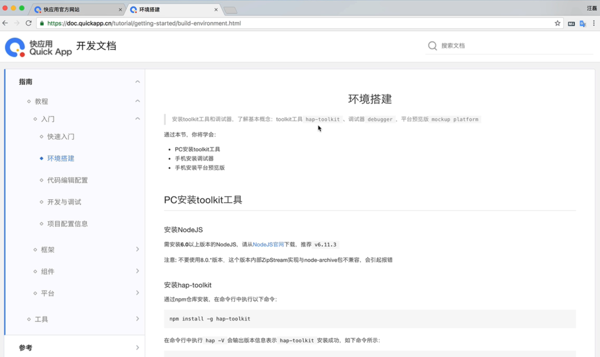
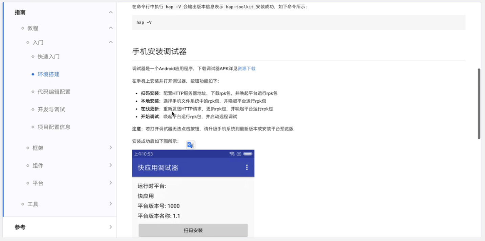
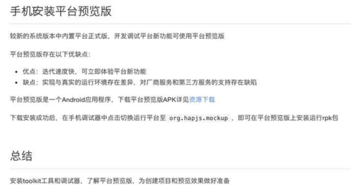
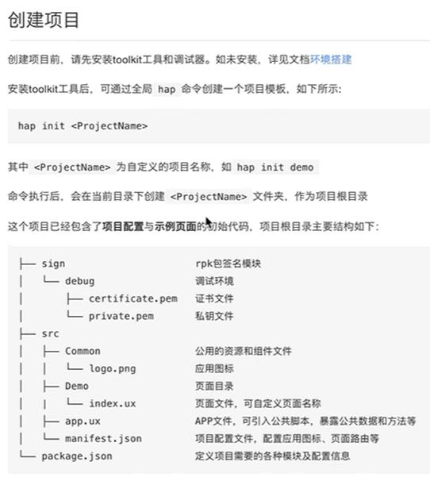
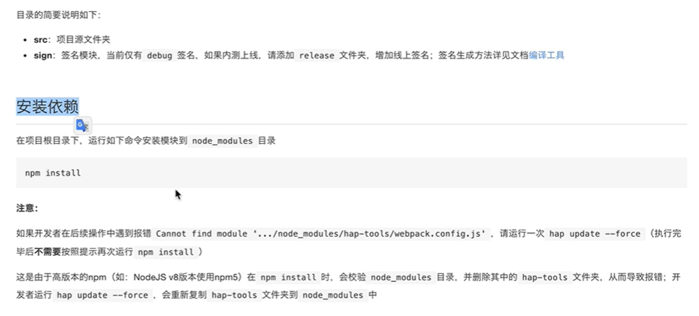
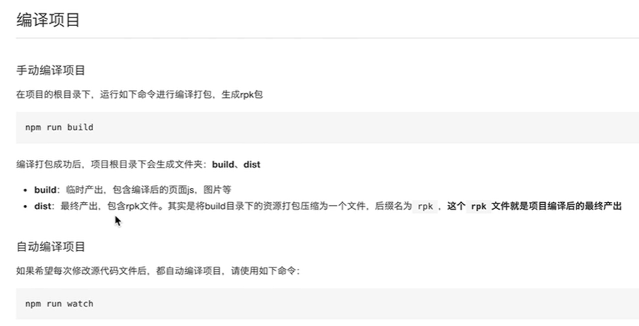
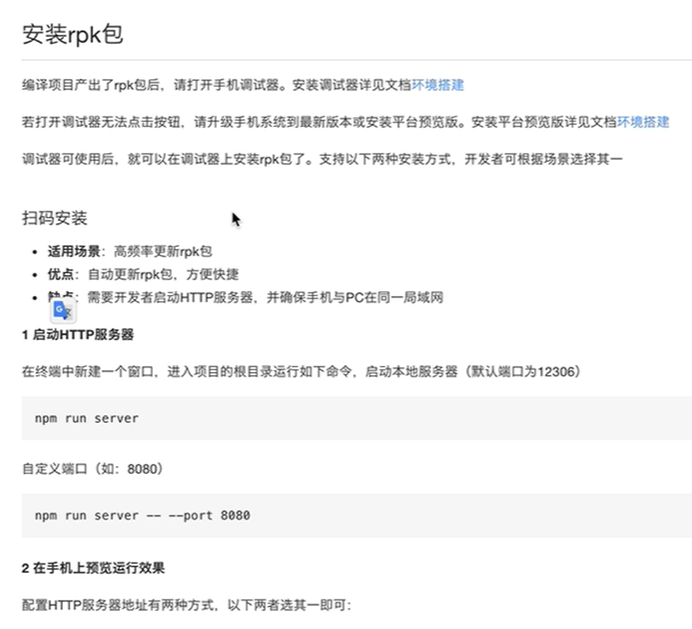
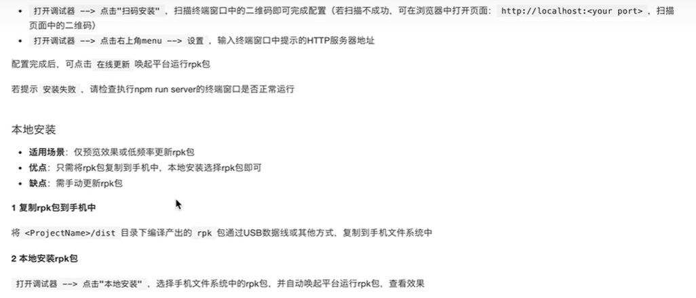
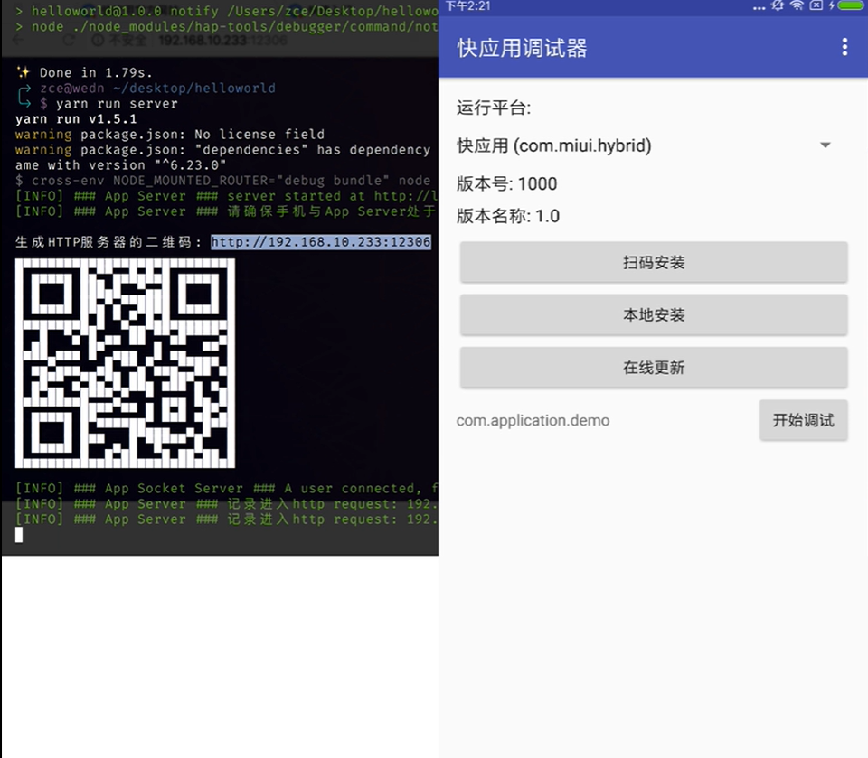

# 快应用实战开发 - 快速上手

## 课程介绍

快应用（开发平台、开发形式）是小米华为等数十家国内一线手机厂商提出的移动应用新生态（注意都是安卓手机厂商，即只能用在这些品牌的手机上面），原生App体验、无需安装、即点即用、用完即走。对于开发者，快应用让开发者的工作更高效更有价值。
对于绝大多数初学者而言，现在快应用生态还没有建立完善，并且官方资料不全也不够准确，所以急缺一个入门级别的教程，解决在学习快应用开发过程中所遇到的各种问题。
《快应用实战开发课程》主要面向有一定前端开发经验的人群，从零到一通过一个完善的项目案例（类似美团/大众点评）理解快应用的开发。

## 课程纲要

### 准备工作

- 快应用简介

  

- 环境搭建

  

  

  如果是较旧的手机或者是其它手机品牌，则要安装平台预览版才能查看快应用的内容。

  

- 快速上手

  

  

  

  

  这个扫码相当于在调试器里的设置里设置服务器地址，如果手动设置完地址后，则可以点击在线更新，把压缩文件进行下载安装。

  

  

- 基础知识铺垫

### 项目案例

- 项目演示及目标

- 通过项目骨架创建一个新项目

- 如何在手机中启动运行项目

- 调整项目配置文件，配置界面外观

- 完成首页界面布局

  每个div都是从左往右的flex布局；

  style标签里的样式，相对于web来说，有一些组件的新增的样式，也有一些改动（如px是相对概念且跟manifest配置文件有关，border相关的属性要分开写且不能合起来写，样式没有继承的说法且必须要设置到具体的元素上）；

  标签里，如果呈现的是文本，则必须要被text标签包围；

- 首页数据加载和绑定

- 页面导航并传递参数

- 列表选项卡组件使用

- 列表页默认显示选中分类

- 列表数据加载

- 上拉加载更多

- 详细页商铺信息展示


# quickapp-locally

> 《本地生活》快应用示例，for you ❤️

## Preview


## Usage

```shell
# clone repo
$ git clone https://github.com/zce/quickapp-locally.git
# install dependencies
$ yarn
# build rpk
$ yarn build
# start hmr server
$ yarn server
```

真机安装 [快应用调试器](https://statres.quickapp.cn/quickapp/quickapp/201803/file/quickapp_debugger.apk) 打开扫码即可体验。

## 可能遇到的问题

- 控制台不是等宽字体或者行高导致的二维码扫码不成功
  + 可以将监听的服务地址通过浏览器打开，扫描网页中的二维码即可
  + 也可以在`快应用调试器`中手动设置`服务器地址`为以上地址，然后点击`在线更新`
  + 或者手动将 `dist` 中的 `rpk` 文件拷贝到手机中，选择 `本地安装`
- 快应用调试器中显示无可用平台
  + 可以下载安装 [快应用平台正式版预览](https://statres.quickapp.cn/quickapp/quickapp/201803/file/quickapp_platform_preview_release.apk)
  + 如果你是这几个“山寨”厂商相对较新的手机，可以尝试更新手机系统到最新版本，然后更新系统内置应用

**当然你还有可能遇到各种问题，通常很多人把这种问题称之为“坑”，如果说这是“坑”的话，那么接下来你即将面临“坑王驾到”。**

理解吧！朋友们，比较都在抢时间，快应用的想法还是很不错的！短时间之内没有合适的开发团队支撑这个平台的开发和维护工作也很正常，我想你也面临过：你们公司的产品经理提出很不错的一个 Idea，结果因为你和你的小伙伴这样那样的原因不“给力”导致这个想法死在了起跑线上。

另外，喊话小米（我猜想这背后的开发主力军）：如果可以的话，呼吁开源快应用，不解释~

## 踩坑的放一边

热重载不能保持当前页面状态

https://doc.quickapp.cn/tutorial/getting-started/project-configuration.html#%E9%A1%B5%E9%9D%A2%E8%B7%AF%E7%94%B1%E5%AF%B9%E8%B1%A1%EF%BC%88routerpages%EF%BC%89
router.pages 中的 path 选项未生效

https://doc.quickapp.cn/framework/manifest.html#routerpage
文档错误
错把 router.pages 写成了 router.page
闭源
代码一旦出现异常就会假死
只有几个国产“山寨”厂商支持


错误信息不友好

无端端提示创建桌面图标
魅族调试问题
http://bbs.quickapp.cn/posts/detail?id=467
http://bbs.quickapp.cn/posts/detail?id=520

## js 文件中不能使用 es2015 module

webpack 1.13.3 对 es2015 模块支持不到位
https://www.imooc.com/article/20604

webpack 中 js 文件 loader 配置的 babel 没有配置 plugin 所以不支持 ES2015
而 ux 文件的 loader 内部配置了


## 默认项目骨架不合理的点

- 依赖不清晰（开发依赖和生产依赖）
- ESLint 只在 JS 文件中工作，无意义
- Babel 转换部分 koa 模块代码在高版本 Node 环境中显得很多余，而且我个人认为不应该在项目中修改第三方依赖包的源代码
- clear script 中使用了 rm -rf 这个 shell 命令，Windows 不工作
- scripts 中 “脏乱差”
- 为什么不给 hap-tools 维护 dependencies

--------

## 参考链接

https://github.com/jimaowo/douban-quickapp
http://www.jimaowo.com/article/7
http://bbs.quickapp.cn/posts/detail?id=603
https://segmentfault.com/a/1190000014024037

https://github.com/l455202325/APIDemo


## Android 设备调试模式

1. 启用 Android 设备的开发者模式
2. 打开 Android 设备的 USB 调试模式
3. PC 端安装 adb 工具（android-platform-tools）
4. PC 端运行 `adb devices` 查看可用设备
5. Android 设备端授权

### 使用 adb 查看应用日志

```shell
# grep 过滤包名
$ adb logcat | grep com.package.name
# 忽略大小写
$ adb logcat | grep -i com.package.name
# 设置匹配字符串颜色。更多设置请查看 grep 帮助
$ adb logcat | grep --color=auto -i com.package.name

$ adb logcat -c

$ adb logcat | grep --color=auto -i E/AndroidRuntime

$ adb logcat | grep --color=auto -i E/JsConsole
adb logcat -s JsConsole
```

## 查看 Android 应用的包名

```shell
$ adb shell pm list package -f
```

- 快应用平台：`org.hapjs.mockup`
- 快应用调试器：`org.hapjs.debugger`


## 参考配置文件

```json
{
  "name": "内涵段子Lite",
  "package": "me.zce.duanzi",
  "versionName": "1.0.0",
  "versionCode": "1",
  "minPlatformVersion": "101",
  "icon": "/Common/logo.png",
  "features": [
    { "name": "system.router" },
    { "name": "system.prompt" },
    { "name": "system.shortcut" }
  ],
  "permissions": [
    { "origin": "*" }
  ],
  "config": {
    "logLevel": "debug",
    "designWidth": "750",
    "data": {
      "author": "zce <w@zce.me>"
    }
  },
  "router": {
    "entry": "Home",
    "pages": {
      "Home": {
        "component": "index",
        "path": "/Home",
        "filter": {
          "view": {
            "uri": "https?://.*"
          }
        }
      },
      "Explore": {
        "component": "index"
      },
      "New": {
        "component": "index"
      },
      "Message": {
        "component": "index"
      },
      "Profile": {
        "component": "index"
      },
      "Detail": {
        "component": "index"
      },
      "About": {
        "component": "index"
      }
    }
  },
  "display": {
    "titleBar": true,
    "titleBarText": "内涵段子Lite",
    "titleBarTextColor": "#414141",
    "titleBarBackgroundColor": "#f2f2f2",
    "backgroundColor": "#ffffff",
    "fullScreen": false,
    "menu": true,
    "pages": {
      "Home": {
        "titleBar": false,
        "titleBarText": "HOME « 内涵段子Lite",
        "titleBarTextColor": "#414141",
        "titleBarBackgroundColor": "#f2f2f2",
        "backgroundColor": "#ffffff",
        "fullScreen": false,
        "menu": false
      }
    }
  }
}
```

## 生成证书文件

openssl req -newkey rsa:2048 -nodes -keyout private.pem -x509 -days 3650 -out certificate.pem

## a 链接组件

打开外部网址 URL 需要声明 system.webview

## 页面跳转导航必须添加 system.router

## 单项数据同步问题

