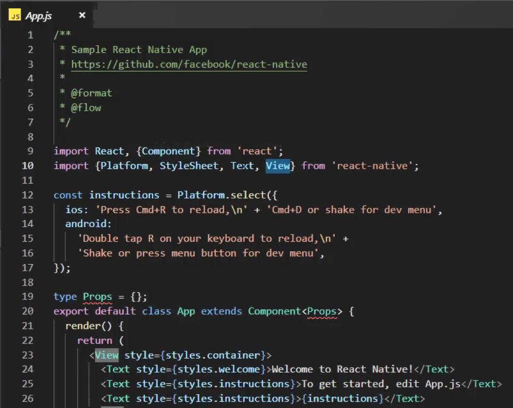

### 原生应用开发框架

原生应用：直接运行在安卓或IOS上的应用。

原生应用开发框架：React-Native（简称RN，这三个之中最早出现），Weex，Flutter。


注意，React-Native与Weex的性能比不上Flutter：（因为前两者在编译时要经过brideg桥的转换，比较耗性能）


对比：


### Windows环境搭建

#### 说明

```
React-Native、Weex、Flutter在Windows上面的环境搭建都差不多，但是也有些个体差异，本文章先说共性的东西，然后再针对不同的框架分别作出说明
```

#### 共同部分

```bash
1、安装 Node
	下载地址:
		https://nodejs.org/en/

2、安装 JDK8.x    （因为开发安卓app的话是依赖于Java，IOS则是OS）（安装之后要配置环境变量，配置好后cmd输入javac有反应则说明配置成功，如下图）
	下载地址:
		https://www.oracle.com/technetwork/java/javase/downloads/jdk8-downloads-2133151.html
		然后下一步下一步安装即可
		
3、安装Git
	下载地址:
		https://git-scm.com/downloads

4、安装 Android sdk    （解压到盘符的根目录）（要配置环境变量，配置好后cmd输入adb.exe有反应则说明配置成功，如下图）
	下载地址:
		https://blog.csdn.net/QQxiaoqiang1573/article/details/73274771

5、安装 Android 模拟器    （要打开开发者模式（连续点击版本号多次），并选中USB调试，才能把项目运行在模拟器上面）
	推荐夜神模拟器，轻量级并且使用方便，下载地址:https://www.yeshen.com/
	
```

JDK8.x配置环境变量：


Android sdk配置环境变量：


#### React-Native

参考地址:https://facebook.github.io/react-native/docs/getting-started.html

```
1、安装python2.x    （要配置环境变量，不过安装的时候会自动帮你配置上）
	下载地址:
		https://www.python.org/downloads/
```


#### Weex

```
常见问题:
	https://www.jianshu.com/p/8cd872a618d4
	
	安装一个Android 5.1.1 的模拟器，不要使用它默认的4.4的模拟器
```

#### Flutter

参考地址:https://flutterchina.club/setup-windows/

```
1、安装 Flutter SDK
	下载地址:【建议通过git clone】
		https://flutter.io/sdk-archive/#windows
		
2、配置环境变量    （如下图）

3、执行一次 flutter doctor 来安装需要的依赖包
```


配置用户代理的的镜像的环境变量


### 生成React-Native项目

#### 安装脚手架：

```
npm install -g react-native-cli
```


#### 创建项目：

```
react-native init AwesomeProject
或react-native init react_native_douban
```


#### 检查相应文件下的相应的安卓文件（负责编译）的下载路径：


#### 运行到模拟器上：

##### 打开USB调试：

多次点击版本号，进入开发者选项，勾选允许USB调试：


##### 电脑的安卓软件连接到模拟器上面：


检查是否连接成功：


##### 进入项目目录下并运行项目：


注意，运行期间弹出的node程序不要关闭，因为其负责把本机代码（App.js）同步到模拟器上面


#### 运行到真机上：

##### 打开USB调试：

注意Total Control的版本要和adb的版本要匹配，否则输入adb的相关指令时会断开（当然这里的Total Control只是为了能在电脑上看到效果）


会出现是否安装和是否允许USB调试（进入开发者选项并打开开发人员选项）的提示：（选择确定）


##### 检查是否连接成功：

如果连接不上，则可以先kill-server


##### 进入项目目录下并运行项目：

下面的adb device跟上面的（运行结果）不同，是因为下面的是先运行指令，然后再连接真机在Total Control上面（这样做能避免因软件版本不对应而导致运行adb指令时，断开连接的问题）。


### 生成Weex项目

#### 安装脚手架：

```
npm install weex-toolkit -g
```


#### 创建项目：

```
weex create awsome-app
或weex create weex_douban
```


#### 运行到模拟器上：

##### 打开USB调试：

多次点击版本号，进入开发者选项，勾选允许USB调试。

##### 电脑的安卓软件连接到模拟器上面：


##### 进入项目目录下并运行项目：

要先编译，再运行。


#### 运行到真机上：

##### 打开USB调试：

如果不打开USB调试，则会出现未授权（unauthorized）


##### 检查是否连接成功：


##### 进入项目目录下并运行项目：

要先编译，再运行。


### 生成Flutter项目

#### ①使用VSCode

##### 先安装两个插件：


##### 在命令面板选择Flutter: New Project


##### 输入项目名称并选择生成项目的目录


##### 打开模拟器并打开USB调试并连接到模拟器并运行项目

连接到模拟器：


运行项目：


#### ②使用命令行（模拟器和真机都同理）

##### 创建项目：


##### 打开USB调试

##### 检查是否连接成功：


##### 进入项目目录下并运行项目：


图中myapp是通过命令行生成的app


### Mac环境搭建

#### 说明

```
React-Native、Weex、Flutter在Windows上面的环境搭建都差不多，但是也有些个体差异，本文章先说共性的东西，然后再针对不同的框架分别作出说明
```

#### 共同部分

```bash
1、安装 Node    （注意安装的是macOS的node，包括下面的也是Mac版本的软件）
	下载地址:
		https://nodejs.org/en/

2、安装 JDK8.x    （因为开发安卓app的话是依赖于Java，IOS则是OS）（安装之后要配置环境变量，配置好后cmd输入javac有反应则说明配置成功）
	下载地址:
		https://www.oracle.com/technetwork/java/javase/downloads/jdk8-downloads-2133151.html
		然后下一步下一步安装即可
		
3、安装Git
	下载地址:
		https://git-scm.com/downloads

4、安装 Android sdk    （要配置环境变量，配置好后cmd输入adb.exe有反应则说明配置成功）
	要先下载Android Studio（自带模拟器），并且安装Android SDK
	下载地址:
		https://www.android-studio.org/

5、安装 xCode
	App Store安装即可
	
```

#### React-Native

参考地址:https://facebook.github.io/react-native/docs/getting-started.html

```
1、安装python2.x    （要配置环境变量，不过安装的时候会自动帮你配置上）
	下载地址:
		https://www.python.org/downloads/
```


```
创建项目之后：
进入项目目录下并运行项目（运行到ios模拟器上面）：react-native run-ios
进入项目目录下并运行项目（运行到安卓模拟器上面）：react-native run-android
```

运行到ios模拟器上面：


运行到安卓模拟器上面


#### Weex

```
无
```


#### Flutter

参考地址:https://flutterchina.club/setup-macos/

```
1、安装 Flutter SDK
	下载地址:【建议通过git clone】
		https://flutter.io/sdk-archive/#windows
		
2、配置环境变量
	更改个人目录下的 .bash_profile
	可以在终端输入vim ~/.bash_profile

3、执行一次 flutter doctor 来安装需要的依赖包
```


运行到ios模拟器（左）上面和运行到安卓模拟器（右）上面：（flutter的好处是可以同时看到ios（要mac电脑环境）和安卓模拟器上面的效果）

```
flutter run -d all
```


#### .bash_profile文件内容


#### 注意事项：


### React-Native项目

在夜神模拟器上开启热更新：


一开始的目录状态：


一开始的App.js文件内容：




成品目录：


用到的第三方包：

```
根组件app.js：
负责底部Tag（TabBar，createBottomTabNavigator方法）和顶部导航（XxxStack，createStackNavigator方法）：npm i react-navigation -S
Home组件：
负责轮播图（Carousel）：npm install react-native-looped-carousel --save
MovieList组件：
负责上拉加载下拉刷新（RefreshListView）：npm install --save react-native-refresh-list-view
```

注意：

标签默认都是flex布局（display:flex;），而且方向是竖直向下的（flex-direction:column;）


### Flutter项目

一开始的目录状态：


一开始的main.dart文件内容：


成品目录：


注意：

写完代码后，在cmd控制台按（ctrl + ）r键，才能更新代码内容到模拟器上面（看到效果）。还不行就重新运行flutter run。	
