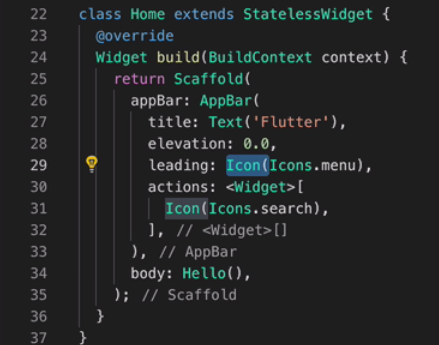
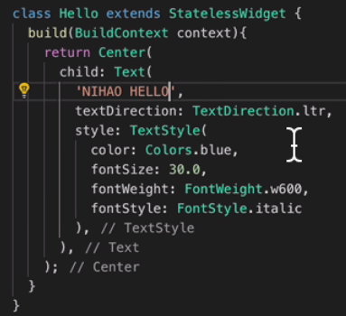
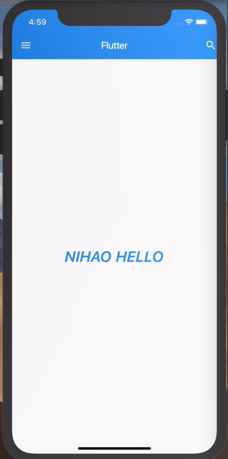

### 三、 Flutter界面


##### 1. MaterialApp 界面

* MaterialApp构成
	* MaterialApp 代表使用纸墨设计（Material Design）风格的应用。里面包含了纸墨设计风格应用所需要的基本控件。
	* title ： 在任务管理窗口中所显示的应用名字，这个 Title 是用来定义任务管理窗口界面所看到应用名字的。在原生 Android 系统中点击圆圈 Home 按钮右边的方块按钮就会打开多任务切换窗口。
	* home ： 应用默认所显示的界面 Widget，用来定义当前应用打开的时候，所显示的界面。


```
MaterialApp(
	title: 'Flutter Tutorial',// 指明了这个控件的标题
	home: Scaffold( // 指明了这个控件的主体
		appBar: AppBar(),
		body:
	),
)
```

##### 2. 顶部工具栏和功能按钮

* `leading` 部件

	* 创建一个menu部件
	
	* 使用Icon部件，以及预置图标

* `actions` 部件

	* 创建一组actions动作
	
	* 使用小图标


```
 appBar: AppBar(
    title: Text(
      'demo'
    ),
    leading: Icon(Icons.menu),
    actions: <Widget>[
      Icon(Icons.search),
    ],
    elevation: 0.0,  // 头部栏下面的阴影
  ),
```







