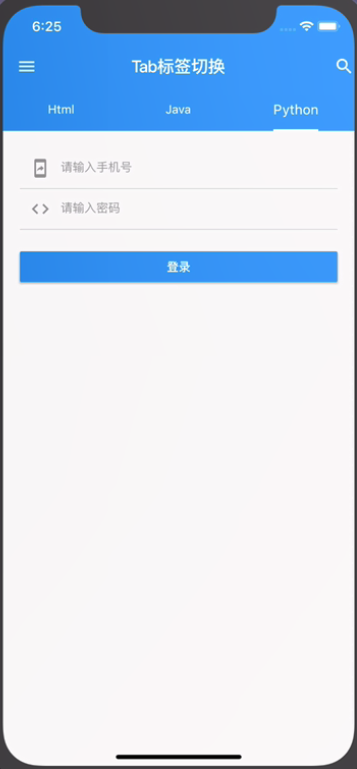

### 九、 表单输入

##### 1. 文本输入

* 使用文本框组件 `TextField()`

##### 2. 文本输入样式

* decoration 装饰属性

	* Icon 图标

	* labelText 提示

	* hintText 预置提示

	* border 边框

	* filled 背景颜色

	```
	TextField(
      decoration: InputDecoration(
        icon: Icon(Icons.subject),
        labelText: '姓名',
        hintText: '请输入',
        border: InputBorder.none,
        // border: OutlineInputBorder(),
        filled: true,
      ),
    );
	```

##### 3. 输入监听

* onChanged 改变

* onSubmitted 确认按钮

```
   onChanged: (value) {
     debugPrint('input: $value');
   },
   onSubmitted: (value) {
    debugPrint('submit: $value');
   },
```

* 密码框 `obscureText`

##### 4.状态组件

* StatefulWidget 添加一个有状态的组件

	* 可以有数据改变的组件

	```
	class Form extends StatefulWidget {
	  @override
	  _FormState createState() => _FormState(); //为组件建立状态管理
	}
	
	class _FormState extends State<Form> { //创建有状态的组件
	  @override
	  Widget build(BuildContext context) {
	    return Container(
	      
	    );
	  }
	}
	```


```dart
import 'package:flutter/material.dart';

class InputWidget extends StatefulWidget {
  @override
  _InputWidgetState createState() => _InputWidgetState();
}

class _InputWidgetState extends State<InputWidget> {

  String username;
  String password;

  _login(){
    print(username);
    print(password);
  }
  @override
  Widget build(BuildContext context) {
    return Padding(
      padding: EdgeInsets.all(20.0),
      child: Column(
        children: <Widget>[
          // TextField(
          //   decoration: InputDecoration(
          //     icon: Icon(Icons.supervised_user_circle),
          //     labelText: '用户名',
          //     hintText: '请输入用户名',
          //     filled: true,
          //     fillColor: Colors.grey[100],
          //     border: InputBorder.none
          //   ),
          //   onChanged: (value){},
          //   onSubmitted: (value){},
          // ),
          TextField(
            keyboardType: TextInputType.phone,
            decoration: InputDecoration(
              prefixIcon: Icon(
                Icons.mobile_screen_share,
                color: Colors.grey,
              ),
              focusedBorder: UnderlineInputBorder(
                borderSide: BorderSide(
                  color: Colors.black12
                )
              ),
              enabledBorder: UnderlineInputBorder(
                borderSide: BorderSide(
                  color: Colors.black12
                )
              ),
              hintText: '请输入手机号',
              hintStyle: TextStyle(
                color: Colors.black38,
                fontSize: 14.0
              )
            ),
            onChanged: (value){
              setState(() {
                username = value;
              });
            },
          ),
          TextField(
            obscureText: true,
            keyboardType: TextInputType.text,
            decoration: InputDecoration(
              prefixIcon: Icon(
                Icons.code,
                color: Colors.grey,
              ),
              focusedBorder: UnderlineInputBorder(
                borderSide: BorderSide(
                  color: Colors.black12
                )
              ),
              enabledBorder: UnderlineInputBorder(
                borderSide: BorderSide(
                  color: Colors.black12
                )
              ),
              hintText: '请输入手机号',
              hintStyle: TextStyle(
                color: Colors.black38,
                fontSize: 14.0
              )
            ),
            onChanged: (value){
              setState(() {
                password = value;
              });
            },
          ),
          Container(
            width: double.infinity,
            child: RaisedButton(
              color: Colors.blue,
              onPressed: (){
                _login();
              },
              child: Text(
                '登录',
                style: TextStyle(
                  color: Colors.white
                ),
              ),
            ),
          )
        ],
      ),
    );
  }
}
```



