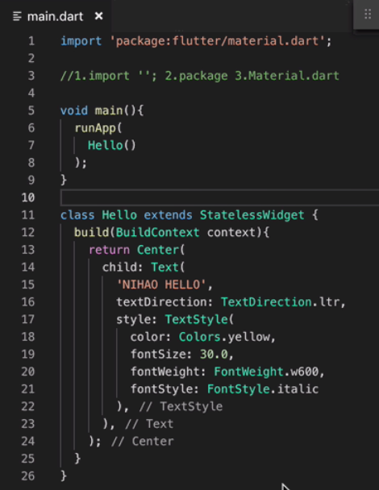

### 二、 Flutter HelloWord

##### 1. 项目文件

> —android 安卓配置文件

> —ios IOS配置文件

> —build 打包生成目录

> —lib 开发目录

  >> —main.dart 入口文件

> —pubspec.yaml 项目依赖配置


##### 2. HelloWorld

* 项目入口文件 main.js

* 启动方法 void main()

```
void main(){} //定义入口方法
```


* 根函数 runApp()

```
void main(){
  runApp(
    //定义内容
  );
}
```

* 一切皆为widget(组件)

	* 在 Flutter 中，一切的显示都是 Widget 。Widget 是一切的基础
	
	* Widget 和 Widget 之间通过 child: 进行嵌套。

	* 你需要做的就是在 widget 中堆积你的布局

* UI库 material

```
import 'package:flutter/material.dart';
```

* `Material` 是一种标准的移动端和web端的UI框架，是一套google的设计规范，flutter项目以meterial为基础

##### 3. Flutter 部件

* Center小部件：定义一个居中的部件

```
Center(
  child: //部件
);
```

* Text小部件

```
Text(
    'hello',
    textDirection: TextDirection.ltr,
)
```
若不写textDirection会报错

* 自定义部件

	* StatelessWidget：无状态部件
	
	```
	class Hello extends StatelessWidget{ //创建一个继承自无状态部件的自定义部件
	  Widget build (BuildContext context){ //实现一个build函数, 构建自身
	    return Center( //返回一个部件
	      child: 
	    );
	  }
	}
	```
	

##### 4. 文字和文字样式


```
Text(
	'hello',
	textDirection: TextDirection.ltr,
	style: TextStyle(
	  fontSize: 40.0,
	  color: Colors.red,
	  fontWeight: FontWeight.bold
	),
),
```

* 文字内容

* TextStyle，用来定义Text中文字的各种属性。

	* 文字颜色

	* 文字大小
	
	* 文字粗细

| 属性值  | 意义   | 
| -------- | -----  |
| color | 字体颜色   |
| fontSize | 字体大小 |
| fontWeight | 字体粗细 |
| fontStyle | normal或者italic |
| fontFamily | 字体 |
| letterSpacing | 字母间隙 |
| wordSpacing | 单词间隙 |


* 文本方向

| 属性名  | 意义   |
| -------- | -----  |
| TextDirection.ltr | 左对齐  |
| TextDirection.rtl | 右对齐  |



