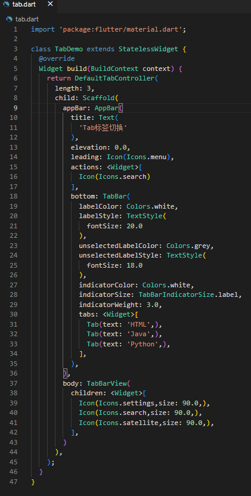
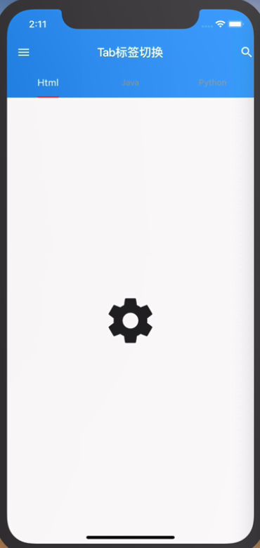

### 五、 选项卡Tab布局

##### 1. Tab选项卡布局

* DefaultTabController 标签控制器组件

* TabBar 标签栏组件

* TabBarView 标签内容组件


##### 2. 添加标签控制器

* DefaultTabController

	* length 定义标签个数

	* 定义一个 Scaffold标准布局

	* 定义一个 appBar 头部栏

	* 定义一个 bottom

```
DefaultTabController(
  length: 2,
  child: Scaffold(
    appBar: AppBar(
      title: Text('Tabs'),
      elevation: 0.0,
      bottom: TabBar(
        tabs: <Widget>[

        ],
      ),
    ),
    body: TabBarView(
      children: <Widget>[

      ],
    )),
),
```

##### 3. 添加标签栏

* 添加一组标签栏组件

* 每个组件都是Tab类型

```
TabBar(
	tabs: <Widget>[
		Tab(text: '我的收藏',),
		Tab(text: '我的历史',),
	],
),
```

##### 4. 添加标签栏内容

* 添加一组标签栏内容组件

```
TabBarView(
  children: <Widget>[
	Text('收藏'),
	Text('历史'),
  ],
)
```

##### 5. 自定义标签栏的样式

* 标签边距

* 下划线长度

* 下划线粗细

* 下划线颜色

* 标签颜色

* 未选择状态的颜色

```
TabBar(
  labelPadding: EdgeInsets.only(left: 20.0, right: 20.0),
  indicatorSize: TabBarIndicatorSize.label,
  indicatorWeight: 3.0,
  indicatorColor: Colors.blueAccent,
  unselectedLabelColor: Colors.black54,
  labelColor: Colors.blue,
  labelStyle: TextStyle(
    fontSize: 14.0,
  ),
  tabs: ...,
),
```






