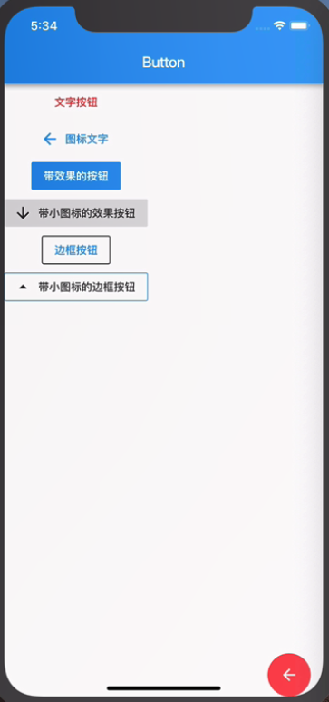

### 十、 按钮

##### 1. 浮动按钮

* FloatingActionButton

	* 点按动作

	* 阴影

	* 背景颜色

	
	```
	FloatingActionButton(
	  child: Icon(Icons.arrow_back),
	  onPressed: () {
	   
	  },
	  elevation: 0.0,
	  backgroundColor: Colors.black26,
	),
	```
	
* 在Scaffold底部工具栏中使用浮动按钮

	* 在Scaffold布局中定义个一个浮动按钮

	* 在Scaffold布局中创建底部工具栏

	* 使底部工具栏贴合浮动按钮

	```
	floatingActionButton: floatingActionButton(),
	floatingActionButtonLocation: FloatingActionButtonLocation.centerDocked,
	```

##### 2. 文字按钮

* 文字按钮

	* 文字

	* 点按动作

	* 文字颜色
	
```
FlatButton(
	child: Text('按钮'),
	onPressed: () {},
	textColor: Colors.blue,
),
```

* 带小图标的文字按钮

```
FlatButton.icon(
	icon: Icon(Icons.add),
	label: Text('按钮'),
	onPressed: () {},
	textColor: Colors.blue,
),
```

##### 4. 带效果的按钮

* RaisedButton 带水墨效果的按钮

```
RaisedButton(
	child: Text('按钮'),
	onPressed: () {},
	splashColor: Colors.grey,
	elevation: 0.0,
),
```

* 带小图标的 RaisedButton

	* splashColor 修改水墨效果的颜色

```
RaisedButton.icon(
	icon: Icon(Icons.add),
	label: Text('按钮'),
	onPressed: () {},
	splashColor: Colors.grey,
	elevation: 12.0,
),
```


##### 5. 边框按钮

```
OutlineButton(
	child: Text('按钮'),
	onPressed: () {},
	splashColor: Colors.grey[100],
	borderSide: BorderSide(
	  color: Colors.black,
	),
	textColor: Colors.black,
),
```


```dart
import 'package:flutter/material.dart';

class ButtonDemo extends StatelessWidget {

  Widget floatButton(context){
    return FloatingActionButton(
      child: Icon(Icons.settings),
      elevation: 0.0,
      onPressed: (){
        Navigator.pop(context);
      },
      backgroundColor: Colors.red,
    );
  }

  Widget flatButton (){
    return FlatButton(
      child: Text('文字按钮'),
      textColor: Colors.red,
      onPressed: (){
        print('按下了文字按钮');
      },
    );
  }

  Widget flatButtonIcon (){
    return FlatButton.icon(
      icon: Icon(Icons.arrow_back),
      label: Text('图标文字'),
      textColor: Colors.blue,
      onPressed: (){
        print('按下了文字按钮');
      },
    );
  }
  
  Widget raisedButton (){
    return RaisedButton(
      onPressed: (){

      },
      color: Colors.blue,
      elevation: 0.0,
      child: Text('带效果的按钮', style: TextStyle(color: Colors.white),),
      splashColor: Colors.red,
    );
  }

  Widget raisedButtonIcon (){
    return RaisedButton.icon(
      onPressed: (){

      },
      icon: Icon(Icons.arrow_drop_down),
      color: Colors.blue,
      elevation: 0.0,
      label: Text('带效果的按钮', style: TextStyle(color: Colors.white),),
      splashColor: Colors.blue,
    );
  }

  Widget outlineButton (){
    return OutlineButton(
      child: Text('带边框的按钮'),
      onPressed: (){},
      splashColor: Colors.red,
      textColor: Colors.blue,
      borderSide: BorderSide(
        color: Colors.black,
        // width: 3.0
      ),
    );
  }

  Widget outlineButtonIcon (){
    return OutlineButton.icon(
      label: Text('带边框的按钮'),
      icon: Icon(Icons.arrow_drop_up),
      onPressed: (){},
      splashColor: Colors.red,
      textColor: Colors.blue,
      borderSide: BorderSide(
        color: Colors.blue,
        // width: 3.0
      ),
    );
  }

  @override
  Widget build(BuildContext context) {
    return Scaffold(
      appBar: AppBar(
        title: Text('按钮'),
        elevation: 0.0,
      ),
      body: Column(
        children: <Widget>[
          flatButton(),
          flatButtonIcon(),
          raisedButton(),
          raisedButtonIcon(),
          outlineButton(),
          outlineButtonIcon(),
        ],
      ),
      floatingActionButton: floatButton(context),
      floatingActionButtonLocation: FloatingActionButtonLocation.centerFloat,
    );
  }
}
```



