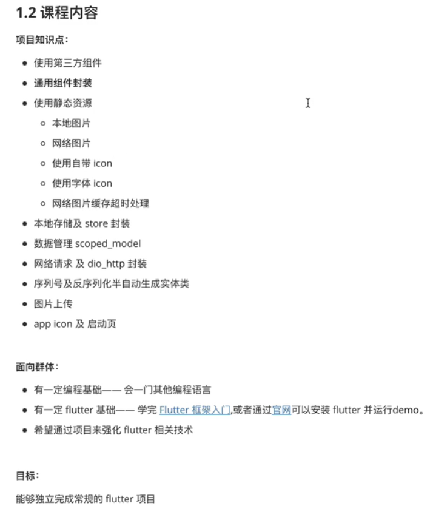
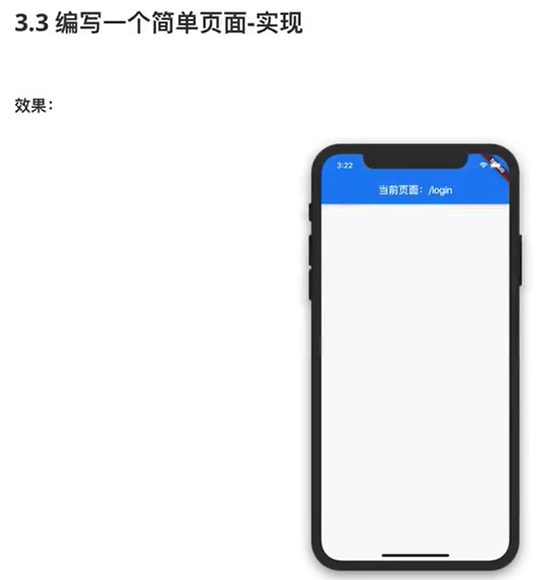
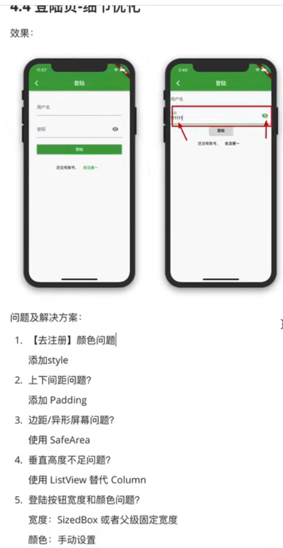
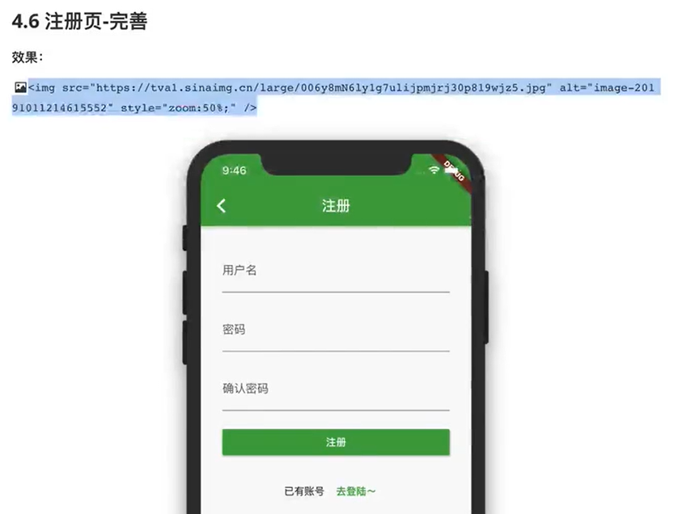
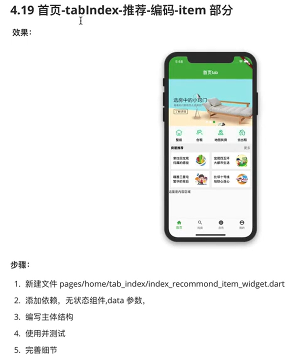
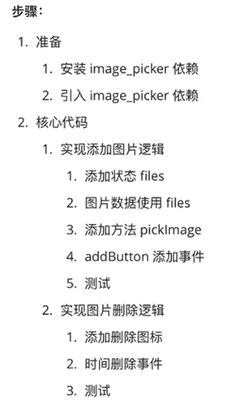
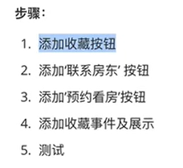

## 1课程简介

### 1.1

java和oc分别对应安卓和苹果的开发。

### 1.2

### 1.3

## 2基础回顾

## 3项目架构

### 3.1

### 3.2

分为应用层、页面层、组件层。

### 3.3

入口层

应用层

页面层

组件层

（入口层，main.dart）》MaterialApp（应用层，application.dart）》Container（页面层，pages/home/index.dart）》Scaffold（组件层，widgets/page_content.dart）

### 3.4fluro

### 3.5

### 3.6

### 3.7

在Application中配置路由

编写路由配置文件

## 4静态页面

### 4.1登录页

注意，这里的scaffold包含appBar和body两部分。

### 4.2

### 4.3

### 4.4

### 4.5注册页

### 4.6

### 4.7首页tab

### 4.8

### 4.9

### 4.10

### 4.11

### 4.12

### 4.13

### 4.14

### 4.15

### 4.16

### 4.17

### 4.18

### 4.19

### 4.20

### 4.21

### 4.22

### 4.23首页tabInfo

### 4.24首页tabSearch

### 4.25

### 4.26

### 4.27

### 4.28

### 4.29

### 4.30

### 4.31

### 4.32

### 4.33我的

### 4.34

### 4.35

### 4.36

### 4.37

### 4.38

### 4.39

### 4.40设置页

### 4.41房屋管理页

### 4.42

### 4.43发布房源页

### 4.44

### 4.45

### 4.46

### 4.47

### 4.48

### 4.49

### 4.50

### 4.51

### 4.52

### 4.53

### 4.54

### 4.55

### 4.56

### 4.57

### 4.58

### 4.59房屋详情页

注意：内容部分的Stack指的是‘’浮动操作区‘’，即按钮在上层。

### 4.60

### 4.61

### 4.62

### 4.63

### 4.64

### 4.65

### 4.66filterBar

### 4.67

### 4.68

### 4.69

### 4.70

### 4.71

### 4.72

### 4.73

## 5

另一个文件

