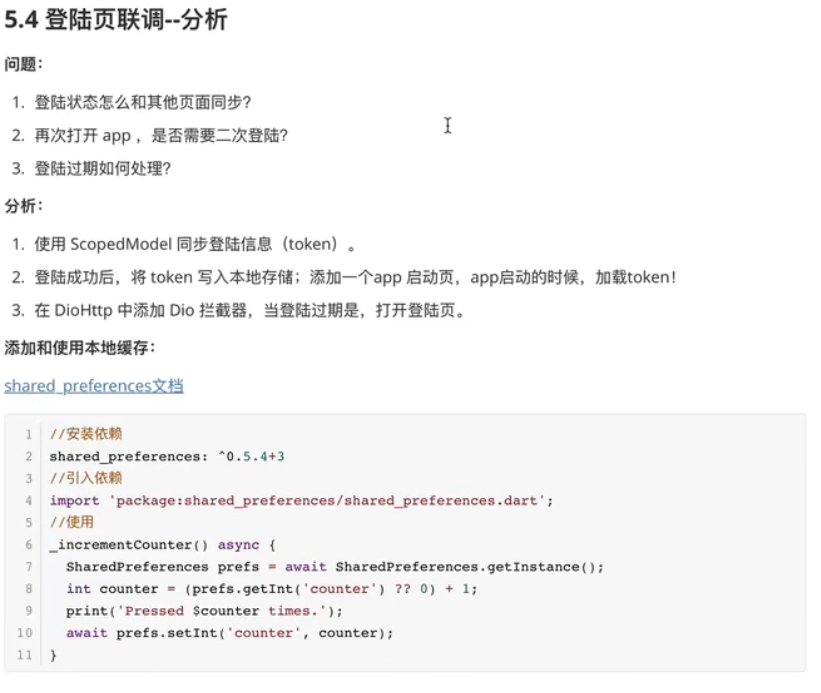
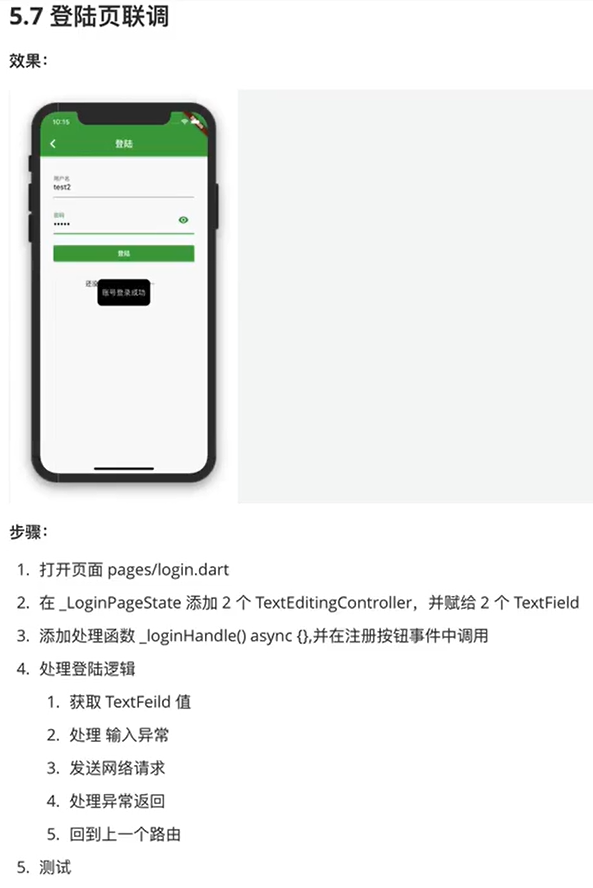
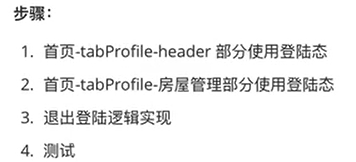

## 5前后端联调

### 5.1介绍Dio

### 5.2

### 5.3

### 5.4

### 5.5

### 5.6

### 5.7

### 5.8

### 5.9

### 5.10

### 5.11

### 5.12

### 5.13

### 5.14

### 5.15

### 5.16

### 5.17

### 5.18

### 5.19

### 5.20

### 5.21

### 5.22

### 5.23

### 5.24

### 5.25

### 5.26

## 6构建打包

### 6.1

### 6.2

### 6.3

## 7总结

注意：搜索页这里指（只做了）community_picker（类似的）

