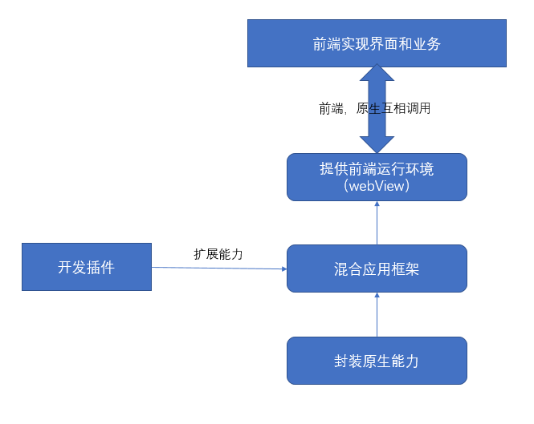
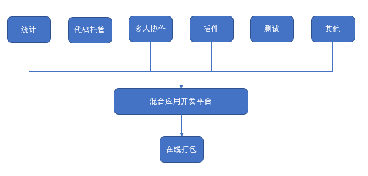

## 第二章 HyBirdApp(混合应用)

HyBirdApp（混合应用），如何混合，如何开发，是本章要

### 目标

1. 了解混合应用开发分工（前端，原生）
2. 了解什么是混合应用开发框架
3. 了解混合应用的适用情景

### 2.1 混合应用开发分工

混合应用需要结合前端和原生技术。那么到底如何结合呢？

1. 前端：负责绝大多数的界面以及业务逻辑
2. 原生：封装原生功能给前端调用
3. 两种技术通过运行在App内部的特殊浏览器webView实现通信

​	对前端开发者而言，混合应用可以简单地理解为让前端页面跑在一个特殊的浏览器环境里，这个浏览器的强大之处在于既可以使用常规的Web API，也可以调用手机原生能力的API。

​	对于原生开发者而言，混合应用就是一个套着原生App外壳，内部提供一个封装了许多原生功能的WebView(浏览器)，然后在应用程序启动时通过WebView加载本地，或者在服务器的前端页面，剩下的工作基本都交给前端了。

#### 小结

​	综上咱们前端开发人员而言，混合应用开发跟写移动端的网页，差别不大，用到原生功能的地方会有原生开发者提供，咱们只需要按照规范调用即可。

### 2.2混合应用开发框架

####  框架职责

为了快速开发混合应用，就有了一些封装好的原生App外壳，也可以把他们称作混合应用开发框架，它主要干了三件事：

1. 提供前端运行环境(webView)；

2. 实现了前端和原生的交互(互相调用)；

3. 封装了部分原生功能，并且支持原生开发者通过插件对其进行扩展。

   是否只要有了混合应用开发框架，前端开发者就可以在完全不懂原生技术的情况下开发混合引用呢？咱们来看看有哪些现成的解决方案。

#### Cordova

Cordova/PhoneGap应该是最早出现的混合应用开发框架，统称为Cordova。他主要提供了三种能力:

1. 前端与原生代码的通信能力(互相调用)；
2. 原生插件机制(供原生开发者扩展能力)；
3. 跨平台打包能力(一次开发，多端通用)。

但是这个开发框架太简洁，他只为前端提供了一个 WebView，至于如何开发应用界面，全凭开发者自己。其 App 外壳也只提供了少数原生 API，其他原生功能都要靠插件实现。因为框架足够简洁，只有最基础的功能集合，对于业务的干扰很小，定制性很高。

Cordova也有一些明显的不足。首先它是基于一个WebView，在实现转场动画也叫App页面切换时的动画效果时，只能通过纯前端技术实现，但目前纯前端技术实现的转场动画跟原生实现相比并不流畅，同时手机系统厂商优化的重点应该不在WebView上，所以单webView在转场动画这块是一个大问题。Cordova的插件虽然多，在查找以及使用时需要有一定的英文能力，如果碰到插件Bug而你一点原生开发能力也没有，那就歇菜了。所以如果你不会原生开发，英文水平也不太好，在使用Cordova时，需要踩很多坑。

#### 混合应用开发平台

为了解决Cordova的痛点，国内厂商提出了一种解决方案，或者说提供了一个混合应用开发平台，厂商很多,对应的平台也有很多（如APICloud移动应用云、AppCan移动云平台、DCloud），但是他们基于Cordova所有的改进都十分类似:

1. 通过云开发的方式管理项目,除了写代码之外，其他的诸如编译，测试都能够直接在平台完成;(省去了开发环境配置)
2. 封装了很多原生能力，绝大多数功能都可以直接使用;
3. 符合国情的本土化插件；
4. 使用多个WebView，能够直接利用原生的转场动画，解决纯前端转场动画的性能问题。

结合以上特性，混合应用开发平台实际上已经将 Hybrid App 开发完全变成了前端开发者“一个人的事”，普通原生需求都内置了，扩展原生需求可以借助插件生态实现，前端转场不流畅可以用原生效果代替，甚至还提供 App 开发的全生命周期管理功能，包括 App 配置、项目管理、更新、统计等。可以说，混合应用开发平台这种模式的出现，将 Hybrid App 开发的技术门槛降到了最低，真正实现了只要一名前端就能开发跨平台 App 的目标，而且整个开发过程只需要用到 Web 前端技术，因此开发速度可以非常块，一个熟练的前端开发者完全可以在几天之内完成一个中小规模的 App 开发。

#### 其他

市面上还有很多其他的混合应用开发框架，比如Ionic，内部还是Cordova，UI部分使用Angular进行了封装，用它来开发就有点类似于使用UI框架开发网页，速度会更快一些。还有React Native，这个框架的理念比Cordova更先进，在视图层封装了一套语法，前端使用它提供的语法开发界面和业务逻辑，打包为App时，会直接翻译为对应平台的原生代码，在体验和性能上更加接近于原生应用，NativeScript和Weex跟他的理念差不多，都是最终编译为原生代码。

#### 小结

本节简单介绍了几类不同的混合应用开发框架，基于一个webView的Cordova，混合应用开发平台，前端代码编译为原生代码的React Native。不同框架的用法不尽相同，也各有优缺点，后面的章节会详细介绍，这里就不在展开。

### 2.3为什么要混合开发？

对于什么是混合应用和常见的混合应用开发框架，已经有了个基本的认识，至于它的适用场景需要结合他的优缺点才能够讨论，所以先看看它有哪些优缺点。

#### 优缺点

这种开发方式在理想情况下可以在只投入前端开发者，快速开发出多个平台的App，相比于原生开发同时降低了开发时间和人力成本，这也是为什么混合应用开发一直生命力旺盛的原因(省钱)。

混合开发的缺点也十分明显，受限于HTML5的瓶颈，混合应用在UI部分只能说尽可能向原生靠拢，很难达到完全一致,就算编译为原生代码，也只能说尽可能接近原生，无法完全一致；界面的载入速度受限于手机性能，网络传输速度，如果网页在本地还受到页面大小的影响，如果这部分没有进行优化，很容易让用户觉得跟浏览网页一样，使得用户体验打折。

#### 适用情景
结合上述优缺点分析，混合开发方式比较适合以下类型的项目：

- UI要求不高，功能导向的项目，例如企业内部 App、面向特定用户的工具类 App；
- 需要快速开发迭代的项目，例如新产品试水、外包项目；
- 缺少原生开发团队的企业。

总而言之，没有极致的用户体验要求，项目周期及预算都有限的App项目，都比较适合这种开发方式。而在外包领域，绝大多数都是混合应用。以及很多中小型公司，初期没有配备原生开发团队，也会选用混合开发。但是一定要记住，如果没有原生开发人员，混合应用中的原生功能依赖于选择的开发框架以及插件生态，如果最开没有做好技术选型，可能会出现开发到一半做不下去的情况。

### 总结

咱们简单了解了混合应用开发的原理，并且介绍了目前市面上常见的混合应用开发框架。旨在让从来没有了解过混合应用开发的初学者，了解前端工程师在混合应用开发中的定位以及职责。同时还介绍了这种开发方式的优缺点以及适用情况。