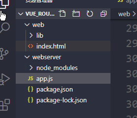
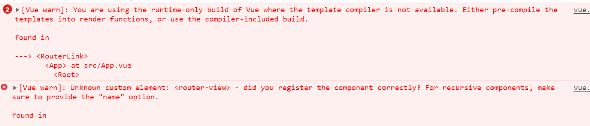
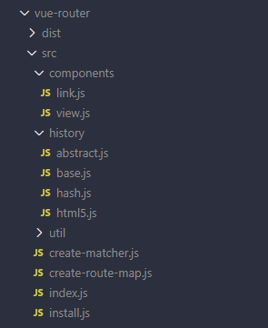

#### 1、路由简介

路由的本质就是**对应关系**。 在开发中，路由分为：后端路由、前端路由。

后端路由：概念：根据不同的用户 URL 请求,返回不同内容。本质：URL 请求地址与服务器资源之间的对应关系 

Ajax前端渲染，前端渲染提高性能，但是不支持浏览器的前进后退操作。SPA（Single Page Application）单页面应用程序：整个网站只有一个页面，内容的变化通过Ajax局部更新实现，同时支持浏览器地址栏的前进和后退操作。SPA实现原理之一：基于URL地址的hash（hash的变化会导致浏览器记录访问历 史的变化、但是hash的变化不会触发新的URL请求。在实现SPA过程中，最核心的技术点就是前端路由。

前端路由：概念：根据不同的用户事件，显示不同页面内容。本质：用户事件与事件处理函数之间的对应关系。

#### 2、实现简易前端路由 

 基于URL中的hash实现（点击菜单的时候改变URL的hash，根据hash的变化控制组件的切换） 

```html
    <div id="app">
      <!-- 切换组件的超链接 -->
      <a href="#/zhuye">主页</a> 
      <a href="#/keji">科技</a> 
      <a href="#/caijing">财经</a>
      <a href="#/yule">娱乐</a>
      <!-- 根据 :is 属性指定的组件名称，把对应的组件渲染到 component 标签所在的位置 -->
      <!-- 可以把 component 标签当做是【组件的占位符】 -->
      <component :is="comName"></component>
    </div>
    <script>
      const zhuye = {      // 主页组件
        template: '<h1>主页信息</h1>'
      }
      ......
      // 监听 window 的 onhashchange 事件，根据获取到的最新的 hash 值，切换要显示的组件的名称
      window.onhashchange = function() {
        switch(location.hash.slice(1)){  // 通过 location.hash 获取到最新的 hash 值
          case '/zhuye':
            vm.comName = 'zhuye'
          break
          case '/keji':
            vm.comName = 'keji'
          break
          case '/caijing':
            vm.comName = 'caijing'
          break
          case '/yule':
            vm.comName = 'yule'
          break
        }
      }......
```

#### 3、vue-router的基本使用

`Vue Router`(`https://router.vuejs.org/zh/`)是 `Vue.js` 官方的路由管理器,它和` Vue.js` 的核心深度集成

基本使用的步骤：①引入相关的库文件 

```js
<!-- 导入 vue 文件，为全局 window 对象挂载 Vue 构造函数 -->   
<script src="./lib/vue_2.5.22.js"></script> 
<!-- 导入 vue-router 文件，为全局 window 对象挂载 VueRouter 构造函数 --> 
<script src="./lib/vue-router_3.0.2.js"></script> 
```

②添加路由链接：router-link 是 vue 中提供的标签，默认会被渲染为 a 标签； to 属性默认会被渲染为 href 属性，to 属性的值默认会被渲染为 # 开头的 hash 地址。

```js
<router-link to="/user">User</router-link> 
<router-link to="/register">Register</router-link>
```

③添加路由填充位（路由占位符）：将来通过路由规则匹配到的组件，将会被渲染到 router-view 所在的位置。

```js
<router-view></router-view> 
```

④定义路由组件 

```js
 var User = { 
     template: '<div>User</div>' 
  } 
  var Register = { 
     template: '<div>Register</div>' 
  } 
```

⑤配置路由规则并创建路由实例 

```js
var router = new VueRouter({      // 创建路由实例对象
    routes: [           // routes 是路由规则数组   
       {path:'/user',component: User}, 
      {path:'/register',component: Register} 
    ] 
  }) 
```

⑥把路由挂载到 Vue 根实例中 

```js
 new Vue({ 
     el: '#app', 
     router 
  }); 
```

#### 4、路由重定向

路由重定向指的是：用户在访问地址 A 的时候，强制用户跳转到地址 C ，从而展示特定的组件页面；

#### 5、嵌套路由

嵌套路由功能分析：点击父级路由链接显示模板内容，模板内容中又有子级路由链接 ，点击子级路由链接显示子.

父路由组件模板：父级路由链接，父组件路由填充位。子级路由模板：子级路由链接，子级路由填充位。

嵌套路由配置：父级路由通过`children`属性配置子级路由 。

#### 6、动态路由匹配

通过动态路由参数的模式进行路由匹配。

```js
      { path: '/user/:id', component: User }  // 动态路径参数 以冒号开头  
```

```js
const User = {   // 路由组件中通过$route.params获取路由参数 
    template: '<div>User {{ $route.params.id }}</div>' 
}
```

但`$route`与对应路由形成高度耦合，不够灵活，所以可以使用`props`将组件和路由解耦(路由组件传递参数)：

①props的值为布尔类型：

```js
 const router = new VueRouter({ 
    routes: [   // 如果 props 被设置为 true，route.params 将会被设置为组件属性
        { path: '/user/:id', component: User, props: true } 
    ] 
  }) 
  const User = { 
            props: ['id'], // 使用 props 接收路由参数     
            template: '<div>用户ID：{{ id }}</div>'  // 使用路由参数   
  } 
```

②props的值为对象类型：

```js
 const router = new VueRouter({ 
    routes: [    // 如果 props 是一个对象，它会被按原样设置为组件属性   
        //这里相当于给组件User,通过路由的形式传递了一个对象，而这时候id在User组件中就无法获取到了
        { path: '/user/:id', component: User, props: { uname: 'lisi', age: 12 }} 
    ] 
  }) 
  const User = { 
    props: ['uname', 'age'],   
      template: ‘<div>用户信息：{{ uname + '---' + age}}</div>'  
}
```

参数`id`无法接收到，如果要解决这个问题，可以使用`props`的值为函数类型，也就是给`props`传递一个函数。

③props的值为函数类型：

```js
const router = new VueRouter({ 
    routes: [  // 如果 props 是一个函数，则这个函数接收 route 对象为自己的形参，route就是参数对象
        { path: '/user/:id',  
        component: User,  
        props: route => ({ uname: 'zs', age: 20, id: route.params.id })} 
    ] 
  }) 
  const User = { 
    props: ['uname', 'age', 'id'],    
      template: ‘<div>用户信息：{{ uname + '---' + age + '---' + id}}</div>'  
}
```

#### 7、命名路由

为了更加方便的表示路由的路径，可以给路由规则起一个别名，即为“命名路由”。 

```js
 const router = new VueRouter({ 
    routes: [ 
      { 
        path: '/user/:id', 
        name: 'user', 
        component: User 
      } 
    ] 
  })
```

```vue
<!--单击链接，可以跳转到名称为`user`的这个路由规则，并且通过params进行参数的传递-->
<router-link :to="{ name: 'user', params: { id: 123 }}">User</router-link>
```

#### 8、编程式导航

页面导航的两种方式：

声明式导航：通过点击链接实现导航的方式，如 `<a></a>` 链接 或 vue 中的 `<router-link></router-link>` 
编程式导航：通过调用`JavaScript`形式的`API`实现导航的方式，如普通网页中的 `location.href  `

常用的编程式导航 API 如下： `this.$router.push`('hash地址') ，` this.$router.go(n) `

router.push() 方法的参数规则

```js
router.push('/home')   // 字符串(路径名称)
router.push({ path: '/home' })  // 对象
router.push({ name: '/user', params: { userId: 123 }})   // 命名的路由(传递参数)  
router.push({ path: '/regis', query: { uname: 'lisi' }}) //带查询参数,/regis?uname=lisi
```

#### 9、路由案例

```vue
<div id="app"><router-view></router-view></div> 
<!-- 右侧内容区域 -->
        <div class="content right"><div class="main-content"> <router-view /></div></div>
```

```js
 // 创建路由对象
      const router = new VueRouter({
        routes: [
          {
            path: "/",
            component: App,
            redirect: "/users",
            children: [
              { path: "/users", component: Users },
              { path: "/rights", component: Rights },
              { path: "/goods", component: Goods },
              { path: "/orders", component: Orders },
              { path: "/settings", component: Settings },
            ],
          },
        ],
      });
```

#### 10、路由守卫

`Vue-router`中的路由守卫，主要是对其内容进行保护，如果没有对应的权限，则不允许访问。

①全局守卫：所有的路由都会经过全局守卫来进行检测。

```js
  //实现全局守卫
      router.beforeEach((to, from, next) => {
        //to:去哪个页面，from来自哪个页面，next继续执行.
        //判断哪个路由需要进行守卫，这里可以通过元数据方式
        if (to.meta.auth) {
          if (window.isLogin) {
            next();
          } else {
            next("/login?redirect=" + to.fullPath);
          }
        } else {
          next();
        }
      });
```

在上面的代码中，创建了路由守卫，但是需要判断的是需要对哪个路由进行守卫，这里就是通过元数据来进行判断的。如果没有元数据，则继续访问用户要访问的页面。

```js
 // 创建路由对象
      const router = new VueRouter({
        routes: [
          { path: "/login", component: Login },
          {
            path: "/",
            component: App,
            redirect: "/users",
            children: [
              {
                path: "/users",
                component: Users,
                meta: {
                  auth: true,
                },
              },......
```

②如果项目比较简单，路由规则定义的比较少，可以将守卫定位到某个路由规则内，这就是路由独享守卫。

```js
          {
            path: "/",
            component: App,
            redirect: "/users",
            children: [
              {
                path: "/users",
                component: Users,
                meta: {
                  auth: true,
                },
                beforeEnter(to, from, next) {
                  if (window.isLogin) {
                    next();
                  } else {
                    next("/login?redirect=" + to.fullPath);
                  }
                },
              },......
```

③组件内守卫：可以在路由组件内直接定义以下路由导航守卫。

beforeRouteEnter，beforeRouteUpdate，beforeRouteLeave

```js
        beforeRouteEnter(to, from, next) {
          if (window.isLogin) {
            next();
          } else {
            next("/login?redirect=" + to.fullPath);
          }
        },......
```

#### 11、addRoutes动态路由添加

如果某些路由规则只能用户登录以后才能够访问，那么也可以不用提前定义好，而是在登录后通过`addRoutes`方法为其动态的添加。这里需要全局的路由守卫来进行校验判断，只不过这里全局路由守卫的逻辑发生了变化。

```js
router.beforeEach((to, from, next) => {
        if (window.isLogin) {          //用户已经登录
          if (to.path === "/login") {
            next("/");     // 用户已经登录了，但是又访问登录页面，这里直接跳转到用户列表页面
          } else {
            next();       //用户已经登录，并且访问其它页面，则运行访问
          }
        } else {
          if (to.path === "/login") {
            next();       //用户没有登录,并且访问的就是登录页，则运行访问登录页
          } else {       //用户没有登录，访问其它页面，则跳转到登录页面。
            next("/login?redirect=" + to.fullPath);
          }
        }
      });          //注意{ path: "/login", component: Login }路由规则还是要事先声明
```

```react
        methods: {   //对登录组件进行修改
          login() {
            window.isLogin = true;
            if (this.$route.query.redirect) {
              this.$router.addRoutes([       //动态添加路由：
                {
                  path: "/",
                  component: App,
                  redirect: "/users",
                  children: [
                    {
                      path: "/users",
                      component: Users,
                      meta: {
                        auth: true,
                      }
                    },
                    { path: "/userinfo/:id", component: UserInfo, props: true },
                  ],
                },
              ]);
              this.$router.push(this.$route.query.redirect);
            } else {
              this.$router.push("/");
            }
          },......};
```

#### 12、路由组件缓存

利用`keepalive`做组件缓存，保留组件状态，提高执行效率。使用`include`或者`exclude`时要给组件设置`name`（这个是组件的名称，组件的名称通过给组件添加`name`属性来进行设置）（不设置则将所有的组件都缓存）

通过`include`添加了需要缓存的组件的名称，如果有多个在`include`中可以继续添加，每个组件名称之间用逗号分隔。`exclude`则表示的就是除了指定的组件以外（也是组件的`name`），其它组件都进行缓存。

```vue
<keep-alive include="home">
    <router-view></router-view>  <!-- 或<router-view /> -->
</keep-alive>
```

在以下场景中使用keep-alive组件会显著提高用户体验，菜单存在多级关系，多见于列表页+详情页的场景，如商品列表页点击商品跳转到商品详情，返回后仍显示原有信息；订单列表跳转到订单详情，返回，等等场景。

生命周期：`activated`和`deactivated`会在`keep-alive`内所有嵌套的组件中触发。如：B页面是缓存页面，当A页面跳到B页面时，B页面的生命周期activated（可在此时更新数据）；B页面跳出时，触发deactivated；B页面自身刷新时，会触发created-mouted-activated。

#### 13、Hash模式与History模式

前端路由中，不管是什么实现模式，都是客户端的一种实现方式，也就是当路径发生变化的时候，是不会向服务器发送请求的。如果需要向服务器发送请求，需要用到`ajax`方式。

①表现形式的区别：

`Hash`模式：`hash`模式中路径带有`#`, `#`后面的内容作为路由地址。可以通过问号携带参数。当然这种模式相对来说比较丑，路径中带有与数据无关的符号，例如`#`与`?`

`History`模式：`History`模式是一个正常的路径的模式，如果要想实现这种模式，还需要服务端的相应支持。

②原理上的区别：

`Hash`模式是基于锚点和`onhashchange`事件，通过锚点的值作为路由地址,地址变化后触发`onhashchange`事件.

`History`模式是基于`HTML5`中的`History API`，history.pushState( )(IE10+才支持)和history.replaceState( ).

`History`模式需要服务器的支持，是因为在单页面的应用中，只有一个页面，也就是`index.html`这个页面，服务端不存在`http://www.test.com/login`这样的地址，如果刷新浏览器，请求服务器，是找不到`/login`这个页面的，所以会出现`404`的错误。所以在服务端应该除了静态资源外都返回单页应用的`index.html`。



在`web`目录下面，存放的是`index.html`，在`webserver`目录下面存放的是`node`代码。

```
npm install --save connect-history-api-fallback  //connect-history-api-fallback模块的安装
```

```
npm install express  //安装express
```

```
node app.js  //启动服务
```

app.js文件中的代码如下：

```js
const path = require("path");
const history = require("connect-history-api-fallback");  //导入处理history模式的模块
const express = require("express");
const app = express();
//注册处理history模式的中间件。服务器开启了history模式，服务器会检查。
app.use(history());
//处理静态资源的中间件,处理web目录下的index.html
app.use(express.static(path.join(__dirname, "../web")));
app.listen(3000, () => {
  console.log("服务器开启");
});
```

在Nginx服务器中配置History模式：

代理服务器：一般是指局域网内部的机器通过代理服务器发送请求到互联网上的服务器，代理服务器一般作用在客户端。应用如：GoAgent，翻墙神器。

反向代理服务器：在服务器端接受客户端的请求，然后把请求分发给具体的服务器进行处理，然后再将服务器的响应结果反馈给客户端。Nginx就是其中的一种反向代理服务器软件。 

Nginx ("engine x") 是俄罗斯人Igor Sysoev(塞索耶夫)编写的一款高性能的 HTTP 和反向代理服务器，也是一个IMAP/POP3/SMTP代理服务器；即Nginx本身就可以托管网站，进行HTTP服务处理，也可以作为反向代理服务器使用。淘宝、新浪博客、新浪播客、网易新闻、六间房、56.com、Discuz!、水木社区、豆瓣、YUPOO、海内、迅雷在线 等多家网站使用 Nginx 作为Web服务器或反向代理服务器。Nginx的特点：

①跨平台：Nginx可在大多数 Unix like OS编译运行，而且也有Windows的移植版本。   

②配置异常简单，非常容易上手，配置风格跟程序开发一样   

③非阻塞、高并发连接：数据复制时，磁盘I/O的第一阶段是非阻塞的，官方测试能够支撑5万并发连接，在实际生产环境中跑到2～3万并发连接数   

④内存消耗小：处理大并发的请求内存消耗非常小，在3万并发连接下，开启的10个Nginx 进程才消耗150M内存（15M*10=150M）  

⑤成本低廉：Nginx为开源软件，可以免费使用，而购买F5 BIG-IP、NetScaler等硬件负载均衡交换机则需要十多万至几十万人民币    

⑥内置的健康检查功能：如果 Nginx Proxy 后端的某台 Web 服务器宕机了，不会影响前端访问   

⑦节省带宽：支持 GZIP 压缩，可以添加浏览器本地缓存的 Header 头   

⑧稳定性高：用于反向代理，宕机的概率微乎其微 

（高并发：使用技术手段使得系统可以并行处理很多的请求。衡量指标常用的有响应时间，吞吐量，每秒查询QPS，并发用户数。响应时间：系统对请求做出响应的时间，简单理解为一个http请求返回所用的时间。吞吐量：单位时间内处理的请求数量。QPS：每秒可以处理的请求数。并发用户数：同时承载正常使用系统功能的用户数量，也就是多少个人同时使用这个系统，这个系统还能正常运行，这个用户数量就是并发用户数。）

Nginx启动：到官网下载Windows版本（http://nginx.org/en/download.html）；解压到磁盘任一目录（不能含中文目录）；修改配置文件；启动服务（直接运行nginx.exe）。

Nginx服务器默认占用的是80端口号，而在window10中端口号80已经被其它的应用程序占用，所以可修改Nginx的端口号，在conf目录下找到nginx.conf文件，该文件就是Nginx服务的配置文件，通过该配置文件可以修改Nginx的端口号。如将端口号修改成了:8081后在浏览器的地址栏中输入：[http://localhost:8081](http://localhost:8081/)  可以打开默认的欢迎页面，表示Nginx服务启动成功。可将做好的网站页面拷贝（部署）到`Nginx`中的`html`目录中，就可以看到对应的页面。

点击刷新按钮就会向服务器发送请求，而在服务端没有对应的文件，所以会出现404的错误。需要对`Nginx`服务器进行配置，找到`conf`目录下的`nginx.conf`进行如下的配置：

```
 location / {
            root   html;
            index  index.html index.htm;
			try_files $uri $uri/ /index.html;
        }
```

`try_files`配置，表示尝试访问文件。`$uri`表示根据所请求的`url`地址查找对应文件，如果找到了返回，没有找到则将`$uri`作为目录，查找该目录下的`index.html`，如果找到就返回，没有找到则直接返回`html`目录下面的`index.html`文件。需要重新启动服务器：打开`cmd`，然后定位到`Nginx`的目录，输入以下命令：

```
nginx -s reload
```


###                                                VueRouter原理

这里模拟的是`History`模式。`Hash`模式基本实现上是一样的。

通过`history.pushState()`方法改变地址栏，并且将当前地址记录到浏览器的历史记录中，当前浏览器不会向服务器发送请求。监听`popstate`事件，可以发现浏览器历史操作的变化，记录改变后的地址，单击前进或者是后退按钮的时候触发该事件。根据当前路由地址找到对应组件重新渲染。

#### 1、分析VueRouter

```js
Vue.use(VueRouter)  //注册插件
const router=new VueRouter({  //创建路由对象
    routes:[
        {name:'home',path:'/',component:homeComponent}
    ]
})
new Vue({  // 创建Vue实例，注册router对象
    router,
    render:h=>h(App)
}).$mount('#apps')
  //或const vm = new Vue({
  //    el: "#app",
  //    router,
  //});
```

`use`方法需要的参数可以是一个函数或者是对象，如果传递的是函数，`use`内部会直接调用该函数，如果传递的是一个对象，那么在`use`内部会调用该对象的`install`方法。这里传递的是对象。


`VueRouter`可以是构造方法或者是类。这里在将其定义为类且该类中有一个静态的`install`方法。

`VueRouter`的属性和方法：

①`options`作用是记录构造函数中传入的对象，在创建`VueRouter`的实例的时候，传递了一个对象，而该对象中定义了路由规则，而`options`就是记录传入的这个对象的。

②`routeMap`:是一个对象，记录路由地址与组件的对应关系，也就是一个键值对的形式，options中路由规则解析到`routeMap`中。

③`data`是一个对象，该对象中有一个属性`current`,该属性用来记录当前的路由地址，`data`是一个响应式的对象，因为当前路由地址发生变化后，对应的组件要发生更新（即当地址变化后，要加载对应组件）。

④`install`是一个静态方法，用来实现`Vue`的插件机制。

⑤`Constructor`是一个构造方法，该构造方法中会初始化`options` ,`data`,`routeMap`这几个属性。

⑥`inti`方法主要是用来调用下面的三个方法，也就把不同的代码分隔到不同的方法中去实现。

⑦`initEvent`方法，用来注册`popstate`事件。

⑧`createRouteMap`方法，该方法会把构造函数中传入进来的路由规则，转换成键值对的形式存储到`routeMap`中。 键就是路由的地址，值就是对应的组件。

⑨`initComponents`方法，主要作用是用来创建`router-link`和`router-view`这两个组件的。

#### 2、install方法实现

在`vue_router_app`项目的`src`目录下面创建一个`vuerouter`目录，里面创建`index.js`文件：

```js
let _Vue = null;
export default class VueRouter {
  static install(Vue) { //install方法需要的参数是Vue的构造方法。调用该方法时会传递Vue的构造函数
    //首先判断插件是否已经被安装，如果已经被安装，就不需要重复安装。   
    if (VueRouter.install.installed) {    //1、判断当前插件是否已经被安装:  
      return;      //条件成立，表明插件已经被安装，什么都不要做。
    }
    VueRouter.install.installed = true;
    _Vue = Vue;    //2、把Vue构造函数记录到全局变量中。
    _Vue.mixin({    //3、把创建Vue实例时候传入的router对象注入到Vue实例上。
      beforeCreate() {
       //在创建Vue实例时，即new Vue()的时候，才有$options这个属性，组件中是没有$options这个属性的。
        if (this.$options.router) {
          _Vue.prototype.$router = this.$options.router;
          this.$options.router.init();     //调用init
        }
      },
    });
  },......
}
```

#### 3、实现构造函数

```js
 constructor(options) {
    this.options = options;
    this.routeMap = {};
    this.data = _Vue.observable({
      current: "/",
    }); 
  }
```

#### 4、createRouteMap方法实现

```js
  createRouteMap() {
    this.options.routes.forEach((route) => {
      this.routeMap[route.path] = route.component;
    });
  }
```

#### 5、initComponents方法实现

```js
 initComponents(Vue) {  //该方法后面要改版
    Vue.component("router-link", {
      props: {
        to: String,
      },
      template: '<a :href="to"><slot></slot></a>',
    });
  }
```

#### 6、对这些代码进行测试

```js
  init() {  //该方法后面要改版
    this.createRouteMap();
    this.initComponents(_Vue);
  }
```

#### 7、定义路由规则和创建对应组件（router.js）

在`vue_router_app`项目的`src`目录下面创建`router.js`文件（定义路由规则）：

```js
import Vue from "vue";
import Router from "./vuerouter";  //这里导入的是自己定义的路由规则
import Login from "./components/Login.vue";
import Home from "./components/Home.vue";
Vue.use(Router);
export default new Router({
  model: "history",  //虽然这个案例写这个没什么用
  routes: [
    { path: "/", component: Home },
    { path: "/login", component: Login },
  ],
});

```

在`components`目录下面分别创建`Home.vue`与`Login.vue`，并改造`App.vue`组件的内容。

#### 8、完成路由的注册（main.js）

```js
import Vue from "vue";
import App from "./App.vue";
//导入router.js
import router from "./router";
Vue.config.productionTip = false;
new Vue({  //在main.js中完成路由的注册
  router,
  render: (h) => h(App),
}).$mount("#app");

```

#### 9、运行时出现错误（vue.config.js或index.js）



第二个错误是我们还没有创建`router-view`这个组件，所以才会出现该错误，这里暂时可以先不用考虑。

第一个错误的含义是，目前我们使用的是运行时版本的`Vue`, 模板编译器不可用，可以使用预编译把模板编译成`render`函数或者是使用包含编译版本的`Vue`。`Vue`的构建版本有两个，分别是“运行时版”和"完整版"：

运行时版：不支持`template`模板，需要打包的时候提前编译，使用`vue-cli`创建的项目默认为运行时版本。完整版：包含运行时和编译器，体积比运行时版大`10k`左右，程序运行的时候把模板转换成`render`函数，性能低于运行时版本。

解决方案：

①修改成完整版就有编译器，对模板进行编译：在项目的根目录创建`vue.config.js`文件，在该文件中添加`runtimeCompiler`配置项，该配置项表示的是，是否使用包含运行时编译器的`Vue`构建版本（完整版）。该选项的默认取值为false，改为true后表示使用的是完整版（体积比运行时版本大`10k`左右），这时编译器会将`template`选项转换成`render`函数。（修改后须重新启动服务器）

```js
module.exports = {
  runtimeCompiler: true,
};
```

②编写render函数，在运行时版本解决

我们知道，完整版中的编译器的作用就是将`template`模板转成`render`函数，所以在运行时版本中我们可以自己编写`render`函数。（在单文件组件中写`<template></template>`，并且没有写`render`函数，为什么能够正常的工作？因为在打包的时候，将`<template>`编译成了`render`函数，这就是预编译）

```js
  initComponents(Vue) { //该方法需要一个参数为Vue的构造函数，当然也可以使用全局的_Vue
    Vue.component("router-link", {
      props: {
        to: String,
      },
      render(h) {
        return h(
          "a",
          {
            attrs: {
              href: this.to,
            },
          },
          [this.$slots.default]
        );
      },
    });
  }
```

#### 10、创建router-view组件与方法改版（index.js）

`router-view`组件就是一个占位符。当根据路由规则找到组件后，会渲染到`router-view`的位置。

```js
  initComponents(Vue) {  //修改后的initComponents方法
    Vue.component("router-link", {
      props: {
        to: String,
      },
      render(h) {
        return h(
          "a",
          {
            attrs: {
              href: this.to,
            },
            on: {
              click: this.clickHandler,
            },
          },
          [this.$slots.default]
        );
      },
      methods: {
        clickHandler(e) {
          history.pushState({}, "", this.to);
          this.$router.data.current = this.to;
          e.preventDefault();    //阻止默认行为，阻止刷新后向服务器发请求
        },
      },
    });
    const self = this;//修改this的指向
    Vue.component("router-view", {  //在initComponents方法中创建router-view组件
      render(h) {        //根据当前的路径从routeMap中查找对应的组件
        const component = self.routeMap[self.data.current];
        return h(component);     //将组件转换成虚拟dom
      },
    });
  }
```

#### 11、initEvent方法实现（index.js）

当点击浏览器的后退与前进按钮时，地址栏中的地址发生变化，对应的组件也要变化，就要用到`popstate`事件

```js
initEvent() {
    window.addEventListener("popstate", () => {
      this.data.current = window.location.pathname;
    });
  }
```

#### 12、重新进行测试（index.js）

```js
init() {  //进行测试
    this.createRouteMap();
    this.initComponents(_Vue);
    this.initEvent();
  }
```

### VueRouter含路由嵌套的模拟实现

#### 1、Vue.use( )源码

源码位置：`vue/src/core/global-api/use.js`

```js
export function initUse (Vue: GlobalAPI) {
    //inituse方法的参数接收的是一个插件，该插件的类型可以是一个函数，也可以是一个对象
  Vue.use = function (plugin: Function | Object) {
    //_installedPlugins数组中存放已经安装的插件。
    const installedPlugins = (this._installedPlugins || (this._installedPlugins = []))
    //判断一下传递过来的插件是否在installedPlugins中存在，如果存在，则直接返回
    if (installedPlugins.indexOf(plugin) > -1) {
      return this
    }
    // additional parameters  //将arguments转换成数组，并且将数组中的第一项去除
    const args = toArray(arguments, 1)
    //把this(也就是Vue，这里是通过Vue.use来调用的)插入到数组中的第一个元素的位置。
    args.unshift(this)
    if (typeof plugin.install === 'function') {  //如果plugin是个对象，看下是否有install函数
     //如果有install这个函数，直接调用，通过apply将args数组中的每一项展开传递给install这个函数
     // plugin.install(args[0],args[1]....)，而args[0],就是上面我们所插入的Vue
      plugin.install.apply(plugin, args)
    } else if (typeof plugin === 'function') {
      plugin.apply(null, args)   //如果plugin是个函数，则直接通过apply去调用
    }
    installedPlugins.push(plugin) //将插件存储到installedPlugins数组中
    return this
  }
}
```

#### 2、install方法分析

`vue-router`的源码目录结构



`components`目录下面，`link.js`文件创建`RouterLink`组件，`view.js`文件创建`RouterView`组件。

`history`目录下的文件是记录路由的历史记录（`hash.js`文件是关于`hash`模式，`html5.js`关于`html5`的方式，`base.js`公共的内容，`abstract.js`是在服务端渲染中实现的路由历史记录）。

`index.js`文件是用来创建`VueRouter`，`install.js`文件是关于`install`方法。


在`index.js`文件中：（后面要完善）

```js
import install from "./install";
export default class VueRouter {
  constructor(options) {  //在创建VueRouter对象的时候，会传递选项
    this._options = options.routes || [];    //获取routes选项，该选项中定义路由规则
  }
  init(Vue) {}  // 注册路由变化的事件，该方法的参数是一个Vue实例，后期完善
}
VueRouter.install = install;  //将install方法挂载到VueRouter上
```

在`install.js`文件中：（后面要完善）

```js
import View from "./components/view";  //导入下面创建的组件
import Link from "./components/link";
export let _Vue = null; //将其导出，在其它文件中也可以使用Vue实例，而不需要单独的引入Vue的js文件
export default function install(Vue) {
  _Vue = Vue;  //获取Vue构造函数
  _Vue.mixin({    //通过混入以后，所有的Vue实例中都会有beforeCreate方法	
    beforeCreate() {
      if (this.$options.router) { //判断是否为Vue的实例，条件成立则为Vue的实例，否则为其它对应组件
        this._routerRoot = this;  //把Vue的实例挂载到当前实例的私有属性_routerRoot属性上
        this._router = this.$options.router;
        this._router.init(this);   //调用index.js文件中定义的init方法
        //Vue.util.defineReactive(this, "_route", this._router.history.current);
      } else {
        this._routerRoot = this.$parent && this.$parent._routerRoot;
      }
    },
  });
  Vue.component("RouterView", View);   //完成组件的注册
  Vue.component("RouterLink", Link);
}
```

#### 3、组件创建测试

简单实现下`Router-link`组件与`Router-view`组件，做个简单的测试，后面再完善：

```js
export default {  //view.js文件，后面要完善
  render(h) {
    return h("div", "router-view"); //第二个参数已省略（可选）
  },
};
```

```js
export default {  //link.js文件
  props: {
    to: {
      type: String,
      required: true,
    },
  },
  render(h) {  //通过插槽获取`a`标签内的文本。
    return h("a", { domProps: { href: "#" + this.to } }, [this.$slots.default]);
  },
};
```

在`src`目录下，在`router.js`文件中导入自己定义的`VueRouter`.

```js
import Vue from "vue";
import Router from "./my-vue-router";  //导入
import Login from "./components/Login.vue";
import Home from "./components/Home.vue";
import About from "./components/About.vue";
import Users from "./components/Users";
Vue.use(Router);
export default new Router({
  mode: "history",
  routes: [
    { path: "/", component: Home },
    { path: "/login", component: Login },
    {
      path: "/about",
      component: About,
      children: [{ path: "users", component: Users }],  //添加对应的子路由规则
    },
  ],
});
```

#### 4、解析路由规则

对所有的路由规则进行解析，将其解析到一个数组中，方便根据地址找到对应的组件。在`create-matcher.js`文件中创建`createMatcher`方法：该方法返回的`matcher` 是个匹配器，其中有两个成员，`match`和`addRoutes`

在`index.js`文件中添加如下的代码：

```js
    this.matcher = createMatcher(this._routes);
```

在`create-matcher.js` 文件中：

```js
import createRouteMap from "./create-route-map";
import createRoute from "./util/route";
export default function createMatcher(routes) {
  const { pathList, pathMap } = createRouteMap(routes);
  //console.log("pathList==", pathList); //测试
  //console.log("pathMap==", pathMap);  //测试
  function match(path) {  //实现match方法，match方法的作用就是根据路由地址，匹配一个路由对象
    //其实就是从pathMap中根据路由地址，找出对应的路由记录（记录了组件信息），再传入createRoute方法中
    const record = pathMap[path];
    if (record) {  //根据路由地址，创建route路由规则对象
      return createRoute(record, path);
    }
    return createRoute(null, path);
  }
  function addRoutes(routes) {
    createRouteMap(routes, pathList, pathMap);
  }
  return {
    match,     //根据路由地址匹配相应的路由规则对象
    addRoutes, //动态添加路由
  };
}
```

在`create-route-map.js` 文件中：

```js
export default function createRouteMap(routes, oldPathList, oldPathMap) {
  const pathList = oldPathList || [];
  const pathMap = oldPathMap || {};
  //遍历所有的路由规则，进行解析，同时还要考虑children的形式，所以这里需要使用递归的方式
  routes.forEach((route) => {
    addRouteRecord(route, pathList, pathMap);
  });
  return {
    pathList,
    pathMap,
  };
}
function addRouteRecord(route, pathList, pathMap, parentRecord) { //从路由规则中获取path
  const path = parentRecord ? `${parentRecord.path}/${route.path}` : route.path;
  const record = {  //构建记录
    path,
    component: route.component,
    parent: parentRecord //如果是子路由则记录子路由对应的父record对象,相当于记录了父子关系
  };
  if (!pathMap[path]) {  //如果已经有了path,相同的path直接跳过
    pathList.push(path);
    pathMap[path] = record;
  }
  if (route.children) {  //判断route中是否有子路由
    route.children.forEach((childRoute) => {  //遍历子路由，把子路由添加到pathList与pathMap中
      addRouteRecord(childRoute, pathList, pathMap, record);
    });
  }
}
```

#### 5、createRoute方法实现

在`util`目录下`route.js`文件，定义`createRoute`方法：


```js
export default function createRoute(record, path) {
  const matched = [];
  while (record) {
    matched.unshift(record);
    record = record.parent;  //有可能包含了父路由以及子路由记录，这块内容存储到一个数组中
  }
  return {
    path,
    matched,  //可以获取到包含了整个路由记录的这个数组，从而可以将对应的组件全部创建出来
  };
}
```

#### 6、历史记录处理

关于路由有三种模式：hash模式，html5模式，abstract模式（该模式与服务端渲染有关）

这里实现的是`hash`模式的历史记录管理。不管是哪种模式都有相同的内容，这里将相同内容定义到父类中。

在`my-vue-router`目录下的`history`目录下的`base.js`文件：（后面要完善）在该父类中主要有如下内容：

①`router`属性：路由对象（`ViewRouter`）

②`current`属性：记录当前路径对应的路由规则对象{path:'/',matched:[]}，即createRoute方法中返回的内容

③`transitionTo()`：跳转到指定的路径，根据当前路径获取匹配的路由规则对象`route`，然后更新视图。

```js
import createRoute from "../util/route";
export default class History {
  constructor(router) {  // router为路由对象ViewRouter
    this.router = router;
    this.current = createRoute(null, "/");  //初始化，默认值/
  }
  transitionTo(path, onComplete) {
    this.current = this.router.matcher.match(path);  //注意this指向，指向调用者（或子类实例）
    //console.log("current===", this.current);  //测试
    onComplete && onComplete();  //该回调函数在调用transitionTo方法的时候，会传递过来
  }
}
```

在`history`目录下的`hash.js`文件中：对应的子类HashHistory继承History：

```js
import History from "./base";
export default class HashHistory extends History {
  constructor(router) {
    super(router);    //将路由对象传递给父类的构造函数
    ensureSlash();    //确保首次访问时有hash地址或hash地址加上#/ （由于没有添加this,为普通方法）
  }
  getCurrentLocation() {  // 获取当前的路由地址（#后面的部分）所以要去除#
    return window.location.hash.slice(1);
  }
  setUpListener() {  // 监听hashchange事件，也就是监听路由地址的变化
    window.addEventListener("hashchange", () => {
      this.transitionTo(this.getCurrentLocation());  //当路由地址发生变化后，跳转到新的路由地址
    });
  }
}
function ensureSlash() {  //判断当前是否有hash，如果单击的是链接，肯定会有hash
  if (window.location.hash) {
    return;
  }
  window.location.hash = "/";  //完成了一次地址的修改，所以执行这里会跳转一次
}
```

#### 7、init方法实现

这里需要先根据指定的`mode`的模式，来选择`history`目录中的不同js文件内容来处理。

所以在`my-vue-router`目录中的`index.js`文件中，做如下的修改：

```js
import install from "./install";
import createMatcher from "./create-matcher";
import HashHistory from "./history/hash";
import HTML5History from "./history/html5";
export default class VueRouter {
  constructor(options) {  //在创建VueRouter对象的时候，会传递选项
    this._routes = options.routes || [];    //获取routes选项，该选项中定义路由规则
    this.matcher = createMatcher(this._routes);
    //获取传递过来的选项中的mode，mode中决定了用户设置的路由的形式，这里给VueRouter添加了mode属性
    const mode = (this.mode = options.mode || "hash");
    switch (mode) {
      case "hash":
        this.history = new HashHistory(this);
        break;
      case "history":
        this.history = new HTML5History(this);  //关于Html5的形式这里不再实现
        break;
      default:
        throw new Error("mode error");
    }
  }
  init(Vue) {  // 注册路由变化的事件(初始化事件监听器，监听路由地址的变化)，这里暂时先用不到Vue参数
    const history = this.history;
    const setUpListener = () => {
      history.setUpListener();
    };
    history.transitionTo(
      history.getCurrentLocation(),  //先确定路由规则对象，再监听事件
      setUpListener //当成回调函数调用,若直接history.setUpListener则setUpListener里的this有问题
    );
  }
}
VueRouter.install = install;  //将install方法挂载到VueRouter上
```

此时在浏览器的地址栏中输入不同的`URL`地址后，在控制台上呈现出不同的路由规则对象，即路由记录信息

#### 8、设置响应式的_route

渲染组件：先创建一个与路由有关的响应式属性，当路由地址发生变化了，对应的该属性也要发生变化，从而完成页面的重新渲染。

在`install.js`文件中添加：注意defineReactive方法为Vue的内部方法，不建议平时通过该方法创建响应式对象

```js
    Vue.util.defineReactive(this, "_route", this._router.history.current);
```

在`base.js`文件中（当路由地址发生了变化后，需要修改`_route`属性的值），因为在该文件中定义了`transitionTo`方法，而该方法就是用来完成地址的跳转，同时完成组件的渲染。`base.js`文件修改后：

```js
import createRoute from "../util/route";
export default class History {
  constructor(router) {
    this.router = router;
    this.current = createRoute(null, "/");
 //这个回调函数是在hashhistory中赋值，作用是更改vue实例上的_route，_route的值发生变化，视图会进行刷新
    this.cb = null;
  }
  listen(cb) {  //给cb赋值
    this.cb = cb;
  }
  transitionTo(path, onComplete) {
    this.current = this.router.matcher.match(path);
    this.cb && this.cb(this.current);    // 调用cb
    // console.log("current===", this.current);  //测试
    onComplete && onComplete();
  }
}
```

在`index.js`文件中的`init`方法中完成`listen`方法的调用。

```js
  init(app) {  //app为（首次new Vue时含router参数的时候）传递过来的vue实例
    const history = this.history;
    const setUpListener = () => {
      history.setUpListener();
    };
    history.transitionTo(
      history.getCurrentLocation(),
      setUpListener
    );
    history.listen((route) => { //调用父类的中的listen方法，传入的参数route为更改后的路由规则信息
      app._route = route;
    });
  }
```

#### 9、`$route/$router`创建

`$route`是路由规则对象，包含了path,component等内容；`$router`为路由对象（`ViewRouter`对象）。

在`install.js`文件里，添加将`$router` 与`$route`挂载到`Vue`的原型上：

```js
 Object.defineProperty(Vue.prototype, "$router", {
    get() {
      return this._routerRoot._router;  //this指向？
    },
  });
  Object.defineProperty(Vue.prototype, "$route", {
    get() {
      return this._routerRoot._route;
    },
  });
```

#### 10、Router-View创建

`router-view`的创建过程如下：

- 获取当前组件的`$route`路由规则对象
- 找到路由规则对象里面的`matched` 匹配的`record`(里面有component)
- 如果是`/about` ,`matched`匹配到一个`record`，直接渲染对应的组件
- 如果是`/about/users`,`matched` 匹配到两个`record`（第一个是父组件，第二个是子组件）

`my-vue-router/components`目录下的`view.js`代码如下：（有子路由情况的处理）

```js
export default {
  render(h) {
    const route = this.$route;    //获取当前匹配的路由规则对象
    let depth = 0;
    this.routerView = true;    //记录当前组件为RouterView
    let parent = this.$parent; //获取父组件
    while (parent) {
      if (parent.routerView) {
        depth++;
      }
      parent = parent.$parent;
    }
    const record = route.matched[depth];//获取路由记录对象，获取matched数组中的第depth项
    if (!record) {
      return h();
    }
    const component = record.component; //获取记录（对象）中对应的组件
    return h(component);
  },
};

```

如果在浏览器的地址栏中输入`http://localhost:8080/#/about`地址，则没有父组件，那么`depth`属性的值为0，这时候获取的第一个组件然后进行渲染。如果地址栏的内容为`http://localhost:8080/#/about/users` 则这时候有父组件，获取对应的父组件内容，开始进行循环。如果当前的父组件必须为`RouterView`组件（子组件中`router-view`与父组件中的`router-view`构成了父子关系），才让`depth`加1，然后取出子组件进行渲染。
