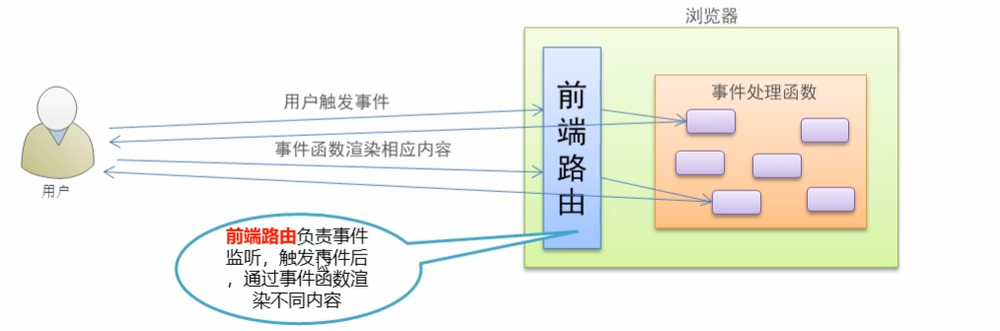
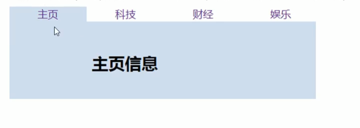
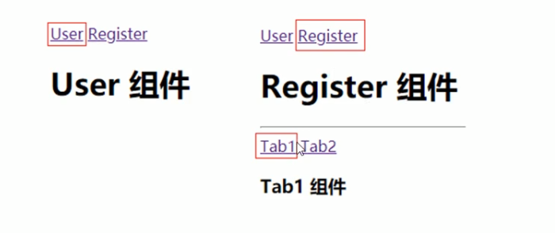
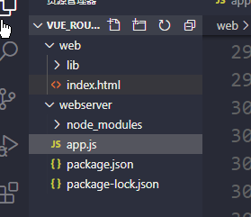
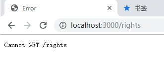
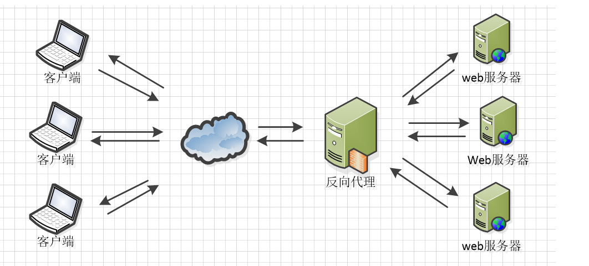
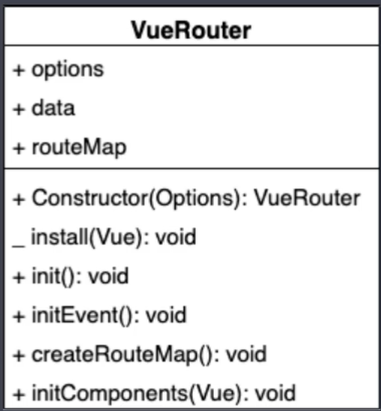
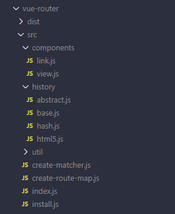

# Vue Router

# 一、Vue Router 回顾

## 1、路由简介

路由是一个比较广义和抽象的概念，路由的本质就是**对应关系**。 

在开发中，路由分为：

- ​    后端路由
- ​     前端路由 

**后端路由** 

-  概念：根据不同的用户 URL 请求，返回不同的内容 
-  本质：URL 请求地址与服务器资源之间的对应关系 


**SPA（Single  Page Application）** 

-  Ajax前端渲染（前端渲染提高性能，但是不支持浏览器的前进后退操作） 
-  SPA（Single Page Application）单页面应用程序：整个网站只有一个页面，内 容的变化通过Ajax局部更新实现、同时支持浏览器地址栏的前进和后退操作 
-  SPA实现原理之一：基于URL地址的hash（hash的变化会导致浏览器记录访问历 史的变化、但是hash的变化不会触发新的URL请求
-  在实现SPA过程中，最核心的技术点就是前端路由 

**前端路由** 

- 概念：根据不同的用户事件，显示不同的页面内容 
-  本质：用户事件与事件处理函数之间的对应关系




## 2、实现简易前端路由 

 基于URL中的hash实现（点击菜单的时候改变URL的hash，根据hash的变化控制组件的切换） 



案例代码实现如下：

```html
<!DOCTYPE html>
<html lang="en">
  <head>
    <meta charset="UTF-8" />
    <meta name="viewport" content="width=device-width, initial-scale=1.0" />
    <meta http-equiv="X-UA-Compatible" content="ie=edge" />
    <title>Document</title>
    <!-- 导入 vue 文件 -->
    <script src="./lib/vue_2.5.22.js"></script>
  </head>
  <body>
    <!-- 被 vue 实例控制的 div 区域 -->
    <div id="app">
      <!-- 切换组件的超链接 -->
      <a href="#/zhuye">主页</a> 
      <a href="#/keji">科技</a> 
      <a href="#/caijing">财经</a>
      <a href="#/yule">娱乐</a>

      <!-- 根据 :is 属性指定的组件名称，把对应的组件渲染到 component 标签所在的位置 -->
      <!-- 可以把 component 标签当做是【组件的占位符】 -->
      <component :is="comName"></component>
    </div>

    <script>
      // #region 定义需要被切换的 4 个组件
      // 主页组件
      const zhuye = {
        template: '<h1>主页信息</h1>'
      }

      // 科技组件
      const keji = {
        template: '<h1>科技信息</h1>'
      }

      // 财经组件
      const caijing = {
        template: '<h1>财经信息</h1>'
      }

      // 娱乐组件
      const yule = {
        template: '<h1>娱乐信息</h1>'
      }
      // #endregion

      // #region vue 实例对象
      const vm = new Vue({
        el: '#app',
        data: {
          comName: 'zhuye'
        },
        // 注册私有组件
        components: {
          zhuye,
          keji,
          caijing,
          yule
        }
      })
      // #endregion

      // 监听 window 的 onhashchange 事件，根据获取到的最新的 hash 值，切换要显示的组件的名称
      window.onhashchange = function() {
        // 通过 location.hash 获取到最新的 hash 值
        console.log(location.hash);
        switch(location.hash.slice(1)){
          case '/zhuye':
            vm.comName = 'zhuye'
          break
          case '/keji':
            vm.comName = 'keji'
          break
          case '/caijing':
            vm.comName = 'caijing'
          break
          case '/yule':
            vm.comName = 'yule'
          break
        }
      }
    </script>
  </body>
</html>
```

## 3、`vue-router`的基本使用

`Vue Router`（官网：`https://router.vuejs.org/zh/`）是 `Vue.js` 官方的路由管理器。 它和` Vue.js` 的核心深度集成，可以非常方便的用于`SPA`应用程序的开发。 

基本使用的步骤：

1.  引入相关的库文件 
2.  添加路由链接 
3.  添加路由填充位 
4.  定义路由组件 
5.  配置路由规则并创建路由实例 
6.  把路由挂载到` Vue` 根实例中 

下面看一下具体的实施过程

1. 引入相关的库文件 

```js
<!-- 导入 vue 文件，为全局 window 对象挂载 Vue 构造函数 -->   
<script src="./lib/vue_2.5.22.js"></script> 
 
<!-- 导入 vue-router 文件，为全局 window 对象挂载 VueRouter 构造函数 --> 
<script src="./lib/vue-router_3.0.2.js"></script> 
```


2. 添加路由链接 

```js
<!-- router-link 是 vue 中提供的标签，默认会被渲染为 a 标签 -->
<!-- to 属性默认会被渲染为 href 属性 -->
<!-- to 属性的值默认会被渲染为 # 开头的 hash 地址 --> 
<router-link to="/user">User</router-link> 
<router-link to="/register">Register</router-link>
```

3. 添加路由填充位 

```js
<!-- 路由填充位（也叫做路由占位符） -->
<!-- 将来通过路由规则匹配到的组件，将会被渲染到 router-view 所在的位置 -->   
<router-view></router-view> 
```

4. 定义路由组件 

```js
 var User = { 
     template: '<div>User</div>' 
  } 
  var Register = { 
     template: '<div>Register</div>' 
  } 
```

5. 配置路由规则并创建路由实例 

```js
 // 创建路由实例对象   
var router = new VueRouter({     
    // routes 是路由规则数组     
    routes: [       
        // 每个路由规则都是一个配置对象，其中至少包含 path 和 component 两个属性：   
        // path 表示当前路由规则匹配的 hash 地址     
        // component 表示当前路由规则对应要展示的组件     
       {path:'/user',component: User}, 
      {path:'/register',component: Register} 
    ] 
  }) 
```

6. 把路由挂载到 Vue 根实例中 

```js
 new Vue({ 
     el: '#app',    
     // 为了能够让路由规则生效，必须把路由对象挂载到 vue 实例对象上      
     router 
  }); 
```

完整代码实现如下：

```html
<!DOCTYPE html>
<html lang="en">
  <head>
    <meta charset="UTF-8" />
    <meta name="viewport" content="width=device-width, initial-scale=1.0" />
    <meta http-equiv="X-UA-Compatible" content="ie=edge" />
    <title>Document</title>
    <!-- 导入 vue 文件 -->
    <script src="./lib/vue_2.5.22.js"></script>
    <script src="./lib/vue-router_3.0.2.js"></script>
  </head>
  <body>
    <!-- 被 vm 实例所控制的区域 -->
    <div id="app">
      <router-link to="/user">User</router-link>
      <router-link to="/register">Register</router-link>

      <!-- 路由占位符 -->
      <router-view></router-view>
    </div>

    <script>
      const User = {
        template: '<h1>User 组件</h1>'
      }

      const Register = {
        template: '<h1>Register 组件</h1>'
      }

      // 创建路由实例对象
      const router = new VueRouter({
        // 所有的路由规则
        routes: [
          { path: '/user', component: User },
          { path: '/register', component: Register }
        ]
      })

      // 创建 vm 实例对象
      const vm = new Vue({
        // 指定控制的区域
        el: '#app',
        data: {},
        // 挂载路由实例对象
        // router: router
        router
      })
    </script>
  </body>
</html>

```

## 4、路由重定向

路由重定向指的是：用户在访问地址 A 的时候，强制用户跳转到地址 C ，从而展示特定的组件页面；

 通过路由规则的 redirect 属性，指定一个新的路由地址，可以很方便地设置路由的重定向： 

```js
var router = new VueRouter({ 
    routes: [      
        // 其中，path 表示需要被重定向的原地址，redirect 表示将要被重定向到的新地址  
        //当用户在地址栏中输入`/`,会自动的跳转到`/user`,而`/user`对应的组件为User
       {path:'/', redirect: '/user'}, 
      {path:'/user',component: User}, 
      {path:'/register',component: Register} 
    ] 
  })
```

具体实现的代码如下：

```html
<!DOCTYPE html>
<html lang="en">
  <head>
    <meta charset="UTF-8" />
    <meta name="viewport" content="width=device-width, initial-scale=1.0" />
    <meta http-equiv="X-UA-Compatible" content="ie=edge" />
    <title>Document</title>
    <!-- 导入 vue 文件 -->
    <script src="./lib/vue_2.5.22.js"></script>
    <script src="./lib/vue-router_3.0.2.js"></script>
  </head>
  <body>
    <!-- 被 vm 实例所控制的区域 -->
    <div id="app">
      <router-link to="/user">User</router-link>
      <router-link to="/register">Register</router-link>

      <!-- 路由占位符 -->
      <router-view></router-view>
    </div>

    <script>
      const User = {
        template: '<h1>User 组件</h1>'
      }

      const Register = {
        template: '<h1>Register 组件</h1>'
      }

      // 创建路由实例对象
      const router = new VueRouter({
        // 所有的路由规则
        routes: [
            //路由重定向
          { path: '/', redirect: '/user'},
          { path: '/user', component: User },
          { path: '/register', component: Register }
        ]
      })

      // 创建 vm 实例对象
      const vm = new Vue({
        // 指定控制的区域
        el: '#app',
        data: {},
        // 挂载路由实例对象
        // router: router
        router
      })
    </script>
  </body>
</html>

```

## 5、嵌套路由

**嵌套路由功能分析** 

 点击父级路由链接显示模板内容 

 模板内容中又有子级路由链接 

 点击子级路由链接显示子级模板内容 



下面看一下实现的步骤

 **父路由组件模板** 

-  父级路由链接
- 父组件路由填充位 

```vue
<p> 
      <router-link to="/user">User</router-link> 
      <router-link to="/register">Register</router-link> 
 </p> 
    <div>      
        <!-- 控制组件的显示位置 -->       
        <router-view></router-view> 
    </div> 

```

以上的内容，在前面的课程中已经实现。

**子级路由模板** 

- 子级路由链接
- 子级路由填充位

```js
 const Register = { 
    template: `<div>    
			<h1>Register 组件</h1>     
			<hr/> 
      <router-link to="/register/tab1">Tab1</router-link> 
      <router-link to="/register/tab2">Tab2</router-link>  
      <!-- 子路由填充位置 -->       
		<router-view/> 
    </div>` 
  } 

```

**嵌套路由配置** 

父级路由通过`children`属性配置子级路由 

```js
 const router = new VueRouter({   
     routes: [      
         { path: '/user', component: User },      
         {  path: '/register', component: Register,         
          // 通过 children 属性，为 /register 添加子路由规则        
          children: [ 
              { path: '/register/tab1', component: Tab1 },          
              { path: '/register/tab2', component: Tab2 }        
          ]       
         }     
     ]   
 }) 
```

具体代码实现如下：

```html
<!DOCTYPE html>
<html lang="en">
  <head>
    <meta charset="UTF-8" />
    <meta name="viewport" content="width=device-width, initial-scale=1.0" />
    <meta http-equiv="X-UA-Compatible" content="ie=edge" />
    <title>Document</title>
    <!-- 导入 vue 文件 -->
    <script src="./lib/vue_2.5.22.js"></script>
    <script src="./lib/vue-router_3.0.2.js"></script>
  </head>
  <body>
    <!-- 被 vm 实例所控制的区域 -->
    <div id="app">
      <router-link to="/user">User</router-link>
      <router-link to="/register">Register</router-link>

      <!-- 路由占位符 -->
      <router-view></router-view>
    </div>

    <script>
      const User = {
        template: '<h1>User 组件</h1>'
      }
     //修改Register组件
      const Register = {
        template: `<div>
          <h1>Register 组件</h1>
          <hr/>

          <!-- 子路由链接 -->
          <router-link to="/register/tab1">tab1</router-link>
          <router-link to="/register/tab2">tab2</router-link>

          <!-- 子路由的占位符 -->
          <router-view />
        <div>`
      }

      const Tab1 = {
        template: '<h3>tab1 子组件</h3>'
      }

      const Tab2 = {
        template: '<h3>tab2 子组件</h3>'
      }

      // 创建路由实例对象
      const router = new VueRouter({
        // 所有的路由规则
        routes: [
          { path: '/', redirect: '/user'},
          { path: '/user', component: User },
          // children 数组表示子路由规则
          { path: '/register', component: Register, children: [
            { path: '/register/tab1', component: Tab1 },
            { path: '/register/tab2', component: Tab2 }
          ] }
        ]
      })

      // 创建 vm 实例对象
      const vm = new Vue({
        // 指定控制的区域
        el: '#app',
        data: {},
        // 挂载路由实例对象
        // router: router
        router
      })
    </script>
  </body>
</html>

```

## 6、动态路由匹配

### 6.1  动态匹配路由的基本用法 

思考： 

```html
<!– 有如下 3 个路由链接 --> 
<router-link to="/user/1">User1</router-link> 
<router-link to="/user/2">User2</router-link> 
<router-link to="/user/3">User3</router-link> 
```

```js
// 定义如下三个对应的路由规则，是否可行？？？
{ path: '/user/1', component: User } 
{ path: '/user/2', component: User } 
{ path: '/user/3', component: User } 
```

虽然以上规则可以匹配成功，但是这样写比较麻烦。如果有100个规则，那么写起来就会非常的麻烦。

通过观察，可以发现整个路由规则中只有后续的数字是在变化的。所以这里可以通过动态路由参数的模式进行路由匹配。

```js
var router = new VueRouter({ 
  routes: [     
      // 动态路径参数 以冒号开头     
      { path: '/user/:id', component: User } 
  ] 
}) 
```

```js
const User = {   
    // 路由组件中通过$route.params获取路由参数 
    template: '<div>User {{ $route.params.id }}</div>' 
}
```

具体代码实现如下：

```html
<!DOCTYPE html>
<html lang="en">
  <head>
    <meta charset="UTF-8" />
    <meta name="viewport" content="width=device-width, initial-scale=1.0" />
    <meta http-equiv="X-UA-Compatible" content="ie=edge" />
    <title>Document</title>
    <!-- 导入 vue 文件 -->
    <script src="./lib/vue_2.5.22.js"></script>
    <script src="./lib/vue-router_3.0.2.js"></script>
  </head>
  <body>
    <!-- 被 vm 实例所控制的区域 -->
    <div id="app">
      <router-link to="/user/1">User1</router-link>
      <router-link to="/user/2">User2</router-link>
      <router-link to="/user/3">User3</router-link>
      <router-link to="/register">Register</router-link>

      <!-- 路由占位符 -->
      <router-view></router-view>
    </div>

    <script>
      const User = {
        template: '<h1>User 组件 -- 用户id为: {{$route.params.id}}</h1>'
      }

      const Register = {
        template: '<h1>Register 组件</h1>'
      }

      // 创建路由实例对象
      const router = new VueRouter({
        // 所有的路由规则
        routes: [
          { path: '/', redirect: '/user'},
          { path: '/user/:id', component: User },
          { path: '/register', component: Register }
        ]
      })

      // 创建 vm 实例对象
      const vm = new Vue({
        // 指定控制的区域
        el: '#app',
        data: {},
        // 挂载路由实例对象
        // router: router
        router
      })
    </script>
  </body>
</html>

```

###  6.2 路由组件传递参数 

`$route`与对应路由形成高度耦合，不够灵活，所以可以使用`props`将组件和路由解耦 

第一种情况：

**props的值为布尔类型**

```js
 const router = new VueRouter({ 
    routes: [       
        // 如果 props 被设置为 true，route.params 将会被设置为组件属性     
        { path: '/user/:id', component: User, props: true } 
    ] 
  }) 
 
  const User = { 
            props: ['id'], // 使用 props 接收路由参数     
                template: '<div>用户ID：{{ id }}</div>'  // 使用路由参数   
  } 
```

在定义路由规则的时候，为其添加了`props`属性，并将其值设置为`true`.那么在组件中就可以通过`props:['id']`的形式来获取对应的参数值。

具体代码如下：

```html
<!DOCTYPE html>
<html lang="en">
  <head>
    <meta charset="UTF-8" />
    <meta name="viewport" content="width=device-width, initial-scale=1.0" />
    <meta http-equiv="X-UA-Compatible" content="ie=edge" />
    <title>Document</title>
    <!-- 导入 vue 文件 -->
    <script src="./lib/vue_2.5.22.js"></script>
    <script src="./lib/vue-router_3.0.2.js"></script>
  </head>
  <body>
    <!-- 被 vm 实例所控制的区域 -->
    <div id="app">
      <router-link to="/user/1">User1</router-link>
      <router-link to="/user/2">User2</router-link>
      <router-link to="/user/3">User3</router-link>
      <router-link to="/register">Register</router-link>

      <!-- 路由占位符 -->
      <router-view></router-view>
    </div>

    <script>
      const User = {
        props: ['id'], //获取id的值。
        template: '<h1>User 组件 -- 用户id为: {{id}}</h1>'
      }

      const Register = {
        template: '<h1>Register 组件</h1>'
      }

      // 创建路由实例对象
      const router = new VueRouter({
        // 所有的路由规则
        routes: [
          { path: '/', redirect: '/user'},
            //将props设置为true.
          { path: '/user/:id', component: User, props: true },
          { path: '/register', component: Register }
        ]
      })

      // 创建 vm 实例对象
      const vm = new Vue({
        // 指定控制的区域
        el: '#app',
        data: {},
        // 挂载路由实例对象
        // router: router
        router
      })
    </script>
  </body>
</html>

```

**第二种情况： `props`的值为对象类型** 

```js
 const router = new VueRouter({ 
    routes: [       
        // 如果 props 是一个对象，它会被按原样设置为组件属性   
        //这里相当于给组件User,通过路由的形式传递了一个对象，而这时候id在User组件中就无法获取到了。
        { path: '/user/:id', component: User, props: { uname: 'lisi', age: 12 }} 
    ] 
  }) 
 
  const User = { 
    props: ['uname', 'age'],   
      template: ‘<div>用户信息：{{ uname + '---' + age}}</div>'  
}
```

具体代码实现如下：

```html
<!DOCTYPE html>
<html lang="en">
  <head>
    <meta charset="UTF-8" />
    <meta name="viewport" content="width=device-width, initial-scale=1.0" />
    <meta http-equiv="X-UA-Compatible" content="ie=edge" />
    <title>Document</title>
    <!-- 导入 vue 文件 -->
    <script src="./lib/vue_2.5.22.js"></script>
    <script src="./lib/vue-router_3.0.2.js"></script>
  </head>
  <body>
    <!-- 被 vm 实例所控制的区域 -->
    <div id="app">
      <router-link to="/user/1">User1</router-link>
      <router-link to="/user/2">User2</router-link>
      <router-link to="/user/3">User3</router-link>
      <router-link to="/register">Register</router-link>

      <!-- 路由占位符 -->
      <router-view></router-view>
    </div>

    <script>
      const User = {
        props: ['id', 'uname', 'age'],
        template: '<h1>User 组件 -- 用户id为: {{id}} -- 姓名为:{{uname}} -- 年龄为：{{age}}</h1>'
      }

      const Register = {
        template: '<h1>Register 组件</h1>'
      }

      // 创建路由实例对象
      const router = new VueRouter({
        // 所有的路由规则
        routes: [
          { path: '/', redirect: '/user'},
          { path: '/user/:id', component: User, props: { uname: 'lisi', age: 20 } },
          { path: '/register', component: Register }
        ]
      })

      // 创建 vm 实例对象
      const vm = new Vue({
        // 指定控制的区域
        el: '#app',
        data: {},
        // 挂载路由实例对象
        // router: router
        router
      })
    </script>
  </body>
</html>

```

在上面的代码中，在路由规则中，通过`props`向用户组件中传递了一个对象，那么在`User`用户组件中可以接收到传递过来的对象。但是参数`id`无法接收到。

如果要解决这个问题，可以使用`props`的值为函数类型。也就是给`props`传递一个函数。

**第三种情况：`props`的值为函数类型**

```js
const router = new VueRouter({ 
    routes: [       
        // 如果 props 是一个函数，则这个函数接收 route 对象为自己的形参  
        //route就是参数对象。
        { path: '/user/:id',  
        component: User,  
        props: route => ({ uname: 'zs', age: 20, id: route.params.id })} 
    ] 
  }) 
 
  const User = { 
    props: ['uname', 'age', 'id'],    
      template: ‘<div>用户信息：{{ uname + '---' + age + '---' + id}}</div>'  
}
```

完整代码如下：

```html
<!DOCTYPE html>
<html lang="en">
  <head>
    <meta charset="UTF-8" />
    <meta name="viewport" content="width=device-width, initial-scale=1.0" />
    <meta http-equiv="X-UA-Compatible" content="ie=edge" />
    <title>Document</title>
    <!-- 导入 vue 文件 -->
    <script src="./lib/vue_2.5.22.js"></script>
    <script src="./lib/vue-router_3.0.2.js"></script>
  </head>
  <body>
    <!-- 被 vm 实例所控制的区域 -->
    <div id="app">
      <router-link to="/user/1">User1</router-link>
      <router-link to="/user/2">User2</router-link>
      <router-link to="/user/3">User3</router-link>
      <router-link to="/register">Register</router-link>

      <!-- 路由占位符 -->
      <router-view></router-view>
    </div>

    <script>
      const User = {
        props: ['id', 'uname', 'age'],
        template: '<h1>User 组件 -- 用户id为: {{id}} -- 姓名为:{{uname}} -- 年龄为：{{age}}</h1>'
      }

      const Register = {
        template: '<h1>Register 组件</h1>'
      }

      // 创建路由实例对象
      const router = new VueRouter({
        // 所有的路由规则
        routes: [
          { path: '/', redirect: '/user' },
          {
            path: '/user/:id',
            component: User,
            props: route => ({ uname: 'zs', age: 20, id: route.params.id })
          },
          { path: '/register', component: Register }
        ]
      })

      // 创建 vm 实例对象
      const vm = new Vue({
        // 指定控制的区域
        el: '#app',
        data: {},
        // 挂载路由实例对象
        // router: router
        router
      })
    </script>
  </body>
</html>

```

## 7、命名路由

为了更加方便的表示路由的路径，可以给路由规则起一个别名，即为“命名路由”。 

```js
 const router = new VueRouter({ 
    routes: [ 
      { 
        path: '/user/:id', 
        name: 'user', 
        component: User 
      } 
    ] 
  })
```

```vue
<!--单击链接，可以跳转到名称为`user`的这个路由规则，并且通过params进行参数的传递-->
<router-link :to="{ name: 'user', params: { id: 123 }}">User</router-link> 

  
```

完整代码如下：

```html
<!DOCTYPE html>
<html lang="en">
  <head>
    <meta charset="UTF-8" />
    <meta name="viewport" content="width=device-width, initial-scale=1.0" />
    <meta http-equiv="X-UA-Compatible" content="ie=edge" />
    <title>Document</title>
    <!-- 导入 vue 文件 -->
    <script src="./lib/vue_2.5.22.js"></script>
    <script src="./lib/vue-router_3.0.2.js"></script>
  </head>
  <body>
    <!-- 被 vm 实例所控制的区域 -->
    <div id="app">
      <router-link to="/user/1">User1</router-link>
      <router-link to="/user/2">User2</router-link>
        <!--单击链接，可以跳转到名称为`user`的这个路由规则，并且通过params进行参数的传递,id一定要和路由规则中定义的参数保持一致-->
      <router-link :to="{ name: 'user', params: {id: 3} }">User3</router-link>
      <router-link to="/register">Register</router-link>

      <!-- 路由占位符 -->
      <router-view></router-view>
    </div>

    <script>
      const User = {
        props: ['id', 'uname', 'age'],
        template: '<h1>User 组件 -- 用户id为: {{id}} -- 姓名为:{{uname}} -- 年龄为：{{age}}</h1>'
      }

      const Register = {
        template: '<h1>Register 组件</h1>'
      }

      // 创建路由实例对象
      const router = new VueRouter({
        // 所有的路由规则
        routes: [
          { path: '/', redirect: '/user' },
          {
            // 命名路由
            name: 'user',
            path: '/user/:id',
            component: User,
            props: route => ({ uname: 'zs', age: 20, id: route.params.id })
          },
          { path: '/register', component: Register }
        ]
      })

      // 创建 vm 实例对象
      const vm = new Vue({
        // 指定控制的区域
        el: '#app',
        data: {},
        // 挂载路由实例对象
        // router: router
        router
      })
    </script>
  </body>
</html>

```

## 8、编程式导航

**页面导航的两种方式** 

声明式导航：通过点击链接实现导航的方式，叫做声明式导航 
     例如：普通网页中的 `<a></a>` 链接 或 vue 中的 `<router-link></router-link>` 
编程式导航：通过调用`JavaScript`形式的`API`实现导航的方式，叫做编程式导航 
     例如：普通网页中的 `location.href  `

**编程式导航基本用法** 

常用的编程式导航 API 如下： 

`this.$router.push`('hash地址') 

` this.$router.go(n) `

```js
 const User = {      
 		template: '<div><button @click="goRegister">跳转到注册页面</button></div>',       
     	methods: { 
     	   goRegister: function(){          
               // 用编程的方式控制路由跳转          
               	this.$router.push('/register'); 
        } 
      } 
    } 
```

具体吗实现：

```vue
<!DOCTYPE html>
<html lang="en">
  <head>
    <meta charset="UTF-8" />
    <meta name="viewport" content="width=device-width, initial-scale=1.0" />
    <meta http-equiv="X-UA-Compatible" content="ie=edge" />
    <title>Document</title>
    <!-- 导入 vue 文件 -->
    <script src="./lib/vue_2.5.22.js"></script>
    <script src="./lib/vue-router_3.0.2.js"></script>
  </head>
  <body>
    <!-- 被 vm 实例所控制的区域 -->
    <div id="app">
      <router-link to="/user/1">User1</router-link>
      <router-link to="/user/2">User2</router-link>
      <router-link :to="{ name: 'user', params: {id: 3} }">User3</router-link>
      <router-link to="/register">Register</router-link>

      <!-- 路由占位符 -->
      <router-view></router-view>
    </div>

    <script>
      const User = {
        props: ['id', 'uname', 'age'],
        template: `<div>
          <h1>User 组件 -- 用户id为: {{id}} -- 姓名为:{{uname}} -- 年龄为：{{age}}</h1>
          <button @click="goRegister">跳转到注册页面</button>
        </div>`,
        methods: {
          goRegister() {
            this.$router.push('/register')//编程式导航
          }
        },
      }

      const Register = {
        template: `<div>
          <h1>Register 组件</h1>
          <button @click="goBack">后退</button>
        </div>`,
        methods: {
          goBack() {
            this.$router.go(-1)
          }
        }
      }

      // 创建路由实例对象
      const router = new VueRouter({
        // 所有的路由规则
        routes: [
          { path: '/', redirect: '/user' },
          {
            // 命名路由
            name: 'user',
            path: '/user/:id',
            component: User,
            props: route => ({ uname: 'zs', age: 20, id: route.params.id })
          },
          { path: '/register', component: Register }
        ]
      })

      // 创建 vm 实例对象
      const vm = new Vue({
        // 指定控制的区域
        el: '#app',
        data: {},
        // 挂载路由实例对象
        // router: router
        router
      })
    </script>
  </body>
</html>

```

**router.push() 方法的参数规则** 

```js
 // 字符串(路径名称)   
router.push('/home')  
// 对象   
router.push({ path: '/home' })  
// 命名的路由(传递参数)  
router.push({ name: '/user', params: { userId: 123 }})   
// 带查询参数，变成 /register?uname=lisi   
router.push({ path: '/register', query: { uname: 'lisi' }}) 
```

## 9、路由案例

### 9.1 抽离并且渲染`App`根组件。

将素材中的代码修改成如下的形式：

```html
<!DOCTYPE html>
<html lang="en">
  <head>
    <meta charset="UTF-8" />
    <title>基于vue-router的案例</title>
    <script src="./lib/vue.js"></script>
    <script src="https://unpkg.com/vue-router/dist/vue-router.js"></script>
    <style type="text/css">
      html,
      body,
      #app {
        margin: 0;
        padding: 0px;
        height: 100%;
      }
      .header {
        height: 50px;
        background-color: #545c64;
        line-height: 50px;
        text-align: center;
        font-size: 24px;
        color: #fff;
      }
      .footer {
        height: 40px;
        line-height: 40px;
        background-color: #888;
        position: absolute;
        bottom: 0;
        width: 100%;
        text-align: center;
        color: #fff;
      }
      .main {
        display: flex;
        position: absolute;
        top: 50px;
        bottom: 40px;
        width: 100%;
      }
      .content {
        flex: 1;
        text-align: center;
        height: 100%;
      }
      .left {
        flex: 0 0 20%;
        background-color: #545c64;
      }
      .left a {
        color: white;
        text-decoration: none;
      }
      .right {
        margin: 5px;
      }
      .btns {
        width: 100%;
        height: 35px;
        line-height: 35px;
        background-color: #f5f5f5;
        text-align: left;
        padding-left: 10px;
        box-sizing: border-box;
      }
      button {
        height: 30px;
        background-color: #ecf5ff;
        border: 1px solid lightskyblue;
        font-size: 12px;
        padding: 0 20px;
      }
      .main-content {
        margin-top: 10px;
      }
      ul {
        margin: 0;
        padding: 0;
        list-style: none;
      }
      ul li {
        height: 45px;
        line-height: 45px;
        background-color: #a0a0a0;
        color: #fff;
        cursor: pointer;
        border-bottom: 1px solid #fff;
      }

      table {
        width: 100%;
        border-collapse: collapse;
      }

      td,
      th {
        border: 1px solid #eee;
        line-height: 35px;
        font-size: 12px;
      }

      th {
        background-color: #ddd;
      }
    </style>
  </head>
  <body>
    <div id="app"><router-view></router-view></div>
    <script>
      const App = {
        template: `<div>
      <!-- 头部区域 -->
      <header class="header">传智后台管理系统</header>
      <!-- 中间主体区域 -->
      <div class="main">
        <!-- 左侧菜单栏 -->
        <div class="content left">
          <ul>
            <li>用户管理</li>
            <li>权限管理</li>
            <li>商品管理</li>
            <li>订单管理</li>
            <li>系统设置</li>
          </ul>
        </div>
        <!-- 右侧内容区域 -->
        <div class="content right"><div class="main-content">添加用户表单</div></div>
      </div>
      <!-- 尾部区域 -->
      <footer class="footer">版权信息</footer>
    </div>`,
      };

      //创建路由对象
      const router = new VueRouter({
        routes: [{ path: "/", component: App }],
      });
      const vm = new Vue({
        el: "#app",
        router,
      });
    </script>
  </body>
</html>

```

在上面的代码中，我们导入了`Vue`与`Vue-Router`的文件。

然后将核心内容定义到`App`这个组件中，同时创建了路由对象，并且指定了路由的规则。接下来将路由对象挂载到了`Vue`的实例中。

同时在`<div id='app'></div>`中使用`router-view`定义了一个占位符。当输入的地址为`/`,对应的`App`组件就会在该占位符中进行展示。

### 9.2 将菜单改造为路由连接

将模板中的菜单修改成路由连接的形式，如下所示：

```html
  <!-- 左侧菜单栏 -->
        <div class="content left">
          <ul>
            <li><router-link to="/users"> 用户管理</router-link></li>
            <li><router-link to="/rights"> 权限管理</router-link></li>
            <li><router-link to="/goods"> 商品管理</router-link></li>
            <li><router-link to="/orders"> 订单管理</router-link></li>
            <li><router-link to="/settings"> 系统设置</router-link></li>
          </ul>
        </div>
```

### 9.3 创建菜单对应组件

基本组件创建如下：

```vue
 const Users = {
        template: `<div>
        <h3>用户管理区域</h3>
        
        </div>`,
      };
      const Rights = {
        template: `<div>
        <h3>权限管理区域</h3>
      </div>`,
      };
      const Goods = {
        template: `<div>
        <h3>商品管理区域</h3>
      </div>`,
      };
      const Orders = {
        template: `<div>
        <h3>订单管理区域</h3>
      </div>`,
      };
      const Settings = {
        template: `<div>
        <h3>系统设置区域</h3>
      </div>`,
      };
```

我们知道，当单击左侧的菜单时，上面定义的组件将会在右侧进行展示。

所以需要在右侧，添加一个``router-view``的占位符。

```vue
 <!-- 右侧内容区域 -->
        <div class="content right"><div class="main-content"> <router-view /></div></div>
```


### 9.4 添加子路由规则并实现路由重定向

在上一小节中，我们已经将组件都定义好了，下面需要定义其对应的路由规则。

怎样添加对应的路由规则呢？

我们知道整个页面是`App`根组件渲染出来的，而前面定义的组件，都是在`App`根组件中进行渲染的,也就是作为了`App`组件的子组件。

所以，为上一小节中创建的组件添加路由规则，应该是作为`App`的子路由来进行添加，这样对应的组件才会在`App`组件中进行渲染。

```js
 // 创建路由对象
      const router = new VueRouter({
        routes: [
          {
            path: "/",
            component: App,
            redirect: "/users",
            children: [
              { path: "/users", component: Users },
              { path: "/rights", component: Rights },
              { path: "/goods", component: Goods },
              { path: "/orders", component: Orders },
              { path: "/settings", component: Settings },
            ],
          },
        ],
      });
```

当用户在浏览器的地址栏中输入'/'的时候，会渲染`App`组件，同时会重定向到`/users`，从而将`Users`组件渲染出来，而`Users`组件是在整个`App`组件的右侧进行渲染展示。

当点击左侧的菜单时，对应的组件会在右侧进行展示。

### 9.5 渲染用户列表数据

这里将用户组件的内容修改成如下形式：

```vue
 const Users = {
        data() {
          return {
            userlist: [
              { id: 1, name: "张三", age: 10 },
              { id: 2, name: "李四", age: 20 },
              { id: 3, name: "王五", age: 30 },
              { id: 4, name: "赵六", age: 40 },
            ],
          };
        },
        template: `<div>
        <h3>用户管理区域</h3>
        <table>
          <thead>
            <tr><th>编号</th><th>姓名</th><th>年龄</th><th>操作</th></tr>
          </thead>
          <tbody>
            <tr v-for="item in userlist" :key="item.id">
              <td>{{item.id}}</td>
              <td>{{item.name}}</td>
              <td>{{item.age}}</td>
              <td>
                <a href="javascript:;">详情</a>
              </td>
            </tr>
          </tbody>
        </table>
      </div>`,
      };
```

在`Users`组件中定义用户数据，并且在模板中通过循环的方式将数据渲染出来。

### 9.6  跳转到详情页

当单击"详情"链接时，跳转到对应的详情页面。这里需要用到编程式导航的内容。

首先定义用户详情页组件

```js
  //用户详情组件
      const UserInfo = {
        props: ["id"],
        template: `<div>
          <h5>用户详情页 --- 用户Id为：{{id}}</h5>
          <button @click="goback()">后退</button>
        </div>`,
        methods: {
          goback() {
            // 实现后退功能
            this.$router.go(-1);
          },
        },
      };
```

在该组件中通过`props`方式接收传递过来的的用户编号，并且将其打印出来。

同时在该组件中添加一个后退的按钮，通过编程式导航的方式实现后退。

对应的路由规则如下：

```js
  // 创建路由对象
      const router = new VueRouter({
        routes: [
          {
            path: "/",
            component: App,
            redirect: "/users",
            children: [
              { path: "/users", component: Users },
              { path: "/userinfo/:id", component: UserInfo, props: true },
              { path: "/rights", component: Rights },
              { path: "/goods", component: Goods },
              { path: "/orders", component: Orders },
              { path: "/settings", component: Settings },
            ],
          },
        ],
      });
```

当输入的地址为:'/userinfo/5'的形式是会渲染`UserInfo`这个组件，同时将`props`设置为`true`,表示会传递对应的`id`值。

`UserInfo`这个组件也是`App`组件的子组件，对应的也会在`App`组件的右侧进行展示。

同时，在`Users`组件中，给“详情”链接添加对应的单击事件，

```html
 const Users = {
        data() {
          return {
            userlist: [
              { id: 1, name: "张三", age: 10 },
              { id: 2, name: "李四", age: 20 },
              { id: 3, name: "王五", age: 30 },
              { id: 4, name: "赵六", age: 40 },
            ],
          };
        },
        methods: {
          goDetail(id) {
            console.log(id);
            this.$router.push("/userinfo/" + id);
          },
        },
        template: `<div>
        <h3>用户管理区域</h3>
        <table>
          <thead>
            <tr><th>编号</th><th>姓名</th><th>年龄</th><th>操作</th></tr>
          </thead>
          <tbody>
            <tr v-for="item in userlist" :key="item.id">
              <td>{{item.id}}</td>
              <td>{{item.name}}</td>
              <td>{{item.age}}</td>
              <td>
                <a href="javascript:;" @click="goDetail(item.id)">详情</a>
              </td>
            </tr>
          </tbody>
        </table>
      </div>`,
      };
```

对应`goDetail`方法中，通过编程式导航跳转到用户详情页面。

完整代码案例：

```html
<!DOCTYPE html>
<html lang="en">
  <head>
    <meta charset="UTF-8" />
    <title>基于vue-router的案例</title>
    <script src="./lib/vue.js"></script>
    <script src="https://unpkg.com/vue-router/dist/vue-router.js"></script>
    <style type="text/css">
      html,
      body,
      #app {
        margin: 0;
        padding: 0px;
        height: 100%;
      }
      .header {
        height: 50px;
        background-color: #545c64;
        line-height: 50px;
        text-align: center;
        font-size: 24px;
        color: #fff;
      }
      .footer {
        height: 40px;
        line-height: 40px;
        background-color: #888;
        position: absolute;
        bottom: 0;
        width: 100%;
        text-align: center;
        color: #fff;
      }
      .main {
        display: flex;
        position: absolute;
        top: 50px;
        bottom: 40px;
        width: 100%;
      }
      .content {
        flex: 1;
        text-align: center;
        height: 100%;
      }
      .left {
        flex: 0 0 20%;
        background-color: #545c64;
      }
      .left a {
        color: white;
        text-decoration: none;
      }
      .right {
        margin: 5px;
      }
      .btns {
        width: 100%;
        height: 35px;
        line-height: 35px;
        background-color: #f5f5f5;
        text-align: left;
        padding-left: 10px;
        box-sizing: border-box;
      }
      button {
        height: 30px;
        background-color: #ecf5ff;
        border: 1px solid lightskyblue;
        font-size: 12px;
        padding: 0 20px;
      }
      .main-content {
        margin-top: 10px;
      }
      ul {
        margin: 0;
        padding: 0;
        list-style: none;
      }
      ul li {
        height: 45px;
        line-height: 45px;
        background-color: #a0a0a0;
        color: #fff;
        cursor: pointer;
        border-bottom: 1px solid #fff;
      }

      table {
        width: 100%;
        border-collapse: collapse;
      }

      td,
      th {
        border: 1px solid #eee;
        line-height: 35px;
        font-size: 12px;
      }

      th {
        background-color: #ddd;
      }
    </style>
  </head>
  <body>
    <div id="app"><router-view></router-view></div>
    <script>
      const App = {
        template: `<div>
      <!-- 头部区域 -->
      <header class="header">传智后台管理系统</header>
      <!-- 中间主体区域 -->
      <div class="main">
        <!-- 左侧菜单栏 -->
        <div class="content left">
          <ul>
            <li><router-link to="/users"> 用户管理</router-link></li>
            <li><router-link to="/rights"> 权限管理</router-link></li>
            <li><router-link to="/goods"> 商品管理</router-link></li>
            <li><router-link to="/orders"> 订单管理</router-link></li>
            <li><router-link to="/settings"> 系统设置</router-link></li>
          </ul>
        </div>
        <!-- 右侧内容区域 -->
        <div class="content right"><div class="main-content"> <router-view /></div></div>
      </div>
      <!-- 尾部区域 -->
      <footer class="footer">版权信息</footer>
    </div>`,
      };
      const Users = {
        data() {
          return {
            userlist: [
              { id: 1, name: "张三", age: 10 },
              { id: 2, name: "李四", age: 20 },
              { id: 3, name: "王五", age: 30 },
              { id: 4, name: "赵六", age: 40 },
            ],
          };
        },
        methods: {
          goDetail(id) {
            console.log(id);
            this.$router.push("/userinfo/" + id);
          },
        },
        template: `<div>
        <h3>用户管理区域</h3>
        <table>
          <thead>
            <tr><th>编号</th><th>姓名</th><th>年龄</th><th>操作</th></tr>
          </thead>
          <tbody>
            <tr v-for="item in userlist" :key="item.id">
              <td>{{item.id}}</td>
              <td>{{item.name}}</td>
              <td>{{item.age}}</td>
              <td>
                <a href="javascript:;" @click="goDetail(item.id)">详情</a>
              </td>
            </tr>
          </tbody>
        </table>
      </div>`,
      };
      //用户详情组件
      const UserInfo = {
        props: ["id"],
        template: `<div>
          <h5>用户详情页 --- 用户Id为：{{id}}</h5>
          <button @click="goback()">后退</button>
        </div>`,
        methods: {
          goback() {
            // 实现后退功能
            this.$router.go(-1);
          },
        },
      };

      const Rights = {
        template: `<div>
        <h3>权限管理区域</h3>
      </div>`,
      };
      const Goods = {
        template: `<div>
        <h3>商品管理区域</h3>
      </div>`,
      };
      const Orders = {
        template: `<div>
        <h3>订单管理区域</h3>
      </div>`,
      };
      const Settings = {
        template: `<div>
        <h3>系统设置区域</h3>
      </div>`,
      };

      // 创建路由对象
      const router = new VueRouter({
        routes: [
          {
            path: "/",
            component: App,
            redirect: "/users",
            children: [
              { path: "/users", component: Users },
              { path: "/userinfo/:id", component: UserInfo, props: true },
              { path: "/rights", component: Rights },
              { path: "/goods", component: Goods },
              { path: "/orders", component: Orders },
              { path: "/settings", component: Settings },
            ],
          },
        ],
      });

      const vm = new Vue({
        el: "#app",
        router,
      });
    </script>
  </body>
</html>

```

## 10、路由守卫

`Vue-router`中的路由守卫，主要是对其内容进行保护，如果没有对应的权限，则不允许访问。

我们首先来看一下全局守卫，也就是所有的路由都会经过全局守卫来进行检测。

```js
  //实现全局守卫
      router.beforeEach((to, from, next) => {
        //to:去哪个页面，from来自哪个页面，next继续执行.
        //判断哪个路由需要进行守卫，这里可以通过元数据方式
        if (to.meta.auth) {
          if (window.isLogin) {
            next();
          } else {
            next("/login?redirect=" + to.fullPath);
          }
        } else {
          next();
        }
      });
```

在上面的代码中，创建了路由守卫，但是需要判断的是需要对哪个路由进行守卫，这里就是通过元数据来进行判断的。如果所跳转到的路由有元数据，并且对应的`auth`属性为`true`表明是需要进行守卫的，那么下面就需要校验用户是否登录,这里是通过判断否`window.isLogin`的值是否为`true`来进行判断的（这里简化了操作,实际应用中应该存储到`sessionStorage`），如果条件成立则表明用户登录，就继续访问用户希望访问到的页面，否则跳转到登录页面，而且将用户希望访问的页面地址也传递到了登录页面，这样用户登录成功后，可以直接跳转到要访问的页面。

如果没有元数据，则继续访问用户要访问的页面。

```js
 // 创建路由对象
      const router = new VueRouter({
        routes: [
          { path: "/login", component: Login },
          {
            path: "/",
            component: App,
            redirect: "/users",
            children: [
              {
                path: "/users",
                component: Users,
                meta: {
                  auth: true,
                },
              },
              { path: "/userinfo/:id", component: UserInfo, props: true },
              { path: "/rights", component: Rights },
              { path: "/goods", component: Goods },
              { path: "/orders", component: Orders },
              { path: "/settings", component: Settings },
            ],
          },
        ],
      });
```

在上面的代码中，给`/users`路由添加了元数据。

登录组件创建如下：


```vue
  const Login = {
        data() {
          return {
            isLogin: window.isLogin,
          };
        },

        template: `<div>
          <button @click="login" v-if="!isLogin">登录</button>
          <button @click="logout" v-else>注销</button>
          </div>`,
        methods: {
          login() {
            window.isLogin = true;
            this.$router.push(this.$route.query.redirect);
          },
          logout() {
            this.isLogin = window.isLogin = false;
          },
        },
      };
```

当单击登录按钮后，进行将`window.isLogin`设置为`true`, 并且进行跳转。

全部代码如下：

```vue
<!DOCTYPE html>
<html lang="en">
  <head>
    <meta charset="UTF-8" />
    <title>基于vue-router的案例</title>
    <script src="./lib/vue.js"></script>
    <script src="https://unpkg.com/vue-router/dist/vue-router.js"></script>
    <style type="text/css">
      html,
      body,
      #app {
        margin: 0;
        padding: 0px;
        height: 100%;
      }
      .header {
        height: 50px;
        background-color: #545c64;
        line-height: 50px;
        text-align: center;
        font-size: 24px;
        color: #fff;
      }
      .footer {
        height: 40px;
        line-height: 40px;
        background-color: #888;
        position: absolute;
        bottom: 0;
        width: 100%;
        text-align: center;
        color: #fff;
      }
      .main {
        display: flex;
        position: absolute;
        top: 50px;
        bottom: 40px;
        width: 100%;
      }
      .content {
        flex: 1;
        text-align: center;
        height: 100%;
      }
      .left {
        flex: 0 0 20%;
        background-color: #545c64;
      }
      .left a {
        color: white;
        text-decoration: none;
      }
      .right {
        margin: 5px;
      }
      .btns {
        width: 100%;
        height: 35px;
        line-height: 35px;
        background-color: #f5f5f5;
        text-align: left;
        padding-left: 10px;
        box-sizing: border-box;
      }
      button {
        height: 30px;
        background-color: #ecf5ff;
        border: 1px solid lightskyblue;
        font-size: 12px;
        padding: 0 20px;
      }
      .main-content {
        margin-top: 10px;
      }
      ul {
        margin: 0;
        padding: 0;
        list-style: none;
      }
      ul li {
        height: 45px;
        line-height: 45px;
        background-color: #a0a0a0;
        color: #fff;
        cursor: pointer;
        border-bottom: 1px solid #fff;
      }

      table {
        width: 100%;
        border-collapse: collapse;
      }

      td,
      th {
        border: 1px solid #eee;
        line-height: 35px;
        font-size: 12px;
      }

      th {
        background-color: #ddd;
      }
    </style>
  </head>
  <body>
    <div id="app"><router-view></router-view></div>
    <script>
      const App = {
        template: `<div>
      <!-- 头部区域 -->
      <header class="header">传智后台管理系统</header>
      <!-- 中间主体区域 -->
      <div class="main">
        <!-- 左侧菜单栏 -->
        <div class="content left">
          <ul>
            <li><router-link to="/users"> 用户管理</router-link></li>
            <li><router-link to="/rights"> 权限管理</router-link></li>
            <li><router-link to="/goods"> 商品管理</router-link></li>
            <li><router-link to="/orders"> 订单管理</router-link></li>
            <li><router-link to="/settings"> 系统设置</router-link></li>
          </ul>
        </div>
        <!-- 右侧内容区域 -->
        <div class="content right"><div class="main-content"> <router-view /></div></div>
      </div>
      <!-- 尾部区域 -->
      <footer class="footer">版权信息</footer>
    </div>`,
      };
      const Users = {
        data() {
          return {
            userlist: [
              { id: 1, name: "张三", age: 10 },
              { id: 2, name: "李四", age: 20 },
              { id: 3, name: "王五", age: 30 },
              { id: 4, name: "赵六", age: 40 },
            ],
          };
        },
        methods: {
          goDetail(id) {
            console.log(id);
            this.$router.push("/userinfo/" + id);
          },
        },
        template: `<div>
        <h3>用户管理区域</h3>
        <table>
          <thead>
            <tr><th>编号</th><th>姓名</th><th>年龄</th><th>操作</th></tr>
          </thead>
          <tbody>
            <tr v-for="item in userlist" :key="item.id">
              <td>{{item.id}}</td>
              <td>{{item.name}}</td>
              <td>{{item.age}}</td>
              <td>
                <a href="javascript:;" @click="goDetail(item.id)">详情</a>
              </td>
            </tr>
          </tbody>
        </table>
      </div>`,
      };
      //用户详情组件
      const UserInfo = {
        props: ["id"],
        template: `<div>
          <h5>用户详情页 --- 用户Id为：{{id}}</h5>
          <button @click="goback()">后退</button>
        </div>`,
        methods: {
          goback() {
            // 实现后退功能
            this.$router.go(-1);
          },
        },
      };

      const Rights = {
        template: `<div>
        <h3>权限管理区域</h3>
      </div>`,
      };
      const Goods = {
        template: `<div>
        <h3>商品管理区域</h3>
      </div>`,
      };
      const Orders = {
        template: `<div>
        <h3>订单管理区域</h3>
      </div>`,
      };
      const Settings = {
        template: `<div>
        <h3>系统设置区域</h3>
      </div>`,
      };
      const Login = {
        data() {
          return {
            isLogin: window.isLogin,
          };
        },

        template: `<div>
          <button @click="login" v-if="!isLogin">登录</button>
          <button @click="logout" v-else>注销</button>
          </div>`,
        methods: {
          login() {
            window.isLogin = true;
            this.$router.push(this.$route.query.redirect);
          },
          logout() {
            this.isLogin = window.isLogin = false;
          },
        },
      };

      // 创建路由对象
      const router = new VueRouter({
        routes: [
          { path: "/login", component: Login },
          {
            path: "/",
            component: App,
            redirect: "/users",
            children: [
              {
                path: "/users",
                component: Users,
                meta: {
                  auth: true,
                },
              },
              { path: "/userinfo/:id", component: UserInfo, props: true },
              { path: "/rights", component: Rights },
              { path: "/goods", component: Goods },
              { path: "/orders", component: Orders },
              { path: "/settings", component: Settings },
            ],
          },
        ],
      });
      //实现全局守卫
      router.beforeEach((to, from, next) => {
        //to:去哪个页面，from来自哪个页面，next继续执行.
        //判断哪个路由需要进行守卫，这里可以通过元数据方式
        if (to.meta.auth) {
          if (window.isLogin) {
            next();
          } else {
            next("/login?redirect=" + to.fullPath);
          }
        } else {
          next();
        }
      });
      const vm = new Vue({
        el: "#app",
        router,
      });
    </script>
  </body>
</html>

```

以上是全局守卫，对所有的路由都起作用。

但是，如果项目比较简单，路由规则定义的比较少，可以将守卫定位到某个路由规则内。这就是**路由独享守卫**

```js
  // 创建路由对象
      const router = new VueRouter({
        routes: [
          { path: "/login", component: Login },
          {
            path: "/",
            component: App,
            redirect: "/users",
            children: [
              {
                path: "/users",
                component: Users,
                meta: {
                  auth: true,
                },
                beforeEnter(to, from, next) {
                  if (window.isLogin) {
                    next();
                  } else {
                    next("/login?redirect=" + to.fullPath);
                  }
                },
              },
              { path: "/userinfo/:id", component: UserInfo, props: true },
              { path: "/rights", component: Rights },
              { path: "/goods", component: Goods },
              { path: "/orders", component: Orders },
              { path: "/settings", component: Settings },
            ],
          },
        ],
      });
```

在上面的代码中，给`/users`这个路由守卫，注意这里的方法名为`beforeEnter`.同时，这里将守卫定义在`/users`路由规则内，所以不需要对元数据进行判断，只需要判断用户是否登录就可以了。（注意：在进行以上测试时，需要将全局守卫的代码注释掉）


**组件内守卫**

可以在路由组件内直接定义以下路由导航守卫。

```
beforeRouteEnter
beforeRouteUpdate
beforeRouteLeave
```

将如下的代码直接添加到组件内。

```js
 const Users = {
        data() {
          return {
            userlist: [
              { id: 1, name: "张三", age: 10 },
              { id: 2, name: "李四", age: 20 },
              { id: 3, name: "王五", age: 30 },
              { id: 4, name: "赵六", age: 40 },
            ],
          };
        },
        methods: {
          goDetail(id) {
            console.log(id);
            this.$router.push("/userinfo/" + id);
          },
        },
        template: `<div>
          <h3>用户管理区域</h3>
          <table>
            <thead>
              <tr><th>编号</th><th>姓名</th><th>年龄</th><th>操作</th></tr>
            </thead>
            <tbody>
              <tr v-for="item in userlist" :key="item.id">
                <td>{{item.id}}</td>
                <td>{{item.name}}</td>
                <td>{{item.age}}</td>
                <td>
                  <a href="javascript:;" @click="goDetail(item.id)">详情</a>
                </td>
              </tr>
            </tbody>
          </table>
        </div>`,
        beforeRouteEnter(to, from, next) {
          if (window.isLogin) {
            next();
          } else {
            next("/login?redirect=" + to.fullPath);
          }
        },
      };
```

在上面的代码中，直接将路由守卫对应的方法添加到了组件中。

注意：在测试之前将路由规则中定义的路由守卫的代码注释掉。

## 11、addRoutes动态路由添加

在前面的案例中，我们都是将路由定义好，然后通过路由守卫来判断，某个用户是否登录，从而决定能否访问某个路由规则对应的组件内容。

但是，如果某些路由规则只能用户登录以后才能够访问，那么我们也可以不用提前定义好，而是在登录后，通过`addRoutes`方法为其动态的添加。

首先这里需要，还需要全局的路由守卫来进行校验判断，只不过这里全局路由守卫的逻辑发生了变化。

```js
router.beforeEach((to, from, next) => {
        //to:去哪个页面，from来自哪个页面，next继续执行.
        if (window.isLogin) {
          //用户已经登录
          if (to.path === "/login") {
            // 用户已经登录了，但是又访问登录页面，这里直接跳转到用户列表页面
            next("/");
          } else {
            //用户已经登录，并且访问其它页面，则运行访问
            next();
          }
        } else {
          //用户没有登录,并且访问的就是登录页，则运行访问登录页
          if (to.path === "/login") {
            next();
          } else {
            //用户没有登录，访问其它页面，则跳转到登录页面。
            next("/login?redirect=" + to.fullPath);
          }
        }
      });
```

下面对登录组件进行修改

```react
const Login = {
        data() {
          return {
            isLogin: window.isLogin,
          };
        },

        template: `<div>
            <button @click="login" v-if="!isLogin">登录</button>
            <button @click="logout" v-else>注销</button>
            </div>`,
        methods: {
          login() {
            window.isLogin = true;
            if (this.$route.query.redirect) {
              //动态添加路由：
              this.$router.addRoutes([
                {
                  path: "/",
                  component: App,
                  redirect: "/users",
                  children: [
                    {
                      path: "/users",
                      component: Users,
                      meta: {
                        auth: true,
                      },
                      // beforeEnter(to, from, next) {
                      //   if (window.isLogin) {
                      //     next();
                      //   } else {
                      //     next("/login?redirect=" + to.fullPath);
                      //   }
                      // },
                    },
                    { path: "/userinfo/:id", component: UserInfo, props: true },
                    { path: "/rights", component: Rights },
                    { path: "/goods", component: Goods },
                    { path: "/orders", component: Orders },
                    { path: "/settings", component: Settings },
                  ],
                },
              ]);
              this.$router.push(this.$route.query.redirect);
            } else {
              this.$router.push("/");
            }
          },
          logout() {
            this.isLogin = window.isLogin = false;
          },
        },
      };
```

在登录成功后，通过`addRoutes`方法动态的添加路由规则，也就是所添加的路由规则只能是在登录以后才能够访问，所以全局守卫的判断条件发生了变化，不在判断是否有元数据，而只是判断是否登录。如果登录了，想访问上面的路由规则，则运行访问，如果没有登录则不允许访问。

注意：对应的原有的路由规则应该注释掉。

完整代码如下：

```html
<!DOCTYPE html>
<html lang="en">
  <head>
    <meta charset="UTF-8" />
    <title>基于vue-router的案例</title>
    <script src="./lib/vue.js"></script>
    <script src="https://unpkg.com/vue-router/dist/vue-router.js"></script>
    <style type="text/css">
      html,
      body,
      #app {
        margin: 0;
        padding: 0px;
        height: 100%;
      }
      .header {
        height: 50px;
        background-color: #545c64;
        line-height: 50px;
        text-align: center;
        font-size: 24px;
        color: #fff;
      }
      .footer {
        height: 40px;
        line-height: 40px;
        background-color: #888;
        position: absolute;
        bottom: 0;
        width: 100%;
        text-align: center;
        color: #fff;
      }
      .main {
        display: flex;
        position: absolute;
        top: 50px;
        bottom: 40px;
        width: 100%;
      }
      .content {
        flex: 1;
        text-align: center;
        height: 100%;
      }
      .left {
        flex: 0 0 20%;
        background-color: #545c64;
      }
      .left a {
        color: white;
        text-decoration: none;
      }
      .right {
        margin: 5px;
      }
      .btns {
        width: 100%;
        height: 35px;
        line-height: 35px;
        background-color: #f5f5f5;
        text-align: left;
        padding-left: 10px;
        box-sizing: border-box;
      }
      button {
        height: 30px;
        background-color: #ecf5ff;
        border: 1px solid lightskyblue;
        font-size: 12px;
        padding: 0 20px;
      }
      .main-content {
        margin-top: 10px;
      }
      ul {
        margin: 0;
        padding: 0;
        list-style: none;
      }
      ul li {
        height: 45px;
        line-height: 45px;
        background-color: #a0a0a0;
        color: #fff;
        cursor: pointer;
        border-bottom: 1px solid #fff;
      }

      table {
        width: 100%;
        border-collapse: collapse;
      }

      td,
      th {
        border: 1px solid #eee;
        line-height: 35px;
        font-size: 12px;
      }

      th {
        background-color: #ddd;
      }
    </style>
  </head>
  <body>
    <div id="app"><router-view></router-view></div>
    <script>
      const App = {
        template: `<div>
        <!-- 头部区域 -->
        <header class="header">传智后台管理系统</header>
        <!-- 中间主体区域 -->
        <div class="main">
          <!-- 左侧菜单栏 -->
          <div class="content left">
            <ul>
              <li><router-link to="/users"> 用户管理</router-link></li>
              <li><router-link to="/rights"> 权限管理</router-link></li>
              <li><router-link to="/goods"> 商品管理</router-link></li>
              <li><router-link to="/orders"> 订单管理</router-link></li>
              <li><router-link to="/settings"> 系统设置</router-link></li>
            </ul>
          </div>
          <!-- 右侧内容区域 -->
          <div class="content right"><div class="main-content"> <router-view /></div></div>
        </div>
        <!-- 尾部区域 -->
        <footer class="footer">版权信息</footer>
      </div>`,
      };
      const Users = {
        data() {
          return {
            userlist: [
              { id: 1, name: "张三", age: 10 },
              { id: 2, name: "李四", age: 20 },
              { id: 3, name: "王五", age: 30 },
              { id: 4, name: "赵六", age: 40 },
            ],
          };
        },
        methods: {
          goDetail(id) {
            console.log(id);
            this.$router.push("/userinfo/" + id);
          },
        },
        template: `<div>
          <h3>用户管理区域</h3>
          <table>
            <thead>
              <tr><th>编号</th><th>姓名</th><th>年龄</th><th>操作</th></tr>
            </thead>
            <tbody>
              <tr v-for="item in userlist" :key="item.id">
                <td>{{item.id}}</td>
                <td>{{item.name}}</td>
                <td>{{item.age}}</td>
                <td>
                  <a href="javascript:;" @click="goDetail(item.id)">详情</a>
                </td>
              </tr>
            </tbody>
          </table>
        </div>`,
        // beforeRouteEnter(to, from, next) {
        //   if (window.isLogin) {
        //     next();
        //   } else {
        //     next("/login?redirect=" + to.fullPath);
        //   }
        // },
      };
      //用户详情组件
      const UserInfo = {
        props: ["id"],
        template: `<div>
            <h5>用户详情页 --- 用户Id为：{{id}}</h5>
            <button @click="goback()">后退</button>
          </div>`,
        methods: {
          goback() {
            // 实现后退功能
            this.$router.go(-1);
          },
        },
      };

      const Rights = {
        template: `<div>
          <h3>权限管理区域</h3>
        </div>`,
      };
      const Goods = {
        template: `<div>
          <h3>商品管理区域</h3>
        </div>`,
      };
      const Orders = {
        template: `<div>
          <h3>订单管理区域</h3>
        </div>`,
      };
      const Settings = {
        template: `<div>
          <h3>系统设置区域</h3>
        </div>`,
      };
      const Login = {
        data() {
          return {
            isLogin: window.isLogin,
          };
        },

        template: `<div>
            <button @click="login" v-if="!isLogin">登录</button>
            <button @click="logout" v-else>注销</button>
            </div>`,
        methods: {
          login() {
            window.isLogin = true;
            if (this.$route.query.redirect) {
              //动态添加路由：
              this.$router.addRoutes([
                {
                  path: "/",
                  component: App,
                  redirect: "/users",
                  children: [
                    {
                      path: "/users",
                      component: Users,
                      meta: {
                        auth: true,
                      },
                      // beforeEnter(to, from, next) {
                      //   if (window.isLogin) {
                      //     next();
                      //   } else {
                      //     next("/login?redirect=" + to.fullPath);
                      //   }
                      // },
                    },
                    { path: "/userinfo/:id", component: UserInfo, props: true },
                    { path: "/rights", component: Rights },
                    { path: "/goods", component: Goods },
                    { path: "/orders", component: Orders },
                    { path: "/settings", component: Settings },
                  ],
                },
              ]);
              this.$router.push(this.$route.query.redirect);
            } else {
              this.$router.push("/");
            }
          },
          logout() {
            this.isLogin = window.isLogin = false;
          },
        },
      };

      // 创建路由对象
      const router = new VueRouter({
        routes: [
          { path: "/login", component: Login },
          // {
          //   path: "/",
          //   component: App,
          //   redirect: "/users",
          //   children: [
          //     {
          //       path: "/users",
          //       component: Users,
          //       meta: {
          //         auth: true,
          //       },
          //       // beforeEnter(to, from, next) {
          //       //   if (window.isLogin) {
          //       //     next();
          //       //   } else {
          //       //     next("/login?redirect=" + to.fullPath);
          //       //   }
          //       // },
          //     },
          //     { path: "/userinfo/:id", component: UserInfo, props: true },
          //     { path: "/rights", component: Rights },
          //     { path: "/goods", component: Goods },
          //     { path: "/orders", component: Orders },
          //     { path: "/settings", component: Settings },
          //   ],
          // },
        ],
      });
      //实现全局守卫
      // router.beforeEach((to, from, next) => {
      //   //to:去哪个页面，from来自哪个页面，next继续执行.
      //   //判断哪个路由需要进行守卫，这里可以通过元数据方式
      //   if (to.meta.auth) {
      //     if (window.isLogin) {
      //       next();
      //     } else {
      //       next("/login?redirect=" + to.fullPath);
      //     }
      //   } else {
      //     next();
      //   }
      // });

      router.beforeEach((to, from, next) => {
        //to:去哪个页面，from来自哪个页面，next继续执行.
        if (window.isLogin) {
          //用户已经登录
          if (to.path === "/login") {
            // 用户已经登录了，但是又访问登录页面，这里直接跳转到用户列表页面
            next("/");
          } else {
            //用户已经登录，并且访问其它页面，则运行访问
            next();
          }
        } else {
          //用户没有登录,并且访问的就是登录页，则运行访问登录页
          if (to.path === "/login") {
            next();
          } else {
            //用户没有登录，访问其它页面，则跳转到登录页面。
            next("/login?redirect=" + to.fullPath);
          }
        }
      });

      const vm = new Vue({
        el: "#app",
        router,
      });
    </script>
  </body>
</html>

```


## 12、路由组件缓存

利用`keepalive`做组件缓存，保留组件状态，提高执行效率。

```vue
<keep-alive include="home">
    <router-view></router-view>
</keep-alive>
```

使用`include`或者`exclude`时要给组件设置`name`（这个是组件的名称，组件的名称通过给组件添加`name`属性来进行设置）

当我们进行路由切换的时候，对应的组件会被重新创建，同时数据也会不断的重新加载。

如果数据没有变化，就没有必要每次都重新发送异步请求加载数据


现在，在`App`组件中添加`keep-alive`

因为切换的组件都是在该`router-view`中进行展示。

```html
  <!-- 右侧内容区域 -->
          <div class="content right"><div class="main-content">
            <keep-alive>
             <router-view />
             </keep-alive>
             </div></div>
        </div>
```

下面可以进行验证。

```js
 const Rights = {
        template: `<div>
          <h3>权限管理区域</h3>
        </div>`,
        created() {
          console.log(new Date());
        },
      };
```

在`Rights`组件中，添加了`created`方法，该方法中输出日期时间，但是我们不断的切换，发现并不是每次都打印日期时间内容。

当然，以上`keep-alive`的使用方式，是将所有的组件都缓存了，如果只想缓存某个组件，可以采用如下的方式

```vue
 <!-- 右侧内容区域 -->
          <div class="content right"><div class="main-content">
            <keep-alive include='goods'>
             <router-view />
             </keep-alive>
             </div></div>
        </div>
```

在上面的代码中，通过`include`添加了需要缓存的组件的名称，如果有多个在`include`中可以继续添加，每个组件名称之间用逗号分隔。

以上的含义就是只有`goods`组件需要被缓存(`goods`是组件的`name`值)

```js
 const Goods = {
        name: "goods",
        template: `<div>
          <h3>商品管理区域</h3>
        </div>`,
        created() {
          console.log(new Date());
        },
      };
```

`exclude`表示的就是除了指定的组件以外（也是组件的`name`），其它组件都进行缓存。

**应用场景**

如果未使用keep-alive组件，则在页面回退时仍然会重新渲染页面，触发created钩子，使用体验不好。 在以下场景中使用keep-alive组件会显著提高用户体验，菜单存在多级关系，多见于列表页+详情页的场景如：

- 商品列表页点击商品跳转到商品详情，返回后仍显示原有信息
- 订单列表跳转到订单详情，返回，等等场景。

**生命周期：**
  `activated`和`deactivated`会在`keep-alive`内所有嵌套的组件中触发
  如：B页面是缓存页面
    当A页面跳到B页面时，B页面的生命周期：activated（可在此时更新数据）
    B页面跳出时，触发deactivated
    B页面自身刷新时，会触发created-mouted-activated


## 13、Hash模式与History模式

### 13.1  Hash模式与History模式区别

前端路由中，不管是什么实现模式，都是客户端的一种实现方式，也就是当路径发生变化的时候，是不会向服务器发送请求的。

如果需要向服务器发送请求，需要用到`ajax`方式。

两种模式的区别

首先是表现形式的区别

**`Hash`模式**

```
https://www.baidu.com/#/showlist?id=22256
```

`hash`模式中路径带有`#`, `#`后面的内容作为路由地址。可以通过问号携带参数。

当然这种模式相对来说比较丑，路径中带有与数据无关的符号，例如`#`与`?`

`History`模式

```
https://www.baidu.com/showlist/22256
```

`History`模式是一个正常的路径的模式，如果要想实现这种模式，还需要服务端的相应支持。

下面再来看一下两者原理上的区别。

`Hash`模式是基于锚点，以及`onhashchange`事件。

通过锚点的值作为路由地址，当地址发生变化后触发`onhashchange`事件。

`History`模式是基于`HTML5`中的`History API`

也就是如下两个方法

`history.pushState( )`  `IE10`以后才支持

`history.replaceState( )`

### 13.2 `History`模式的使用

`History`模式需要服务器的支持，为什么呢？

因为在单页面的应用中，只有一个页面，也就是`index.html`这个页面，服务端不存在`http://www.test.com/login`这样的地址，也就说如果刷新浏览器，

请求服务器，是找不到`/login`这个页面的，所以会出现`404`的错误。（在传统的开发模式下，输入以上的地址，会返回`login`这个页面，而在单页面应用中，只有一个页面为`index.html`）

所以说，在服务端应该除了静态资源外都返回单页应用的`index.html`

下面我们开始`history`模式来演示一下对应的问题。

首先添加一个针对404组件的处理

首先在菜单栏中添加一个链接：

```vue
 <!-- 左侧菜单栏 -->
          <div class="content left">
            <ul>
              <li><router-link to="/users"> 用户管理</router-link></li>
              <li><router-link to="/rights"> 权限管理</router-link></li>
              <li><router-link to="/goods"> 商品管理</router-link></li>
              <li><router-link to="/orders"> 订单管理</router-link></li>
              <li><router-link to="/settings"> 系统设置</router-link></li>
              <li><router-link to="/about"> 关于</router-link></li>
            </ul>
          </div>
```

这里我们添加了一个“关于”的链接，但是我们没有为其定义相应的组件，所以这里需要处理404的情况。

```vue
  const NotFound = {
        template: `<div>
            你访问的页面不存在!!
          </div>`,
      };
```

在程序中添加了一个针对404的组件。

```js
 const router = new VueRouter({
        mode: "history",
        const router = new VueRouter({
        mode: "history",
        routes: [
          { path: "/login", component: Login },
          { path: "*", component: NotFound },
          {
            path: "/",
            component: App,
            redirect: "/users",
            children: [
              {
                path: "/users",
                component: Users,
                meta: {
                  auth: true,
                },
                // beforeEnter(to, from, next) {
                //   if (window.isLogin) {
                //     next();
                //   } else {
                //     next("/login?redirect=" + to.fullPath);
                //   }
                // },
              },
              { path: "/userinfo/:id", component: UserInfo, props: true },
              { path: "/rights", component: Rights },
              { path: "/goods", component: Goods },
              { path: "/orders", component: Orders },
              { path: "/settings", component: Settings },
            ],
          },
        ],
      });
```

在上面的代码中，指定了处理404的路由规则，同时将路由的模式修改成了`history`模式。同时，启用这里启用了其它的组件的路由规则配置，也就是不在`login`方法中使用`addRoutes`方法来动态添加路由规则了。

`login` 方法修改成如下形式：

```js
 login() {
            // window.isLogin = true;
            window.sessionStorage.setItem("isLogin", true);
            if (this.$route.query.redirect) {
              //   //动态添加路由：
              //   this.$router.addRoutes([
              //     {
              //       path: "/",
              //       component: App,
              //       redirect: "/users",
              //       children: [
              //         {
              //           path: "/users",
              //           component: Users,
              //           meta: {
              //             auth: true,
              //           },
              //           // beforeEnter(to, from, next) {
              //           //   if (window.isLogin) {
              //           //     next();
              //           //   } else {
              //           //     next("/login?redirect=" + to.fullPath);
              //           //   }
              //           // },
              //         },
              //         { path: "/userinfo/:id", component: UserInfo, props: true },
              //         { path: "/rights", component: Rights },
              //         { path: "/goods", component: Goods },
              //         { path: "/orders", component: Orders },
              //         { path: "/settings", component: Settings },
              //       ],
              //     },
              //   ]);
              this.$router.push(this.$route.query.redirect);
            } else {
              this.$router.push("/");
            }
          }
```

现在已经将前端`vue`中的代码修改完毕了，下面我们要将页面的内容部署到`node.js`服务器中。

而且上面的代码中，我们使用了`sessionStorage`来保存登录用户的信息，不在使用`window`下的`isLogin`

对应的`data`内容下的代码也要修改：

```js
const Login = {
        data() {
          return {
            isLogin: window.sessionStorage.getItem("isLogin"),
          };
        },
```

路由守卫中的代码进行如下修改：

```js
jsrouter.beforeEach((to, from, next) => {
        //to:去哪个页面，from来自哪个页面，next继续执行.
        if (window.sessionStorage.getItem("isLogin")) {
          //用户已经登录
          if (to.path === "/login") {
            // 用户已经登录了，但是又访问登录页面，这里直接跳转到用户列表页面
            next("/");
          } else {
            //用户已经登录，并且访问其它页面，则运行访问

            next();
          }
        } else {
          //用户没有登录,并且访问的就是登录页，则运行访问登录页
          if (to.path === "/login") {
            next();
          } else {
            //用户没有登录，访问其它页面，则跳转到登录页面。
            next("/login?redirect=" + to.fullPath);
          }
        }
      });
```

在上面的代码中，我们也是通过`sessionStorage`来获取登录信息。

`index.html`完整代码如下：

```html
<!DOCTYPE html>
<html lang="en">
  <head>
    <meta charset="UTF-8" />
    <title>基于vue-router的案例</title>
    <script src="./lib/vue.js"></script>
    <script src="https://unpkg.com/vue-router/dist/vue-router.js"></script>
    
  </head>
  <body>
    <div id="app"><router-view></router-view></div>
    <script>
      const App = {
        template: `<div>
        <!-- 头部区域 -->
        <header class="header">传智后台管理系统</header>
        <!-- 中间主体区域 -->
        <div class="main">
          <!-- 左侧菜单栏 -->
          <div class="content left">
            <ul>
              <li><router-link to="/users"> 用户管理</router-link></li>
              <li><router-link to="/rights"> 权限管理</router-link></li>
              <li><router-link to="/goods"> 商品管理</router-link></li>
              <li><router-link to="/orders"> 订单管理</router-link></li>
              <li><router-link to="/settings"> 系统设置</router-link></li>
              <li><router-link to="/about"> 关于</router-link></li>
            </ul>
          </div>
          <!-- 右侧内容区域 -->
          <div class="content right"><div class="main-content">
            <keep-alive include='goods'>
             <router-view />
             </keep-alive>
             </div></div>
        </div>
        <!-- 尾部区域 -->
        <footer class="footer">版权信息</footer>
      </div>`,
      };
      const Users = {
        data() {
          return {
            userlist: [
              { id: 1, name: "张三", age: 10 },
              { id: 2, name: "李四", age: 20 },
              { id: 3, name: "王五", age: 30 },
              { id: 4, name: "赵六", age: 40 },
            ],
          };
        },
        methods: {
          goDetail(id) {
            console.log(id);
            this.$router.push("/userinfo/" + id);
          },
        },
        template: `<div>
          <h3>用户管理区域</h3>
          <table>
            <thead>
              <tr><th>编号</th><th>姓名</th><th>年龄</th><th>操作</th></tr>
            </thead>
            <tbody>
              <tr v-for="item in userlist" :key="item.id">
                <td>{{item.id}}</td>
                <td>{{item.name}}</td>
                <td>{{item.age}}</td>
                <td>
                  <a href="javascript:;" @click="goDetail(item.id)">详情</a>
                </td>
              </tr>
            </tbody>
          </table>
        </div>`,
        // beforeRouteEnter(to, from, next) {
        //   if (window.isLogin) {
        //     next();
        //   } else {
        //     next("/login?redirect=" + to.fullPath);
        //   }
        // },
      };
      //用户详情组件
      const UserInfo = {
        props: ["id"],
        template: `<div>
            <h5>用户详情页 --- 用户Id为：{{id}}</h5>
            <button @click="goback()">后退</button>
          </div>`,
        methods: {
          goback() {
            // 实现后退功能
            this.$router.go(-1);
          },
        },
      };

      const Rights = {
        template: `<div>
          <h3>权限管理区域</h3>
        </div>`,
      };
      const Goods = {
        name: "goods",
        template: `<div>
          <h3>商品管理区域</h3>
        </div>`,
        created() {
          console.log(new Date());
        },
      };
      const Orders = {
        template: `<div>
          <h3>订单管理区域</h3>
        </div>`,
      };
      const Settings = {
        template: `<div>
          <h3>系统设置区域</h3>
        </div>`,
      };
      const NotFound = {
        template: `<div>
            你访问的页面不存在!!
          </div>`,
      };
      const Login = {
        data() {
          return {
            isLogin: window.sessionStorage.getItem("isLogin"),
          };
        },

        template: `<div>
            <button @click="login" v-if="!isLogin">登录</button>
            <button @click="logout" v-else>注销</button>
            </div>`,
        methods: {
          login() {
            // window.isLogin = true;
            window.sessionStorage.setItem("isLogin", true);
            if (this.$route.query.redirect) {
              //   //动态添加路由：
              //   this.$router.addRoutes([
              //     {
              //       path: "/",
              //       component: App,
              //       redirect: "/users",
              //       children: [
              //         {
              //           path: "/users",
              //           component: Users,
              //           meta: {
              //             auth: true,
              //           },
              //           // beforeEnter(to, from, next) {
              //           //   if (window.isLogin) {
              //           //     next();
              //           //   } else {
              //           //     next("/login?redirect=" + to.fullPath);
              //           //   }
              //           // },
              //         },
              //         { path: "/userinfo/:id", component: UserInfo, props: true },
              //         { path: "/rights", component: Rights },
              //         { path: "/goods", component: Goods },
              //         { path: "/orders", component: Orders },
              //         { path: "/settings", component: Settings },
              //       ],
              //     },
              //   ]);
              this.$router.push(this.$route.query.redirect);
            } else {
              this.$router.push("/");
            }
          },
          logout() {
            this.isLogin = window.isLogin = false;
          },
        },
      };

      // 创建路由对象
      const router = new VueRouter({
        mode: "history",
        routes: [
          { path: "/login", component: Login },
          { path: "*", component: NotFound },
          {
            path: "/",
            component: App,
            redirect: "/users",
            children: [
              {
                path: "/users",
                component: Users,
                meta: {
                  auth: true,
                },
                // beforeEnter(to, from, next) {
                //   if (window.isLogin) {
                //     next();
                //   } else {
                //     next("/login?redirect=" + to.fullPath);
                //   }
                // },
              },
              { path: "/userinfo/:id", component: UserInfo, props: true },
              { path: "/rights", component: Rights },
              { path: "/goods", component: Goods },
              { path: "/orders", component: Orders },
              { path: "/settings", component: Settings },
            ],
          },
        ],
      });
      //实现全局守卫
      // router.beforeEach((to, from, next) => {
      //   //to:去哪个页面，from来自哪个页面，next继续执行.
      //   //判断哪个路由需要进行守卫，这里可以通过元数据方式
      //   if (to.meta.auth) {
      //     if (window.isLogin) {
      //       next();
      //     } else {
      //       next("/login?redirect=" + to.fullPath);
      //     }
      //   } else {
      //     next();
      //   }
      // });

      router.beforeEach((to, from, next) => {
        //to:去哪个页面，from来自哪个页面，next继续执行.
        if (window.sessionStorage.getItem("isLogin")) {
          //用户已经登录
          if (to.path === "/login") {
            // 用户已经登录了，但是又访问登录页面，这里直接跳转到用户列表页面
            next("/");
          } else {
            //用户已经登录，并且访问其它页面，则运行访问

            next();
          }
        } else {
          //用户没有登录,并且访问的就是登录页，则运行访问登录页
          if (to.path === "/login") {
            next();
          } else {
            //用户没有登录，访问其它页面，则跳转到登录页面。
            next("/login?redirect=" + to.fullPath);
          }
        }
      });

      const vm = new Vue({
        el: "#app",
        router,
      });
    </script>
  </body>
</html>

```


当然，项目的目录结构做了一定的调整，如下图所示：




在`web`目录下面，存放的是`index.html`,在`webserver`目录下面存放的是`node`代码。

下面看一下具体的`node`代码的实现。

app.js文件中的代码如下：

```js
const path = require("path");
//导入处理history模式的模块
const history = require("connect-history-api-fallback");
const express = require("express");
const app = express();
//注册处理history模式的中间件
// app.use(history())
//处理静态资源的中间件,处理web目录下的index.html
app.use(express.static(path.join(__dirname, "../web")));
app.listen(3000, () => {
  console.log("服务器开启");
});

```

`connect-history-api-fallback`模块的安装如下(注意在上面的代码中还没有使用该模块)

```
npm install --save connect-history-api-fallback
```

下面还需要安装`express`

```
npm install express
```

启动服务

```
node app.js
```

现在在地址栏中输入:`http://localhost:3000`就可以访问网站了。

并且当我们去单击左侧的菜单的时候，可以实现页面的切换，同时单击“关于”的时候，会出现`NotFound`组件中的内容。

经过测试发现好像没有什么问题，那这是什么原因呢？你想一下当我们单击左侧菜单的时候，路由是怎样工作的呢？

因为现在我们开启了路由的`history`模式，而该模式是通过`HTML5`中的`history`中的`api`来完成路由的操作的，也就是当我们单击菜单的时候，是通过`history.pushState( ) `方法来修改地址栏中的地址，实现组件的切换，而且还会把地址保存的历史记录中（也就是可以单击浏览器中后退按钮，实现后退等操作），但是它并不会向服务器发送请求。

所以说现在整个操作都是在客户端完成的。

但是，当我刷新了浏览器以后，会出现怎样的情况呢？



上图的含义就是，当单击浏览器中的刷新按钮的时候，会向服务器发送请求，要求`node`服务器处理这个地址，但是服务器并没有处理该地址，所以服务器会返回`404`

以上就是如果`vue-router`开启了`history`模式后，出现的问题。

下面解决这个问题，在服务端启用`connect-history-api-fallback`模块就可以了，如下代码所示：

```js
const path = require("path");
//导入处理history模式的模块
const history = require("connect-history-api-fallback");
const express = require("express");
const app = express();
//注册处理history模式的中间件
app.use(history());
//处理静态资源的中间件
app.use(express.static(path.join(__dirname, "../web")));
app.listen(3000, () => {
  console.log("服务器开启");
});

```

服务端的代码做了修改以后，一定要服务端重新启动`node app.js`

然后经过测试以后发现没有问题了。

那么现在你考虑一下，具体的工作方式是什么？

当我们在服务端开启对`history`模式的支持以后，我们刷新浏览器，会想服务器发送请求，例如:`http://localhost:3000/orders`

服务器接收该请求，那么用于服务器开启了`history`模式，然后服务器会检查，根据该请求所访问的页面是不存在的，所以会将单页面应用的`index.html`返回给浏览器。浏览器接收`index.html`页面后，会判断路由地址，发现地址为`orders`,所以会加载该地址对应的组件内容。

### 13.3  在Nginx服务器中配置`History`模式

**代理服务器**

**代理服务器**:一般是指局域网内部的机器通过代理服务器发送请求到互联网上的服务器,代理服务器一般作用在客户端。应用比如：GoAgent，翻墙神器. 


**反向代理服务器**

**反向代理服务器：**在服务器端接受客户端的请求，然后把请求分发给具体的服务器进行处理，然后再将服务器的响应结果反馈给客户端。Nginx就是其中的一种反向代理服务器软件。 




**Nginx简介**

Nginx ("engine x") ，Nginx (“engine x”) 是俄罗斯人Igor Sysoev(塞索耶夫)编写的一款高性能的 HTTP 和反向代理服务器。也是一个IMAP/POP3/SMTP代理服务器；也就是说，Nginx本身就可以托管网站，进行HTTP服务处理，也可以作为反向代理服务器使用。 

**Nginx的应用现状** 

 淘宝、新浪博客、新浪播客、网易新闻、六间房、56.com、Discuz!、水木社区、豆瓣、YUPOO、海内、迅雷在线 等多家网站使用 Nginx 作为Web服务器或反向代理服务器。

**Nginx的特点**

- **跨平台：**Nginx 可以在大多数 Unix like OS编译运行，而且也有Windows的移植版本。

- **配置异常简单：**非常容易上手。配置风格跟程序开发一样，神一般的配置

- **非阻塞、高并发连接：**数据复制时，磁盘I/O的第一阶段是非阻塞的。官方测试能够支撑5万并发连接，在实际生产环境中跑到2～3万并发连接数.

  ```
    高并发：其实就是使用技术手段使得系统可以并行处理很多的请求！衡量指标常用的有响应时间，吞吐量，每秒查询率QPS，并发用户数。响应时间：系统对请求做出响应的时间。你简单理解为一个http请求返回所用的时间。
  
  吞吐量：单位时间内处理的请求数量。
  
  QPS：每秒可以处理的请求数
  
  并发用户数：同时承载正常使用系统功能的用户数量。也就是多少个人同时使用这个系统，这个系统还能正常运行。这个用户数量就是并发用户数了
  
  ```

  

- **内存消耗小：**处理大并发的请求内存消耗非常小。在3万并发连接下，开启的10个Nginx 进程才消耗150M内存（15M*10=150M）。

- **成本低廉：**Nginx为开源软件，可以免费使用。而购买F5 BIG-IP、NetScaler等硬件负载均衡交换机则需要十多万至几十万人民币 。

- **内置的健康检查功能：**如果 Nginx Proxy 后端的某台 Web 服务器宕机了，不会影响前端访问。 

**节省带宽：**支持 GZIP 压缩，可以添加浏览器本地缓存的 Header 头。 

**稳定性高：**用于反向代理，宕机的概率微乎其微 

**Nginx启动**

- 到官网下载Windows版本，下载地址：http://nginx.org/en/download.html

- 解压到磁盘任一目录（**注意：nginx解压后的文件夹不能放在中文目录下。**）

- 修改配置文件

- 启动服务：

  •直接运行nginx.exe

Nginx服务器默认占用的是80端口号，而在window10中端口号80已经被其它的应用程序占用，所以这里可以修改一下Nginx的端口号，在conf目录下找到nginx.conf文件，该文件就是Nginx服务的配置文件，通过该配置文件可以修改Nginx的端口号，当然后期针对Nginx服务器的配置都是通过该文件完成的。

在这里，我将端口号修改成了:8081,所以在浏览器的地址栏中，输入：[http://localhost:8081](http://localhost:8081/)  可以打开默认的欢迎页面，表示Nginx服务启动成功。


下面我们要做的就是将我们的程序部署到`Nginx`中。

现在，我们可以将做好的网站页面拷贝到`Nginx`中的`html`目录中，然后在地址栏中输入：

```
http://localhost:8081/
```

就可以看到对应的页面了，然后单击菜单，发现可以进行留有的切换。当单击刷新按钮后，发现出现了404的错误。

原因，点击刷新按钮就会向服务器发送请求，而在服务端没有对应的文件，所以会出现404的错误。

下面我们需要对`Nginx`服务器进行配置，找到`conf`目录下的`nginx.conf`.

然后进行如下的配置：

```
 location / {
            root   html;
            index  index.html index.htm;
			try_files $uri $uri/ /index.html;
        }
```

当在地址栏中输入`/`的时候，会请求根目录也就是`html`目录中的`index.html`.

现在，我们又加了`try_files`配置，表示尝试访问文件。

`$uri`表示根据所请求的`url`地址查找对应文件，如果找到了返回，没有找到。

将`$uri`作为目录，查找该目录下的`index.html`,如果找到就返回，没有找到，则直接返回`html`目录下面的`index.html`文件。

而现在我们已经将我们做好的页面拷贝到了`html`目录下面，所以直接将我们的页面返回了。

下面可以进行测试。

测试之前需要重新启动服务器。

打开`cmd`，然后定位到`Nginx`的目录，输入以下命令重新启动服务器。

```
nginx -s reload
```

这时的执行流程是：当单击浏览器中的刷新按钮后，会向服务器发送请求，服务接收到请求后，发现没有所访问的文件，但是，由于我们配置了`try_files`,所以会将`html`目录下面的`index.html`页面的内容返回，返回给浏览器后，浏览器会根据路由来进行处理，也就是查找对应组件进行渲染。


# 二、Vue Router原理

现在我们已经掌握了`Vue Router`的基本使用，下面我们来模拟`Vue Router`的实现，通过模拟实现，来了解其内部的实现原理。

我们这里模拟的是`History`模式。`Hash`模式基本实现上是一样的。

这里先来复习一下`Hash`模式的工作原理。

- ·`URL`中`#`后面的内容作为路径地址，当地址改变的时候不会向服务器发送请求，但是会触发`hashchange`事件。
- 监听`hashchange`事件，在该事件中记录当前的路由地址，然后根据路由地址找到对应组件。
- 根据当前路由地址找到对应组件重新渲染。

下面再来复习一下`History`模式

- 通过`history.pushState()`方法改变地址栏，并且将当前地址记录到浏览器的历史记录中。当前浏览器不会向服务器发送请求
- 监听`popstate`事件，可以发现浏览器历史操作的变化，记录改变后的地址，单击前进或者是后退按钮的时候触发该事件
- 根据当前路由地址找到对应组件重新渲染

## 1、分析Vue Router

在模拟`Vue Router`之前，

首先来看一下`Vue Router`的核心代码，做一个简单的分析

```js
//注册插件
Vue.use(VueRouter)
//创建路由对象
const router=new VueRouter({
    routes:[
        {name:'home',path:'/',component:homeComponent}
    ]
})
// 创建Vue实例，注册router对象
new Vue({
    router,
    render:h=>h(App)
}).$mount('#apps')
```

我们知道`Vue Router`是`Vue`的插件，所以在上面的代码中，我们首先调用`use`方法注册该插件。

`use`方法需要的参数可以是一个函数或者是对象，如果传递的是函数，`use`内部会直接调用该函数，

如果传递的是一个对象，那么在`use`内部会调用该对象的`install`方法。

而我们这里传递的是对象，所以后面在模拟`VUe Router`的时候，要实现一个`install`

方法。

下面我们创建了`VueRouter`实例，所以`VueRouter`可以是构造方法或者是类，那么我们在模拟的时候，将其定义为类。并且该类中有一个静态的`install`方法，因为我们将`VueRouter`传递给了`use`方法。

在`VueRouter`类的构造方法中，需要有一个参数，该参数是一个对象，该对象中定义了路由的规则。

最后创建了`Vue`的实例，并且将创建好的`Vue Router`对象传递到该实例中。

下面我们在看一下`Vue Router`的类图



在该类图中，上半部分是`VueRouter`的属性，而下半部分是`VueRouter`的方法。

`options`作用是记录构造函数中传入的对象, 我们在创建`Vue Router`的实例的时候，传递了一个对象，而该对象中定义了路由规则。而`options`就是记录传入的这个对象的。

`routeMap`:是一个对象，记录路由地址与组件的对应关系，也就是一个键值对的形式，后期会options中路由规则解析到`routeMap`中。

`data`是一个对象，该对象中有一个属性`current`,该属性用来记录当前的路由地址，`data`是一个响应式的对象，因为当前路由地址发生变化后，对应的组件要发生更新（*也就说当地址变化后，要加载对应组件*）。

`install`是一个静态方法，用来实现`Vue`的插件机制。

`Constructor`是一个构造方法，该该构造方法中会初始化`options` ,`data`,`routeMap`这几个属性。

`inti`方法主要是用来调用下面的三个方法，也就把不同的代码分隔到不同的方法中去实现。

`initEvent`方法，用来注册`popstate`事件，

`createRouteMap`方法，该方法会把构造函数中传入进来的路由规则，转换成键值对的形式存储到`routeMap`中。 键就是路由的地址，值就是对应的组件

`initComponents`方法，主要作用是用来创建`router-link`和`router-view`这两个组件的。

现在我们已经对`Vue Router`做了一个分析。

下面开始创建自己的`Vue Router`.

## 2、install方法实现

在`vue_router_app`项目的`src`目录下面创建一个`vuerouter`目录，同时创建一个`index.js`文件，在该文件中创建如下的代码。

`install`方法需要的参数是`Vue`的构造方法。

```js
let _Vue = null;
export default class VueRouter {
  //调用install方法的时候，会传递Vue的构造函数
  static install(Vue) {
    //首先判断插件是否已经被安装，如果已经被安装，就不需要重复安装。   
    //1、判断当前插件是否已经被安装:  
    if (VueRouter.install.installed) {
      //条件成立，表明插件已经被安装，什么都不要做。
      return;
    }
    VueRouter.install.installed = true;
    //2、把Vue构造函数记录到全局变量中。
    _Vue = Vue;

    //3、把创建Vue实例时候传入的router对象注入到Vue实例上。
    _Vue.mixin({
      beforeCreate() {
        //在创建Vue实例的时候
        // 也就是new Vue()的时候，才会有$options这个属性，
        //组件中是没有$options这个属性的。
        if (this.$options.router) {
          _Vue.prototype.$router = this.$options.router;
        }
      },
    });
  }
}

```

## 3、实现构造函数

在介绍`VueRouter`的类图时，我们说过

`Constructor`是一个构造方法，该该构造方法中会初始化`options` ,`data`,`routeMap`这几个属性。

```js
 constructor(options) {
  
    this.options = options;
 
    this.routeMap = {};
  
    this.data = _Vue.observable({
      current: "/",
    }); 
  }
```

## 4、createRouteMap方法实现

`createRouteMap`方法，该方法会把构造函数中传入进来的`options`参数中的路由规则，转换成键值对的形式存储到`routeMap`中。 键就是路由的地址，值就是对应的组件

```js
  createRouteMap() {
   
    this.options.routes.forEach((route) => {
      this.routeMap[route.path] = route.component;
    });
  }
```

## 5、initComponents方法实现

`initComponents`方法，主要作用是用来创建`router-link`和`router-view`这两个组件的。

下面先在这个方法中创建`router-link`这个组件。

先来看一下`router-link`这个组件的基本使用

```
<router-link to="/users"> 用户管理</router-link>
```

我们知道，`router-link`这个组件最终会被渲染成`a`标签，同时`to`作为一个属性，其值会作为`a`标签中的`href`属性的值。同时还要获取`<router-link>`这个组件中的文本，作为最终超链接的文本。

```js
 initComponents(Vue) {
    Vue.component("router-link", {
      props: {
        to: String,
      },
      template: '<a :href="to"><slot></slot></a>',
    });
  }
```

在上面的代码中，我们通过`Vue.component`来创建`router-link`这个组件，同时通过`props`接收`to`属性传递过来的值，并且对应的类型为字符串。

最终渲染的模板是一个`a`标签，`href`属性绑定了`to`属性的值，同时使用`<slot>`插槽作为占位符，用具体的文字内容填充该占位符。

现在已经将`router-link`这个组件创建好了。

下面我们需要对我们写的这些代码进行测试。

要进行测试应该先将`createRouteMap`方法与`initComponents`方法都调用一次，那么问题是

在什么时候调用这两个方法呢？

我们可以在VueRoute对象创建成功后，并且将`VueRouter`对象注册到`Vue`的实例上的时候，调用这两个方法。

也就是在`beforeCreate`这个钩子函数中。

当然为了调用这两个方便，在这里我们又定义了`init`方法，来做了一次封装处理。

```js
  init() {
    this.createRouteMap();
    this.initComponents(_Vue);
  }
```

对`init`方法的调用如下：

```js
   beforeCreate() {
        //在创建Vue实例的时候
        // 也就是new Vue()的时候，才会有$options这个属性，
        //组件中是没有$options这个属性的。
        if (this.$options.router) {
          _Vue.prototype.$router = this.$options.router;
            //调用init
          this.$options.router.init();
        }
      },
```

` this.$options.router.init();`

这句代码的含义：`this`表示的就是Vue实例，`$options`表示的就是在创建`Vue`的实例的时候传递的选项，如下所示：

```js
  const vm = new Vue({
        el: "#app",
        router,
      });
```

通过上面的代码，我们可以看到，传递过来的选项中是有`router`.

而这个`router`是什么呢？

```js
 const router = new VueRouter({}）
```

就是`VueRouter`这个类的实例。而我们当前自己所模拟的路由,所创建的类就叫做`VueRouter`（也就是以后在创建路由实例的时候，使用我们自己创建的`VueRouter`这个类来完成）.

而`init`方法就是`VueRouter`这个类的实例方法。所以可以通过`this.$options.router.init()`的方式来调用。

下面我们来测试一下。

在`vue_router_app`项目的`src`目录下面，创建`router.js`文件,文件定义路由规则.

如下代码所示：

```js
import Vue from "vue";
// import Router from "vue-router";
import Router from "./vuerouter";//注意:这里导入的是自己定义的路由规则
import Login from "./components/Login.vue";
import Home from "./components/Home.vue";
Vue.use(Router);
export default new Router({
  model: "history",
  routes: [
    { path: "/", component: Home },
    { path: "/login", component: Login },
  ],
});

```

在`components`目录下面分别创建`Home.vue`与`Login.vue`.

`Home.vue` 的代码如下：

```vue
<template>
  <router-link to="/login">登录</router-link>
</template>

<script>
export default {};
</script>

<style></style>

```

`Login.vue`的代码如下:

```vue
<template>
  <div>
    登录页面
  </div>
</template>

<script>
export default {};
</script>

```

`App.vue`组件的内容如下：

```vue
<template>
  <div id="app">
    <div id="nav">
      <router-link to="/">Home</router-link>
      <router-link to="/login">Login</router-link>
    </div>
    <router-view></router-view>
  </div>
</template>

<script>
export default {};
</script>
<style></style>

```

在`main.js` 中完成路由的注册。

```js
import Vue from "vue";
import App from "./App.vue";
//导入router.js
import router from "./router";
Vue.config.productionTip = false;

new Vue({
  router,
  render: (h) => h(App),
}).$mount("#app");

```

运行上面的代码会出现如下的错误：


第二个错误是我们还没有创建`router-view`这个组件，所以才会出现该错误。这里暂时可以先不用考虑。

主要是第一个错误，该错误的含义是，目前我们使用的是运行时版本的`Vue`, 模板编译器不可用。

你可以使用预编译把模板编译成`render`函数，或者是使用包含编译版本的`Vue`.

以上错误说明了`Vue`的构建版本有两个，分别是“运行时版”和"完整版".

运行时版：不支持`template`模板，需要打包的时候提前编译。

完整版：包含运行时和编译器，体积比运行时版大`10k`左右，程序运行的时候把模板转换成`render`函数。性能低于运行时版本。

使用`vue-cli`创建的项目默认为`运行时版本`,而我们创建的`VueRouter`类中有`template`模板，所以才会出现第一个错误。

官方文档：`https://cn.vuejs.org/v2/guide/installation.html`

下面我们看一下解决方案：

在前面我们已经提到过，使用`vue-cli` 创建的项目是运行时项目，所以没有编译器，如果我们将其修改成完整版，就有编译器，对模板进行编译。

解决的方案：在项目的根目录创建`vue.config.js`文件，在该文件中添加`runtimeCompiler`配置项，该配置项表示的是，是否使用包含运行时编译器的`Vue`构建

版本（完整版）。设置为`true`后你就可以在`Vue`组件中使用`template`选项了，但是这会让你的应用额外增加`10kb`左右。默认该选项的取值为`false`.

`vue.config.js`文件配置如下

```js
module.exports = {
  runtimeCompiler: true,
};

```

表示使用的是完整版，这时编译器会将`template`选项转换成`render`函数。

注意：要想以上配置内容起作用，必须重新启动服务器。

```
npm run serve
```

## 6、`render`函数

虽然使用完整版`Vue`可以解决上面的问题，但是由于带有编译器，体积比运行时版本大`10k`左右，所以性能比运行时版要低。

那么这一小节我们使用运行时版本来解决这个问题。

我们知道，完整版中的编译器的作用就是将`template`模板转成`render`函数，所以在运行时版本中我们可以自己编写`render`函数。

但是在这你肯定也有一个问题，就是在单文件组件中，我们一直都是在写`<template></template>`,并且没有写`render`函数，

但是为什么能够正常的工作呢？这时因为在打包的时候，将`<template>`编译成了`render`函数，这就是预编译。

最终代码如下：

```js
 //该方法需要一个参数为Vue的构造函数。
  //当然也可以使用全局的_Vue.
  initComponents(Vue) {
    Vue.component("router-link", {
      props: {
        to: String,
      },
      // template: '<a :href="to"><slot></slot></a>',
      render(h) {
     
        return h(
          "a",
          {
            attrs: {
              href: this.to,
            },
          },
          [this.$slots.default]
        );
      },
    });
  }
```

注意：在测试之前一定要将根目录下的`vue.config.js`文件删除掉，这样当前的环境为“运行时”环境。

## 7、创建`router-view`组件

`router-view`组件就是一个占位符。当根据路由规则找到组件后，会渲染到`router-view`的位置。

在`initComponents`方法中创建`router-view`组件

```js
 //该方法需要一个参数为Vue的构造函数。
  //当然也可以使用全局的_Vue.
  initComponents(Vue) {
    Vue.component("router-link", {
      props: {
        to: String,
      },
      // template: '<a :href="to"><slot></slot></a>',
      render(h) {
      
        return h(
          "a",
          {
            attrs: {
              href: this.to,
            },
          },
          [this.$slots.default]
        );
      },
    });
    const self = this;//修改this的指向
    Vue.component("router-view", {
      render(h) {
        //根据当前的路径从routeMap中查找对应的组件.
        const component = self.routeMap[self.data.current];
        //将组件转换成虚拟dom
        return h(component);
      },
    });
  }
```

下面，我们可以测试一下效果。

当我们单击链接的时候，发现了浏览器进行了刷新操作。表明向服务器发送了请求，而我们单页面应用中是不希望向服务器发送请求。

修改后的`initComponents`方法如下：

```js
 //该方法需要一个参数为Vue的构造函数。
  //当然也可以使用全局的_Vue.
  initComponents(Vue) {
    Vue.component("router-link", {
      props: {
        to: String,
      },
      // template: '<a :href="to"><slot></slot></a>',
      render(h) {
  
        return h(
          "a",
          {
            attrs: {
              href: this.to,
            },
            on: {
              click: this.clickHandler,
            },
          },
          [this.$slots.default]
        );
      },
      methods: {
        clickHandler(e) {
        
          history.pushState({}, "", this.to);
        
          this.$router.data.current = this.to;

          //阻止向服务器发送器。
          e.preventDefault();
        },
      },
    });
    const self = this;
    Vue.component("router-view", {
      render(h) {
        //根据当前的路径从routeMap中查找对应的组件.
        const component = self.routeMap[self.data.current];
        //将组件转换成虚拟dom
        return h(component);
      },
    });
  }
```

给`a`标签添加了单击事件。

## 8、`initEvent`方法实现

现在有一个问题就是，当点击浏览器中的后退与前进按钮的时候，地址栏中的地址发生了变化，但是对应的组件没有发生变化。

这时候要解决这个问题， 就需要用到`popstate`事件

`popstate`事件，可以发现浏览器历史操作的变化，记录改变后的地址，单击前进或者是后退按钮的时候触发该事件

```js
initEvent() {
    window.addEventListener("popstate", () => {
   
      this.data.current = window.location.pathname;
    });
  }
```

针对`initEvent`方法的调用如下：

```js
init() {
    this.createRouteMap();
    this.initComponents(_Vue);
    this.initEvent();
  }
```

# 三、VueRouter模拟实现与源码解读

在第二章中，我们已经对`VueRouter`做了一个基本的实现，通过这个基本的实现，已经对`VueRouter`的原理有了一个基本的理解。

但是，我们并没有实现路由嵌套的形式，这次我们重点来实现这一点。

## 1、`Vue.use( )`源码

源码位置：`vue/src/core/global-api/use.js`

```js
export function initUse (Vue: GlobalAPI) {
    //use方法的参数接收的是一个插件，该插件的类型可以是一个函数，也可以是一个对象
  Vue.use = function (plugin: Function | Object) {
      //_installedPlugins数组中存放已经安装的插件。
    const installedPlugins = (this._installedPlugins || (this._installedPlugins = []))
    //判断一下传递过来的插件是否在installedPlugins中存在，如果存在，则直接返回
    if (installedPlugins.indexOf(plugin) > -1) {
      return this
    }

    // additional parameters
      //将arguments转换成数组，并且将数组中的第一项去除。
    const args = toArray(arguments, 1)
    //把this(也就是Vue，这里是通过Vue.use来调用的)插入到数组中的第一个元素的位置。
    args.unshift(this)
      //这时plugin是一个对象，看一下是否有install这个函数。
    if (typeof plugin.install === 'function') {
        //如果有install这个函数，直接调用
        //这里通过apply将args数组中的每一项展开传递给install这个函数。
        // plugin.install(args[0],args[1])
        //而args[0],就是上面我们所插入的Vue.这一点与我们前面在模拟install方法的时候是一样的。
      plugin.install.apply(plugin, args)
    } else if (typeof plugin === 'function') {
        //如果plugin是一个函数，则直接通过apply去调用
      plugin.apply(null, args)
    }
      //将插件存储到installedPlugins数组中。
    installedPlugins.push(plugin)
    return this
  }
}
```

## 2、install方法分析

我们先来看一下`vue-router`的目录结构



我们先来核心的文件。

`components`目录下面，有两个文件。分别为`link.js`和`view.js`文件。

`link.js`文件创建`RouterLink`组件

`view.js`文件创建`RouterView`组件。

`history`目录下的文件是记录路由的历史记录（`hash.js`文件是关于`hash`模式，`html5.js`关于`html5`的方式，`base.js`公共的内容，`abstract.js`是在服务端渲染中实现的路由历史记录）。

`index.js`文件是用来创建`VueRouter`

`install.js`文件是关于`install`方法

我们自己模拟的`VueRouter`也实现上面的目录结构。

下面先来在`index.js`文件中实现基本代码。

```js
export default class VueRouter {
  //在创建VueRouter对象的时候，会传递选项
  constructor(options) {
    //获取routes选项，该选项中定义路由规则
    this._options = options.routes || [];
  }
  // 注册路由变化的事件。该方法的参数是一个Vue实例，后期完善
  init(Vue) {}
}

```

下面实现`install.js`基本代码（通过查看源代码来实现）

```js
export let _Vue = null; //将其导出，在其它文件中也可以使用Vue实例，而不需要单独的引入Vue的js文件
export default function install(Vue) {
  //获取Vue构造函数
  _Vue = Vue;
  _Vue.mixin({
    //通过混入以后，所有的Vue实例中都会有beforeCreate方法
    beforeCreate() {
      //判断是否为Vue的实例，如果条件成立为Vue的实例，否则为其它对应的组件（因为在创建Vue实例的时候会传递选项）
      if (this.$options.router) {
        //通过查看源码发现，Vue的实例会挂在到当前的私有属性_routerRoot属性上
        this._routerRoot = this;

    
        this._router = this.$options.router;
        //调用index.js文件中定义的init方法
        this._router.init(this);
      } else {
      
        this._routerRoot = this.$parent && this.$parent._routerRoot;
      }
    },
  });
}

```

## 3、组件创建测试

下面需要将`install`方法挂载到`VueRouter`上。

```js
import install from "./install";
export default class VueRouter {
  //在创建VueRouter对象的时候，会传递选项
  constructor(options) {
    //获取routes选项，该选项中定义路由规则
    this._routes = options.routes || [];
  }
  // 注册路由变化的事件。
  init(Vue) {}
}
//将install方法挂载到VueRouter上
VueRouter.install = install;

```

下面，我们可以简单实现一下`Router-link`组件与`Router-view`组件，来做一个简单的测试。**（接下来讲解如下内容）**

`components`目录下的`view.js`文件。

```js
export default {
  render(h) {
    return h("div", "router-view");
  },
};

```

以上是`Router-View`组件的基本功能，后面在继续完善。

`link.js`文件的实现如下：

```js
export default {
  props: {
    to: {
      type: String,
      required: true,
    },
  },
  render(h) {
      //通过插槽获取`a`标签内的文本。
    return h("a", { domProps: { href: "#" + this.to } }, [this.$slots.default]);
  },
};

```

在`install.js`文件中，导入上面的组件进行测试。

```js
import View from "./components/view";
import Link from "./components/link";
export let _Vue = null; //将其导出，在其它文件中也可以使用Vue实例，而不需要单独的引入Vue的js文件
export default function install(Vue) {
  //获取Vue构造函数
  _Vue = Vue;
  _Vue.mixin({
    //通过混入以后，所有的Vue实例中都会有beforeCreate方法
    beforeCreate() {
      //判断是否为Vue的实例，如果条件成立为Vue的实例，否则为其它对应的组件（因为在创建Vue实例的时候会传递选项）
      if (this.$options.router) {
        //通过查看源码发现，Vue的实例会挂在到当前的私有属性_routerRoot属性上
        this._routerRoot = this;

     
        this._router = this.$options.router;
        //调用index.js文件中定义的init方法
        this._router.init(this);
      } else {
    
        this._routerRoot = this.$parent && this.$parent._routerRoot;
      }
    },
  });
    //完成组件的注册
  Vue.component("RouterView", View);
  Vue.component("RouterLink", Link);
}

```

在上面的代码中，导入组件，并且完成组件的注册。

下面，我们测试一下。

在`src`目录下，在`router.js`文件中导入自己定义的`VueRouter`.

```
import Router from "./my-vue-router";
```

## 4、解析路由规则

下面，我们要做的就是对所有的路由规则进行解析，将其解析到一个数组中。方便根据地址找到对应的组件。

在源码的`index.js`文件中，创建了`VueRouter`类，对应的构造方法中，有如下代码：

```
 this.matcher = createMatcher(options.routes || [], this)
```

`createMatcher`方法是在`create-matcher.js`文件中创建的。

该方法返回的`matcher` 就是一个匹配器，其中有两个成员，`match`,另外一个是`addRoutes`

`match`:根据路由地址匹配相应的路由规则对象。

`addRoutes`动态添加路由

首先在我们自己的`index.js`文件中添加如下的代码：

```js
import install from "./install";
import createMatcher from "./create-matcher";
export default class VueRouter {
  //在创建VueRouter对象的时候，会传递选项
  constructor(options) {
    //获取routes选项，该选项中定义路由规则
    this._routes = options.routes || [];
    this.matcher = createMatcher(this._routes);
  }
  // 注册路由变化的事件。
  init() {}
  //init(Vue){}
}
//将install方法挂载到VueRouter上
VueRouter.install = install;

```

在上面的代码中，导入了`createMatcher`方法。

并且在调用该方法的时候传递了路由规则。

`create-matcher.js` 文件的代码如下：

```js
import createRouteMap from "./create-route-map";
export default function createMatcher(routes) {
  
  const { pathList, pathMap } = createRouteMap(routes);
  function match() {}
  function addRoutes(routes) {
 
    createRouteMap(routes, pathList, pathMap);
  }
  return {
    match,
    addRoutes,
  };
}

```

下面，我们需要在`create-route-map.js` 文件中实现`createRouteMap`这个方法。

```js
export default function createRouteMap(routes, oldPathList, oldPathMap) {
  const pathList = oldPathList || [];
  const pathMap = oldPathMap || {};
  //遍历所有的路由规则，进行解析。同时还要考虑children的形式，
  //所以这里需要使用递归的方式。
  routes.forEach((route) => {
    addRouteRecord(route, pathList, pathMap);
  });

  return {
    pathList,
    pathMap,
  };
}

function addRouteRecord(route, pathList, pathMap, parentRecord) {
  //从路由规则中获取path。
  const path = parentRecord ? `${parentRecord.path}/${route.path}` : route.path;
  //构建记录
  const record = {
    path,
    component: route.component,
    parent: parentRecord, //如果是子路由的话，记录子路由对应的父record对象（该对象中有path,component）,相当于记录了父子关系
  };
  //如果已经有了path,相同的path直接跳过
  if (!pathMap[path]) {
    pathList.push(path);
    pathMap[path] = record;
  }
  //判断route中是否有子路由
  if (route.children) {
    //遍历子路由，把子路由添加到pathList与pathMap中。
    route.children.forEach((childRoute) => {
      addRouteRecord(childRoute, pathList, pathMap, record);
    });
  }
}

```

下面测试一下上面的代码。

```js
import createRouteMap from "./create-route-map";
export default function createMatcher(routes) {

  const { pathList, pathMap } = createRouteMap(routes);
  console.log("pathList==", pathList);
  console.log("pathMap==", pathMap);
  function match() {}
  function addRoutes(routes) {
   
    createRouteMap(routes, pathList, pathMap);
  }
  return {
    match,
    addRoutes,
  };
}
```

在上面的代码中，我们打印了`pathList`与`pathMap`.

当然，现在在我们所定义的路由规则中，还没有添加`children`,构建相应的子路由。下面重新修改一下。

在项目根目录下的`router.js`文件中，添加对应的子路由规则。

```js
import Vue from "vue";
// import Router from "vue-router";
// import Router from "./vuerouter";
import Router from "./my-vue-router";
import Login from "./components/Login.vue";
import Home from "./components/Home.vue";
import About from "./components/About.vue";
import Users from "./components/Users";
Vue.use(Router);
export default new Router({
  // model: "history",
  routes: [
    { path: "/", component: Home },
    { path: "/login", component: Login },
    {
      path: "/about",
      component: About,
      children: [{ path: "users", component: Users }],
    },
  ],
});

```

这时候可以查看对应的输出结果。

## 5、`match`函数实现

在`create-matcher.js`文件中，我们实现了`createRouteMap`方法，同时还需要实现`match`方法。

`match`方法的作用就是根据路由地址，匹配一个路由对象。其实就是从`pathMap`中根据路由地址，找出对应的路由记录。路由记录中记录了组件信息，找到以后就可以完成组件的创建，渲染了。

```js
 function match(path) {
    const record = pathMap[path];
    if (record) {
      //根据路由地址，创建route路由规则对象
      return createRoute(record, path);
    }
    return createRoute(null, path);
  }
```

在上面的代码中，我们调用`match`方法的时候，会传递过来一个路径，我们根据这个路径可以从`pathMap`中找到对应的路由记录信息(这块在上一小节已经创建完毕)，如果找到了，我们还需要做进一步的处理，为什么呢？因为，我们传递过来的路径有可能是子路径，这时不光要获取到对应的子路由信息，我们还需要去查找对应的父路由的信息。所以这里需要进一步的处理，关于这块的处理封装到了`createRoute`这个方法中，而该方法在其它位置还需要，所以我们定义到`util`这个目录下`import createRoute from "./util/route";`。

`create-matcher.js`文件完整代码如下：

```js
import createRouteMap from "./create-route-map";
import createRoute from "./util/route";
export default function createMatcher(routes) {
 
  const { pathList, pathMap } = createRouteMap(routes);
  console.log("pathList==", pathList);
  console.log("pathMap==", pathMap);
    //实现match方法
  function match(path) {
    const record = pathMap[path];
    if (record) {
      //根据路由地址，创建route路由规则对象
      return createRoute(record, path);
    }
    return createRoute(null, path);
  }
  function addRoutes(routes) {
   
    createRouteMap(routes, pathList, pathMap);
  }
  return {
    match,
    addRoutes,
  };
}

```

下面我们需要在`my-vue-router`目录下面在创建一个`util`目录，在该目录下面创建`route.js`文件，该文件实现的代码如下：


```js
export default function createRoute(record, path) {

  const matched = [];
 
  while (record) {
    matched.unshift(record);
    record = record.parent;
  }

  return {
    path,
    matched,
  };
}

```

总结：`match`这个方法的作用就是根据路径，创建出路由规则对象，而所谓的路由规则对象其实就是包含了路径以及对应的路由记录的信息(这里有可能包含了父路由以及子路由记录，这块内容存储到一个数组中)。

以后，我们就可以根据路径直接获取到包含了整个路由记录的这个数组，从而可以将对应的组件全部创建出来。

## 6、历史记录处理

关于路由有三种模式：`hash`模式，`html5`模式，`abstract`模式（该模式与服务端渲染有关）

在这里我们实现`hash`模式的历史记录管理，不管是哪种模式，都有相同的内容，这里我们相同的内容定义到

父类中。

在该父类中主要有如下内容：

`router`属性：路由对象（`ViewRouter`）

`current`属性，记录当前路径对应的路由规则对象`{path:'/',matched:[]}`,关于该对象，我们在前面已经处理完了。也就是在`createRoute`方法中返回的内容。

`transitionTo()`

跳转到指定的路径，根据当前路径获取匹配的路由规则对象`route`，然后更新视图。

在`my-vue-router`目录下的，`history`目录下的`base.js`文件，编写如下的代码：

```js
import createRoute from "../util/route";
export default class History {
  // router路由对象ViewRouter
  constructor(router) {
    this.router = router;
  
    this.current = createRoute(null, "/");
  }
  
  transitionTo(path, onComplete) {
 
    this.current = this.router.matcher.match(path);
    //该回调函数在调用transitionTo方法的时候，会传递过来。
    onComplete && onComplete();
  }
}
```

父类已经实现了，下面实现对应的子类。也就是`HashHistory`

`HashHistory`继承`History`, 同时要确保首次访问的地址为`#/`.

在`History`中还需要定义两个方法，第一个方法为：`getCurrentLocation( )` 获取当前的路由地址(`#` 后面的部分)

`setUpListener( )`方法监听路由地址改变的事件（`hashchange`）。

在`history`目录下的`hash.js`文件中的代码实现如下：

```js
import History from "./base";
export default class HashHistory extends History {
  constructor(router) {
    //将路由对象传递给父类的构造函数
    super(router);
    //确保 首次 访问地址加上 #/  （//由于没有添加this,为普通方法）
    ensureSlash();
  }
  // 获取当前的路由地址 （# 后面的部分）所以这里需要去除#
  getCurrentLocation() {
    return window.location.hash.slice(1);
  }
  // 监听hashchange事件
  //也就是监听路由地址的变化
  setUpListener() {
    window.addEventListener("hashchange", () => {
      //当路由地址发生变化后，跳转到新的路由地址。
      this.transitionTo(this.getCurrentLocation());
    });
  }
}

function ensureSlash() {
  //判断当前是否有hash
  // 如果单击的是链接，肯定会有hash
  if (window.location.hash) {
    return;
  }
  
  window.location.hash = "/";
}

```


## 7、`Init`方法实现

我们知道当创建`VueRouter` 的时候，需要可以传递`mode`，来指定路由的形式，例如是`hash`模式还是`html5`模式等。

所以这里需要根据指定的`mode`的模式，来选择`history`目录中中不同`js`来处理。

所以在`my-vue-router`目录中的`index.js`文件中，做如下的修改：

```js
import install from "./install";
import createMatcher from "./create-matcher";
import HashHistory from "./history/hash";
import HTML5History from "./history/html5";
export default class VueRouter {
  //在创建VueRouter对象的时候，会传递选项
  constructor(options) {
    //获取routes选项，该选项中定义路由规则
    this._routes = options.routes || [];
    this.matcher = createMatcher(this._routes);
    //获取传递过来的选项中的mode,mode中决定了用户设置的路由的形式。
    //这里给VueRouter添加了mode属性
    const mode = (this.mode = options.mode || "hash");
    switch (mode) {
      case "hash":
        this.history = new HashHistory(this);
        break;
      case "history":
        this.history = new HTML5History(this);
        break;
      default:
        throw new Error("mode error");
    }
  }
  // 注册路由变化的事件。
  init() {}
  //init(Vue){}
}
//将install方法挂载到VueRouter上
VueRouter.install = install;

```

首先导入`HashHistory` 与`HTML5History`.

```js
import HashHistory from "./history/hash";
import HTML5History from "./history/html5";
```

下面获取选项中的`mode`,如果在创建`VueRouter`对象的时候，没有指定`mode`,那么默认的值为`hash`.

下面就对获取到的`mode`进行判断，根据`mode`的不同的值，创建不同的`history`的实例。

```js
 //获取传递过来的选项中的mode,mode中决定了用户设置的路由的形式。
    //这里给VueRouter添加了mode属性
    const mode = (this.mode = options.mode || "hash");
    switch (mode) {
      case "hash":
        this.history = new HashHistory(this);
        break;
      case "history":
        this.history = new HTML5History(this);
        break;
      default:
        throw new Error("mode error");
    }
```

同时`html5.js`文件，添加了基本的代码

```js
import History from "./base";
export default class HTML5History extends History {}

```

关于`Html5`的形式这里不在实现了。

下面完善一下`init`方法

```js
 // 注册路由变化的事件。
  init() {}
```

具体的实现代码如下：

```js
  // 注册路由变化的事件(初始化事件监听器，监听路由地址的变化)。
  init() {
    const history = this.history;
    const setUpListener = () => {
      history.setUpListener();
    };
    history.transitionTo(
      history.getCurrentLocation(),
      //如果直接history.setUpListener
      // 这样的话setUpListener里面的this会有问题。
      setUpListener
    );
  }
```

在这里，调用了`transitionTo`方法的原因是，在`hash.js`文件中的`ensureSlash`方法中，完成了一次地址的修改，所以这里需要跳转一次。

同时完成了`hashchange`事件的绑定（路由变化的事件）。

下面可以进行测试一下，在`base.js`文件中的`transitionTo`方法中，打印出`current`属性的值。

```js
  transitionTo(path, onComplete) {
    this.current = this.router.matcher.match(path);
    console.log("current===", this.current);
 //该回调函数在调用transitionTo方法的时候，会传递过来。
    onComplete && onComplete();
  }
```

下面，在浏览器的地址栏中输入了不同的`URL`地址后，在控制台上呈现出了不同的路由规则对象，也就是路由记录信息。

```
http://localhost:8080/#/about/users
```

输入以上地址，该地址为子路由的地址，最终也输出了对应的父路由的记录信息。

后期就可以获取具体的组件来进行渲染。

## 8、设置响应式的_route

下面我们要做的就是渲染组件。

这里我们先创建一个与路由有关的响应式属性，当路由地址发生变化了，对应的该属性也要发生变化，从而完成页面的重新渲染。

在`install.js`文件中添加如下的代码：

```js

        Vue.util.defineReactive(this, "_route", this._router.history.current);
```

以上完成了响应式属性的创建，但是要注意的是`defineReactive`方法为`Vue`的内部方法，不建议平时通过该方法来创建响应式对象。

```js
  beforeCreate() {
      //判断是否为Vue的实例，如果条件成立为Vue的实例，否则为其它对应的组件（因为在创建Vue实例的时候会传递选项）
      if (this.$options.router) {
        //通过查看源码发现，Vue的实例会挂在到当前的私有属性_routerRoot属性上
        this._routerRoot = this;
        this._router = this.$options.router;
        //调用index.js文件中定义的init方法
        this._router.init(this);
          
          
        //在Vue的实例上创建一个响应式的属性`_route`.
        Vue.util.defineReactive(this, "_route", this._router.history.current);
      } 
```

下面要考虑的就是当路由地址发生了变化后，需要修改`_route`属性的值。

在哪完成`_route`属性值的修改呢？

在`base.js`文件中，因为在该文件中定义了`transitionTo`方法，而该方法就是用来完成地址的跳转，同时完成组件的渲染。

`base.js`文件修改后的代码如下：

```js
import createRoute from "../util/route";
export default class History {
  // router路由对象ViewRouter
  constructor(router) {
    this.router = router;
    this.current = createRoute(null, "/");
    //这个回调函数是在hashhistory中赋值，作用是更改vue实例上的_route，_route的值发生变化，视图会进行刷新操作
    this.cb = null;
  }
  //给cb赋值
  listen(cb) {
    this.cb = cb;
  }

  transitionTo(path, onComplete) {
   
    this.current = this.router.matcher.match(path);
    // 调用cb
    this.cb && this.cb(this.current);
    // console.log("current===", this.current);

    //该回调函数在调用transitionTo方法的时候，会传递过来。
    onComplete && onComplete();
  }
}

```

在`History`中的构造方法中初始化`cb`函数。

```
  this.cb = null;
```

定义`listen`方法给`cb`函数赋值。

```js
//给cb赋值
  listen(cb) {
    this.cb = cb;
  }
```

在`transitionTo` 方法中调用`cb`函数，同时传递获取到的当前的路由规则对象也就是路由记录信息。

```js
  this.cb && this.cb(this.current);
```

在什么地方调用`listen`方法呢？

在`index.js`文件中的`init`方法中完成`listen`方法的调用。

```js
// 注册路由变化的事件(初始化事件监听器，监听路由地址的变化)。
  init(app) {
    const history = this.history;
    const setUpListener = () => {
      history.setUpListener();
    };
    history.transitionTo(
      history.getCurrentLocation(),
      //如果直接history.setUpListener
      // 这样的话setUpListener里面的this会有问题。
      setUpListener
    );
    //调用父类的中的listen方法
    history.listen((route) => {
      app._route = route;
    });
  }
```

在上面的代码中调用了父类中的`listen`方法，然后将箭头函数传递到了`listen`中。

这时候，在`transitionTo`方法中调用`cb`，也就是调用箭头函数，这时传递过来的参数`route`,为当前更改后的路由规则信息，交给了`app`中的`_route`属性。

`app`这个参数其实就是`Vue`的实例，因为在`install.js`文件中调用了`init`方法，并且传递的就是`Vue`的实例。

这样就完成了对`Vue`实例上的响应式属性`_route`值的修改，从而会更新组件。

## 9、`$route/$router`创建

创建`$route`与`$router`的目的是能够在所有的`Vue`实例(组件)中，可以获取到。

`$route`是路由规则对象，包含了`path`,`component`等内容

`$router`为路由对象（`ViewRouter`对象）。

通过查看源码(`install.js`)可以发现，其实就是将`$router` 与`$route`挂载到了`Vue`的原型上。

所以可以直接将源码内容复制过来就可以了。

```js
 Object.defineProperty(Vue.prototype, "$router", {
    get() {
      return this._routerRoot._router;
    },
  });

  Object.defineProperty(Vue.prototype, "$route", {
    get() {
      return this._routerRoot._route;
    },
  });
```

通过上面的代码，可以看到`$route`与`$router` 都是只读的，因为对应的值，在前面已经设置完毕，这里只是获取。

`$router` 是通过`_routerRoot`来获取。

`$route`是通过`_routerRoot._route`来获取。

```js
Vue.util.defineReactive(this, "_route", this._router.history.current);
```

在`Vue`对象上创建了`_route`属性，该属性的值为路由规则内容

## 10、`Router-View`创建

`router-view`就是一个占位符，会用具体的组件来替换该占位符。

`router-view`的创建过程如下：

- 获取当前组件的`$route`路由规则对象
- 找到路由规则对象里面的`matched` 匹配的`record`(里面有component)
- 如果是`/about` ,`matched`匹配到一个`record`，直接渲染对应的组件
- 如果是`/about/users`,`matched` 匹配到两个`record`（第一个是父组件，第二个是子组件）

`my-vue-router/components`目录下的`view.js`代码如下：

```js
export default {
  render(h) {
    //获取当前匹配的路由规则对象
    const route = this.$route;
    //获取路由记录对象.只有一个内容，所以获取的是`matched`中的第一项。
    const record = route.matched[0];
    if (!record) {
      return h();
    }
    //获取记录中对应的组件
    const component = record.component;
    return h(component);
  },
};

```

以上的代码处理的是没有子路由的情况。

下面，看一下子路由情况的处理。

当然在编写子路由的处理代码之前，我们先把案例中的路由完善一下。

在`src`目录下的`App.vue`这个组件中，添加一个“关于”的链接。

```vue
<template>
  <div id="app">
    <div id="nav">
      <router-link to="/">Home</router-link>
      <router-link to="/login">Login</router-link>
      <router-link to="/about">About</router-link>
    </div>
    <router-view></router-view>
  </div>
</template>

<script>
export default {};
</script>
```

对应在`About` 这个组件中，完成子路由应用

```vue
<template>
  <div>
    关于组件
    <router-link to="/about/users">用户</router-link>
    <router-view></router-view>
  </div>
</template>

<script>
export default {};
</script>

<style>
</style>
```

下面完善一下对子路由的处理。

```js
export default {
  render(h) {
    //获取当前匹配的路由规则对象
    const route = this.$route;
    let depth = 0;
    //记录当前组件为RouterView
    this.routerView = true;
    let parent = this.$parent;
    while (parent) {
      if (parent.routerView) {
        depth++;
      }
      parent = parent.$parent;
    }
    //获取路由记录对象.
    // 如果是子路由，例如：子路由/about/users
    //子路由是有两部分内容，matched[0]:是父组件内容，matched[1]是子组件内容
    const record = route.matched[depth];
    if (!record) {
      return h();
    }
    //获取记录中对应的组件
    const component = record.component;
    return h(component);
  },
};

```

假如，现在我们在浏览器的地址栏中输入了：`http://localhost:8080/#/about`地址，

是没有父组件，那么`depth`属性的值为0，这时候获取的第一个组件然后进行渲染。

如果地址栏的内容为：`http://localhost:8080/#/about/users` 这时候有子组件。对应的获取对应的父组件内容，开始进行循环。

在循环的时候，做了一个判断，判断的条件就是当前的父组件必须为:`RouterView`组件（子组件中`router-view`与父组件中的`router-view`构成了父子关系），才让`depth`加1，然后取出子组件进行渲染。