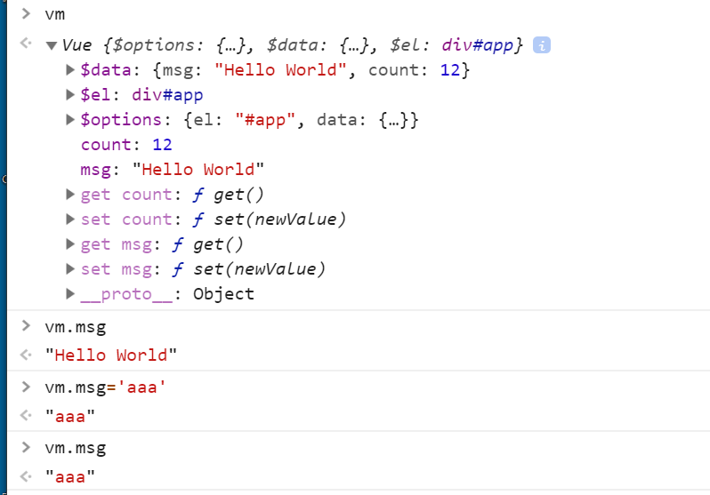
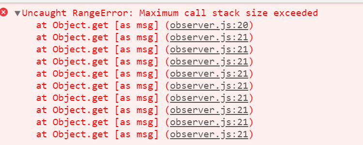
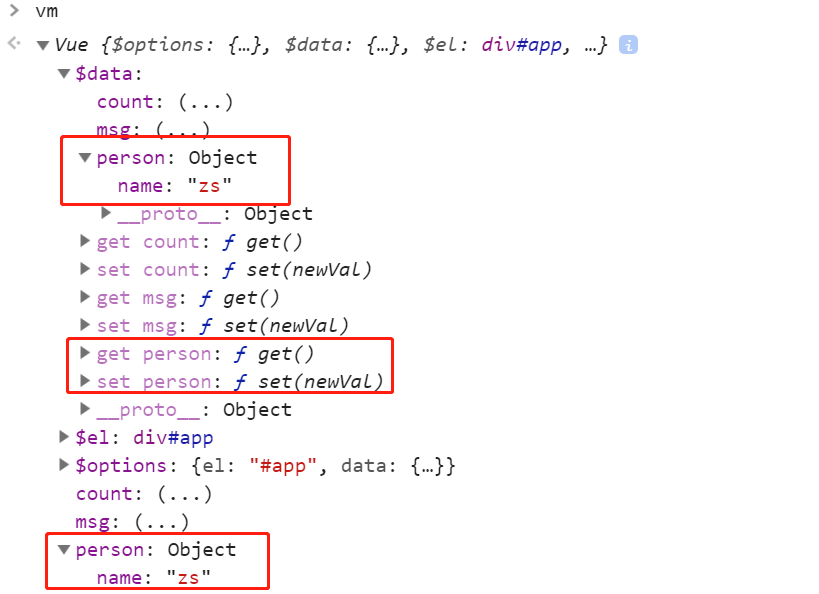
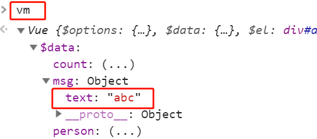

### Vue响应式原理

#### 1、数据驱动

数据响应式：数据模型仅仅是普通的`JavaScript`对象，而当我们修改数据时，视图会进行更新，避免了频繁的`DOM`操作，提高开发效率，这与`Jquery`不一样，`Jquery`是频繁的操作`Dom`。

双向绑定：数据改变，视图改变，视图改变，数据也随之改变，可以使用`v-model` 在表单元素上创建双向数据绑定

数据驱动是`Vue`最独特的特性之一，开发过程中仅仅需要关注数据本身，不需要关心数据是如何渲染到视图中的。主流的`MVVM`框架都已经实现了数据响应式与双向绑定，所以可以将数据绑定到`DOM`上。

#### 2、响应式的核心原理

`Vue2.x`响应式原理：`https://cn.vuejs.org/v2/guide/reactivity.html`：当把一个普通的 JavaScript 对象传入 Vue 实例作为 data 选项，Vue 将遍历此对象所有的 property，并使用 Object.defineProperty 把这些 property 全部转为 getter/setter（下例会在vue实例中多了get msg、set msg、get count、set count四个方法）。Object.defineProperty 是 ES5 中一个无法 shim （降级）的特性，这也就是 Vue 不支持 IE8 以及更低版本浏览器的原因。

```js
let data = {           //模拟Vue中的data选项(当)
    msg: "hello",
    count: 10,
};
let vm = {};      //模拟Vue的实例
proxyData(data);
function proxyData(data) {     //可以通过循环遍历的方式，将对象中的多个属性转换成（vm的）getter/setter（的形式）
    Object.keys(data).forEach((key) => {        //遍历data对象中的所有属性
        Object.defineProperty(vm, key, {        //数据劫持，当访问或者设置vm中的成员的时候，做一些干预操作
            enumerable: true,        //可枚举(可遍历)
            configurable: true,     //可配置（可以使用delete删除,可以通过defineProperty重新定义)
            get() {        //当获取值的时候执行
                console.log("get", key, data[key]);
                return data[key];
            },
            set(newValue) {        // 当设置值的时候执行
                console.log("set:", key, newValue);
                if (newValue === data[key]) {       //设置的值与原有的值相同，则没有更改，所以不做任何操作
                    return;
                }
                data[key] = newValue;
                document.querySelector("#app").textContent = data[key];    //数据更改，更新DOM的值
            },
        });
    });
}
vm.msg = "hello world";      //执行set操作：打印set
console.log(vm.msg);     //执行get操作：打印get和打印msg新值
```

`Vue3`响应式原理：`Vue3`的响应式原理是通过`Proxy`来完成的。`Proxy`直接监听对象，而非属性，所以将多个属性转换成`getter/setter`的时候，不需要使用循环。`Proxy`是`ES6`课程中新增的，`IE`不支持。

```js
let data = {
    msg: "hello",
    count: 0,
};
let vm = new Proxy(data, {  //为data创建一个代理对象vm,通过vm.msg来获取data中的msg属性的值会执行get方法
    get(target, key) { // 当访问vm的成员时会执行。target表示代理的（新的）对象（data对象），key表示所代理的对象中的属性
        console.log("get key:", key, target[key]);
        return target[key];
    },
    set(target, key, newValue) {   //当设置vm的成员时会执行
        console.log("set key:", key, newValue);
        if (target[key] === newValue) {
            return;
        }
        target[key] = newValue;
        document.querySelector("#app").textContent = target[key];
    },
});
vm.msg = "aaaa";
console.log(vm.msg);
```

#### 三、发布订阅模式

发布订阅模式(publish-subscribe pattern)：订阅者，发布者，信号中心。`Vue` 的自定义事件就是基于发布订阅模式来实现的。由统一调度中心调用，因此发布者和订阅者不需要知道对方的存在。

```js
    class EventEmitter {
        constructor() {    // 推测在内部有一个对象来存储注册的事件{'click':[fn1,fn2],'change':[fn]}
            this.subs = {};      // 存储事件与处理函数的对应关系
        }
        $on(eventType, fn) {    //注册事件(订阅消息)   //第一个参数为事件名称   // 第二个参数为处理函数
            if (!this.subs[eventType]) {  //判断对应的eventType是否有相应的处理函数，有则添加到数组，没有则返回空数组
                this.subs[eventType] = [];    // 将对应的处理函数添加到subs对象中
            }
            this.subs[eventType].push(fn);
        }
        $emit(eventType) {    //触发事件(发布消息)
            if (this.subs[eventType]) {
                this.subs[eventType].forEach((handler) => {
                    handler();
                });
            }
        }
    }
    let em = new EventEmitter();
    em.$on("click", () => {
        console.log("click1");
    });
    em.$on("click", () => {
        console.log("click2");
    });
    em.$emit("click");
```

#### 四、观察者模式

观察者模式与发布订阅模式的区别是，观察者模式中没有事件中心，只有发布者与订阅者，并且发布者需要知道订阅者的存在。由具体目标调度，如当事件触发，`Dep`就会去调用观察者的方法，所以观察者模式的订阅者与发布者之间是存在依赖的。

观察者(订阅者)---`Watcher`：①`update()` 当事件发生时，具体要做的事情。

目标(发布者)--`Dep`：①`subs` 数组，存储所有的观察者；②`addSub()` 添加观察者，将其保存到`subs`数组中；③`notify()`： 当事件发生后，调用所有观察者的`update()` 方法。

```js
      class Dep {      //发布者
        constructor() {
          this.subs = [];     //记录所有的订阅者
        }
        addSub(sub) {     //添加订阅者
          if (sub && sub.update) {   //订阅者中必须有update方法
            this.subs.push(sub);
          }
        }
        notify() {     //发布通知
          this.subs.forEach((sub) => {    //遍历subs数组，调用每个订阅者中的update方法
            sub.update();
          });
        }
      }
      class Watcher {   // 订阅者（观察者）
        update() {     //必须有一update方法,当事件发生后，具体要做的事情
          console.log("update something");
        }
      }
      let dep = new Dep();
      let watcher = new Watcher();
      dep.addSub(watcher);
      dep.notify();
```

#### 5、模拟Vue响应式原理

所有相关文件index.html、vue.js、observer.js、compiler.js、dep.js、wacher.js。

当在使用`Vue`的时候，首先会根据`Vue`类来创建`Vue`的实例。`Vue`类主要的功能如下：①负责接收初始化的参数(选项)   ②负责把`data`中的属性注入到`Vue`实例，转换成`getter/setter`(可以通过`this`来访问`data`中的属性)   ③负责调用`observer`监听`data`中所有属性的变化(当属性值发生变化后更新视图)   ④负责调用`compiler`解析指令/差值表达式

`Vue`中包含了`_proxyData`这个私有方法，该方法的作用就是将`data`中的属性转换成`getter/setter`并且注入到`Vue`的实例中。

```js
class Vue {   //vue.js文件里的基本代码
  constructor(options) {    // options:表示在创建Vue实例的时候传递过来的参数，将其保存到$options中 
    this.$options = options || {};    // 1、通过属性保存选项的数据
    this.$data = options.data || {};    //获取参数中的data属性保存到$data中
    this.$el =
      typeof options.el === "string"
        ? document.querySelector(options.el)
        : options.el;
    this._proxyData(this.$data);    // 2、把data中的成员转换成getter和setter,注入到vue实例中
    new Observer(this.$data);    //3.调用Observer对象，监听数据的变化
    new Compiler(this);    //4.调用compiler对象，解析指令和差值表达式
  }
  _proxyData(data) {    //通过该函数，在控制台上可以通过vm.msg直接获取数据，而不用输入vm.$data.msg
    Object.keys(data).forEach((key) => {    //遍历data中的所有属性，，这里使用箭头函数，this表示的就是Vue的实例
      Object.defineProperty(this, key, {   //把data中的属性输入注入到Vue实例中,后期可通过this的形式访问data中的属性
        enumerable: true,
        configurable: true,
        get() {
          return data[key];
        },
        set(newValue) {
          if (newValue === data[key]) {
            return;
          }
          data[key] = newValue;
        },
      });
    });
  }
}
```

```html
<div v-text="msg"></div>
<input type="text" v-model="msg" />
<script src="./js/dep.js"></script>
<script src="./js/watcher.js"></script>  <!-- 在watcher.js文件中使用了dep.js文件中的内容 -->
<script src="./js/compiler.js"></script>  <!-- 在compiler.js文件中使用了watcher.js文件中的内容 -->
<script src="./js/observer.js"></script>   <!-- 在index.html文件中，先导入observer.js文件 -->
<script src="./js/vue.js"></script>    <!-- 因为在vue.js文件中使用了Observer对象 -->
<script>
	let vm = new Vue({   // index.html文件里面的代码(引入vue.js文件后)
        el: "#app",
        data: {
          msg: "Hello World",
          count: 12,
          person: {  //7、不是后面追加的，本来就有的，只不过要经过完善才能让里面的属性是响应式的
            name: "zs",
          },
        },
     });
      console.log(vm.msg);  //会执行vue.js文件中的get方法，也会执行observer.js文件中的get方法
      vm.msg={text:'abc'}  //7、完善defineReactive方法，重新给msg属性赋值为一个对象，为其改造成响应式的
</script>
```



#### 6、Observer

Observer的功能：①负责把data选项中的属性转换成响应式数据   ②如果data中的某个属性也是对象，把该对象中的属性转换成响应式数据   ③数据变化发送通知

```js
class Observer {   //observer.js文件中的基本代码
  constructor(data) {
    this.walk(data);
  }
  walk(data) {
    if (!data || typeof data !== "object") {    //判断data是否是对象，以及data是否为空
      return;
    }
    Object.keys(data).forEach((key) => {    // 遍历data对象中的所有属性
      this.defineReactive(data, key, data[key]);
    });
  }
  defineReactive(obj, key, val) {
    let that = this;  //7、这里this指向的是Observer
    let dep = new Dep();  //9、负责收集依赖，并发送通知
    this.walk(val);  //7、完善defineReactive方法
    Object.defineProperty(obj, key, {
      enumerable: true,
      configurable: true,
      get() {   //里面要收集依赖，就是将观察者（watcher对象）添加到subs数组中
        Dep.target && dep.addSub(Dep.target);  //9、可通过Dep中的target获取观察者,在创建观察者时确定target属性
        return val;
      },
      set(newVal) {
        if (newVal === val) {
          return;
        }
        val = newVal;
        that.walk(newVal);  //7、注意this指向的问题，这里this指向的是这个数据(data)对象
        dep.notify();  //9、发送通知，更新视图
      },
    });
  }
}
```

如果将`observer.js`文件中的`get`方法修改成如下形式......get() {  return obj[key];  },......，则会出现如下错误：堆栈溢出。因为`obj`就是`data`对象，而通过`obj[key]`的方式来获取值，还是会执行（Observer里的）`get`方法，所以这里形成了死循环。



#### 7、完善defineReactive方法

如果在`data`中添加一个对象`person`，则在浏览器的控制台中，输出的`person`对象是响应式的，但是其内部属性并不是响应式的，如下图。关于这个问题的解决，在`observer.js`文件中的`defineReactive`方法中，调用一次`walk`方法就可以了。这样在所调用`walk`方法的内部，会先判断传递过来的参数的类型，如果不是对象，就停止执行`walk`方法总的循环，而这时候会执行`Object.defineProperty`,但是如果传递过来的参数就是一个对象，那么会进行循环遍历，取出每一个属性，为其添加`getter/setter`。



另外，现在对`index.html`中`vue`对象中`data`中的`msg`属性重新赋值为一个对象，则新赋值的这个对象中的成员（属性）并不是响应式的，如下图。所以要为其改造成响应式的，当我们给`msg`属性赋值的时候，就会执行`observer.js`文件中的`defineReactive`方法中的`set`操作，在这里可以将传递过来的值再次调用`walk`方法，这样又会对传递过来的值，进行判断是否为对象，然后进行遍历，同时为其属性添加`getter/setter`。



#### 8、Compiler编译模板

功能：负责编译模板，解析指令/差值表达式；负责页面的首次渲染；当数据变化后重新渲染视图。通过以上功能的描述，可以总结出Compiler主要就是对`Dom`进行操作。通过Compiler，当页面首次渲染的时候，能实现把数据更新到视图的功能，但还没有实现对应的响应式机制（即数据更改后，视图也要更新）。

```js
class Compiler {    //在js目录下compiler.js文件里的基本代码
  constructor(vm) {
    this.el = vm.$el;
    this.vm = vm;
    this.compile(this.el);     //调用compile方法
  }
  compile(el) {  //一、compile方法的实现,要遍历模板中的所有节点  //编译模板，处理文本节点和元素节点
    let childNodes = el.childNodes;      //获取子节点.
    Array.from(childNodes).forEach((node) => {  //childNodes是个伪数组，要转换成真正的数组才可执行forEach进行遍历
      if (this.isTextNode(node)) {  //每遍历一次获取一个节点，然后判断节点的类型
        this.compileText(node);      //处理文本节点
      } else if (this.isElementNode(node)) {
        this.compileElement(node);      // 处理元素节点
      }
      if (node.childNodes && node.childNodes.length) {
        this.compile(node);    //判断node节点是否还有子节点，如果有则要递归调用compile方法
      }
    });
  }
  compileElement(node) {  //三、编译元素节点，处理指令（完成指令的解析），这里重点解析v-text与v-model
    Array.from(node.attributes).forEach((attr) => {   //通过node.attributes（一个伪数组）获取当前节点下所有属性
      let attrName = attr.name;    //获取属性的名称
      if (this.isDirective(attrName)) { //1、获取此节点下的所有属性，再通过循环方式取出每个属性(上面)，判断其是否为指令
        attrName = attrName.substr(2);   //对属性名称进行截取，只获取v-text/v-model中的text/model
        let key = attr.value;  //2、若是指令,则获取指令的名称与对应的值
        this.update(node, key, attrName);  //3、分别对v-text指令与v-model指令的情况进行处理
      }
    });
  }
  update(node, key, attrName) {
    let updateFn = this[attrName + "Updater"]; //根据传来的属性名拼接Updater后缀获取方法,避免在此写大量的if判断语句
    updateFn && updateFn.call(this, node, this.vm[key], key); //传递的是根据指令的值(key)获取到data中对应属性的值
  }
  textUpdater(node, value, key) {  //处理v-text指令  //10、加上, key
    node.textContent = value;
    new Watcher(this.vm, key, (newValue) => {  //10、创建Watcher对象，并注意this指向
      node.textContent = newValue;
    });
  }
  modelUpdater(node, value, key) {  //处理v-model指令  //10、加上, key
    node.value = value;    //v-model是文本框的属性，给文本框赋值需要通过value属性
    new Watcher(this.vm, key, (newValue) => {  //10、创建Watcher对象，并注意this指向
      node.value = newValue;
    });
    node.addEventListener("input", () => {  //11、实现双向绑定
      this.vm[key] = node.value;
    });
  }
  compileText(node) { //二、编译文本节点,处理差值表达式(对插值表达式进行解析)//console.dir(node)//可打印下文本节点看看
      let reg = /\{\{(.+)\}\}/;
      let value = node.textContent;    //获取文本节点的内容 //{{ msg }}
      if (reg.test(value)) {    //判断文本节点的内容是否能够匹配正则表达式
         let key = RegExp.$1.trim();  //获取插值表达式里的内容并去掉空格就得到变量名（$1 表示获取第一个分组的内容）
         node.textContent = value.replace(reg, this.vm[key]); //根据变量名获取data中的具体属性值,替换掉差值表达式
         new Watcher(this.vm, key, (newValue) => { //10、创建Watcher对象，当数据发生变化后更新视图
           node.textContent = newValue;   //newValue是更新后的值
         });
      }
  }
  isDirective(attrName) {  //判断元素属性是否为指令
    return attrName.startsWith("v-");    //在这里，指令都是以v-开头
  }
  isElementNode(node) {   // 判断节点是否是元素节点
    return node.nodeType === 1;    //nodeType: 节点的类型  1：元素节点 2：属性节点 3：文本节点 8：注释节点
  }
  isTextNode(node) {    //判断节点是否是文本节点
    return node.nodeType === 3;
  }
}
```

#### 9、Dep类

Dep类(发布者)的功能：在`getter`中收集依赖，添加watcher(观察者)；在`setter`中通知所有观察者。首先针对每一个响应式数据添加了一个`Dep`对象（发布者），然后在`get`方法中添加依赖，即将观察者添加到了`Dep`中的`subs`数组中；然后在`set`方法中，当数据发生变化后会调用`dep`中的`notify`方法，完成更新视图的操作。

```js
class Dep {  //在js目录下dep.js文件里的基本代码
  constructor() {
    this.subs = [];  //存储所有的观察者
  }
  addSub(sub) {  //添加观察者
    if (sub && sub.update) {  //判断传递过来的内容必须有值且是一个观察者(有一个update方法)
      this.subs.push(sub);
    }
  }
  notify() {  //发送通知
    this.subs.forEach((sub) => {
      sub.update();
    });
  }
}
```

#### 10、Watcher类的创建与实例化

```js
class Watcher {  //在js目录下wacher.js文件里的基本代码
  constructor(vm, key, cb) {
    this.vm = vm;
    this.key = key;    //data中的属性名称
    this.cb = cb;    //回调函数负责更新视图
    Dep.target = this;  //把watcher对象记录添加到Dep类的静态属性target上
    this.oldValue = vm[key]; //获取更新前的旧值 //会触发get方法(因为已将data属性变成响应式)且会调用里面的addSub方法
    Dep.target = null; //防止以后重复性的添加
  }
  update() {  //当数据发生变化的时候更新视图
    let newValue = this.vm[this.key]; //只要update方法调用，获取到的值就是新值,因为当数据发生变化才会调用该方法
    if (newValue === this.oldValue) {
      return;
    }
    this.cb(newValue);    //调用cb回调函数更新视图，将新值传递到该回调函数中
  }
}
```

在`compileText`和`textUpdater`和`modelUpdater`方法中完成`Watcher`对象的创建，并修改update里为call。此时就实现了响应式（机制），即当数据变化了，对应的视图也会进行更新。

#### 11、双向数据绑定

双向数据绑定包含两部分内容，数据变化更新视图，视图变化更新数据。实现双向绑定基本的思路：可给文本框添加一个`input`事件，在输入完数据后触发该事件，同时将用户在文本框中输入的数据赋值给`data`中的属性（视图变化，更新数据，而数据变化后，会执行`observer.js`中的`set`方法，更新视图，即触发了响应式的机制）。

要在`compiler.js`文件中的`modelUpdater`方法中实现双向绑定，因为`modelUpdater`方法就是处理`v-model`。整个`Vue`的模拟实现，这里只是模拟了最核心的内容，即数据响应式与双向绑定。

#### 12、其它

上面模拟的Vue响应式原理能够实现映射到Vue实例里的属性重新赋值后达到响应式（因为Vue实例上面有get和set，里面的$data属性里面也有get和set），也能够实现映射到Vue实例里的属性（假如是一个对象）里面的属性重新赋值后达到响应式（因为Vue实例上面有这个对象的get和set，里面的$data属性里面也有这个对象get和set，只不过这个同一个对象在两个不同的对象里面都有引用，分别在Vue实例对象和$data对象上，这两个对象都有针对那个属性的get和set，而这个属性里面又有针对这个属性里面的属性的get和set），但是依然不能实现对数组里面的某元素重新赋值后达到响应式，所以如果要实现这种效果，只能对整个数组进行重新赋值。

给属性重新赋值成对象，是否是响应式的？是响应式的。当我们给`data`中的属性进行重新赋值的时候，会执行`Observer`类中的`defineReactive`方法的`set`方法，在`set`方法中调用了`walk`方法，该方法会判断`data`里属性中的值是否为对象，如果是对象则会将对象中的每个属性都修改成响应式的。

给`Vue`实例新增一个成员是否是响应式的（例如index.html文件中追加vm.test = "abc";）？不是响应式的。因为所有的操作都是在创建`Vue`的实例的时候完成的，也就是在`Vue`类的构造函数中完成的，而在`Vue`类的构造函数中，创建了`Observer`的实例，完成了监听数据的变化。所以当`Vue`的实例创建完成后，在为其添加属性，该属性并不是一个响应式的，为了解决这个问题，`Vue`中也给出了相应的解决方案，可查官方文档。

