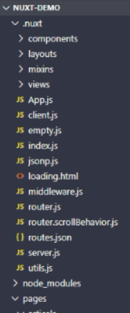
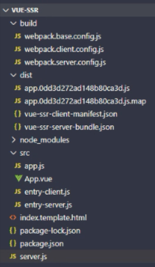

## Vue服务端渲染

#### 渲染

渲染：简单的理解就是将 数据 与 模板 拼接到一起的这个事儿。渲染本质其实就是字符串的解析替换，实现方式有很多种；但是我们这里要关注的并不是如何渲染，而是在哪里渲染的问题。

一、传统的服务端渲染（渲染是在服务端执行的）：在早期的WEB页面渲染都是在服务端进行的，服务端在运行过程中将所需的数据结合页面模板渲染为HTML，也就是在服务端已经将数据和模板构建好并生成 html ，然后再返回给客户端，所以客户端呈现就是包含具体数据内容的页面。这也是最早的网页渲染方式，也是动态网站的核心工作步骤。这种方式的代表性技术有ASP、PHP、JSP，再到后来的一些相对高级一点的服务端框架配合一些模板引擎。优点：在网页应用并不复杂的情况下，这种方式也是可取的。


不过在今天看来，这种渲染模式是不合理或者说不先进的。传统的服务端渲染的缺点：①前后端代码完全耦合在一起，在前后端协同开发方面会有非常大的阻力，不利于开发和维护；②前端没有足够发挥空间（不利于前后端分离开发）无法充分利用现在前端生态下的一些更优秀的方案；③服务端压力大；④用户体验一般（查看不同的页面，需要刷新浏览器）。

二、客户端渲染（服务端只需要负责数据的处理）：随着客户端的AJAX技术的普及，服务端渲染存在的一些问题得到了有效的解决。Ajax使得客户端动态获取数据成为可能，也就是在服务端的渲染的工作可以在客户端完成。

首先，客户端发起请求，请求网页地址，服务端返回一个空白的 HTML 页面，客户端拿到页面以后加载执行里面的脚本代码（如果有动态数据会发起AJAX请求），服务端收到请求之后进行查库相关操作，拿到数据后服务端把数据直接返回给客户端，客户端拿到数据再来渲染动态的页面内容展示给用户。

这样带来的好处就是前后端代码完全分离，服务端提供接口，客户端访问接口获取数据，而且有利于前后端开发人员协同开发，提高开发效率；同时由于可以在客户端渲染，从而减轻了服务端的压力；而且也提高了用户体验，进行页面的切换的时候，不会刷新浏览器。存在的问题：首屏渲染慢，以及不利于SEO。


为什么客户端渲染（单页面应用）首屏渲染慢？首屏，是在浏览器中输入一个地址后打开的第一个页面就是首屏，如果在浏览器的地址栏中输入了地址，向服务器发送请求，则服务器返回的是一个空白 HTML，没有具体的数据内容，只有 js 脚本，这时浏览器还会向服务器发送请求获取数据，即客户端渲染需要多次向服务器发送请求；这与传统服务端渲染直接获取服务端渲染好的 HTML 不同，单页应用使用 JavaScript 在客户端生成 HTML来呈现内容，用户需要等待客户端 JS 解析执行完成才能看到页面；也就是客户端渲染最起码要经历三次 http 请求周期，分别为第一次是（空白html）页面的请求，第二次是js（script标签对应的js文件）对应的请求，第三次是动态数据请求，这就使得首屏渲染慢和加载时间变长，从而影响用户体验。

为什么客户端渲染（单页面应用）不利于SEO？搜索引擎的程序不是浏览器，而是一个普通的程序，它拿到的都是网页的html字符串，不会像浏览器一样再去加载解析js并发请求拿数据后再渲染页面，而是会直接分析body看看有没有内容；当搜索引擎爬取网站 HTML 文件时，对于单页应用的 HTML 来说则没有内容，因为需要通过客户端 JavaScript 解析执行后才能生成网页内容，而目前的主流的搜索引擎对于这一部分内容的抓取还不是很好；所以对于目前的搜索引擎爬虫来说，页面中没有任何有用的信息，自然无法提取关键词并进行索引了。

为了解决这两个缺陷，业界借鉴了传统的服务端直出 HTML 方案，提出在服务器端执行前端框架（React/Vue/Angular）代码生成网页内容，然后将渲染好的网页内容返回给客户端，客户端只需要负责展示就可以了；

三、同构渲染，即（现代化的）服务端渲染：就是后端渲染+前端渲染的模式，实现了客户端（构建）渲染和服务端（构建）渲染的结合，集合了前端（客户端）渲染的优点也集合了传统服务端渲染的优点。执行流程是：①客户端发起请求；②服务端（在数据库）获取数据后，服务端渲染首屏内容（构建好对应的模板）且生成客户端 SPA 相关资源（生成HTML资源）；③服务端将生成的首屏资源发送给客户端；④客户端直接展示（服务端渲染好的）首屏内容；⑤首屏中的 SPA 相关资源执行之后会激活客户端 Vue，之后客户端所有的交互都由客户端 SPA 处理。（这样客户端就无需再向服务器发送请求）

同构渲染其实是基于Vue（对应Nuxt.js）或React（对应Next.js）等框架的，具体的流程就是，在服务端执行一次框架的代码用于实现服务端渲染，实现首屏的输出（直出），这样就解决了 SEO 和首屏渲染慢的问题，然后在客户端再执行一次，用于接管页面交互(后期的页面内容交互都是通过客户端渲染处理)。用这种方式构建的应用称之为服务端渲染应用或同构应用（isomorphic web apps）。


同构渲染：优点：首屏渲染速度快和有利于 SEO。缺点：
1.开发成本高：浏览器的一些特定的代码，只能在某些生命周期钩子函数 (lifecycle hook) 中使用，而一些外部扩展库(external library)（含有其它一些生命周期钩子函数）可能需要进行特殊处理，才能在服务器渲染应用程序中运行；
2.涉及构建设置和部署的更多要求：这与可以部署在任何静态文件服务器上的完全静态单页面应用程序(SPA) 不同，服务器渲染应用程序，需要处于 Node.js server 运行环境；
3.更多的服务器端负载：在 Node.js 中渲染完整的应用程序，显然会比仅仅提供静态文件的server更加大量占用 CPU 资源 (CPU-intensive - CPU 密集)，因此如果在高流量环境 (high traffic)下使用，则要准备相应的服务器负载，并明智地采用缓存策略，且需要更多的服务端渲染优化工作处理。

在对你的应用程序使用服务器端渲染 (SSR) 之前，你应该问的第一个问题是，是否真的需要它。这主要取决于内容到达时间 (time-to-content) （首屏加载速度）对应用程序的重要程度。内容到达时间 (time-to-content) 要求是绝对关键的指标，如果需要非常快地显示出来，则服务器端渲染(SSR) 可以帮助你实现最佳的初始加载性能。事实上，很多网站是出于效益的考虑才启用服务端渲染，性能倒是在其次（但不代表性能不重要）

如何实现同构渲染？
①使用 Vue或React等框架的官方解决方案。优点是有助于理解原理，缺点是需要搭建环境且比较麻烦。
②使用第三方解决方案：React 生态中的 Next.js；Vue 生态中的 Nuxt.js；Angular 生态中的 Angular Universal。

### Nuxt简介

Nuxt.js 是一个基于 Vue.js 生态开发的一个第三方服务端渲染框架，通过它可以轻松构建现代化的服务端渲染应用。

[英文官网](https://zh.nuxtjs.org/)；[中文官网](https://www.nuxtjs.cn/)；[GitHub 仓库](https://github.com/nuxt/nuxt.js)。Nuxt.js 主要关注的是应用的 UI渲染。通过对`客户端/服务端`基础架构的抽象组织，Nuxt的目标是创建一个灵活的应用框架，可以基于它初始化新项目的基础结构代码，或者在已有的 Node.js 项目中使用 Nuxt.js。Nuxt.js也预设了利用Vue.js开发服务端渲染的应用所需要的各种配置，还提供了一种命令叫`nuxt generate` ，为基于Vue.js的应用提供生成对应的静态站点的功能，这个功能，是向开发集成各种微服务（Microservices）的 Web 应用迈开的一步。作为框架，Nuxt.js 为 `客户端/服务端` 这种典型的应用架构模式提供了许多有用的特性，例如异步数据加载、中间件支持、布局支持等非常实用的功能。

Nuxt.js 集成了以下框架和组件，用于开发完整而强大的 Web 应用：Vue.js、Vue Router、Vuex、Vue Server Renderer，这些压缩并 gzip 后，总代码大小为57kb （如果使用了 Vuex 特性的话为 60kb）。另外，Nuxt.js 使用 [Webpack](https://github.com/webpack/webpack) 和 [vue-loader](https://github.com/vuejs/vue-loader) 、 [babel-loader](https://github.com/babel/babel-loader) 来处理代码的自动化构建工作（如打包、代码分层、压缩等）。

NuxtJS的特性：1.基于 Vue.js（Vue、Vue Router、Vuex、Vue SSR）；2.自动代码分层；3.服务端渲染；4.强大的路由功能，支持异步数据；5.静态文件服务；6.ES2015+ 语法支持；7.打包和压缩 JS 和 CSS；8.HTML 头部标签管理；9.本地开发支持热加载；10.集成 ESLint；11.支持各种样式预处理器，如 SASS、LESS、 Stylus 等；12.支持 HTTP/2 推送。

Nuxt.js 应用一个完整的服务器请求到渲染（或用户通过 `<nuxt-link>` 切换路由渲染页面）的流程：


NuxtJS 使用方式：①初始项目；②已有的 Node.js 服务端项目，即直接把 Nuxt 当作一个中间件集成到 Node Web Server 中；③现有的 Vue.js 项目，要非常熟悉 Nuxt.js，且至少会有百分之十的代码改动。

#### 通过 Nuxt 体验同构渲染

初始化 NuxtJS：

Nuxt 提供了两种方式用来创建项目（[官方文档](https://www.nuxtjs.cn/guide/installation#%E4%BB%8E%E5%A4%B4%E5%BC%80%E5%A7%8B%E6%96%B0%E5%BB%BA%E9%A1%B9%E7%9B%AE)）：①使用 create-nuxt-app 脚手架工具；②手动创建。这里选择通过手动创建的方式来学习 Nuxt：

```shell
# 创建示例项目：
mkdir ssr
# 进入示例项目目录中：
cd .\ssr\或cd ssr
# 初始化 package.json 文件：
npm init -y
# 安装 nuxt：
npm install nuxt
# 创建pages目录：
mkdir pages
```

```json
在package.json里的scripts里新增如下脚本命令：
"scripts": {
  "dev": "nuxt"
}
```

```vue
新建文件ssr/pages/index.vue，并写入
<template>
  <div>
    <h1>Home</h1>
  </div>
</template>
<script>export default {}</script>
<style></style>
```

```shell
之所以不用配置路由，是因为 Nuxt.js 会根据pages目录来自动生成路由配置（根据pages目录中的所有 *.vue 文件生成应用的路由配置）。且Nuxt.js 会监听 pages 目录中的文件更改，所以在添加新页面时，无需重新启动应用程序。
运行nuxt项目：npm run dev（首次运行会在项目根目录生成一个.nuxt文件夹）之后在浏览器输入localhost:3000即可看见上面的index.vue页面
```



#### Nuxt的路由

##### 通过Nuxt生成的基础路由

```
假设 pages 的目录结构如下：
pages/
--| user/
-----| index.vue
-----| one.vue
--| index.vue
```

```js
则对应Nuxt.js 自动生成的路由配置如下：
router: {
  routes: [
    {
      name: 'index',
      path: '/',
  	  component: 'pages/index.vue'
  	},
  	{
  	  name: 'user',
  	  path: '/user',
  	  component: 'pages/user/index.vue'
  	},
  	{
  	  name: 'user-one',
  	  path: '/user/one',
  	  component: 'pages/user/one.vue'
  	}
  ]
}
```

```vue
新建文件ssr/pages/about.vue，并写入如下
<template>
  <div>
    <h1>About page</h1>
    <!-- a 链接，它会刷新整个页面（刷新导航），走服务端渲染 -->
    <h2>a 链接</h2>
    <a href="/">首页</a>
    <!-- 相当于router-link 导航链接组件 https://router.vuejs.org/zh/api/#router-link-props -->
    <h2>nuxt-link</h2>
    <nuxt-link to="/">首页</router-link>
    <!-- 编程式导航 https://router.vuejs.org/zh/guide/essentials/navigation.html -->
    <h2>编程式导航</h2>
    <button @click="onClick">首页</button>
  </div>
</template>
<script>
export default {
  name: 'AboutPage',
  methods: {
    onClick () {
      this.$router.push('/')
    }
  }
}
</script>
```

##### 通过Nuxt生成的动态路由

官方文档：[Vue Router 动态路由](https://router.vuejs.org/zh/guide/essentials/dynamic-matching.html#%E5%8A%A8%E6%80%81%E8%B7%AF%E7%94%B1%E5%8C%B9%E9%85%8D)，[Nuxt.js 动态路由](https://www.nuxtjs.cn/guide/routing#%E5%8A%A8%E6%80%81%E8%B7%AF%E7%94%B1)。在 Nuxt.js 里面定义带参数的动态路由，需要创建对应的**以下划线作为前缀**的 Vue 文件 或 目录。

```
以下目录结构：
pages/
--| _slug/
-----| comments.vue
-----| index.vue
--| users/
-----| _id.vue
--| index.vue
```

```js
Nuxt.js 生成对应的路由配置表为：
router: {
  routes: [
    {
      name: 'index',
      path: '/',
      component: 'pages/index.vue'
    },
    {
      name: 'users-id',
      path: '/users/:id?',
      component: 'pages/users/_id.vue'
    },
    {
      name: 'slug',
      path: '/:slug',
      component: 'pages/_slug/index.vue'
    },
    {
      name: 'slug-comments',
      path: '/:slug/comments',
      component: 'pages/_slug/comments.vue'
    }
  ]
}
```

```vue
// pages/user/_id.vue
<template>
  <div>
    <h1>User Pages</h1>
  </div>
</template>

<script>
export default {
  name: 'UserPage'
}
</script>
```


:id? 参数，表示该路由是可选的（当该目录没有index.vue文件时，无论有没有传入动态参数id，都显示_id.vue这个组件）。如果要将它设置为必选的路由，则要在 users/ 目录内创建一个 index.vue 文件。

##### 通过Nuxt生成的嵌套路由

官方文档：[Vue Router 嵌套路由](https://router.vuejs.org/zh/guide/essentials/nested-routes.html)，[Nuxt.js 嵌套路由](https://www.nuxtjs.cn/guide/routing#%E5%B5%8C%E5%A5%97%E8%B7%AF%E7%94%B1)。可以通过 vue-router 的子路由创建 Nuxt.js 应用的嵌套路由。创建内嵌子路由，需要在对应目录下添加一个 Vue 文件作为父组件，且在该父组件( `.vue` 文件) 内增加 `<nuxt-child/>` 用于显示子视图内容，同时（在该目录下）添加一个与该文件同名的目录用来存放子视图组件。即如果pages目录下只有xxx文件夹，则 /xxx 路径对应 pages/xxx/index.vue组件页面；如果pages目录下既有xxx文件夹又有xxx.vue文件，则 /xxx 路径对应 pages/xxx.vue(父)和 pages/xxx/index.vue(子)组件页面。

```
假设文件结构如：
pages/
--| users/
-----| _id.vue
-----| index.vue
--| users.vue
```

```js
Nuxt.js 自动生成的路由配置如下：
router: {
  routes: [
    {
      path: '/users',
      component: 'pages/users.vue',
      children: [
        {
          path: '',
          component: 'pages/users/index.vue',
          name: 'users'
        },
        {
          path: ':id',
          component: 'pages/users/_id.vue',
          name: 'users-id'
        }
      ]
    }
  ]
}
```

##### 通过Nuxt自定义路由配置

[官方文档](https://zh.nuxtjs.org/docs/2.x/configuration-glossary/configuration-router/)。这里举例：

```js
// nuxt.config.js。Nuxt.js 配置文件
module.exports = {
  router: {
    base: '/abc'
  }
}
```


```js
module.exports = {
  router: {
    base: '/abc',
    extendRoutes(routes, resolve) { // routes: 一个数组，路由配置表。resolve: 解析路由组件路径
      routes.push({
        name: 'hello',
        path: '/hello',
        component: resolve(__dirname, 'pages/about.vue')
      })
    }
  }
}
```


#### NuxtJS 视图

[官方文档](https://www.nuxtjs.cn/guide/views)。在 NuxtJS 中页面结构一般由三部分组成：

①最外层的文档页面，也就是单页面或者说服务端渲染的HTML页面。

②在HTML页面里面包裹着 Layout布局组件（可自己配置），相当于所有页面的父路由。

③再往里面是页面组件，每个页面组件有自己额外的成员方法，包括页面的子组件之类的可选内容。


可以定制化 Nuxt.js 默认的应用模板：定制化默认的 html 模板，只需要在 `src` 文件夹下（默认是应用根目录）创建一个 `app.html` 的文件：默认模板为：

```html
<!DOCTYPE html>
<html {{ HTML_ATTRS }}>
  <head {{ HEAD_ATTRS }}>
    {{ HEAD }}
  </head>
  <body {{ BODY_ATTRS }}>
    {{ APP }}
  </body>
</html>
```

可修改为

```html
// app.html
<!DOCTYPE html>
<html {{ HTML_ATTRS }}>
  <head {{ HEAD_ATTRS }}>
    {{ HEAD }}
  </head>
  <body {{ BODY_ATTRS }}>
    <!-- 渲染的内容最终会注入到这里 -->
    <h1>app.html</h1>
    {{ APP }}
  </body>
</html>
```


Nuxt.js 允许扩展默认的布局，或在 `layout` 目录下创建自定义的布局。可通过添加 `layouts/default.vue` 文件来扩展应用的默认布局（需要在布局文件中添加 <nuxt/> 组件用于显示页面的主体内容。默认布局的源码如下：

```vue
<template>
  <nuxt />
</template>
```

```vue
// layouts/default.vue // 一旦使用，默认所有页面都会作用，不能取消，只能更改
<template>
  <div>
    <h1>layouts/default.vue 组件</h1>
    <nuxt /> <!-- 页面出口，类似于子路由出口 -->
  </div>
</template>
<script>
export default {
  name: 'LayoutDefault'
}
</script>
```

然后必须告诉页面 (即`pages/index.vue`) 使用的自定义布局：

```vue
<template>
  <h1>Hello world!</h1>
</template>
<script>
export default {
  name: 'HomePage',
  layout: 'default' // 默认 default 可修改
}
</script>
```


#### 通过Nuxt在服务端请求数据

Nuxt.js 扩展了 Vue.js，增加了一个叫 `asyncData` 的方法，使得我们可以在设置组件的数据之前能异步获取或处理数据。[官方文档](https://www.nuxtjs.cn/guide/async-data)。

体验同构渲染时，在服务端请求数据，之后把渲染好的页面发给客户端：

```shell
安装相关依赖包：npm i axios
```

```vue
新建文件ssr/pages/index.vue，并写入如下。之后保存（nuxt重新运行）即可在浏览器看见效果。
<template>
  <div id="app">
    <h2>{{ title }}</h2>
    <ul>
      <li
        v-for="item in posts"
        :key="item.id"
      >{{ item.title }}</li>
    </ul>
  </div>
</template>
<script>
import axios from 'axios'
export default {
  name: 'Home',
  components: {},
  async asyncData () { // Nuxt 中特殊提供的一个钩子函数，专门用于（发起异步请求）获取页面服务端渲染的数据
    // asyncData函数是在组件初始化前执行的，除了会在服务端渲染期间来运行，还会在客户端路由导航之前运行
    // (第一次输出)先通过链接进入about再从about返回index(第二次输出)发现：`asyncData`输出两次（第一次服务端首屏渲染，第二次客户端调用）
    console.log(this) // 里面不能通过this获取组件实例(故也不能获取组件里的数据)。this返回值为undefined，因为它是在组件初始化之前被调用的
    console.log('asyncData') // 执行的时机是在服务端（Nuxt SSR包裹起来在客户端）
    const { data } = await axios({
      method: 'GET',
      url: '/data.json' // NuxtJS默认在Web服务中将数据暴露出来，可以直接通过 `./data.json` 获取数据
    })
    // return res.data或
    return { // 返回的数据会和 data() {} 中的数据合并(融合)到一起给页面使用（即里面的每个属性会合并到data数据里）
      title: data.title,
      posts: data.posts
    }
  } 
}
</script>
<style></style>
```


服务端首屏渲染既能确保异步数据能在渲染到客户端之前已经被渲染好（提高首屏渲染速度，有利于SEO），在达到页面后又变成SPA客户端应用，asyncData同样可以被调用从而更新数据。但是在非页面组件中（如'@/components/Foo'），并不会调用asyncData（因为asyncData只能在页面组件中使用），所以要通过页面组件获取动态数据再传给子组件。

#### 通过Nuxt来同构渲染的SPA应用

虽然这个（首屏）内容是服务端渲染出来的，但它还是个单页面应用程序（SPA）。首屏渲染是通过服务端渲染出来的，之后的交互都是在客户端渲染完成的。通过下面的案例，在首屏进行链接跳转页面之后，并不会引起页面刷新，说明其还是单页面程序，即客户端渲染。

```vue
新建文件ssr/pages/about.vue，并写入如下。
<template>
  <div>
    <h1>About</h1>
  </div>
</template>
<script>export default {}</script>
<style></style>
```

```vue
新建文件ssr/layouts/default.vue（注意是layouts文件夹下的default页面，这个相当于根组件），并写入如下。这个模板会作为所有页面的父模板
<template>
  <div>
    <ul>
      <li>
        <nuxt-link to="/">Home</nuxt-link> <!-- 类似于 router-link，用于单页面导航 -->
      </li>
      <li>
        <nuxt-link to="/about">About</nuxt-link>
      </li>
    </ul>
    <nuxt /> <!-- 子页面出口 -->
  </div>
</template>
<script>export default {}</script>
<style></style>
```

```shell
重启服务：npm run dev
```

#### 在asyncData里获取context上下文对象

例子：为了点击标题能跳转到文章页面，所以准备了`pages/article/_id.vue` 详情页面（动态路由），需求是拿到对应的id，获取文章内容展示到页面，并且要使数据有利于SEO，提高首屏渲染速度。解决方案：

```vue
// components/Foo.vue
<template>
  <div>
    <h1>FooPage</h1>
    <ul>
      <li
        v-for="item in posts"
        :key="item.id"
      >
      <nuxt-link :to="'/article/' + item.id">{{ item.title }}</nuxt-link>
      </li>
    </ul>
  </div>
</template>
```

```vue
// pages/article/_id.vue
<template>
  <div>
    <!-- <h1>article page</h1> -->
    <h1>{{ article.title }}</h1>
    <div>{{ article.body }}</div>
  </div>
</template>
<script>
import axios from 'axios'
export default {
  name: 'ArticlePage',
  async asyncData (context) { // asyncData里的参数为context上下文对象
    console.log(context) // 这里有需要的数据
    const { data } = await axios({
      method: 'GET',
      url: 'http://localhost:3000/data.json'
    })
    // console.log(this.$router.params) // 由于asyncData 里面没有 this，所以不能通过这种方式获取 id
    // 可以通过上下文对象的 params.id来获取
    const id = Number.parseInt(context.params.id) // 拿到后将字符串类型转换为数字类型
    return {
      article: data.posts.find(item => item.id === id)
    }
  }
}
</script>
```

#### NuxtJS 生命周期

| 钩子函数      | 说明                                                         | Server | Client |
| ------------- | ------------------------------------------------------------ | ------ | ------ |
| beforeCreate  | 在实例创建之前被调用，此时还拿不到数据和 DOM。               | ✔      | ✔      |
| created       | 在实例创建完成后被调用，此时可以操作数据了。                 | ✔      | ✔      |
| beforeMount   | 在挂载开始之前被调用：相关的 render 函数首次被调用。         | ❌      | ✔      |
| mounted       | 实例被挂载后调用，此时可以执行一些初始 DOM 操作。            | ❌      | ✔      |
| beforeUpdate  | 数据更新时调用，发生在虚拟 DOM 打补丁之前。这里适合在更新之前访问现有的 DOM，比如手动移除已添加的事件监听器。 | ❌      | ✔      |
| updated       | 由于数据更改导致的虚拟 DOM 重新渲染和打补丁，在这之后会调用该钩子。当这个钩子被调用时，组件DOM 已经更新，所以你现在可以执行依赖于 DOM 的操作。 | ❌      | ✔      |
| activated     | 被 keep-alive 缓存的组件激活时调用。                         | ❌      | ✔      |
| deactivated   | 被 keep-alive 缓存的组件停用时调用。                         | ❌      | ✔      |
| beforeDestroy | 实例销毁之前调用。在这一步，实例仍然完全可用。               | ❌      | ✔      |
| destroyed     | 实例销毁后调用。该钩子被调用后，对应 Vue 实例的所有指令都被解绑，所有的事件监听器被移除，所有的子实例也都被销毁。 | ❌      | ✔      |
| errorCaptured | 当捕获一个来自子孙组件的错误时被调用。                       | ✔      | ✔      |


### Vue SSR 介绍

Vue SSR（Vue.js Server-Side Rendering） 是 Vue.js 官方提供的一个服务端渲染（同构应用）解决方案，使用它可以基于原有的 Vue.js 技术栈来构建同构应用。

官方文档的解释：Vue.js 是构建客户端应用程序的框架。默认情况下，可以在浏览器中输出 Vue组件，进行生成 DOM 和操作 DOM。然而，也可以将同一个组件渲染为服务器端的 HTML 字符串，将它们直接发送到浏览器，最后将这些静态标记进行"激活"之后，成为客户端上完全可交互的应用程序。服务器渲染的 Vue.js 应用程序也可以被认为是"同构"或"通用"，因为应用程序的大部分代码都可以在**服务器**和**客户端**上运行。

使用场景：①技术层面（更快的首屏渲染速度，更好的 SEO）；②业务层面（不适合管理系统，适合门户资讯类网站如企业官网和知乎和简书等，适合移动网站）
实现 Vue SSR的方式：（接下来用①的方式来演示）
①基于 Vue SSR 官方文档提供的解决方案：官方方案具有更直接的控制应用程序的结构、更深入底层和更加灵活的特点；同时在使用官方方案的过程中，也会对Vue SSR有更加深入的了解；使用该方式需要熟悉 Vue.js 本身，并且具有 Node.js 和 webpack 的应用经验。
②Nuxt.js 开发框架：NUXT提供了平滑的开箱即用的体验，它建立在同等的Vue技术栈之上，但抽象出很多模板，并提供了一些额外的功能，例如静态站点生成等；通过 Nuxt.js 可以快速的使用 Vue SSR 构建同构应用。



#### 用Vue SSR渲染一个 Vue 实例

```shell
mkdir vue-ssr
cd vue-ssr
生成package.json文件：npm init -y
安装vue和vue-server-renderer：npm i vue vue-server-renderer
```

创建模块server.js，并写入如下：

```js
// 第 1 步：创建一个 Vue 实例
const Vue = require('vue')
const app = new Vue({
  template: `
    <div id="app">
      <h1>{{ message }}</h1>
    </div>
  `,
  data: {
    message: '时光海'
  }
})
// 第 2 步：创建一个 renderer
const renderer = require('vue-server-renderer').createRenderer()
// 第 3 步：将 Vue 实例渲染为 HTML
renderer.renderToString(app, (err, html) => {
  if (err) throw err
  console.log(html) // => <div id="app" data-server-rendered="true"><h1>时光海</h1></div>
})
```

#### 与服务器集成

```shell
安装 [Express](https://expressjs.com/) 到项目中：npm i express
```

然后使用 Express 创建一个基本的 Web 服务：（server.js）

```js
const Vue = require('vue')
const renderer = require('vue-server-renderer').createRenderer()
const express = require('express')
const server = express()
server.get('/', (req, res) => {
  const app = new Vue({
    template: `
      <div id="app">
        <h1>{{ message }}</h1>
      </div>
    `,
    data: {
      message: '时光海'
    }
  })
  renderer.renderToString(app, (err, html) => {
    if (err) {
      res.status(500).end('Internal Server Error.')
    }
    // res.end(html) // 单单这样end可能会产生编码问题，解决方案：
      res.setHeader('Content-Type', 'text/html; charset=utf-8') // 虽然下面meta的UTF-8可解决，但这里把请求头也设置上更严谨
      res.end(`
        <!DOCTYPE html>
        <html lang="en">
          <head>
            <title>Hello</title>
            <meta charset="UTF-8">
          </head>
          <body>${html}</body>
        </html>
      `)
  })
})
server.listen(3000, () => {
  console.log('server runing at port 3000.')
})
```

```shell
启动 Web 服务：nodemon server.js
```


#### 与页面模板结合使用

新建`index.template.html`文件，并写入如下：注意：
<!--vue-ssr-outlet-->：必须填为该格式，用于把html字符串内容替换到该处。
可以填入外部数据，要包裹在三对大括号{{{}}}里面，且要在renderToString方法的第二个参数里写上要替换的数据。

```html
<!DOCTYPE html>
<html lang="en">
<head>
  <title>{{{ title }}}</title>
  <meta charset="UTF-8">
  {{{ meta }}}
</head>
<body>
  <!--vue-ssr-outlet-->
</body>
</html>
```

修改server.js文件

```js
const fs = require('fs')
const Vue = require('vue')
const renderer = require('vue-server-renderer').createRenderer({
	template: fs.readFileSync('./index.template.html', 'utf-8')
})
const express = require('express')
const server = express()
server.get('/', (req, res) => {
	const app = new Vue({
		data: {
			message: '时光海'
		},
		template: `
      <div id="app">
        <h1>{{ message }}</h1>
      </div>
    `
	})
	renderer.renderToString(app, {
		title: '时光海',
		meta: "<meta name='description' content='时光海'>"
	}, (err, html) => {
		if (err) {
			res.status(500).end('Internal Server Error.')
		}
		// res.end(html) // 单单这样end可能会产生编码问题，解决方案：
		res.setHeader('Content-Type', 'text/html; charset=utf-8') // 虽然下面meta的UTF-8可解决，但这里把请求头也设置上更严谨
		res.end(html)
	})
})
server.listen(3000, () => {
	console.log('server runing at port 3000.')
})
```


但是，这样做只能做到服务端渲染（然后把渲染好的html返回给客户端），而客户端的其它功能效果（如交互等）还不能实现，因为没有引入其它的js文件。

#### 构建同构渲染

构建流程：如图，左边为应用的源代码Source，中间为Webpack，右边为NodeServer服务端。

而在上面的应用中，只有Server entry服务端入口来处理服务端渲染，如果希望服务端渲染的内容拥有客户端动态交互的能力的话，还需要有一个客户端脚本的入口Client entry，它专门来处理客户端渲染，也就是去接管服务端渲染的内容并将其激活为一个动态页面。

有了这两个入口之后需要Webpack对它们进行打包编译构建：对于Server entry最终要打包为一个ServerBundle来做服务端渲染，同样的对于客户端入口Client entry最终要打包为一个ClientBundle来接管服务端渲染好的静态页面并将其进行激活。这就是同构应用实现的一个基本流程。


##### **源码结构：新建src文件夹：**

在src下新建App.vue文件：

```vue
<template>
  <div id="app">
    <h1>{{ message }}</h1>
    <h2>客户端动态交互</h2>
    <div>
      <input v-model="message">
    </div>
    <div>
      <button @click="onClick">点击测试</button>
    </div>
  </div>
</template>
<script>
export default {
  name: 'App',
  data () {
    return {
      message: '时光海'
    }
  },
  methods: {
    onClick () {
      console.log('Hello World!')
    }
  }
}
</script>
<style></style>
```

在src下新建app.js文件：

```js
// 通用启动入口
import Vue from 'vue'
import App from './App.vue'
export function createApp () { // 导出一个工厂函数，用于创建新的应用程序、router、store实例
  const app = new Vue({
    render: h => h(App) // 根实例简单的渲染应用程序
  })
  return { app }
}
```

在src下新建entry-client.js文件：

```js
// 客户端入口
import { createApp } from './app'
const { app } = createApp() // 客户端特定引导逻辑
// 这里表示 App.vue 模板中根元素具有 `id="app"`
app.$mount('#app')
```

在src下新建entry-server.js文件：

```js
// 服务端启动入口
import { createApp } from './app'
export default context => {
  const { app } = createApp()
  return app
}
```

##### **构建配置：**

①安装依赖：

```shell
安装生产依赖：npm i vue vue-server-renderer express cross-env
```

| 包                  | 说明                                |
| ------------------- | ----------------------------------- |
| vue                 | Vue.js 核心库                       |
| vue-server-renderer | Vue 服务端渲染工具                  |
| express             | 基于 Node 的 Web 服务框架           |
| cross-env           | 通过 npm scripts 设置跨平台环境变量 |

```shell
安装开发依赖：npm i -D webpack webpack-cli webpack-merge webpack-node-externals @babel/core @babel/plugin-transform-runtime @babel/preset-env babel-loader css-loader url-loader file-loader rimraf vue-loader vue-template-compiler friendly-errors-webpack-plugin
```

| 包                                                           | 说明                                     |
| ------------------------------------------------------------ | ---------------------------------------- |
| webpack                                                      | webpack 核心包                           |
| webpack-cli                                                  | webpack 的命令行工具                     |
| webpack-merge                                                | webpack 配置信息合并工具                 |
| webpack-node-externals                                       | 排除 webpack 中的 Node 模块              |
| rimraf                                                       | 基于 Node 封装的一个跨平台 rm -rf 工具？ |
| friendly-errors-webpack-plugin                               | 友好的 webpack 错误提示                  |
| @babel/core @babel/plugin-transform-runtime @babel/preset-env babel-loader | Babel 相关工具                           |
| vue-loader vue-template-compiler                             | 处理 .vue 资源                           |
| file-loader                                                  | 处理字体资源                             |
| css-loader                                                   | 处理 CSS 资源                            |
| url-loader                                                   | 处理图片资源                             |

②配置Webpack配置文件（新建build文件夹）

在build下初始化 webpack 打包配置文件`webpack.base.config.js`：

```js
// 公共配置
const VueLoaderPlugin = require('vue-loader/lib/plugin') // 处理.vue资源
const path = require('path') // 处理路径
const FriendlyErrorsWebpackPlugin = require('friendly-errors-webpack-plugin') //友好的日志输出
const resolve = file => path.resolve(__dirname, file) // 得到绝对安全的文件路径
const isProd = process.env.NODE_ENV === 'production' // 是否为生产模式
module.exports = { // 客户端打包和服务端打包的公共配置内容
  mode: isProd ? 'production' : 'development', // 打包模式
  output: { // 打包结果
    path: resolve('../dist/'), // 打包输出目录。在项目根目录下的dist文件夹里
    publicPath: '/dist/', // 打包结果文件加载路径
    filename: '[name].[chunkhash].js' // 文件名。这样当文件内容改变时，能够重新生成新的文件(名)，防止浏览器发送请求的缓存问题
  },
  resolve: {
    alias: {
      '@': resolve('../src/') // 路径别名，@指向src
    },
    extensions: ['.js', '.vue', '.json'] // 可以省略的扩展名，当省略扩展名的时候，按照从前往后的顺序依次解析
  },
  devtool: isProd ? 'source-map' : 'cheap-module-eval-source-map', // 配置source-map
  module: {
    rules: [
      { // 处理图片资源
        test: /\.(png|jpg|gif)$/i,
        use: [
          {
            loader: 'url-loader',
            options: {
              limit: 8192,
            },
          },
        ],
      },
      { // 处理字体资源
        test: /\.(woff|woff2|eot|ttf|otf)$/,
        use: [
          'file-loader',
        ],
      },
      { // 处理 .vue 资源
        test: /\.vue$/,
        loader: 'vue-loader'
      },
      { // 处理 CSS 资源，它会应用到普通的 `.css` 文件，以及 `.vue` 文件中的 `<style>` 块
        test: /\.css$/,
        use: [
          'vue-style-loader',
          'css-loader'
        ]
      },
      // { // CSS 预处理器，参考：https://vue-loader.vuejs.org/zh/guide/pre-processors.html，例如处理 Less 资源
      //   test: /\.less$/,
      //   use: [
      //     'vue-style-loader',
      //     'css-loader',
      //     'less-loader'
      //   ]
      // },
    ]
  },
  plugins: [
    new VueLoaderPlugin(),
    new FriendlyErrorsWebpackPlugin()
  ]
}
```

在build下初始化 webpack 打包配置文件`webpack.client.config.js`：

```js
// 客户端打包配置
const { merge } = require('webpack-merge') // 合并webpack配置信息
const baseConfig = require('./webpack.base.config.js')
const VueSSRClientPlugin = require('vue-server-renderer/client-plugin')
module.exports = merge(baseConfig, {
  entry: {
    app: './src/entry-client.js'
  },
  module: {
    rules: [
      { // ES6 转 ES5
        test: /\.m?js$/,
        exclude: /(node_modules|bower_components)/,
        use: {
          loader: 'babel-loader',
          options: {
            presets: ['@babel/preset-env'],
            cacheDirectory: true,
            plugins: ['@babel/plugin-transform-runtime']
          }
        }
      },
    ]
  },
  optimization: { // 重要信息：这将 webpack 运行时分离到一个引导chunk中，以便可以在之后正确注入异步chunk
    splitChunks: {
      name: "manifest",
      minChunks: Infinity
    }
  },
  plugins: [
    new VueSSRClientPlugin() // 此插件在输出目录中生成`vue-ssr-client-manifest.json`，里面描述客户端打包结果中的依赖及要加载的模块信息
  ]
})
```

在build下初始化 webpack 打包配置文件`webpack.server.config.js`：

```js
// 服务端打包配置
const { merge } = require('webpack-merge')
const nodeExternals = require('webpack-node-externals')
const baseConfig = require('./webpack.base.config.js')
const VueSSRServerPlugin = require('vue-server-renderer/server-plugin')
module.exports = merge(baseConfig, {
  entry: './src/entry-server.js', // 将 entry 指向应用程序的 server entry 文件
  target: 'node', // 允许webpack以Node适用方式处理模块加载,并会在编译Vue组件时,告知vue-loader输送面向服务器代码(server-oriented code)
  output: {
    filename: 'server-bundle.js',
    libraryTarget: 'commonjs2' // 此处告知 server bundle 使用 Node 风格导出模块(Node-style exports)
  },
  externals: [nodeExternals({ // 不打包 node_modules 第三方包，而是保留 require 方式直接加载
    allowlist: [/\.css$/] // 但是这里白名单中的资源依然正常打包
  })],
  plugins: [
    new VueSSRServerPlugin() // 这是将服务器的整个输出构建为单个JSON文件的插件，默认文件名为`vue-ssr-server-bundle.json`
  ]
})
```

③配置打包（构建）命令：

在 package.json文件的scripts中配置打包命令：

```js
"scripts": {
  "build:client": "cross-env NODE_ENV=production webpack --config build/webpack.client.config.js",
  "build:server": "cross-env NODE_ENV=production webpack --config build/webpack.server.config.js",
  "build": "rimraf dist && npm run build:client && npm run build:server"
}
```

运行测试：

```shell
npm run build:client和npm run build:server
或直接：npm run build
```

之后就会在项目根目录下生成dist文件夹，里面含有xxx.js文件、xxx.js.map文件、vue-ssr-client-manifest.json文件和vue-ssr-server-bundle.json文件。

④启动应用

修改`server.js`文件：

```js
const fs = require('fs')
const Vue = require('vue')
const express = require('express')
const serverBundle = require('./dist/vue-ssr-server-bundle.json')
const template = fs.readFileSync('./index.template.html', 'utf-8')
const clientManifest = require('./dist/vue-ssr-client-manifest.json')
const renderer = require('vue-server-renderer').createBundleRenderer(serverBundle, {
  template,
  clientManifest
})
const server = express()
server.use('/dist', express.static('./dist'))
server.get('/', (req, res) => {
  renderer.renderToString({
    title: '时光海',
    meta: `
      <meta name="description" content="时光海">
    `
  }, (err, html) => {
    if (err) {
      res.status(500).end('Internal Server Error.')
    }
    res.setHeader('Content-Type',
    'text/html; charset=utf-8')
    res.end(html)
  })
})
server.listen(3000, () => {
  console.log('server runing at port 3000.')
})
```

```shell
启动 Web 服务：nodemon server.js
```


这样就能实现服务端渲染的内容拥有客户端动态交互的能力了。


#######

我们现在已经实现同构应用的基本功能了，但是这对于一个完整的应用来说还远远不够，例如如何处理同构应用中的路由、如何在服务端渲染中进行数据预取等功能，这些功能还没有进行实现，以及实现这些功能之前的关于打包的问题依然要解决。欢迎对额外其它笔记下的fed-e-task-03-04进行进一步学习。

