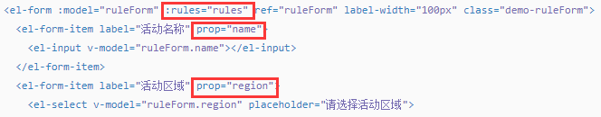
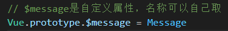
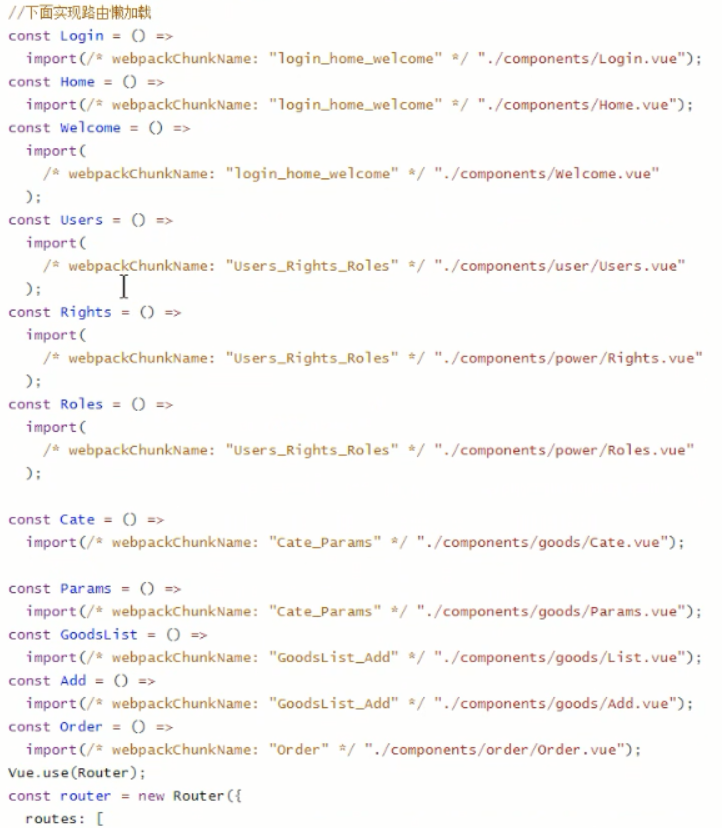

## Vue电商后台管理系统面试题【项目面试题】

[vue后台管理系统](https://www.cnblogs.com/zcy9838/p/13326783.html)：https://www.cnblogs.com/zcy9838/p/13326783.html

[vue后台管理系统——登录/退出功能](https://www.cnblogs.com/zcy9838/p/13326876.html)：https://www.cnblogs.com/zcy9838/p/13326876.html

[vue后台管理系统——主页布局](https://www.cnblogs.com/zcy9838/p/13383165.html)：https://www.cnblogs.com/zcy9838/p/13383165.html

[vue后台管理系统——用户管理模块](https://www.cnblogs.com/zcy9838/p/13418923.html)：https://www.cnblogs.com/zcy9838/p/13418923.html

[vue后台管理系统——权限管理模块](https://www.cnblogs.com/zcy9838/p/13419030.html)：https://www.cnblogs.com/zcy9838/p/13419030.html

[vue后台管理系统——商品管理模块](https://www.cnblogs.com/zcy9838/p/13440391.html)：https://www.cnblogs.com/zcy9838/p/13440391.html

[vue后台管理系统——订单管理模块](https://www.cnblogs.com/zcy9838/p/13460560.html)：https://www.cnblogs.com/zcy9838/p/13460560.html

// [vue后台管理系统——数据统计模块](https://www.cnblogs.com/zcy9838/p/13460989.html)：https://www.cnblogs.com/zcy9838/p/13460989.html

[vue后台管理系统——项目优化上线](https://www.cnblogs.com/zcy9838/p/13493536.html)：https://www.cnblogs.com/zcy9838/p/13493536.html


### 1项目简介

#### 项目概述和初始化

根据不同的应用场景，电商系统一般都提供了 PC 端（用户）、PC后台管理、微信小程序、移动 Web、移动 APP等多种终端访问方式。下面讲解的是PC后台管理


① 前端项目初始化步骤：安装 Vue 脚手架、通过 Vue 脚手架创建项目、配置 Vue 路由、配置 Element-UI 组件库、配置 axios 库、初始化 git 远程仓库、将本地项目托管到 Github 或 码云 中。

1.安装脚手架后，使用Vue脚手架快速生成 Vue 项目基础架构（打开cmd，输入`vue ui`命令进入图形化界面创建vue项目）：


2.安装Babel、Router、Linter/Formatter、配置文件：


3.创建好项目之后，再安装需要的插件，安装ElementUI的相关插件：


4.安装项目需要的依赖：配置axios：


5.初始化好项目后，需要申请一个码云账号（网址：https://gitee.com/），方便以后将项目代码上传到云端（要设置SSH公钥，[怎样设置公钥](https://gitee.com/help/articles/4181#article-header0)）：


6.将本地项目托管到码云上：


创建完成之后打开终端，执行下面这两行全局设置命令：


根据是否有仓库分别选择所要执行的命令：


找到创建的vue项目所在的文件夹，按住shift+右键，打开一个powershell终端，使用`git status`命令检查一下项目状态：（会发现这里面有些文件还需要提交一下，使用`git add .`命令将所有文件都提交一下，添加到暂存区；然后使用`git commit -m 'add files'`命令先在本地做一次提交；当提交完成之后，再使用`git status`检查一下项目状态）（最后执两句命令，将本地仓库与云端仓库做一下关联）


[解决git push -u origin master命令报错：error: failed to push some refs to 'xxxx'的问题](https://www.cnblogs.com/yiduobaozhiblog1/p/9125465.html)

第一次提交会弹出一个命令窗口验证你的身份：（验证后则提交完成）


② 后台项目的环境安装配置：安装 MySQL 数据库、安装 Node.js 环境、配置项目相关信息、启动项目、使用 Postman 测试后台项目接口是否正常。

将后台接口代码的db文件夹中的mydb.sql文件导入到MySQL数据库中（[navicat如何导入并执行.sql文件](https://www.cnblogs.com/dingguofeng/p/8676971.html)），然后将config文件夹下的default.son配置文件进行修改（连接数据库的信息）：


打开后台接口项目，shift+右键打开一个powershell终端，输入npm install命令安装所有的依赖包，安装完成之后，就可以启动该项目了，输入`node app.js`命令将api接口项目运行起来：出现类似这种页面就表示启动成功：


#### 后台管理系统的功能划分

电商后台管理系统用于**管理用户账号、商品分类、商品信息、订单、数据统计**等业务功能。


#### 后台管理系统的开发模式（前后端分离）

电商后台管理系统整体采用前后端分离的开发模式，其中前端项目是基于 Vue 技术栈的 SPA 项目。（前后端分离模式：后端负责写接口，前端负责调用接口的开发模式）


前后端分离的开发流程：在开发期间，前后端共同商定好数据接口的交互形式和数据格式，然后实现前后端的井行开发（其中前端工程师在开发完成之后可以独自进行mock测试，而后端也可以使用接口测试平台进行接口自测），然后前后端一起进行功能联调并校验格式，最终进行自动化测试。


#### 后台管理系统的技术选型

① 前端项目技术栈：Vue，Vue-router，Element-UI，Axios，Echarts。② 后端项目技术栈：Node.js，Express，Jwt，Mysql，Sequelize。

### 2登录和退出功能

#### 登录业务逻辑

① 在登录页面输入用户名和密码
② 调用后台接口进行验证
③ 通过验证之后，根据后台的响应状态跳转到项目主页

#### 登录业务的相关技术点

记录登录状态的方式：因为http是无状态的，所以可以：①（传统的）通过 cookie 在客户端记录状态；②（传统的）通过 session 在服务器端记录状态（在客户端保存sessionId到cookie里，更安全）；③通过 token 方式维持状态（按理来说通过本地Storage的方式最安全，因为只有指定的请求才会携带这个token，而cookie是无论本网站的什么请求都会携带）。

如果前端与后台接口之间不存在跨域问题（服务器集群、类似跨域的服务导向架构），那么推荐使用cookie和session来记录登录状态。如果前端与服务器接口之间存在跨域问题，那么就要使用token的方式来维持登录状态。

#### token原理分析


传统认证流程（session）模式的问题在于，扩展性（scaling）不好。如果是单机（单个服务器）则没有问题（假如用户量少，服务器能承受住压力）。但是，如果在服务器集群或（类似）跨域的服务导向架构，就要求session数据共享，即每台服务器都能够读取session。所以在集群或跨域架构的应用环境下，推荐使用token的模式校验。

例如，A网站和B网站是同一家公司的关联服务（同一个域名，不同ip地址即不同服务器？），现在要求用户在其中一个站点登录，再访问另一个网站就会自动登录，怎么实现？一种方案是session数据共享，即session数据持久化（写入数据库或别的持久层），各种服务器收到请求后，都向持久层请求数据，这种方案的优点是架构清晰，缺点是工程量比较大且若持久层挂了就会单点失败。另一种方案是所有数据都保存在客户端，每次请求都把数据发回服务器（服务器验证合不合法），jwt就是这种方案的代表。

`JSON Web Token（JWT）`是一个开放的标准（RFC 7519），它定义了一个紧凑且自包含的方式，用于在各方之间作为JSON对象安全地传输信息。由于此信息是经过数字签名的，所以可以被验证和信任。

JWT认证流程：


#### 路由创建


#### 登录页面构建


登录表单的构建的注意点：


①数据绑定：第一步，先给el-form添加`:model`属性绑定（用于表单校验），指向一个数据对象，第二步，为每一个表单项通过`v-model`绑定到数据对象上对应的属性中。


②表单校验：第一步，要为el-form添加`:rules`属性绑定，指向一个表单验证规则对象；第二步，给每个el-form-item项指定一个`prop`属性，值为rules中的一个具体验证规则。




③表单重置：给el-form组件添加一个ref的引用(引用名称可以任意取)，然后获取到表单的实例对象，通过实例对象直接访问resetField函数，从而重置整个表单。


#### 登录前的表单校验

当用户单击"登录"按钮的时候，不是立即发送请求，而是先进行校验，校验用户在表单中输入的数据是否正确，正确了オ会向服务端发送请求。当用户单击“登录”按钮的时候，是通过 validate方法来完成对整个表单的校验。validate方法是对整个表单进行校验的方法，参数为一个回调函数，该回调函数会在校验结束后被调用，并传入两个参数，分别是是否校验成功和未通过校验的字段。若不传入回调函数，则会返回一个 promise。

#### 配置axios发起登录请求

全局配置axios需要在main.js入口文件中配置（发送axios请求时，必须打开MySQL数据库，并且运行后端服务器接口的项目）


#### 配置Message提示框

登录弹框提示功能：第一步，首先在element.js中导入Message，第二步，将弹框组件挂载到Vue的原型对象上，这样的话每一个组件都可以通过this来访问到$message，从而使用弹框提示




#### 客户端存储token信息

```js
login () {　　 // 进行表单验证
    this.$refs.LoginFormRef.validate(async valid => {　　　 // 如果验证失败，则直接退出后续代码的执行
       if (!valid) return
        // el-form中所填写的数据都会自动同步到loginForm中
        // axios返回的结果中的data属性才是我们真正需要的数据，使用解构赋值的方式将data解构出来
        const { data: res } = await this.$http.post('login', this.loginForm)
        // 返回的结果是一个promise对象，使用async/await后返回的是一个具体的响应对象
        // console.log(res)
        if (res.meta.status !== 200) return this.$message.error('登录失败！')
        this.$message.success('登录成功！')
        // 因为localStorage是持久化的存储机制，而sessionStorage是会话期间的存储机制
        //   1.1 项目中除了登录之外的其他API接口，必须在登录之后才能访问
        //   1.2 token只应在当前网站打开期间生效，所以token保存在sessionStorage中
        window.sessionStorage.setItem('token', res.data.token) // 1. 将登录成功之后的token保存到客户端的sessionStorage中
        this.$router.push('/home') // 2. 通过编程式导航跳转到后台主页，路由地址是 /home
    })
}
```

#### 通过路由导航守卫控制页面访问权限

如果用户没有登录，直接通过URL访问特定页面，则需要重新导航到登录页面。在router/index.js文件中加入：

```js
router.beforeEach((to, from, next) => { // 为路由对象，添加 beforeEach 导航守卫
    if (to.path === '/login') return next() // 如果用户访问的登录页，直接放行
    if (!tokenStr) return next('/login') // 没有token，强制跳转到登录页
    next()
})
```

#### 实现退出功能

基于 token 的方式实现退出只需要销毁本地的 token 即可。这样后续的请求就不会携带token ，必须重新登录生成一个新的 token 之后才可以访问页面。

```js
window.sessionStorage.clear() // 清空token
this.$router.push('/login') // 跳转到登录页
```


#### 开发新功能的注意事项

在绘制登录页面期间，首先应该打开终端，输入**git status**命令查看一下工作区域是否干净，然后创建一个分支，在开发中，如果要开发一个新功能，尽量把这些新功能都放到一个新的分支上进行开发，当把分支功能开发完成以后，再把这个分支合并到master主分支上即可。

首先创建一个分支并切换到该新分支上：**git checkout -b 分支名（git checkout -b login）**。查看当前项目中的所有分支：**git branch**（打*表示当前正处于这个分支上）

新功能开发完成后，将代码更新到云端。在这里，登录功能已经完成，将代码更新到码云上：首先使用**git status**命令查看一下项目中代码的状态，使用**git add .**命令将所有文件都添加到暂存区，使用**git commit -m "完成了登录功能"**命令就将暂存区里的所有文件提交到了本地仓库中。这时提交的所有文件都被放到了login分支里面进行保存了，且当前正处于login分支，现在将login里面的所有代码更新（合并）到master主分支中：第一步，使用**git checkout master**切换到master主分支中，要合并到哪个分支中 ，就必须先切换到该分支上，然后再从这个分支主动合并其他分支，第二步，使用**git merge login**命令合并login分支的所有代码。此时，master分支中的代码也是最新的，最后使用git push命令将本地的master分支的代码推送到云端的码云中，可以看到，云端的分支只有master一个。


那如何将本地的login分支推送到云端进行保存呢？首先要切换到login分支：**git checout login**，然后使用命令**git push -u origin login** 表示要将本地的login子分支推送到云端origin仓储里面，并且叫做login子分支来进行保存。


### 3主页布局和功能实现

#### 主页基本布局实现

（Home.vue）整体布局：先上下划分，再左右划分。


#### 头部区域布局设计

对头部区域的结构做一个简单的修改，添加了logo图标、相应的文字和对样式进行处理。

#### 实现导航菜单的基本结构

在<el-aside>左侧区域添加一个菜单，这里要求只保留到二级菜单。（要先在element.js文件中，添加对菜单组件的注册）

#### 通过axios拦截器添加token认证

需要授权的API，必须在请求头中使用Authorization字段提供token令牌。通过axios请求拦截器添加token，保证拥有获取数据的权限。在入口文件main.js中设置请求拦截器，为每一个请求添加一个请求头：


#### 获取左侧菜单数据

在组件创建完成后，通过methods里的getMenuList方法来发送请求获取菜单数据。

#### 渲染菜单结构

所有的一级菜单都放到了data数组中，因此menulist数组中的每一项都是一个一级菜单。所有一级菜单中的children属性又嵌套了二级菜单。所以如果需要绘制左侧菜单，只需要使用双层for循环即可，外层for循环用来渲染一级菜单，内层for循环用来渲染二级菜单。

注意：如果不加上`:index`动态绑定数值，则会出现一个bug，即出现一个bug，就是任意点开一个一级菜单，所有的一级菜单都会被展开（影响到其它的菜单 ）。这个bug产生的原因是因为所有的一级菜单的index都是相同的，因此每个一级菜单都应该有一个唯一的index值。解决办法：将item.id的值动态绑定给index（:index），注意index只能接收字符串而不接收数值，所以这里给item.id拼接上一个空字符串

#### 菜单图标处理

①当前n多个菜单都可以被同时展开，但是实际上的需求是，每次只允许展开一个菜单，即展开当前菜单，其它菜单默认都会被关闭。这里使用的方案是给<el-menu>添加unique-opened属性。

②当单击二级菜单的时候，发现菜单超出了指定区域，即要解决展开项没有对齐的问题。在这里只需要将<e1-menu>的边框去掉（border-right）就可以了。


③而对于图标，这里使用第三方的字体图标库，则先定义一个字体图标的对象，在这个对象中，以一级菜单的id作为key，字体图标当作值。

#### 左侧菜单的折叠与展开效果(动画)

控制菜单的折叠与展开，需要给<el-menu>添加`collapse`属性，该属性为true，表示展开菜单，为false则折叠菜单。另外，可以给<el-menu>添加属性`collase- transition`将菜单折叠的动画去掉，为false的时候就可以去掉。

如果是折叠状态，则侧边栏的宽度为64px，展开的情况下是200px。


#### 实现首页路由的重定向

创建Welcome.vue组件，在Home页面中放一个路由占位符，然后将Welcome路由设置为home路由的子路由规则。这样就在Home页面中嵌套显示了Welcome子组件。


然后在router/index.js里：

```js
const routes = [
  { path: '/', redirect: '/login' },
  { path: '/login', component: Login },
  { 
    path: '/home', 
    component: Home,
    redirect: '/welcome',
    children: [
      { path: '/welcome', component: Welcome },
      { path: '/users', component: Users },
      { path: '/rights', component: Rights },
      { path: '/roles', component: Roles },
      { path: '/categories', component: Cate },
      { path: '/params', component: Params },
      { path: '/goods', component: GoodsList },
      { path: '/goods/add', component: Add },
      { path: '/orders', component: Order },
      { path: '/reports', component: Report }
    ]
  }
]
```

#### 启用菜单链接功能

将左侧菜单改为路由链接：开启路由，则点击菜单栏会跳转到index所对应的值上。所以上面拿id作为跳转地址并不合适，即不能使用item.id来动态绑定index，而是使用path，但是每一个路由地址必须以‘/’开头，所以path的值前面需要加一个‘/’。


#### 保存菜单的激活状态


当刷新页面后，或再次点击当前的二级菜单时，虽然右侧主体区显示的是对应的内容，但是左侧对应的菜单并没有高亮显示。解决方案：如果想让菜单中的被激活（页面中显示出来的）的那一项高亮，就把这一项对应的index属性的值赋值为整个menu菜单的default-active属性。第一步，在每次点击菜单链接的时候，应该把对应的地址保存到sessionStorage中，这样的话就把需要激活的链接保存起来了，第二步，当刷新页面的时候，可以从sessionStorage中把那个值取出来，动态的赋值给el-menu的default-active属性。

首先给每个二级菜单都添加一个点击事件；然后在data中添加activePath属性；点击二级菜单的链接，则保存activePath的值到sessionStorage中；给el-menu动态绑定default-active属性；在组件被创建created的时候就赋值activePath，即可解决刷新页面时（重新绘制页面）也高亮显示当前所选的菜单选项。


另外，还有高亮效果的动态切换的问题：点击其他链接之后再回退过来，即当前路由地址显示为/users，但是点击用户列表菜单栏（其它路由如/home），却并没有高亮显示（并没有重新绘制Home页面）。解决方案：当（点击事件）点击不同链接的时候，需要给activePath重新赋下值。

#### Home.vue组件完整代码

```vue
<template>
  <el-container>
    <!-- 头部区域 -->
    <el-header>
      <div>
        
        <span>后台管理系统</span>
      </div>
      <el-button type="info" plain @click="logout">退出</el-button>
    </el-header>
    <!-- 页面主体区 -->
    <el-container>
      <!-- 侧边栏 -->
      <el-aside :width="isCollapse ? '64px' : '200px'">
        <div class="toggle-button" @click="toggleCollapse">|||</div>
        <!-- 侧边栏菜单区域 -->
        <el-menu background-color="#333744" text-color="#fff" active-text-color="#409eff" 
                 unique-opened :collapse="isCollapse" :collapse-transition="false" 
                 :router="true" :default-active="activePath">
          <!-- 一级菜单 -->
          <el-submenu :index="item.id + ''" v-for="item in menulist" :key="item.id">
            <!-- 一级菜单的模板区域 -->
            <template slot="title">
              <!-- 图标 -->
              <i :class="iconsObj[item.id]"></i>
              <!-- 文本 -->
              <span>{{item.authName}}</span>
            </template>

            <!-- 二级菜单 -->
            <el-menu-item :index="'/' + subItem.path" v-for="subItem in item.children" 
                          :key="subItem.id" @click="saveNavState('/' + subItem.path)">
              <!-- 二级菜单的模板区域 -->
              <template slot="title">
                <!-- 图标 -->
                <i class="el-icon-menu"></i>
                <!-- 文本 -->
                <span>{{subItem.authName}}</span>
              </template>
            </el-menu-item>
          </el-submenu>
        </el-menu>
      </el-aside>
      <!-- 右侧内容主体 -->
      <el-main>
        <!-- 路由占位符 -->
        <router-view></router-view>
      </el-main>
    </el-container>
  </el-container>
</template>

<script>
export default {
  data() {
    return {
      // 左侧菜单数据
      menulist: [],
      iconsObj: {
        125: 'iconfont icon-user',
        103: 'iconfont icon-tijikongjian',
        101: 'iconfont icon-shangpin',
        102: 'iconfont icon-danju',
        145: 'iconfont icon-baobiao'
      },
      // 是否折叠
      isCollapse: false,
      // 被激活的链接地址
      activePath: ''
    }
  },
  created() {
    // 生命周期函数：整个页面刚一加载的时候就立即获取左侧菜单
    this.getMenuList()
    // 整个Home组件一被创建的时候，立即从sessionStorage中把activePath取出来
    this.activePath = window.sessionStorage.getItem('activePath')
  },
  methods: {
    logout() {
      // 清空token
      window.sessionStorage.clear()
      // 重定向到登录页面
      this.$router.push('/login')
    },
    // 获取所有的菜单
    async getMenuList() {
      // 通过解构赋值将异步获取的结果赋值给res
      const { data: res } = await this.$http.get('menus')
      console.log(res)
      if (res.meta.status !== 200) return this.$message.console.error(res.meta.msg)
      // res.data也是个数组，直接赋值给数组menulist是没有问题的
      this.menulist = res.data
    },
    // 点击按钮，切换菜单的折叠与展开
    toggleCollapse() {
      this.isCollapse = !this.isCollapse
    },
    // 保存链接的激活状态
    saveNavState(activePath) {
      window.sessionStorage.setItem('activePath', activePath)
      this.activePath = activePath
    }
  }
}
</script>

<style lang="less" scoped>
.el-container {
  /* 使内容区域占满全屏 */
  height: 100%;
}
.el-header {
  background-color: #373d41;
  display: flex;
  justify-content: space-between;
  padding-left: 0;
  /* 使退出按钮的高度不与header对齐，而是居中显示 */
  align-items: center;
  color: #fff;
  font-size: 20px;
  /* 使文字居中对齐，注意，这里就不能使用line-height了，
     因为是弹性布局，高度都是按百分比设定的，并没有固定的高度 */
  /* 给左侧的div再加一个嵌套 */
  > div {
    display: flex;
    /* 纵向上居中对齐 */
    align-items: center;
    span {
      margin-left: 15px;
    }
  }
}
.el-aside {
  background-color: #333744;
  .el-menu {
    border-right: none;
  }
}
.el-main {
  background-color: #eaedf1;
}
.iconfont {
  margin-right: 10px;
}
.toggle-button {
  background-color: #4a5064;
  font-size: 10px;
  line-height: 24px;
  color: #fff;
  text-align: center;
  letter-spacing: 0.2em;
  cursor: pointer;
}
</style>
```

### 4用户列表布局和功能实现

#### 用户列表基本展示


#### 用户列表基本布局实现

Users.vue组件：面包屑导航区、卡片视图区域（通过el-row和el-col进行栅格布局）

#### 获取用户列表数据

Users.vue组件：在created钩子函数中，构建请求，获取用户数据（注意该请求为get请求，且需要参数）

#### 使用表格展示用户数据

Users.vue组件：在卡片视图区域里，给表格el-table指定数据源、边框、换行换色的功能。

同时，给表格每一项添加表头（标题），并通过prop指定每列所展示的数据。

#### 自定义状态列的显示效果

Users.vue组件：在表格的这一列中，添加一个作用域插槽（可通过scope来获取到当前行的数据），在该插槽中使用了el-switch组件，即switch开关，状态为true或false。

#### 自定义操作列

Users.vue组件：在表格的这一列中，添加一个作用域插槽（可通过scope来获取到当前行的数据，即用户编号），来进行删除或编辑等操作。

#### 实现分页效果

Users.vue组件：使用分页组件完成分页，并编写对应的处理函数。

#### 修改用户状态

Users.vue组件：当单击switch组件时，会触发change事件，发送请求，完成用户状态的更新。

#### 用户搜索功能实现

Users.vue组件：将搜索框与组件里的属性数据进行双向数据绑定，同时，给搜索框右侧添加删除图标，单击删除的图标会将搜索框内容清空，然后触发@clear事件来调用getUserList方法查询出所有用户的数据。

### 5用户添加和编辑和删除的功能实现

#### 展示用户添加对话框

Users.vue组件：对话框的展示需要用到Dialog组件（el-dialog），其通过addDialogVisible控制对话框的显示与隐藏。

#### 展示添加用户表单

Users.vue组件：在对话框中添加用户表单（el-form）。

#### 自定义校验规则

Users.vue组件：除了可以定义表单数据属性对应的校验规则，还可以自定义校验规则（如针对邮箱和手机号），具体的使用方式可参考文档。

#### 实现表单重置操作

Users.vue组件：问题：如果在表单中输入了内容，然后单击了取消按钮，这时再次单击添加按后，弾出的表单中还保留了上次入的内容，像这种情况，表单应该是呈现出最开始的默认状态（即清空或重置）。解决方案：给dialog对话框添加@close事件，当关闭窗口时会触发该事件，而在该addDialogClosed方法中会将表单的内容进行重置。

#### 完成用户添加

Users.vue组件：为对话框中的“确定”按钮添加单击事件。

#### 展示修改用户的对话框

Users.vue组件：对话框的展示需要用到Dialog组件（el-dialog），其通过editDialogVisible控制对话框的显示与隐藏。单击编辑按钮，触发showEditDialog方法，然后修改editDialogVisible属性值显示对话框。

#### 根据用户编号查询用户信息

Users.vue组件：通过作用域插槽，将要编辑的用户编号传递到showEditDialog方法中，然后发送请求，获取具体的用户数据，然后赋值给editForm属性（注意该方法比较耗费服务器资源，应尽量改进，可通过作用域插槽里的scope把所有信息传入来获取）

#### 展示修改用户的表单

Users.vue组件：在（用户编辑的）对话框中创建修改的用户表单（el-form），展示要修改的数据。同时，给el-form表单添加rules属性，指定了校验规则。

#### 完成用户信息编辑操作

Users.vue组件：在（用户编辑的）对话框中的“确定”按钮添加单击事件。

#### 删除用户数据

Users.vue组件：在点击删除按钮后，调用removeUserById方法，在真正删除某条用户数据之前，先弹出一个提示信息。

#### Users.vue组件完整代码

```vue
<template>
    <div>
        <!-- 面包屑导航区域 -->
        <el-breadcrumb separator-class="el-icon-arrow-right">
          <el-breadcrumb-item :to="{ path: '/home' }">首页</el-breadcrumb-item>
          <el-breadcrumb-item>活动管理</el-breadcrumb-item>
          <el-breadcrumb-item>活动列表</el-breadcrumb-item>
        </el-breadcrumb>
        <!-- 卡片视图区域 -->
        <el-card class="box-card">
          <!-- 搜索与添加区域 -->
          <el-row :gutter="20">
              <el-col :span="8">
                <el-input placeholder="请输入内容" v-model="queryInfo.query" clearable @clear="getUserList">
                  <el-button slot="append" icon="el-icon-search" @click="getUserList"></el-button>
                </el-input>
              </el-col>
              <el-col :span="4">
                <el-button type="primary" @click="addDialogVisible = true">添加用户</el-button>
              </el-col>
          </el-row>
          <!-- 用户列表区域 -->
          <el-table :data="userlist" border stripe>
            <el-table-column label="#" type="index"></el-table-column>
            <el-table-column label="姓名" prop="username"></el-table-column>
            <el-table-column label="邮箱" prop="email"></el-table-column>
            <el-table-column label="电话" prop="mobile"></el-table-column>
            <el-table-column label="角色" prop="role_name"></el-table-column>
            <el-table-column label="状态">
              <template slot-scope="scope">
                <!-- {{scope.row}} -->
                <el-switch v-model="scope.row.mg_state" @change="userStateChanged(scope.row)">
                </el-switch>
              </template>
            </el-table-column>
            <el-table-column label="操作" width="180px">
              <template slot-scope="scope">
                <!-- 修改按钮 -->
                <el-button type="primary" icon="el-icon-edit" size="mini" @click="showEditDialog(scope.row.id)"></el-button>
                <!-- 删除按钮 -->
                <el-button type="danger" icon="el-icon-delete" size="mini" @click="removeUserById(scope.row.id)"></el-button>
                <!-- 分配角色按钮 -->
                <el-tooltip effect="dark" content="分配角色" placement="top" :enterable="false">
                  <el-button type="warning" icon="el-icon-setting" size="mini" @click="setRole(scope.row)"></el-button>
                </el-tooltip>                
              </template>
            </el-table-column>
          </el-table>
          <!-- 分页器 -->
          <el-pagination @size-change="handleSizeChange" @current-change="handleCurrentChange"
            :current-page="queryInfo.pagenum"
            :page-sizes="[1, 2, 5, 10]"
            :page-size="queryInfo.pagesize"
            layout="total, sizes, prev, pager, next, jumper"
            :total="total">
          </el-pagination>
        </el-card>
        <!-- 添加用户的对话框 -->
        <el-dialog title="添加用户" :visible.sync="addDialogVisible" width="50%" @close="addDialogClosed">
          <!-- 内容主体区域 -->
          <el-form :model="addForm" :rules="addFormRules" ref="addFormRef" label-width="70px">
            <el-form-item label="用户名" prop="username">
              <el-input v-model="addForm.username"></el-input>
            </el-form-item>
            <el-form-item label="密码" prop="password">
              <el-input v-model="addForm.password"></el-input>
            </el-form-item>
            <el-form-item label="邮箱" prop="email">
              <el-input v-model="addForm.email"></el-input>
            </el-form-item>
            <el-form-item label="手机" prop="mobile">
              <el-input v-model="addForm.mobile"></el-input>
            </el-form-item>
          </el-form>
          <!-- 底部区域 -->
          <span slot="footer" class="dialog-footer">
              <el-button @click="addDialogVisible = false">取 消</el-button>
              <el-button type="primary" @click="addUser">确 定</el-button>
          </span>
        </el-dialog>
        <!-- 修改用户的对话框 -->
        <el-dialog title="修改用户信息" :visible.sync="editDialogVisible" width="50%" @close="editDialogClosed">
          <!-- 内容主体区域 -->
          <el-form :model="editForm" :rules="editFormRules" ref="editFormRef" label-width="70px">
            <el-form-item label="用户名">
              <el-input v-model="editForm.username" disabled></el-input>
            </el-form-item>  
            <el-form-item label="邮箱" prop="email">
              <el-input v-model="editForm.email"></el-input>
            </el-form-item>
            <el-form-item label="手机" prop="mobile">
              <el-input v-model="editForm.mobile"></el-input>
            </el-form-item>
          </el-form>
          <!-- 底部区域 -->
          <span slot="footer" class="dialog-footer">
              <el-button @click="editDialogVisible = false">取 消</el-button>
              <el-button type="primary" @click="editUserInfo">确 定</el-button>
          </span>
        </el-dialog>
        <!-- 分配角色的对话框 -->
        <el-dialog title="分配角色" :visible.sync="setRoleDialogVisible" width="50%"  @close="setRoleDialogClosed">
          <div>
            <p>当前的用户：{{userInfo.username}}</p>
            <p>当前的角色：{{userInfo.role_name}}</p>
            <p>分配新角色：
              <el-select v-model="selectedRoleId" placeholder="请选择">
                <el-option v-for="item in rolesList" :key="item.id"
                  :label="item.roleName" :value="item.id">
                  <!-- label是文本值，绑定的是角色名称；value绑定的实际上是id值，v-model绑定的是当前选中的id值 -->
                </el-option>
              </el-select>
            </p>
          </div>
          <!-- 底部区域 -->
          <span slot="footer" class="dialog-footer">
              <el-button @click="setRoleDialogVisible = false">取 消</el-button>
              <el-button type="primary" @click="saveRoleInfo">确 定</el-button>
          </span>
        </el-dialog> 
    </div>
</template>

<script>
export default {
  data () {
    // 验证邮箱的规则
    var checkEmail = (rule, value, cb) => {
      // 验证邮箱的正则表达式  
      const regEmail = /^[a-zA-Z0-9_-]+@([a-zA-Z0-9_-])+(\.[a-zA-Z0-9_-])+/
      if (regEmail.test(value)) {
        // 合法的邮箱
        return cb()
      }
      cb(new Error('请输入合法的邮箱'))
    }
    // 验证手机号的规则
    var checkMobile = (rule, value, cb) => {
      // 验证手机号的正则表达式  
      const regMobile = /^0{0,1}(13[0-9]|15[7-9]|153|156|18[7-9])[0-9]{8}$/
      if(regMobile.test(value)) {
        // 合法的邮箱
        return cb()
      }
      cb (new Error('请输入合法的手机号'))
    }
    return {
      // 获取用户列表的参数对象
      queryInfo: {
          query: '',
          // 当前的页数
          pagenum: 1,
          // 当前每页显示多少条数据
          pagesize: 2
      },
      userlist: [],
      total: 0,
      // 控制添加用户对话框的显示和隐藏
      addDialogVisible: false,
      // 添加用户的表单数据
      addForm: {
        username: '',
        password: '',
        email: '',
        mobile: ''
      },
      // 添加表单的验证规则对象
      addFormRules: {
        username: [
          { required: true, message: '请输入用户名', trigger: 'blur' },
          { min: 3, max: 10, message: '长度在 3 到 10 个字符', trigger: 'blur' }
        ],
        password: [
          { required: true, message: '请输入密码', trigger: 'blur' },
          { min: 6, max: 15, message: '长度在 6 到 15 个字符', trigger: 'blur' }
        ],
        email: [
          { required: true, message: '请输入邮箱', trigger: 'blur' },
          { validator: checkEmail, trigger: 'blur' }
        ],
        mobile: [
          { required: true, message: '请输入手机号', trigger: 'blur' },
          { validator: checkMobile, trigger: 'blur' }
        ]
      },
      // 控制修改用户对话框的显示和隐藏
      editDialogVisible: false,
      // 查询到的用户信息对象
      editForm: {},
      // 修改表单的验证规则对象
      editFormRules: {
        email: [
          { required: true, message: '请输入邮箱', trigger: 'blur' },
          { validator: checkEmail, trigger: 'blur' }
        ],
        mobile: [
          { required: true, message: '请输入手机号', trigger: 'blur' },
          { validator: checkMobile, trigger: 'blur' }
        ]
      },
      // 控制分配角色对话框的显示与隐藏
      setRoleDialogVisible: false,
      // 需要被分配角色的用户信息
      userInfo: {},
      // 所有角色的数据列表
      rolesList: [],
      // 已选中的角色id值
      selectedRoleId: ''
    }
  },
  created() {
    this.getUserList()
  },
  methods: {
    async getUserList() {
      const { data: res } = await this.$http.get('users', { params: this.queryInfo })
      // console.log(res)
      if (res.meta.status !== 200) return this.$message.error('获取用户列表失败！')
      this.userlist = res.data.users
      this.total = res.data.total
    },
    // 监听pageSize改变的事件
    handleSizeChange(newSize) {
      // console.log(newSize)
      this.queryInfo.pagesize = newSize
      // 页面显示的数据条数发生变化，需要重新渲染数据列表
      this.getUserList()
    },
    // 监听页码值改变的事件
    handleCurrentChange(newPage) {
      // console.log(newPage)
      this.queryInfo.pagenum = newPage
      // 页面显示的数据条数发生变化，需要重新渲染数据列表
      this.getUserList()
    },
    // 监听switch开关的变化
    async userStateChanged(userInfo) {
      const { data: res } = await this.$http.put(`users/${userInfo.id}/state/${userInfo.mg_state}`)
      if (res.meta.status !== 200) {
        // 修改用户状态失败，数据库并没有更新，但是页面上的状态已经变化了，需要将页面上的状态重置回去
        userInfo.mg_state = !userInfo.mg_state
        return this.$message.error('更新用户状态失败！')
      }
      this.$message.success('更新用户状态成功！')
    },
    // 监听添加用户对话框的关闭事件
    addDialogClosed() {
      this.$refs.addFormRef.resetFields()
    },
    // 点击确定按钮，添加新用户
    addUser() {
      this.$refs.addFormRef.validate(async valid => {
        if (!valid) return 
        // 验证通过，则可以发起添加用户的网络请求
        const { data: res } = await this.$http.post('users', this.addForm)
        if(res.meta.status !== 201) {
          return this.$message.error('添加用户失败！')
        }
        this.$message.success('添加用户成功！')
        // 添加用户成功后隐藏对话框
        this.addDialogVisible = false
        // 添加用户后需要重新渲染用户列表
        this.getUserList()
      })
    },
    // 展示编辑用户的对话框
    async showEditDialog(id) {
      this.editDialogVisible = true
      console.log(id)
      const { data: res } = await this.$http.get('users/' + id)
      if (res.meta.status !== 200) {
        return this.$message.error('查询用户信息失败！')
      }
      this.editForm = res.data
    },
    // 监听修改用户对话框的关闭事件
    editDialogClosed() {
      this.$refs.editFormRef.resetFields()
    },
    // 修改用户信息并提交
    editUserInfo() {
      this.$refs.editFormRef.validate(async valid => {
        if (!valid) return
        // 发起修改用户信息的数据请求
        const { data: res } = await this.$http.put('users/' + this.editForm.id, {
          email: this.editForm.email,
          mobile: this.editForm.mobile
        })
        if (res.meta.status !== 200) {
          return this.$message.error('更新用户信息失败！')
        }
        // 关闭对话框
        this.editDialogVisible = false
        // 刷新数据列表
        this.getUserList()
        // 提示修改成功
        this.$message.success('更新用户信息成功！')
      })
    },
    // 根据id删除对应的用户信息
    async removeUserById(id) {
      // 弹框询问用户是否删除数据
      // 返回值是一个Promise对象，可以使用async/await对象
      const confirmResult = await this.$confirm('此操作将永久删除该用户, 是否继续?', '提示', {
        // 确定按钮的文本
        confirmButtonText: '确定',
        // 取消按钮的文本
        cancelButtonText: '取消',
        // type指的是前面的小图标
        type: 'warning'
      }).catch(err => err)
      // 如果用户确认删除，则返回值为字符串confirm
      // 如果用户取消了删除，则返回值为字符串cancel
      // console.log(confirmResult)
      if (confirmResult !== 'confirm') {
        return this.$message.info('已取消删除')
      }
      // 发起删除用户的请求
      const { data: res } = await this.$http.delete('users/' + id)
      if(res.meta.status !== 200) {
        return this.$message.error('删除用户失败！')
      }
      this.$message.success('删除用户成功！')
      // 重新渲染列表
      this.getUserList()
    },
    // 展示分配角色的对话框
    async setRole(userInfo) {
      this.userInfo = userInfo
      // 在展示对话框之前，获取所有角色的列表
      const { data: res } = await this.$http.get('roles')
      if(res.meta.status !== 200) {
        return this.$message.error('获取角色列表失败！')
      }
      this.rolesList = res.data
      this.setRoleDialogVisible = true
    },
    // 点击确定按钮，分配角色
    async saveRoleInfo() {
      if(!this.selectedRoleId) {
        return this.$message.error('请选择要分配的角色')
      }
      // 发送分配用户角色的请求
      const { data: res } = await this.$http.put(`users/${this.userInfo.id}/role`, { rid: this.selectedRoleId })
      if(res.meta.status !== 200) {
        return this.$message.error('更新角色失败')
      }
      this.$message.success('更新角色成功')
      // 重新渲染用户列表的数据
      this.getUserList()
      // 关闭分配角色的对话框
      this.setRoleDialogVisible = false
    },
    // 监听分配角色对话框的关闭事件
    setRoleDialogClosed() {
      this.selectedRoleId = ''
      this.userInfo = {}
    }
  }
}
</script>

<style lang="less" scoped></style>
```

### 6权限列表

#### 创建权限列表组件

Rights.vue组件：创建一个基本的权限组件Rights.vue。

#### 用户角色权限关系介绍

用户和角色是多对多的关系，角色和权限也是多对多的关系。

通过权限管理模块控制不同的用户可以进行哪些操作，具体可以通过角色的方式进行控制，即每个用户分配一个特定的角色，角色包括不同的功能权限。 


#### Rights.vue组件完整代码

```vue
<template>
    <div>
      <!-- 面包屑导航区域 -->
      <el-breadcrumb separator-class="el-icon-arrow-right">
        <el-breadcrumb-item :to="{ path: '/home' }">首页</el-breadcrumb-item>
        <el-breadcrumb-item>权限管理</el-breadcrumb-item>
        <el-breadcrumb-item>权限列表</el-breadcrumb-item>
      </el-breadcrumb>
      <!-- 卡片视图区域 -->
      <el-card class="box-card">        
        <!-- 权限列表区域 -->
        <el-table :data="rightsList" border stripe>
          <el-table-column label="#" type="index"></el-table-column>
          <el-table-column label="权限名称" prop="authName"></el-table-column>
          <el-table-column label="路径" prop="path"></el-table-column>          
          <el-table-column label="权限等级" prop="level">
            <template slot-scope="scope">
              <el-tag v-if="scope.row.level === '0'">一级</el-tag>
              <el-tag type="success" v-else-if="scope.row.level === '1'">二级</el-tag>
              <el-tag type="warning" v-else>三级</el-tag>
            </template>
          </el-table-column>
        </el-table>
      </el-card>
    </div>
</template>

<script>
export default {
  data () {
    return {
      // 权限列表
      rightsList: []
    }
  },
  created() {
    // 获取所有的权限
    this.getRightsList()
  },
  methods: {
    // 获取权限列表
    async getRightsList() {
      const { data: res } = await this.$http.get('rights/list')
      if (res.meta.status !== 200) {
        return this.$message.console.error('获取权限列表失败！')
      }
      this.rightsList = res.data
      // console.log(this.rightsList)
    }
  }
}
</script>

<style lang="less" scoped></style>
```

### 7角色列表

#### 展示角色数据

Roles.vue组件：创建Roles.vue组件，注意里面添加的展开列。


#### 渲染一级权限

Roles.vue组件：权限分为三级，分别为一级权限、二级权限和三级权限。整个权限的布局采用的是栅格布局，一级权限占用5列，二级与三级权限共占用19列。

注意，当页面宽度比较小时，小图标就被挤下来了，页面样式就很难看。解决方案：设置一个最小屏幕宽度，当屏幕宽度不够时，会出现滚动条。


#### 渲染二级权限

Roles.vue组件：通过对一级权限下的children属性进行遍历，从而完成二级权限的渲染。

#### 渲染三级权限

Roles.vue组件：通过对二级权限下的children属性进行遍历，从而完成二级权限的渲染。

#### 删除指定角色下的权限

Roles.vue组件：通过单击每个权限右边的叉号按钮，实现删除对应的权限。

### 8分配权限和角色

#### 分配权限和展示权限信息

Roles.vue组件：当点击“分配权限”按钮时，会触发showSetRightDialog方法，弹出一个对话框，在这个对话框中以树形方式展示出所有的权限。


#### 使用树形方式展示权限数据

Roles.vue组件：在弹出的窗口中使用树形控件el-tree展示权限数据，其中，data属性指定数据源，props属性指定要展示的内容及父子关系。

#### 将某个角色已有权限选中

Roles.vue组件：如果要将某个角色已经存在的权限选中（这里指将三级权限选中），需要用到default-checked-keys属性，该属性的值是一个数组（defKeys），里面存放的是要选中的权限的编号。注意，在关闭权限对话框窗口的时候，要将defKeys数组中的内容清空，以免给下一个角色打开权限对话框的时候会出现数组累加的bug。

#### 完成权限的分配

Roles.vue组件：当点击窗口（权限对话框）里的“确定”按钮的时候，调用allotRights方法，完成权限的分配。注意，发送到服务端的权限编号，要求有选中的和半选中(如果子级权限没有全部选中，则父级权限对应的复选框是处于半选中状态)的权限编号，这里可以通过e1-tree组件的getCheckedKeys方法获取全远的权限编号，通过getHalfCheckedKeys方法获取半选的权限编号。


#### 为用户分配角色

Users.vue组件：完成触发分配角色按钮的单击事件setRole、完成角色的分配功能的分配角色对话框里的“确定”按钮触发的事件saveRoleInfo。


#### Roles.vue组件完整代码

```vue
<template>
  <div>
    <!-- 面包屑导航区域 -->
    <el-breadcrumb separator-class="el-icon-arrow-right">
      <el-breadcrumb-item :to="{ path: '/home' }">首页</el-breadcrumb-item>
      <el-breadcrumb-item>权限管理</el-breadcrumb-item>
      <el-breadcrumb-item>权限列表</el-breadcrumb-item>
    </el-breadcrumb>
    <!-- 卡片视图区域 -->
    <el-card class="box-card">
      <!-- 添加角色按钮 -->
      <el-row>
        <el-col :span="4">
          <el-button type="primary" @click="addRoleDialogVisible = true">添加角色</el-button>
        </el-col>
      </el-row>
      <!-- 角色列表区域 -->
      <el-table :data="roleList" border stripe>
        <!-- 展开列 -->
        <el-table-column type="expand">
          <template slot-scope="scope">
            <!-- 给每行添加一个底边框线，如果是第一行，则还需要添加一个上边框线 -->
            <el-row :class="['bdbottom', i1 === 0 ? 'bdtop' : '', 'vcenter']" 
                    v-for="(item1, i1) in scope.row.children" :key="item1.id">
              <!-- 渲染一级权限 -->
              <el-col :span="5">
                <el-tag closable @close="removeRightById(scope.row, item1.id)">{{item1.authName}}</el-tag>
                <i class="el-icon-caret-right"></i>
              </el-col>
              <!-- 渲染二级和三级权限 -->
              <el-col :span="19">
                <!-- 通过for循环嵌套渲染二级权限 -->
                <!-- 给二级权限每行添加一个上边框，如果是第一行，则不需要上边框 -->
                <el-row :class="[i2 === 0 ? '' : 'bdtop', 'vcenter']" 
                        v-for="(item2, i2) in item1.children" :key="item2.id">
                  <el-col :span="6">
                    <el-tag type="success" closable @close="removeRightById(scope.row, item2.id)">{{item2.authName}}</el-tag>
                    <i class="el-icon-caret-right"></i>
                  </el-col>
                  <el-col :span="18">
                    <!-- 三级权限 -->
                    <el-tag type="warning" v-for="(item3) in item2.children" :key="item3.id" 
                            closable @close="removeRightById(scope.row, item3.id)">
                            <!-- scope.row.id是角色id，item3.id是权限的id -->
                      {{item3.authName}}
                    </el-tag>
                  </el-col>
                </el-row>
              </el-col>
            </el-row>
            <!-- <pre>
              {{scope.row}}
            </pre> -->
          </template>
        </el-table-column>  
        <!-- 索引列 -->
        <el-table-column label="#" type="index"></el-table-column>
        <el-table-column label="角色名称" prop="roleName"></el-table-column>
        <el-table-column label="角色描述" prop="roleDesc"></el-table-column>
        <el-table-column label="操作" width="300px">
          <template slot-scope="scope">
            <!-- {{scope.row}}   -->
            <!-- 修改按钮 -->
            <el-button type="primary" icon="el-icon-edit" size="mini" @click="showRoleEditDialog(scope.row.id)">编辑</el-button>
            <!-- 删除按钮 -->
            <el-button type="danger" icon="el-icon-delete" size="mini" @click="removeRoleById(scope.row.id)">删除</el-button>
            <!-- 给角色分配权限按钮 -->
            <el-button type="warning" icon="el-icon-setting" size="mini" @click="showSetRightDialog(scope.row)">分配权限</el-button>            
          </template>
        </el-table-column>
      </el-table>
    </el-card>
    <!-- 添加角色的对话框 -->
    <el-dialog title="添加角色" :visible.sync="addRoleDialogVisible" width="50%" @close="addRoleDialogClosed">
      <!-- 内容主体区域 -->
      <el-form :model="addRoleForm" :rules="roleFormRules" ref="addRoleFormRef" label-width="80px">
        <el-form-item label="角色名称" prop="roleName">
          <el-input v-model="addRoleForm.roleName"></el-input>
        </el-form-item>
        <el-form-item label="角色描述" prop="roleDesc">
          <el-input v-model="addRoleForm.roleDesc"></el-input>
        </el-form-item>
      </el-form>
      <!-- 底部区域 -->
      <span slot="footer" class="dialog-footer">
        <el-button @click="addRoleDialogVisible = false">取 消</el-button>
        <el-button type="primary" @click="addRole">确 定</el-button>
      </span>
    </el-dialog>
    <!-- 修改角色的对话框 -->
    <el-dialog title="修改角色信息" :visible.sync="editRoleDialogVisible" width="50%" @close="editRoleDialogClosed">
      <!-- 内容主体区域 -->
      <el-form :model="editRoleForm" :rules="roleFormRules" ref="editRoleFormRef" label-width="80px">
        <el-form-item label="角色名称" prop="roleName">
          <el-input v-model="editRoleForm.roleName"></el-input>
        </el-form-item>  
        <el-form-item label="角色描述" prop="roleDesc">
          <el-input v-model="editRoleForm.roleDesc"></el-input>
        </el-form-item>
      </el-form>
      <!-- 底部区域 -->
      <span slot="footer" class="dialog-footer">
          <el-button @click="editRoleDialogVisible = false">取 消</el-button>
          <el-button type="primary" @click="editRoleInfo">确 定</el-button>
      </span>
    </el-dialog>
    <!-- 分配权限的对话框 -->
    <el-dialog title="分配权限" :visible.sync="setRightDialogVisible" width="50%"  @close="setRightDialogClosed">
      <!-- 树形控件 -->
      <el-tree :data="rightsList" :props="treeProps" show-checkbox node-key="id" 
                default-expand-all :default-checked-keys="defKeys" ref="treeRef"></el-tree>
      <!-- 底部区域 -->
      <span slot="footer" class="dialog-footer">
          <el-button @click="setRightDialogVisible = false">取 消</el-button>
          <el-button type="primary" @click="alotRights">确 定</el-button>
      </span>
    </el-dialog> 
  </div>
</template>

<script>
export default {
  data() {
    return {
      // 所有角色列表数据
      roleList: [],
      // 控制添加角色对话框的显示和隐藏
      addRoleDialogVisible: false,
      // 添加角色的表单数据
      addRoleForm: {
        roleName: '',
        roleDesc: ''
      },
      // 添加和修改表单的验证规则对象是一样的
      roleFormRules: {
        roleName: [
          { required: true, message: '请输入角色名', trigger: 'blur' }
        ]
      },
      // 控制修改角色对话框的显示和隐藏
      editRoleDialogVisible: false,
      // 查询到的角色信息对象
      editRoleForm: {},
      // 控制分配权限的对话框的显示与隐藏
      setRightDialogVisible: false,
      // 所有权限的数据
      rightsList: [],
      // 树形控件的属性绑定对象
      treeProps: {
        children: 'children',
        label: 'authName'
      },
      // 默认选中的节点id值数组
      defKeys: [],
      // 当前即将分配权限的角色id 
      roleId: ''
    }
  },
  created() {
    this.getRolesList()
  },
  methods: {
    async getRolesList() {
      const { data: res } = await this.$http.get('roles')
      if (res.meta.status !== 200) {
        return this.$message.console.error('获取角色列表失败！')
      }
      this.roleList = res.data
      console.log(this.roleList)
    },
    // 监听添加角色对话框的关闭事件
    addRoleDialogClosed() {
      this.$refs.addRoleFormRef.resetFields()
    },
    // 点击确定按钮，添加新角色
    addRole() {
      this.$refs.addRoleFormRef.validate(async valid => {
        if (!valid) return 
        // 验证通过，则可以发起添加用户的网络请求
        const { data: res } = await this.$http.post('roles', this.addRoleForm)
        if(res.meta.status !== 201) {
          this.$message.error('添加角色失败！')
        }
        this.$message.success('添加角色成功！')
        // 添加角色成功后隐藏对话框
        this.addRoleDialogVisible = false
        // 添加角色后需要重新渲染角色列表
        this.getRolesList()
      })
    },
    // 展示编辑角色的对话框
    async showRoleEditDialog(id) {
      this.editRoleDialogVisible = true
      // console.log(id)
      const { data: res } = await this.$http.get('roles/' + id)
      if (res.meta.status !== 200) {
        return this.$message.error('查询角色信息失败！')
      }
      this.editRoleForm = res.data
    },
    // 监听修改角色对话框的关闭事件
    editRoleDialogClosed() {
      this.$refs.editRoleFormRef.resetFields()
    },
    // 修改角色信息并提交
    editRoleInfo() {
      this.$refs.editRoleFormRef.validate(async valid => {
        if (!valid) return
        // 发起修改用户信息的数据请求
        const { data: res } = await this.$http.put('roles/' + this.editRoleForm.roleId, {
          roleName: this.editRoleForm.roleName,
          roleDesc: this.editRoleForm.roleDesc
        })
        if (res.meta.status !== 200) {
          return this.$message.error('更新角色信息失败！')
        }
        // 关闭对话框
        this.editRoleDialogVisible = false
        // 刷新数据列表
        this.getRolesList()
        // 提示修改成功
        this.$message.success('更新角色信息成功！')
      })
    },
    // 根据id删除对应的角色信息
    async removeRoleById(id) {
      // 弹框询问用户是否删除数据
      // 返回值是一个Promise对象，可以使用async/await对象
      const confirmResult = await this.$confirm('此操作将永久删除该角色, 是否继续?', '提示', {
        // 确定按钮的文本
        confirmButtonText: '确定',
        // 取消按钮的文本
        cancelButtonText: '取消',
        // type指的是前面的小图标
        type: 'warning'
      }).catch(err => err)
      // 如果用户确认删除，则返回值为字符串confirm
      // 如果用户取消了删除，则返回值为字符串cancel
      // console.log(confirmResult)
      if (confirmResult !== 'confirm') {
        return this.$message.info('已取消删除')
      }
      // 发起删除用户的请求
      const { data: res } = await this.$http.delete('roles/' + id)
      if(res.meta.status !== 200) {
        return this.$message.error('删除角色失败！')
      }
      this.$message.success('删除角色成功！')
      // 重新渲染列表
      this.getRolesList()
    },
    // 根据id删除对应的权限
    async removeRightById(role, rightId) {
      // 弹框提示用户是否要删除
      // 返回值是一个Promise对象，可以使用async/await对象
      const confirmResult = await this.$confirm('此操作将永久删除该权限, 是否继续?', '提示', {
        // 确定按钮的文本
        confirmButtonText: '确定',
        // 取消按钮的文本
        cancelButtonText: '取消',
        // type指的是前面的小图标
        type: 'warning'
      }).catch(err => err)
      // 如果用户确认删除，则返回值为字符串confirm
      // 如果用户取消了删除，则返回值为字符串cancel
      // console.log(confirmResult)
      if (confirmResult !== 'confirm') {
        return this.$message.info('已取消删除')
      }
      // 发起删除用户的请求
      const { data: res } = await this.$http.delete(`roles/${role.id}/rights/${rightId}`)
      if(res.meta.status !== 200) {
        return this.$message.error('删除权限失败！')
      }
      this.$message.success('删除权限成功！')
      // 不建议重新渲染列表，这样会关闭展开列表
      // this.getRolesList()
      role.children = res.data
    },
    // 展示分配权限的对话框
    async showSetRightDialog(role) {
      this.roleId = role.id
      // 获取所有的权限数据
      const { data: res } = await this.$http.get('rights/tree')
      if (res.meta.status !== 200) {
        return this.$message.error('获取权限数据失败！')
      }
      // 把获取到的权限数据保存到data中
      this.rightsList = res.data
      // console.log(this.rightsList)
      // 递归获取三级节点的id
      this.getLeafKeys(role, this.defKeys)
      this.setRightDialogVisible = true
    },
    // 通过递归的形式，获取角色下所有三级权限的id，并保存到defKeys数组中
    getLeafKeys(node, arr) {
      // 如果当前node节点不包含children属性，则是三级节点
      if(!node.children) {
        return arr.push(node.id)
      }
      // 不是三级节点，则使用递归
      node.children.forEach(item => this.getLeafKeys(item, arr))
    },
    // 监听分配权限对话框的关闭事件
    setRightDialogClosed() {
      this.defKeys = []
    },
    // 点击为角色分配权限
    async alotRights() {
      // ...是展开运算符
      const keys = [
        // 获取所有的已选状态的节点
        ...this.$refs.treeRef.getCheckedKeys(),
        // 获取所有的半选状态的节点
        ...this.$refs.treeRef.getHalfCheckedKeys()
      ]
      // console.log('keys:', keys)
      // 以逗号分隔的形式拼接所有的keys
      const idStr = keys.join(',')
      const { data: res } = await this.$http.post(`roles/${this.roleId}/rights`, { rids: idStr })
      if(res.meta.status !== 200) {
        return this.$message.error('分配权限失败！')
      }
      this.$message.success('分配权限成功！')
      this.getRolesList()
      this.setRightDialogVisible = false
    }
  }
}
</script>

<style lang="less" scoped>
.el-tag {
  margin: 7px;
}
.bdtop {
    border-top: 1px solid #eee;
}
.bdbottom {
    border-bottom: 1px solid #eee;
}
// 使一级权限和二级权限处于纵向居中的效果
.vcenter {
    display: flex;
    align-items: center;
}
</style>
```

### 9商品分类

#### 商品分类功能介绍

Cate.vue组件：商品分类用于在购物时，快速找到所要购买的商品。


#### 商品分类组件基本创建

Cate.vue组件：创建Cate.vue组件作为商品分类组件。

#### 获取商品分类数据

Cate.vue组件：通过getCateList方法获取。

#### 使用vue-table-with-tree-grid展示数据

Cate.vue组件：将商品分类的数据渲染为树形表格，但elementUI中并没有提供这样的组件，要依赖第三方的插件来实现树形的table表格。安装一个树形的表格插件，`npm i vue-table-with-tree-grid`（或者使用vue ui图形化界面来安装依赖包），然后注册TreeTable组件，`Vue.component("tree-table", TreeTable);`，并且在Cate.vue组件里进行使用。

#### 使用自定义模板列渲染表格数据

Cate.vue组件：在商品分类表格中展示“是否有效”这一列，根据具体的数据展示相应的图标内容，这里是通过作用域插槽来获取具体的数据来实现。“排序”列与“操作”列也同理。

#### 分页功能实现

Cate.vue组件：实现分页区域及对应的方法。

#### 构建添加分类的对话框与表单

Cate.vue组件：点击“添加分类”按钮后，会弹出一个窗口，这个（对话框）窗口里面包含对应的表单。


#### 获取父级分类数据

Cate.vue组件：在弹出添加分类的（对话框）窗口前，要先获取系统中所有的父类的数据parentCateList（一共有三级，这里只获取两级，即请求的type设为2）。

#### 渲染级联选择器

Cate.vue组件：在对应的表单中添加一个级联的组件el-cascader。

#### 根据父分类的变化处理表单中的数据

Cate.vue组件：addCateForm表单，里面有cat_name、cat_pid和cat_level三个属性，其中，cat_pid是selectedKeys数组中的最后一个元素（最后一级的编号id），cat_level是selectedKeys数组的长度（一级为0，二级为1，三级为2），这两个属性是在parentCateChanged方法中进行（实时）修改。


#### 完成类别添加

Cate.vue组件：在添加分类窗口里，点击“确定”按钮后，会触发addCate方法，将表单addCateForm中的数据发送到服务端。

#### Cate.vue组件完整代码

```vue
<template>
    <div>
      <!-- 面包屑导航区域 -->
      <el-breadcrumb separator-class="el-icon-arrow-right">
        <el-breadcrumb-item :to="{ path: '/home' }">首页</el-breadcrumb-item>
        <el-breadcrumb-item>商品管理</el-breadcrumb-item>
        <el-breadcrumb-item>商品分类</el-breadcrumb-item>
      </el-breadcrumb>
      <!-- 卡片视图区域 -->
      <el-card class="box-card">
        <!-- 添加分类按钮 -->
        <el-row>
          <el-col :span="4">
            <el-button type="primary" @click="showAddCateDialog">添加分类</el-button>
          </el-col>
        </el-row>
        <!-- 商品分类区域 -->
        <tree-table class="treeTable" :data="cateList" :columns="columns" 
                    :selection-type="false" :expand-type="false"
                    show-index index-text="#"
                    border>
          <!-- 是否有效模板 -->
          <template slot="isok" slot-scope="scope">
            <i class="el-icon-success" v-if="scope.row.cat_deleted === false" style="color: green;"></i>
            <i class="el-icon-error" v-else style="color: red;"></i>
          </template>
          <!-- 排序模板 -->
          <template slot="order" slot-scope="scope">
            <el-tag v-if="scope.row.cat_level === 0">一级</el-tag>
            <el-tag type="success" v-else-if="scope.row.cat_level === 1">二级</el-tag>
            <el-tag type="warning" v-else>三级</el-tag>
          </template>
          <!-- 操作模板 -->
          <template slot="option" slot-scope="scope">
            <!-- 修改按钮 -->
            <el-button type="primary" icon="el-icon-edit" size="mini" @click="showCateEditDialog(scope.row.cat_id)">编辑</el-button>
            <!-- 删除按钮 -->
            <el-button type="danger" icon="el-icon-delete" size="mini" @click="removeCateById(scope.row.cat_id)">删除</el-button>
          </template>
        </tree-table>
        <!-- 分页器 -->
        <el-pagination @size-change="handleSizeChange" @current-change="handleCurrentChange"
          :current-page="queryInfo.pagenum"
          :page-sizes="[3, 5, 10, 15]"
          :page-size="queryInfo.pagesize"
          layout="total, sizes, prev, pager, next, jumper"
          :total="total">
        </el-pagination>
      </el-card>
      <!-- 添加分类的对话框 -->
      <el-dialog title="添加分类" :visible.sync="addCateDialogVisible" width="50%" @close="addCateDialogClosed">
        <!-- 内容主体区域 -->
        <el-form :model="addCateForm" :rules="cateFormRules" ref="addCateFormRef" label-width="80px">
          <el-form-item label="分类名称" prop="cat_name">
            <el-input v-model="addCateForm.cat_name"></el-input>
          </el-form-item>
          <el-form-item label="父级分类">
            <!-- options用来指定数据源 -->
            <!-- props用来指定配置对象 -->
            <el-cascader v-model="selectedKeys" :options="parentCateList"
              :props="cascaderProps" @change="parentCateChanged" clearable
              change-on-select
              style="width: 100%">
            </el-cascader>
          </el-form-item>
        </el-form>
        <!-- 底部区域 -->
        <span slot="footer" class="dialog-footer">
            <el-button @click="addCateDialogVisible = false">取 消</el-button>
            <el-button type="primary" @click="addCate">确 定</el-button>
        </span>
      </el-dialog>
      <!-- 修改分类的对话框 -->
      <el-dialog title="修改分类信息" :visible.sync="editCateDialogVisible" width="50%" @close="editCateDialogClosed">
        <!-- 内容主体区域 -->
        <el-form :model="editCateForm" :rules="cateFormRules" ref="editCateFormRef" label-width="80px">
          <el-form-item label="分类名称" prop="cat_name">
            <el-input v-model="editCateForm.cat_name"></el-input>
          </el-form-item>
        </el-form>
        <!-- 底部区域 -->
        <span slot="footer" class="dialog-footer">
            <el-button @click="editCateDialogVisible = false">取 消</el-button>
            <el-button type="primary" @click="editCateInfo">确 定</el-button>
        </span>
      </el-dialog>
    </div>
</template>

<script>
export default {
  data() {
    return {
      // 查询条件
      queryInfo: {
        // 默认获取三层分类列表
        type: 3,
        // 当前的页码值默认为第一页
        pagenum: 1,
        // 每页默认显示5条数据
        pagesize: 5
      },
      // 商品分类的数据列表，默认为空
      cateList: [],
      // 总数据条数
      total: 0,
      // 为tree-table指定列的定义
      columns: [
        {
          // label属性指定每列的标题
          label: '分类名称',
          // prop属性指定每列具体的值
          prop: 'cat_name'
        },
        {
          // label属性指定每列的标题
          label: '是否有效',
          // prop属性指定每列具体的值
          prop: 'cat_deleted',
          // 表示当前列使用作用域插槽中的模板
          type: 'template',
          // 模板名称
          template: 'isok'
        },
        {
          // label属性指定每列的标题
          label: '排序',
          // prop属性指定每列具体的值
          prop: 'cat_level',
          // 表示当前列使用作用域插槽中的模板
          type: 'template',
          // 模板名称
          template: 'order'
        },
        {
          // label属性指定每列的标题
          label: '操作',
          // 表示当前列使用作用域插槽中的模板
          type: 'template',
          // 模板名称
          template: 'option'
        }
      ],
      // 控制分类对话框的显示与隐藏
      addCateDialogVisible: false,
      // 添加和修改分类的表单数据对象
      addCateForm: {
        // 将要添加的分类的名称
        cat_name: '',
        // 父级分类的id，默认设为0
        cat_pid: 0,
        // 分类的等级，默认要添加的是一级分类
        cat_level: 0
      },
      // 添加分类表单的验证规则对象
      cateFormRules: {
        cat_name: [
          { required: true, message: '请输入分类名称', trigger: 'blur' }
        ]
      },
      // 父级分类的列表
      parentCateList: [],
      // 指定级联选择器的配置对象
      cascaderProps: {
        expandTrigger: 'hover',
        // 选中的id值
        value: 'cat_id',
        // 看到的文本值
        label: 'cat_name',
        // 父子嵌套的属性
        children: 'children'
      },
      // 选中的父级分类的id数组，使用v-model双向绑定，注意必须是个数组
      selectedKeys: [],
      // 查询到的分类信息对象
      editCateForm: {},
      // 控制修改分类对话框的显示和隐藏
      editCateDialogVisible: false
    }
  },
  created() {
    this.getCateList()
  },
  methods: {
    async getCateList() {
      const { data: res } = await this.$http.get('categories', { params: this.queryInfo })
      if(res.meta.status !== 200) {
        return this.$message.error('获取商品分类失败！')
      }
      // console.log(res.data)
      // 把数据列表赋值给cateList
      this.cateList = res.data.result
      // console.log(this.cateList)
      // 为总数据条数赋值
      this.total = res.data.total
    },
    // 监听pagesize改变
    handleSizeChange(newSize) {
      this.queryInfo.pagesize = newSize
      // 重新渲染数据
      this.getCateList()
    },
    // 监听pagenum改变
    handleCurrentChange(newPage) {
      this.queryInfo.pagenum = newPage
      // 重新渲染数据
      this.getCateList()
    },
    // 点击添加分类按钮，显示对话框
    showAddCateDialog() {
      // 先获取父级分类的数据列表
      this.getParentCateList()
      // 再展示出对话框
      this.addCateDialogVisible = true
    },
    // 获取父级分类的数据列表
    async getParentCateList() {
      const { data: res } = await this.$http.get('categories', { params: { type: 2 } })
      if(res.meta.status !== 200) {
        return this.$message.error('获取父级分类数据失败！')
      }
      // console.log('父级分类列表：', res.data)
      this.parentCateList = res.data
    },
    // 当选择项变化时触发该函数
    parentCateChanged() {
      // console.log(this.selectedKeys)
      // 如果selectedKeys数组中的length大于0，则表明选中了父级分类
      // 否则，就说明没有选中任何父级分类
      if(this.selectedKeys.length > 0) {
        // 始终是数组的最后一项为添加的分类的父级id
        this.addCateForm.cat_pid = this.selectedKeys[this.selectedKeys.length - 1]
        // 添加的分类的等级和数组的长度是一致的
        this.addCateForm.cat_level = this.selectedKeys.length
      }else {
        // 父级分类的id
        this.addCateForm.cat_pid = 0
        // 分类等级
        this.addCateForm.cat_level = 0
      }
    },
    // 点击确定按钮，添加新的分类
    async addCate() {
      // console.log(this.addCateForm) 
      this.$refs.addCateFormRef.validate(async valid => {
        if (!valid) return 
        // 验证通过，则可以发起添加用户的网络请求
        const { data: res } = await this.$http.post('categories', this.addCateForm)
        if(res.meta.status !== 201) {
          return this.$message.error('添加分类失败！')
        }
        this.$message.success('添加分类成功！')
        // 添加角色成功后隐藏对话框
        this.addCateDialogVisible = false
        // 添加用户后需要重新渲染角色列表
        this.getCateList()
      })
    },
    // 监听对话框的关闭事件，重置表单数据
    addCateDialogClosed() {
      // 清空表单
      this.$refs.addCateFormRef.resetFields()
      // 清空级联选择器
      this.selectedKeys = []
      this.addCateForm.cat_level = 0
      this.addCateForm.cat_pid = 0
    },
    // 展示编辑分类信息的对话框
    async showCateEditDialog(id) {
      this.editCateDialogVisible = true
      // console.log(id)
      const { data: res } = await this.$http.get('categories/' + id)
      if (res.meta.status !== 200) {
        return this.$message.error('查询分类信息失败！')
      }
      this.editCateForm = res.data
    },
    // 监听修改分类信息对话框的关闭事件
    editCateDialogClosed() {
      this.$refs.editCateFormRef.resetFields()
    },
    // 修改分类信息并提交
    editCateInfo() {
      this.$refs.editCateFormRef.validate(async valid => {
        if (!valid) return
        // 发起修改用户信息的数据请求
        const { data: res } = await this.$http.put('categories/' + this.editCateForm.cat_id, {
          cat_name: this.editCateForm.cat_name
        })
        if (res.meta.status !== 200) {
          return this.$message.error('更新分类信息失败！')
        }
        // 关闭对话框
        this.editCateDialogVisible = false
        // 刷新数据列表
        this.getCateList()
        // 提示修改成功
        this.$message.success('更新分类信息成功！')
      })
    },
    // 根据id删除对应的分类信息
    async removeCateById(id) {
      // 弹框询问用户是否删除数据
      // 返回值是一个Promise对象，可以使用async/await对象
      const confirmResult = await this.$confirm('此操作将永久删除该分类, 是否继续?', '提示', {
        // 确定按钮的文本
        confirmButtonText: '确定',
        // 取消按钮的文本
        cancelButtonText: '取消',
        // type指的是前面的小图标
        type: 'warning'
      }).catch(err => err)
      // 如果用户确认删除，则返回值为字符串confirm
      // 如果用户取消了删除，则返回值为字符串cancel
      // console.log(confirmResult)
      if (confirmResult !== 'confirm') {
        return this.$message.info('已取消删除')
      }
      // 发起删除用户的请求
      const { data: res } = await this.$http.delete('categories/' + id)
      if(res.meta.status !== 200) {
        return this.$message.error('删除分类失败！')
      }
      this.$message.success('删除分类成功！')
      // 重新渲染列表
      this.getCateList()
    }
  }
}
</script>

<style lang="less" scoped>
.treeTable {
  margin-top: 15px;
}
</style>
```

### 10分类参数

#### 分类参数功能介绍

Params.vue组件：商品参数用于显示商品的固定的特征信息。


#### 构建分类参数组件

Params.vue组件：创建Params.vue组件，注意级联选择器的使用（特别是这里对类别的选择有要求，只能选择第三个类别）。

#### 渲染Tab页签

Params.vue组件：使用Tab页签，即添加el-tabs组件。

#### 渲染添加参数与属性按钮

Params.vue组件：完成在基本的tab页签里面的两个按钮，即分别在“动态参数”与“静态参数”这两个页签下面的“添加参数”和“添加属性”按钮。

#### 切换Tab页签获取数据

Params.vue组件：在两种情况下：

①在选择了下拉框中的某个三级类别时，发送请求。

②在选择了某个三级类别之后，切换页签的时候（选择另外一个页签），即切换为“动态参数”或“静态属性”的时候，发送请求。

要通过两个参数（所选择的下拉框中第三类别的编号cateId、所选择的Tab页签activeName）查询对应的数据，然后绑定到相应的页签里面的表格（对应的数据是manyTableData或onlyTableData）中。


#### 渲染表格

Params.vue组件：将数据渲染到相应的表格中。

#### 渲染添加参数或属性的对话框

Params.vue组件：对“动态参数”和”静态属性“里面的两种情况，通过同一个窗口（对话框）来完成添加。

#### 完成参数或属性的添加

Params.vue组件：点击窗口（对话框）里的“确定”按钮的时候，完成对应的参数或属性的添加（需要传递cateId，activeName，attr_name三个参数）。

#### 修改参数或属性

Params.vue组件：在点击编辑按钮后，会发送请求（需要cateId，attr_id，activeName）获取参数信息，并弹出修改的对话框，在对话框中展示要修改的参数。在点击窗口中的“确定”按钮的时候，会发送请求（需要cateId，attr_id，attr_name，activeName）完成参数信息的更新。

#### 删除参数或属性

Params.vue组件：在点击“删除”按钮后，会完成对应的参数或属性数据的删除。

#### 渲染参数或属性下的可选项

Params.vue组件：当点击表格中的第一列（展开列）时，会展示出某个参数或属性下的对应的可选项（用el-tag展示）。


#### 实现指定参数或属性的添加

Params.vue组件：首先（在两个表格里面都要）添加输入框和按钮，根据`scope.row.inputVisible`的值来判断展示。当在文本框中输入值之后，按下回车键或失去焦点，（如果有非空格的内容则）会把内容发送到服务端（需要cateId，attr_id，attr_name，attr_sel即activeName，attr_vals），从而完成对应的参数或属性信息的添加操作。注意，inputVisible属性要给每一行的数据单独提供，否则如果每个el-input是统一使用同一个inputVisible则会有bug（展开两项，然后点击其中一项的输入new tag按钮，但是两项都变成了输入文本框，并且输入其中一个文本框，另一个会有联动的效果）。

#### 删除参数或属性下的某个可选项

Params.vue组件：给参数或属性下的el-tag标签添加删除事件。

#### Params.vue组件的完整代码

```vue
<template>
    <div>
      <!-- 面包屑导航区域 -->
      <el-breadcrumb separator-class="el-icon-arrow-right">
        <el-breadcrumb-item :to="{ path: '/home' }">首页</el-breadcrumb-item>
        <el-breadcrumb-item>商品管理</el-breadcrumb-item>
        <el-breadcrumb-item>参数列表</el-breadcrumb-item>
      </el-breadcrumb>
      <!-- 卡片视图区域 -->
      <el-card class="box-card">
        <!-- 警告区域 -->
        <el-alert title="注意：只允许为第三级分类设置相关参数！" type="warning" :closable="false" show-icon>
        </el-alert>
        <!-- 选择商品分类区域 -->
        <el-row>
          <el-col>
            <span>选择商品分类：</span>
            <!-- 选择商品分类的级联选择框 -->
            <el-cascader v-model="selectedKeys" :options="cateList"
              :props="cascaderProps" @change="handelChanged" clearable>
            </el-cascader>
          </el-col>
        </el-row>
        <!-- tab标签页区域 -->
        <el-tabs v-model="activeName" @tab-click="handleTabClick">
          <!-- 添加动态参数的面板 -->
          <el-tab-pane label="动态参数" name="many">
            <!-- 添加参数的按钮 -->
            <el-button type="primary" size="mini" :disabled="isBtnDisabled" @click="addDialogVisible = true">添加参数</el-button>
            <!-- 动态参数表格 -->
            <el-table :data="manyTableData" border stripe>
              <!-- 展开列 -->
              <el-table-column type="expand">
                <template slot-scope="scope">
                  <!-- 循环渲染tag标签 -->
                  <el-tag v-for="(item, i) in scope.row.attr_vals" :key="i" 
                          closable @close="handelClosed(i, scope.row)">{{item}}</el-tag>
                  <!-- 输入文本框与添加按钮之间的切换 -->
                  <el-input class="input-new-tag"
                      v-if="scope.row.inputVisible"
                      v-model="scope.row.inputValue"
                      ref="saveTagInput"
                      size="small"
                      @keyup.enter.native="handleInputConfirm(scope.row)"
                      @blur="handleInputConfirm(scope.row)"
                    >
                  </el-input>
                  <el-button v-else class="button-new-tag" size="small" @click="showInput(scope.row)">+ New Tag</el-button>
                </template>
              </el-table-column>
              <!-- 索引列 -->
              <el-table-column label="#" type="index"></el-table-column>
              <el-table-column label="参数名称" prop="attr_name"></el-table-column>
              <el-table-column label="操作" width="180px">
                <template slot-scope="scope">
                  <!-- 修改按钮 -->
                  <el-button type="primary" icon="el-icon-edit" size="mini" @click="showEditDialog(scope.row.attr_id)">编辑</el-button>
                  <!-- 删除按钮 -->
                  <el-button type="danger" icon="el-icon-delete" size="mini" @click="removeParamsById(scope.row.attr_id)">删除</el-button>           
                </template>
              </el-table-column>
            </el-table>
          </el-tab-pane>
          <!-- 添加静态属性的面板 -->
          <el-tab-pane label="静态属性" name="only">
            <!-- 添加属性的按钮 -->
            <el-button type="primary" size="mini" :disabled="isBtnDisabled" @click="addDialogVisible = true">添加属性</el-button>
            <!-- 静态属性表格 -->
            <el-table :data="onlyTableData" border stripe>
              <!-- 展开列 -->
              <el-table-column type="expand">
                <template slot-scope="scope">
                  <!-- 循环渲染tag标签 -->
                  <el-tag v-for="(item, i) in scope.row.attr_vals" :key="i" closable>{{item}}</el-tag>
                  <!-- 输入文本框与添加按钮之间的切换 -->
                  <el-input class="input-new-tag"
                      v-if="scope.row.inputVisible"
                      v-model="scope.row.inputValue"
                      ref="saveTagInput"
                      size="small"
                      @keyup.enter.native="handleInputConfirm(scope.row)"
                      @blur="handleInputConfirm(scope.row)"
                    >
                  </el-input>
                  <el-button v-else class="button-new-tag" size="small" @click="showInput(scope.row)">+ New Tag</el-button>
                </template>
              </el-table-column>
              <el-table-column label="#" type="index"></el-table-column>
              <el-table-column label="属性名称" prop="attr_name"></el-table-column>
              <el-table-column label="操作" width="180px">
                <template slot-scope="scope">
                  <!-- 修改按钮 -->
                  <el-button type="primary" icon="el-icon-edit" size="mini" @click="showEditDialog(scope.row.attr_id)">编辑</el-button>
                  <!-- 删除按钮 -->
                  <el-button type="danger" icon="el-icon-delete" size="mini" @click="removeParamsById(scope.row.attr_id)">删除</el-button>           
                </template>
              </el-table-column>
            </el-table>
          </el-tab-pane>
        </el-tabs>      
      </el-card>
      <!-- 添加参数的对话框 -->
      <el-dialog :title="'添加' + titleText" :visible.sync="addDialogVisible" width="50%" @close="addRDialogClosed">
        <!-- 内容主体区域 -->
        <el-form :model="addForm" :rules="formRules" ref="addFormRef" label-width="80px">
          <el-form-item :label="titleText" prop="attr_name">
            <el-input v-model="addForm.attr_name"></el-input>
          </el-form-item>
        </el-form>
        <!-- 底部区域 -->
        <span slot="footer" class="dialog-footer">
          <el-button @click="addDialogVisible = false">取 消</el-button>
          <el-button type="primary" @click="addParams">确 定</el-button>
        </span>
      </el-dialog>
      <!-- 修改参数的对话框 -->
      <el-dialog :title="'修改' + titleText" :visible.sync="editDialogVisible" width="50%" @close="editDialogClosed">
        <!-- 内容主体区域 -->
        <el-form :model="editForm" :rules="formRules" ref="editFormRef" label-width="80px">
          <el-form-item :label="titleText" prop="attr_name">
            <el-input v-model="editForm.attr_name"></el-input>
          </el-form-item>  
        </el-form>
        <!-- 底部区域 -->
        <span slot="footer" class="dialog-footer">
            <el-button @click="editDialogVisible = false">取 消</el-button>
            <el-button type="primary" @click="editParams">确 定</el-button>
        </span>
      </el-dialog>
    </div>
</template>

<script>
export default {
  data() {
      return {
        // 商品分类的数据列表，默认为空
        cateList: [],
        // 指定级联选择器的配置对象
        cascaderProps: {
          expandTrigger: 'hover',
          // 选中的id值
          value: 'cat_id',
          // 看到的文本值
          label: 'cat_name',
          // 父子嵌套的属性
          children: 'children'
        },
        // v-model双向绑定，注意必须是个数组
        selectedKeys: [],
        // 被激活的tab页的名称
        activeName: 'many',
        // 动态参数的数据
        manyTableData: [],
        // 静态属性的数据
        onlyTableData: [],
        // 控制添加对话框的显示与隐藏
        addDialogVisible: false,
        // 添加参数的表单数据对象
        addForm: {
          // 要添加的参数的名称
          attr_name: ''
        },
        // 添加和编辑表单的验证规则对象
        formRules: {
          attr_name: [
            { required: true, message: '请输入参数名称', trigger: 'blur' }
          ]
        },
        // 控制编辑对话框的显示与隐藏
        editDialogVisible: false,
        // 查询到的参数信息对象
        editForm: {}
      }
  },
  created() {
    this.getCateList()
  },
  methods: {
    // 获取所有的商品分类列表
    async getCateList() {
      const { data: res } = await this.$http.get('categories')
      if(res.meta.status !== 200) {
        return this.$message.error('获取商品分类失败！')
      }
      // console.log(res.data)
      // 把数据列表赋值给cateList
      this.cateList = res.data
      // console.log(this.cateList)
    },
    // 当选择项变化时触发该函数
    handelChanged() {
      this.getParamsData()
    },
    // Tab标签页点击事件的处理函数
    handleTabClick() {
      // console.log(this.activeName)
      this.getParamsData()
    },
    // 获取参数的列表数据
    async getParamsData() {
      // 选中的不是三级分类
      if(this.selectedKeys.length !== 3) {
        // 清空级联选择框
        this.selectedKeys = []
        // 清空之前所选的动态参数列表
        this.manyTableData = []
        // 清空之前所选的静态属性列表
        this.onlyTableData = []
        return
      }
      // 选中的是三级分类
      // console.log(this.selectedKeys)
      // 根据所选分类的Id，和当前所处的面板，获取对应的参数
      const { data: res } = await this.$http.get(`categories/${this.cateId}/attributes`, {
          params: { sel: this.activeName }
      })
      if(res.meta.status !== 200) {
        return this.$message.error('获取参数列表失败！')
      }
      // 通过空格分割，把attr_vals转换为数组
      res.data.forEach(item => {
        // attr_vals如果为空字符串，返回的是false，执行冒号后面的条件判断
        // 空字符串不用split分割，直接赋值为空数组
        // attr_vals如果不为空字符串，则按空格进行分割
        item.attr_vals = item.attr_vals ? item.attr_vals.split(' ') : []
        // 给返回数据的每一项添加两个属性
        // 控制文本框的显示与隐藏
        item.inputVisible = false
        // 文本框中输入的值
        item.inputValue = ''
      })
      // console.log(res.data)
      // 判断获取的数据是哪个表格中的数据
      if(this.activeName === 'many') {
        // 动态表格中的数据
        this.manyTableData = res.data
      }else {
        // 静态表格中的数据
        this.onlyTableData = res.data
      }
    },
    // 监听添加对话框的关闭处理事件
    addRDialogClosed() {
      this.$refs.addFormRef.resetFields()
    },
    // 点击确定按钮，添加新参数
    addParams() {
      this.$refs.addFormRef.validate(async valid => {
        if (!valid) return 
        // 验证通过，则可以发起添加用户的网络请求
        const { data: res } = await this.$http.post(`categories/${this.cateId}/attributes`, {
          attr_name: this.addForm.attr_name,
          attr_sel: this.activeName
        })
        if(res.meta.status !== 201) {
          return this.$message.error('添加参数失败！')
        }
        this.$message.success('添加参数成功！')
        // 添加参数成功后隐藏对话框
        this.addDialogVisible = false
        // 添加参数后需要重新渲染角色列表
        this.getParamsData()
      })
    },
    // 点击按钮，展示修改的对话框
    async showEditDialog(attrId) {
      // 查询当前参数的信息
      const { data: res } = await this.$http.get(`categories/${this.cateId}/attributes/${attrId}`, {
          params: { attr_sel: this.activeName }
      })
      if (res.meta.status !== 200) {
        return this.$message.error('获取参数信息失败！')
      }
      this.editForm = res.data
      this.editDialogVisible = true
    },
    // 监听编辑对话框的关闭处理事件
    editDialogClosed() {
      this.$refs.editFormRef.resetFields()
    },
    // 点击确定按钮，修改参数信息并提交
    editParams() {
      this.$refs.editFormRef.validate(async valid => {
        if (!valid) return
        // 发起修改用户信息的数据请求
        const { data: res } = await this.$http.put(`categories/${this.cateId}/attributes/${this.editForm.attr_id}`, {
          attr_name: this.editForm.attr_name,
          attr_sel: this.activeName
        })
        if (res.meta.status !== 200) {
          return this.$message.error('更新参数信息失败！')
        }
        // 关闭对话框
        this.editDialogVisible = false
        // 刷新数据列表
        this.getParamsData()
        // 提示修改成功
        this.$message.success('更新参数信息成功！')
      })
    },
    async removeParamsById(attrId) {
      // 弹框询问用户是否删除数据
      // 返回值是一个Promise对象，可以使用async/await对象
      const confirmResult = await this.$confirm('此操作将永久删除该参数, 是否继续?', '提示', {
        // 确定按钮的文本
        confirmButtonText: '确定',
        // 取消按钮的文本
        cancelButtonText: '取消',
        // type指的是前面的小图标
        type: 'warning'
      }).catch(err => err)
      // 如果用户确认删除，则返回值为字符串confirm
      // 如果用户取消了删除，则返回值为字符串cancel
      // console.log(confirmResult)
      if (confirmResult !== 'confirm') {
        return this.$message.info('已取消删除')
      }
      // 发起删除参数的请求
      const { data: res } = await this.$http.delete(`categories/${this.cateId}/attributes/${attrId}`)
      if(res.meta.status !== 200) {
        return this.$message.error('删除参数失败！')
      }
      this.$message.success('删除参数成功！')
      // 重新渲染列表
      this.getParamsData()
    },
    // 文本框失去焦点或按下enter键，都会触发该函数
    handleInputConfirm(row) {
      if(row.inputValue.trim().length === 0) {
        row.inputValue = ''
        // 失去焦点之后隐藏文本输入框
        row.inputVisible = false
        return
      }
      // 如果没有return，则表明输入了内容，需要调用后台接口提交输入的内容
      // console.log('文本框的输入值：' + row.inputValue)
      row.attr_vals.push(row.inputValue.trim())
      row.inputValue = ''
      row.inputVisible = false
      // 需要发起请求，保存这次操作
      this.saveAttrVals(row)
    },
    // 对attr_vals的添加或删除操作保存到数据库中
    async saveAttrVals(row) {
      const { data: res } = await this.$http.put(`categories/${this.cateId}/attributes/${row.attr_id}`, {
        attr_name: row.attr_name,
        attr_sel: row.attr_sel,
        attr_vals: row.attr_vals.join(' ')
      })
      if(res.meta.status !== 200) {
        return this.$message.error('修改参数失败！')
      }
      this.$message.success('修改参数成功！')
    },
    // 点击按钮，显示文本输入框
    showInput(row) {
      row.inputVisible = true
      // 使文本框自动获得焦点
      // $nextTick的作用是，当页面上元素被重新渲染之后，才会执行回调函数中的代码
      this.$nextTick(_ => {
        this.$refs.saveTagInput.$refs.input.focus()
      })
    },
    // tag标签的删除事件，删除对应的参数可选项
    handelClosed(i, row) {
      row.attr_vals.splice(i, 1)
      // 需要发起请求，保存这次操作
      this.saveAttrVals(row)
    }
  },
  computed: {
    // 如果按钮需要被禁用，则返回true，否则返回false
    isBtnDisabled() {
      if(this.selectedKeys.length !== 3) {
        return true
      }
      return false
    },
    // 当前选中的三级分类的id
    cateId() {
      if(this.selectedKeys.length === 3) {
        return this.selectedKeys[2]
      }
      return null
    },
    // 动态计算标题的文本
    titleText() {
      if(this.activeName === 'many') {
        return '动态参数'
      }
      return '静态属性'
    }
  }
}
</script>

<style lang="less" scoped>
.el-tag {
  margin: 10px
}
.input-new-tag {
  width: 90px;
}
</style>
```

### 11商品列表

#### 商品数据展示

List.vue组件：创建List.vue组件。


#### 全局过滤器的创建

main.js：在main.js文件中创建全局的过滤器，对时间进行处理。


#### 删除商品信息

List.vue组件：点击删除按钮后，触发removeById方法，发送请求，对商品进行删除

#### List.vue组件的完整代码

```vue
<template>
    <div>
      <!-- 面包屑导航区域 -->
      <el-breadcrumb separator-class="el-icon-arrow-right">
        <el-breadcrumb-item :to="{ path: '/home' }">首页</el-breadcrumb-item>
        <el-breadcrumb-item>商品管理</el-breadcrumb-item>
        <el-breadcrumb-item>商品列表</el-breadcrumb-item>
      </el-breadcrumb>
      <!-- 卡片视图区域 -->
      <el-card class="box-card">
        <!-- 搜索与添加区域 -->
        <el-row :gutter="20">
            <el-col :span="8">
              <el-input placeholder="请输入内容" v-model="queryInfo.query" clearable @clear="getGoodsList">
                <el-button slot="append" icon="el-icon-search" @click="getGoodsList"></el-button>
              </el-input>
            </el-col>
            <el-col :span="4">
              <el-button type="primary" @click="goAddPage">添加商品</el-button>
            </el-col>
        </el-row>
        <!-- 商品列表区域 -->
        <el-table :data="goodslist" border stripe>
          <el-table-column label="#" type="index"></el-table-column>
          <el-table-column label="商品名称" prop="goods_name"></el-table-column>
          <el-table-column label="商品价格(元)" prop="goods_price" width="95px"></el-table-column>
          <el-table-column label="商品重量" prop="goods_weight" width="70px"></el-table-column>
          <el-table-column label="创建时间" width="140px">
            <template slot-scope="scope">
              {{scope.row.add_time | dateFormat}}
            </template>
          </el-table-column>
          <el-table-column label="操作" width="130px">
            <template slot-scope="scope">
              <!-- 修改按钮 -->
              <el-button type="primary" icon="el-icon-edit" size="mini" @click="showEditDialog(scope.row.goods_id)"></el-button>
              <!-- 删除按钮 -->
              <el-button type="danger" icon="el-icon-delete" size="mini" @click="removeGoodById(scope.row.goods_id)"></el-button>             
            </template>
          </el-table-column>
        </el-table>
        <!-- 分页器 -->
        <el-pagination @size-change="handleSizeChange" @current-change="handleCurrentChange"
          :current-page="queryInfo.pagenum"
          :page-sizes="[5, 10, 15, 20]"
          :page-size="queryInfo.pagesize"
          layout="total, sizes, prev, pager, next, jumper"
          :total="total">
        </el-pagination>
      </el-card>
    </div>
</template>

<script>
export default {
  data() {
    return {
      // 获取商品列表的参数对象
      queryInfo: {
          query: '',
          // 当前的页数
          pagenum: 1,
          // 当前每页显示多少条数据
          pagesize: 10
      },
      // 商品列表
      goodslist: [],
      // 商品总数
      total: 0,
      // 控制添加商品对话框的显示和隐藏
      addDialogVisible: false
    }
  },
  created() {
    this.getGoodsList()
  },
  methods: {
    // 根据分页获取对应的商品列表
    async getGoodsList() {
      const { data: res } = await this.$http.get('goods', { params: this.queryInfo })
      // console.log(res)
      if (res.meta.status !== 200) return this.$message.error('获取商品列表失败！')
      this.goodslist = res.data.goods
      this.total = res.data.total
    },
    // 监听pageSize改变的事件
    handleSizeChange(newSize) {
      // console.log(newSize)
      this.queryInfo.pagesize = newSize
      // 页面显示的数据条数发生变化，需要重新渲染数据列表
      this.getGoodsList()
    },
    // 监听页码值改变的事件
    handleCurrentChange(newPage) {
      // console.log(newPage)
      this.queryInfo.pagenum = newPage
      // 页面显示的数据条数发生变化，需要重新渲染数据列表
      this.getGoodsList()
    },
    // 根据id删除对应的商品信息
    async removeGoodById(id) {
      // 弹框询问用户是否删除数据
      // 返回值是一个Promise对象，可以使用async/await对象
      const confirmResult = await this.$confirm('此操作将永久删除该商品, 是否继续?', '提示', {
        // 确定按钮的文本
        confirmButtonText: '确定',
        // 取消按钮的文本
        cancelButtonText: '取消',
        // type指的是前面的小图标
        type: 'warning'
      }).catch(err => err)
      // 如果用户确认删除，则返回值为字符串confirm
      // 如果用户取消了删除，则返回值为字符串cancel
      // console.log(confirmResult)
      if (confirmResult !== 'confirm') {
        return this.$message.info('已取消删除')
      }
      // 发起删除用户的请求
      const { data: res } = await this.$http.delete('goods/' + id)
      if(res.meta.status !== 200) {
        return this.$message.error('删除商品失败！')
      }
      this.$message.success('删除商品成功！')
      // 重新渲染列表
      this.getGoodsList()
    },
    // 点击添加商品按钮，跳转到添加商品的页面
    goAddPage() {
      this.$router.push('/goods/add')
    }
  }
}
</script>

<style lang="less" scoped></style>
```

### 12商品添加

#### 商品添加页面构建

List.vue组件：点击“添加商品”按钮，会跳转到商品添加页面。

Add.vue组件：创建Add.vue组件。注意：

在实现步骤条与tab栏标签的数据联动时：对于步骤条来说，如果想要修改激活项的话，必须找到步骤条的active属性，修改索引值；对于tab栏标签，有一个v-model属性，其值表示当前激活的面板，如果点击的是第一个标签栏，则将第一个面板的name属性值赋值给v-model。所以只需要将tab标签栏的v-model属性绑定的值与步骤条的active属性绑定同样的值，就可以实现数据联动。但是tab栏绑定的值是字符串类型的，而步骤条中的active属性绑定的是数值类型的，所以需要做一个转换，即将activeIndex转成数值类型，在这里只需要-0即可。


#### 基本表单实现

Add.vue组件：将表单的内容分发到不同的页签里面。注意，这里的整个表单把el-tabs标签包裹起来了，同时，在“基本信息”这个页签中，构建了基本的表单元素。

#### 阻止标签页切换

Add.vue组件：如果在“基本信息”这个页签中，没有选择商品分类里的三级分类的内容，则禁止切换到其它的页签，这里是通过el-tabs标签上面的before-leave（事件）（其值是method里的一个方法）来实现的。


#### 获取动态参数列表数据

Add.vue组件：当点击“商品参数”这个页签时，要获取对应的动态参数（需要cateId、sel即many），这里是通过el-tabs标签上面的tab-click事件（里面判断activeIndex是否为1，即是否点击“商品参数”页签）来实现的。注意，需要将获取到的manyTableData里的每一个动态数据里的attr_vals属性值由字符串转为数组类型。


#### 获取静态属性

Add.vue组件：当点击“商品属性”这个页签时，要获取对应的静态属性（需要cateId、sel即only），这里是通过el-tabs标签上面的tab-click事件（里面判断activeIndex是否为2，即是否点击“商品属性”页签）来实现的。


#### 图片上传

Add.vue组件：在“商品图片”页签中，主要实现图片的上传功能。注意，在调用upload组件上传图片的时候并没有用到axios拦截器，而是这个组件内部自己封装了一套Ajax，是没有携带Authorization字段的，主要通过headers属性自行添加上去。


#### 图片删除

Add.vue组件：删除图片后，触发handleRemove方法。

#### 图片预览

Add.vue组件：当点击图片的名称时，会实现图片预览的效果，即弹出一个（预览图片的）对话框。

#### 富文本编辑器vue-quill-editor的使用

先安装富文本编辑器：`npm install vue-quill-editor --save`，然后导入该插件及其相应的样式。


Add.vue组件：在“商品内容”页签中，使用富文本编辑器<quill-editor>，并绑定输入的内容。

#### 完成商品的添加

先安装lodash（用于addForm对象的深拷贝）：`npm i --save lodash`。

Add.vue组件：先导入lodash，`import _ from 'lodash'`。然后当点击“添加商品”时，触发add方法。注意，在add方法里还会对addForm里面的attrs数组进行处理，处理完后会赋值给form，再发送请求。

#### Add.vue组件的完整代码

```vue
<template>
    <div>
      <!-- 面包屑导航区域 -->
      <el-breadcrumb separator-class="el-icon-arrow-right">
        <el-breadcrumb-item :to="{ path: '/home' }">首页</el-breadcrumb-item>
        <el-breadcrumb-item>商品管理</el-breadcrumb-item>
        <el-breadcrumb-item>添加商品</el-breadcrumb-item>
      </el-breadcrumb>
      <!-- 卡片视图区域 -->
      <el-card class="box-card">
        <!-- 提示区域 -->
        <el-alert title="添加商品信息" type="info" :closable="false" show-icon center>
        </el-alert>
        <!-- 步骤条区域 -->
        <el-steps :space="200" :active="activeIndex - 0" finish-status="success" align-center>
          <el-step title="基本信息"></el-step>
          <el-step title="商品参数"></el-step>
          <el-step title="商品属性"></el-step>
          <el-step title="商品图片"></el-step>
          <el-step title="商品内容"></el-step>
          <el-step title="完成"></el-step>
        </el-steps>
        <!-- tab栏区域 -->
        <el-form ref="addFormRef" :model="addForm" :rules="addFormRules" label-position="top" label-width="100px">
          <el-tabs v-model="activeIndex" :tab-position="'left'" :before-leave="beforeTabLeave" @tab-click="tabClicked">
            <el-tab-pane label="基本信息" name="0">
              <el-form-item label="商品名称" prop="goods_name">
                <el-input v-model="addForm.goods_name"></el-input>
              </el-form-item>
              <el-form-item label="商品价格" prop="goods_price">
                <!-- 使用type="number"规定只能输入数值 -->
                <el-input v-model="addForm.goods_price" type="number"></el-input>
              </el-form-item>
              <el-form-item label="商品重量" prop="goods_weight">
                <el-input v-model="addForm.goods_weight" type="number"></el-input>
              </el-form-item>
              <el-form-item label="商品数量" prop="goods_number">
                <el-input v-model="addForm.goods_number" type="number"></el-input>
              </el-form-item>
              <el-form-item label="商品分类" prop="goods_cat">
                <!-- 选择商品分类的级联选择框 -->
                <el-cascader v-model="addForm.goods_cat" :options="cateList"
                  :props="cascaderProps" @change="handelChanged" clearable>
                </el-cascader>
              </el-form-item>
            </el-tab-pane>            
            <el-tab-pane label="商品参数" name="1">
              <!-- 渲染表单的Item项 -->
              <el-form-item :label="item.attr_name" v-for="item in manyTableData" :key="item.attr_id">
                <!-- 复选框组 -->
                <el-checkbox-group v-model="item.attr_vals">
                 <el-checkbox :label="cb" v-for="(cb, i) in item.attr_vals" :key="i" border></el-checkbox>
                </el-checkbox-group>
              </el-form-item>
            </el-tab-pane>
            <el-tab-pane label="商品属性" name="2">
              <!-- 渲染表单的Item项 -->
              <el-form-item :label="item.attr_name" v-for="item in onlyTableData" :key="item.attr_id">
                <el-input v-model="item.attr_vals"></el-input>
              </el-form-item>
            </el-tab-pane>
            <el-tab-pane label="商品图片" name="3">
              <!-- action表示图片要上传到的后台API地址 -->
              <!-- list-type指的是upload组件渲染出来的UI效果 -->
              <el-upload 
                :action="uploadURL"
                :on-preview="handlePreview"
                :on-remove="handleRemove"
                list-type="picture"
                :headers="headerObj"
                :on-success="handleSuccess">
                <el-button size="small" type="primary">点击上传</el-button>
              </el-upload>
            </el-tab-pane>
            <el-tab-pane label="商品内容" name="4">
              <!-- 富文本编辑器组件 -->
              <quill-editor v-model="addForm.goods_introduce"></quill-editor>
              <!-- 添加商品按钮 -->
              <el-button type="primary" class="btnAdd" @click="addGoods">添加商品</el-button>
            </el-tab-pane>
          </el-tabs>
        </el-form>
      </el-card>
      <!-- 图片预览的对话框 -->
      <el-dialog title="图片预览" :visible.sync="previewDialogVisible" width="50%">
        
      </el-dialog>
    </div>
</template>

<script>
import _ from 'lodash'
export default {
  data() {
    return {
      // 步骤条和tab标签栏的当前项索引
      activeIndex: '0',
      // 添加商品的表单数据对象
      addForm: {
        goods_name: '',
        goods_price: 0,
        goods_weight: 0,
        goods_number: 0,
        // 商品所属的分类数组
        goods_cat: [],
        // 图片的数组
        pics: [],
        // 商品的详情描述
        goods_introduce: '',
        attrs: []
      },
      addFormRules: {
        goods_name: [
          { required: true, message: '请输入商品名称', trigger: 'blur' }
        ],
        goods_price: [
          { required: true, message: '请输入商品价格', trigger: 'blur' }
        ],
        goods_weight: [
          { required: true, message: '请输入商品重量', trigger: 'blur' }
        ],
        goods_number: [
          { required: true, message: '请输入商品数量', trigger: 'blur' }
        ],
        goods_cat: [
          { required: true, message: '请选择商品分类', trigger: 'blur' }
        ]
      },
      // 指定级联选择器的配置对象
      cascaderProps: {
        expandTrigger: 'hover',
        // 选中的id值
        value: 'cat_id',
        // 看到的文本值
        label: 'cat_name',
        // 父子嵌套的属性
        children: 'children'
      },
      // 商品分类的数据列表，默认为空
      cateList: [],
      // 动态参数的数据
      manyTableData: [],
      // 静态属性的数据
      onlyTableData: [],
      // 上传图片的请求地址
      uploadURL: 'http://127.0.0.1:8888/api/private/v1/upload',
      headerObj: {
        Authorization: window.sessionStorage.getItem('token')
      },
      // 预览的图片路径
      previewPath: '',
      // 控制预览图片的对话框的显示与隐藏
      previewDialogVisible: false
    }
  },
  created() {
    this.getCateList()
  },
  methods: {
    // 获取所有商品分类数据
    async getCateList() {
      const { data: res } = await this.$http.get('categories')
      if(res.meta.status !== 200) {
        return this.$message.error('获取商品分类失败！')
      }
      // console.log(res.data)
      // 把数据列表赋值给cateList
      this.cateList = res.data 
      // console.log(this.cateList)
      // 为总数据条数赋值
      this.total = res.data.total
    },
    // 当级联选择器选择项变化时触发该函数
    handelChanged() {
      // console.log(this.addForm.goods_cat)
      // 只允许选中三级分类，如果选中的是二级或一级分类，则清空级联选择器
      if(this.addForm.goods_cat.length !== 3) {
        // 始终是数组的最后一项为添加的分类的父级id
        this.addForm.goods_cat = []
      }
    },
    // 监听标签页离开的事件，用来阻止标签页的切换
    beforeTabLeave(activeName, oldActiveName) {
      // activeName是即将进入的标签页名称name
      // oldActiveName是即将离开的标签页名称name
      if(oldActiveName === '0' && this.addForm.goods_cat.length !== 3) {
        this.$message.error('请先选择商品分类！')
        return false
      }
    },
    // 监听标签页的点击事件
    async tabClicked() {
      // 访问的是商品动态参数面板
      if(this.activeIndex === '1') {
        // 根据所选分类的Id，和当前所处的面板，获取对应的参数
        const { data: res } = await this.$http.get(`categories/${this.cateId}/attributes`, {
            params: { sel: 'many' }
        })
        if(res.meta.status !== 200) {
          return this.$message.error('获取商品参数列表失败！')
        }
        // 通过空格分割，把attr_vals转换为数组
        res.data.forEach(item => {
          // attr_vals如果为空字符串，返回的是false，执行冒号后面的条件判断
          // 空字符串不用split分割，直接赋值为空数组
          // attr_vals如果不为空字符串，则按空格进行分割
          item.attr_vals = item.attr_vals ? item.attr_vals.split(' ') : []
        })
        this.manyTableData = res.data
        // console.log(this.manyTableData)
      } else if(this.activeIndex === '2') {
        // 访问的是商品静态属性面板
        // 根据所选分类的Id，和当前所处的面板，获取对应的参数
        const { data: res } = await this.$http.get(`categories/${this.cateId}/attributes`, {
            params: { sel: 'only' }
        })
        if(res.meta.status !== 200) {
          return this.$message.error('获取商品参数列表失败！')
        }
        this.onlyTableData = res.data
        // console.log(this.onlyTableData)
      }
    },
    // 处理图片预览效果
    handlePreview(file) {
      console.log(file)
      this.previewPath = file.response.data.url
      this.previewDialogVisible = true
    },
    // 处理移除图片的操作
    handleRemove(file) {
      console.log(file)
      // 1. 获取将要删除的图片的临时路径
      const filePath = file.response.data.tmp_path
      // 2. 从pics数组中，找到这个图片对应的索引值
      // 形参x就是数组里的每一项，如果x的pic属性等于filePath的值的话，就返回这一项的索引值
      const i = this.addForm.pics.findIndex(x => x.pic === filePath)
      // 3. 调用数组的splice得方法，把图片信息对象，从pics数组中移除
      this.addForm.pics.splice(i, 1)
      console.log(this.addForm)
    },
    // 监听事件上传成功的对象
    handleSuccess(response) {
      console.log(response)
      // 1. 拼接得到一个图片信息对象
      // 图片的临时存放路径
      const picInfo = { pic: response.data.tmp_path }
      // 2. 将图片信息对象，push到pics数组中
      this.addForm.pics.push(picInfo)
      console.log(this.addForm)
    },
    // 添加商品
    async addGoods() {
      this.$refs.addFormRef.validate(async valid => {
        if (!valid) return this.$message.error('请填写必要的表单项！')
        // 验证通过，则可以发起添加商品的网络请求
        // 这样写会导致级联选择框的错误
        // this.addForm.goods_cat = this.addForm.goods_cat.join(',')
        const form = _.cloneDeep(this.addForm)
        form.goods_cat = form.goods_cat.join(',')
        // 处理动态参数
        this.manyTableData.forEach(item => {
          const newInfo = {
            attr_id: item.attr_id,
            attr_value: item.attr_vals.join(' ')
          }
          this.addForm.attrs.push(newInfo)
        })
        // 处理静态属性
        this.onlyTableData.forEach(item => {
          const newInfo = {
            attr_id: item.attr_id,
            // 静态属性的attr_vals属性并没有被转换为数组，本身就是字符串
            attr_value: item.attr_vals
          }
          this.addForm.attrs.push(newInfo)
        })
        // 将后来新修改的attrs的值重新赋值给form对象
        form.attrs = this.addForm.attrs
        // 发起请求添加商品
        const { data: res } = await this.$http.post('goods', form)
        console.log('form:', form)
        console.log('res:', res)
        if(res.meta.status !== 201) {
          return this.$message.error('添加商品失败！')          
        }
        this.$message.success('添加商品成功！')
        // 添加完商品后重定向到商品列表页面
        this.$router.push('/goods')
      })
    }
  },
  computed: {
    // 当前选中的三级分类的id
    cateId() {
      if(this.addForm.goods_cat.length === 3) {
        return this.addForm.goods_cat[2]
      }
      return null
    }
  }
}
</script>

<style lang="less" scoped>
.el-checkbox {
  margin: 0 10px 0 0!important;
}
.previewImg {
  width: 100%;
}
.btnAdd {
  margin-top: 15px;
}
</style>
```

### 13订单列表

#### 订单数据展示

Order.vue组件：创建Order.vue组件，实现订单数据的展示，并完成相应的分页处理。


#### 地址编辑

Order.vue组件：当点击编辑按钮时会弹出一个对话框，主要实现地址的三级联动。注意，el-cascader组件展示的省市地区的数据是来自外部文件citydata.js。

#### Order.vue组件的完整代码

```vue
<template>
    <div>
      <!-- 面包屑导航区域 -->
      <el-breadcrumb separator-class="el-icon-arrow-right">
        <el-breadcrumb-item :to="{ path: '/home' }">首页</el-breadcrumb-item>
        <el-breadcrumb-item>订单管理</el-breadcrumb-item>
        <el-breadcrumb-item>订单列表</el-breadcrumb-item>
      </el-breadcrumb>
      <!-- 卡片视图区域 -->
      <el-card class="box-card">
        <!-- 搜索与添加区域 -->
        <el-row :gutter="20">
          <el-col :span="8">
            <el-input placeholder="请输入内容" v-model="queryInfo.query" clearable @clear="getOrderList">
              <el-button slot="append" icon="el-icon-search" @click="getOrderList"></el-button>
            </el-input>
          </el-col>
        </el-row>
        <!-- 商品列表区域 -->
        <el-table :data="orderlist" border stripe>
          <el-table-column label="#" type="index"></el-table-column>
          <el-table-column label="订单编号" prop="order_number" width="180px"></el-table-column>
          <el-table-column label="订单价格" prop="order_price"></el-table-column>
          <el-table-column label="是否付款" prop="pay_status">
            <template slot-scope="scope">
              <el-tag type="success" v-if="scope.row.pay_status === '1'">已付款</el-tag>
              <el-tag type="danger" v-else>未付款</el-tag>
            </template>
          </el-table-column>
          <el-table-column label="是否发货" prop="is_send"></el-table-column>
          <el-table-column label="下单时间">
            <template slot-scope="scope">
              {{scope.row.create_time | dateFormat}}
            </template>
          </el-table-column>
          <el-table-column label="操作">
            <template>
              <!-- 修改按钮 -->
              <el-button type="primary" icon="el-icon-edit" size="mini" @click="showBox"></el-button>
              <!-- 订单进度按钮 -->
              <el-button type="success" icon="el-icon-location" size="mini" @click="showProgressBox"></el-button>             
            </template>
          </el-table-column>
        </el-table>
        <!-- 分页器 -->
        <el-pagination @size-change="handleSizeChange" @current-change="handleCurrentChange"
          :current-page="queryInfo.pagenum"
          :page-sizes="[5, 10, 15, 20]"
          :page-size="queryInfo.pagesize"
          layout="total, sizes, prev, pager, next, jumper"
          :total="total">
        </el-pagination>
      </el-card>
      <!-- 修改地址的对话框 -->
      <el-dialog title="修改地址" :visible.sync="addressDialogVisible" width="50%" @close="addressDialogClosed">
        <!-- 内容主体区域 -->
        <el-form :model="addressForm" :rules="addressFormRules" ref="addressFormRef" label-width="90px">
          <el-form-item label="省市区/县" prop="address1">
            <el-cascader v-model="addressForm.address1" :options="cityData"
              :props="cascaderProps" clearable              
              style="width: 100%">
            </el-cascader>
          </el-form-item>
          <el-form-item label="详细地址" prop="address2">
            <el-input v-model="addressForm.address2"></el-input>
          </el-form-item>
        </el-form>
        <!-- 底部区域 -->
        <span slot="footer" class="dialog-footer">
            <el-button @click="addressDialogVisible = false">取 消</el-button>
            <el-button type="primary" @click="addressDialogVisible = false">确 定</el-button>
        </span>
      </el-dialog>
      <!-- 展示物流进度的对话框 -->
      <el-dialog title="物流进度" :visible.sync="progressDialogVisible" width="50%">
        <!-- Timeline时间线 -->
        <el-timeline>
          <el-timeline-item
            v-for="(activity, index) in progressInfo"
            :key="index"
            :timestamp="activity.time">
            {{activity.context}}
          </el-timeline-item>
        </el-timeline>
        <!-- 底部区域 -->
        <span slot="footer" class="dialog-footer">
            <el-button @click="progressDialogVisible = false">取 消</el-button>
            <el-button type="primary" @click="progressDialogVisible = false">确 定</el-button>
        </span>
      </el-dialog>
    </div>
</template>

<script>
import cityData from './citydata.js'
export default {
  data() {
    return {
      // 获取订单列表的参数对象
      queryInfo: {
          query: '',
          // 当前的页数
          pagenum: 1,
          // 当前每页显示多少条数据
          pagesize: 10
      },
      // 订单列表
      orderlist: [],
      // 订单总数
      total: 0,
      // 控制修改地址对话框的显示与隐藏
      addressDialogVisible: false,
      // 修改地址的表单数据
      addressForm: {
        address1: [],
        address2: ''
      },
      // 添加表单的验证规则对象
      addressFormRules: {
        address1: [
          { required: true, message: '请选择省市区县', trigger: 'blur' }
        ],
        address2: [
          { required: true, message: '请输入详细地址', trigger: 'blur' }
        ]
      },
      cityData: cityData,
      // 指定级联选择器的配置对象
      cascaderProps: {
        expandTrigger: 'hover'
      },
      // 控制查看物流进度对话框的显示与隐藏
      progressDialogVisible: false,
      // 订单物流的表单数据信息
      progressInfo: []
    }
  },
  created() {
    this.getOrderList()
  },
  methods: {
    async getOrderList() {
      const { data: res } = await this.$http.get('orders', { params: this.queryInfo })
      // console.log(res)
      if (res.meta.status !== 200) return this.$message.error('获取订单列表失败！')
      this.orderlist = res.data.goods
      this.total = res.data.total
    },
    // 监听pageSize改变的事件
    handleSizeChange(newSize) {
      // console.log(newSize)
      this.queryInfo.pagesize = newSize
      // 页面显示的数据条数发生变化，需要重新渲染数据列表
      this.getOrderList()
    },
    // 监听页码值改变的事件
    handleCurrentChange(newPage) {
      // console.log(newPage)
      this.queryInfo.pagenum = newPage
      // 页面显示的数据条数发生变化，需要重新渲染数据列表
      this.getOrderList()
    },
    // 点击编辑按钮，显示修改地址的对话框
    showBox() {
      this.addressDialogVisible = true
    },
    // 监听对话框的关闭事件，重置表单数据
    addressDialogClosed() {
      // 清空表单
      this.$refs.addressFormRef.resetFields()
      // 清空级联选择器
      this.addressForm.address1 = []
    },
    // 点击地址按钮，显示订单的物流进度
    async showProgressBox() {
      const { data: res } = await this.$http.get('/kuaidi/1106975712662')
      if(res.meta.status !== 200) {
        return this.$message.error('获取物流进度失败！')
      }
      this.progressInfo = res.data
      this.progressDialogVisible = true
    }
  }
}
</script>

<style lang="less" scoped>
@import '../../plugins/timeline/timeline.css';
@import '../../plugins/timeline-item/timeline-item.css';
.el-cascader {
  width: 100%;
}
</style>
```

### 14项目优化的策略

#### 通过vue.config.js修改webpack的默认配置

通过脚手架（vue-cli 3.0）工具生成的项目，默认隐藏了所有 webpack 的配置项，目的是为了屏蔽项目的配置过程，让程序员把工作的重心，放到具体功能和业务逻辑的实现上。如果程序员有修改 webpack 默认配置的需求，可以在项目根目录中，按需创建 vue.config.js 配置文件，从而对项目的打包发布过程做自定义的配置（具体配置参考 https://cli.vuejs.org/zh/config/#vue-config-js）。

```js
// vue.config.js // 这个文件中，应该导出一个包含了自定义配置选项的对象
module.exports = {
// 选项...
}
```

#### 为开发模式与发布模式指定不同的打包入口

默认情况下， Vue项目的开发模式与发布模式，共用同一个打包的入口文件（src/main.js）。为了将项目的开发过程与发布过程分离，可以为两种模式，各自指定打包的入口文件，即：①开发模式的入口文件为src/main-dev.js；②发布模式的入口文件为src/main-prod.js。

#### 通过chainwebpack自定义打包入口

在 vue.config.js 导出的配置对象中，可以新增 configureWebpack 或 chainWebpack 节点，来自定义 webpack的打包配置。 configureWebpack 和 chainWebpack 的作用相同，唯一的区别就是它们修改 webpack 配置的方式不同： ①chainWebpack 通过链式编程的形式，来修改默认的 webpack 配置；②configureWebpack 通过操作对象的形式，来修改默认的 webpack 配置。两者具体的使用差异，可参考如下网址：[https://cli.vuejs.org/zh/guide/webpack.html#webpack-%E7%9B%B8%E5%85%B3](https://cli.vuejs.org/zh/guide/webpack.html#webpack-相关) 

在这里，使用的是chainwebpack的节点来配置：entry代表默认的打包入口文件名称（dist目录中的入口文件），clear表示清空默认的打包入口，add表示添加新的打包入口文件：对项目根目录下的vue.config.js文件进行配置：

```js
module.exports = {
    chainWebpack: config => {
        config.when(process.env.NODE_ENV === 'production', config => {
            config.entry('app').clear().add('./src/main-prod.js')
        })
        config.when(process.env.NODE_ENV === 'development', config => {
            config.entry('app').clear().add('./src/main-dev.js')
        })
    }
}
```

然后在src目录下，根据main.js文件来新建main-dev.js文件和main-prod.js文件，并去除main.js文件。

#### 使用nprogress进度条

在页面加载过程中会在顶部有一个进度条去提示用户，需要使用第三方包nprogress：`npm install --save nprogress`。

在main.js文件中导入js文件与css文件。


当发起了axios请求，即触发了request拦截器，就展示进度条，另外，如果触发了response拦截器，就证明响应成功，成功之后立即隐藏进度条。


#### 移除console.log指令

在项目发布的时候，应该将无用的指令删除掉。安装（npm）包：`npm install babel-plugin-transform-remove-console --save-dev`。

对项目根目录下的babel.config.js文件进行配置：


#### 生成打包报告

打包时，为了直观地发现项目中存在的问题，可以在打包时生成报告。生成报告的方式有两种：

①通过命令行参数的形式生成报告

```shell
// 通过 vue-cli 的命令选项可以生成打包报告 // --report 选项可以生成 report.html 以帮助分析包内容
vue-cli-service build --report
```

②通过可视化的UI面板直接查看报告（推荐）

在可视化的UI面板中，通过控制台和分析面板，可以方便地看到项目中所存在的问题。 


#### 通过externals加载外部CDN资源（第三方库启用CDN）

默认情况下，通过 import 语法导入的第三方依赖包，最终会被打包合并到同一个文件中，从而导致打包成功后，单文件体积过大的问题。 


如果将这些可以拆出去的依赖项给生成到external节点中去，则在打包期间会先检查有没有在external中声明一些第三方依赖包，如果有，则webpack不会把这些依赖包打包合并到一个js文件中去，而是在用到这些依赖包时，直接在window全局对象中去找现成的对象使用。external节点就是可以排除某些依赖项，让它们不被打包到最终的文件里去。所以可以通过 webpack 的 externals 节点，来配置并加载外部的 CDN 资源。凡是声明在externals 中的第三方依赖包，都不会被打包。 对项目根目录下的vue.config.js文件进行配置：


同时，需要在 public/index.html 文件的头部，添加如下的 CDN 资源引用： 

```html
<!-- nprogress 的样式表文件 -->
<link rel="stylesheet" href="https://cdn.staticfile.org/nprogress/0.2.0/nprogress.min.css" />
<!-- 富文本编辑器 的样式表文件 -->
<link rel="stylesheet" href="https://cdn.staticfile.org/quill/1.3.4/quill.core.min.css" />
<link rel="stylesheet" href="https://cdn.staticfile.org/quill/1.3.4/quill.snow.min.css" />
<link rel="stylesheet" href="https://cdn.staticfile.org/quill/1.3.4/quill.bubble.min.css" />
......
<script src="https://cdn.staticfile.org/vue/2.5.22/vue.min.js"></script>
<script src="https://cdn.staticfile.org/vue-router/3.0.1/vue-router.min.js"></script>
<script src="https://cdn.staticfile.org/axios/0.18.0/axios.min.js"></script>
<script src="https://cdn.staticfile.org/lodash.js/4.17.11/lodash.min.js"></script>
<script src="https://cdn.staticfile.org/echarts/4.1.0/echarts.min.js"></script>
<script src="https://cdn.staticfile.org/nprogress/0.2.0/nprogress.min.js"></script>
<!-- 富文本编辑器的 js 文件 -->
<script src="https://cdn.staticfile.org/quill/1.3.4/quill.min.js"></script>
<script src="https://cdn.jsdelivr.net/npm/vue-quill-editor@3.0.4/dist/vue-quill-editor.js"></script>
```

#### 通过CDN优化ElementUI的打包

虽然在开发阶段，启用了 element-ui 组件的按需加载，尽可能的减少了打包的体积，但是那些被按需加载的组件，还是占用了较大的文件体积。此时，可以将 element-ui 中的组件，也通过 CDN 的形式来加载，这样能够进一步减小打包后的文件体积。 具体操作流程如下：①在 main-prod.js 中，注释掉 element-ui 按需加载的代码；②在 index.html 的头部区域中，通过 CDN 加载 element-ui 的 js 和 css 样式 。

```html
<!-- element-ui 的样式表文件 -->
<link rel="stylesheet" href="https://cdn.staticfile.org/element-ui/2.8.2/themechalk/index.css" />
<!-- element-ui 的 js 文件 -->
<script src="https://cdn.staticfile.org/element-ui/2.8.2/index.js"></script>
```

#### 首页内容定制

不同的打包环境下，首页内容可能会有所不同。可以通过插件的方式进行定制，插件配置如下： 可对项目根目录下的vue.config.js文件进行配置：


在不同的开发环境下显示不同的标题：在 public/index.html 首页中，可以根据 isProd 的值，来决定如何渲染页面结构： 

```html
<!-- 按需渲染页面的标题 -->
<title><%= htmlWebpackPlugin.options.isProd ? '' : 'dev - ' %>电商后台管理系统</title>
    ......
<!-- 如果为发布（生产）模式，则按需加载外部的 CDN 资源 -->
<% if(htmlWebpackPlugin.options.isProd) { %>
<!-- 通过 externals 加载的外部 CDN 资源-->
    ......
<% } %>
```

注意，如果处于开发模式，就没必要加载这些外部cdn资源，开发模式的资源都是通过import导入到项目中使用的；<%= %>表示输出的意思，<% %>表示写正常的语句。

#### 路由懒加载

当打包构建项目时， JavaScript 包会变得非常大，影响页面加载。如果能把不同路由对应的组件分割成不同的代码块，然后当路由被访问的时候才加载对应组件，这样就更加高效了。 具体需要流程：

①安装 @babel/plugin-syntax-dynamic-import 包：`npm install --save-dev @babel/plugin-syntax-dynamic-import`

②在 babel.config.js 配置文件中声明该插件；


③将路由改为按需加载的形式，示例代码如下： 

```js
const Foo = () => import(/* webpackChunkName: "group-foo" */ './Foo.vue')
const Bar = () => import(/* webpackChunkName: "group-foo" */ './Bar.vue')
const Baz = () => import(/* webpackChunkName: "group-boo" */ './Baz.vue')
// 上面三行代码表示Foo.vue和Bar.vue组件是同一组，则在打包的时候，这两个组件会打包到同一个js文件中，即当请求Foo组件时也会加载Bar组件。而Baz组件则会被单独地打包到一个js文件中。
```

关于路由懒加载的详细文档，可参考如下链接： https://router.vuejs.org/zh/guide/advanced/lazy-loading.html



### 15项目部署上线

#### 通过node创建web服务器

创建 node 项目，并安装 express，通过 express 快速创建 web 服务器，将 vue 打包生成的 dist 文件夹，托管为静态资源即可，app.js文件代码如下： 

```js
const express = require('express')
// 创建 web 服务器
const app = express()
// 托管静态资源
app.use(express.static('./dist'))
// 启动 web 服务器
app.listen(80, () => {
    console.log('web server running at http://127.0.0.1')
})
```

然后执行`node app.js`即可启动服务器。

#### 开启gzip配置

使用 gzip 可以减小文件体积， 使传输速度更快。

可以通过服务器端使用 Express 做 gzip 压缩。其配置如下： 先安装相应包：`npm install compression -S`，然后导入并使用：（最后要重启服务）


#### 配置HTTPS服务

为什么要启用 HTTPS 服务？①传统的 HTTP 协议传输的数据都是明文，不安全；②采用 HTTPS 协议对传输的数据进行了加密处理，可以防止数据被中间人窃取，使用更安全。

申请 SSL 证书（ https://freessl.org）：①进入 https://freessl.cn/ 官网，输入要申请的域名并选择品牌。②输入自己的邮箱并选择相关选项。③验证 DNS（在域名管理后台添加 TXT 记录）。④验证通过之后， 下载 SSL 证书（ full_chain.pem 公钥； private.key 私钥）。


......


#### 使用pm2管理应用

如果把开启服务器的终端窗口关闭掉，那我们的网站服务就停止了，就不能访问网站了；而且如果在服务器上保留很多的终端窗口，也很难进行管理。解决方案：在关闭终端之后，网站还能正常的访问：

在服务器中安装 pm2： `npm i pm2 -g`；启动项目： pm2 start 脚本 --name 自定义名称；

查看运行项目： pm2 ls；重启项目： pm2 restart 自定义名称；停止项目： pm2 stop 自定义名；删除项目： pm2 delete 自定义名称 。


