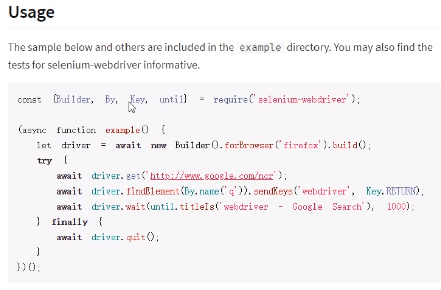

# 网络爬虫开发

# 第1节 课程介绍

## 课程内容

1. 爬虫简介
2. 制作一个自动下载图片的小爬虫
3. 使用Selenium爬取动态网站

## 爬虫

可以把互联网比做成一张“大网”，爬虫就是在这张大网上不断爬取信息的程序。**爬虫是请求网站并提取数据的自动化程序**，原理就是发送请求到指定URL，获取响应后并处理。爬虫的基本工作流程如下：

1. 向指定的URL发送http请求；
2. 获取响应（HTML、XML、JSON、二进制等数据）；
3. 处理数据（解析DOM、解析JSON等）；
4. 将处理好的数据进行存储；


爬虫的意义：爬虫就是一个探测程序，它的基本功能就是模拟人的行为去各个网站转悠，点点按钮，找找数据，或者把看到的信息背回来。每天使用的百度和Google，其实就是利用了这种爬虫技术，每天放出无数爬虫到各个网站，把信息抓回来，存到数据库中来检索。

在现实中几乎所有行业的网站都会被爬虫所 “骚扰”，而这些骚扰都是为了方便用户。当然，有些网站是不能被过分骚扰的，其中排第一的就是出行类行业。12306之所以会出一些变态的验证码，就是因为被爬虫折磨得无可奈何。

正所谓道高一尺魔高一丈，某些爬虫工具，为了解决这种变态验证码，甚至推出了“打码平台”。原理就是爬虫还是不断工作，但只要遇到二维码，就通过打码平台下发任务，打码平台另一边就雇佣一大堆网络闲人，只要看到有验证码来了，就人工选一下验证码，完美的让程序与人工结合。


# 第2节 爬虫基础

## 下载某（静态）网站的所有图片

```js
// spider-demo/teacher_photos.js
// 引入http模块
const http = require('http')
const cheerio = require('cheerio')
const download = require('download')
const HOST = 'http://web.itheima.com/'
// 创建请求对象 (此时未发送http请求)
let req = http.request(HOST + 'teacher.html', res => { // 默认get请求
  // 异步的响应 // console.log(res)
  let chunks = [] // 准备chunks
  // 监听到数据就存储：监听data事件，获取传递过来的数据片段，拼接数据片段
  res.on('data', c => chunks.push(c))
  // 监听end事件,获取数据完毕时触发
  res.on('end', () => {
    // 结束数据监听时将所有内容拼接，拼接所有的chunk，并转换成字符串 ==> html字符串
    // console.log(Buffer.concat(chunks).toString('utf-8')) // 得到的结果就是整个HTML网页内容
    let htmlStr = Buffer.concat(chunks).toString('utf-8')
    let $ = cheerio.load(htmlStr)
    // console.log($('.tea_main .tea_con .li_img > img').length) // 获取对应匹配的所有img标签组成的伪数组的长度
    // console.log($('.tea_main .tea_con .li_img > img').attr('src')) // 这种直接.attr的方式只能获取第一个img标签的src图片地址
    // 写法一：
    // let imgs = []
    // $('.tea_main .tea_con .li_img > img').each((index, item) => { // 注意伪数组不能用forEach，要用'jquery'对应的each
    //   // console.log(HOST + $(item).attr('src'))
    //   imgs.push(HOST + $(item).attr('src'))
    // })
    // 写法二：推荐写法。如果下载的文件地址有中文（文件名），一定要用encodeURI进行base64编码，否则进行下载的时候会报错
    let imgs = Array.prototype.map.call($('.tea_main .tea_con .li_img > img'), item => HOST + encodeURI($(item).attr('src')))
    // 写法三：注意该写法中，.map的回调函数的参数分别是index和item，且imgs返回的是伪数组
    // let imgs = $('.tea_main .tea_con .li_img > img').map((index, item) => HOST + $(item).attr('src'))
    // console.log(imgs, imgs[0])
    // 对所有图片进行下载
    Promise.all(imgs.map(x => download(x, 'dist'))).then(() => { // 下载到dist文件夹下
      console.log('files downloaded!');
    });
  })
})
// 将请求发出去
req.end()
```

需要通过如下步骤实现：

### **①发送http请求，获取整个网页内容**

node官方api：node的核心模块http模块即可发送请求，摘自node官网api：（只需要使用`http.request()`方法即可发送http请求，也可以使用`axios`库来代替）


### **②通过cheerio库对网页内容进行分析**

cheerio库简介：


cheerio库是一个核心api，且按照jquery来设计，专门在服务器上使用，是一个微小、快速和优雅的实现。简而言之，就是可以在服务器上用cheerio库来解析HTML（字符串）代码，并且可以直接使用和jQuery一样的api（可以类比于通过jQuery的api来获取DOM元素中的属性和内容）。官方demo：

```js
const cheerio = require('cheerio')
const $ = cheerio.load('<h2 class="title">Hello world</h2>') // 加载HTML字符串
$('h2.title').text('Hello there!') // 修改内容
$('h2').addClass('welcome') // 添加类名
$.html()
//=> <html><head></head><body><h2 class="title welcome">Hello there!</h2></body></html>
```

### **③提取img标签的src属性**

分析网页中所有img标签所在结构：


### **④使用download库进行批量图片下载**


注意如果下载的文件地址有中文（文件名），则会报错：


## 爬取新闻信息

爬取目标：`http://www.itcast.cn/newsvideo/newslist.html`。但是该网站的新闻信息是通过再次发送请求（请求一个json文件）来动态获取的。

大部分新闻网站，现在都采取前后端分离的方式，也就是前端页面先写好模板，等网页加载完毕后，发送Ajax再获取数据，将其渲染到模板中。所以如果使用跟上一个案例相同方式来获取目标网站（要爬取数据的网站）的HTML页面，请求到的只是模板，并不会有数据。


此时，如果还希望使用当前方法爬取数据，就需要分析该网站的ajax请求是如何发送的，可以打开network面板来调试（分析得出对应的ajax请求后，找到其URL，向其发送请求即可）：


```js
// spider-demo/news_list.js
// 引入http模块
const http = require('http')
// let url = 'http://www.itcast.cn/newsvideo/newslist.html' // 新闻信息是在此网站动态请求的，所以不能直接爬取该网站
let url = 'http://www.itcast.cn/news/json/f1f5ccee-1158-49a6-b7c4-f0bf40d5161a.json'
// 创建请求对象
let req = http.request(url, {
  method: 'post', headers: { // 如果遇到请求限制，还可以模拟真实浏览器的请求头（请求头的内容，可以先通过真正的浏览器访问一次后获取）
    "Host": "www.itcast.cn",
    "Connection": "keep-alive",
    "Content-Length": "0",
    "Accept": "*/*",
    "Origin": "http://www.itcast.cn",
    "X-Requested-With": "XMLHttpRequest",
    "User-Agent": "Mozilla/5.0 (Windows NT 10.0; Win64; x64) AppleWebKit/537.36 (KHTML, like Gecko) Chrome/75.0.3770.100 Safari/537.36",
    "DNT": "1",
    "Referer": "http://www.itcast.cn/newsvideo/newslist.html",
    "Accept-Encoding": "gzip, deflate",
    "Accept-Language": "zh-CN,zh;q=0.9,en;q=0.8",
    "Cookie": "UM_distinctid=16b8a0c1ea534c-0c311b256ffee7-e343166-240000-16b8a0c1ea689c; bad_idb2f10070-624e-11e8-917f-9fb8db4dc43c=8e1dcca1-9692-11e9-97fb-e5908bcaecf8; parent_qimo_sid_b2f10070-624e-11e8-917f-9fb8db4dc43c=921b3900-9692-11e9-9a47-855e632e21e7; CNZZDATA1277769855=1043056636-1562825067-null%7C1562825067; cid_litiancheng_itcast.cn=TUd3emFUWjBNV2syWVRCdU5XTTRhREZs; PHPSESSID=j3ppafq1dgh2jfg6roc8eeljg2; CNZZDATA4617777=cnzz_eid%3D926291424-1561388898-http%253A%252F%252Fmail.itcast.cn%252F%26ntime%3D1563262791; Hm_lvt_0cb375a2e834821b74efffa6c71ee607=1561389179,1563266246; qimo_seosource_22bdcd10-6250-11e8-917f-9fb8db4dc43c=%E7%AB%99%E5%86%85; qimo_seokeywords_22bdcd10-6250-11e8-917f-9fb8db4dc43c=; href=http%3A%2F%2Fwww.itcast.cn%2F; bad_id22bdcd10-6250-11e8-917f-9fb8db4dc43c=f2f41b71-a7a4-11e9-93cc-9b702389a8cb; nice_id22bdcd10-6250-11e8-917f-9fb8db4dc43c=f2f41b72-a7a4-11e9-93cc-9b702389a8cb; openChat22bdcd10-6250-11e8-917f-9fb8db4dc43c=true; parent_qimo_sid_22bdcd10-6250-11e8-917f-9fb8db4dc43c=fc61e520-a7a4-11e9-94a8-01dabdc2ed41; qimo_seosource_b2f10070-624e-11e8-917f-9fb8db4dc43c=%E7%AB%99%E5%86%85; qimo_seokeywords_b2f10070-624e-11e8-917f-9fb8db4dc43c=; accessId=b2f10070-624e-11e8-917f-9fb8db4dc43c; pageViewNum=2; nice_idb2f10070-624e-11e8-917f-9fb8db4dc43c=20d2a1d1-a7a8-11e9-bc20-e71d1b8e4bb6; openChatb2f10070-624e-11e8-917f-9fb8db4dc43c=true; Hm_lpvt_0cb375a2e834821b74efffa6c71ee607=1563267937"
  }
}, res => {
  let chunks = []
  res.on('data', chunk => chunks.push(chunk))
  res.on('end', () => {
    let result = Buffer.concat(chunks).toString('utf-8')
    console.log(JSON.parse(result).data)
  })
})
// 发送请求
req.end()
```

## 封装爬虫基础库

以上两个例子的代码重复的地方非常多，可以考虑用面向对象的思想进行封装，进一步的提高代码复用率，为了方便开发，保证代码规范，建议使用TypeScript进行封装。


先安装typescript：`npm i typescript -g`，再执行`tsc --init`初始化项目，生成ts配置文件（tsconfig.json）。TS配置：

```json
{
  "compilerOptions": {
    /* Basic Options */
    "target": "es2015", 
    "module": "commonjs", 
    "outDir": "./bin", 
    "rootDir": "./src", 
    "strict": true,
    "esModuleInterop": true 
  },
  "include": [
    "src/**/*"
  ],
  "exclude": [
    "node_modules",
    "**/*.spec.ts"
  ]
}
```

如果是vscode编辑器，则可使用`ctrl+shift+b`，点击`tsc build - tsconfig.json`后执行构建任务（在对应的bin目录下会生成对应的文件）：


SpiderOptions接口：

```ts
// src/interfaces/SpiderOptions.ts
export default interface SpiderOptions {
  url: string,
  method?: string,
  headers?: object
}
```

Spider抽象类：

```ts
// src/interfaces/Spider.ts
// 目标: 希望将来写爬虫的时候, 来一个类继承祖宗类；然后, 在子类中处理得到的结果即可。// 爬虫用法: 创建爬虫对象, 传入URL自动开爬。
const http = require('http')
import SpiderOptions from './interfaces/SpiderOptions'
export default abstract class Spider {
  // 定义成员
  options: SpiderOptions
  // 使用接口定义options的成员
  constructor(options: SpiderOptions = { url: '', method: 'get' }) {
    // 初始化
    this.options = options
    this.start()
  }
  start() {
    let req = http.request(this.options.url, { // 创建请求对象
      headers: this.options.headers,
      method: this.options.method
    }, (res: any) => {
      let chunks: any[] = []
      res.on('data', (c: any) => chunks.push(c))
      res.on('end', () => {
        let result = Buffer.concat(chunks).toString('utf-8')
        // console.log(result)
        // 抽象方法调用：Spider不知道子子孙孙干的事儿，这里只管调用一下抽象方法，而具体的实现由子子孙孙继承时实现即可。
        this.onCatchHTML(result) // 不同的爬虫需要处理不同的方法
      })
    })
    req.end() // 发送请求
  }
  abstract onCatchHTML(result: string): any // 定义一个抽象方法（没有具体的、不表示任何意义的、空壳方法）
}
```

TeacherPhotos类：

```ts
// src/TeacherPhotos.ts
// 封装完毕后,如果需要做爬虫,只需要以下几步：
// 1. 写一个爬虫类, 继承Spider
// 2. 实现onCatchHTML方法(爬虫获取资源后需要做的事情)
// 3. 使用: 创建该爬虫对象,传入URL即可
import Spider from './Spider'
const cheerio = require('cheerio')
const download = require('download')
export default class TeacherPhotos extends Spider {
  onCatchHTML(result: string) {
    // console.log(result)
    // 获取到html之后的操作，由子类具体实现 // 根据html的img标签src属性来下载图片
    let $ = cheerio.load(result)
    let imgs = Array.prototype.map.call($('.tea_main .tea_con .li_img > img'), (item: any) => 'http://web.itheima.com/' + encodeURI($(item).attr('src')))
    Promise.all(imgs.map(x => download(x, 'dist'))).then(() => {
      console.log('files downloaded!');
    });
  }
}
```

NewsListSpider类：

```ts
// src/NewsList.ts
import Spider from "./Spider";
export default class NewsList extends Spider {
  onCatchHTML(result: string) {
    console.log(JSON.parse(result))
  }
}
```

测试类：

```ts
// src/test.ts
import Spider from './Spider'
import TeacherPhotos from './TeacherPhotos'
import NewsListSpider from './NewsListSpider'

// 写法一：
let spider1: Spider = new TeacherPhotos({ // 多态，用父类对象去接收子类的实现
  url: 'http://web.itheima.com/teacher.html'
})
let spider2: Spider = new NewsListSpider({
  url: 'http://www.itcast.cn/news/json/f1f5ccee-1158-49a6-b7c4-f0bf40d5161a.json',
  method: 'post',
  headers: {
    "Host": "www.itcast.cn",
    "Connection": "keep-alive",
    "Content-Length": "0",
    "Accept": "*/*",
    "Origin": "http://www.itcast.cn",
    "X-Requested-With": "XMLHttpRequest",
    "User-Agent": "Mozilla/5.0 (Windows NT 10.0; Win64; x64) AppleWebKit/537.36 (KHTML, like Gecko) Chrome/75.0.3770.100 Safari/537.36",
    "DNT": "1",
    "Referer": "http://www.itcast.cn/newsvideo/newslist.html",
    "Accept-Encoding": "gzip, deflate",
    "Accept-Language": "zh-CN,zh;q=0.9,en;q=0.8",
    "Cookie": "UM_distinctid=16b8a0c1ea534c-0c311b256ffee7-e343166-240000-16b8a0c1ea689c; bad_idb2f10070-624e-11e8-917f-9fb8db4dc43c=8e1dcca1-9692-11e9-97fb-e5908bcaecf8; parent_qimo_sid_b2f10070-624e-11e8-917f-9fb8db4dc43c=921b3900-9692-11e9-9a47-855e632e21e7; CNZZDATA1277769855=1043056636-1562825067-null%7C1562825067; cid_litiancheng_itcast.cn=TUd3emFUWjBNV2syWVRCdU5XTTRhREZs; PHPSESSID=j3ppafq1dgh2jfg6roc8eeljg2; CNZZDATA4617777=cnzz_eid%3D926291424-1561388898-http%253A%252F%252Fmail.itcast.cn%252F%26ntime%3D1563262791; Hm_lvt_0cb375a2e834821b74efffa6c71ee607=1561389179,1563266246; qimo_seosource_22bdcd10-6250-11e8-917f-9fb8db4dc43c=%E7%AB%99%E5%86%85; qimo_seokeywords_22bdcd10-6250-11e8-917f-9fb8db4dc43c=; href=http%3A%2F%2Fwww.itcast.cn%2F; bad_id22bdcd10-6250-11e8-917f-9fb8db4dc43c=f2f41b71-a7a4-11e9-93cc-9b702389a8cb; nice_id22bdcd10-6250-11e8-917f-9fb8db4dc43c=f2f41b72-a7a4-11e9-93cc-9b702389a8cb; openChat22bdcd10-6250-11e8-917f-9fb8db4dc43c=true; parent_qimo_sid_22bdcd10-6250-11e8-917f-9fb8db4dc43c=fc61e520-a7a4-11e9-94a8-01dabdc2ed41; qimo_seosource_b2f10070-624e-11e8-917f-9fb8db4dc43c=%E7%AB%99%E5%86%85; qimo_seokeywords_b2f10070-624e-11e8-917f-9fb8db4dc43c=; accessId=b2f10070-624e-11e8-917f-9fb8db4dc43c; pageViewNum=2; nice_idb2f10070-624e-11e8-917f-9fb8db4dc43c=20d2a1d1-a7a8-11e9-bc20-e71d1b8e4bb6; openChatb2f10070-624e-11e8-917f-9fb8db4dc43c=true; Hm_lpvt_0cb375a2e834821b74efffa6c71ee607=1563267937"
  }
})

// 写法二：
// import TeacherPhotos from './TeacherPhotos'
// new TeacherPhotos({
//   url: 'http://web.itheima.com/teacher.html'
// })
```

封装后，如果需要写新的爬虫，则可以（在子类中）直接继承Spider类后，再在测试类中进行测试即可。仅需实现具体的爬虫类的onCatchHTML方法，测试时传入url和headers即可。而且全部爬虫的父类均为Spider，后期管理起来也非常方便。

# 第3节 爬虫高级

## Selenium简介


官方原文介绍：

> *Selenium automates browsers*. That's it! What you do with that power is entirely up to you. Primarily, it is for automating web applications for testing purposes, but is certainly not limited to just that. Boring web-based administration tasks can (and should!) be automated as well.
>
> Selenium has the support of some of the largest browser vendors who have taken (or are taking) steps to make Selenium a native part of their browser. It is also the core technology in countless other browser automation tools, APIs and frameworks.

百度百科介绍：

> Selenium 是一个用于Web应用程序测试的工具。Selenium测试直接运行在浏览器中，就像真正的用户在操作一样。支持的浏览器包括IE（7, 8, 9, 10, 11），[Mozilla Firefox](https://baike.baidu.com/item/Mozilla Firefox/3504923)，Safari，Google Chrome，Opera等。这个工具的主要功能包括：测试与浏览器的兼容性——测试你的应用程序看是否能够很好的工作在不同浏览器和操作系统之上。测试系统功能——创建回归测试检验软件功能和用户需求。支持自动录制动作和自动生成 .Net、Java、Perl等不同语言的测试脚本。

Selenium是一个Web应用的自动化测试框架（这个框架有各种语音的实现版本的），可以创建回归测试来检验软件功能和用户需求，通过框架可以编写代码来启动浏览器进行自动化测试。换言之，用于做爬虫就可以使用代码启动浏览器，让真正的浏览器去打开网页，然后去网页中获取想要的信息（使用Selenium库爬取前端渲染的网页），从而实现真正意义上无惧反爬虫手段（反反爬虫技术）。

## Selenium的基本使用

1. 根据平台（如使用Chrome浏览器和Node）下载需要的webdriver：（下载后要把`chromedriver.exe`文件放入项目根目录下面。）

   

   

   

   | 浏览器            | webdriver                                                    |
   | :---------------- | :----------------------------------------------------------- |
   | Chrome            | [chromedriver(.exe)](http://chromedriver.storage.googleapis.com/index.html) |
   | Internet Explorer | [IEDriverServer.exe](http://selenium-release.storage.googleapis.com/index.html) |
   | Edge              | [MicrosoftWebDriver.msi](http://go.microsoft.com/fwlink/?LinkId=619687) |
   | Firefox           | [geckodriver(.exe)](https://github.com/mozilla/geckodriver/releases/) |
   | Safari            | [safaridriver](https://developer.apple.com/library/prerelease/content/releasenotes/General/WhatsNewInSafari/Articles/Safari_10_0.html#//apple_ref/doc/uid/TP40014305-CH11-DontLinkElementID_28) |

   

2. 项目中安装selenium-webdriver包：`npm i selenium-webdriver`

3. 根据官方文档写一个小demo：自动打开百度搜索“黑马程序员“

   ```js
   const { Builder, By, Key, until } = require('selenium-webdriver');
   (async function example() {
     let driver = await new Builder().forBrowser('chrome').build();
     try {
       // 自动打开百度,并搜索黑马程序员
       await driver.get('https://www.baidu.com');
       // 找到元素, 向里面发送一个关键字并按回车
       await driver.findElement(By.id('kw')).sendKeys('黑马程序员', Key.RETURN);
       // 验证是否搜索成功
       await driver.wait(until.titleIs('黑马程序员_百度搜索'), 1000);
       console.log(await driver.wait(until.titleIs('黑马程序员_百度搜索'), 1000))
     } finally {
       // 退出
       // await driver.quit();
     }
   })();
   ```


## 使用Selenium实现爬虫

### 为什么要用Selenium

目前的大流量网站，都会有些对应的反爬虫机制。例如在拉勾网上搜索传智播客：


找到对应的ajax请求地址，使用postman来测试数据：


即使加上请求头的信息，虽然前几次可能会获取到数据，但多试几次则会出现“操作频繁请稍后再试”的问题（此时需要重新更换下请求头信息）。而通过Selenium可以操作浏览器，打开某个网址，接下来只需要学习其API，就能获取网页中需要的内容了。

反爬虫技术只是针对爬虫的，例如通过**检查请求头是否存在且是否像爬虫**、**检查IP地址的请求频率**（如果过高则封杀）等手段来反爬虫。而Selenium打开的就是一个自动化测试的浏览器，和用户正常使用的浏览器并无差别，所以再厉害的反爬虫技术，也无法直接把它干掉，除非这个网站连普通用户都想放弃掉（12306曾经迫于无奈这样做过）。

### Selenium API学习

核心对象：①Builder；②WebDriver；③WebElement。辅助对象：①By；②Key。

#### Builder

用于构建WebDriver对象的构造器（在`require('selenium-webdriver')`中引入的Builder对象或直接webdriver.Builder）

```js
const webdriver = require('selenium-webdriver');
......
let driver = new webdriver.Builder()
    .forBrowser('chrome')
    .build(); // 返回一个WebDriver对象实例
```

其它API如下：可以获取或设置一些Options：


如果需要设置Chrome的Options，需要先导入Options：（如下方的头信息设置了cookie和user-agent）

```js
const { Options } = require('selenium-webdriver/chrome');
const options = new Options()
options.addArguments('Cookie=user_trace_token=20191130095945-889e634a-a79b-4b61-9ced-996eca44b107; X_HTTP_TOKEN=7470c50044327b9a2af2946eaad67653; _ga=GA1.2.2111156102.1543543186; _gid=GA1.2.1593040181.1543543186; LGUID=20181130095946-9c90e147-f443-11e8-87e4-525400f775ce; sajssdk_2015_cross_new_user=1; JSESSIONID=ABAAABAAAGGABCB5E0E82B87052ECD8CED0421F1D36020D; index_location_city=%E5%85%A8%E5%9B%BD; Hm_lvt_4233e74dff0ae5bd0a3d81c6ccf756e6=1543543186,1543545866; LGSID=20181130104426-da2fc57f-f449-11e8-87ea-525400f775ce; PRE_UTM=; PRE_HOST=www.cnblogs.com; PRE_SITE=https%3A%2F%2Fwww.cnblogs.com%2F; PRE_LAND=https%3A%2F%2Fwww.lagou.com%2Fjobs%2Flist_%25E5%2589%258D%25E7%25AB%25AF%25E5%25BC%2580%25E5%258F%2591%3Fkd%3D%25E5%2589%258D%25E7%25AB%25AF%25E5%25BC%2580%25E5%258F%2591%26spc%3D1%26pl%3D%26gj%3D%26xl%3D%26yx%3D%26gx%3D%26st%3D%26labelWords%3Dlabel%26lc%3D%26workAddress%3D%26city%3D%25E5%2585%25A8%25E5%259B%25BD%26requestId%3D%26pn%3D1; sensorsdata2015jssdkcross=%7B%22distinct_id%22%3A%221676257e1bd8cc-060451fc44d124-9393265-2359296-1676257e1be898%22%2C%22%24device_id%22%3A%221676257e1bd8cc-060451fc44d124-9393265-2359296-1676257e1be898%22%2C%22props%22%3A%7B%22%24latest_traffic_source_type%22%3A%22%E7%9B%B4%E6%8E%A5%E6%B5%81%E9%87%8F%22%2C%22%24latest_referrer%22%3A%22%22%2C%22%24latest_referrer_host%22%3A%22%22%2C%22%24latest_search_keyword%22%3A%22%E6%9C%AA%E5%8F%96%E5%88%B0%E5%80%BC_%E7%9B%B4%E6%8E%A5%E6%89%93%E5%BC%80%22%7D%7D; ab_test_random_num=0; _putrc=30FD5A7177A00E45123F89F2B170EADC; login=true; unick=%E5%A4%A9%E6%88%90; hasDeliver=0; gate_login_token=3e9da07186150513b28b29e8e74f485b86439e1fd26fc4939d32ed2660e8421a; _gat=1; SEARCH_ID=334cf2a080f44f2fb42841f473719162; LGRID=20181130110855-45ea2d22-f44d-11e8-87ee-525400f775ce; Hm_lpvt_4233e74dff0ae5bd0a3d81c6ccf756e6=1543547335; TG-TRACK-CODE=search_code')
    .addArguments('user-agent="Mozilla/5.0 (iPod; U; CPU iPhone OS 2_1 like Mac OS X; ja-jp) AppleWebKit/525.18.1 (KHTML, like Gecko) Version/3.1.1 Mobile/5F137 Safari/525.20')
```

#### WebDriver

通过构造器创建好WebDriver（`new webdriver.Builder().forBrowser('chrome').build()`，可以理解为浏览器本身）后就可以使用API查找网页元素和获取信息了：（如通过findElement()可用于查找元素）


#### WebElement

网页元素：（如`new webdriver.Builder().forBrowser('chrome').build().findElement(By.id('kw'))`返回的对象）常见API：getText()  获取文本内容；sendKeys()  发送一些按键指令；click()  点击该元素。


### 自动打开拉勾网搜索"前端"

1. 使用driver打开拉勾网主页

2. 找到全国站并点击一下
3. 输入“前端”并回车


#### 获取需要的数据

使用driver.findElements(...)找到所有条目项（每一条内容组成的数组），根据需求分析页面元素，获取其文本内容即可。

#### 自动翻页

思路如下：

1. 定义初始页码
2. 获取数据后，获取页面上的总页码，定义最大页码
3. 开始获取数据时打印当前正在获取的页码数
4. 获取完一页数据后，当前页码自增，然后判断是否达到最大页码
5. 查找下一页按钮并调用点击api，进行自动翻页
6. 翻页后递归调用获取数据的函数

```js
// selenium-demo/lagou.js
const { Builder, By, Key, until } = require('selenium-webdriver');
let currentPage = 1
let maxPage;
let driver = new Builder().forBrowser('chrome').build(); // 注意这里不能直接await，则可以在此省略（返回一个promise？）
(async function start() {
  await driver.get('https://www.lagou.com');
  await driver.findElement(By.css('#changeCityBox ul.clearfix > li:nth-of-type(8)')).click()
  await driver.findElement(By.id('search_input')).sendKeys('前端', Key.RETURN);
  maxPage = await driver.findElement(By.className('totalNum')).getText() // 在开始爬数据之前获取总页数
  getData()
})();
async function getData() {
  console.log(`-------当前正在获取第${currentPage}页的数据,共${maxPage}页数据-------`)
  while (true) { // 循环操作，直到获取到页面元素和数据，并正确执行代码之后才退出循环
    let notError = true
    try {
      // 以下就是获取数据的代码
      // 获取所有的li
      let items = await driver.findElements(By.css('.item_con_list .con_list_item'))
      // 迭代数组, 获取我们所需要的数据
      let results = []
      for (let i = 0; i < items.length; i++) {
        let item = items[i]
        // console.log(await item.getText())
        let title = await item.findElement(By.css('.position h3')).getText() // 获取岗位名称
        let address = await item.findElement(By.css('.position .add em')).getText()
        let time = await item.findElement(By.css('.position .format-time')).getText()
        let jdLink = await item.findElement(By.css('.position .position_link')).getAttribute('href')
        let money = await item.findElement(By.css('.position .money')).getText() // 获取薪资待遇
        let background = await item.findElement(By.css('.position .li_b_l')).getText() // 获取需求背景（此时包含多余内容）
        background = background.replace(money, '') // 小技巧
        let companyName = await item.findElement(By.css('.company .company_name')).getText() // 获取公司名称
        let companyLink = await item.findElement(By.css('.company .company_name a')).getAttribute('href')
        let industry = await item.findElement(By.css('.company .industry')).getText()
        let tag = await item.findElement(By.css('.list_item_bot .li_b_l')).getText()
        let welfare = await item.findElement(By.css('.list_item_bot .li_b_r')).getText()
        results.push({
          title,
          address,
          time,
          jdLink,
          money,
          background,
          companyName,
          companyLink,
          industry,
          tag,
          welfare
        })
      }
      console.log(results) // 爬取到了一页数据
      currentPage++;
      if (currentPage <= maxPage) {
        await driver.findElement(By.className('pager_next')).click() // 找到下一页按钮并点击
        getData() // 递归获取数据
      }
    } catch (e) {
      // console.log(e.message)
      if (e) notError = false // 如果获取不到页面元素，则设置为false，即将再次进行循环
    } finally {
      if (notError) break
    }
  }
}
```

# 第4节 课程总结

爬虫用途非常广泛，主要的目标是为了实现自动化程序，解放程序员的双手，帮助程序员自动获取一些数据，测试一些软件，甚至自动操作浏览器做很多事情。

但也不乏有些不法分子拿爬虫做一些违法的事情，希望爬虫使用在正道上，获取一些我们需要的数据来进行分析。同时，在爬取目标网站之前，建议大家浏览该网站的robots.txt，来确保爬取的数据在对方允许范围之内。

