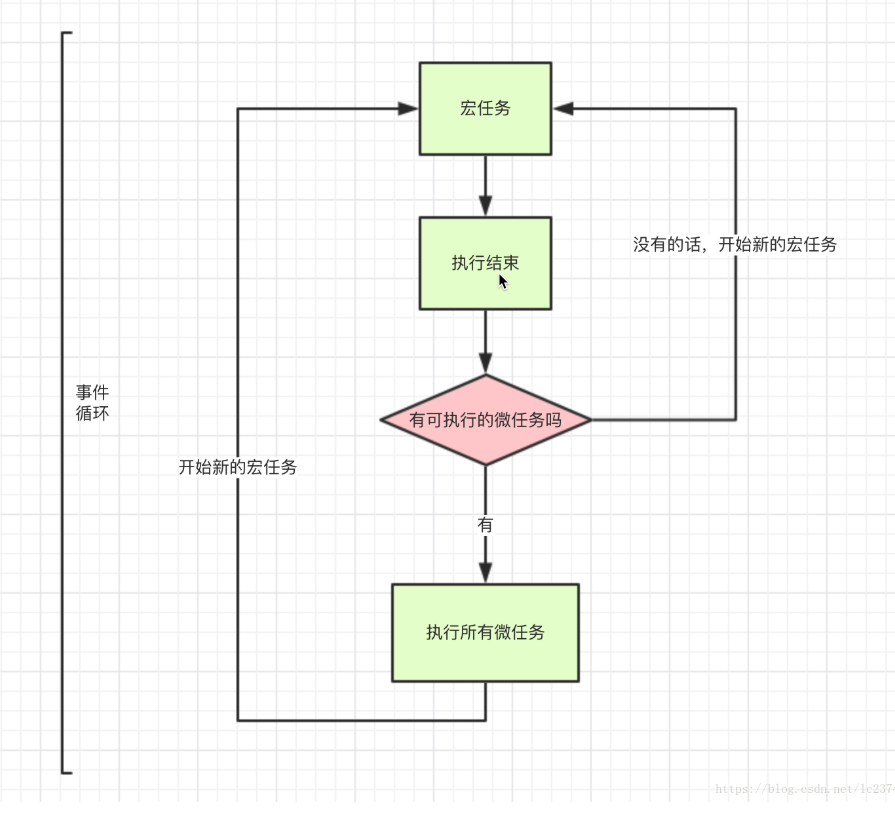

# nodejs事件循环与多进程

## 第一节 事件循环介绍
### 在浏览器中

为了协调事件（event，即PostMessage、MutationObserver等）、用户交互（user interaction，即click、onScroll等）、渲染（rendering，即解析dom、css等）、脚本（script，即js脚本执行）、网络（networking）等，用户代理（user agent）必须使用事件循环（event loops），否则会带来很复杂的同步问题。

### 在nodejs中
事件循环允许Node.js执行非阻塞I / O操作（网络请求、文件读写等）。尽管JavaScript是单线程的，但可以通过尽可能将操作卸载到系统内核。由于大多数现代内核都是多线程的，因此它们可以处理在后台执行的多个操作，当其中一个操作完成时，内核会告诉Node.js，以便可以将相应的回调添加到轮询队列中以最终执行。

### 事件循环的本质
在浏览器或者nodejs环境中，运行时对js脚本的调度方式就叫做事件循环。

``` js
setTimeout(() => {
  console.log('setTimeout')
}, 0);
Promise.resolve().then(() => {
  console.log('promise');
});
console.log('main');
// 1. main 2. promise 3. setTimeout
```

## 第二节 浏览器事件循环

单线程就意味着所有任务需要排队，如果因为任务cpu计算量大还好，但是I/O操作cpu是闲着的。所以js就设计成了一门异步的语言，不会做无畏的等待。任务可以分成两种，一种是同步任务（synchronous），另一种是异步任务（asynchronous）。

> （1）所有同步任务都在主线程上执行，形成一个执行栈（execution context stack）。
>
> （2）主线程之外，还存在一个"任务队列"（task queue）。只要异步任务（进程）有了运行结果，就在"任务队列"之中放置一个事件。
>
> （3）一旦"执行栈"中的所有同步任务执行完毕，系统就会读取"任务队列"，看看里面有哪些事件。如果任务队列里有对应的异步任务，就会结束等待状态，进入执行栈，开始执行。
>
> （4）主线程不断重复上面的第三步。

主线程从"任务队列"中读取事件，这个过程是循环不断的，所以整个的这种运行机制又称为Event Loop（事件循环）。

**宏任务与微任务：**

除了广义的同步任务和异步任务，JavaScript 单线程中的任务可以细分为宏任务（macrotask）和微任务(microtask)。

- 宏任务（macrotask）：script(整体代码), setTimeout, setInterval, setImmediate, I/O, UI rendering。

- 微任务（microtask）：process.nextTick, Promise, Object.observe, MutationObserver。

> 1. 宏任务进入主线程（这里指的是异步处理进程？），执行过程中会收集微任务加入微任务队列。
> 2. 宏任务执行完成之后，立马执行微任务中的任务。微任务执行过程中将再次收集宏任务，并加入宏任务队列。
> 3. 反复执行1，2步骤



#### 高频面试题

```js
setTimeout(() => {
  console.log('setTimeout');
}, 0);
Promise.resolve().then(() => {
  console.log('promise');
  Promise.resolve().then(() => {
    console.log('promise2');
  });
});
console.log('main');

// 1. main 2. promise 3. promise2 4. setTimeout
```
>  可以理解为promise相关的.then任务会立即进入任务队列，而不是进入异步进程处理。每轮事件循环执行一个宏任务和所有的微任务。

```js
setTimeout(() => {
  Promise.resolve().then(() => {
    console.log('promise');
  });
}, 0);
Promise.resolve().then(() => {
  setTimeout(() => {
  	console.log('setTimeout');
  }, 0);
});
console.log('main');

// 1. main 2. promise 3. setTimeout
```

## 第三节 nodejs事件循环

**当Node.js启动时，会初始化event loop，每一个event loop（一轮事件循环）都会包含按如下六个循环阶段（每个方框被称作事件循环的一个”阶段(phase)”），nodejs事件循环和浏览器的事件循环完全不一样。**

> *When Node.js starts, it initializes the event loop, processes the provided input script (or drops into the REPL, which is not covered in this document) which may make async API calls, schedule timers, or call process.nextTick(), then begins processing the event loop.*


###  各个阶段介绍

- **timers(定时器)** : 此阶段执行那些由 `setTimeout()` 和 `setInterval()` 调度的回调函数。

- **I/O callbacks(I/O回调)** : 此阶段会执行几乎所有的（能执行的）回调函数, 除了 **close callbacks(关闭回调)** 和 那些由 **timers** 与 `setImmediate()`调度的回调。（setImmediate 约等于 setTimeout(cb,0)）

- idle(空转), prepare : 此阶段只在内部使用。

- **poll(轮询)** : 检索新的I/O事件，在恰当的时候Node会阻塞在这个阶段。

- check(检查) : `setImmediate()` 设置的回调会在此阶段被调用。

- close callbacks(关闭事件的回调): 诸如 `socket.on('close', ...)` 此类的回调在此阶段被调用。

在事件循环的每次运行之间（中间时段），Node.js会检查它是否在等待异步I/O或定时器，如果没有的话就会自动关闭。

> 如果event loop进入了 poll阶段，且代码未设定timer，将会发生下面情况：
>
> - 如果poll queue不为空，event loop将同步的执行queue里的（能执行的）callback，直至queue为空，或执行的callback到达系统上限；
> - 如果poll queue为空，将会发生下面情况：
>   - 如果代码已经被setImmediate()设定了callback, event loop将结束poll阶段进入check阶段，并执行check阶段的queue (check阶段的queue是 setImmediate设定的)
>   - 如果代码没有设定setImmediate(callback)，event loop将阻塞在该阶段，等待callbacks加入poll queue，一旦到达就立即执行
>
> 如果event loop进入了 poll阶段，且代码设定了timer：
>
> - 如果poll queue进入空状态时（即poll 阶段为空闲状态），event loop将检查timers，如果有1个或多个timers时间时间已经到达，event loop将按循环顺序进入 timers 阶段，并执行timer queue。

### 代码执行1

`path.resolve()` 方法会把一个路径或路径片段的序列解析为一个绝对路径。

`fs.readFile` 异步地读取文件的全部内容。

`__dirname` 总是指向被执行文件夹的绝对路径。

```js
// demo1.js
var fs = require('fs');
var path = require('path');
function someAsyncOperation (callback) {
  // 花费2毫秒，小于下面定时器的10毫秒，所以callback回调先执行
  fs.readFile(path.resolve(__dirname, '/read.txt'), callback);
}
var timeoutScheduled = Date.now();
var fileReadTime = 0;
setTimeout(function () {
  var delay = Date.now() - timeoutScheduled;
  console.log('setTimeout: ' + (delay) + "ms have passed since I was scheduled"); //22
  console.log('fileReaderTime',fileReadtime - timeoutScheduled); //2
}, 10);
someAsyncOperation(function () {
  fileReadtime = Date.now();
  while(Date.now() - fileReadtime < 20) { // 20+2=22
	// 。。。。。。读取完文件，并且现在时间离读完文件时间小于20时，要做的事情（或者一直卡在这里）。
  }
});
```

### 代码执行2

```js
// demo2.js
var fs = require('fs');

function someAsyncOperation (callback) {
  var time = Date.now();
  // 花费9毫秒
  fs.readFile('/path/to/xxxx.pdf', callback);
}
var timeoutScheduled = Date.now();
var fileReadTime = 0;
var delay = 0;
setTimeout(function () {
  delay = Date.now() - timeoutScheduled;
}, 5);
someAsyncOperation(function () {
  fileReadtime = Date.now();
  while(Date.now() - fileReadtime < 20) { // 20+9=29
	// 。。。。。。读取完文件，并且现在时间离读完文件时间小于20时，要做的事情（或者一直卡在这里）。
  }
  console.log('setTimeout: ' + (delay) + "ms have passed since I was scheduled"); //5
  console.log('fileReaderTime',fileReadtime - timeoutScheduled); //9
});
```

### 代码执行3

> 在nodejs中，setTimeout(demo, 0) === setTimeout(demo, 1)。在浏览器中，setTimeout(demo, 0) === setTimeout(demo, 4)。
>

```js
// setImmedate1.js
setImmediate(function immediate () {
  console.log('immediate');
});
setTimeout(function timeout () {
  console.log('timeout');
},0);
// setImmediate它有时候是setTimeout之前执行，有时候又是setTimeout之后执行？
// 因为event loop的启动也是需要时间的，可能（初次）执行到poll阶段已经超过了1ms，此时setTimeout会先执行。反之setImmediate先执行。
// （初次）执行到poll阶段时，任务队列既有timer，又有setImmediate，只不过要看看这个timer时间（event loop刚刚启动完成）到没到。
```

```js
// setImmedate2.js
var path = require('path');
var fs = require('fs');
fs.readFile(path.resolve(__dirname, '/read.txt'), () => {
    // 因为执行到这里（也就是在readFile的时候event loop已经启动过了），所以后面的event loop已经不需要启动时间了。
    setImmediate(() => {
        console.log('setImmediate');
    })
    setTimeout(() => {
        console.log('setTimeout')
    }, 0)
// （再次）执行到poll阶段时，任务队列既有timer，又有setImmediate，而这个timer时间（event loop上一次就启动完成了）还需要1ms才可以。
});
```

### process.nextTick

**process.nextTick()不在event loop的任何阶段执行，而是在各个阶段切换的中间执行**,即从一个阶段切换到下个阶段前执行。

```js
// nexttick2.js
var fs = require('fs');
fs.readFile(__filename, () => {
  setTimeout(() => {
    console.log('setTimeout');
  }, 0);
  setImmediate(() => {
    console.log('setImmediate');
    process.nextTick(()=>{
      console.log('nextTick3');
    })
  });
  process.nextTick(()=>{
    console.log('nextTick1');
  })
  process.nextTick(()=>{
    console.log('nextTick2');
  })
});
// nextTick1 nextTick2 setImmediate nextTick3 setTimeout
```

#### 设计原因

允许开发者通过调用 `process.nextTick()` 来阻塞I/O操作。

#### nextTick应用场景

1. 在多个事件里交叉执行CPU运算密集型的任务：

```js
var http = require('http');
function compute() {
    // do somethings
    process.nextTick(compute);
}
http.createServer(function(req, res) {  // 服务http请求的时候，还能抽空进行一些计算任务
     res.writeHead(200, {'Content-Type': 'text/plain'});
     res.end('Hello World');
}).listen(5000, '127.0.0.1');
compute();
```

> 在这种模式下，我们不需要递归的调用compute()，我们只需要在事件循环中使用process.nextTick()定义compute()在下一个时间点执行即可。在这个过程中，如果有新的http请求进来，事件循环机制会先处理新的请求，然后再调用compute()。反之，如果你把compute()放在一个递归调用里，那系统就会一直阻塞在compute()里，那就无法处理新的http请求了。

2. （让原先同步执行的）回调函数保持异步执行的原则

当给一个函数定义一个回调函数时，你要确保这个回调是被异步执行的。例子：

```js
//例子1
var client = net.connect(8124, function() { 
    console.log('client connected');
    client.write('world!\r\n');
});
// 在上面的代码里，如果因为某种原因，net.connect()变成同步执行的了，回调函数就会被立刻执行，因此回调函数写到客户端的变量就永远不会被初始化了。
```

``` js
//例子2
function asyncFake(data, callback) {
    // 以下两行代码会导致该回调函数一直（同步）执行
    if(data === 'foo') callback(true);
    else callback(false);
    // 为了保证异步执行，这里用process.nextTick
    //process.nextTick(function() {
    //	if(data === 'foo') callback(true);
    //	else callback(false);
    //});
}
asyncFake('bar', function(result) {
    // this callback is actually called synchronously!
});
```
```js
// 对于上面这种情况下我们就可以使用process.nextTick()把上面asyncFake()改成异步执行的：
function asyncReal(data, callback) {
    process.nextTick(function() {
        callback(data === 'foo');       
    });
}
```

3. 用在事件触发过程中


```js
// EventEmitter有2个比较核心的方法， on和emit。node自带发布/订阅模式。
var EventEmitter = require('events').EventEmitter;
function StreamLibrary(resourceName) { 
    this.emit('start');
}
StreamLibrary.prototype.__proto__ = EventEmitter.prototype;   // inherit from EventEmitter
var stream = new StreamLibrary('fooResource'); // 这里会触发emit('start')，但此时还没有相应的回调
stream.on('start', function() {
    console.log('Reading has started');
});
```

```js
// 应该修改StreamLibrary函数为如下
function StreamLibrary(resourceName) {      
    var self = this;
    process.nextTick(function() {
        self.emit('start');
    });  // 保证发布永远在订阅之后
    // read from the file, and for every chunk read, do:        
}
```

## 第四节 nodejs多进程

### nodejs调试方法

https://code.visualstudio.com/Docs/editor/debugging（vscode自带的debug调试工具）。再在`vscode打开的项目根目录的 .vscode文件夹下面配置launch.json`，下面program节点的http_cluster.js表示对该文件进行调试。

```json
{
    // 使用 IntelliSense 了解相关属性。 
    // 悬停以查看现有属性的描述。
    // 欲了解更多信息，请访问: https://go.microsoft.com/fwlink/?linkid=830387
    "version": "0.2.0",
    "configurations": [
        {
            "type": "node",
            "request": "launch",
            "name": "Launch Program",
            "program": "${workspaceFolder}/chapter4/http_cluster.js"
        }
    ]
}
```


### 多进程和多线程介绍

进程是资源分配的最小单位，线程是CPU调度的最小单位（程序执行的最小单位）。**线程是进程的一个执行流**，是CPU调度和分派的基本单位，它是比进程更小的能独立运行的基本单位。**一个进程由几个线程组成**，线程与同属一个进程的其他的线程共享进程所拥有的全部资源（一个进程下面的线程是可以去通信的，共享资源）。

**进程有独立的地址空间**，一个进程崩溃后，在保护模式下不会对其它进程产生影响，而线程只是一个进程中的不同执行路径。线程有自己的堆栈和局部变量，但线程没有单独的地址空间，一个线程死掉就等于整个进程死掉。

谷歌浏览器。进程： 一个tab就是一个进程。线程： 一个tab又由多个线程组成（渲染线程，js执行线程，垃圾回收，service worker 等等）。

node服务（ab是apache自带的压力测试工具。`ab -n1000 -c20 '192.168.31.25:8000/'`）。进程：监听某一个端口的http服务（一个执行文件？）。线程： http服务由多个线程组成（比如，①主线程：获取代码、编译执行。②编译线程：主线程执行的时候，可以优化代码。③Profiler线程：记录哪些方法耗时，为优化提供支持。④其他线程：用于垃圾回收清除工作，因为是多个线程，所以可以并行清除。）

### 多进程和多线程比较

nodejs单线程（只能利用CPU的一核），在处理http请求的时候一个错误都会导致整个进程的退出，这是灾难级的，而多进程可以利用CPU的多核。看起来多进程更好，但是多进程和多线程一般是结合起来使用，千万不要陷入一种非此即彼的误区。**总结：进程可靠性高，而线程快。**


> **1）需要频繁创建销毁的优先用线程**
>
> 这种原则最常见的应用就是Web服务器了，来一个连接建立一个线程，断了就销毁线程，要是用进程，创建和销毁的代价是很难承受的。
>
> **2）需要进行大量计算的优先使用线程**
>
> 所谓大量计算，当然就是要耗费很多CPU，切换频繁了，这种情况下线程是最合适的。这种原则最常见的是图像处理、算法处理。
>
> **3）强相关的处理用线程，弱相关的处理用进程**
>
> 一般的Server需要完成如下任务：消息收发、消息处理。“消息收发”和“消息处理”就是弱相关的任务。而“消息处理”里面可能又分为“消息解码”、“业务处理”，这两个任务相对来说相关性就要强多了。因此“消息收发”和“消息处理”可以分进程设计，“消息解码”和“业务处理”可以分线程设计。
>
> **4）可能要扩展到多机分布的用进程，而多核分布的用线程**
>
> **5）都满足需求的情况下，用你最熟悉、最拿手的方式**


### nodejs多线程

伴随10.5.0的发布，Node.js 新增了对多线程的实验性支持（worker_threads模块）。2018年，nodejs主流还是只有多进程的方案，多线程可以等api稳定之后再使用。本章侧重介绍多进程。


### nodejs多进程

多进程和单进程比较：多进程的性能（稳定性）要明显好于单进程。

ab是apache自带的压力测试工具（mac电脑自带apache，而windows电脑则要额外安装）。可以运行命令：`ab -n1000 -c20 '192.168.31.25:8000/'`进行压力测试（n是请求数量，c是并发数）。

#### cluster相关API

##### ①process进程

> process 对象是 Node 的一个全局对象，提供当前 Node 进程的信息，他可以在脚本的任意位置使用，不必通过 require 命令加载。

**属性**

1. **process.argv** 属性，返回一个数组，包含了启动 node 进程时的命令行参数
2. **process.env** 返回包含用户环境信息的对象，可以在 脚本中对这个对象进行增删改查的操作
3. **process.pid** 返回当前进程的进程号
4. **process.platform** 返回当前的操作系统
5. **process.version** 返回当前 node 版本

**方法**

1. **process.cwd()** 返回 node.js 进程当前工作目录
2. process.chdir() 变更 node.js 进程的工作目录
3. **process.nextTick(fn)** 将任务放到当前事件循环的尾部，添加到 ‘next tick’ 队列，一旦当前事件轮询队列的任务全部完成，在 next tick 队列中的所有 callback 会被依次调用
4. **process.exit()** 退出当前进程，很多时候是不需要的
5. process.kill(pid[,signal]) 给指定进程发送信号，包括但不限于结束进程

**事件**

1. beforeExit 事件，在 Node 清空了 EventLoop 之后，再没有任何待处理任务时触发，可以在这里再部署一些任务，使得 Node 进程不退出，显示的终止程序时（process.exit()），不会触发。

2. exit 事件，当前进程退出时触发，回调函数中只允许同步操作，因为执行完回调后，进程就会退出。

3. **uncaughtException** 事件，当前进程抛出一个没有捕获的错误时触发，可以用它在进程结束前进行一些已分配资源的同步清理操作，尝试用它来恢复应用的正常运行的操作是不安全的。可以简单理解为try...catch的全局方案。

4. warning 事件，任何 Node.js 发出的进程警告，都会触发此事件。

##### ②child_process子进程

> nodejs中用于创建子进程的模块，node中大名鼎鼎的cluster是基于它来封装的。**文档地址：**https://nodejs.org/api/child_process.html

1. **exec()**

 异步衍生出一个 shell，然后在 shell 中执行命令，且缓冲任何产生的输出，运行结束后调用回调函数。总结：参数要直接传入，有回调，有监听。

``` js
var exec = require('child_process').exec;
var ls = exec('ls -c', function (error, stdout, stderr) { // 或者'ls'也可以
  if (error) {
    console.log(error.stack);
    console.log('Error code: ' + error.code);
  }
  console.log('Child Process STDOUT: ' + stdout);
});
```

由于标准输出和标准错误都是流对象（stream），可以监听data事件，因此上面的代码也可以写成下面这样。优点：监听data事件以后，可以实时输出结果。所以，如果子进程运行时间较长，或者是持续运行，如下写法更好。

```js
var exec = require('child_process').exec;
var child = exec('ls');
child.stdout.on('data', function(data) {
  console.log('stdout: ' + data);
});
child.stderr.on('data', function(data) {
  console.log('stdout: ' + data);
});
child.on('close', function(code) {
  console.log('closing code: ' + code);
});
```
2. **execSync()**

exec()的同步版本

3. **execFile()**

execFile方法直接执行特定的程序shell，参数作为数组传入，不会被bash解释，因此具有较高的安全性。总结：参数可作为数组传入，有回调。

```js
const {execFile} = require('child_process');
// 通过数组传入参数，execFile会自动过滤一些敏感的字符串，如'\ ;'或'rm -rf'删除等敏感操作。
execFile('ls',['-c'], (error, stdout, stderr) => {
	if(error) {
		console.error(`exec error: ${error}`);
		return;
	}
	console.log(`${stdout}`);
	console.log(`${stderr}`);
});
```

4. **spawn()**

spawn方法创建一个子进程来执行特定命令shell，用法与execFile方法类似，但是没有回调函数，只能通过监听事件来获取运行结果（注意spawn返回的结果是Buffer对象，需要转换为utf8）。它属于异步执行，适用于子进程长时间运行的情况。总结：参数可作为数组传入，但没有回调，只能监听。

```js
const { spawn } = require('child_process');
var child = spawn('ls', ['-c'],{
    encoding: 'UTF-8'
});
child.stdout.on('data', function(data) {
    console.log('data', data.toString('utf8'))
});
child.on('close',function(code) {
    console.log('closing code: ' + code);
});
```

5. **fork()**

fork方法直接创建一个子进程，执行Node脚本，`fork('./child.js')` 相当于 `spawn('node', ['./child.js'])` 。与spawn方法不同的是，fork会在父进程与子进程之间，建立一个通信管道pipe，用于进程之间的通信（IPC通信的基础）。总结：专门执行node脚本命令。

```js
// fork/main.js
var child_process = require('child_process');
var path = require('path');
var child = child_process.fork(path.resolve(__dirname, './child.js'));
child.on('message', function(m) {
  console.log('主线程收到消息', m);
});
child.send({ hello: 'world' }); // 第一个参数是发送的消息，第二个参数可以设置回调函数
```

```js
// fork/child.js
process.on('message', function (m) {
    console.log('子进程收到消息', m);
});
process.send({ foo: 'bar' });
```

##### ③cluster集群

> node进行多进程的模块。

**属性和方法**

1. **isMaster** 属性，返回该进程是不是主进程，父（master）子（worker）。
2. **isWorker** 属性，返回该进程是不是工作进程。
3. **fork()** 方法，只能通过主进程调用，衍生出一个新的 worker 进程，返回一个 worker 对象。和child_process的区别是不用创建一个新的child.js，而是每当fork的时候再次node执行该（相同的）文件。
4. setupMaster([settings]) 方法，用于修改 fork() 默认行为，一旦调用，将会按照cluster.settings进行设置。
5. settings 属性，用于配置，参数 exec: worker文件路径；args: 传递给 worker 的参数；execArgv: 传递给 Node.js 可执行文件的参数列表。
6. workers 属性，是一个数组，每一个元素代表fork出的子进程的对象。

**事件**

1. **fork** 事件，当新的工作进程被 fork 时触发，可以用来记录工作进程活动
2. **listening** 事件，当一个工作进程调用 listen() 后触发（即一般子进程创建http服务且listen端口后触发），事件处理器使用两个参数来执行，worker（工作进程对象）和address（含有连接属性）
3. **message**事件， 比较特殊，需要去在（每一个）单独的worker上监听，才方便知道是哪一个worker发的消息。
4. online 事件，复制好一个工作进程后，工作进程主动发送一条 online 消息给主进程，主进程收到消息后触发，回调参数 worker 对象
5. **disconnect** 事件，主进程和工作进程之间 IPC 通道断开后触发
6. **exit** 事件，有工作进程退出时触发，回调参数 worker 对象、code 退出码、signal 进程被 kill 时的信号
7. setup 事件，cluster.setupMaster() 执行后触发

```js
// 示例-利用cluster开启多进程：cluster\main.js
var cluster = require('cluster');
var cpuNums = require('os').cpus().length; // 获取CPU的个数
var http = require('http');
// cluser 基本原理， 就是主程去fork子程，然后管理它们
if (cluster.isMaster) {
    for (var i = 0;i < cpuNums; i++) {
        // 开启子进程，如果电脑是八核的，则会创建8个进程
        cluster.fork('./child.js') // 对cluster来说，里面的参数无效，其实还是相当于cluster.fork()
    }

    // 当新的工作进程被fork时，cluster模块将触发'fork'事件。 可以被用来记录工作进程活动，产生一个自定义的timeout。
    // cluster.on('fork', (worker) => {
    //     console.log('主进程fork了一个worker pid为', worker.process.pid);
    // })

    // 当一个工作进程调用listen()后，工作进程上的server会触发'listening' 事件，同时主进程上的 cluster 也会被触发'listening'事件。
    //事件处理器使用两个参数来执行，其中worker包含了工作进程对象，address 包含了以下连接属性：address、port 和 addressType。当工作进程同时监听多个地址时，这些参数非常有用。
    // cluster.on('listening', (worker) => {
    //     console.log('主进程fork了一个worker进行http服务 pid为', worker.process.pid);
    // })

    // 当cluster主进程接收任意工作进程发送的消息后被触发
    // cluster.on('message', (data) => {
    //     console.log('收到data', data)
    // })

    // 当cluster主进程接收某个（每一个）工作进程发送的消息后被触发
    Object.keys(cluster.workers).forEach((id) => {
        cluster.workers[id].on('message', function(data) { 
            console.log(data)
        })
    });

    // cluster.on('disconnect', (worker)=> {
    //     console.log('有工作进程退出了', worker.process.pid)
    //     cluster.fork(); // 保证永远有8个worker
    // });
    
    // cluster.on('exit', function(worker, code, signal) { // 某个子进程退出之后，能知道是哪个
    //     console.log('worker ' + worker.process.pid + ' died');
    // });

    // 其它代码。。。
} else { // 子程走下面
    // // http.createServer(function(req, res) {
    // //     res.writeHead(200);
    // //     res.end("hello world\n");
    // // }).listen(8000);
    // http.createServer((req, res) => {
    //     try{
    //         res.end(aasdasd); // 报错，整个线程挂掉，不能提供服务
    //     } catch(err) {
    //         process.disconnect(); // 如果子进程出错了，就断开和master的连接，守护进程其实就是重启
    //     }
    // }).listen(8001, () => {
    //   console.log('server is listening: ' + 8001);
    // });
    process.send(process.pid);
    // process.disconnect();
}
```

```js
// 上面的else语句块可以进行优化：
。。。
} else {
    require("./app.js");
}
```

#### nginx多进程模型（nginx proxy）

总结：nginx服务器可以把请求分配给每个server。

> 正向代理： 在客户端进行代理，服务器不知道客户端是谁，即客户端<—>（客户端）代理<—>服务端，如翻墙软件。
>
> 反向代理： 在服务器进行代理，客户端不知道服务器是谁，即客户端<—>（服务端）代理<—选择某个服务器—>服务端1或服务端2......，如nginx。

常见的HTTP 服务器有：用node实现http服务器、apache服务器等，而Nginx是俄罗斯人编写的十分轻量级的 HTTP 服务器，发音为“engine X”，是一个高性能的HTTP和反向代理服务器。异步非阻塞I/O，而且能够高并发。可以在nginx服务器（如使用80端口）给每个server端口（进程）配置权重，把请求按权重分配到每一个端口当中：

``` nginx
http { 
  upstream cluster { 
 	  server 127.0.0.1:3000;   // 缺点：如果该端口（进程）挂掉，则没有重启机制
      server 127.0.0.1:3001;
      server 127.0.0.1:3002;
      server 127.0.0.1:3003;
  }
  server { 
       listen 80; 
       server_name www.domain.com; 
       location / { 
            proxy_pass http://cluster;
       } 
  }
}
```

nginx的实际应用场景：比较适合稳定的服务。但是nginx里面的进程如果挂掉之后，是没有重启机制的（不像cluster能够在exit和disconnect的时候能够重新fork一个进程），只能重启整个nginx服务器。所以，不适合在项目中使用nginx开启多进程服务，而比较适合如下情况：

- 静态资源服务器：如 js, css, html等一些静态的文件，比较稳定。
- 企业级集群：可以以nginx为代理，代理到某个企业的端口上面，这个端口后面可能是一台或几台服务器所组合的另一个集群。

#### cluster最初的多进程模型

总结：master 不能把请求进行分配给每个worker，且各个worker箭头指向listen（抢请求）。

最初的 Node.js 多进程模型就是这样实现的，master 进程创建 socket，绑定到某个地址以及端口后，自身不调用 listen 来监听连接以及 accept 连接，而是将该 socket 的 fd 传递到 fork 出来的 worker 进程，worker 接收到 fd 后再调用 listen，accept 新的连接。但实际一个新到来的连接最终只能被某一个 worker 进程 accpet 再做处理，至于是哪个 worker 能够 accept 到，开发者完全无法预知以及干预。这势必就导致了当一个新连接到来时，多个 worker 进程会产生竞争，最终由胜出的 worker 获取连接（即多线程/多进程等待同一个 socket 事件，当这个事件发生时，这些线程/进程被同时唤醒，就是惊群，）。

缺点：多个进程之间会竞争 accpet 一个连接，产生惊群现象，效率比较低（即许多进程被内核重新调度唤醒，同时去响应这一个事件，且只有一个进程能处理事件成功，其他的进程在处理该事件失败后重新休眠或做其它操作）；由于无法控制一个新的连接由哪个进程来处理，必然导致各 worker 进程之间的负载非常不均衡。这种性能浪费现象就是著名的”惊群”现象。

**惊群**通常发生在 server 上，当父进程绑定一个端口监听 socket，然后 fork 出多个子进程，子进程们开始循环处理（比如 accept）这个 socket。每当用户发起一个 TCP 连接时，多个子进程同时被唤醒，然后其中一个子进程 accept 新连接成功，余者皆失败，重新休眠。


```js
// 示例：chapter4\suprise\master.js
// http.Server继承了net.Server, http客户端与http服务端的通信均依赖于socket（net.Socket）
const net = require('net'); // 是最基础的网络模块，http的基础就是net。
const fork = require('child_process').fork;
var handle = net._createServerHandle('0.0.0.0', 3000);
for(var i=0;i<4;i++) {
   console.log('11111111111111111111111111')
   fork('./worker').send({}, handle); // 这里send是为了在worker里进行监听请求
}
```

```js
// chapter4\suprise\worker.js
const net = require('net');
process.on('message', function(m, handle) {
  start(handle);
});
var buf = 'hello nodejs';
var res = ['HTTP/1.1 200 OK','content-length:'+buf.length].join('\r\n')+'\r\n\r\n'+buf;
var data = {};
function start(server) {
    // 监听写在worker里
    server.listen();
    server.onconnection = function(err,handle) {
        var pid = process.pid;
        if (!data[pid]) {
            data[pid] = 0;
        }
        data[pid] ++;
        // data[pid]为该worker接收到的请求的次数（用压力测试工具），可以看出这四个进程的（4个）值相差比较大，如下图。
        console.log('got a connection on worker, pid = %d', process.pid, data[pid]);
        var socket = new net.Socket({
            handle: handle
        });
        socket.readable = socket.writable = true;
        socket.end(res);
    }
}
```

 

#### cluster多进程调度模型

总结：master 可以把请求进行分配给每个worker，dispatch箭头指向各个worker（分配请求）。

cluster多进程基础模型：每个worker进程（基于）使用child_process.fork()函数，且基于IPC（Inter-Process Communication，进程间通信），实现与master进程间通信。但是直接用child_process.fork()，这样的方式仅仅实现了多进程，难以解决父子进程通信、子进程管理、以及负载均衡等问题。


最终模型：cluster是由master监听请求，再通过`round-robin`算法分发给各个worker，避免了惊群现象的发生。（round-robin **轮询调度算法**的原理是每一次把来自用户的请求轮流分配给内部中的服务器）


```js
// cluster调度模型简易demo：\chapter4\cluster\master.js
const net = require('net');
const fork = require('child_process').fork;
var handle = net._createServerHandle('0.0.0.0', 3000);
var workers = [];
for (var i = 0; i < 4; i++) {
   workers.push(fork('./worker'));
}
// 监听写在master里
handle.listen();
handle.onconnection = function (err,handle) {
    var worker = workers.pop();
    worker.send({},handle); // 这里send是为了把在master里监听到的请求，分配给worker处理
    workers.unshift(worker);
}
```

```js
// \chapter4\cluster\worker.js
const net = require('net');
process.on('message', function (m, handle) {
  start(handle);
});
var buf = 'hello Node.js';
var res = ['HTTP/1.1 200 OK','content-length:'+buf.length].join('\r\n')+'\r\n\r\n'+buf;
function start(handle) {
    console.log('got a connection on worker, pid = %d', process.pid);
    var socket = new net.Socket({
        handle: handle
    });
    socket.readable = socket.writable = true;
    socket.end(res);
}
```

##### cluster中的优雅退出和进程守护

master 进程除了负责接收新的连接，分发给各 worker 进程处理之外，还得像天使一样默默地守护着这些 worker 进程，保障整个应用的稳定性。一旦某个 worker 进程异常退出就 fork 一个新的子进程顶替上去。整体流程：

1. 出现异常：关闭异常 Worker 进程所有的 TCP Server（将已有的连接快速断开，且不再接收新的连接），断开和 Master 的 IPC 通道，不再接受新请求。
2. 优雅退出：异常 Worker 等待一段时间，处理完已经接受的请求后退出。
3. 进程守护：Master 立刻 fork 一个新的 Worker 进程，保证在线的『工人』总数不变。

```js
// \chapter4\cluster\main.js
var cluster = require('cluster');
var cpuNums = require('os').cpus().length;
var http = require('http');
if (cluster.isMaster) {
    for (var i = 0;i < cpuNums; i++) {
        cluster.fork('./child.js')
    }
    cluster.on('disconnect', (worker)=> { // 也可以用cluster.on('exit'的方式
        console.log('有工作进程退出了', worker.process.pid )
        cluster.fork(); // 进程守护：保证你永远有8个worker
    });
} else {
    http.createServer((req, res) => {
        try{
            res.end(aasdasd); // 报错，某个 worker 进程发生异常退出，整个线程挂掉，不能提供服务
        } catch(err) {
            // 优雅退出：用try...catch，出错之后，作相应的处理，这里直接disconnect
            process.disconnect(); // 断开连接， 断开和master的连接，守护进程其实就是重启
        }
    }).listen(8001, () => {
      console.log('server is listening: ' + 8001);
    });
}
```

##### IPC通信

IPC通信就是进程间的通信。虽然每个 Worker 进程是相对独立的，但是它们之间始终还是需要通讯的，叫进程间通讯（IPC）。但是cluster的 IPC 通道只存在于 Master 和 Worker 之间，Worker 与 Worker 进程互相间是没有的，所以 Worker 之间的通讯要通过 Master 来转发（即worker直接的通信，靠master转发，利用worker的pid）。

```js
'use strict';
const cluster = require('cluster');
if (cluster.isMaster) {
  const worker = cluster.fork();
  worker.send('hi there');
  worker.on('message', msg => {
    console.log(`msg: ${msg} from worker#${worker.id}`);
  });
} else if (cluster.isWorker) {
  process.on('message', (msg) => {
    process.send(msg);
  });
}
```

