# Node.js 网络通信

Node 是一个面向网络而生的平台，它具有事件驱动、无阻塞、单线程等特性，具备良好的可伸缩性，使得它十分轻量，适合在分布式网络中扮演各种各样的角色。同时 Node 提供的 API 十分贴合网络，适合用它基础的 API 构建灵活的网络服务。

利用 Node 可以十分方便的搭建网络服务器。在 Web 领域，大多数的编程语言需要专门的 Web 服务器作为容器，如 ASP、ASP.NET 需要 IIS 作为服务器，PHP 需要打在 Apache 或 Nginx 环境等，JSP 需要 Tomcat 服务器等。但对于 Node 而言，只需要几行代码即可构建服务器，无需额外的容器。

Node 提供了 net、dgram、http、https 这4个模块，分别用于处理 TCP、UDP、HTTP、HTTPS，适用于服务器端和客户端。


# 第1节 网络通信相关概念

互联网的核心是一系列协议，总称为"互联网协议"（Internet Protocol Suite）。它们对电脑如何连接和组网，做出了详尽的规定。理解了这些协议，就理解了互联网的原理。

## 网络七/五层模型

互联网的实现，分成好几层，每一层都有自己的功能，且每一层都靠下一层支持。

用户接触到的，只是最上面的一层，根本没有感觉到下面的层。要理解互联网，必须从最下层开始，自下而上理解每一层的功能。OSI参考模型分为七层：


但一般认为分为五层：（越下面的层，越靠近硬件；越上面的层，越靠近用户）


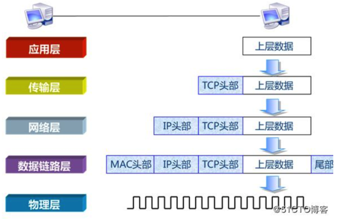

每一层都是为了完成一种功能，为了实现这些功能，就需要遵守共同的规则，即"协议"（protocol）。互联网的每一层，都定义了很多协议，这些协议的总称，叫做"互联网协议"（Internet Protocol Suite），它们是互联网的核心。

### 实体层（物理层）

关键字：实体、0和1。

可以用光缆、电缆、双绞线、无线电波等方式先把电脑连起来，这就叫做"实体层"，它就是把电脑连接起来的物理手段。它主要规定了网络的一些电气特性，作用是负责传送0和1的电信号。

### 链接层（数据链路层）

关键字：0和1分组、以太网、帧、标头、数据、网卡、MAC地址、12个十六进制数、本网络内所有计算机、广播。

单纯的0和1没有任何意义，必须规定解读方式（即多少个电信号算一组？每个信号位有何意义？），这就是"链接层"的功能，它在"实体层"的上方，确定了0和1的分组方式。

早期的时候，每家公司都有自己的电信号分组方式。逐渐地，一种叫做"以太网"（Ethernet）的协议，占据了主导地位。以太网规定，一组电信号构成一个数据包，叫做"帧"（Frame）。每一帧分成两个部分：标头（Head）和数据（Data）。

"标头"包含数据包的一些说明项（如发送者、接受者、数据类型等等）；"数据"则是数据包的具体内容。"标头"的长度，固定为18字节；"数据"的长度，最短为46字节，最长为1500字节。因此，整个"帧"最短为64字节，最长为1518字节。如果数据很长，就必须分割成多个帧进行发送。


以太网规定，连入网络的所有设备，都必须具有"网卡"接口（ping 127.0.0.1 能ping通即代表电脑网卡没有问题，网络正常就能上网）。数据包必须是从一块网卡，传送到另一块网卡。网卡的地址，就是数据包的发送地址和接收地址，这叫做MAC地址，用来标识发送者和接受者。

每块网卡出厂的时候，都有一个全世界独一无二的MAC地址，长度是48个二进制位（6个字节），通常用12个十六进制数表示（如MAC Address：00-B0-D0-86-BB-F7）。前6个十六进制数是厂商编号，后6个是该厂商的网卡流水号。

有了MAC地址，就可以定位网卡和数据包的路径了。以太网数据包必须知道接收方的MAC地址，然后才能发送。以太网采用了一种很"原始"的方式，它不是把数据包准确送到接收方，而是向本网络内所有计算机发送，让每台计算机自己判断，是否为接收方。

例如，1号计算机向2号计算机发送一个数据包，同一个子网络的3号、4号、5号计算机都会收到这个包。它们读取这个包的"标头"，找到接收方的MAC地址，然后与自身的MAC地址相比较，如果两者相同，就接受这个包，做进一步处理，否则就丢弃这个包。这种发送方式就叫做"广播"（broadcasting）。有了数据包的定义、网卡的MAC地址、广播的发送方式，"链接层"就可以在多台计算机之间传送数据了（但是这样做有缺点）。

### 网络层（IP）

关键字：无数子网络、路由、主机到主机、网址、先处理网络地址、IP协议、IP地址、IPv4、四段的十进制数、同一个子网络。

以太网协议，依靠MAC地址发送数据。理论上，单单依靠MAC地址，上海的网卡就可以找到洛杉矶的网卡了，技术上是可以实现的。但是，这样做有一个重大的缺点。以太网采用广播方式发送数据包，所有成员人手一"包"，不仅效率低，而且局限在发送者所在的子网络。也就是说，如果两台计算机不在同一个子网络，广播是传不过去的。这种设计是合理的，否则互联网上每一台计算机都会收到所有包，那会引起灾难。

互联网是无数子网络共同组成的一个巨型网络，很像想象上海和洛杉矶的电脑会在同一个子网络，这几乎是不可能的。因此，必须找到一种方法，能够区分哪些MAC地址属于同一个子网络，哪些不是。如果是同一个子网络，就采用广播方式发送，否则就采用"路由"方式发送。（"路由"的意思，就是指如何向不同的子网络分发数据包，这是一个很大的主题，本文不涉及。）遗憾的是，MAC地址本身无法做到这一点。它只与厂商有关，与所处网络无关。这就导致了"网络层"的诞生。

"网络层"的功能是建立"主机到主机"的通信。网络层的作用是引进一套新的地址，能够区分不同的计算机是否属于同一个子网络。这套地址就叫做"网络地址"，简称"网址"。于是，"网络层"出现以后，每台计算机有了两种地址，一种是MAC地址，另一种是网络地址。两种地址之间没有任何联系，MAC地址是绑定在网卡上的，网络地址则是管理员分配的，它们只是随机组合在一起。网络地址能确定计算机所在的子网络，MAC地址则将数据包送到该子网络中的目标网卡。因此，从逻辑上可以推断，必定是先处理网络地址，然后再处理MAC地址。

规定网络地址的协议，叫做IP协议。它所定义的地址，就被称为IP地址（，其作用是通过ip地址在网络中找到对应的“在同一个子网络下的？”设备，然后可以给这个/些设备发送数据，另外为了方便记忆某台电脑的主机地址，域名能解析出来一个ip地址，即DNS解析）。ip地址类型分为ipv4和ipv6，目前广泛采用的是IP协议第四版，简称IPv4。这个版本规定，网络地址由32个二进制位组成（4个字节）。但习惯上，用分成四段的十进制数表示IP地址，从0.0.0.0一直到255.255.255.255（如IP Address：172.16.254.1，即10101100.00010000.11111110.00000001）。IP协议的作用主要有两个，一个是为每一台计算机分配IP地址，另一个是确定哪些地址在同一个子网络。

### 传输层（端口）

关键字：许多程序、程序的编号、1032、65535、端口到端口、套接字、UDP、用户数据报、不可靠、TCP、传输控制、三次握手。

有了MAC地址和IP地址，就可以在互联网上任意两台主机上建立通信。但是，同一台主机上有许多程序都需要用到网络（如一边浏览网页，一边软件在线聊天），所以，还需要一个参数，表示这个数据包到底供哪个程序（进程）使用，这个参数就叫做"端口"（port），它其实是每一个使用网卡的程序的编号。

每个数据包都发到主机的特定端口，不同的程序就能取到自己所需要的数据。"端口"是0到65535之间的一个整数，正好16个二进制位。0到1023的端口被系统占用，用户只能选用大于1023的端口。（任何）应用程序都会随机选用一个端口，然后与服务器的相应端口进行联系。

端口号分为知名端口号和动态端口号（知名端口号是系统使用的，动态端口号是程序员设置使用的）：知名端口号：范围从 `0-1023`；动态端口范围：`1024-65535` ，当程序关闭时，同时也就释放了所占用的端口号。查看端口号：`netstat -an`。查看端口号被哪个程序占用： `lsof -i[tcp/udp]:端口号`（找不到时，使用管理员权限，加sudo）。根据进程编号杀死指定进程：`kill -9 进程号`。

"传输层"的功能，就是建立"端口到端口"的通信。只要确定主机和端口，就能实现程序之间的交流。因此，Unix系统就把主机+端口，叫做"套接字"（socket），用于进行网络应用程序开发。

在数据包中加入端口信息，这就需要新的协议。最简单的实现叫做UDP，它的格式几乎就是在数据前面加上端口号。UDP数据包，也是由"标头"和"数据"两部分组成（总长度不超过65,535字节），"标头"部分主要定义了发出端口和接收端口（一共只有8个字节），"数据"部分就是具体的内容。然后，把整个UDP数据包放入IP数据包的"数据"部分，而IP数据包又是放在以太网数据包之中的。

UDP（User Datagram Protocol，用户数据报协议）

- 无连接（不需要建立连接, 把数据封装成数据包扔给对面）、资源开销小、传输速度快、UDP每个数据包最大是64K，但是不可靠的网络传输协议
- 因为不建立连接，所以对方可能收到也可能收不到数据(丢包)，因此是不安全的协议，但是速度比较快
- 传输数据不可靠，其可靠性由应用层负责，即不能保证数据的完整性和一致性，即不提供对数据包进行分组、组装和不能对数据包进行排序。因为数据发送出去后是不知道接收方是否收到的，而且容易丢失数据包，没有流量控制，当对方没有及时接收数据，发送方一直发送数据会导致缓冲区数据满了，电脑出现卡死情况，所以接收方需要及时接收数据

- 支持一对一通信，也支持一对多通信


UDP传输数据不可靠，可以选择另一种 **TCP**（Transmission Control Protocol，传输控制协议）：

- 是一种面向连接的、安全可靠的、基于字节流的传输层通信协议，但是速度稍慢，需要建立连接（三次握手），形成一条传输通道，才能传输数据（保证了数据的可靠性）。
- TCP 只是负责数据的传输，不关心传输的数据格式问题，如果需要使用 TCP 通信完成某种功能，则需要制定数据格式协议或者使用第三方协议。
- 传输数据的大小不受限制。
- 如果数据发送失败了，则会重新发送。

**UDP和TCP：都是数据传输方式的协议。**使用场景：

- 对速度要求比较高，或对数据质量要求不严谨的应用可以使用UDP，例如流媒体、实时多人游戏、实时音视频聊天、DNS 域名系统服务、TFTP 简单文件传输协议、DHCP 动态主机设置协议等
- 对数据安全要求比较高的时候使用TCP，例如网页数据，数据传输，文件下载
- 对于视频聊天，如果画质优先那就选用TCP，如果流畅度优先那就选用UDP

Socket 即套接字，是TCP/IP网络的API（一组接口），也是对TCP/IP协议的封装。其实也可以指定要使用的传输层协议，即支持不同的传输层协议（TCP或UDP），对应的Socket连接是TCP连接或UDP连接，指向通信的另一端，通过 Socket 接收或发送数据。Socket 通信模型：

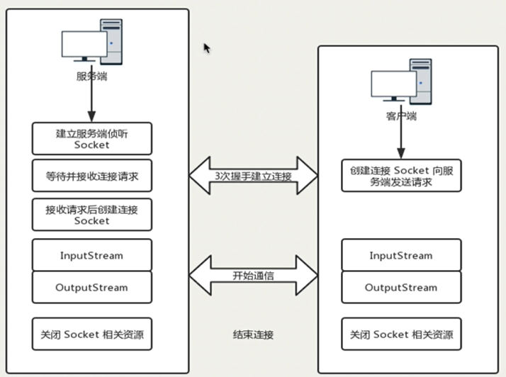

### 应用层

关键字：解读、数据格式、不同协议、面对用户。

应用程序收到"传输层"的数据，接下来就要进行解读。由于互联网是开放架构，数据来源五花八门，必须事先规定好格式，否则根本无法解读。

"应用层"的作用，就是规定应用程序的数据格式。例如，TCP协议可以为各种各样的程序传递数据（如Email、WWW、FTP等等）。所以要有不同协议（在应用层）规定电子邮件、网页、FTP数据的格式，这些应用程序协议就构成了"应用层"。这是最高的一层，直接面对用户。它的数据就放在TCP数据包的"数据"部分。因此，现在的以太网的数据包就变成下面这样。

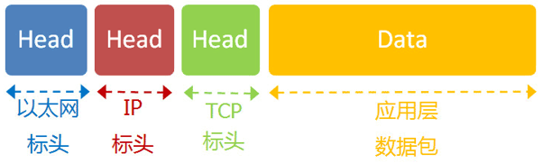

# 第2节 构建 TCP 服务

TCP 服务在网络应用中十分常见，目前大多数的应用都是基于TCP搭建而成的。TCP （传输控制协议），在 OSI 模型（七层模型）中属于传输层协议。许多应用层协议基于TCP构建，典型的是HTTP、SMTP、IMAP等协议。

七层协议示意图如下：

| 层级   | 作用               |
| ------ | ------------------ |
| 应用层 | HTTP、SMTP、IMAP等 |
| 表示层 | 加密/解密等        |
| 会话层 | 通信连接/维持会话  |
| 传输层 | TCP/UDP            |
| 网络层 | IP                 |
| 链路层 | 网络特有的链路接口 |
| 物理层 | 网络物理硬件       |

TCP 是面向连接的协议，其显著的特征是在传输之前需要3次握手形成会话，如下图所示。只有会话形成之后，服务器端和客户端之间才能互相发送数据。在创建会话的过程中，服务器端和客户端分别提供一个套接字，这个两个套接字共同形成一个连接。服务器端与客户端则通过套接字实现两者之间连接通信的操作。下面是一个基于 Socket 套接字编程的网络通信模型。

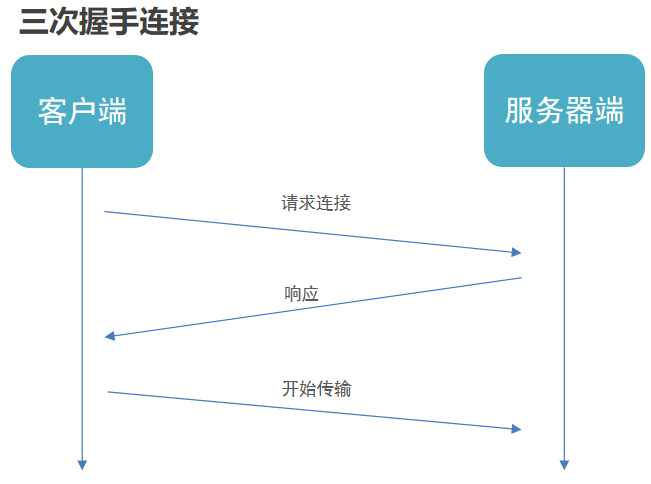

## 使用 net 模块构建 TCP 服务端和客户端：

### 基本示例

服务端：

```javascript
const net = require('net');
const server = net.createServer((c) => { // clientSocket客户端套接字
  // 'connection' listener
  console.log('client connected');
  c.on('end', () => {
    console.log('client disconnected');
  });
  c.write('hello\r\n');
  c.pipe(c);
});
server.on('error', (err) => {
  throw err;
});
server.listen(8124, () => {
  console.log('server bound');
});
```

客户端：

```javascript
const net = require('net');
const client = net.createConnection({ port: 8124 }, () => {
  // 'connect' listener
  console.log('connected to server!');
  client.write('world!\r\n');
});
client.on('data', (data) => {
  console.log(data.toString());
  client.end();
});
client.on('end', () => {
  console.log('disconnected from server');
});
```

### 其它示例：

服务端：

```js
const net = require('net')
const server = net.createServer()
server.on('connection', clientSocket => {
  console.log('有新的连接进来了')
  // 监听 clientSocket 的 data 事件
  clientSocket.on('data', data => {
    console.log('客户端说：', data.toString())
  })
  // 给客户端发消息
  // 通过 clientSocket 给当前连接的客户端发送数据
  clientSocket.write('hello')
})
server.listen(3000, () => console.log('Server running 127.0.0.1 3000'))
```

客户端：

```js
const net = require('net')
const client = net.createConnection({
  host: '127.0.0.1',
  port: 3000
})
client.on('connect', () => {
  console.log('成功的连接到服务器了')
  // 当客户端与服务端建立连接成功以后，客户端就可以给服务端发送数据了
  client.write('world')
  // 当客户端与服务端建立连接成功以后，可以监听终端的输入，然后敲回车确认
  // 获取终端的输入发送给服务端
  process.stdin.on('data', data => {
    client.write(data.toString().trim()) // 加上trim可以去除左右两边的回车换行（因为回车也算一个字符）
  })
})
// 客户端监听 data 事件
// 当服务端发消息过来就会触发该事件
client.on('data', data => {
  console.log('服务端说：', data.toString())
})
```

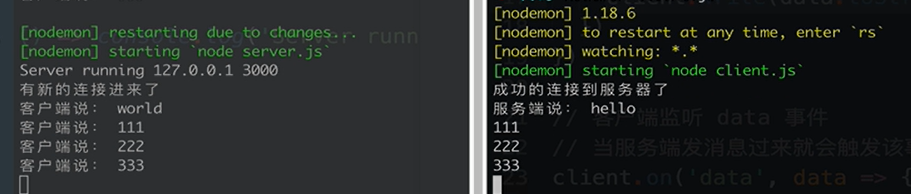

## 相关 API

> 官方API文档：https://nodejs.org/dist/latest-v10.x/docs/api/net.html

### 服务端相关 API

server：服务端的server（net.createServer()）。

> [Class: net.Server](https://nodejs.org/dist/latest-v10.x/docs/api/net.html#net_class_net_server)

- [new net.Server([options\][, connectionListener])](https://nodejs.org/dist/latest-v10.x/docs/api/net.html#net_new_net_server_options_connectionlistener) 创建服务器
- [Event: 'close'](https://nodejs.org/dist/latest-v10.x/docs/api/net.html#net_event_close) 当服务器关闭时，触发该事件
- [Event: 'connection'](https://nodejs.org/dist/latest-v10.x/docs/api/net.html#net_event_connection) 当有新的客户端连接进来时，触发该事件
- [Event: 'error'](https://nodejs.org/dist/latest-v10.x/docs/api/net.html#net_event_error) 当服务器发生错误时，触发该事件
- [Event: 'listening'](https://nodejs.org/dist/latest-v10.x/docs/api/net.html#net_event_listening) 当调用 server.listen() 绑定端口后触发，简洁写法为 server.listen(port, listeningListener)，通过 listen() 方法的第二个参数传入
- [server.address()](https://nodejs.org/dist/latest-v10.x/docs/api/net.html#net_server_address) 服务器创建侦听成功后，可以用来获取服务器地址相关信息，包含 `{ port: 12346, family: 'IPv4', address: '127.0.0.1' }` 信息
- [server.close([callback])](https://nodejs.org/dist/latest-v10.x/docs/api/net.html#net_server_close_callback) 当服务器关闭时触发，在调用 server.close() 后，服务器将停止接受新的套接字连接，但保持当前存在的连接，等待所有连接都断开后，会触发该事件
- [server.connections](https://nodejs.org/dist/latest-v10.x/docs/api/net.html#net_server_connections) 获取当前已建立连接的数量
  - 注意：该 API 即将废弃，推荐使用 `server.getConnections()` 替换
- [server.getConnections(callback)](https://nodejs.org/dist/latest-v10.x/docs/api/net.html#net_server_getconnections_callback) 获取当前已建立连接的数量
- [server.listen()](https://nodejs.org/dist/latest-v10.x/docs/api/net.html#net_server_listen) 绑定端口号启动服务，开始等待侦听
  - [server.listen(handle[, backlog\][, callback])](https://nodejs.org/dist/latest-v10.x/docs/api/net.html#net_server_listen_handle_backlog_callback)
  - [server.listen(options[, callback\])](https://nodejs.org/dist/latest-v10.x/docs/api/net.html#net_server_listen_options_callback)
  - [server.listen(path[, backlog\][, callback])](https://nodejs.org/dist/latest-v10.x/docs/api/net.html#net_server_listen_path_backlog_callback)
  - [server.listen([port[, host[, backlog\]]][, callback])](https://nodejs.org/dist/latest-v10.x/docs/api/net.html#net_server_listen_port_host_backlog_callback)
- [server.listening](https://nodejs.org/dist/latest-v10.x/docs/api/net.html#net_server_listening) 获取服务器的侦听状态
- [server.maxConnections](https://nodejs.org/dist/latest-v10.x/docs/api/net.html#net_server_maxconnections) 在服务器连接数较高的时候，可以通过设置该属性用于拒绝超过最大数的连接
- [server.ref()](https://nodejs.org/dist/latest-v10.x/docs/api/net.html#net_server_ref) 恢复服务器侦听
- [server.unref()](https://nodejs.org/dist/latest-v10.x/docs/api/net.html#net_server_unref) 暂停服务器侦听

### 套接字 Socket 相关 API

socket：服务端的server（net.createServer()）的“on”connection的clientSocket，还有客户端的client（net.createConnection()）。

> [Class: net.Socket](https://nodejs.org/dist/latest-v10.x/docs/api/net.html#net_class_net_socket)

- [new net.Socket([options])](https://nodejs.org/dist/latest-v10.x/docs/api/net.html#net_new_net_socket_options) 创建 Socket 连接
- [Event: 'close'](https://nodejs.org/dist/latest-v10.x/docs/api/net.html#net_event_close_1) 当套接字完全关闭时，触发该事件
- [Event: 'connect'](https://nodejs.org/dist/latest-v10.x/docs/api/net.html#net_event_connect) 该事件用于客户端，当套接字与服务端连接成功时会被触发
- [Event: 'data'](https://nodejs.org/dist/latest-v10.x/docs/api/net.html#net_event_data) 当一端调用 `write()` 发送数据时，另一端会触发 `data` 事件，事件传递的数据即是 `write()` 发送的数据
- [Event: 'drain'](https://nodejs.org/dist/latest-v10.x/docs/api/net.html#net_event_drain) 当任意一端调用 write() 发送数据时，当前这端会触发该事件
- [Event: 'end'](https://nodejs.org/dist/latest-v10.x/docs/api/net.html#net_event_end) 当连接中的任意一端发送了 FIN 数据时，将会触发该事件
- [Event: 'error'](https://nodejs.org/dist/latest-v10.x/docs/api/net.html#net_event_error_1) 当异常发生时，触发该事件
- [Event: 'timeout'](https://nodejs.org/dist/latest-v10.x/docs/api/net.html#net_event_timeout)  当一定时间后连接不再活跃时，该事件将会被触发，通知用户当前连接已经被闲置了
- [socket.address()](https://nodejs.org/dist/latest-v10.x/docs/api/net.html#net_socket_address) 获取套接字的连接信息，例如 `{ port: 12346, family: 'IPv4', address: '127.0.0.1' }`
- [socket.localAddress](https://nodejs.org/dist/latest-v10.x/docs/api/net.html#net_socket_localaddress) 获取当前套接字地址
- [socket.localPort](https://nodejs.org/dist/latest-v10.x/docs/api/net.html#net_socket_localport) 获取当前套接字端口号
- [socket.remoteAddress](https://nodejs.org/dist/latest-v10.x/docs/api/net.html#net_socket_remoteaddress) 获取另一端套接字地址
- [socket.remoteFamily](https://nodejs.org/dist/latest-v10.x/docs/api/net.html#net_socket_remotefamily) 获取另一端套接字IP协议版本
- [socket.remotePort](https://nodejs.org/dist/latest-v10.x/docs/api/net.html#net_socket_remoteport) 获取另一端套接字连接端口号
- [socket.setEncoding([encoding])](https://nodejs.org/dist/latest-v10.x/docs/api/net.html#net_socket_setencoding_encoding) 设置获取数据解析的编码格式，默认不处理
- [socket.write(data[, encoding][, callback])](https://nodejs.org/dist/latest-v10.x/docs/api/net.html#net_socket_write_data_encoding_callback) 通过套接字发送数据

### 其它 API

net：一开始的服务端和客户端的net。

- [net.connect()](https://nodejs.org/dist/latest-v10.x/docs/api/net.html#net_net_connect) 创建 Socket 客户端连接，和 `net.createConnection()` 作用相等
  - [net.connect(options[, connectListener])](https://nodejs.org/dist/latest-v10.x/docs/api/net.html#net_net_connect_options_connectlistener)
  - [net.connect(port[, host\][, connectListener])](https://nodejs.org/dist/latest-v10.x/docs/api/net.html#net_net_connect_port_host_connectlistener)
- [net.createConnection()](https://nodejs.org/dist/latest-v10.x/docs/api/net.html#net_net_createconnection) 创建 Socket 客户端连接
  - [net.createConnection(options[, connectListener])](https://nodejs.org/dist/latest-v10.x/docs/api/net.html#net_net_createconnection_options_connectlistener)
  - [net.createConnection(path[, connectListener])](https://nodejs.org/dist/latest-v10.x/docs/api/net.html#net_net_createconnection_path_connectlistener)
  - [net.createConnection(port[, host\][, connectListener])](https://nodejs.org/dist/latest-v10.x/docs/api/net.html#net_net_createconnection_port_host_connectlistener)
- [net.createServer([options\][, connectionListener])](https://nodejs.org/dist/latest-v10.x/docs/api/net.html#net_net_createserver_options_connectionlistener) 创建Socket服务端，等价于 `new net.Server()`
- [net.isIP(input)](https://nodejs.org/dist/latest-v10.x/docs/api/net.html#net_net_isip_input) 判断是否是IP地址
- [net.isIPv4(input)](https://nodejs.org/dist/latest-v10.x/docs/api/net.html#net_net_isipv4_input) 判断是否是符合 IPv4协议的地址
- [net.isIPv6(input)](https://nodejs.org/dist/latest-v10.x/docs/api/net.html#net_net_isipv6_input) 判断是否是符合 IPv6 协议的地址

## 案例：聊天室

具体代码见tcp-chatroom文件夹。

### 核心需求

- 用户第一次进来，提示用户输入昵称进行注册（昵称不允许重复）
- 广播消息（群发）
- 点对点消息（私聊）

### 数据格式设计（语言协议）

- 数据格式：数据格式（data format）是描述数据保存在文件或记录中的规则。可以是字符形式的文本格式，或二进制数据形式的压缩格式。
- 为什么要进行数据格式设计
- 比较常见的数据传输格式：**JSON**、XML、YAML...

> **用户登录**
>
> - 客户端输入昵称发送到服务端
> - 服务端接收数据，校验昵称是否重复
>   - 如果已重复，则发送通知告诉客户端
>   - 如果可以使用，则将用户昵称及通信 Socket 存储到容器中用于后续使用

客户端：

```json
{
  "type": "login",
  "nickname": "xxx"
}
```

服务端：

```json
{
  "type": "login",
  "success": true | false,
  "message": "登录成功|失败",
  "nickname": data.nickname,
  "sumUsers": 10
}
```

> **广播消息（群发消息）**
>
> - 客户端输入消息发送到服务端
> - 服务端将消息发送给所有当前连接（也就是存储客户端Socket的容器）的客户端
> - 客户端收到消息，将消息输出到终端

客户端：

```json
{
  "type": "broadcast",
  "message": "xxx"
}
```

服务端：

```json
{
  "type": "broadcast",
  "nickname": "xxx",
  "message": "xxx"
}
```

> **点对点消息（私聊）**
>
> - 客户端输入消息发送到服务端
> - 服务端根据消息内容从容器中找到对应的通信客户端，然后将消息发送给该客户端
> - 对应的客户端收到消息，将消息输入到终端

客户端：

```json
{
  "type": "p2p",
  "nickname": "xxx",
  "message": "xxx"
}
```

服务端：

```json
{
  "type": "p2p",
  "success": true | false,
  "nickname": clientSocket.nickname,
  "message": "xxx"
}
```

> 上线|离线通知日志

服务端：

```json
{
  "type": "log",
  "message": "xxx 进入|离开了聊天室，当前在线人数：xx"
}
```

# 第3节 构建 UDP 服务

## TCP 和 UDP 比较

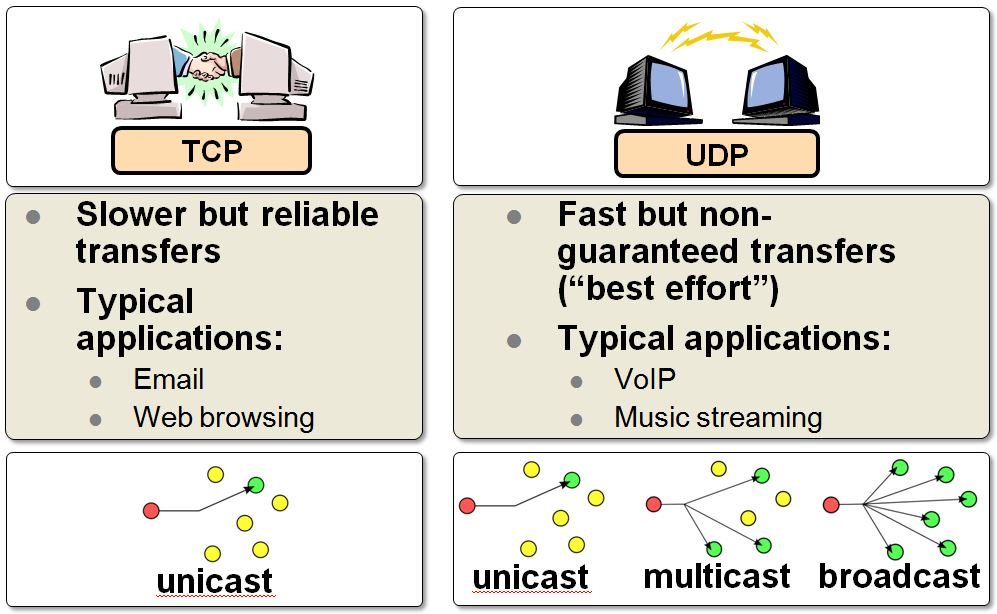

|          | UDP                        | TCP                    |
| -------- | -------------------------- | ---------------------- |
| 连接     | 无连接                     | 面向连接               |
| 速度     | 无需建立连接，速度较快     | 需要建立连接，速度较慢 |
| 目的主机 | 一对一，一对多             | 仅能一对一             |
| 带宽     | UDP 报头较短，消耗带宽更少 | 消耗更多的带宽         |
| 消息边界 | 有                         | 无                     |
| 可靠性   | 低                         | 高                     |
| 顺序     | 无序                       | 有序                   |

> 注：事实上，UDP协议的乱序性基本上很少出现，通常只会在网络非常拥挤的情况下才有可能发生。

## UDP 的三种传播方式

1、UDP 单播

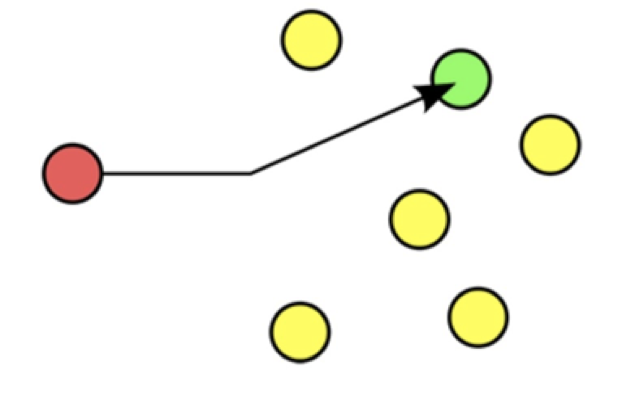

- 单播是目的地址为单一目标的一种传播方式，地址范围：`0.0.0.0 ~ 223.255.255.255`

2、UDP 广播

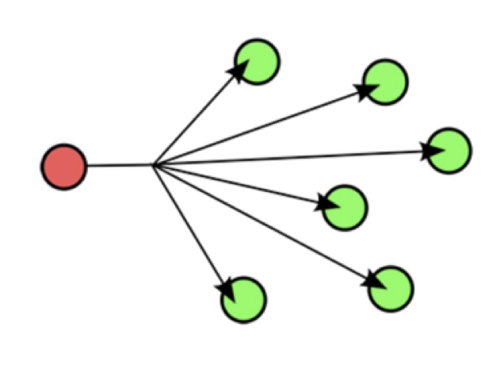

- 目的地址为网络（子网）中的所有设备，地址范围分为两种：
  - 受限广播：它不被路由转发，IP 地址的网络字段和主机字段全为1（二进制八位都是1，即255）就是地址 `255.255.255.255`
  - 直接广播：会被路由转发，IP地址的网络字段定义这个网络，主机字段通常全为1（二进制八位都是1，即255），如 `192.168.10.255`

3、UDP 组播

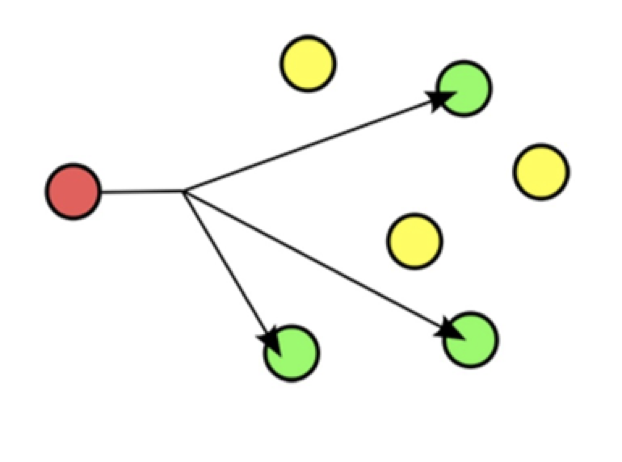

- 多播（Multicast）也叫组播，把信息传递给一组目的地地址，地址范围：`224.0.0.0 ~ 239.255.255.255`
  - `224.0.0.0 ~ 224.0.0.255` 为永久组地址，`224.0.0.0.0` 保留不分配，其它供路由协议使用
  - `224.0.1.0 ~ 224.0.1.255` 为公用组播地址，可以用于 Internet
  - `224.0.2.0 ~ 238.255.255.255` 为用户可用的组播地址（临时组），全网范围有效，使用需要申请
  - `239.0.0.0 ~ 239.255.255.255` 为本地管理组播地址，仅在特定本地范围有效


## UDP 一对多通信场景

1、单播面对 "一对多"

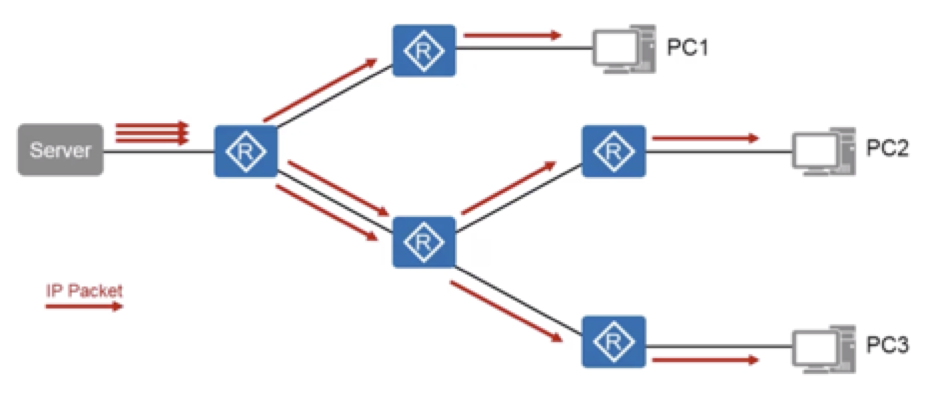

单播传输（Unicast）：在发送者和每一个接收者之间实现[点对点](https://baike.baidu.com/item/%E7%82%B9%E5%AF%B9%E7%82%B9)网络连接，即每一个数据包都有确切的目的IP地址；
如果一台发送者同时给多个接收者传输相同的数据，也必须相应的复制多份相同的[数据包](https://baike.baidu.com/item/%E6%95%B0%E6%8D%AE%E5%8C%85)；
如果有大量[主机](https://baike.baidu.com/item/%E4%B8%BB%E6%9C%BA)希望获得[数据包](https://baike.baidu.com/item/%E6%95%B0%E6%8D%AE%E5%8C%85)的同一份拷贝时，将导致发送者（Server）负担沉重、延迟长、[网络拥塞](https://baike.baidu.com/item/%E7%BD%91%E7%BB%9C%E6%8B%A5%E5%A1%9E)，为保证一定的服务质量需增加[硬件](https://baike.baidu.com/item/%E7%A1%AC%E4%BB%B6)和[带宽](https://baike.baidu.com/item/%E5%B8%A6%E5%AE%BD)。

2、广播面对 "一对多"

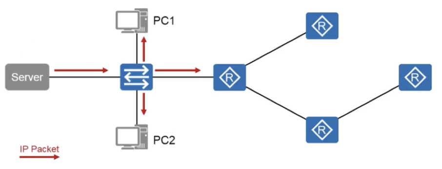

广播（Broadcast）：是指在IP[子网](https://baike.baidu.com/item/%E5%AD%90%E7%BD%91)内[广播数据包](https://baike.baidu.com/item/%E5%B9%BF%E6%92%AD%E6%95%B0%E6%8D%AE%E5%8C%85)（即广播数据包被限制在局域网中），所有在[子网](https://baike.baidu.com/item/%E5%AD%90%E7%BD%91)内部的[主机](https://baike.baidu.com/item/%E4%B8%BB%E6%9C%BA)都将收到这些数据包。
广播意味着网络向子网每一个[主机](https://baike.baidu.com/item/%E4%B8%BB%E6%9C%BA)都投递一份数据包（不论这些主机是否乐于接收该数据包），所以广播的使用范围非常小，只在本地[子网](https://baike.baidu.com/item/%E5%AD%90%E7%BD%91)内有效，通过[路由器](https://baike.baidu.com/item/%E8%B7%AF%E7%94%B1%E5%99%A8)和[网络设备](https://baike.baidu.com/item/%E7%BD%91%E7%BB%9C%E8%AE%BE%E5%A4%87)控制广播传输。
在网络中的应用较多，如客户机通过DHCP自动获得IP地址的过程就是通过广播来实现的。
与单播和多播相比，广播几乎占用了子网内网络的所有带宽，所以在 IPv6 中，广播的报文传输方式被取消。

3、组播面对 "一对多"

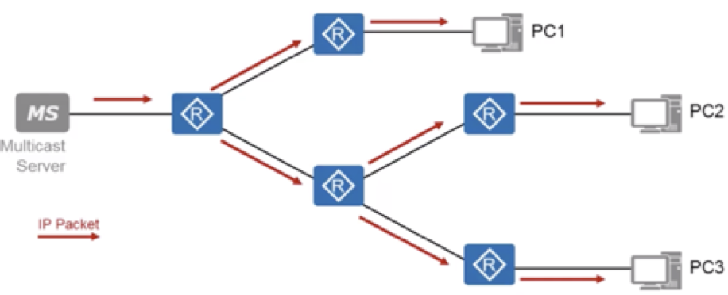

组播：[组播](https://baike.baidu.com/item/%E7%BB%84%E6%92%AD)解决了[单播](https://baike.baidu.com/item/%E5%8D%95%E6%92%AD)和广播方式效率低的问题，非常适合一对多的模型，因为数据流只发送给加入该组播组的接收者（组成员），而不需要该数据的设备不会收到该组播流量。
当网络中的某些用户需求特定信息时，[组播](https://baike.baidu.com/item/%E7%BB%84%E6%92%AD)源（即组播信息发送者）仅需发送一次信息即可，组播网络设备会根据实际需要转发或拷贝组播数据。
组播[路由器](https://baike.baidu.com/item/%E8%B7%AF%E7%94%B1%E5%99%A8)借助组播[路由协议](https://baike.baidu.com/item/%E8%B7%AF%E7%94%B1%E5%8D%8F%E8%AE%AE)为组播[数据包](https://baike.baidu.com/item/%E6%95%B0%E6%8D%AE%E5%8C%85)建立树型路由，被传递的信息在尽可能远的分叉路口才开始复制和分发，对于相同的组播报文，在一段链路上仅有一份数据，大大提高了网络资源的利用率。
网上视频会议、网上视频点播特别适合采用多播方式。

## Node 中的 dgram 模块

Node 提供了 [dgram](<https://nodejs.org/dist/latest-v10.x/docs/api/dgram.html>) 模块用于构建 UDP 服务。使用该模块创建 UDP 套接字非常简单，UDP 套接字一旦创建，既可以作为客户端发送数据，也可以作为服务器接收数据。

```javascript
const dgram = require('dgram')
const socket = dgram.createSocket('udp4')
```

### Socket 方法

| API               | 说明                   |
| ----------------- | ---------------------- |
| bind()            | 绑定端口和主机         |
| address()         | 返回 Socket 地址对象   |
| close()           | 关闭 Socket 并停止监听 |
| send()            | 发送消息               |
| addMembership()   | 添加组播成员           |
| dropMembership()  | 删除组播成员           |
| setBroadcast()    | 设置是否启动广播       |
| setTTL()          | 设置数据报生存时间     |
| setMulticastTTL() | 设置组播数据报生存时间 |

### Socket 事件

| API       | 说明                       |
| --------- | -------------------------- |
| listening | 监听成功时触发，仅触发一次 |
| message   | 收到消息时触发             |
| error     | 发生错误时触发             |
| close     | 关闭 Socket 时触发         |

## 使用 Node 实现 UDP 单播

### 服务端

```js
const dgram = require('dgram')
const server = dgram.createSocket('udp4')
server.on('listening', () => {
  const address = server.address()
  console.log(`server running ${address.address}:${address.port}`)
})
server.on('message', (msg, remoteInfo) => {
  console.log(`server got ${msg} from ${remoteInfo.address}:${remoteInfo.port}`)
  server.send('world', remoteInfo.port, remoteInfo.address)
})
server.on('error', err => {
  console.log('server error', err)
})
server.bind(3000)
```

### 客户端

```js
const dgram = require('dgram')
const client = dgram.createSocket('udp4')
// 如果没有.bind绑定端口号，则系统会自动分配端口号，则无需在listening事件里面send
// client.send('hello', 3000, 'localhost') // 如果.bind绑定了端口号，则要在listening事件里面send才可以
client.on('listening', () => {
  const address = client.address()
  console.log(`client running ${address.address}:${address.port}`)
  client.send('hello', 3000, 'localhost')
})
client.on('message', (msg, remoteInfo) => {
  console.log(`client got ${msg} from ${remoteInfo.address}:${remoteInfo.port}`)
})
client.on('error', err => {
  console.log('client error', err)
})
client.bind(8000)
```

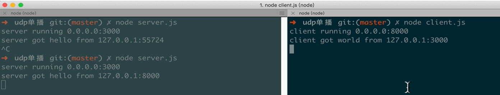

## 使用 Node 实现 UDP 广播

### 服务端

```js
const dgram = require('dgram')
const server = dgram.createSocket('udp4')
server.on('listening', () => {
  const address = server.address()
  console.log(`server running ${address.address}:${address.port}`)
  server.setBroadcast(true) // 开启广播模式
  server.send('hello', 8000, '255.255.255.255')
  // 每隔2秒发送一条广播消息
  setInterval(function () {
    // 直接地址 192.168.10.255
    // 受限地址 255.255.255.255
    server.send('hello', 8000, '192.168.10.255')
    // server.send('hello', 8000, '255.255.255.255')
  }, 2000)
})
server.on('message', (msg, remoteInfo) => {
  console.log(`server got ${msg} from ${remoteInfo.address}:${remoteInfo.port}`)
  server.send('world', remoteInfo.port, remoteInfo.address)
})
server.on('error', err => {
  console.log('server error', err)
})
server.bind(3000)
```

### 客户端

```js
const dgram = require('dgram')
const client = dgram.createSocket('udp4')
client.on('message', (msg, remoteInfo) => {
  console.log(`client got ${msg} from ${remoteInfo.address}:${remoteInfo.port}`)
})
client.on('error', err => {
  console.log('client error', err)
})
client.bind(8000)
```

## 使用 Node 实现 UDP 组播

### 服务端

```js
const dgram = require('dgram')
const server = dgram.createSocket('udp4')
server.on('listening', () => {
  const address = server.address()
  setInterval(function () {
    server.send('hello', 8000, '224.0.1.100')
  }, 2000)
})
server.on('message', (msg, remoteInfo) => {
  console.log(`server got ${msg} from ${remoteInfo.address}:${remoteInfo.port}`)
  server.send('world', remoteInfo.port, remoteInfo.address)
})
server.on('error', err => {
  console.log('server error', err)
})
server.bind(3000)
```

### 客户端

```js
const dgram = require('dgram')
const client = dgram.createSocket('udp4')
client.on('listening', () => {
  const address = client.address()
  console.log(`client running ${address.address}:${address.port}`)
  client.addMembership('224.0.1.100')
})
client.on('message', (msg, remoteInfo) => {
  console.log(`client got ${msg} from ${remoteInfo.address}:${remoteInfo.port}`)
})
client.on('error', err => {
  console.log('client error', err)
})
client.bind(8000)
```


# 第4节 构建 HTTP 服务

## Node 中的 http 模块

TCP 和 UDP 都属于网络传输层协议，如果要构建高效的网络应用，就应该从传输层进行着手。但是对于经典的浏览器网页和服务端通信场景，如果单纯的使用更底层的传输层协议则会变得麻烦。

所以对于经典的B（Browser）S（Server）通信，基于传输层之上专门制定了更上一层的通信协议：HTTP，用于浏览器和服务端进行通信。由于 HTTP 协议本身并不考虑数据如何传输及其它细节问题，所以属于应用层协议。Node 提供了基本的 http 和 https 模块用于 HTTP 和 HTTPS 的封装。

### Server 实例

| API              | 说明               |
| ---------------- | ------------------ |
| Event：'close'   | 服务关闭时触发     |
| Event：'request' | 收到请求消息时触发 |
| server.close()   | 关闭服务           |
| server.listening | 获取服务状态       |

### 请求对象

| API                 | 说明             |
| ------------------- | ---------------- |
| request.method      | 请求方法         |
| request.url         | 请求路径         |
| request.headers     | 请求头           |
| request.httpVersion | 请求HTTP协议版本 |

### 响应对象

| API                                | 说明             |
| ---------------------------------- | ---------------- |
| response.end()                     | 结束响应         |
| response.setHeader(name, value)    | 设置响应头       |
| response.removeHeader(name, value) | 删除响应头       |
| response.statusCode                | 设置响应状态码   |
| response.statusMessage             | 设置响应状态短语 |
| response.write()                   | 写入响应数据     |
| response.writeHead()               | 写入响应头       |

## 使用 Node 构建 http 服务

### ①返回 Hello World

```js
// helloworld.js
const http = require('http')
const hostname = '127.0.0.1'
const port = 3000
const server = http.createServer((req, res) => {
  res.statusCode = 200
  res.setHeader('Content-Type', 'text/plain')
  res.end('Hello World\n')
})
server.listen(port, hostname, () => {
  console.log(`Server running at http://${hostname}:${port}/`)
})
```

### ②根据不同 url 处理不同请求

```js
// url.js
const http = require('http')
const hostname = '127.0.0.1'
const port = 3000
const server = http.createServer((req, res) => {
  const url = req.url
  if (url === '/') {
    res.end('Hello World!')
  } else if (url === '/a') {
    res.end('Hello a!')
  } else if (url === '/b') {
    res.end('Hello b!')
  } else {
    res.statusCode = 404
    res.end('404 Not Found.')
  }
})
server.listen(port, hostname, () => {
  console.log(`Server running at http://${hostname}:${port}/`)
})
```

### ③响应 HTML 内容

```js
// html.js
const http = require('http')
const fs = require('fs')
const hostname = '127.0.0.1'
const port = 3000
const server = http.createServer((req, res) => {
  fs.readFile('./index.html', (err, data) => {
    if (err) {
      throw err
    }
    res.statusCode = 200
    res.setHeader('Content-Type', 'text/html; charset=utf-8')
    res.end(data)
  })
//   res.end(`
// <h1>Hello World!</h1>
// <p>你好，世界！</p>
//   `)
})
server.listen(port, hostname, () => {
  console.log(`Server running at http://${hostname}:${port}/`)
})
```

### ④处理页面中的静态资源

```js
// assets.js
const http = require('http')
const fs = require('fs')
const hostname = '127.0.0.1'
const port = 3000
const server = http.createServer((req, res) => {
  const url = req.url
  if (url === '/') {
    fs.readFile('./index.html', (err, data) => {
      if (err) {
        throw err
      }
      res.statusCode = 200
      res.setHeader('Content-Type', 'text/html; charset=utf-8')
      res.end(data)
    })
  } else if (url === '/assets/css/main.css') {
    fs.readFile('./assets/css/main.css', (err, data) => {
      if (err) {
        throw err
      }
      res.statusCode = 200
      res.setHeader('Content-Type', 'text/css; charset=utf-8')
      res.end(data)
    })
  } else if (url === '/assets/js/main.js') {
    fs.readFile('./assets/js/main.js', (err, data) => {
      if (err) {
        throw err
      }
      res.statusCode = 200
      res.setHeader('Content-Type', 'text/javascript; charset=utf-8')
      res.end(data)
    })
  } else {
    res.statusCode = 404
    res.setHeader('Content-Type', 'text/plain; charset=utf-8')
    res.end('404 Not Found.')
  }
})
server.listen(port, hostname, () => {
  console.log(`Server running at http://${hostname}:${port}/`)
})
```

### ⑤统一处理页面中的静态资源

```js
// assets.js
const http = require('http')
const fs = require('fs')
const mime = require('mime')
const path = require('path')
const hostname = '127.0.0.1'
const port = 3000
const server = http.createServer((req, res) => {
  const url = req.url
  if (url === '/') {
    fs.readFile('./index.html', (err, data) => {
      if (err) {
        throw err
      }
      res.statusCode = 200
      res.setHeader('Content-Type', 'text/html; charset=utf-8')
      res.end(data)
    })
  } else if (url.startsWith('/assets/')) {
    // /assets/js/main.js
    fs.readFile(`.${url}`, (err, data) => {
      if (err) {
        res.statusCode = 404
        res.setHeader('Content-Type', 'text/plain; charset=utf-8')
        res.end('404 Not Found.')
      }
      const contentType = mime.getType(path.extname(url))
      res.statusCode = 200
      res.setHeader('Content-Type', contentType)
      res.end(data)
    })
  } else {
    res.statusCode = 404
    res.setHeader('Content-Type', 'text/plain; charset=utf-8')
    res.end('404 Not Found.')
  }
})
server.listen(port, hostname, () => {
  console.log(`Server running at http://${hostname}:${port}/`)
})
```

### ⑥使用模板引擎处理动态页面

假如有一份数据 `todos` 需要展示到页面中，如何将这一组数据列表展示到一个页面中，最简单的方式就是字符串替换，但是如果有不止一份数据需要展示到页面中的时候就会变得非常麻烦，所以前人将此种方式整合规则之后开发了常见的模板引擎。

```js
const todos = [
  { title: '吃饭', completed: false },
  { title: '睡觉', completed: true },
  { title: '打豆豆', completed: false }  
]
```

在 Node 中，有很多优秀的模板引擎，它们大抵相同，但都各有特点

- [marko](https://github.com/marko-js/marko)
- [nunjucks](https://github.com/mozilla/nunjucks)
- [handlebars.js](https://github.com/wycats/handlebars.js)
- [EJS](https://github.com/mde/ejs)
- [Pug](https://github.com/pugjs/pug)
- [art-template](<https://github.com/aui/art-template>)

#### art-template 基本使用

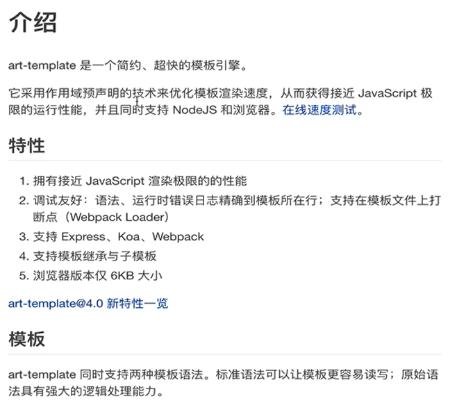

输出：

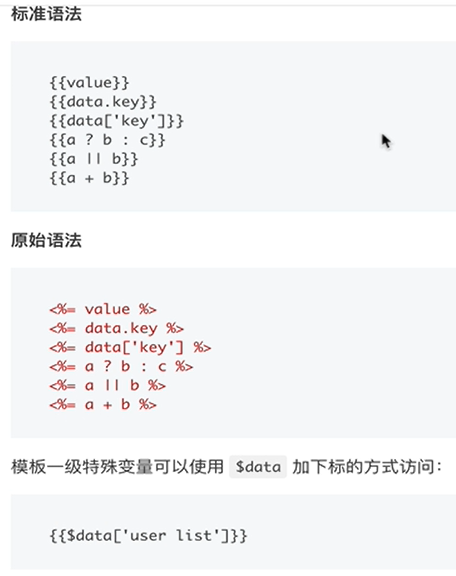

原文输出：

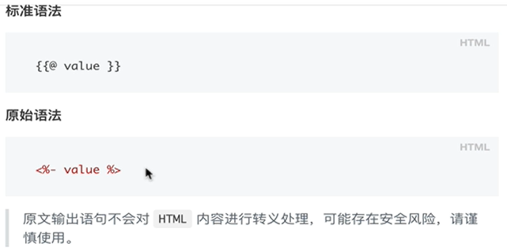

条件：

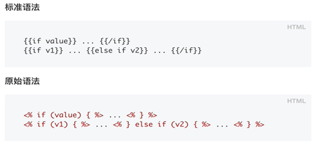

循环：

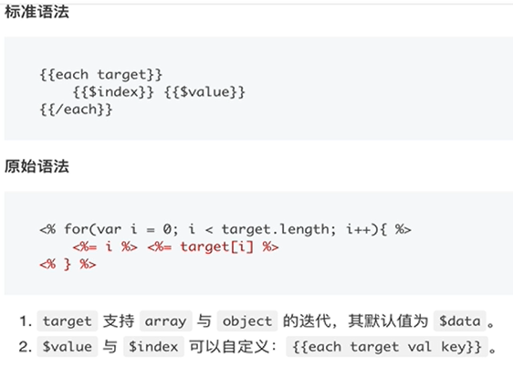

##### 具体案例：

```js
// template-engine.js
const template = require('art-template')
// const ret = template.render('Hello {{ message }}', {
//   message: 'World'
// })
const ret = template.render(`
<!DOCTYPE html>
<html lang="en">
<head>
<meta charset="UTF-8" />
<title>Document</title>
</head>
<body>
  <h1>Hello {{ message }}</h1>
  <ul>
    {{ each todos }}
    <li>{{ $value.title }} <input type="checkbox" {{ $value.completed ? 'checked' : '' }} /></li>
    {{ /each }}
  </ul>
</body>
</html>
`, {
  message: 'World',
  todos: [
    { title: '吃饭', completed: false },
    { title: '睡觉', completed: true },
    { title: '打豆豆', completed: false }
  ]
})
console.log(ret)
```

##### 结合 http 服务渲染页面

```js
// http-template.js
const http = require('http')
const template = require('art-template')
const fs = require('fs')
const hostname = '127.0.0.1'
const port = 3000
const server = http.createServer((req, res) => {
  const url = req.url
  if (url === '/') {
    fs.readFile('./index2.html', (err, data) => {
      if (err) {
        throw err
      }
      const htmlStr = template.render(data.toString(), {
        message: '黑马程序员',
        todos: [
          { title: '吃饭', completed: true },
          { title: '睡觉', completed: true },
          { title: '打豆豆', completed: false }
        ]
      })
      res.statusCode = 200
      res.setHeader('Content-Type', 'text/html')
      res.end(htmlStr)
    })
  }
})
server.listen(port, hostname, () => {
  console.log(`Server running at http://${hostname}:${port}/`)
})
```

## 第三方 HTTP 服务框架

[Express](http://expressjs.com/)，[Koa](http://koajs.com/)，[ThinkJS](https://github.com/thinkjs/thinkjs)，[Egg](https://eggjs.org/)，[AdonisJs](http://adonisjs.com/) ......

> 更多优秀的第三方资源 [awesome node.js](<https://github.com/sindresorhus/awesome-nodejs#web-frameworks>)


# 第5节 构建 HTTPS 服务

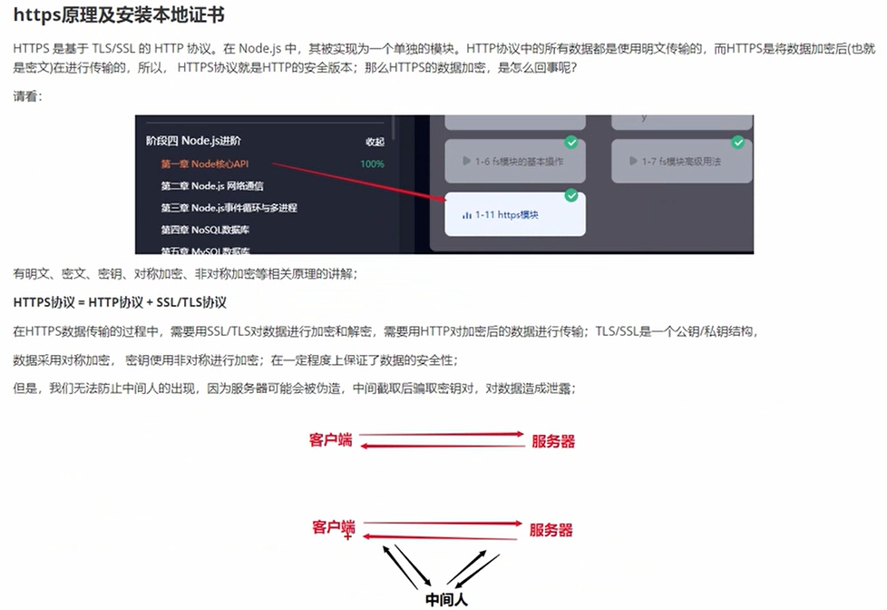

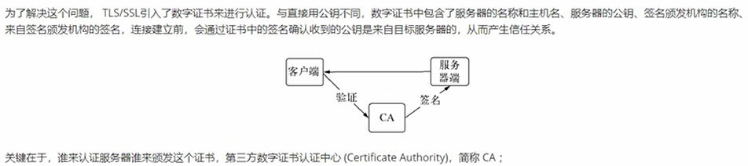

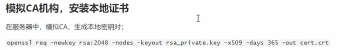

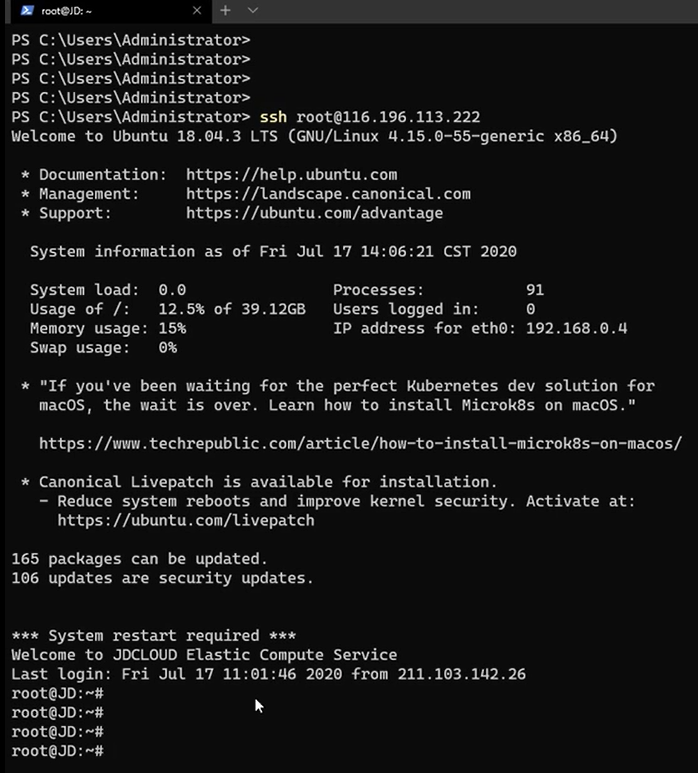

这里用的是Linux（的Ubuntu），对于Windows操作系统，需要安装OpenSSL软件才可以。

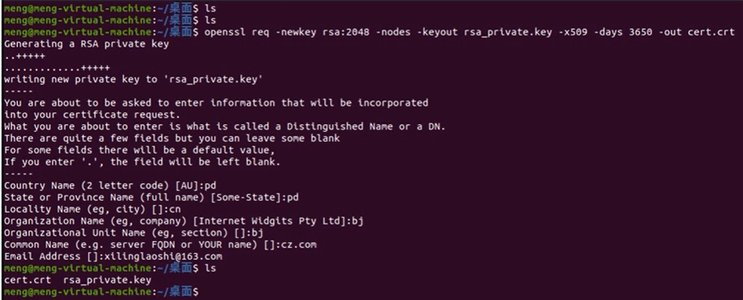


其实不用去主动联系这些国际CA机构，上阿里云或腾讯云（有免费的）即可

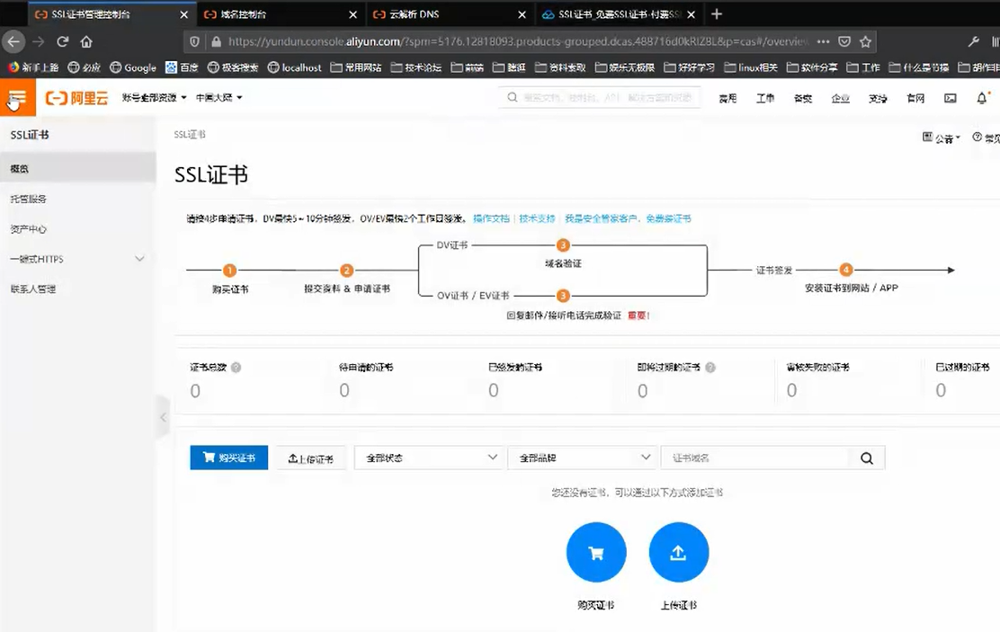


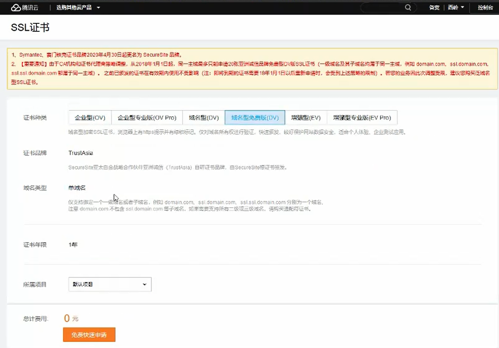

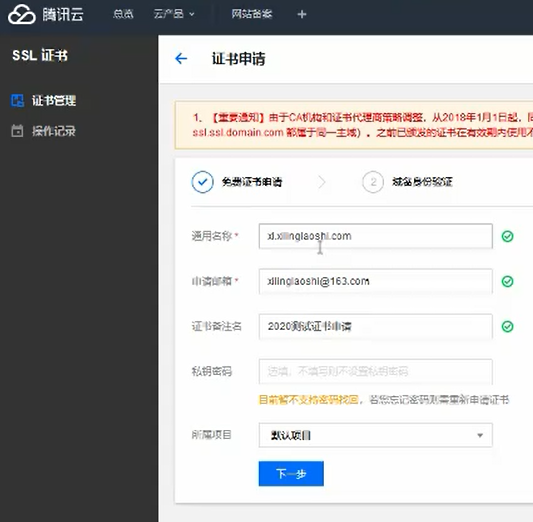


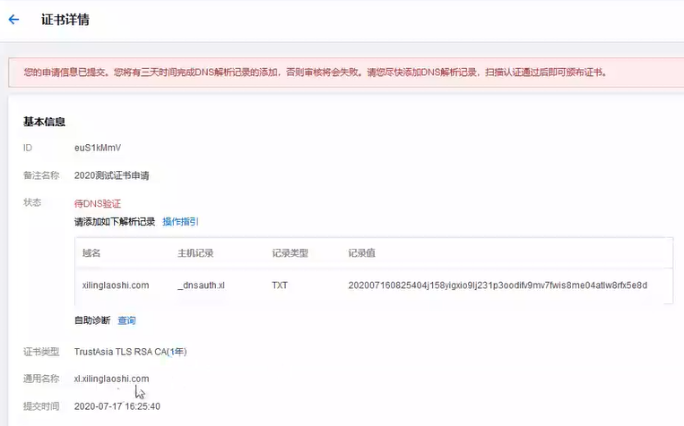

申请之后，要在自己的服务器里添加记录

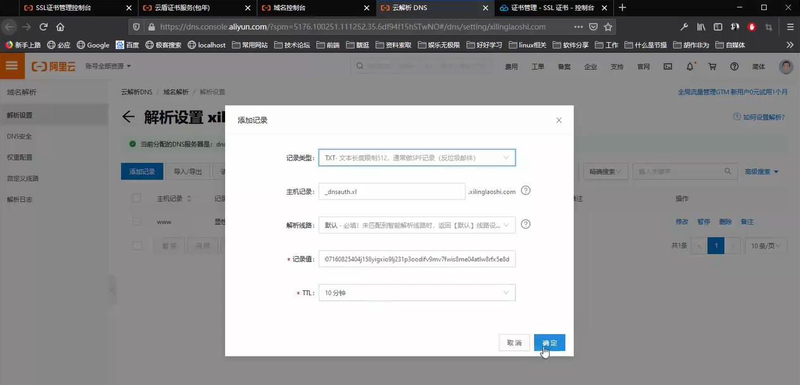


收到邮件通知

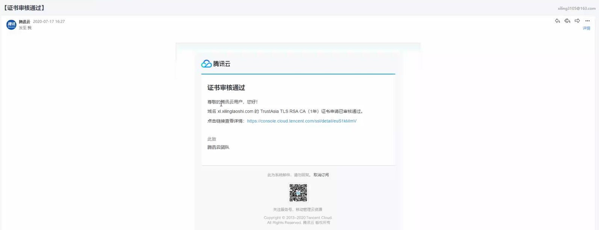

下载证书之后：可以看见提供了四种服务器的（Apache、IIS、Nginx、Tomcat），对于Node服务器，可以使用Nginx服务器的。

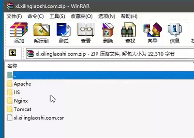

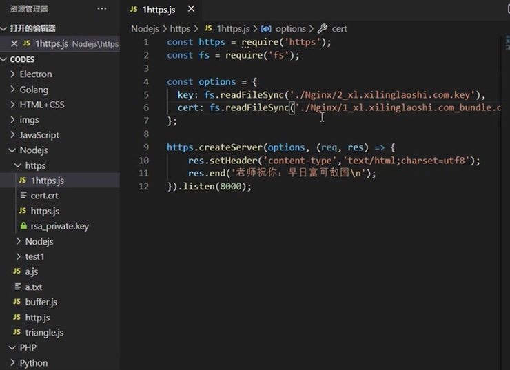

但是注意，要添加一个记录值

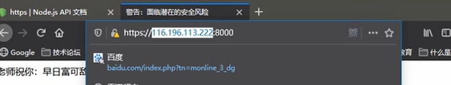

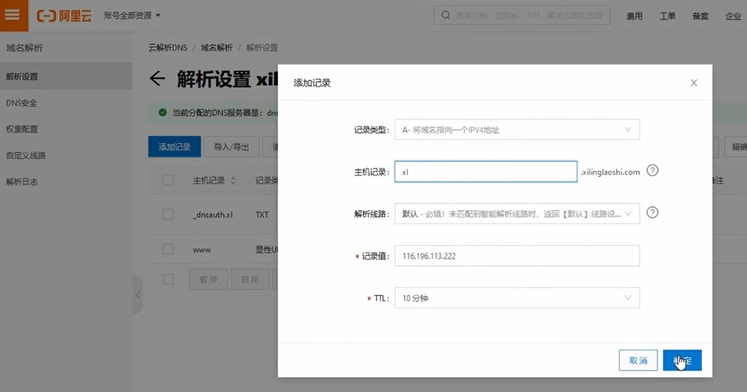

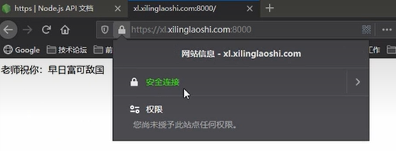


# 第6节 构建 WebSocket 服务

#### 为什么需要 WebSocket

因为 HTTP 协议有一个缺陷，即通信只能由客户端发起，没有请求就没有响应，做不到服务器主动向客户端推送信息。

这种单向请求的特点，注定了如果服务器有连续的状态变化，客户端要获知就非常麻烦。只能使用["轮询"](https://www.pubnub.com/blog/2014-12-01-http-long-polling/)：每隔一段时候，就发出一个询问，了解服务器有没有新的信息。最典型的场景就是聊天室。但是轮询的效率低，非常浪费资源（因为必须不停连接，或者 HTTP 连接始终打开）。因此，WebSocket 应运而生。

#### 什么是 WebSocket

[WebSocket](http://websocket.org/) 是一种网络通信协议，它的最大特点就是，服务器可以主动向客户端推送信息，客户端也可以主动向服务器发送信息，是真正的双向平等对话，属于[服务器推送技术](https://en.wikipedia.org/wiki/Push_technology)的一种。

```
ws://example.com:80/some/path
```


### 客户端 WebSocket

#### 基本示例

在浏览器中提供了 `WebSocket` 对象用于创建和管理 [WebSocket](https://developer.mozilla.org/zh-CN/docs/Web/API/WebSockets_API) 连接，以及可以通过该连接发送和接收数据的 API。简单示例：

```javascript
var ws = new WebSocket("wss://echo.websocket.org"); // WebSocket对象(构造函数)，用于新建 WebSocket 实例(客户端就会与服务器进行连接)
ws.onopen = function(evt) { // 实例对象的`onopen`属性，用于指定连接成功后的回调函数
  console.log("Connection open ..."); 
  ws.send("Hello WebSockets!"); // 实例对象的`send()`方法用于向服务器发送数据，发送消息一定要在建立连接成功以后
};
ws.onmessage = function(evt) { // 实例对象的`onmessage`属性，用于指定收到服务器数据后的回调函数
  var data = evt.data;
  console.log( "Received Message: " + evt.data);
  ws.close(); // 实例对象的 `close()` 方法用于关闭连接，连接关闭之后会触发实例对象的 `onclose` 事件
};
ws.onclose = function(evt) { // 实例对象的`onclose`属性，用于指定连接关闭后的回调函数
  var code = evt.code;
  var reason = evt.reason;
  var wasClean = evt.wasClean;
  console.log("Connection closed.");
};
```

#### 常用 API

##### 事件： onopen

如果要指定多个回调函数，可以使用`addEventListener`方法。

```javascript
ws.addEventListener('open', function (event) {
  ws.send('Hello Server!');
});
```

##### 事件： onclose

```javascript
ws.addEventListener("close", function(event) {
  // handle close event
});
```

##### 事件： onmessage

```javascript
ws.addEventListener("message", function(event) {
  var data = event.data;
  // 处理数据
});
```

注意，服务器数据可能是文本，也可能是二进制数据（`blob`对象或`Arraybuffer`对象）。

```javascript
ws.onmessage = function(event){
  if(typeof event.data === String) {
    console.log("Received data string");
  }
  if(event.data instanceof ArrayBuffer){
    var buffer = event.data;
    console.log("Received arraybuffer");
  }
}
```

除了动态判断收到的数据类型，也可以使用`binaryType`属性，显式指定收到的二进制数据类型。

```javascript
// 收到的是 blob 数据
ws.binaryType = "blob";
ws.onmessage = function(e) {
  console.log(e.data.size);
};
// 收到的是 ArrayBuffer 数据
ws.binaryType = "arraybuffer";
ws.onmessage = function(e) {
  console.log(e.data.byteLength);
};
```

##### 事件：onerror

实例对象的`onerror`属性，用于指定报错时的回调函数。

```javascript
socket.onerror = function(event) {
  // handle error event
};
socket.addEventListener("error", function(event) {
  // handle error event
});
```

##### 方法：send()

```javascript
// 发送 Blob 对象的例子：
var file = document
  .querySelector('input[type="file"]')
  .files[0];
ws.send(file);
```

```javascript
// 发送 ArrayBuffer 对象的例子
var img = canvas_context.getImageData(0, 0, 400, 320); // Sending canvas ImageData as ArrayBuffer
var binary = new Uint8Array(img.data.length);
for (var i = 0; i < img.data.length; i++) {
  binary[i] = img.data[i];
}
ws.send(binary.buffer);
```

##### 方法：close()

```javascript
ws.close()
```

##### 实例属性：bufferedAmount

实例对象的`bufferedAmount`属性，表示还有多少字节的二进制数据没有发送出去。它可以用来判断发送是否结束。

```javascript
var data = new ArrayBuffer(10000000);
ws.send(data);

if (socket.bufferedAmount === 0) {
  // 发送完毕
} else {
  // 发送还没结束
}
```

### 服务端 WebSocket

WebSocket 服务器的实现，可以查看维基百科的[列表](https://en.wikipedia.org/wiki/Comparison_of_WebSocket_implementations)。常用的 Node 实现有以下三种：

- [µWebSockets](https://github.com/uWebSockets/uWebSockets)
- [Socket.IO](http://socket.io/)
  - 服务端实现：提供了对所有流行的服务端的支持，例如 Java、PHP、Python、Node.js 等。
  - 客户端实现：浏览器。
- [WebSocket-Node](https://github.com/theturtle32/WebSocket-Node)

### 相关链接

- [MDN WebSocket](https://developer.mozilla.org/zh-CN/docs/Web/API/WebSocket)
- [SOCKET.IO 官网](https://socket.io/)
- [SOCKET.IO GitHub仓库](https://github.com/socketio/socket.io)
- [WebSocket 教程](http://www.ruanyifeng.com/blog/2017/05/websocket.html)
- [WebSocket Echo Test](http://websocket.org/echo.html)
