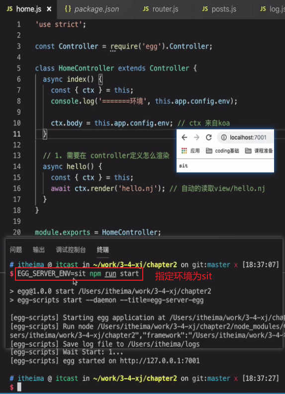
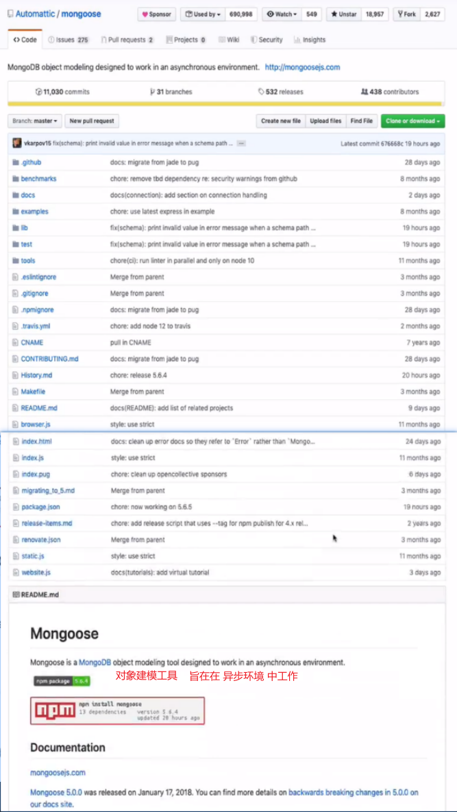

# web应用开发框架

## 第一节 koa入门与使用

### 简介与安装

Koa 是一个新的 web 框架（基于Node.js平台的下一代web开发框架），由 Express 幕后的原班人马打造， 致力于成为 web 应用和 API 开发领域中的一个更小、更富有表现力、更健壮的基石。 通过利用 async 函数，Koa 能丢弃回调函数，并有力地增强错误处理。 Koa 并没有捆绑任何中间件， 而是提供了一套优雅的方法，能快速而愉快地编写服务端应用程序。

Koa 依赖 **node v7.6.0** 或 ES2015及更高版本和 async 方法支持.

```shell
$ nvm install 7  // 可以使用某个版本管理器快速安装支持的 node 版本：
$ npm i koa
```

### 基本用法

#### 架设http服务

```
const Koa = require('koa');
const app = new Koa();
app.listen(3000); // 但是直接这样，请求时会返回404 Not Found
```

#### context对象

Koa 提供一个 Context 对象，表示一次对话的上下文（包括 HTTP 请求和 HTTP 回复）。通过加工这个对象，就可以控制返回给用户的内容。（`Context.response.body`属性就是发送给用户的内容，`ctx.response`代表 HTTP Response，`ctx.request`代表 HTTP Request）

```js
const Koa = require('koa');
const app = new Koa();
const main = ctx => {
  ctx.response.body = 'Hello World'; // 设置改body之后，返回的404（通过set劫持）默认变为200。另外，Content-Type默认返回text/plain
};
app.use(main); // 使用`app.use`方法加载`main`函数
app.listen(3000);
```

#### http response类型

Koa 默认的返回类型是`text/plain`，如果想返回其他类型的内容，可以先用`ctx.request.accepts`判断客户端希望接受什么数据（根据 HTTP Request 的`Accept`字段），然后使用`ctx.response.type`指定返回类型。

```js
const main = ctx => {
  if (ctx.request.accepts('xml')) {
    ctx.response.type = 'xml';
    ctx.response.body = '<data>Hello World</data>';
  } else if (ctx.request.accepts('json')) {
    ctx.response.type = 'json';
    ctx.response.body = { data: 'Hello World' };
  } else if (ctx.request.accepts('html')) {
    ctx.response.type = 'html';
    ctx.response.body = '<p>Hello World</p>';
  } else {
    ctx.response.type = 'text';
    ctx.response.body = 'Hello World';
  }
};
```

#### 网页模板

实际开发中，返回给用户的网页往往都写成模板文件。可以让 Koa 先读取模板文件，然后将这个模板返回给用户。

```js
const Koa = require('koa');
const app = new Koa();
const fs = require('fs');
const path = require('path');
const main = (ctx) => {
    ctx.response.type = 'html';
     // 注意路径问题。如果直接写'./demo.html'，则表示该路径相对于cmd控制台运行的（目录）路径
    ctx.response.body = fs.createReadStream(path.resolve(path.join(__dirname, './demo.html')));
}
app.use(main);
app.listen(3000);
```

### 路由

#### 原生路由

```js
const main = ctx => {
  if (ctx.request.path !== '/') { // 通过`ctx.request.path`可以获取用户请求的路径,由此实现简单的路由
    ctx.response.type = 'html';
    ctx.response.body = '<a href="/">Index Page</a>';
  } else {
    ctx.response.body = 'Hello World';
  }
};
```

#### koa-route模块

可以使用更方便的封装好的[`koa-route`](https://www.npmjs.com/package/koa-route)模块来处理访问路由。

```javascript
const Koa = require('koa');
const app = new Koa();
const route = require('koa-route');
const about = ctx => {
  ctx.response.type = 'html';
  ctx.response.body = '<a href="/">Index Page</a>';
};
const main = ctx => {
  ctx.response.body = 'Hello World';
};
app.use(route.get('/', main));
app.use(route.get('/about', about));
app.listen(3000);
```

#### 静态资源

如果网站提供静态资源（图片、字体、样式表、脚本等大量文件），则为它们一个个写路由就很麻烦，此时则可使用[`koa-static`](https://www.npmjs.com/package/koa-static)模块。

```js
const Koa = require('koa');
const app = new Koa();
const path = require('path');
const static = require('koa-static');
// 例如img目录下有meinv.jpeg文件，则访问localhost:3000/meinv.jpeg则可获取到
const main = static(path.join(__dirname, './img')); // 静态资源文件所处在的目录
app.use(main); // 可简写为app.use(static(path.join(__dirname, './img')));
app.listen(3000);
```

#### 重定向

有些场合（如用户登陆后重定向到登陆前的页面），服务器需要重定向（redirect）访问请求，则`ctx.response.redirect()`方法可以发出一个302跳转，将用户导向另一个路由。

```js
var koa = require('koa');
var app = new koa();
var route = require('koa-route');

案例一：
const redirect = ctx => {
  ctx.response.redirect('/');
  ctx.response.body = '<a href="/">Index Page</a>';
};
app.use(route.get('/redirect', redirect));
app.listen(3000);  // 起服务 ， 监听3000端口

案例二：
const main = (ctx) => {
    ctx.response.body = 'hello world';
}
const qita = (ctx) => {
    ctx.response.redirect('/');
}
app.use(route.get('/', main));  //  1. 路径 2. ctx函数
app.use(route.get('/qita', qita));
app.listen(3000);  // 起服务 ， 监听3000端口
```

### 中间件

#### 中间件的概念

洋葱模型：


Koa 的最大特色，也是最重要的一个设计，就是中间件（middleware）。如 Logger （打印日志）功能的实现，可以拆分成一个独立函数。

```js
var koa = require('koa');
var app = new koa();
var route = require('koa-route');
// 中间件的核心其实是：next方法是koa在use参数里注入的函数，即next方法是指当前执行函数的下一个use里面的参数（方法）。
var logger = (ctx, next) => {
    next();
    console.log(` 中间件执行--- 方法： ${ctx.request.method} 路径： ${ctx.request.path}`); // 此案例中,先打印"main",再打印"中间件执行"
}
const main = (ctx, next) => {
    ctx.response.body = 'hello world';
    next();
    console.log('main')
}
const qita = (ctx, next) => {
    ctx.response.body = 'qita';
    next();
}
app.use(logger);
app.use(route.get('/', main)); // 请求此根路径
app.use(route.get('/qita', qita));
app.listen(3000);
```

#### 同步中间件执行顺序

```js
const one = (ctx, next) => {
  console.log('>> one');
  next();
  console.log('<< one');
}
const two = (ctx, next) => {
  console.log('>> two');
  next(); 
  console.log('<< two');
}
const three = (ctx, next) => {
  console.log('>> three');
  next();
  console.log('<< three');
}
app.use(one);
app.use(two);
app.use(three);

结果如下：
>> one
>> two
>> three
<< three
<< two
<< one
```

#### 异步中间件

如果（最后那个）中间件内部有异步操作（比如读取数据库），（则所有）中间件就必须写成 [async 函数](http://es6.ruanyifeng.com/#docs/async)：

```js
var koa = require('koa');
var app = new koa();

案例一：
// next前面的代码，按照use的顺序执行，next后面的代码反着执行。
var log3 = function() {
    return new Promise((res, rej) => {
        setTimeout(() => {
            console.log('<< three');
            res()
        }, 2000);
    });
}
const one = async function(ctx, next) {
    console.log('>> one');
    await next();  // tow // 因为two含async，故返回一个异步的promise
    console.log('<< one');
}
const two = async function(ctx, next) {
    console.log('>> two');
    await next();  // three
    console.log('<< two');
}
// koa支持 es7 async和 await
const three = async function(ctx, next) {
    console.log('>> three');
    next();  //  空（函数）
    await log3();
} // 最后一个中间件执行完（到该中间件的最后一行）就自动返回倒着回去。
app.use(one);
app.use(two);
app.use(three);
app.listen(3000);

案例二：
const fs = require('fs.promised');
const main = async function (ctx, next) {
  ctx.response.type = 'html';
  ctx.response.body = await fs.readFile('./demos/template.html', 'utf8');
};
app.use(main);
app.listen(3000);
```

#### 中间件的合成

compose简单介绍：

```js
var toUpper = str => str.toUpperCase()
var greeting = (firstName, lastName) => 'hello, ' + firstName + ' ' + lastName
var fn = compose(toUpper, greeting)
console.log(fn('jack', 'smith'))   // HELLO JACK SMITH
```

`compose`的参数是函数，返回的也是一个函数。除了最后一个函数A（compose的所有参数的最后一个）接受参数，其他函数的接受参数都是上一个（执行的）函数的返回值，所以初始函数A的参数是`多元`的，而其他函数的接受值是`一元`的。`compsoe`函数可以接受任意的参数，所有的参数都是函数，且执行方向是`自右向左`的，初始函数放到参数的`最右面`。（参考链接： https://segmentfault.com/a/1190000008394749）

案例：[`koa-compose`](https://www.npmjs.com/package/koa-compose)模块可以将多个中间件合成为一个。

```js
var koa = require('koa');
var app = new koa();
const compose = require('koa-compose');
const logger = (ctx, next) => { // 后执行 // main函数（中间件）返回值是ctx？没有next？
  console.log(`${Date.now()} ${ctx.request.method} ${ctx.request.url}`);
  next();
}
const main = ctx => { // 先执行
  ctx.response.body = 'Hello World';
};
const middlewares = compose([logger, main]);
app.use(middlewares);
app.listen(3000);
```

### 错误处理

常见的HTTP状态码：200 - 请求成功、强缓存；304 - 资源（网页等）被转移到其它URL、协商缓存；404 - 请求的资源（网页等）不存在、客户端错误；500 - 内部服务器错误。


#### 500错误

如果代码运行过程中发生错误，我们需要把错误信息返回给用户。HTTP 协定约定这时要返回500状态码。Koa 提供了`ctx.throw()`方法，用来抛出错误，`ctx.throw(500)`就是抛出500错误。

```js
const main = ctx => {
  ctx.throw(500);
};
```


#### 404错误

```js
// 案例一：
const main = ctx => {
  ctx.throw(500);
};
```


```js
// 案例二：
const main = ctx => {
  ctx.response.status = 404;
  ctx.response.body = '页面没有找到';
};
```


注意事项：抛出200

```
// 注意：200非错误，throw函数仅是做状态码的抛出
const main = ctx => {
  ctx.throw(200);
};
```


#### 处理错误的中间件

为了方便处理错误，最好让最外层的（错误处理的）中间件使用`try...catch`将其捕获（并且使用上await），负责所有中间件的错误处理：

```js
const handler = async (ctx, next) => {
  try {
    await next();
  } catch (err) {
    ctx.response.status = err.statusCode || err.status || 500;
    ctx.response.body = {
      message: err.message
    };
  }
};
const main = ctx => {
  ctx.throw(500); // 或console.log(aaa.bbb)
};
app.use(handler); // 如果没有该错误处理中间件或该中间件放在最后面才执行，则很难捕获到代码中的错误，这时只能依靠node.js内部处理（兜底）
app.use(main);
```

#### error事件监听

情况一：没有errorHandle，有on('error'：

运行过程中一旦出错，Koa 会触发一个`error`事件。监听这个事件，也可以处理错误。

```js
const main = ctx => {
  ctx.throw(500);
};
app.on('error', (err, ctx) =>
  console.error('server error', err);
);

var koa = require('koa');
var app = new koa();
var route = require('koa-route');
const main = (ctx) => {
    ctx.throw(500);
}
app.use(route.get('/', main));
app.on('error', (err) => {   // 如果错误提前被errorHandle里的catch处理了，则不会触发error事件
    console.log('err', err); // 对错误做一些统一处理
})
app.listen(3000);  // 起服务 ， 监听3000端口
```


情况二：有errorHandle，有on('error'（但只触发errorHandle，因为没有emit('error'）：

```js
var koa = require('koa');
var app = new koa();
var route = require('koa-route');
const errorHandle = async (ctx, next) => {
    try {
        await next();  // next执行报错， 就会进入catch
    } catch(err) {
        console.log('已经捕捉到了错误');
        ctx.response.status = err.statusCode || err.status || 500;
        ctx.response.body = {
            message: err.message
        }
    }
};
const main = (ctx) => {
    ctx.throw(500);
}
app.use(errorHandle);
app.use(route.get('/', main));
// on('error'定义了回调函数，就会在出错的时候（在全局里）执行（原理是node底层来捕获？），除非这个错误在其它地方被提前捕获了
app.on('error', (err) => {   // 如果错误提前被errorHandle里的catch处理了，则不会触发error事件
    console.log('err9999999999999999999', err);
})
app.listen(3000);
```


情况三：有errorHandle，有on('error'（且先后触发，因为有emit('error'）：

```js
var koa = require('koa');
var app = new koa();
var route = require('koa-route');
const errorHandle = async (ctx, next) => {
    try {
        await next();  // next执行报错， 就会进入catch
    } catch(err) {
        console.log('已经捕捉到了错误');
        // 需要注意的是，如果错误被`try...catch`捕获，就不会触发`error`事件。
        // 这时，必须调用`ctx.app.emit()`，手动释放`error`事件，才能让监听函数生效。
        ctx.app.emit('error', '发生了错误');
        ctx.response.status = err.statusCode || err.status || 500;
        ctx.response.body = {
            message: err.message
        }
    }
};
const main = (ctx) => {
    ctx.throw(500);
}
app.use(errorHandle);
app.use(route.get('/', main));
app.on('error', (err) => {   // 如果错误提前被errorHandle里的catch处理了，则不会触发error事件
    console.log('err9999999999999999999', err);
})
app.listen(3000);
```


> app.on('error'是继承自（参考）nodejs的EventEmitter对象：参考链接：https://www.runoob.com/nodejs/nodejs-event.html
>

### web app

#### request参数处理

`http.request()` 返回一个 [`http.ClientRequest`](http://nodejs.cn/api/http.html#http_class_http_clientrequest) 类的实例， `ClientRequest` 实例是一个可写流。 如果需要通过 POST 请求上传一个文件（不仅仅是上传文件，凡是POST请求都会写入到ClientRequest对象？），则会写入到 `ClientRequest` 对象。


ctx.req.addListener('data', (data) => {里的data数据的数据类型是Buffer类型：


```js
// 案例一：获取body里的数据
var koa = require('koa');
var app = new koa();
var route = require('koa-route');
const main = (ctx) => {
    var dataArr = [];
    ctx.req.addListener('data', (data) => { // 客户端发送POST请求会触发data事件
        dataArr.push(data); // 先使用数组去存储，然后在end事件触发后进行合并。
    });
    ctx.req.addListener('end', () => {
        // console.log(jsonBodyparser(str));
        let data = Buffer.concat(dataArr).toString();
        console.log(data)
    });
    ctx.response.body = 'hello world';
}
app.use(route.post('/', main));
app.listen(3000);
```

为了更方便地获取body里的数据，使用[`koa-body`](https://www.npmjs.com/package/koa-body)模块可以用来从 POST 请求的数据体里面提取键值对。[`koa-body`](https://www.npmjs.com/package/koa-body)模块还可以用来处理文件上传。


```js
// 案例二：文件上传
const os = require('os');
const path = require('path');
const koaBody = require('koa-body');
var route = require('koa-route');
var koa = require('koa');
var app = new koa();
var fs = require('fs');
const main = async function(ctx) {
  const tmpdir = os.tmpdir();  //  创建一个系统的临时目录，即（可以）指定的目录
  const filePaths = [];  // 最终生成的文件地址，如'usr/work/files'（多个文件中的一个）
  const files = ctx.request.files || {}; // 注意是files而非body，koa-body会自动处里并且挂载到它自己定义的一个目录,里面包含多个文件(对象)
  for (let key in files) { // key代表每一个文件对应的键
    const file = files[key]; // file代表每一个文件对应的对象
    const filePath = path.join(tmpdir, file.name);   // 生成指定的存放该文件的目录
    const reader = fs.createReadStream(file.path);   // 1读取文件（通过path临时路径），并且将其存在一个变量中
    const writer = fs.createWriteStream(filePath);  //  2定义写入函数
    reader.pipe(writer);  // 3真正的去执行写的过程
    filePaths.push(filePath);
  }
//   console.log('xxxxxxxx', filePaths)
  ctx.body = filePaths;
};
app.use(koaBody({ multipart: true }));  // 代表可以上传多个文件
app.use(route.post('/upload', main));
app.listen(3000);
```


## 第二节 Egg入门

### 简介

Egg是由阿里巴巴团队开源的一套基于koa的应用框架，已经在集团内部服务了大量的nodejs系统。**Egg.js 为企业级框架和应用而生**，希望由 Egg.js 孕育出更多上层框架，帮助开发团队和开发人员降低开发和维护成本。（注：Egg.js 缩写为 Egg）

设计原则：
①Egg 的插件机制有很高的可扩展性，**一个插件只做一件事**。（比如 [Nunjucks](https://mozilla.github.io/nunjucks) 模板封装成了 [egg-view-nunjucks](https://github.com/eggjs/egg-view-nunjucks)、MySQL 数据库封装成了 [egg-mysql](https://github.com/eggjs/egg-mysql)）。
②Egg 通过框架聚合这些插件，并根据自己的业务场景定制配置，这样应用的开发成本就变得很低。
③Egg 奉行『**约定优于配置**』，按照[一套统一的约定](https://eggjs.org/zh-cn/advanced/loader.html)（不是严格的约束）进行应用开发，团队内部采用这种方式可以减少开发人员的学习成本，开发人员不再是『钉子』，且可以流动起来。（没有约定的团队，沟通成本是非常高的，比如有人会按目录分栈而其他人按目录分功能，开发者认知不一致很容易犯错。但约定不等于扩展性差，相反 Egg 有很高的扩展性，可以按照团队的约定定制框架。使用 [Loader](https://eggjs.org/zh-cn/advanced/loader.html) 可以让框架根据不同环境定义默认配置，还可以覆盖 Egg 的默认约定）

特点：
①提供基于 Egg [定制上层框架](https://eggjs.org/zh-cn/advanced/framework.html)的能力；
②高度可扩展的[插件机制](https://eggjs.org/zh-cn/basics/plugin.html)；
③内置[多进程管理](https://eggjs.org/zh-cn/advanced/cluster-client.html)；
④基于 [Koa](http://koajs.com/) 开发，性能优异；
⑤框架稳定，测试覆盖率高；
⑥[渐进式开发](https://eggjs.org/zh-cn/tutorials/progressive.html)；


Egg与Koa的关系：Koa 是一个非常优秀的框架，然而对于企业级应用来说，它还比较基础。Egg 选择了 Koa 作为其基础框架，在它的模型基础上，进一步对它进行了一些增强，如：

①扩展

```js
例子：
// 编写扩展
// app/extend/context.js
module.exports = {
  get isIOS() {
    const iosReg = /iphone|ipad|ipod/i;
    return iosReg.test(this.get('user-agent'));
  },
};

// 在 Controller 中就可以使用到上面定义的便捷属性（扩展）了：
// app/controller/home.js
exports.handler = ctx => {
  ctx.body = ctx.isIOS
    ? 'Your operating system is iOS.'
    : 'Your operating system is not iOS.';
};
```

②插件

 Koa 中，经常会引入许许多多的中间件来提供各种各样的功能，如引入 [koa-bodyparser](https://github.com/koajs/bodyparser) 来解析请求 body。**而 Egg 提供了一个更加强大的插件机制，让这些独立领域的功能模块可以更加容易编写。**一个插件可以包含（也可以仅仅只是一个插件，须在config/plugin.js里注册）：1扩展，extend（扩展基础对象的上下文，提供各种工具类、属性）；2中间件，middleware（增加一个或多个中间件，提供请求的前置、后置处理逻辑）；3配置，config（配置各个环境下插件自身的默认配置项）。

### 基本用法

#### 目录结构的约定

```shell
// 框架规定的目录
egg-project
├── package.json // 依赖项
├── app.js (可选) // 监听一些事件和生命周期相关等
├── agent.js (可选)  // 比较独特，多进程相关
├── app
|   ├── router.js
│   ├── controller
│   |   └── home.js
│   ├── service (可选)
│   |   └── user.js
│   ├── middleware (可选)
│   |   └── response_time.js
│   ├── schedule (可选)
│   |   └── my_task.js
│   ├── public (可选)
│   |   ├── css（自定义）
│   |   │   └── news.css
│   |   └── js（自定义）
│   |       ├── lib.js
│   |       └── news.js
│   ├── view (可选)
│   |   └── home.tpl
│   └── extend (可选)
│       ├── helper.js (可选)
│       ├── request.js (可选)
│       ├── response.js (可选)
│       ├── context.js (可选)
│       ├── application.js (可选)
│       └── agent.js (可选)
├── config
|   ├── plugin.js
|   ├── config.default.js
│   ├── config.prod.js
|   ├── config.test.js (可选)
|   ├── config.local.js (可选)
|   └── config.unittest.js (可选)
├── lib（可选）
│   └── plugin
│       └── egg-ua
│           ├── app
│           │   └── extend
│           │       └── context.js
│           └── package.json
└── test
    ├── middleware
    |   └── response_time.test.js
    └── controller
        └── home.test.js
```

- `app.js` 和 `agent.js` 用于自定义启动时的初始化工作，可选。
- `app/router.js` 用于配置 URL 路由规则。
- `app/controller/**` 控制器，用于解析用户的输入，处理后返回相应的结果。
- `app/service/**` 用于编写业务逻辑层，可选。
- `app/middleware/**` 用于编写中间件，可选。
- `app/schedule/**` 用于定时任务，可选。（内置插件约定的目录）
- `app/public/**` 用于放置静态资源，可选。（内置插件约定的目录）
- `app/view/**` 放置模板引擎相关文件，可选。
- `app/extend/**` 用于框架的扩展，可选。
- `config/config.{env}.js` 用于编写配置文件。
- `config/plugin.js` 用于配置需要加载的插件。
- `test/**` 用于单元测试。

推荐直接使用脚手架，只需几条简单指令，即可快速生成项目:

```shell
$ mkdir egg-example && cd egg-example
$ npm init egg --type=simple // 创建项目模板
$ npm i

运行：npm run dev // "dev": "egg-bin dev",
```


#### 编写Controller

```js
// app/controller/home.js
const Controller = require('egg').Controller;
class HomeController extends Controller {
  async index() {
    const { ctx } = this;
    ctx.body = 'hi, egg';
  }
}
module.exports = HomeController;
```

```js
// app/router.js 配置路由映射：
'use strict';
/**
 * @param {Egg.Application} app - egg application
 */
module.exports = app => {
  const { router, controller } = app;
  router.get('/', controller.home.index);  // 命名空间， egg的约定
};
```


#### 编写中间件

类似koa中的中间件（Middleware）

```js
// app/middleware/log.js
// 1中间件文件
module.exports = (options, app) => { // egg约定 // 闭包，可以定制化配置options和传入app的实例
    return async function log(ctx, next) { // 接下来和koa写法完全一样
        console.log('我是日志！！！！！');
        await next();
    }
}
```

```js
// config/config.default.js
// 2配置引入
......
config.middleware = [
    'log'
];
......
```

#### 静态资源插件

Egg 内置了 [static](https://github.com/eggjs/egg-static) 插件，但如果是线上环境则建议部署到 CDN，无需该插件。static 插件默认映射 `/public/* -> 即app/public/*` 目录。如：


#### 模板渲染插件

```shell
$ npm i egg-view-nunjucks --save // 安装模板引擎依赖
```

开启插件：

```js
// config/plugin.js
'use strict';
/** @type Egg.EggPlugin */
// exports.nunjucks = {
//   enable: true,
//   package: 'egg-view-nunjucks'
// }; 或采用下面写法
module.exports = {
  nunjucks: {   // 告诉egg 需要假如模板引擎
    enable: true,
    package: 'egg-view-nunjucks'
  }
};
```

```js
// config/config.default.js
// 添加 view 配置
exports.view = { // 对于view目录 // 或另一种情况写法config.view = {
  defaultViewEngine: 'nunjucks', // 默认的模版引擎
  mapping: {
    '.nj': 'nunjucks', // 对于.nj后缀结尾的（模板）文件
  },
};
```

```js
// app/controller/home.js
......
  async hello() {
    const { ctx } = this;
    await ctx.render('hello.nj'); // 自动异步地读取view/hello.nj
  }
......
```

```js
// app/router.js
......
  router.get('/hello', controller.home.hello);
......
```

```html
// app/view/hello.nj
<html>
  <head>
    <title>Hacker News</title>
  </head>
  <body>
    <ul class="news-view view">
      hello world
    </ul>
    <h1>hello world</h1>
  </body>
</html>
```


#### 编写扩展

案例一：模板引擎和ctx都可以获取helper对象：


案例二：


### 渐进式开发

渐进式开发是egg里面的一种非常重要的设计思想。

1. 对项目封装一些方法（给ctx对象进行扩展属性或方法），最早的特定方法逻辑雏形。

2. 插件的雏形（一般来说，当应用中有会复用到的代码时，可以通过egg约定的app目录下的lib目录下封装一些方法）。

`lib/plugin/egg-ua/package.json` 声明插件。

```json
{
  "eggPlugin": {
    "name": "ua"
  }
}
```

`config/plugin.js` 中通过 `path` 来挂载插件。

```js
// config/plugin.js
......
const path = require('path');
exports.ua = {
  enable: true,
  path: path.join(__dirname, '../lib/plugin/egg-ua'),
};
```

3. 稳定之后，可独立出来作为一个 `node module`，即抽成独立的插件并发布成 npm包，通过npm包的形式引入。

```
// 目录结构：
egg-ua
├── app
│   └── extend
│       └── context.js
├── test
│   ├── fixtures
│   │   └── test-app
│   │       ├── app
│   │       │   └── router.js
│   │       └── package.json
│   └── ua.test.js
└── package.json
```

4. 当应用中相对复用性较强的代码都逐渐独立为单独的插件时，则将其抽象为独立的 framework 进行发布，沉淀到框架（即npm包越来越多后，则把npm包根据业务场景组合起来，形成针对某类业务场景的解决方案），如：oa-egg、player-egg、music-egg等。
4. 下沉集成到框架后，其他项目只需要简单的重新 `npm install` 就可以使用上，对整个团队的效率有极大的提升。

### 基础功能

#### 内置对象

egg框架中内置的一些基础对象，包括从 [Koa](http://koajs.com/) 继承而来的 4 个对象（Application, Context, Request, Response) 以及框架扩展的一些对象（Controller, Service, Helper, Config, Logger）。

##### Application

Application 是全局应用对象，在一个应用中，只会实例化一个，它继承自 [Koa.Application](http://koajs.com/#application)，在它上面我们可以挂载一些全局的方法和对象，可以轻松的在插件或者应用中[扩展 Application 对象](https://eggjs.org/zh-cn/basics/extend.html#Application)。

事件：在框架运行时，会在 Application 实例上触发一些事件，应用开发者或者插件开发者可以监听这些事件做一些操作。作为应用开发者，一般会在[启动自定义脚本](https://eggjs.org/zh-cn/basics/app-start.html)中进行监听。

- `server`: 该事件一个 worker 进程只会触发一次，在 HTTP 服务完成启动后，会将 HTTP server 通过这个事件暴露出来给开发者。
- `error`: 运行时有任何的异常被 onerror 插件捕获后，都会触发 `error` 事件，将错误对象和关联的上下文（如果有）暴露给开发者，可以进行自定义的日志记录上报等处理。
- `request` 和 `response`: 应用收到请求和响应请求时，分别会触发 `request` 和 `response` 事件，并将当前请求上下文暴露出来，开发者可以监听这两个事件来进行日志记录。

获取方式：1.在app.js文件的导出函数的app参数。2.在controller文件：通过this.app.xxxx或this.ctx.app.xxx访问到 Application 对象。3.在router.js文件：通过导出的函数的参数获取app。


##### context

Context 是一个**请求级别的对象**，继承自 [Koa.Context](http://koajs.com/#context)。在每一次收到用户请求时，框架会实例化一个 Context 对象，这个对象封装了这次用户请求的信息，并提供了许多便捷的方法来获取请求参数或者设置响应信息。框架会将所有的 [Service](https://eggjs.org/zh-cn/basics/service.html) 挂载到 Context 实例上，一些插件也会将一些其他的方法和对象挂载到它上面（[egg-sequelize](https://github.com/eggjs/egg-sequelize) 会将所有的 model 挂载在 Context 上）。

获取方式：

①最常见的 Context 实例获取方式是在 [Middleware](https://eggjs.org/zh-cn/basics/middleware.html), [Controller](https://eggjs.org/zh-cn/basics/controller.html) 以及 [Service](https://eggjs.org/zh-cn/basics/service.html) 中。Controller 中的获取方式也就是在控制器这个类里的方法里面通过this获取，在 Service 中获取和在 Controller 中获取的方式一样，在 Middleware 中获取 Context 实例则和 [Koa](http://koajs.com/) 框架在中间件中获取 Context 对象的方式一致。

②除了在请求时可以获取 Context 实例之外， 在有些非用户请求的场景下（如服务还没有启动完毕的时候想要通过context对象获取服务启动的端口），也需要访问 service / model 等 Context 实例上的对象，则可以通过 `Application.createAnonymousContext()` 方法创建一个匿名 Context 实例：

```js
// app.js
module.exports = app => {
  app.beforeStart(async () => {
    const ctx = app.createAnonymousContext();
    // preload before app start
    await ctx.service.posts.load();
  });
  ......
}
```

③在[定时任务](https://eggjs.org/zh-cn/basics/schedule.html)中的每一个 task 都接受一个 Context 实例作为参数，以便更方便的执行一些定时的业务逻辑：

```js
// app/schedule/refresh.js
exports.task = async ctx => {
  await ctx.service.posts.refresh();
};
```

#####  Request & Response

Request 是一个**请求级别的对象**，继承自 [Koa.Request](http://koajs.com/#request)。封装了 Node.js 原生的 HTTP Request 对象，提供了一系列辅助方法获取 HTTP 请求常用参数。Response 是一个**请求级别的对象**，继承自 [Koa.Response](http://koajs.com/#response)。封装了 Node.js 原生的 HTTP Response 对象，提供了一系列辅助方法设置 HTTP 响应。

```js
案例一：
// app/controller/user.js
class HomeController extends Controller {
  async index() {
    const { app, ctx } = this;
    console.log('====', ctx.request.query);
    ctx.body = this.ctx.app.testapp;
  }
  ......
}
```


```js
案例二：
// app/controller/user.js
class UserController extends Controller {
  async fetch() {
    const { app, ctx } = this;
    const id = ctx.request.query.id;
    ctx.response.body = app.cache.get(id); // 或ctx.body=xxx？
  }
}
```

#####  Controller

框架提供了一个 Controller 基类，并推荐所有的 [Controller](https://eggjs.org/zh-cn/basics/controller.html) 都继承于该基类实现。项目中的 Controller 类继承于 `egg.Controller`，这个 Controller 基类有下列属性（即挂在 `this` 上，并通过this获取这些属性）：

- `ctx` - 当前请求的上下文 [Context](https://eggjs.org/zh-cn/basics/extend.html#context) 对象的实例，通过它我们可以拿到框架封装好的处理当前请求的各种便捷属性和方法。
- `app` - 当前应用 [Application](https://eggjs.org/zh-cn/basics/extend.html#application) 对象的实例，通过它我们可以拿到框架提供的全局对象和方法，等价于 `this.ctx.app`。
- `config` - 应用运行时的[配置项](https://eggjs.org/zh-cn/basics/config.html)。
- `service` - 应用定义的 [Service](https://eggjs.org/zh-cn/basics/service.html)，通过它我们可以访问到抽象出的业务层，等价于 `this.ctx.service` 。
- `logger` - 为当前 controller 封装的 logger 对象（需要使用日志插件才有该对象），上面有四个方法（`debug`，`info`，`warn`，`error`），分别代表打印四个不同级别的日志，使用方法和效果与 [context logger](https://eggjs.org/zh-cn/core/logger.html#context-logger) 中介绍的一样，但是通过这个 logger 对象记录的日志，在日志前面会加上打印该日志的文件路径，以便快速定位日志打印位置。

在 Controller 文件中，可以通过两种方式来引用 Controller 基类：

```js
// app/controller/user.js

// 方式一：从 egg 上获取Controller（推荐）
const Controller = require('egg').Controller;
class UserController extends Controller {
  // implement
  async index() {
      ......
  }
}
module.exports = UserController; // 导出一个类

// 方式二：从 app 实例上获取Controller
module.exports = app => { // 导出一个函数
  return class UserController extends app.Controller {
    // implement
    async index() {
        ......
    }
  };
};
```

##### Service

框架提供了一个 Service 基类，并推荐所有的 [Service](https://eggjs.org/zh-cn/basics/service.html) 都继承于该基类实现。Service 基类的属性和 [Controller](https://eggjs.org/zh-cn/basics/objects.html#controller) 基类属性一致，访问方式也类似：

```js
// app/service/user.js

// 方式一：从 egg 上获取Service（推荐）
const Service = require('egg').Service;
class UserService extends Service {
  // implement
  ......
}
module.exports = UserService;

// 方式二：从 app 实例上获取Service
module.exports = app => {
  return class UserService extends app.Service {
    // implement
    ......
  };
};
```

##### Helper

Helper 用来提供一些实用的 utility 函数。它的作用在于我们可以将一些常用的动作抽离在 helper.js 里面成为一个独立的函数（扩展），这样可以用 JavaScript 来写复杂的逻辑，避免逻辑分散各处，同时可以更好的编写测试用例。Helper 自身是一个类，有和 [Controller](https://eggjs.org/zh-cn/basics/objects.html#controller) 基类一样的属性，它也会在每次请求时进行实例化，因此 Helper 上的所有函数也能获取到当前请求相关的上下文信息。

获取方式：Helper 的实例可以在模板中获取到，也可以在 Context 的实例上获取到 Helper(`ctx.helper`) 实例。如：

```js
// app/controller/user.js
class UserController extends Controller {
  async fetch() {
    const { app, ctx } = this;
    const id = ctx.query.id;
    const user = app.cache.get(id);
    ctx.body = ctx.helper.formatUser(user);
  }
}
```

##### config

可以通过 `app.config` 从 Application 实例上获取到 config 对象，也可以在 Controller, Service, Helper 的实例上通过 `this.config` 获取到 config 对象。


#### Config配置

框架提供了强大且可扩展的配置功能，可以自动合并应用、框架、插件的配置，按顺序覆盖，且可以根据环境维护不同的配置。合并后的配置可直接从 `app.config` 获取。

多环境配置：框架支持根据环境来加载配置，当指定 env 时会同时加载对应的配置文件，并覆盖默认配置文件的同名配置（如 `prod` 环境会加载 `config.prod.js` 和 `config.default.js` 文件，`config.prod.js` 会覆盖 `config.default.js` 的同名配置。），定义多个环境的配置文件：

```
config
|- config.default.js // 默认的配置文件，所有环境都会加载这个配置文件，一般也会作为开发环境的默认配置文件。
|- config.prod.js
|- config.unittest.js
`- config.local.js
```

**配置写法：**

①配置文件返回的是一个 object 对象，可以覆盖框架的一些（默认）配置。应用也可以将自身业务的配置放到这里方便管理。

```js
// 配置 logger目录文件，logger默认配置由框架提供

// 写法一：直接导出一个配置对象
module.exports = {
  logger: {
    dir: '/home/admin/logs/demoapp',
  },
};

// 写法二：配置文件也可以简化的写成 `exports.key = value` 形式
exports.keys = 'my-cookie-secret-key';
exports.logger = {
  level: 'DEBUG',
};
```

②配置文件也可以返回一个函数，可接受 appInfo 参数，内置的 appInfo 有：（注意：`appInfo.root` 是一个优雅（巧妙）的适配，例如在服务器环境会使用 `/home/admin/logs` （用户目录）作为日志目录，但是在本地开发时又不想污染用户目录，这样的适配就很好解决这个问题。）


```js
// 写法三：
const path = require('path');
module.exports = appInfo => {
  return { // 导出的函数返回一个配置对象
    logger: {
      dir: path.join(appInfo.baseDir, 'logs'), // 将 logger 目录放到代码目录下，如下图
    },
  };
};
```


**配置加载顺序：**应用、插件、框架都可以定义这些配置，而且目录结构都是一致的，但存在优先级（**应用 > 框架 > 插件**），相对于此运行环境的优先级会更高。例如在 prod 环境加载一个配置的加载顺序如下，后加载的会覆盖前面的同名配置：

```js
-> 插件 config.default.js
-> 框架 config.default.js
-> 应用 config.default.js
-> 插件 config.prod.js
-> 框架 config.prod.js
-> 应用 config.prod.js
```

**配置结果：**

合并规则：浅合并

```js
const a = {
  arr: [ 1, 2 ],
};
const b = {
  arr: [ 3 ],
};
extend(true, a, b);
// 结果：[3]
```


框架在启动时会把合并后的最终配置（生成一个最终的配置表）dump 到 `run/application_config.json`（worker 进程）和 `run/agent_config.json`（agent 进程）中，可以用来分析问题。（配置文件中会隐藏一些字段，主要包括两类：1.如密码、密钥等安全字段。2.如函数、Buffer 等类型，`JSON.stringify` 后的内容特别大。）

还会生成 `run/application_config_meta.json`（worker 进程）和 `run/agent_config_meta.json`（agent 进程）文件，用来排查属性的来源（里面的路径映射关系，表示在哪处或在哪个配置文件里，修改了该配置项，间接知道了该配置项是默认的还是其它配置文件覆盖的），如：

```json
{
  "logger": {
    "dir": "/path/to/config/config.default.js"
  }
}
```

#### 运行环境

指定运行环境为prod：`EGG_SERVER_ENV=prod npm start`或`EGG_SERVER_ENV=prod npm run start`或直接`npm run start`

获取运行环境：很多 Node.js 应用会使用 `NODE_ENV` 来区分运行环境，但 `EGG_SERVER_ENV` 区分得更加精细。一般的项目开发流程包括本地开发环境、测试环境、生产环境等。框架提供了变量 `app.config.env` 来表示应用当前的运行环境。框架默认支持的运行环境及映射关系（如果未指定 `EGG_SERVER_ENV` 会根据 `NODE_ENV` 来匹配，例如当 `NODE_ENV` 为 `production` 而 `EGG_SERVER_ENV` 未指定时，框架会将 `EGG_SERVER_ENV` 设置成 `prod`）：


dev：


start：


指定sit，start：比如，要为开发流程增加集成测试环境 SIT，将 `EGG_SERVER_ENV` 设置成 `sit`（并建议设置 `NODE_ENV = production`），启动时会加载 `config/config.sit.js`，运行环境变量 `app.config.env` 会被设置成 `sit`：



#### 路由

Router主要用来描述请求 URL 和具体承担执行动作的 Controller 的对应关系，框架约定了 `app/router.js` 文件用于统一所有路由规则。通过统一的配置，可以避免路由规则逻辑散落在多个地方而出现未知的冲突，集中在一起可以更方便的来查看全局的路由规则。Router支持所有 HTTP 方法：①router.get - GET；②router.put - PUT；③router.post - POST；④router.patch - PATCH；⑤router.delete - DELETE；

**定义Router：**①`app/router.js` 里定义 URL 路由规则；②`app/controller` 目录下实现 Controller

```js
// app/router.js
module.exports = app => {
  app.router.get('/user/:id/:name', app.controller.user.info);
};

// app/controller/user.js
exports.info = async ctx => {
  ctx.body = `user: ${ctx.params.id}, ${ctx.params.name}`; // 获取路由约定的参数
};
// curl http://127.0.0.1:7001/user/123/xiaoming
```

```js
// app/router.js
module.exports = app => {
  app.router.get('/search', app.controller.search.index);
};

// app/controller/search.js
exports.index = async ctx => {
  ctx.body = `search: ${ctx.query.name}`; // 获取地址栏参数
};
// curl http://127.0.0.1:7001/user/123?name=xiaoming
```

**restful风格的URL定义：**[http://www.ruanyifeng.com/blog/2018/10/restful-api-best-practices.html](http://www.ruanyifeng.com/blog/2018/10/restful-api-best-practices.html)。如果想通过 RESTful 的方式来定义路由， 则使用 `app.resources('routerName', 'pathMatch', controller)` 快速在一个路径上生成 [CRUD](https://en.wikipedia.org/wiki/Create,_read,_update_and_delete) 路由结构。例如下面代码就在 `/api/user`（一般‘api’代表返回的是个json，‘user’表示类型）路径上部署了一组 CRUD 路径结构（给控制器posts），对应的 Controller 为 `app/controller/posts.js`，只需要在 `posts.js` 里面实现对应的函数就可以了。


```js
// app/router.js
module.exports = app => {
  const { router, controller } = app;
  router.resources('/api/posts', controller.posts); // 相当于get、post（对应create）、put（对应update）、delete（对应destroy）都写了一遍
};
```

#### 控制器

Controller 负责**解析用户的输入，处理后返回相应的结果**。作用：

- 在 [RESTful](https://en.wikipedia.org/wiki/Representational_state_transfer) 接口中，Controller 接受用户的参数，从数据库中查找内容返回给用户或者将用户的请求更新到数据库中，并返回一个json；
- 在 HTML 页面请求中，Controller 根据用户访问不同的 URL，渲染不同的模板得到 HTML 返回给用户。
- 在代理服务器中，Controller 将用户的请求转发到其他服务器上（调用第三方的接口），并将其他服务器的处理结果返回给用户。

**推荐用法（适合在controller中完成的逻辑）：**

1. 获取用户通过 HTTP 传递过来的请求参数。(解析参数)
2. 校验、组装参数。(校验)
3. 调用 Service 进行业务处理，必要时处理转换 Service 的返回结果，让它适应用户的需求。(数据库查询)
4. 通过 HTTP 将结果响应给用户。(返回response)

##### 从ctx获取请求参数

- ctx.params：获取路由约定的route参数；
- ctx.query：地址栏（问号之后）参数，会丢弃重复的参数，返回如`{ name: 'jack' }`；
- ctx.queries：地址栏（问号之后）参数，不会丢弃重复的参数，返回如`{ name: [ 'jack', 'tony' ] }`；
- ctx.request.body：框架内置了 [bodyParser](https://github.com/koajs/bodyparser) 中间件来对这两类格式的请求 body 解析成 object 挂载到 `ctx.request.body` 上

注意：①不要把ctx.request.body和ctx.body（等价于ctx.response.body）混淆；②csrf防范：egg会默认带上csrf（跨站请求伪造）防护，不在请求头里加上token是取不到post中的参数（即request.body）的（所以在前端要通过header的x-csrf-token字段携带token过来，在后端从ctx.csrf中读取token）。

##### 重定向

框架通过 security 插件覆盖了 koa 原生的 `ctx.redirect` 实现，以提供更加安全的重定向：

- `ctx.redirect(url)` 如果不在配置的白名单域名内，则禁止跳转。
- `ctx.unsafeRedirect(url)` 不判断域名，直接跳转，一般不建议使用，除非明确了解可能带来的风险后再使用。

```js
// config/config.default.js
exports.security = {
  domainWhiteList:['.domain.com'],  // 安全白名单，以 . 开头
};
......
```

##### 案例

```js
// app/controller/home.js
'use strict';
// import HttpController from './base/http';
const Controller = require('egg').Controller;
class HomeController extends Controller {
  async index() {
    const { ctx } = this;
    ctx.body = await this.service.user.find()
  }
  // 1. 需要在 controller定义怎么渲染
  async hello() {
    const { ctx } = this;
    await ctx.render('hello.nj'); // 自动的读取view/hello.nj
  }
  async addUser() {
    const { ctx } = this;
    console.log(ctx.request.body); // 如果请求时没有携带token（会在ctx.csrf里），则获取不到ctx.request.body，且会报错
    console.log(ctx.csrf)
    ctx.body = 'success';
  }
  async redirect() {
    const { ctx } = this;
    ctx.redirect('https://taobao.com'); // 重定向
  }
}
module.exports = HomeController;
```

router调用（支持多级目录的形式）：

```js
// app/router.js
module.exports = app => {
  const { router, controller } = app;
  router.post('/api/posts', controller.post.create);
  // Controller支持多级目录，例如如果将这个 Controller 代码放到 `app/controller/sub/post.js` 中，则可以在 router 中这样写路由映射：
  // app.router.post('/api/posts', app.controller.sub.post.create); // sub子目录下的post.js文件
}
```

##### 自定义Controller基类

按照类的方式编写 Controller，不仅可以更好的对 Controller 层代码进行抽象（例如将一些统一的处理抽象成一些私有方法，并且支持通过继承类来编写多层Controller），还可以通过自定义 Controller 基类的方式封装应用中常用的方法。

```js
// app/controller/base/http.js
const Controller = require('egg').Controller;
class HttpController extends Controller {
  success(data) {
    this.ctx.body = {
        msg: 'success',
        code: 0,
        data
    }
  }
}
module.exports = HttpController;
```

```js
// app/controller/post.js
const HttpController = require('../base/http.js');
class PostController extends HttpController {
  async list() {
    const posts = await this.service.listByUser(this.user); // 调用 Service 进行业务处理
    this.success(posts); // 该success方法来自HttpController
  }
}
```

#### 服务（Service）

Service 就是专门请求和组装数据的。使用场景：①复杂数据的处理，例如要展现的信息需要从数据库获取，还要经过一定的规则计算，才能返回用户显示（或者计算完成后，更新到数据库）；②第三方服务的调用，例如其它服务端的信息获取等。

```js
// app/service/user
const Service = require('egg').Service;
class UserService extends Service {
    async find(uid) { // 这里使用了async关键字，表示返回一个异步的函数（promise），所以下面要用await来获取返回的数据
        return [1, 2, 3, 4];
    }
}
module.exports = UserService;
```

```js
'use strict';
// import HttpController from './base/http';
const Controller = require('egg').Controller;
class HomeController extends Controller {
  async index() {
    const { ctx } = this;
    ctx.body = await this.service.user.find()
  }
}
module.exports = HomeController;
```

#### 中间件

Egg 是基于 Koa 实现的，所以 Egg 的中间件形式和 Koa 的中间件形式在本质上是一样的，都是基于[洋葱圈模型](https://eggjs.org/zh-cn/intro/egg-and-koa.html#midlleware)。每次编写一个中间件，就相当于在洋葱外面包了一层。

##### 中间件文件

约定一个中间件是一个放置在 `app/middleware` 目录下的单独文件，它需要 exports 一个普通的 function，这个function接受两个参数：①options: 中间件的配置项，框架会将 `app.config[${middlewareName}]` 传递进来；②app: 当前应用 Application 的实例。下面是两个案例：


```js
// app/middleware/gzip.js
const isJSON = require('koa-is-json');
const zlib = require('zlib');
module.exports = options => {
  return async function gzip(ctx, next) {
    await next();  // app.use过之后的下一个（中间件）函数
    // 后续中间件执行完成后将响应体转换成 gzip
    let body = ctx.body;
    if (!body) return;
    // 结合中间件的配置项，让该中间件支持指定只有当body的大小 大于 配置的threshold时才进行gzip压缩
    if (options.threshold && ctx.length < options.threshold) return; // 支持 options.threshold
    if (isJSON(body)) body = JSON.stringify(body);
    const stream = zlib.createGzip(); // 设置gzip
    stream.end(body);
    ctx.body = stream; // 重新设置body
    ctx.set('Content-Encoding', 'gzip'); // 修正响应头
  }
};
```

##### 配置引入

一般来说中间件会有自身的配置。在框架中，一个完整的中间件是包含了配置处理的。中间件编写完成后，还需要手动挂载，支持以下方式：

①在配置文件中加入中间件：（真正的配置引入）

```js
// config/config.default.js 或其它环境配置文件
module.exports = {
  // 配置需要的中间件，数组顺序即为中间件的加载顺序
  middleware: [ 'gzip' ],
  // 配置 gzip 中间件的配置
  gzip: {
    threshold: 1024, // 在中间件内部对小于1k的响应体不压缩
  },
};
```

②在框架中加入中间件：如果对中间件执行顺序有一些要求，则可以通过在app,js的app参数的config对象去给框架添加中间件。（注意：框架中间件（`app.config.coreMiddleware`）和应用层（具有实时性的特点）定义的中间件（`app.config.appMiddleware`）都会被加载器加载，并挂载到 `app.middleware` 上。）

```js
// app.js
module.exports = app => {
  // 在中间件最前面统计请求时间
  app.config.coreMiddleware.unshift('report'); // 注意这个中间件是下面的中间件
};

// app/middleware/report.js
module.exports = () => {
  return async function (ctx, next) {
    const startTime = Date.now();
    await next();
    // 上报请求时间
    reportTime(Date.now() - startTime);
  }
};
```

③在路由文件中加入：让中间件在单个路由生效。（中间件对象middleware也挂载在app下面）

```js
// app/router.js
module.exports = app => {
  ......
  const gzip = app.middleware.gzip({ threshold: 1024 });
  app.router.get('/needgzip', gzip, app.controller.handler);
  ......
};
```

④框架默认中间件：除了在框架中和应用层加载中间件之外，框架自身和其他的插件也会加载许多中间件。所有的这些自带中间件的配置项都通过在配置中修改中间件同名配置项进行修改。例如[框架自带的中间件](https://github.com/eggjs/egg/tree/master/app/middleware)中有一个 bodyParser 中间件（解析请求 body），如果要修改 bodyParser 的配置，只需要在`config/config.default.js` 中编写同名配置项即可。

```js
// config/config.default.js 或其它环境配置文件
module.exports = {
  bodyParser: {
    jsonLimit: '10mb',
  },
  ......
};
```

⑤使用koa相关的中间件：以 [koa-compress](https://github.com/koajs/compress) 为例，按照egg框架的规范来在应用中加载这个 Koa 的中间件：

```js
// app/middleware/compress.js
// koa-compress 暴露的接口(`(options) => middleware`)和框架对中间件要求一致（即和egg框架相兼容）
module.exports = require('koa-compress');

// 而在 Koa 里使用中间件时则要：
// const compress = require('koa-compress');
// const koa = require('koa');
// const app = koa();
// const options = { threshold: 2048 };
// app.use(compress(options));
```

```js
// config/config.default.js 或其它环境配置文件
module.exports = {
  middleware: [ 'compress' ],
  compress: {
    threshold: 2048,
  },
};
```

注意：如果使用到的其它的 Koa 中间件不符合入参规范，则可以自行处理下：（下面是某中间件的其它形式之一）

```js
// app/middleware/webpack.js
const webpackMiddleware = require('some-koa-middleware');
module.exports = (options, app) => {
  return webpackMiddleware(options.compiler, options.others);
}

// config/config.default.js
module.exports = {
  要加上middleware: [ 'webpack' ],？
  webpack: {
    compiler: {},
    others: {},
  },
};
```

##### 通用配置

无论是应用层加载的中间件还是框架自带中间件，都支持几个通用的配置项：

- enable：控制中间件是否开启。
- match：设置只有符合某些规则的请求才会经过这个中间件。
- ignore：设置符合某些规则的请求不经过这个中间件。

match 和 ignore 支持多种类型的配置方式：

1. 字符串：当参数为字符串类型时，配置的是一个 url 的路径前缀，所有以配置的字符串作为前缀的 url 都会匹配上，当然也可以直接使用字符串数组。
2. 正则：当参数为正则时，直接匹配满足正则验证的 url 的路径。
3. 函数：当参数为一个函数时，会将请求上下文传递给这个函数，最终取函数返回的结果（true/false）来判断是否匹配。

```js
// 例如如果想让 gzip 只针对 `/static` 前缀开头的 url 请求开启，可以配置 match 选项
module.exports = {
  middleware: [ 'gzip' ],
  gzip: {
    match: '/static', // 字符串形式
  },
};
```

```js
module.exports = {
  middleware: [ 'gzip' ],
  gzip: {
    match(ctx) { // 函数形式
      const reg = /iphone|ipad|ipod/i;
      return reg.test(ctx.get('user-agent')); // 只有 ios 设备才开启
    },
  },
};
```

```js
// 例如如果应用并不需要默认的 bodyParser 中间件来进行请求体的解析，则可以通过配置 enable 为 false 来关闭它：
module.exports = {
  bodyParser: {
    enable: false,
  },
};
```

#### 插件

插件机制是框架的一大特色，它不但可以保证框架核心的足够精简、稳定、高效，还可以促进业务逻辑的复用，生态圈的形成。但是Koa 已经有了中间件的机制，为什么还要插件？因为使用 Koa 中间件过程中发现了下面一些问题：

1. 中间件加载其实是有先后顺序的，但是中间件自身却无法管理这种顺序，只能交给使用者。这样其实非常不友好，一旦顺序不对，结果可能有天壤之别。
2. 中间件的定位是拦截用户请求，并在它前后做一些事情，例如：鉴权、安全检查、访问日志等等。但实际情况是，有些功能是和请求无关的，例如：定时任务、消息订阅、后台逻辑等。
3. 有些功能包含非常复杂的初始化逻辑，且只需要在应用启动的时候完成。这显然也不适合放到中间件中去实现。

##### 应用、中间件、插件的关系

一个插件其实就是一个‘迷你的应用’，和应用（app）几乎一样：它包含了 Service、中间件、配置、框架扩展等；它没有独立的 Router 和 Controller(插件一般不写业务逻辑)；它没有 （独立的）plugin.js，只能声明这个插件跟其它插件的依赖，而不能决定其它插件的开启与否。

##### 使用插件

```shell
// 插件一般通过 npm 模块的方式进行复用：
npm i egg-mysql --save
```

**package引入插件：**`package` 是 `npm` 方式引入，也是最常见的引入方式。如：

```js
// config/plugin.js
// 一般需要在应用或框架的 `config/plugin.js` 中声明：使用 mysql 插件
exports.mysql = {
  enable: true,
  package: 'egg-mysql',
};

// config/plugin.local.js
// 另外还支持 `plugin.{env}.js` 这种模式，会根据[运行环境](https://eggjs.org/zh-cn/basics/env.html)加载插件配置。
exports.dev = {
  enable: true,
  package: 'egg-dev',
};
```

**path引入插件：**path是绝对路径引入，如应用内部抽了一个插件，但还没达到开源发布独立npm的阶段，或应用自身覆盖了框架的一些插件。如：

```js
// config/plugin.js
const path = require('path');
exports.mysql = {
  enable: true,
  path: path.join(__dirname, '../lib/plugin/egg-mysql'),
};
```

##### 写一个完整插件

可以直接使用 [egg-boilerplate-plugin](https://github.com/eggjs/egg-boilerplate-plugin) 脚手架来快速上手写一个插件（写成独立的npm包即node module的形式）。

```shell
$ mkdir egg-hello && cd egg-hello
$ npm init egg --type=plugin
$ npm i
```

```js
// 目录结构：
. egg-hello
├── package.json
├── app.js (可选)
├── agent.js (可选)
├── app
│   ├── extend (可选) // 在该目录下导出的对象里的方法，也会合并到项目中去
│   |   ├── helper.js (可选)
│   |   ├── request.js (可选)
│   |   ├── response.js (可选)
│   |   ├── context.js (可选)
│   |   ├── application.js (可选)
│   |   └── agent.js (可选)
│   ├── service (可选)
│   └── middleware (可选)
│       └── mw.js
├── config
|   ├── config.default.js
│   ├── config.prod.js
|   ├── config.test.js (可选)
|   ├── config.local.js (可选)
|   └── config.unittest.js (可选)
└── test
    └── middleware
        └── mw.test.js
```

注意：

①插件没有独立的 router（如果确实有统一路由的需求，可以考虑在插件里通过中间件来实现）和 controller 和 service 和 plugin.js。这主要出于几点考虑：

- 路由一般和应用强绑定的，不具备通用性。

- 一个应用可能依赖很多个插件，如果插件支持路由可能导致路由冲突。

  

  

②插件需要在 `package.json` 中的 `eggPlugin` 节点指定插件特有的信息：

- `{String} name` - 插件名（必须配置），具有唯一性，配置依赖关系时会指定依赖插件的 name。
- `{Array} dependencies` - 当前插件强依赖的插件列表（如果依赖的插件没找到，应用启动失败）。
- `{Array} optionalDependencies` - 当前插件的可选依赖插件列表（如果依赖的插件未开启，只会 warning，不会影响应用启动）。
- `{Array} env` - 只有在指定运行环境才能开启，具体有哪些环境可以参考[运行环境](https://eggjs.org/zh-cn/basics/env.html)。此配置是可选的，一般情况下都不需要配置。

```json
{
  "name": "egg-rpc",
  "eggPlugin": {
    "name": "rpc",
    "dependencies": [ "registry" ],
    "optionalDependencies": [ "vip" ],
    "env": [ "local", "test", "unittest", "prod" ]
  }
  ......
}
```

##### 完整插件的用法

①扩展内置对象的接口：`app/extend/helper.js` - 扩展 Helper 类、`app/extend/request.js` - 扩展 Koa#Request 类、`app/extend/response.js` - 扩展 Koa#Response 类、`app/extend/context.js` - 扩展 Koa#Context 类、`app/extend/application.js` - 扩展 Application 类、`app/extend/agent.js` - 扩展 Agent 类； ②插入自定义中间件； ③在应用启动时做一些初始化工作； ④设置定时任务。

#### 定时任务

**框架提供了一套机制来让定时任务的编写和维护更加优雅。**且会有许多场景需要执行一些定时任务，例如：①定时上报应用状态；②定时从远程接口更新本地缓存；③定时进行文件切割、临时文件删除。

##### 编写定时任务

所有的定时任务都统一存放在 `app/schedule` 目录下，每一个文件都是一个独立的定时任务，可以配置定时任务的属性和要执行的方法，且无需在其它文件引入（因为egg框架内部已封装好），启动会即会开始执行。

```js
// 写法一：
const Subscription = require('egg').Subscription;
class LogSubscription extends Subscription {
  // 通过 schedule 属性来设置定时任务的执行间隔等配置
  static get schedule() {
    return {
      interval: '1s', // 1 分钟间隔
      type: 'worker', // 指定其中一个 worker 需要执行
    };
  }
  // subscribe 是真正定时任务执行时被运行的函数
  async subscribe() {
    console.log('我是定时任务')
  }
}
module.exports = LogSubscription;
```

```js
// 写法二：
module.exports = {
  schedule: {
    interval: '1s', // 1 分钟间隔
    type: 'all', // 指定所有的 worker 都需要执行
  },
  async task(ctx) {
    console.log('我是定时任务')
  },
};
```

##### 参数

interval：①数字类型，单位为毫秒数，如 `5000`；②字符类型，会通过 [ms](https://github.com/zeit/ms) 转换成毫秒数，如 `5s`。

type：①`worker` 类型：每台机器上只有一个 worker 会执行这个定时任务，每次执行定时任务的 worker 的选择是随机的；②`all` 类型：每台机器上的每个 worker 都会执行这个定时任务。

#### 自定义启动

使用场景：需要在应用启动期间进行一些初始化工作，等初始化完成后应用才可以启动成功，并开始对外提供服务。

框架提供了统一的入口文件（`app.js`）进行启动过程自定义，这个文件返回一个 Boot 类，可以通过定义 Boot 类中的生命周期方法来执行启动应用过程中的初始化工作。框架提供了这些 [生命周期函数](https://eggjs.org/zh-cn/advanced/loader.html#life-cycles)供开发人员处理：（注意：在自定义生命周期函数中不建议做太耗时的操作，框架会有启动的超时检测）

- 配置文件即将加载，这是最后动态修改配置的时机（`configWillLoad`）
- 配置文件加载完成（`configDidLoad`）
- 文件加载完成（`didLoad`）
- 插件启动完毕（`willReady`）
- worker 准备就绪（`didReady`）
- 应用启动完成（`serverDidReady`）
- 应用即将关闭（`beforeClose`）

```js
// app.js
class AppBootHook {
	constructor(app) {
		this.app = app;
        app.once('server', server => {
            console.log('http 服务启动完毕')
        });
	}
	configWillLoad() {
		// 此时 config 文件已经被读取并合并，但是还并未生效
		// 这是应用层修改配置的最后时机，还有最后一次机会去修改配置
		// 注意：此函数只支持同步调用
		console.log('configWillLoad')
		// 使用场景：
        // 1.例如（配置文件中的）参数中的密码是加密的，在此处进行解密（后再重新赋值）
		// this.app.config.mysql.password = decrypt(this.app.config.mysql.password);
		// 2.例如：插入一个中间件到框架的 coreMiddleware 之间
		// const statusIdx = this.app.config.coreMiddleware.indexOf('status');
		// this.app.config.coreMiddleware.splice(statusIdx + 1, 0, 'limit');
	}
	async didLoad() {
		console.log('didLoad')
		// 所有的配置已经加载完毕，配置非常的稳定。可以用来加载应用自定义的文件，（运行）启动自定义的服务
		// 例如：创建自定义应用的示例
		//   this.app.queue = new Queue(this.app.config.queue);
		//   await this.app.queue.init();
		//   // 例如：加载自定义的目录
		//   this.app.loader.loadToContext(path.join(__dirname, 'app/tasks'), 'tasks', {
		//     fieldClass: 'tasksClasses',
		//   });
	}
	async willReady() {
		console.log('willReady')
		// 所有的插件都已启动完毕，但是应用整体还未 ready
		// 可以做一些数据初始化等操作，这些操作成功才会启动应用
		// 例如：从数据库加载数据到内存缓存
		// this.app.cacheData = await this.app.model.query(QUERY_CACHE_SQL);
	}
	async didReady() {
		console.log('didReady')
		// 应用已经启动完毕
        // 例如：可以在除了请求（这个场景）之外创建ctx
		// const ctx = await this.app.createAnonymousContext();
		// await ctx.service.Biz.request();
	}
	async serverDidReady() {
		console.log('serverDidReady')
		// http / https server 已启动（http服务启动完成），开始接受外部请求
		// 此时可以从 app.server 拿到 server 的实例
		// this.app.server.on('timeout', socket => {
		//   // handle socket timeout
		// });
	}
}
module.exports = AppBootHook;
```


## 第三节 Egg进阶与实战

### Debug

添加 `npm scripts` 到 `package.json`：

```json
{
  "scripts": {
    ......
    "debug": "egg-bin debug"
  }
}
```


`egg-bin` 会智能选择调试协议，在 8.x 之后版本使用 [Inspector Protocol](https://chromedevtools.github.io/debugger-protocol-viewer/v8) 协议，低版本使用 [Legacy Protocol](https://github.com/buggerjs/bugger-v8-client/blob/master/PROTOCOL.md)。同时也支持自定义调试参数：如`egg-bin debug --inpsect=9229`。（注意：对于egg框架，用vscode的（小虫子）调试工具是无效的，因为app.js等启动文件不是node标准的启动文件，且执行命令用的是egg-bin，而这个程序内部已经做好对项目各个文件的重新解析和启动运行。）**执行 `debug` 命令时，应用也是以 `env: local` 启动的，读取的配置是 `config.default.js` 和 `config.local.js` 合并的结果。**chrome浏览器调试窗口：


调式步骤：①打开 `chrome-devtools://devtools/bundled/inspector.html?experiments=true&v8only=true&ws=127.0.0.1:9999/__ws_proxy__`；②选择sources；③找到需要调试的地方，打上断点；④进行http访问。

### 日志

日志对于 Web 开发的重要性毋庸置疑，它对于监控应用的运行状态、问题排查等都有非常重要的意义。框架内置了强大的企业级日志支持，由 [egg-logger](https://github.com/eggjs/egg-logger) 模块提供。

#### 日志路径

所有日志文件默认都放在 `${appInfo.root}/logs/${appInfo.name}` 路径下（如logs/egg文件夹下）。

如果想自定义日志路径：

一般生产环境下才需要自定义日志

```js
// config/config.${env}.js
exports.logger = {
  dir: '/path/to/your/custom/log/dir',
};
```

#### 日志分类

框架内置了几种日志，分别在不同的场景下使用：

- appLogger： `${appInfo.name}-web.log`，如 `example-app-web.log`，应用相关日志，供应用开发者使用的日志，在绝大数情况下都在使用它。
- coreLogger： `egg-web.log` 框架内核、插件日志。（相关日志文件可包含Error、Warn、Info、Debug级别的日志）
- errorLogger： `common-error.log` 实际上一般不会直接使用它，任何 logger 的 `.error()` 调用输出的日志都会重定向到这，重点通过查此日志定位异常。
- agentLogger： `egg-agent.log` agent 进程日志，框架和使用到 agent 进程执行任务的插件会打印一些日志到这里。

如果想自定义以上日志文件名称，可以在 config 文件中覆盖默认值：

```js
// config/config.${env}.js
module.exports = appInfo => {
  return {
    logger: {
      appLogName: `${appInfo.name}-web.log`,
      coreLogName: 'egg-web.log',
      errorLogName: 'common-error.log',
      agentLogName: 'egg-agent.log',
    },
  };
};
```

#### 日志级别

日志分为 `NONE`，`DEBUG`，`INFO`，`WARN` 和 `ERROR` 5 个级别。日志打印到文件中的同时，为了方便开发，也会同时打印到终端中。级别有四种：
①Error 错误；②Warn 警告；③Info 性能分析，这里一定是有用的信息；④Debug 打印一些随意的信息；⑤None 不要去打印（注意NONE不属于级别，只是其中一个配置项）。

默认只会输出 `INFO` 及以上（`WARN` 和 `ERROR`）的日志到文件中，可通过如下方式配置输出到文件里的日志的级别：

打印所有级别日志到文件中：

```js
// config/config.${env}.js
exports.logger = {
  level: 'DEBUG',
};
```

关闭所有打印到文件的日志：

```js
// config/config.${env}.js
exports.logger = {
  level: 'NONE',
};
```

#### 打印日志

①如果在处理请求时需要打印日志，用于记录 Web 行为相关的日志，这时候通过使用 Context Logger 来完成。例如：（对应coreLogger、errorLogger）

```js
// app/controller/home.js
const Controller = require('egg').Controller;
class HomeController extends Controller {
  async index() {
    const { ctx } = this;
    ctx.logger.debug('debug info');
	ctx.logger.info('info');
	ctx.logger.warn('WARNNING!!!!');
	ctx.logger.error('error!!!!');
    ......
  }
}
```

②如果想做一些应用级别的日志记录，用于记录启动阶段的一些数据信息，可以通过使用 App Logger 来完成。例如：（对应appLogger、errorLogger）

```js
// app.js
module.exports = app => {
  app.logger.debug('debug info');
  app.logger.info('启动耗时 %d ms', Date.now() - start);
  app.logger.warn('warning!');
  app.logger.error(someErrorObj);
};
```

③对于框架和插件开发者会使用到的 App Logger 还有 `app.coreLogger`。例如：（对应coreLogger、errorLogger？）

```js
// app.js
module.exports = app => {
  app.coreLogger.info('启动耗时 %d ms', Date.now() - start);
};
```

④在开发框架和插件时有时会需要在 Agent 进程运行代码，这时使用 `agent.coreLogger`。例如：（对应agentLogger、errorLogger？）

```js
// agent.js
module.exports = agent => {
  agent.logger.debug('debug info');
  agent.logger.info('启动耗时 %d ms', Date.now() - start);
  agent.logger.warn('warning!');
  agent.logger.error(someErrorObj);
};
```

#### 日志切割

默认日志切割方式，在每日 `00:00` 按照 `.log.YYYY-MM-DD` 文件名进行切割。也可以选择按照小时进行切割（时间缩短到每小时），例如：

```js
// config/config.${env}.js
const path = require('path');

module.exports = appInfo => {
  return {
    logrotator: {
      filesRotateByHour: [
        path.join(appInfo.root, 'logs', appInfo.name, 'common-error.log'),
      ],
    },
  };
};
```

也可以按照文件大小进行切割，例如：当文件超过 2G 时进行切割：

```js
// config/config.${env}.js
const path = require('path');
module.exports = appInfo => {
  return {
    logrotator: {
      filesRotateBySize: [
        path.join(appInfo.root, 'logs', appInfo.name, 'egg-web.log'), // 把 `egg-web.log` 按照大小进行切割
      ],
      maxFileSize: 2 * 1024 * 1024 * 1024,
    },
  };
};
```

#### 性能

通常 Web 访问是高频访问，所以每次打印日志都写磁盘的话，则会造成频繁磁盘 IO。为了提高性能，采用的文件日志写入策略是：**日志同步写入内存，异步每隔一段时间(默认 1 秒)刷盘**。

### 多进程模型和进程间通信

JavaScript 代码是运行在单线程上的，换句话说一个 Node.js 进程只能运行在一个 CPU 上。那么如果用 Node.js 来做 Web Server，就无法享受到多核运算的好处。所以作为企业级的解决方案要解决的一个问题就是：如何榨干服务器资源，利用上多核 CPU 的并发优势？Node.js 官方提供的解决方案是 [Cluster 模块](https://nodejs.org/api/cluster.html)：

- 负责启动其它进程的叫做 Master 进程，它好比是个包工头（不做具体的工作，只负责启动其它进程）。
- 其它被启动的叫 Worker 进程（如八核则可以启动8个worker），顾名思义就是干活的工人（它们接收请求，对外提供服务）。

```js
// 利用cluster创建多进程案例：
const cluster = require('cluster');
const http = require('http');
const numCPUs = require('os').cpus().length;
if (cluster.isMaster) {
  // Fork workers.
  for (let i = 0; i < numCPUs; i++) {
    cluster.fork();
  }
  cluster.on('exit', function(worker, code, signal) {
    console.log('worker ' + worker.process.pid + ' died');
  });
} else {
  // Workers can share any TCP connection
  // In this case it is an HTTP server
  http.createServer(function(req, res) {
    res.writeHead(200);
    res.end("hello world\n");
  }).listen(8000);
}
```

但是egg多进程模型作为企业级的解决方案，要考虑的东西还有很多：Worker进程异常退出后该如何处理？多个Worker进程之间如何共享资源？多个Worker进程之间如何调度？

#### 进程守护

健壮性（又叫鲁棒性）是企业级应用必须考虑的问题，除了程序本身代码质量要保证，框架层面也需要提供相应的“兜底”机制保证极端情况下的应用的可用性。在框架里，采用 [graceful](https://github.com/node-modules/graceful) 和 [egg-cluster](https://github.com/eggjs/egg-cluster) 两个模块配合实现上面的逻辑，这套方案已在阿里巴巴和蚂蚁金服的生产环境广泛部署，且经受过双11大促的考验，所以是相对稳定和靠谱的。一般来说，Node.js 进程退出可以分为两类：

①未捕获异常

当代码抛出了异常没有被捕获到时，进程将会退出，此时 Node.js 提供了 `process.on('uncaughtException', handler)` 接口来捕获它。但是当一个 Worker 进程遇到 [未捕获的异常](https://nodejs.org/dist/latest-v6.x/docs/api/process.html#process_event_uncaughtexception) 时，它已经处于一个不确定状态，此时应该让这个进程**优雅退出**：

1. 关闭异常 Worker 进程所有的 TCP Server（将已有的连接快速断开，且不再接收新的连接），断开和 Master 的 IPC 通道，不再接受新的用户请求。
2. Master 立刻 fork 一个新的 Worker 进程，保证在线的工人总数不变。
3. 异常 Worker 等待一段时间，处理完已经接受的请求后退出。


②OOM或操作系统异常

当OOM被系统杀死 或 操作系统本身出现异常导致crash时，则一般无法捕获，不像未捕获异常发生时那样还有机会让进程继续执行或让Master立刻fork一个新的Worker。（OOM：即内存用尽，因为系统内存是有限的）

#### Agent机制

**egg相比于nodejs原生多进程的不同的地方**：说到这里，Node.js 多进程方案貌似已经成型，这也是早期线上使用的方案。但后来发现有些工作其实不需要每个 Worker 都去做，如果都做，一来是浪费资源，更重要的是可能会导致多进程间资源访问冲突。例如，生产环境的日志文件一般会按照日期进行归档，这在单进程模型下进行处理就行：1.每天凌晨 0 点，将当前日志文件按照日期进行重命名；2.销毁以前的文件句柄，并创建新的日志文件继续写入。

**试想如果现在是 3 个进程（下面的worker）来做同样的事情，是不是就乱套了**。所以，对于这一类后台运行的逻辑，将它们放到一个单独的进程上去执行就行，这个进程就叫 Agent Worker，简称 Agent。Agent 好比是 Master 单独请的一个秘书，它不对外提供服务（也不处理业务逻辑），只给 App Worker 们打工，专门处理一些公共事务，所以现在的多进程模型就变成下面这个样子：（如果是八核，则会有1个Agent，剩下7个worker）


框架的启动时序如下：

1. Master 启动后先 fork Agent 进程；
2. Agent 初始化成功后，通过 IPC 通道通知 Master；
3. Master 再 fork 多个 App Worker；
4. App Worker 初始化成功，通知 Master；
5. 所有的进程初始化成功后，Master 通知 Agent 和 Worker 应用启动成功。

注意：

1. 由于 App Worker 依赖于 Agent，所以必须等 Agent 初始化完成后才能 fork App Worker
2. Agent 虽然是 App Worker 的秘书，但是业务相关的工作不应该放到 Agent 上去做
3. 由于 Agent 的特殊定位，就应该保证它相对稳定，当它发生未捕获异常，框架不像 App Worker 一样让它退出重启，而是记录异常日志并报警后等待人工处理


#### Agent用法

可以在应用或插件根目录下的 `agent.js` 中实现（这个Agent进程）自己的逻辑（和[启动自定义](https://eggjs.org/zh-cn/basics/app-start.html)用法类似，只是入口参数是 agent 对象）

```js
// agent.js
module.exports = agent => {
  // 在这里写初始化逻辑
  // 也可以通过 messenger 对象发送消息给 App 和 App Worker（需要等待 App Worker 启动成功后才能发送，不然很可能丢失）
  agent.messenger.on('egg-ready', () => { // egg-ready事件在应用启动完成（`serverDidReady`）之后执行
    const data = { ... };
    agent.messenger.sendToApp('xxx_action', data);
  });
};
```

```js
// app.js
module.exports = app => {
  app.messenger.on('xxx_action', data => {
    // ...
  });
};
```

master和agent和worker的对比：当一个应用启动时，会同时启动这三类进程：


①master：在这个模型下，Master 进程承担了进程管理的工作（负责管理Agent和Worker）（类似 [pm2](https://github.com/Unitech/pm2)），不运行任何业务代码，只需要运行起一个 Master 进程它就会搞定所有的 Worker、Agent 进程的初始化以及重启等工作了。Master 进程的稳定性是极高的，线上运行时只需要通过 [egg-scripts](https://github.com/eggjs/egg-scripts) 后台运行，通过`egg.startCluster`启动的 Master 进程就可以了，不再需要使用 [pm2](https://github.com/Unitech/pm2) 等进程守护模块。

②agent：在大部分情况下，在写业务代码的时候完全不用考虑 Agent 进程的存在，但是当我们遇到一些场景，只想让代码运行在一个进程上的时候，Agent 进程就到了发挥作用的时候了。由于 Agent 只有一个，**而且会负责许多维持连接（即在长连接的应用场景里，一些网络连接把agent作为中转站，然后再分给每一个worker）的脏活累活**，因此它不能轻易挂掉和重启，所以 Agent 进程在监听到未捕获异常时不会退出，但是会打印出错误日志，**且需要对日志中的未捕获异常提高警惕**。

③worker：Worker 进程负责处理真正的用户请求和[定时任务](https://eggjs.org/zh-cn/basics/schedule.html)的处理，而 Egg 的定时任务也提供了只让一个 Worker 进程运行的能力，**所以能够通过定时任务解决的问题就尽量不要放到 Agent 上执行**。Worker 运行的是业务代码，相对会比 Agent 和 Master 进程上运行的代码复杂度更高，稳定性也低一点，**当 Worker 进程异常退出时，Master 进程会重启一个 Worker 进程。**

#### 进程间通信

虽然每个 Worker 进程是相对独立的，但是它们之间始终还是需要通讯的，叫进程间通讯（IPC）。Node.js 官方例子：

```js
'use strict';
const cluster = require('cluster');
if (cluster.isMaster) {
  const worker = cluster.fork();
  worker.send('hi there');
  worker.on('message', msg => {
    console.log(`msg: ${msg} from worker#${worker.id}`);
  });
} else if (cluster.isWorker) {
  process.on('message', (msg) => {
    process.send(msg);
  });
}
```

但是cluster的 IPC 通道只存在于Master和 Worker/Agent 之间，Worker与 Agent 进程间的互相通信是没有的，所以Worker之间想通讯则要通过Master来转发。


#### messenger对象

- `app.messenger.broadcast(action, data)`：发送给所有的 agent / app 进程（即包括agent和app自己和worker）。
- `app.messenger.sendToApp(action, data)`: 发送给所有的 app 进程（即包括app自己和worker）：
  - 在 app 上调用该方法会发送给app自己和其它的 app 进程
  - 在 agent 上调用该方法会发送给所有的 app 进程

- `app.messenger.sendToAgent(action, data)`: 发送给 agent 进程：
  - 在 app 上调用该方法会发送给 agent 进程
  - 在 agent 上调用该方法会发送给 agent 自己

- `agent.messenger.sendRandom(action, data)`: 随机发送给一个 app 进程：
  - app 上没有该方法（在 Egg 的实现是等同于 sentToAgent）
  - agent 会随机发送消息给一个 app 进程（由 master 来控制发送给谁）
- `app.messenger.sendTo(pid, action, data)`: 发送给指定进程。

```js
// agent.js
module.exports = agent => {
  // 注意，只有在 egg-ready 事件拿到之后才能发送消息。只有在 Master 确认所有的 Agent 进程和 Worker 进程都已经成功启动（并 ready）之后，才会通过 messenger 发送 `egg-ready` 消息给所有的 Agent 和 Worker，告知一切准备就绪，IPC 通道可以开始使用了。
  agent.messenger.once('egg-ready', () => {
    agent.messenger.broadcast('all', '大家收到的消息');
    agent.messenger.sendToAgent('agent-event', { foo: 'bar' });
    agent.messenger.sendToApp('app-event', { foo: 'bar' });
  });
}
```

```js
// app.js
// 在 messenger 上监听对应的 action 事件，就可以收到其它进程发送来的信息了。
......
app.messenger.on('all', data => {
  // process data
  console.log('接收all事件'， data)
});
```

### 错误处理（异常捕获）

得益于框架支持的异步编程模型，错误完全可以用 `try catch` 来捕获。在编写应用代码时，所有地方都可以直接用 `try catch` 来捕获异常。

```js
// app/service/test.js
try {
  const res = await this.ctx.curl('http://eggjs.com/api/echo', { dataType: 'json' });
  // 为了保证异常可追踪，必须保证所有抛出的异常都是 Error 类型，因为只有 Error 类型才会带上堆栈信息，定位到问题。
  if (res.status !== 200) throw new Error('response status is not 200');
  return res.data;
} catch (err) {
  this.logger.error(err);
  return {};
}
```


按照正常代码写法，所有的异常都可以用这个方式进行捕获并处理，但是一定要注意一些特殊的写法可能带来的问题。例如代码全部都在一个异步调用链上，所有的异步操作都通过 await 串接起来了，但是只要有一个地方跳出了异步调用链，异常就捕获不到了：

```js
// app/controller/home.js
class HomeController extends Controller {
  async buy () {
    const request = {};
    const config = await ctx.service.trade.buy(request);
    // 下单后需要进行一次核对，且不阻塞当前请求
    setImmediate(() => {
      // 在这个场景中，如果 `service.trade.check` 方法中代码有问题，导致执行时抛出了异常，尽管框架会在最外层通过 `try catch` 统一捕获错误，但是由于 `setImmediate` 中的代码'跳出'了异步链，它里面的错误就无法被捕捉到了。因此在编写类似代码的时候一定要注意。
      ctx.service.trade.check(request);
    });
  }
}
```

框架也考虑到了这类捕获不到异步调用链的场景，所以提供了 `ctx.runInBackground(scope)` 辅助方法，通过它又包装了一个异步链，所有在这个 scope 里面的错误都会统一捕获：

```js
class HomeController extends Controller {
  async buy () {
    const request = {};
    const config = await ctx.service.trade.buy(request);
    // 下单后需要进行一次核对，且不阻塞当前请求
    ctx.runInBackground(async () => {
      // 这里面的异常都会统统被 Backgroud 捕获掉，并打印错误日志
      await ctx.service.trade.check(request);
    });
  }
}
```

### 框架层统一异常处理

尽管框架提供了默认的统一异常处理机制（dev 会显示堆栈信息），但是应用开发中经常需要对异常时的响应做自定义（特别是在做一些接口开发的时候）。框架自带的 onerror 插件支持自定义配置错误处理方法，可以覆盖默认的错误处理方法：

```js
// config/config.default.js
module.exports = {
  onerror: {
    all(err, ctx) {
      // 在此处定义针对所有响应类型的错误处理方法 // 注意，定义了 config.all 之后，其它错误处理方法不会再生效
      ctx.body = 'error';
      ctx.status = 500;
    },
  },
};
```

#### 404

①（默认）框架并不会将服务端返回的 404 状态当做异常来处理，但是框架提供了当响应为 404 且没有返回 body 时的默认响应：

- 当请求被框架判定为需要 JSON 格式的响应时，会返回一段 JSON：`{ "message": "Not Found" }`。

- 当请求被框架判定为需要 HTML 格式的响应时，会返回一段 HTML：`<h1>404 Not Found</h1>`。

②（重定向）框架支持通过配置，将默认的 HTML 请求的 404 响应重定向到指定的页面。

```js
// config/config.default.js
module.exports = {
  // 在控制器里ctx.status = 404，但实际上经过下面的配置，egg框架会返回302重定向，跳转到下面的路径
  notfound: {
    pageUrl: '/404.html', // 重新向服务器发起请求，请求这个路径
  },
};
```

③（自定义404响应）在一些场景下，需要自定义服务器 404 时的响应，和自定义异常处理一样，也只需要加入一个中间件即可对 404 做统一处理：

```js
// app/middleware/notfound_handler.js
module.exports = () => {
  return async function notFoundHandler(ctx, next) {
    await next();
    if (ctx.status === 404 && !ctx.body) {
      if (ctx.acceptJSON) {
        ctx.body = { error: 'Not Found' };
      } else {
        ctx.body = '<h1>Page Not Found</h1>';
      }
    }
  };
};
```

在配置中引入中间件：

```js
// config/config.default.js
module.exports = {
  middleware: [ 'notfoundHandler' ],
  ......
};
```

### 多实例插件

许多插件的目的都是将一些已有的服务引入到框架中，如 [egg-mysql](https://github.com/eggjs/egg-mysql), [egg-oss](https://github.com/eggjs/egg-oss)。它们都需要在 app 上创建对应的实例。而在开发这一类的插件时，存在一些普遍性的问题：

- 在一个应用中同时使用同一个服务的不同实例（如连接到两个不同的 MySQL 数据库），但不能有效地进行管理。
- 从其它服务获取配置后动态初始化连接（从配置中心的“其它服务配置里”获取到 MySQL 服务地址后再建立连接，且该服务地址是写死的而不是动态的）。

如果让插件各自实现，可能会出现各种奇怪的配置方式和初始化方式，所以框架提供了 `app.addSingleton(name, creator)` 方法来统一这一类服务的创建。需要注意的是在使用 `app.addSingleton(name, creator)` 方法时，配置文件中一定要有 `client` 或者 `clients` 为 key 的配置作为传入 `creator` 函数 的`config`参数。

#### 插件写法

将 [egg-mysql](https://github.com/eggjs/egg-mysql) 实现简化之后，使用`app.addSingleton`编写此类插件的写法：（注意：初始化方法也支持 `Async function`，便于有些特殊的插件需要异步化获取一些配置文件。）

```js
// app.js 或 egg-mysql/app.js
module.exports = app => {
  ......
  // 第一个参数mysql：指定了挂载到 app 上的字段，可以通过 `app.mysql` 访问到 MySQL singleton 实例
  // 第二个参数createMysql：该函数接受两个参数(config, app)，并返回一个 MySQL 的实例
  app.addSingleton('mysql', createMysql); // 把mysql实例通过createMysql方法挂载到app上面
}

/**
 * @param  {Object} config   框架处理之后的配置项，如果应用配置了多个 MySQL 实例，会将每一个配置项分别传入并调用多次 createMysql
 * @param  {Application} app 当前的应用
 * @return {Object}          返回创建的 MySQL 实例
 */
function createMysql(config, app) {
  // 省略。。。通过config，创建一个mysql实例：const client = 。。。
  // console.log(config) // 该config是指配置文件里的mysql属性里的client或clients（对象）属性
  return client; // 返回一个mysql实例
}
```

#### 单实例配置

1. 在配置文件中声明 MySQL 的配置。

```js
// config/config.default.js
module.exports = {
  mysql: {
    client: {
      host: 'mysql.com',
      port: '3306',
      user: 'test_user',
      password: 'test_password',
      database: 'test',
    },
  },
};
```

2. 直接通过 `app.mysql` 访问数据库。

```js
// app/controller/post.js
class PostController extends Controller {
  async list() {
    const posts = await this.app.mysql.query(sql, values);
  },
}
```

####  多实例配置

1. 同样需要在配置文件中声明 MySQL 的配置，不过和单实例时不同，配置项中需要有一个 `clients` 字段，分别申明不同实例的配置，同时可以通过 `default` 字段来配置多个实例中共享的配置（如 host 和 port）。注意：在这种情况下要用 `get` 方法指定相应的实例。

```js
// config/config.default.js
exports.mysql = {
  clients: {
    // clientId, access the client instance by app.mysql.get('clientId')
    db1: {
      user: 'user1',
      password: 'upassword1',
      database: 'db1',
    },
    db2: {
      user: 'user2',
      password: 'upassword2',
      database: 'db2',
    },
  },
  // default configuration for all databases
  default: {
    host: 'mysql.com',
    port: '3306',
  },
};
```

2. 通过 `app.mysql.get('db1')` 来获取对应的实例并使用。注意：要使用 `app.mysql.get('db1').query()`，而不是直接使用 `app.mysql.query()`，否则得到一个 `undefined`。

```js
// app/controller/post.js
class PostController extends Controller {
  async list() {
    const posts = await this.app.mysql.get('db1').query(sql, values);
  },
}
```

#### 动态创建实例

```js
// app.js
module.exports = app => {
  app.beforeStart(async () => {
    // 从配置中心获取 MySQL 的配置 { host, post, password, ... }
    // 注意：在动态创建实例的时候，框架也会读取配置中的 default 字段内的配置项作为默认配置。
    const mysqlConfig = await app.configCenter.fetch('mysql');
    // 动态创建 MySQL 实例
    app.database = await app.mysql.createInstanceAsync(mysqlConfig);
  });
};
```

```js
// app/controller/post.js
class PostController extends Controller {
  async list() {
    const posts = await this.app.database.query(sql, values); // 通过app.database来使用这个实例
  },
}
```

### 多进程增强版

#### 长连接方式

①在多进程模型中，适合使用 Agent 进程的有一类常见的场景：一些中间件客户端需要和服务器（例如第三方的阿里云服务器上面的socket服务）建立长连接，理论上一台服务器最好只建立一个长连接，但多进程模型（每一个worker进程都跟其它服务端Server建立长连接）会导致 n 倍（n = Worker 进程数）连接被创建。


②为了尽可能的复用长连接（因为它们对于服务端来说是非常宝贵的资源，且占内存），则要把它放到 Agent 进程里维护，然后通过messenger（作为中转站）将数据传递给各个 Worker。这种做法虽然是可行的，但是往往需要写大量代码去封装接口和实现数据的传递，非常麻烦。而且通过 messenger 传递数据的效率是比较低的，因为它会通过 Master 来做中转，万一 IPC 通道出现问题还可能将 Master 进程搞挂。


③现在用一种新的模式来降低这类客户端封装的复杂度：通过建立 Agent 和 Worker 的 socket 直连跳过 Master 的中转，而Agent 作为对外的门面维持多个 Worker 进程的共享连接。


**核心思想：**

- 受到 [Leader/Follower](http://www.cs.wustl.edu/~schmidt/PDF/lf.pdf) 模式的启发（虽然和进程的关系不大）。

  
- 客户端会被区分为两种角色：
  - Leader: 负责和远程服务端（其它服务端）维持连接，对于同一类的客户端只有一个 Leader。
  - Follower: 会将具体的操作委托给 Leader，常见的是订阅模型（让 Leader 和远程服务端交互，并等待其返回）。
- 确定Leader和Followe的两种模式：
  - 1.自由竞争模式：客户端启动的时候通过本地端口的争夺来确定 Leader。例如，所有进程都尝试监听 7777 端口，最后只会有一个实例抢占到，那它就变成 Leader，其余的都是 Follower。
  - 2.强制指定模式：框架指定某一个 Leader，其余的就是 Follower。
- 框架里面采用的是强制指定模式，Leader 只能在 Agent 里面创建，这也符合对 Agent 的定位。
- 框架启动的时候 Master 会随机选择一个可用的端口作为 Cluster Client 监听的通讯端口（master发消息给agent和worker），并将参数通过它传递给 Agent 和 App Worker。

- Leader 和 Follower 之间通过 socket 直连（通过通讯端口），不再需要 Master 中转。

新的模式下，客户端的通信方式如下：


#### 异常处理

- Leader 如果“死掉”就会触发新一轮的端口争夺，争夺到端口的那个实例被推选为新的 Leader。
- 为保证 Leader 和 Follower 之间的通道健康，需要引入定时心跳检查机制，如果 Follower 在固定时间内没有发送心跳包，那么 Leader 会将 Follower 主动断开，从而触发 Follower 的重新初始化。

#### 客户端接口类型抽象

抽象是对类的描述（约束），创建一个包含某些方法和属性的类。将客户端接口抽象为下面两大类（这是对客户端接口的一个规范，对于符合规范的客户端，可以自动将其包装为 Leader/Follower 模式）：

①订阅、发布类（subscribe / publish）接口：
- `subscribe(info, listener)` 接口包含两个参数，第一个是订阅的信息，第二个是订阅的回调函数。
- `publish(info)` 接口包含一个参数，就是订阅的信息。

②调用类 （invoke）接口，支持 callback、promise 和 generator function 三种风格的接口，但是推荐使用 generator function。

客户端示例：（注意：引入的sdk-base上面有一些有用的函数）


```js
const Base = require('sdk-base');
class Client extends Base {
  constructor(options) {
    super(options);
    // 在初始化成功以后记得 ready，以标明实例已经初始化成功
    this.ready(true);
  }

  /**
   * 订阅
   *
   * @param {Object} info - 订阅的信息（一个 JSON 对象，注意尽量不要包含 Function, Buffer, Date 这类属性）
   * @param {Function} listener - 监听的回调函数，接收一个参数就是监听到的结果对象
   */
  subscribe(info, listener) {
    // ...
  }

  /**
   * 发布
   *
   * @param {Object} info - 发布的信息，和上面 subscribe 的 info 类似
   */
  publish(info) {
    // ...
  }

  /**
   * 获取数据 (invoke)
   *
   * @param {String} id - id
   * @return {Object} result
   */
  async getData(id) {
    // ...
  }
}
```

#### 具体使用方法

在框架里面如何让一个客户端支持 Leader/Follower 模式，例子：

①第一步，客户端最好是符合上面提到的接口约定：

```js
// registry_client.js
const URL = require('url');
const Base = require('sdk-base');
class RegistryClient extends Base { // 就是用于进行socket的基础类，agent和worker之间进行通讯
  constructor(options) {
    super({
      // 指定异步启动的方法
      initMethod: 'init',
    });
    this._options = options;
    this._registered = new Map();
  }

  /**
   * 启动逻辑
   */
  async init() {
    this.ready(true);
  }

  /**
   * 获取配置
   * @param {String} dataId - the dataId
   * @return {Object} 配置
   */
  async getConfig(dataId) {
    return this._registered.get(dataId);
  }

  /**
   * 订阅
   * @param {Object} reg
   *   - {String} dataId - the dataId
   * @param {Function}  listener - the listener
   */
  subscribe(reg, listener) {
    const key = reg.dataId; // 事件名称
    this.on(key, listener); // 订阅，注意on方法在Base内部，即Base集成了Event相关方法
    const data = this._registered.get(key);
    if (data) {
      process.nextTick(() => listener(data));
    }
  }

  /**
   * 发布
   * @param {Object} reg
   *   - {String} dataId - the dataId
   *   - {String} publishData - the publish data
   */
  publish(reg) {
    const key = reg.dataId;
    let changed = false;
    if (this._registered.has(key)) {
      const arr = this._registered.get(key);
      if (arr.indexOf(reg.publishData) === -1) {
        changed = true;
        arr.push(reg.publishData);
      }
    } else {
      changed = true;
      this._registered.set(key, [reg.publishData]);
    }
    if (changed) {
      this.emit(key, this._registered.get(key).map(url => URL.parse(url, true))); // 发布
    }
  }
}
module.exports = RegistryClient;
```

- 第二步，对于agent，使用 `agent.cluster` 接口对 `RegistryClient` 进行封装：

```js
// agent.js
const RegistryClient = require('registry_client'); // socket相关的库(可以直接使用这种已经封装好的开源的库)
module.exports = agent => {
  // 对 RegistryClient 进行封装和实例化
  agent.registryClient = agent.cluster(RegistryClient)
    .create({}); // create 方法的参数就是 RegistryClient 构造函数的参数
  agent.beforeStart(async () => {
    await agent.registryClient.ready();
    agent.coreLogger.info('registry client is ready');
  });
};
```

- 第三步，对于worker，使用 `app.cluster` 接口对 `RegistryClient` 进行封装：

```js
const RegistryClient = require('registry_client');
module.exports = app => {
  app.registryClient = app.cluster(RegistryClient).create({});
  app.beforeStart(async () => {
    await app.registryClient.ready();
    app.coreLogger.info('registry client is ready');
    // 调用 subscribe 进行订阅
    app.registryClient.subscribe({
      dataId: 'demo.DemoService',
    }, val => {
      // ...
    });
    // 调用 publish 发布数据
    app.registryClient.publish({
      dataId: 'demo.DemoService',
      publishData: 'xxx',
    });
    // 调用 getConfig 接口
    const res = await app.registryClient.getConfig('demo.DemoService');
    console.log(res);
  });
};
```

### 实战-简易博客

#### mongoose简介

简介： mongoos是对mongoDb的一层封装和抽象，方便在nodejs中操作mongoDb数据库 ，其依赖于mongoDb 和 nodejs。文档地址： https://mongoosedoc.top/docs/cnhome.html。

```javascript
// 安装：
`npm install mongoose`

// 连接：
var mongoose = require('mongoose');
mongoose.connect('mongodb://localhost/test');
```

```javascript
// 在Mongoose 里，一切都始于[Schema](https://mongoosedoc.top/docs/guide.html)，schema是对数据模型的描述，对应数据库存储的字段：
var postsSchema = mongoose.Schema({ // 对文章的描述
  title: String,
  content: String
});

// 上面得到了一个带有String类型的title属性和content属性的schema，然后把这个schema编译成一个 [Model](https://mongoosedoc.top/docs/models.html)：
var Posts = mongoose.model('posts', postsSchema); // posts代表‘表’的名称，Posts代表此model类
```

```javascript
// model 是构造 document 的 Class，而每个 document 都是一篇文章，它的属性和行为都会被声明在 schema里。现在“创造”一篇文章：
var a_news = new Posts({ title: 'xxx', content: 'xxx' });
```

```javascript
// 每个 document 在调用他的 [save](https://mongoosedoc.top/docs/api.html#model_Model-save) 方法之后会保存到数据库：（ 注意回调函数的第一个参数永远是 error）
a_news.save(function (err, fluffy) {
  if (err) return console.error(err);
});
```

```javascript
// 可以通过以下方法获取 [model](https://mongoosedoc.top/docs/models.html) 里的所有数据：
Posts.find(function (err, kittens) {
  if (err) return console.error(err);
  console.log(kittens);
})
```

```javascript
// 如果要获取特定的数据， 可以了解 [query](https://mongoosedoc.top/docs/queries.html)：这么写可以获取所有 name 为 "book" 开头的数据
Posts.find({ name: /^book/ }, callback);
```




#### egg-mongoose简介

安装依赖：`npm install egg-mongoose --save`。


#### 开发顺序

1. 初始化项目，安装环境，配置数据库插件。
2. 编写schema，设计存储的字段。
3. 进行路由设计，通过控制器添加数据：①错误处理；②返回值；③校验参数。
4. 数据库的查询：①查询全部数据；②查询单个数据。
5. 数据库的对数据的删除。
6. 数据库的对数据的更新。
7. service提取。

##### 配置

插件配置：

```js
// config/plugin.js
......
mongoose: {
    enable: true,
    package: 'egg-mongoose',
},

// 使用validate完成各种参数校验
validate: {
    enable: true,
    package: 'egg-validate'
},
```

config配置：

```js
// config/config.default.js
config.mongoose = {
  url: 'mongodb://127.0.0.1/example', // 27017端口，而example代表选择的数据库
  options: {},
}
```

##### model

目录app/model/**之下的文件（无需进行引入，框架会自动加载），是对数据模型的描述和创建，用于放置领域模型，可选，由领域类相关插件约定（如egg-sequelize）：

```js
// {app_root}/app/model/posts.js
module.exports = app => {
    const mongoose = app.mongoose; // 用的是egg-mongoose（插件），在plugin.js和config.default.js里进行配置
    const postsSchema = new mongoose.Schema({
        // 注意：如果下面的unique是新加上的，则要清除数据库里的数据（包括表）才有效（mongooseDB的一个缺陷限制）
        title: { type: String, unique: true },
        content: { type: String },
    });
    return mongoose.model('posts', postsSchema);
}
```

##### 路由设计

①解析用户请求，给相应的controller；②通过resources 直接创建restFul api。

```js
// app/router.js
module.exports = app => {
  const { router, controller } = app;
  router.resources('posts', '/api/posts', controller.posts); // 对应controller目录下的posts.js文件
};
```

##### 控制器

Controller文件：步骤：解析request参数；校验参数（要用到validate插件`npm i egg-validate --save`）；调用service；返回结果。

```js
'use strict';
// const Controller = require('egg').Controller;
const httpController = require('./base/http');
// GET /posts -> app.controller.posts.index
// GET /posts/new -> app.controller.posts.new
// GET /posts/:id -> app.controller.posts.show
// GET /posts/:id/edit -> app.controller.posts.edit
// POST /posts -> app.controller.posts.create
// PUT /posts/:id -> app.controller.posts.update
// DELETE /posts/:id -> app.controller.posts.destroy

const createRule = {  // 参数校验
  title: { type: 'string' },
  content: { type: 'string' },
}
const updateRule = {
  title: { type: 'string', required: false },
  content: { type: 'string', required: false },
}

class PostsController extends httpController {
  async index() { // 读取所有文章（GET /posts）
    const { ctx } = this;
    ctx.body = await ctx.service.posts.find({});
  }

  async show() { // 查询单个数据（GET /posts/:id）
    const { ctx } = this;
    try {
      const params_id = ctx.params.id;
      const res = await ctx.service.posts.find({
        _id: params_id
      });
      this.success(res);
    } catch (err) {
      this.fail(err);
    }
  }

  async create() { // 创建文章（POST /posts）
    const { ctx } = this;
    const requestBody = ctx.request.body;
    try {
      this.ctx.validate(createRule); // 校验参数：第一个参数是校验规则，第二个参数是数据源（默认是ctx.request.body）
      const res = await ctx.service.posts.create(requestBody);
      this.success(res);
    } catch (err) {
      // console.log('=======', err)
      this.fail(err)
    }
  }

  async update() {  // 更新文章（PUT /posts/:id）
    const { ctx } = this;
    // console.log('================', ctx.request.body)
    try {
      const params_id = ctx.params.id;
      const requestBody = ctx.request.body;
      ctx.validate(updateRule);
      const res = await ctx.service.posts.update({
        _id: params_id,
      }, {
          $set: {
            ...requestBody
          }
        });
      this.success(res);
    } catch (err) {
      this.fail(err);
    }
  }

  async destroy() { // 删除文章（DELETE /posts/:id）
    const { ctx } = this;
    // console.log('------------', ctx.model);
    try {
      const params_id = ctx.params.id;
      const res = await ctx.service.posts.remove({
        _id: params_id
      });
      this.success(res);
    } catch (err) {
      this.fail(err);
    }
  }
}

module.exports = PostsController;
```

Controller基类（base controller）：对controller的一种抽象；抽取通用逻辑。

```js
// controller/base/http.js
'use strict';
const Controller = require('egg').Controller;
class HttpController extends Controller {
    success(data) {
        // msg 和 code这样的2个字段 在所有的请求里面都需要返回。
        // 好好理解oop
        this.ctx.body = {
            msg: data && data.msg || 'success', // 成功一般没有原因
            code: 0, // 一般的成功的约定
            data
        }
    }
    fail(data) {
        this.logger.error(data)
        this.ctx.body = {
            msg: data && data.msg || 'fail',
            code: data && data.code || 1,
            data
        }
    }
}
module.exports = HttpController;
```

##### service

具体操作数据库的逻辑；进行增删改查，并暴露方法给控制器调用。

```js
const Service = require('egg').Service;

class PostsService extends Service {
    async find(data) {  // 查
        const res = await this.ctx.model.Posts.find(data); // 注意Posts对应model目录下的posts文件，且要用大驼峰形式，否则报500错误
        return res
    }

    async create(data) {  // 增
        // console.log(this.ctx.model)
        const postsInstance = new this.ctx.model.Posts({
            title: data.title,
            content: data.content
        });
        const res = await postsInstance.save(); // 异步的
        return res;
    }

    async update(findData, updateData) { // 改
        const res = await this.ctx.model.Posts.update(findData, updateData);
        return res;
    }

    async remove(data) {  // 删除
        // 如果删除存在的数据，则会返回成功（code: 0），data为{ n: 0,ok:1,deletedCount:0 }
        // 如果删除不存在的数据，则依然会返回成功（code: 0），但是data.deletedCount为0（即{ n: 0,ok:1,deletedCount:0 }）
        const res = await this.ctx.model.Posts.remove(data);
        return res;
    }
}

module.exports = PostsService;
```

### 未来展望

增删改查只是服务端的冰山一角，除了上面简易博客涉及到的知识点之外，还有以下知识点需要学习：登录，鉴权，用户；服务部署；监控预警，日志分析系统；数据库优化；多进程，分布式集群；大数据处理，分析等等。

