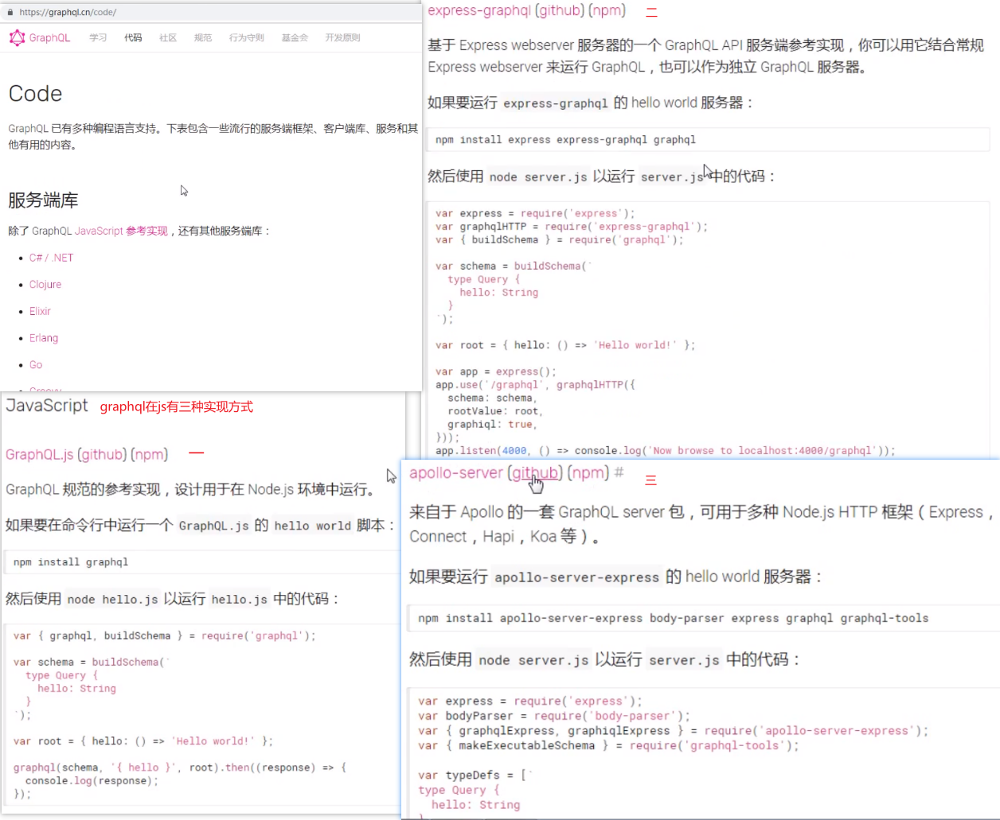
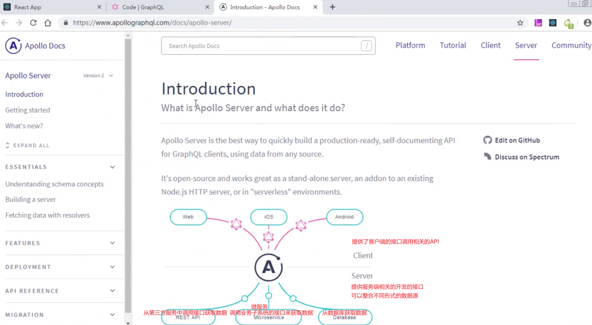

# 第1节 GraphQL 介绍

## 接口开发方式

①RESTful：

RESTful 接口问题

* 接口粒度比较细，很多场景需要调用多次请求才能完成一个功能；
* 后期版本变更不方便，扩展和维护成本高；
* 接口响应的数据格式无法预知（虽然目前json已经成为主流格式）。

②GraphQL：

GraphQL 既是一种用于 API 的查询语言，也是一个满足数据查询的运行时，是一种接口开发标准（GraphQL只是一种标准，一种规范，不是一个具体的框架或库），支持常见的服务端开发语言。例如：java、php、Python、js（Node.js服务端）等。官网：https://graphql.cn/

- 能够精确获取需要的信息；
- 通过单个请求获取各种资源；
- 通过类型系统描述查询；
- 强大的调试工具。


# 第2节 GraphQL 快速体验

GraphQL官网里（其js的实现方式）：



实现方式之`applo-server`：


采用`applo-server`实现方式并结合`express`框架进行开发：


项目运行：


# 第3节 GraphQL服务端开发

标签模板介绍：


GraphQL服务端开发包含：服务端的GraphQL形式的接口开发（重点）、客户端的调用（可借助工具）。

## 基于Node.js的GraphQL的开发

- [GraphQL.js](<https://github.com/graphql/graphql-js/>)  GraphQL规范的JavaScript实现（服务端数据提供和客户端请求）
- [express-graphql](<https://github.com/graphql/express-graphql>)  基于express创建HTTP服务，内部依赖GraphQL.js
- [apollo-server](<https://github.com/apollographql/apollo-server>) GraphQL服务器实现（支持express、koa等多种Web框架）

## 基于apollo-server开发

> apollo-server 是一个实现了GraphQL 规范的框架，可以基于它快速开发基于GraphQL的服务端接口，并且方便客户端进行接口调用。



GraphQL客户端与服务端交互（接口调用）。`applo-server`结合`express`框架的实现步骤：

①服务端：

初始化服务端项目：创建服务端项目目录、创建入口文件、初始化项目`npm init -y`、创建入口文件index.js；

安装依赖包：`npm i apollo-server-express express graphql -S`（apollo-server-express、express、graphql）；

复制官方案例代码到index.js：定义数据类型（服务器通过定义的数据类型规定了可以提供的各种形式的数据）、解析数据（类型的字段要由对应的resolve提供对应的数据解析）、实例化apollo对象、整合apollo-server和express并监听端口；

运行该文件启动服务：提供Web服务（客户端可以根据服务端定义的数据类型选择性查询需要的字段信息）。


②客户端：通过访问<http://localhost:4000/graphql> 地址打开调试工具就可以进行接口测试、在调试工具中进行查询测试、获取测试结果（注：只有一个请求地址；按需进行查询；有特定的查询语法规则）。

```
// 查询，注意：下面的query 可省略
query {
  hello
}
// 响应结果
{
  "data": {
    "hello": "world"
  }
}
```

## 对象类型定义规则

> GraphQL提供一套完善的类型系统，可以约束服务端可以提供哪些数据类型供客户端查询使用

```js
const express = require('express');
const { ApolloServer, gql } = require('apollo-server-express');
const typeDefs = gql`
# 通过type关键字定义类型，type之后是类型名称（自定义名称）
  # 课程类型
  type Course {
    cname: String
    score: Float
  }
  # 学生类型
  type Student {
    sname: String
    scores: [Course]
  }
  # 查询类型
  type Query {
    hello: String
    stu: Student
  }
`;
const resolvers = {
  Query: {
    hello: () => 'Hello world!',
    stu: () => {
      // 这里提供学生相关的数据
      let data = [{
        cname: '数学',
        score: 100
      }, {
        cname: '英语',
        score: 99
      }];
      return {
        sname: '张三',
        scores: data
      }
    }
  },
};
const server = new ApolloServer({ typeDefs, resolvers });
const app = express();
server.applyMiddleware({ app });
app.listen({ port: 4000 }, () =>
  console.log('running...')
);
```


注意：①GraphQL使用#进行注释；②花括号中是对象的字段信息；③属性名称是自定义的；④属性名后面的类型为标量类型（内置类型）。

### 基本参数

>  对象类型上的每一个字段都可能有零个或者多个参数，可以按照条件查询数据

```js
const express = require('express');
const { ApolloServer, gql } = require('apollo-server-express');
const typeDefs = gql`
  # 学生类型
  type Student {
    sname: String
    age: Int
  }
  # 查询类型
  type Query {
    hello: String
    # stu(n: Int): Student
    # 也可以为参数指定默认值（如果有默认值，那么客户端传递的参数就是可选的），如果有多个参数则可以通过逗号的方式进行增加
    stu(n: Int = 11): Student
  }
`;
const resolvers = {
  Query: {
    hello: () => 'Hello world!',
    stu: (obj, args) => {
      // 客户端参数通过resolver函数的第二个参数获取
      console.log(args)
      if(args.n > 10) {
        return {
          sname: 'lisi',
          age: 12
        }
      } else {
        return {
          sname: 'lisi',
          age: 8
        }
      }
    }
  }
};
const server = new ApolloServer({ typeDefs, resolvers });
const app = express();
server.applyMiddleware({ app });
app.listen({ port: 4000 }, () =>
  console.log('running...')
);
```


### 内置类型

前言：查询（Query）和变更（Mutation）类型：内置类型中有两个特殊的类型：Query和Mutation。每一个GraphQL服务都有一个Query类型，也可能有一个Mutation类型，这两个类型本质上也是对象类型，只不过有一点区别：它们作为客户端访问的入口。

#### 标量类型

> 标量类型用于表示基本的字段数据，表示查询数据的叶子节点


```js
const express = require('express');
const { ApolloServer, gql } = require('apollo-server-express');
const uuid = require('uuid'); // uuid()，保证生成唯一的id，需安装依赖：`npm install uuid -S`
const typeDefs = gql`
  type Student {
    id: ID
    sname: String
    age: Int
    gender: Boolean
    score: Float
  }
  # 查询类型
  type Query {
    hello: String
    stu: Student
  }
`;
const resolvers = {
  Query: {
    hello: () => 'Hello world!',
    stu: () => {
      return {
        sname: '123',
        // sname: 123, // 如果数据可以合理地转化成对应的类型，则不会报错（如 Int类型的123 =》 String类型的"123" ）
        // age: 'abc', // 如果不能合理转化则会出错（如 String类型的"abc" => Int类型的abc）
        age: 12,
        gender: true,
        score: 99.5,
        id: uuid()
      }
    }
  }
};
const server = new ApolloServer({ typeDefs, resolvers });
const app = express();
server.applyMiddleware({ app });
app.listen({ port: 4000 }, () =>
  console.log('running...')
);
```


#### 枚举类型

> 枚举类型是一种特殊的标量，它限制在一个特殊的可选值集合内。

```js
const express = require('express');
const { ApolloServer, gql } = require('apollo-server-express');
const typeDefs = gql`
  enum Favour {
    SWIMMING
    DANCING
    CODING
  }
  # 查询类型
  type Query {
    hello: String
    info: Favour
  }
`;
const resolvers = {
  Query: {
    hello: () => 'Hello world!',
    info: () => {
      return 'SWIMMING' // 上述定义表示只能获取三种值之一，其它类型的值是不可以的
      // return 'abc' // 报错
    }
  }
};
const server = new ApolloServer({ typeDefs, resolvers });
const app = express();
server.applyMiddleware({ app });
app.listen({ port: 4000 }, () =>
  console.log('running...')
);
```


#### 列表和非空

> []表示列表，叹号表示非空。
>
> myField: [String!] 表示数组本身可以为空，但是其不能有任何空值成员。myField: [String]! 表示数组本身不能为空，但是其可以包含空值成员。
>

```js
const express = require('express');
const { ApolloServer, gql } = require('apollo-server-express');
const typeDefs = gql`
  type Course {
    cname: String
    score: Float
  }
  type Student {
    sname: String!
    age: Int
    scores: [Course!]!
  }
  # 查询类型
  type Query {
    hello: String
    stu: Student
  }
`;
const resolvers = {
  Query: {
    hello: () => 'Hello world!',
    stu: () => {
      return {
        sname: 'lisi',
        age: 12,
        // scores: [{
        //   cname: '数学',
        //   score: 99.5
        // }, null]
        scores: [{
          cname: '数学',
          score: 99.5
        }, {
          cname: '语文',
          score: 89.5
        }]
      }
    }
  }
};
const server = new ApolloServer({ typeDefs, resolvers });
const app = express();
server.applyMiddleware({ app });
app.listen({ port: 4000 }, () =>
  console.log('running...')
);
```


### 输入类型

> 参数也可以是复杂类型，主要用于变更Mutation场景（需要客户端传递输入类型）

```js
const express = require('express');
const { ApolloServer, gql } = require('apollo-server-express');
const typeDefs = gql`
  # 定义输入类型：input类型主要用于变更操作的数据传递
  input UserInfo {
    uname: String
    pwd: String
  }
  # 用户类型
  type User {
    id: ID
    uname: String
    pwd: String
  }
  # 变更类型：定义Mutation，可以用于接收客户端传递的input类型数据
  type Mutation {
    addUserByInput(userInput: UserInfo): User
  }
  # 查询类型
  type Query {
    hello: String
  }
`;
const resolvers = {
  Query: {
    hello: () => 'Hello world!'
  },
  Mutation: {
    addUserByInput: (obj, args) => {
      return {
        id: 123,
        uname: args.userInput.uname, // 对输入类型，即addUserByInput（传对象），则要在resolver里写上userInput才拿到传过来的数据
        pwd: args.userInput.pwd
      }
    }
  }
};
const server = new ApolloServer({ typeDefs, resolvers });
const app = express();
server.applyMiddleware({ app });
app.listen({ port: 4000 }, () =>
  console.log('running...')
);
```


## 数据解析规则

### resolver函数参数用法

resolves用于给类型字段提供实际数据，resolve函数参数：

- parent：表示当前字段的父级对象，即上一级对象（注意根节点的parent为undefined），如果字段属于根节点（如直接查询下例的hello字段）查询类型通常不会被使用。
- `args` 表示客户端传递过来的参数，可以提供在 GraphQL 查询中传入的参数。
- `context` 可以用于操作数据源，会被提供给所有解析器，并且持有重要的上下文信息比如当前登入的用户或者数据库访问对象。
- `info` 一个保存与当前查询相关的字段特定信息以及 schema（服务端的类型定义）详细信息的值。

```js
const express = require('express');
const { ApolloServer, gql } = require('apollo-server-express');
const typeDefs = gql`
  type Student {
    sname: String
    age: Int 
    favour: String
  }
  # 查询类型
  type Query {
    hello: String
    stu: Student
  }
`;
const resolvers = {
  Student: { // 子节点
    sname: (parent) => { // 通过resolver函数的第一个参数parent可以获取父级对象（里返回的数据）
      console.log(parent) // 后打印
      // return parent.sname; // 默认。如果字段类型（sname）是标量类型，会有一个默认的resolver函数，且该默认函数会返回父级对象的字段数据
      return 'zhangsan'; // 子节点返回的该sname会覆盖父节点返回的sname
    },
    favour: (parent) => {
      if(parent.favour === 'youyong') {
        return 'swimming';
      } else {
        return parent.favour;
      }
    }
  },
  Query: { // 父节点
    hello: () => 'Hello world!',
    stu: (parent) => {
      console.log(parent) // 先打印，为undefined
      return {
        sname: 'lisi',
        age: 12,
        favour: 'youyong'
      }
    }
  }
};
const server = new ApolloServer({ typeDefs, resolvers });
const app = express();
server.applyMiddleware({ app });
app.listen({ port: 4000 }, () =>
  console.log('running...')
);
```


### resolver函数对接数据源

> 通过context参数更加方便的对接数据源（数据库、文件、第三方接口），包括异步操作。

**示例一：**

```js
const express = require('express');
const { ApolloServer, gql } = require('apollo-server-express');
const typeDefs = gql`
  # 查询类型
  type Query {
    hello: String
  }
`;
const resolvers = {
  Query: {
    hello: (parent, args, context) => { // 在resolver函数中可以通过context对象操作数据源
      // 这里获取到操作数据源操作对象之后就可以方便地获取需要的数据，从而返回给客户端
      return context.db;
    }
  }
};
const context = () => { // 例如可以返回一个连接数据库后的实例对象（但一般不这么做，一般会在里面封装一些操作数据的方法）
  return {
    db: 'dbObj'
  }
}
const server = new ApolloServer({ typeDefs, resolvers, context }); // 把context传进去就可以在resolver函数中获取到该context
const app = express();
server.applyMiddleware({ app });
app.listen({ port: 4000 }, () =>
  console.log('running...')
);
```

**示例二：**（三个文件都在项目根目录下）

①数据源文件（data.json）

```json
[
  {
    "sname": "lisi",
    "age": 12
  },
  {
    "sname": "zhangsan",
    "age": 18
  },
  {
    "sname": "wangwu",
    "age": 15
  }
]
```

②读取文件数据业务模块

```js
// db.js代码：从文件中读取数据，本质上与从数据库读取数据类似，都可以是异步操作 // 操作数据源：
const path = require('path');
const fs = require('fs');
module.exports.getData = () => {
  // 读取文件
  let filePath = path.join(__dirname, 'data.json');
  return new Promise((resolve, reject) => {
    fs.readFile(filePath, (err, data) => {
      if(err) {
        reject('error'); // 读取文件失败
      }
      resolve(data.toString()); // 读取文件成功
    })
  })
}
```

③通过context获取数据源操作的对象（context参数主要用于提供数据源相关对象，方便进行数据操作，即数据获取与变更）

```js
// 情况1
const express = require('express');
const { ApolloServer, gql } = require('apollo-server-express');
const db = require('./db.js'); // 从文件中读取数据作为数据源，db.getData()返回Promise实例对象
const typeDefs = gql`
  type Student {
    sname: String
    age: Int
  }
  # 查询类型
  type Query {
    hello: [Student!]!
  }
`;
const resolvers = {
  Query: {
    hello: async (obj, args, context, info) => {
      let ret = await context.db.getData();
      return ret; // 此时直接返回的ret是一个字符串
    }
  }
}
const context = ({req}) => {
  return { db: db }
}
const server = new ApolloServer({ typeDefs, resolvers, context });
const app = express();
server.applyMiddleware({ app });
app.listen({ port: 4000 }, () =>
  console.log('running...')
);
```

```js
// 情况2
const express = require('express');
const { ApolloServer, gql } = require('apollo-server-express');
const db = require('./db.js');
const typeDefs = gql`
  type Student {
    sname: String
    age: Int
  }
  # 查询类型
  type Query {
    hello: [Student!]!
  }
`;
const resolvers = {
  Query: {
    hello: async (parent, args, context, info) => {
      // 这里获取到操作数据源对象之后就可以非常方便的获取需要的数据，从而返回客户端
      let ret = await context.db.getData();
      let obj = JSON.parse(ret);
      return obj;
    }
  }
};
const context = () => {
  return { db: db }
}
const server = new ApolloServer({ typeDefs, resolvers, context });
const app = express();
server.applyMiddleware({ app });
app.listen({ port: 4000 }, () =>
  console.log('running...')
);
```


# 第4节 GraphQL客户端开发

## 基本查询

按需获取需要的数据：

注意：GraphQL只有一个URL地址，客户端查询的所有信息都通过该地址获取数据；可以按照实际的需求获取特定的数据。

## 操作名称

> 有多个操作时，操作名称是必须的，为了调试的方便，推荐所有的查询和变更操作添加操作名。

操作规则：操作类型、操作名称（操作名称自定义）。操作类型主要有两种：①query 用于查询；②mutation 用于变更操作（添加、修改、删除）。

```js
const express = require('express');
const { ApolloServer, gql } = require('apollo-server-express');
const typeDefs = gql`
  # 输入类型
  input UserInfo {
    uname: String
    pwd: String
  }
  # 用户类型
  type User {
    id: ID
    uname: String
    pwd: String
  }
  # 变更类型
  type Mutation {
    addUser(userInfo: UserInfo): User
  }
  # 查询类型
  type Query {
    hello: String
    msg: String
  }
`;
const resolvers = {
  Query: {
    hello: () => 'Hello world!',
    msg: () => 'Hello msg!'
  },
  Mutation: {
    addUser: (obj, args) => {
      return {
        id: 123,
        uname: args.userInfo.uname,
        pwd: args.userInfo.pwd
      }
    }
  }
};
const server = new ApolloServer({ typeDefs, resolvers });
const app = express();
server.applyMiddleware({ app });
app.listen({ port: 4000 }, () =>
  console.log('running...')
);
```


## 查询参数

有时候需要根据特定的条件查询数据，此时可以使用查询参数，即查询字段可以携带参数，并且可以携带多个参数，参数之间通过逗号隔开。

## 变量

> 有时字段的参数需要动态提供，而不是固定的值，此时可以使用变量，其类似于函数中的形参。

注意：变量类型必须是标量、枚举型或输入对象类型；变量可以有默认值  (如$id: Int = 1)；规则变量形参带上一个$前缀。

```js
const express = require('express');
const { ApolloServer, gql } = require('apollo-server-express');
const typeDefs = gql`
  # 课程类型
  type Course {
    cname: String
    score: Float
  }
  # 学生类型
  type Student {
    id: Int
    sname: String
    age: Int
    scores(num: Float): [Course]
  }
  # 查询类型
  type Query {
    hello: String
    stu(id: Int): Student
  }
`;
const resolvers = {
  Student: {
    scores: (parent, args) => {
      return parent.scores&&parent.scores.filter(item => {
        return item.score > args.num; // 每一个Course的score要大于参数中的num（客户端的通过$num传进来的参数）
      });
    }
  },
  Query: {
    hello: () => 'Hello world!',
    stu: (parent, args) => {
      console.log(args)
      if(args.id === 1) {
        return {
          id: 1,
          sname: '张三',
          scores: [{
            cname: '数学',
            score: 99.5
          }, {
            cname: '英语',
            score: 98.5
          }]
        }
      } else {
        return {
          id: 0,
          sname: '---',
          score: null
        }
      }
    }
  }
};
const server = new ApolloServer({ typeDefs, resolvers });
const app = express();
server.applyMiddleware({ app });
app.listen({ port: 4000 }, () =>
  console.log('running...')
);
```


## 指令

> 有时候查询的字段数量不是固定的，此时可以通过指令的方式进行控制。可以通过下面两个指令动态控制查询的字段数量。注意：指令用到的变量，在定义时需要添加!，表示强制必须提供该值。

两个指令：`@include(if: Boolean)` 仅在参数为 `true` 时，包含此字段；`@skip(if: Boolean)` 如果参数为 `true`，跳过此字段。

```js
const express = require('express');
const { ApolloServer, gql } = require('apollo-server-express');
const typeDefs = gql`
  # 学生类型
  type Student {
    id: Int
    sname: String
    gender: Boolean
  }
  # 查询类型
  type Query {
    hello: String
    stu(id: Int): Student
  }
`;
const resolvers = {
  Query: {
    hello: () => 'Hello world!',
    stu: (parent, args) => {
      if(args.id === 1) {
        return {
          id: 123,
          sname: '张三',
          gender: true
        }
      } else {
        return {
          id: 0,
          sname: '---',
          gender: false
        }
      }
    }
  }
};
const server = new ApolloServer({ typeDefs, resolvers });
const app = express();
server.applyMiddleware({ app });
app.listen({ port: 4000 }, () =>
  console.log('running...')
);
```


## 别名

> 有时需要通过不同参数值查询相同字段信息，比如同时查询学生的数学和英语成绩。可以通过别名的方式获取特定某几项数据（查询结果的数据格式相同）。

```js
const express = require('express');
const { ApolloServer, gql } = require('apollo-server-express');
const typeDefs = gql`
  # 课程类型
  type Course {
    cname: String
    score: Float
  }
  # 学生类型
  type Student {
    id: Int
    sname: String
    age: Int
    scores(cname: String): [Course]
  }
  # 查询类型
  type Query {
    hello: String
    stu: Student
  }
`;
const resolvers = {
  Student: {
    scores: (parent, args) => {
      if(args.cname === '数学' || args.cname === '英语') {
        return parent.scores.filter(item => {
          return item.cname === args.cname;
        });
      } else {
        return parent.scores;
      }
    }
  },
  Query: {
    hello: () => 'Hello world!',
    stu: (parent, args) => {
      return {
        id: 1,
        sname: '张三',
        scores: [{
          cname: '数学',
          score: 99.5
        }, {
          cname: '英语',
          score: 98.5
        }, {
          cname: '语文',
          score: 97.5
        }]
      }
    }
  }
};
const server = new ApolloServer({ typeDefs, resolvers });
const app = express();
server.applyMiddleware({ app });
app.listen({ port: 4000 }, () =>
  console.log('running...')
);
```


## 变更

> 改变服务器数据需要用到变更（mutation）操作，参数的传递可以通过普通参数，也可以使用输入类型，一般较为复杂的数据采用输入类型。

```js
const express = require('express');
const { ApolloServer, gql } = require('apollo-server-express');
const typeDefs = gql`
  # 输入类型
  input UserInfo {
    uname: String
    pwd: String
  }
  # 用户类型
  type User {
    id: ID
    uname: String
    pwd: String
  }
  # 变更类型。注意下面userInput变量并非标准类型，而是一个输入类型。
  type Mutation {
    addUserByInput(userInput: UserInfo): User
    addUserByParam(uname: String, pwd: String): User
  }
  # 查询类型
  type Query {
    hello: String
  }
`;
const resolvers = {
  Query: {
    hello: () => 'Hello world!'
  },
  Mutation: {
    addUserByParam: (obj, args) => {
      return {
        id: 123,
        uname: args.uname,
        pwd: args.pwd
      }
    },
    addUserByInput: (obj, args) => {
      return {
        id: 456,
        uname: args.userInput.uname, // 注意要写上userInput
        pwd: args.userInput.pwd
      }
    }
  }
};
const server = new ApolloServer({ typeDefs, resolvers });
const app = express();
server.applyMiddleware({ app });
app.listen({ port: 4000 }, () =>
  console.log('running...')
);
```


# 第5节 留言板案例实战

## 服务端实现

初始化项目；类型定义；数据解析（留言板信息，友情链接信息，天气预报信息，添加留言功能）。

```js
const express = require('express');
const { ApolloServer, gql } = require('apollo-server-express');
const comment = require('./data-file.js');
const link = require('./data-db.js');
const weather = require('./data-api.js');
// 提供数据源操作的对象
const context = () => {
  return {
    comment,
    weather,
    link
  }
}
const typeDefs = gql`
  input CommentInput {
    username: String
    content: String
  }
  type Comment {
    username: String
    content: String
    date: String
  }
  type Link {
    lname: String 
    lurl: String
  }
  type Weather {
    wea: String 
    temp: String
  }
  type Data {
    list: [Comment]
    link: [Link]
    weather: Weather
  }
  type Query {
    info: Data
  }
  type Mutation {
    createComment(commentInput: CommentInput): Comment
  }
`;
const resolvers = {
  Mutation: {
    createComment: async (parent, args, context) => {
      // 接收客户端传递的数据，把数据保存在文件中
      let ret = await context.comment.setData(args.commentInput.username, args.commentInput.content);
      if(ret === 'success') {
        // 添加成功
        return {
          username: args.commentInput.username,
          content: args.commentInput.content
        }
      }
    }
  },
  Query: {
    info: async (parent, args, context) => {
      // 留言板列表数据
      let ret = await context.comment.getData();
      let list = JSON.parse(ret);
      // 友情链接数据
      let link = await context.link.getData();
      // 天气数据
      let weather = await context.weather.getData();
      return {
        list: list,
        link: link,
        weather: weather
      }
    }
  }
};
const server = new ApolloServer({ typeDefs, resolvers, context });
const app = express();
server.applyMiddleware({ app });
app.listen({ port: 4000 }, () =>
  console.log('running...')
);
```

对接数据源（通过context）：对接评论信息数据源；对接友情链接数据源；对接天气数据源；实现数据源整合，完成响应数据的resolver函数功能。


## 客户端实现

初始化项目；实现布局效果；对接后台GraphQL接口（基于apollo-server客户端）。

###  apollo-server对接后台接口


1. 安装相关依赖包：`npm install --save vue-apollo graphql apollo-boost`；
2. 配置Vue的apollo插件（VueApollo）；

3. 实例化apollo客户端对象（apolloProvider）；

4. 将apollo客户端实例对象挂载到Vue实例中；


5. 导入GraphQL相关api：`import gql from 'graphql-tag';`；
6. 调用GraphQL后台接口（注意apollo属性）；

```vue
<template>
  <div class="content">
    <div class="wrap">
      <form>
        <div class="box">
          <textarea name="content" v-model='content'></textarea>
        </div>
        <div class="publish">
          您的大名：
          <input type="text" autocomplete="off" v-model='username'>
          <button  class="W_btn" @click.prevent='send'>发布</button>
        </div>
      </form>
    </div>
    <div class="list">
      <ul>
        <li :key='index' v-for='(item, index) in info.list'>
          
          <div class="list_con">
            <div class="time">
              <strong>发表时间:  <i>{{item.date | formatDate('YYYY-MM-DD hh:mm:ss')}}</i></strong>
              
            </div>
            <p><b>{{item.username}}：</b>{{item.content}}</p>
          </div>
        </li>
      </ul>
    </div>
    <div class="link">
      <a :key='index' :href="item.lurl" v-for='(item, index) in info.link'>{{item.lname}}</a>
    </div>
    <div class="weather">
      <div>天气：{{info.weather.wea}}</div>
      <div>温度：{{info.weather.temp}}</div>
    </div>
  </div>
</template>
<script>
// 导入apollo客户端相关api
import gql from 'graphql-tag';
const QueryListTag = gql`
  query info {
    info {
      list {
        username
        content
        date
      }
      link {
        lname
        lurl
      }
      weather {
        wea 
        temp
      }
    }
  }
`
export default {
  name: 'Comment',
  apollo: { // 自动调用，发送请求，返回数据自动赋值给data中的info
    info: {
      query: QueryListTag
    }
  },
  data () {
    return {
      // info表示服务端返回的数据
      info: {
        list: [],
        link: [],
        weather: {}
      },
      username: '',
      content: ''
    }
  },
  methods: {
    send: function() {
      // console.log(this.username, this.content)
      // 把表单的数据通过接口提交到服务器
      this.$apollo.mutate({
        mutation: gql`
          mutation createComment($commentInput: CommentInput) {
            createComment(commentInput: $commentInput) {
              username
              content
            }
          }
        `,
        variables: { // 传入的变量的写法
          commentInput: {
            username: this.username,
            content: this.content
          }
        },
        refetchQueries: [{ // 发送之后重新请求一次数据进行查询
          query: QueryListTag
        }]
      })
    }
  }
}
</script>
```


