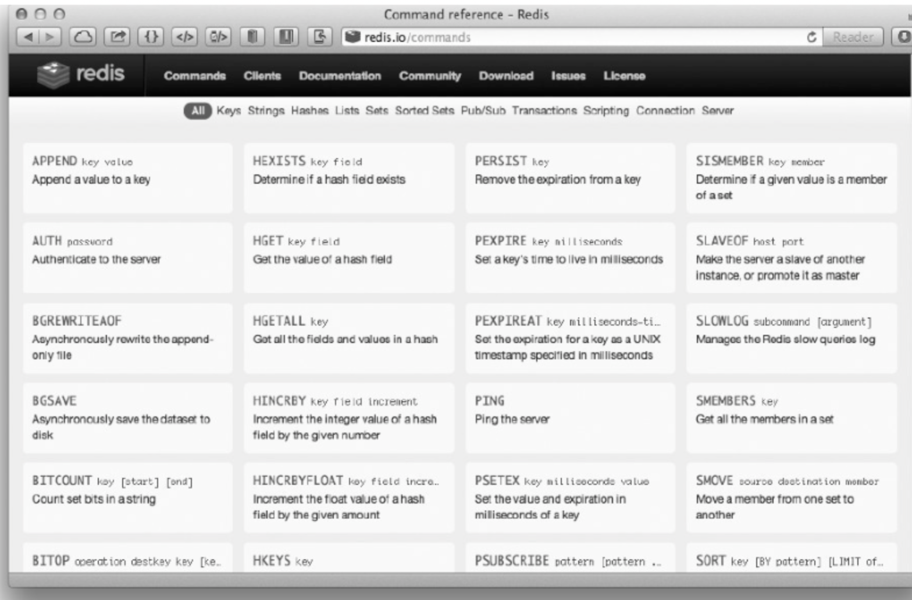
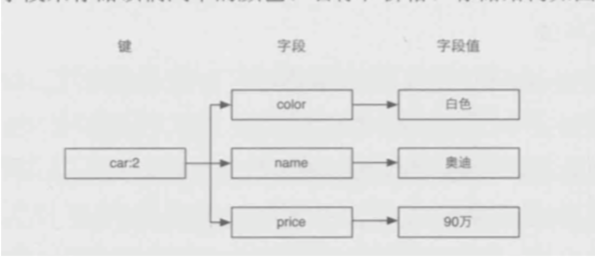
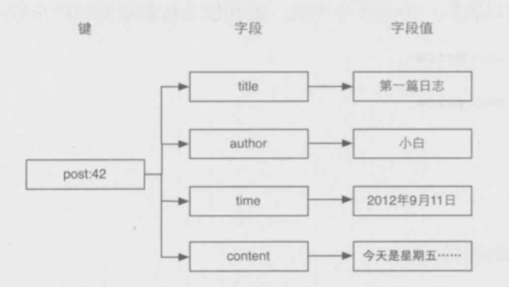
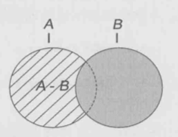
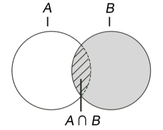
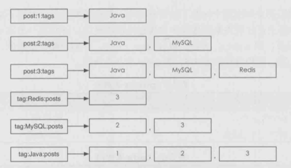
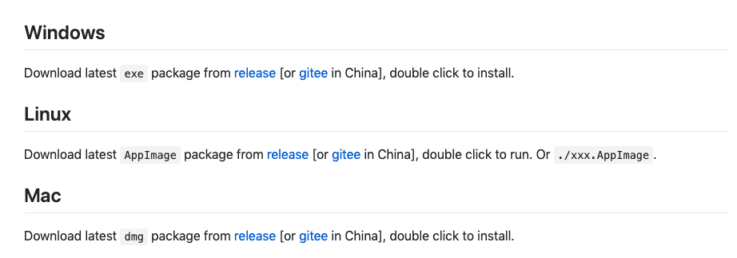
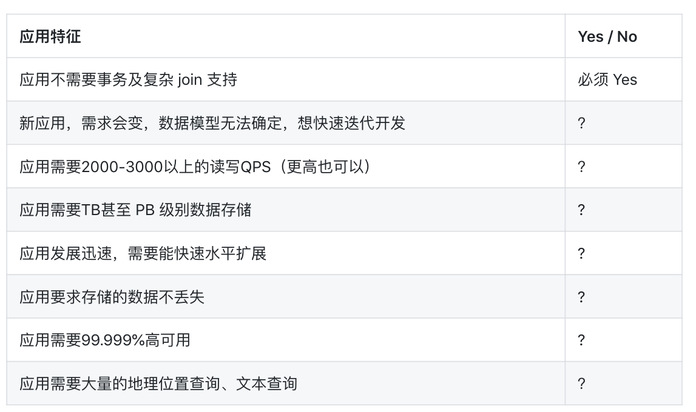
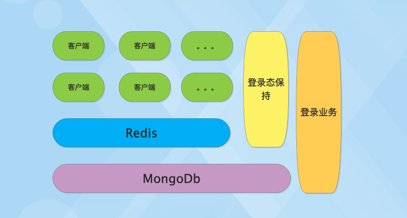
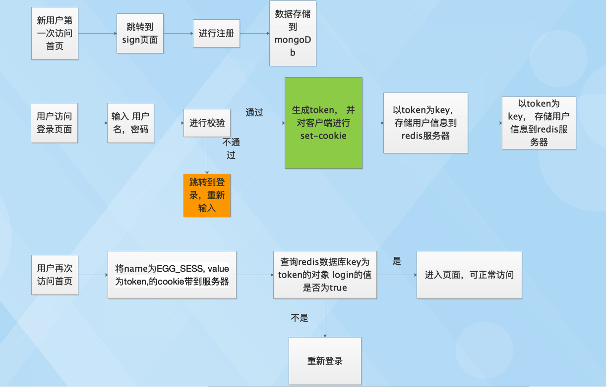

# NoSQL数据库

## 第一章 Redis

- 特点
- api
- 结合nodejs应用

### 历史与发展

>  2008年，意大利的一家创业公司Merzia[ [http://merzia.com](http://merzia.com/)]推出了一款基于MySQL的网站实时统计系统LLOOGG[ [http://lloogg.com](http://lloogg.com/)]，然而没过多久该公司的创始人Salvatore Sanfilippo便开始对MySQL的性能感到失望，于是他决定亲自为LLOOGG量身定做一个数据库，并于2009年开发完成，这个数据库就是Redis。不过Salvatore Sanfilippo并不满足只将Redis用于LLOOGG这一款产品，而是希望让更多的人使用它，于是在同一年Salvatore Sanfilippo将Redis开源发布，并开始和Redis的另一名主要的代码贡献者Pieter Noordhuis一起继续着Redis的开发，直到今天。

### 特点

**redis究竟有什么魅力，吸引了如此多的用户?**

- 存储结构特别-字典
- 内存存储与持久化- 缓存
- 功能丰富
- 简单稳定- 简单可依赖

#### 存储结构

Redis是 REmote DIctionary Server (远程字典服务器)的缩写，它以**字典**结构存储数据。

> 字典就是js中的object
>
> 在js中key只能是字符串

同大多数语言中的字典一样，Redis字典的键值除了可以是字符串，也可以是其他数据类型。

- 字符串
- 散列
- 列表
- 集合
- 有序集合

>字典： 类似 js中的object就是一种典型的字典结构。

##### ex：

我们在post变量中存储了一篇文章的数据  (标题， 正文， 阅读量)

```js
post.titile = 'hello'
post.content = 'balabala'
post.views = 0
post.tags = ['php', 'java', 'nodejs']
```

假如需要通过tag检索出文章，关系型数据库mysql需要建3张表，而且查询非常复杂。

但是使用Redis可以对tags进行 交集，并集这样的集合运算操作。可以很轻易的实现对tags的各种查询要求。

#### 内存存储与持久化

Redis数据库中所有的数据都存在内存中。一台普通的笔记本电脑，redis一秒可读写超过10万个键值对。

但是，数据存在内存中程序退出后会导致数据丢失。不过redis也提供了对数据持久化的支持。

> 在浏览器里面数据持久化可以理解为： localStorage, cookie

#### 功能丰富

应用场景丰富，redis名副其实的多面手。

- 缓存
- 队列系统

1. redis可以为每个key设置生存时间，到期会自动删除，这一功能配合出色的性能能让它作为缓存系统来使用。由于redis支持持久化和丰富的数据类型，也使其成为了Memcached的竞争者。


2. 作为缓存系统，redis还可以限定数据占的最大空间，超过后自动删除不需要的key。
3. redis的列表类型键还可以用来实现队列，并且支持阻塞式读取，可以很容易实现一个高性能的优先级队列。
4. redis还支持"发布/订阅"，可以基于此构建聊天室等系统。

#### 简单稳定

即使功能再丰富，如果使用起来太复杂也很难吸引人。

1. Redis直观的存储结构使得通过程序与Redis交互十分简单，在Redis中使用命令来读写数据，命令语句之于Redis就相当于SQL语言之于关系数据库。

##### ex: 

在关系数据库中要获取posts表内id为1的记录的title字段的值可以使用如下SQL语句实现：

```sql
SELECT title FROM posts WHERE id=1 LIMIT 1
```

redis这么读

```redis
HGET post:1 title
```

其中HGET就是一个命令。Redis提供了一百多个命令（如图1-2所示），听起来很多，但是常用的却只有十几个，并且每个命令都很容易记忆，其实比SQL语句要简单很多。



2. Redis使用C语言开发，代码量只有3万多行。这降低了用户通过修改Redis源代码来使之更适合自己项目需要的门槛。对于希望“榨干”数据库性能的开发者而言，这无疑是一个很大的吸引力。

### Redis安装

> “纸上得来终觉浅，绝知此事要躬行。”
> ——陆游《冬夜读书示子聿》

- Mac OS

```shell
brew install redis
```

> Brew 就是 homebrew

#### 启动

```
redis-server
```

默认端口6379,修改端口

```
redis-server --port 6389
```

#### 初始化配置文件

每次redis服务启动的时候都会读取 `redis.conf`

mac os的路径在`/usr/local/etc/redis.conf`

```shell
# Redis默认不是以守护进程的方式运行，可以通过该配置项修改，使用yes启用守护进程
# 启用守护进程后，Redis会把pid写到一个pidfile中，在/var/run/redis.pid
daemonize no

# 当Redis以守护进程方式运行时，Redis默认会把pid写入/var/run/redis.pid文件，可以通过pidfile指定
pidfile /var/run/redis.pid

# 指定Redis监听端口，默认端口为6379
# 如果指定0端口，表示Redis不监听TCP连接
port 6379

# 绑定的主机地址
# 你可以绑定单一接口，如果没有绑定，所有接口都会监听到来的连接
bind 127.0.0.1
# 也就是本机

# 当客户端闲置多长时间后关闭连接，如果指定为0，表示关闭该功能
timeout 0

# 指定日志记录级别，Redis总共支持四个级别：debug、verbose、notice、warning，默认为verbose
# debug (很多信息, 对开发／测试比较有用)
# verbose (many rarely useful info, but not a mess like the debug level)
# notice (moderately verbose, what you want in production probably)
# warning (only very important / critical messages are logged)
loglevel verbose

# 日志记录方式，默认为标准输出，如果配置为redis为守护进程方式运行，而这里又配置为标准输出，则日志将会发送给/dev/null
logfile stdout

# 设置数据库的数量，默认数据库为0，可以使用select <dbid>命令在连接上指定数据库id
# dbid是从0到‘databases’-1的数目
databases 16

################################ SNAPSHOTTING  #################################
# 指定在多长时间内，有多少次更新操作，就将数据同步到数据文件，可以多个条件配合
# Save the DB on disk:
#
#   save <seconds> <changes>
#
#   Will save the DB if both the given number of seconds and the given
#   number of write operations against the DB occurred.
#
#   满足以下条件将会同步数据:
#   900秒（15分钟）内有1个更改
#   300秒（5分钟）内有10个更改
#   60秒内有10000个更改
#   Note: 可以把所有“save”行注释掉，这样就取消同步操作了

save 900 1
save 300 10
save 60 10000

# 指定存储至本地数据库时是否压缩数据，默认为yes，Redis采用LZF压缩，如果为了节省CPU时间，可以关闭该选项，但会导致数据库文件变的巨大
rdbcompression yes

# 指定本地数据库文件名，默认值为dump.rdb
dbfilename dump.rdb

# 工作目录.
# 指定本地数据库存放目录，文件名由上一个dbfilename配置项指定
# 
# Also the Append Only File will be created inside this directory.
# 
# 注意，这里只能指定一个目录，不能指定文件名
dir ./


```

#### redis-cli简易使用

类似node命令，交互式命令行客户端。

```
redis-cli
```

**关闭连接**

考虑到Redis有可能正在将内存中的数据同步到硬盘中，强行终止Redis进程可能会导致数据丢失。正确停止Redis的方式应该是向Redis发送SHUTDOWN命令，方法为：

```
SHUTDOWN
```

### redis命令行客户端

redis-cli执行时会自动按照默认配置（服务器地址为127.0.0.1，端口号为6379）连接Redis，通过-h和-p参数可以自定义地址和端口号：

```shell
redis-cli -h 127.0.0.1 -p 6379
```
#### ex:
- ping

  ```
  PING
  ```

- Echo hi

  ```
  ECHO hi
  ```
#### 命令返回值
##### 状态回复

PING

> PONG

##### 错误回复

随便输入一个不存在的命令

>  (error) ERR unknown command `asdasd`, with args beginning with:

##### 整数回复

**Redis Incr 命令将 key 中储存的数字值增一。**

如果 key 不存在，那么 key 的值会先被初始化为 0 ，然后再执行 INCR 操作。

如果值包含错误的类型，或字符串类型的值不能表示为数字，那么返回一个错误。

本操作的值限制在 64 位(bit)有符号数字表示之内。

```shell
incr abc
set abc 20
incr abc
```

##### 字符串回复

```shell
127.0.0.1:6379> get foo
(nil)
```

##### 多行字符串回复

```
127.0.0.1:6379> keys *
```

#### 配置

也可以通过cli的方式去修改`/usr/local/etc/redis.conf`中的配置

```
config set loglevel warning
```

#### 多数据库

而实际上一个Redis实例提供了多个用来存储数据的字典，客户端可以指定将数据存储在哪个字典中。这与我们熟知的在一个关系数据库实例中可以创建多个数据库类似，所以可以将其中的每个字典都理解成一个独立的数据库。
每个数据库对外都是以一个从0开始的递增数字命名，Redis默认支持16个数据库，可以通过配置参数databases来修改这一数字。客户端与Redis建立连接后会自动选择0号数据库，不过可以随时使用SELECT命令更换数据库，如要选择1号数据库：

```shell
redis>SELECT 1
OK
redis [1]>GET foo
(nil)
```

然而这些以数字命名的数据库又与我们理解的数据库有所区别。首先Redis不支持自定义数据库的名字，每个数据库都以编号命名，开发者必须自己记录哪些数据库存储了哪些数据。另外Redis也不支持为每个数据库己记录哪些数据库存储了哪些数据。**另外Redis也不支持为每个数据库设置不同的访问密码，所以一个客户端要么可以访问全部数据库，要么连一个数据库也没有权限访问。**最重要的一点是多个数据库之间并不是完全隔离的，比如FLUSHALL命令可以清空一个Redis实例中所有数据库中的数据。综上所述，这些数据库更像是一种命名空间，而不适宜存储不同应用程序的数据。**比如可以使用0号数据库存储某个应用生产环境中的数据，使用1号数据库存储测试环境中的数据，但不适宜使用0号数据库存储A应用的数据而使用1号数据库存储B应用的数据，不同的应用应该使用不同的Redis实例存储数据**。由于redis非常轻量级，一个空Redis实例占用的内存只有1MB左右，所以不用担心多个Redis实例会额外占用很多内存。

### Redis数据类型

了解过redis基础知识后，进入真正的redis世界。

1. 获得符合规则的键名列表

```
KEYS pattern
```


> keys会遍历redis中所有的键，当数量过多时会影响性能，不建议使用。
>
> redis命令不区分大小写。

2. 判断一个键是否存在

`EXISTS key`

如果键存在则返回整数类型1，否则返回0。

3. 删除键

`DEL key [key …]`

可以删除一个或多个键，返回值是删除的键的个数。

**如何删除多个key？**

  利用linux的管道 xargs。

4. 获得键值的数据类型

```shell
redis＞SET foo 1
OK

redis＞TYPE foo
string

redis＞LPUSH bar 1
(integer) 1

redis＞TYPE bar
list

```

> LPUSH命令的作用是向指定的列表类型键中增加一个元素，如果键不存在则创建它，后面会详细介绍。

#### 字符串类型

##### 介绍

>  字符串类型是Redis中最基本的数据类型，它能存储任何形式的字符串，包括二进制数据。你可以用其存储用户的邮箱、JSON化的对象甚至是一张图片。一个字符串类型键允许存储的数据的最大容量是512MB。
>
> JSON化的对象： JSON.stringfy()

##### 命令

1. 赋值与取值

`SET key value`

2. 递增数字

`INCR num` 

```
SET foo bar
INCR foo
```

有同学可能会想到可以借助GET和SET两个命令自己实现incr函数，伪代码如下：

1. 会通过 key取值
2. 判断是否有值
3. 如果没有就归 0， 有呢就进行+1操作

```js
function incr($key) {
	var $value = redis.get($key);
  if(!$value) {
     $value = 0;
 	} else {
    $value = $value + 1; // $value = 5
    return $value
  }
}
```

> 如果 Redis 同时只连接了一个客户端，那么上面的代码没有任何问题（其实还没有加入错误处理，不过这并不是此处讨论的重点）。可当同一时间有多个客户端连接到Redis时则有可能出现竞态条件（race condition）[3] 。例如有两个客户端A 和B 都要执行我们自己实现的 incr 函数并准备将同一个键的键值递增，当它们恰好同时执行到代码第二行时二者读取到的键值是一样的，如“5”，而后它们各自将该值递增到“6”并使用 SET 命令将其赋给原键，结果虽然对键执行了两次递增操作，最终的键值却是“6”而不是预想中的“7”。这一部分跟 "事务"，举个例子： 付款与扣款，能讲整个流程的状态初始化。

##### ex: 文章访问量统计(标题， 正文，访问量)

博客的一个常见的功能是统计文章的访问量，我们可以为每篇文章使用一个名为post:文章ID:page.view的键来记录文章的访问量，每次访问文章的时候使用INCR命令使相应的键值递增。 

- 以 post:文章id:page 存储文章信息
- 以post:文章id:page.view 存储访问量 

> Redis 对于键的命名并没有强制的要求，但比较好的实践是用“对象类型:对象ID:对象属性”来命名一个键，如使用键user:1:friends来存储ID为1的用户的好友列表。
>

```js
// 字符串 
// 存储过程
var redis = require('redis');
var client = new redis({
//一些配置
});

var $post_id = client.incr('post:count');

var $airticle = JSON.stringify({
    title: 'hello',
    content: 'world',
    views: 0
})

// 赋值
client.set(`post:${$post_id}:data ${$airticle}`);

// 读取过程
var airticle = client.get('post:1:data');
var data = JSON.parse(airticle);

// 每次访问文章 都会调用 
var $post_id = client.incr('post:count');
```

##### 命令扩展

1. 增加指定的整数

`INCRBY key increment` 

2. 减少指定的整数

`DECR key`

`DECRBY key decrememt`

3. 增加指定浮点数

`INCRBYFLOAT key increment`

```shell
redis> INCRBYFLOAT bar 2.7 "6.7" 
redis> INCRBYFLOAT bar 5E+4 "50006.69999999999999929"
```

4. 向尾部追加值

`APPEND key value`

APPEND作用是向键值的末尾追加value。如果键不存在则将该键的值设置为value，即相当于 SET key value。返回值是追加后字符串的总长度。

5. 获取字符串长度

`STRLEN key`

> 前面提到了字符串类型可以存储二进制数据，所以它可以存储任何编码的字符串。例子中Redis接收到的是使用UTF-8编码的中文，由于“你”和“好”两个字的UTF-8编码的长度都是3，所以此例中会返回6。
>

6. 获取/设置多个键值

`MGET` `MSET`

```
MSET key1 v1 key2 v2
MGET key1 key2
```

7. 位操作

`GETBIT key offset`

```
SET foo bar
```

b,a,r 对应的ASCII码分别为98，97，114。转换成二进制分别为 1100010， 1100001， 1110010。

> 所有的文字： 英文 ，汉子，汉语，日语，符号。。。其实都是通过数字。


```
GETBIT foo 0
GETBIT foo 6
```

> 利用位操作可以非常紧凑的存储布尔值。比如如果需要存储 "男，女"。如果用数字0，1存储则需要 100万字节 约等于 1M， 但是如果用二进制存储只需要 100K左右, 只占用计算机的一个位。
>
> 再举个例子：
>
> 假如我们的id是从 1000000开始递增，我们则可以先减去1000000再进行递增存储，这样可以节约空间。

### 散列类型

假设我只想读取文章的标题，但是会需要把所有文章相关的信息都拿过来反序列化(标题，正文，阅读量。。。)，会造成资源的浪费。

不仅读取有这个问题，修改也有这个问题。

**所以，散列解决了这个问题。**

#### 介绍

散列适合存储对象：使用对象类别和ID构成键名，使用字段表示对象的属性，而字段值则存储属性值。

##### ex: 汽车数据模型

这是一种二维的数据结构。




回想 mysql数据库结构。


假设某些数据需要新增一个字段：


对于2，3这两天数据来说data是多余的，这样会变得越来越难维护。为了解决这个问题，必须新建额外的表进行关联。

>  而redis的散列类型不存在这个问题，我们可以为任何键新增或删除字段而不影响其它。

#### 命令

1. 赋值与取值

```
redis> HSET car price 500 
(integer) 1 
redis> HSET car name BMW 
(integer) 1 
redis> HGET car name "BMW"


```

> HSET 命令的方便之处在于不区分插入和更新操作，这意味着修改数据时不用事先判断字段是否存在来决定要执行的是插入操作（update）还是更新操作（insert）。当执行的是插入操作时（即之前字段不存在）HSET命令会返回1，当执行的是更新操作时（即之前字段已经存在）HSET命令会返回0。更进一步，当键本身不存在时，HSET命令还会自动建立它。

2.获取键中所有的字段和值

```
redis> HGETALL car 
1) "price" 
2) "500" 
3) "name" 
4) "BMW"
```

> 不要担心结构不好用，在nodejs中会把返回值封装成js的object

```js
redis.hgetall("car", function (error, car) { 
	//hgetall 方法的返回的值被封装成了 JavaScript的对象 
	console.log(car.price);
}
```

3.判断字段是否存在

`HEXISTS key field`

```shell
redis> HEXISTS car model 
(integer) 0 
redis> HSET car model C200 
(integer) 1 
redis> HEXISTS car model 
(integer) 1
```

4. 增加数字

`HINCRBY key field increment`

```shell
redis> HINCRBY person score 60 
(integer) 60
```

5.删除字段

`HDEL key field [field …]`

```shell
redis> HDEL car price 
(integer) 1 
redis> HDEL car price 
(integer) 0
```

#### 实践

刚才存储文章的例子，需要序列化和反序列化之后在进行读写。会造成2个问题：

1. 会产生竞态， 2个客户端同时操作会冲突，最终只有一个属性被修改。没有原子化操作
2. 每次修改或者读取都需要反序列化，消耗性能。

新增一个需求，一般文章都会有缩略名。比如文章的标题叫做"This is a great post"，它的缩略名可以为"this-is-a-greate-post"。缩略名可以用于生成文章的地址栏或者其它用处。

##### 使用散列改造



```c
// 散列其实就是hash  hget hset
var redis = require('redis');
var client = new redis({
//一些配置
});

// # 1. 文章的赋值
// # 自增的id 
var $post_id = client.incr('posts:count');
var $slug = 'hello-world';
var $title = 'hello world';
var $content = 'xxxxxxxxxxxxx';
var views = 0;
// # 文章的缩略名和id互相有一个引用来维持关系  slug.to.id
// # HSETNX 也是赋值  如果这个值已经存在 则返回0，并且赋值失败  反之返回1， 赋值成功
var isSlug = client.hsetnx(`slug.to.id ${$slug} ${$post_id}`);

// # 1.通过散列去存储文章
if(isSlug === 0) {
    client.exit();
} else {
    client.hmset(`post:${$post_id} title ${$title} content ${$content} views ${$views}`)
}

// # 2. 读取文章
var postID = client.hget('slug.to.id $slug'); 
if (!postID) {
    client.exit('文章不存在')
} else {
    var post = client.hgetall(`post:${postID}`, (err, data) => {
        console.log(data)
    })
}

// # 3.修改缩略名
// # 加入你要给id=42的文章  修改缩略名
var newSlug = 'xxx';
var isSlugExit = client.hsetnx(`slug.to.id ${newSlug} 42`) 

if(isSlugExit === 0) {
    exit('缩略名已存在，请换其它')
} else {
    var oldSlug = client = client.hget(`post:42 slug`);
    client.hset(`post:42 slug ${newSlug}`);
    client.hdel(`slug.to.id ${$oldSlug}`);
}


```

#### 命令补充

1. 只获取字段名或字段值

`HKEYS key`

`HVALS key`

2. 获得字段数量

`HLEN key`

### 列表类型

#### 介绍

列表类型可以存储一个有序的字符串列表，常用的操作是向列表两端添加元素，或者获得列表的某一个片段。

> 列表类型内部是使用双向链表（double linked list）实现的，所以向列表两端添加元素的时间复杂度为O(1)，获取越接近两端的元素速度就越快。这意味着即使是一个有几千万个元素的列表，获取头部或尾部的10条记录也是极快的（和从只有20个元素的列表中获取头部或尾部的10条记录的速度是一样的）。不过使用链表的代价是通过索引访问元素比较慢。

和js的数组有什么区别？

- 在js里面数组其实也是对象，字典
- redis的列表却是链表

#### 命令

1. 向列表两端增加元素

`LPUSH key value [value …]`

`RPUSH key value [value …]`

```shell
redis> LPUSH numbers 1 
(integer) 1
```

2. 从列表两端弹出元素

`LPOP key`

`RPOP key`

3. 获取列表中元素的个数

`LLEN key`

4. 获取列表片段

`LRANGE key start stop`

> LRANGE 0 -1 可以获取列表中所有的元素

5. 删除列表中指定的值

`LREM key count value`

LREM命令会删除列表中前count个值为value的元素，返回值是实际删除的元素个数。根据count值的不同，LREM命令的执行方式会略有差异。

（1）当 count > 0时 LREM 命令会从列表左边开始删除前 count 个值为 value的元素。 

（2）当 count < 0时 LREM 命令会从列表右边开始删除前|count|个值为 value 的元素。

（3）当 count = 0是 LREM命令会删除所有值为 value的元素。例如：

#### ex：储存文章id列表

新增需求： 我们存储的文章需要展示许多条，如何做分页功能。

> 为了解决这个问题，我们使用列表类型键posts:list记录文章ID列表。当发布新文章时使用LPUSH命令把新文章的ID加入这个列表中，另外删除文章时也要记得把列表中的文章ID 删除，就像这样：LREM posts:list 1 要删除的文章 ID

有了文章 ID列表，就可以使用 LRANGE命令来实现文章的分页显示了。伪代码如下：

```js
var redis = require('redis');
var client = new redis({
    // 配置
});

var currentPage = 1;

var listLength = 10;
var start = (currentPage - 1) * listLength;
var end = currentPage * listLength - 1;
var postIdArr = client.lrange(`post:list ${start} ${end}`);

postIdArr.forEach(id => {
    client.hgetall(`post:${id}`, (data) => {
        console.log(data)
    });
});
```

> 美中不足的一点是散列类型没有类似字符串类型的 MGET命令那样可以通过一条命令同时获得多个键的键值的版本，所以对于每个文章ID都需要请求一次数据库，也就都会产生一次往返时延（round-trip delay time）[11] ，之后我们会介绍使用管道和脚本来优化这个问题。
>
> 另外使用列表类型键存储文章ID列表有以下两个问题。 
>
> （1）文章的发布时间不易修改：修改文章的发布时间不仅要修改post:文章ID中的time字段，还需要按照实际的发布时间重新排列posts:list中的元素顺序，而这一操作相对比较繁琐。 
>
> （2）当文章数量较多时访问中间的页面性能较差：前面已经介绍过，列表类型是通过链表实现的，所以当列表元素非常多时访问中间的元素效率并不高。

#### ex: 存储评论列表

在博客中还可以使用列表类型键存储文章的评论。由于博客不允许访客修改自己发表的评论，而且考虑到读取评论时需要获得评论的全部数据（评论者姓名，联系方式，评论时间和评论内容），不像文章一样有时只需要文章标题而不需要文章正文。所以适合将一条评论的各个元素序列化成字符串后作为列表类型键中的元素来存储。

```js
var commentsStr = JSON.stringify({
    author: 'xxx',
    time: 'xxx',
    content: 'xxx',
})

client.lpush('post:id:comment', commentsStr);
```

#### 命令补充

1. 获得/设置指定索引的元素值

   `LINDEX key index `

   `LSET key index value`

2. 只保留列表指定片段

   `LTRIM` 命令可以删除指定索引范围之外的所有元素，其指定列表范围的方法和LRANGE命令相同。就像这样：

   ```
   redis> LRANGE numbers 0 -1 
   1) "1" 
   2) "2" 
   3) "7" 
   4) "3" 
   redis> LTRIM numbers 1 2 
   OK 
   redis> LRANGE numbers 0 1 
   1) "2"
   2) "7"
   ```
   
   LTRIM命令常和LPUSH命令一起使用来限制列表中元素的数量，比如记录日志时我们希望只保留最近的100条日志，则每次加入新元素时调用一次LTRIM命令即可：
   
   ```
   LPUSH logs $newLog 
   LTRIM logs 0 99
   ```
   
3. 向列表中插入元素

   `LINSERT key BEFORE|AFTER pivot value`

   LINSERT 命令首先会在列表中从左到右查找值为 pivot 的元素，然后根据第二个参数是BEFORE还是AFTER来决定将value插入到该元素的前面还是后面。 

   LINSERT命令的返回值是插入后列表的元素个数。示例如下：

   ```
   redis> LRANGE numbers 0 -1 
   1) "2" 
   2) "7"
   3) "0" 
   redis> LINSERT numbers AFTER 7 3 
   (integer) 4 
   redis> LRANGE numbers 0 -1 
   1) "2" 
   2) "7" 
   3) "3" 
   4) "0" 
   redis> LINSERT numbers BEFORE 2 1 
   (integer) 5 
   redis> LRANGE numbers 0 -1 
   1) "1" 
   2) "2" 
   3) "7" 
   4) "3" 
   5) "0"
   ```

4. 将元素从一个列表转到另一个列表

   `RPOPLPUSH source destination`

   RPOPLPUSH是个很有意思的命令，从名字就可以看出它的功能：先执行RPOP命令再执行LPUSH命令。RPOPLPUSH命令会先从source列表类型键的右边弹出一个元素，然后将其加入到destination列表类型键的左边，并返回这个元素的值，整个过程是原子的。

   > 当把列表类型作为队列使用时，RPOPLPUSH 命令可以很直观地在多个队列中传递数据。当source和destination相同时，RPOPLPUSH命令会不断地将队尾的元素移到队首，借助这个特性我们可以实现一个网站监控系统：使用一个队列存储需要监控的网址，然后监控程序不断地使用 RPOPLPUSH 命令循环取出一个网址来测试可用性。这里使用RPOPLPUSH命令的好处在于在程序执行过程中仍然可以不断地向网址列表中加入新网址，而且整个系统容易扩展，允许多个客户端同时处理队列。
   >

### 集合类型

Redis 有一种数据类型很适合存储文章的标签，它就是集合类型。

#### 介绍

集合的概念高中的数学课就学习过。在集合中的每个元素都是不同的，且没有顺序。一个集合类型（set）键可以存储至多2的32次方 −1个（相信这个数字对大家来说已经很熟悉了）字符串。 集合类型和列表类型有相似之处，但很容易将它们区分开来，


集合类型的常用操作是向集合中加入或删除元素、判断某个元素是否存在等，由于集合类型在Redis内部是使用值为空的散列表（hash table）实现的，所以这些操作的时间复杂度都是O(1)。最方便的是多个集合类型键之间还可以进行并集、交集和差集运算，稍后就会看到灵活运用这一特性带来的便利。

#### 命令

1. 增加/删除元素

   `SADD key member [member …] `

   `SREM key member [member …]`

   SADD 命令用来向集合中增加一个或多个元素，如果键不存在则会自动创建。因为在一个集合中不能有相同的元素，所以如果要加入的元素已经存在于集合中就会忽略这个元素。本命令的返回值是成功加入的元素数量（忽略的元素不计算在内）。例如：

   ```shell
    redis> SADD letters a 
    (integer) 1 
    redis> SADD letters a b c 
    (integer) 2 
   ```

   第二条SADD命令的返回值为2是因为元素“a”已经存在，所以实际上只加入了两个元素。

   SREM命令用来从集合中删除一个或多个元素，并返回删除成功的个数，例如：

   ```
    redis> SREM letters c d 
    (integer) 1 
   ```

   由于元素“d”在集合中不存在，所以只删除了一个元素，返回值为1。

2．获得集合中的所有元素 

`		    SMEMBERS key ` 

SMEMBERS命令会返回集合中的所有元素，例如： 

```
redis> SMEMBERS letters 
1) "b" 
2) "a"
```

3. 判断元素是否在集合中 

   `SISMEMBER key member`

    判断一个元素是否在集合中是一个时间复杂度为O(1)的操作，无论集合中有多少个元素，SISMEMBER命令始终可以极快地返回结果。当值存在时判断一个元素是否在集合中是一个时间复杂度为O(1)的操作，无论集合中有多少个元素，SISMEMBER命令始终可以极快地返回结果。当值存在时 SISMEMBER命令返回1，当值不存在或键不存在时返回0，例如：

   ```shell
   redis> SISMEMBER letters a 
   (integer) 1 
   redis> SISMEMBER letters d 
   (integer) 0
   ```

4．集合间运算

`SDIFF key [key „]`

` SINTER key [key „] ` 

`SUNION key [key „]`

接下来要介绍的3个命令都是用来进行多个集合间运算的。 

1）SDIFF命令用来对多个集合执行差集运算。集合A与集合B的差集表示为A−B，代表所有属于A且不属于B的元素构成的集合（如图3-13所示），即A−B ={x | x∈A且x∈B}。例如：



{1, 2, 3} - {2, 3, 4} = {1} {2, 3, 4} - {1, 2, 3} = {4} SDIFF命令的使用方法如下：

```shell
redis> SADD setA 1 2 3 
(integer) 3 
redis> SADD setB 2 3 4 
(integer) 3 
redis> SDIFF setA setB 
1) "1" 
redis> SDIFF setB setA 
1) "4"
```

SDIFF命令支持同时传入多个键，例如：

```shell
redis> SADD setC 2 3 
(integer) 2 
redis> SDIFF setA setB setC 
1) "1"
```

（2）SINTER命令用来对多个集合执行交集运算。集合A与集合B的交集表示为A ∩ B，代表所有属于A 且属于B的元素构成的集合（如图3-14所示），即A ∩ B ={x | x ∈ A 且x ∈B}。

例如： {1, 2, 3} ∩ {2, 3, 4} = {2, 3} SINTER命令的使用方法如下：

```shell
redis> SINTER setA setB 
1) "2" 
2) "3"
```

SINTER命令同样支持同时传入多个键，如：

```shell
redis> SINTER setA setB setC 
1) "2" 
2) "3"
```

（3）SUNION命令用来对多个集合执行并集运算。集合A与集合B的并集表示为A∪B，代表所有属于A 或属于B的元素构成的集合（如图3-15所示）即A∪B ={x | x∈A或x ∈B}。

例如： {1, 2, 3} ∪{2, 3, 4} = {1, 2, 3, 4}



```shell
redis> SUNION setA setB 
1) "1" 
2) "2" 
3) "3" 
4) "4"
```

SUNION命令同样支持同时传入多个键，例如：

```
redis> SUNION setA setB setC 
1) "1" 
2) "2"
3) "3" 
4) "4"
```

#### ex: 存储文章标签

考虑到一个文章的所有标签都是互不相同的，而且展示时对这些标签的排列顺序并没有要求，我们可以使用集合类型键存储文章标签。

 对每篇文章使用键名为post:文章ID:tags的键存储该篇文章的标签。具体操作如伪代码：

```js
var redis = require('redis');
var client = new redis({
    // 配置
});

client.sadd('post:42:tags 杂文 技术文章 java');

client.srem('post:42:tags 杂文');

var tags = client.smembers('post:42:tags');

```

使用集合类型键存储标签适合需要单独增加或删除标签的场合。如在 WordPress博客程序中无论是添加还是删除标签都是针对单个标签的（如图 3-16 所示），可以直观地使用SADD和SREM命令完成操作。

另一方面，有些地方需要用户直接设置所有标签后一起上传修改，图3-17所示是某网站的个人资料编辑页面，用户编辑自己的爱好后提交，程序直接覆盖原来的标签数据，整个过程没有针对单个标签的操作，并未利用到集合类型的优势，所以此时也可以直接使用字符串类型键存储标签数据。


>  之所以特意提到这个在实践中的差别是想说明对于 Redis 存储方式的选择并没有绝对的规则，比如之前介绍过使用列表类型存储访客评论，但是在一些特定的场合下散列类型甚至字符串类型可能更适合。

#### ex: 通过标签搜索文章

有时我们还需要列出某个标签下的所有文章，甚至需要获得同时属于某几个标签的文章列表，这种需求在传统关系数据库中实现起来比较复杂，下面举一个例子。 

现有3张表，即posts、tags和posts_tags，分别存储文章数据、标签、文章与标签的对应关系。


为了找到同时属于“Java”、“MySQL”和“Redis”这3个标签的文章，需要使用如下的SQL语句：

```sql
SELECT p.post_title FROM posts_tags pt, posts p, tags t WHERE pt.tag_id = t.tag_id AND (t.tag_name IN ('Java', 'MySQL', 'Redis')) AND p.post_id = pt.post_id GROUP BY p.post_id HAVING COUNT(p.post_id)=3;
```

> 很明显看到这样的 SQL 语句不仅效率相对较低，而且不易阅读和维护。而使用Redis可以很简单直接地实现这一需求。

为每一个标签使用一个名为具体做法是为每个标签使用一个名为tag:标签名称:posts的集合类型键存储标有该标签的文章ID列表。假设现在有3篇文章，ID分别为1、2、3，其中ID为1的文章标签是“Java”，ID 为 2 的文章标签是“Java”、“MySQL”，ID 为 3 的文章标签是“Java”、“MySQL”和“Redis”。



最简单的，当需要获取标记“MySQL”标签的文章时只需要使用命令 `SMEMBER Stag:MySQL:posts`即可。如果要实现找到同时属于Java、MySQL和Redis 3 个标签的文章，只需要将tag:Java:posts、tag:MySQL:posts和tag:Redis:posts这3个键取交集，借助SINTER命令即可轻松完成。

#### 命令补充

1. 获取集合中的元素个数

`SCARD key`

```
redis> SMEMBERS letters 
1) "b" 
2) "a" 
redis> SCARD letters 
(integer) 2
```

2. 进行集合运算并将结果存储

   `SDIFFSTORE destination key [key …] `

   `SINTERSTORE destination key [key …]`

   `SUNIONSTORE destination key [key …]`

SDIFFSTORE命令和SDIFF命令功能一样，唯一的区别就是前者不会直接返回运算结果，而是将结果存储在destination键中。 SDIFFSTORE命令常用于需要进行多步集合运算的场景中，如需要先计算差集再将结果和其他键计算交集。 SINTERSTORE和SUNIONSTORE命令与之类似，不再赘述。

3. 随机获得集合中的元素

   `SRANDMEMBER key [count]`

```
redis> SRANDMEMBER letters 
"a" 
redis> SRANDMEMBER letters 
"b" 
redis> SRANDMEMBER letters 
"a"
```

还可以传递count参数来一次随机获得多个元素，根据count的正负不同，具体表现也不同。

（1）当count为正数时，SRANDMEMBER会随机从集合里获得count个不重复的元素。如果count的值大于集合中的元素个数，则SRANDMEMBER会返回集合中的全部元素。 

（2）当count为负数时，SRANDMEMBER会随机从集合里获得|count|个的元素，这些元素有可能同。

4．从集合中弹出一个元素

`SPOP key`

我们学习过LPOP命令，作用是从列表左边弹出一个元素（即返回元素的值并删除它）。SPOP命令的作用与之类似，但由于集合类型的元素是无序的，**所以 SPOP命令会从集合中随机选择一个元素弹出**。

### 有序集合类型

#### 介绍

有序集合类型（sorted set）的特点从它的名字中就可以猜到，它与上一节介绍的集合类型的区别就是“有序”二字。

在集合类型的基础上有序集合类型为集合中的每个元素都关联了一个分数，这使得我们不仅可以完成插入、删除和判断元素是否存在等集合类型支持的操作，还能够获得分数最高（或最低）的前N个元素、获得指定分数范围内的元素等与分数有关的操作。虽然集合中每个元素都是不同的，但是它们的分数却可以相同。 有序集合类型在某些方面和列表类型有些相似。 

（1）二者都是有序的。 

（2）二者都可以获得某一范围的元素。

 但是二者有着很大的区别，这使得它们的应用场景也是不同的。

（1）列表类型是通过链表实现的，获取靠近两端的数据速度极快，而当元素增多后，访问中间数据的速度会较慢，所以它更加适合实现如“新鲜事”或“日志”这样很少访问中间元素的应用。

（2）有序集合类型是使用散列表和跳跃表（Skip list）实现的，所以即使读取位于中间部分的数据速度也很快（时间复杂度是O(log(N))）。 

（3）列表中不能简单地调整某个元素的位置，但是有序集合可以（通过更改这个元素的分数）。 

（4）有序集合要比列表类型更耗费内存。


#### 命令

1. 增加元素

`ZADD key score member [score member...]`

ZADD 命令用来向有序集合中加入一个元素和该元素的分数，如果该元素已经存在则会用新的分数替换原有的分数。ZADD命令的返回值是新加入到集合中的元素个数（不包含之前已经存在的元素）。 

假设我们用有序集合模拟计分板，现在要记录Tom、Peter和David三名运动员的分数（分别是89分、67分和100分）：

```shell
redis> ZADD scoreboard 89 Tom 67 Peter 100 David 
(integer) 3
```

这时我们发现Peter的分数录入有误，实际的分数应该是76分，可以用ZADD命令修改Peter的分数：

```shell
redis> ZADD scoreboard 76 Peter 
(integer) 0
```

分数不仅可以是整数，还支持双精度浮点数：

```
redis> ZADD testboard 17E+307 a 
(integer) 1 
redis> ZADD testboard 1.5 b 
(integer) 1 
redis> ZADD testboard +inf c 
(integer) 1 
redis> ZADD testboard -inf d 
(integer) 1

```

2. 获得元素的分数

`ZSCORE key member`

```
redis> ZSCORE scoreboard Tom 
"89"
```

3. 获得排名在某个范围的元素列表


`ZRANGE key start stop [WITHSCORES] `

`ZREVRANGE key start stop [WITHSCORES]`

ZRANGE命令会按照元素分数从小到大的顺序返回索引从 start到stop之间的所有元素（包含两端的元素）。ZRANGE命令与LRANGE命令十分相似，如索引都是从0开始，负数代表从后向前查找（−1表示最后一个元素）。就像这样：

```shell
redis> ZRANGE scoreboard 0 2 
1) "Peter" 
2) "Tom" 
3) "David" 
redis> ZRANGE scoreboard 1 -1 
1) "Tom" 
2) "David"
```

**如果需要同时获得元素的分数**的话可以在 ZRANGE 命令的尾部加上 WITHSCORES 参数，这时返回的数据格式就从“元素1, 元素2, „, 元素n”变为了“元素1, 分数1, 元素2, 分数2, „, 元素n, 分数n”。

ZRANGE命令的时间复杂度为O(log n+m)（其中n为有序集合的基数，m为返回的元素个数）。

如果两个元素的分数相同，Redis会按照字典顺序（即"0"<"9"<"A"<"Z"<"a"<"z"这样的顺序）来进行排列。再进一步，如果元素的值是中文怎么处理呢？答案是取决于中文的编码方式，如使用UTF-8编码：

```shell
redis> ZADD chineseName 0 马华 0 刘墉 0 司马光 0 赵哲 
(integer) 4 
redis> ZRANGE chineseName 0 -1
1) "\xe5\x88\x98\xe5\xa2\x89" 
2) "\xe5\x8f\xb8\xe9\xa9\xac\xe5\x85\x89" 
3) "\xe8\xb5\xb5\xe5\x93\xb2" 
4) "\xe9\xa9\xac\xe5\x8d\x8e"
```

可见此时Redis依然按照字典顺序排列这些元素。 **ZREVRANGE命令和ZRANGE的唯一不同在于ZREVRANGE命令是按照元素分数从大到小的顺序给出结果的。**

4. 获得指定分数范围的元素

`ZRANGEBYSCORE key min max [WITHSCORES] [LIMIT offset count]`

ZRANGEBYSCORE 命令参数虽然多，但是都很好理解。该命令按照元素分数从小到大的顺序返回分数在min和max之间（包含min和max）的元素：

```
redis> ZRANGEBYSCORE scoreboard 80 100
1) "Tom" 
2) "David"
```

如果希望分数范围不包含端点值，可以在分数前加上“(”符号。例如，希望返回”80分到100分的数据，可以含80分，但不包含100分，则稍微修改一下上面的命令即可：

```
redis> ZRANGEBYSCORE scoreboard 80 (100 
1) "Tom"
```

min和max还支持无穷大，同ZADD命令一样，-inf和+inf分别表示负无穷和正无穷。比如你希望得到所有分数高于80分（不包含80分）的人的名单，但你却不知道最高分是多少（虽然有些背离现实，但是为了叙述方便，这里假设可以获得的分数是无上限的），这时就可以用上+inf了：

```
redis> ZRANGEBYSCORE scoreboard (80 +inf 
1) "Tom"
2) "David"
```

WITHSCORES参数的用法与ZRANGE命令一样，不再赘述。 

了解 SQL 语句的读者对 LIMIT offset count 应该很熟悉，在本命令中 LIMIT offset count 与 SQL 中的用法基本相同，即在获得的元素列表的基础上向后偏移offset个元素，并且只获取前count个元素。为了便于演示，我们先向scoreboard键中再增加些元素：

```
redis> ZADD scoreboard 56 Jerry 92 Wendy 67 Yvonne 
(integer) 3
```

```
redis> ZRANGE scoreboard 0 -1 WITHSCORES 
1) "Jerry" 
2) "56" 
3) "Yvonne"
4) "67" 
5) "Peter" 
6) "76" 
7) "Tom" 
8) "89" 
9) "Wendy" 
10) "92" 
11) "David" 
12) "100"
```

想获得分数高于60分的从第二个人开始的3个人：

```shell
redis> ZRANGEBYSCORE scoreboard 60 +inf LIMIT 1 3 
1) "Peter" 
2) "Tom" 
3) "Wendy"
```

那么，如果想获取分数低于或等于 100 分的前 3 个人怎么办呢？这时可以借助ZREVRANGEBYSCORE命令实现。对照前文提到的ZRANGE命令和ZREVRANGE命令之间的关系，相信很容易能明白ZREVRANGEBYSCORE 命令的功能。需要注意的是ZREVRANGEBYSCORE 命令不仅是按照元素分数从大往小的顺序给出结果的，而且它的 min和max参数的顺序和ZRANGEBYSCORE命令是相反的。就像这样： 

```shell
redis> ZREVRANGEBYSCORE scoreboard 100 0 LIMIT 0 3 
1) "David" 
2) "Wendy" 
3) "Tom"
```

5. 增加某个元素的分数

`ZINCRBY key increment member`

ZINCRBY 命令可以增加一个元素的分数，返回值是更改后的分数。例如，想给 Jerry加4分：

```
redis> ZINCRBY scoreboard 4 Jerry
"60" 
redis> ZINCRBY scoreboard -4 
Jerry 
"56"
```

#### ex: 实现按点击量排名

```js
var redis = require('redis');
var client = new redis({
    // 配置
});

var currentPage = 1;  // 当前页面为1
var listLength = 10;

var start = (currentPage - 1) * listLength;
var end = currentPage * listLength - 1; // 0-9

var postID = client.zrevrange(`post:page.view ${start} ${end}`);    // 递减

postID.forEach(id => {
    client.hgetall(`post:${id}`)
});
```

> 如果需要按时间排序，只需修改文章存储时的分数为对应文章发布的Unix时间即可。

#### 命令补充

1. 获取集合中元素的数量

`ZCARD key`

```shell
redis> ZCARD scoreboard
(integer) 6
```

2. 获得指定分数范围内的元素个数

`ZCOUNT key min max`

```
redis> ZCOUNT scoreboard 90 100
(integer) 2
redis> ZCOUNT scoreboard (89 +inf 
(integer) 2
```

3．删除一个或多个元素

`ZREM key member [member …] `

ZREM命令的返回值是成功删除的元素数量（不包含本来就不存在的元素）。

```shell
redis> ZREM scoreboard Wendy 
(integer) 1 
redis> ZCARD scoreboard 
(integer) 5
```

4．按照排名范围删除元素 

`ZREMRANGEBYRANK key start stop`

 ZREMRANGEBYRANK 命令按照元素分数从小到大的顺序（即索引 0表示最小的值）删除处在指定排名范围内的所有元素，并返回删除的元素数量。如：

```shell
redis> ZADD testRem 1 a 2 b 3 c 4 d 5 e 6 f 
(integer) 6 
redis> ZREMRANGEBYRANK testRem 0 2 
(integer) 3 
redis> ZRANGE testRem 0 -1 
1) "d" 
2) "e" 
3) "f"
```

5．按照分数范围删除元素 

`ZREMRANGEBYSCORE key min max `

ZREMRANGEBYSCORE命令会删除指定分数范围内的所有元素，参数min和max的特性和ZRANGEBYSCORE命令中的一样。返回值是删除的元素数量。如：

```
redis> ZREMRANGEBYSCORE testRem (4 5 
(integer) 1 
redis> ZRANGE testRem 0 -1 
1) "d" 
2) "f"
```

6．获得元素的排名 

`ZRANK key member`

` ZREVRANK key member`

ZRANK命令会按照元素分数从小到大的顺序获得指定的元素的排名（从0开始，即分数最小的元素排名为0）。如：

```
redis> ZRANK scoreboard Peter 
(integer) 0
```

ZREVRANK命令则相反（分数最大的元素排名为0）： 

```shell
redis> ZREVRANK scoreboard Peter 
(integer) 4
```

7．计算有序集合的交集 

`ZINTERSTORE destination numkeys key [key …] [WEIGHTS weight [weight …]] [AGGREGATE `SUM|MIN|MAX] ZINTERSTORE命令用来计算多个有序集合的交集并将结果存储在destination键中（同样以有序集合类型存储），返回值为destination键中的元素个数。 destination键中元素的分数是由AGGREGATE参数决定的。


## 第二章 redis进阶与实战

### 进阶

#### 事务

举个例子： 在微博中，用户之间是“关注”和“被关注”的关系。如果要使用Redis存储这样的关系可以使用集合类型。思路是对每个用户使用两个集合类型键，**分别名为“user:用户ID:followers”和“user:用户ID:following”**，用来存储关注该用户的用户集合和该用户关注的用户集合。

```js
var redis = require('redis');
var client = new redis({
    // 配置
});

function follow(currentUser, targetUser) {
    client.sadd(`post:${currentUser}:following ${targetUser}`);
    client.sadd(`post:${targetUser}:followers ${currentUser}`);
}
```

##### 命令

`MULTI`

Redis中的事务（transaction）是一组命令的集合。事务同命令一样都是Redis中的事务（transaction）是一组命令的集合。事务同命令一样都是 Redis 的最小执行单位，**一个事务中的命令要么都执行，要么都不执行。**

```
redis> MULTI OK 
redis> SADD "user:1:following" 2 
QUEUED 
redis> SADD "user:2:followers" 1 
QUEUED redis> EXEC 
1) (integer) 1 
2) (integer) 1
```

##### 错误处理

- 语法错误： 可以发现并且中断后面的执行

  ```
  127.0.0.1:6379> MULTI
  OK
  127.0.0.1:6379> set shiwu hello
  QUEUED
  127.0.0.1:6379> asdasdasd
  (error) ERR unknown command `asdasdasd`, with args beginning with:
  127.0.0.1:6379> exec
  (error) EXECABORT Transaction discarded because of previous errors.
  127.0.0.1:6379> get shiwu
  (nil)
  ```

- 运行错误： redis无法发现

>  Redis的事务没有关系数据库事务提供的回滚（rollback）[1] 功能。为此开发者必须在事务执行出错后自己收拾剩下的摊子（将数据库复原回事务执行前的状态等）。 不过由于 Redis 不支持回滚功能，也使得 Redis 在事务上可以保持简洁和快速。另外回顾刚才提到的会导致事务执行失败的两种错误，其中语法错误完全可以在开发时找出并解决，另外如果能够很好地规划数据库（保证键名规范等）的使用，是不会出现如命令与数据类型不匹配这样的运行错误的。

##### WATCH命令介绍

我们已经知道在一个事务中只有当所有命令都依次执行完后才能得到每个结果的返回值，可是有些情况下需要先获得一条命令的返回值，然后再根据这个值执行下一条命令。

`WATCH`命令可以监控一个或多个键，一旦其中有一个键被修改（或删除），之后的事务就不会执行。

```shell
redis> SET key 1 OK 
redis> WATCH key OK 
redis> SET key 2 OK 
redis> MULTI OK 
redis> SET key 3 QUEUED 
redis> EXEC (nil) 
redis> GET key "2"
```

我们可以利用WATCH来重构之前实现的incr函数来避免竞态

```js
var redis = require('redis');
var client = new redis({
    // 配置
});

function incr($key) {
    client.watch($key);
    var value = client.get($key);
    if (!value) {
        value = 0;
        value = value + 1;
    } else {
        client.multi();
        client.set(`${$key} value`);
        client.exit();
        return value;
    }
}
```

#### 过期时间

在实际的开发中经常会遇到一些有时效的数据，比如限时优惠活动、缓存或验证码等，过了一定的时间就需要删除这些数据。在关系数据库中一般需要额外的一个字段记录到期时间，然后定期检测删除过期数据。而在Redis中可以使用 EXPIRE命令设置一个键的过期时间，到时间后Redis会自动删除它。

EXPIRE 命令的使用方法为 `EXPIRE key seconds`，其中 seconds 参数表示键的过期时间，单位是秒。如要想让session:29e3d键在15分钟后被删除：

```shell
redis> SET session:29e3d uid1314 
OK 
redis> EXPIRE session:29e3d 900 
(integer) 1
```

**EXPIRE命令返回1表示设置成功，返回0则表示键不存在或设置失败。**例如：

```
redis> DEL session:29e3d 
(integer) 1 
redis> EXPIRE session:29e3d 900 
(integer) 0
```

**如果想知道一个键还有多久的时间会被删除，可以使用TTL命令。**返回值是键的剩余时间（单位是秒）：

```shell
redis> SET foo bar 
OK 
redis> EXPIRE foo 20 
(integer) 1 
redis> TTL foo 
(integer) 15 
redis> TTL foo 
(integer) 7 
redis> TTL foo 
(integer) –2

```

可见随着时间的不同，foo键的过期时间逐渐减少，20秒后foo键会被删除。**当键不存在时TTL命令会返回−2。** 那么没有为键设置过期时间（即永久存在，这是建立一个键后的默认情况）的情况下会返回什么呢？**答案是返回−1：**

**如果想取消键的过期时间设置（即将键恢复成永久的）**，则可以使用`PERSIST`命令。如果过期时间被成功清除则返回1；否则返回0（因为键不存在或键本来就是永久的）：

```shell
redis> SET foo bar 
OK 
redis> EXPIRE foo 20 
(integer) 1 
redis> PERSIST foo 
(integer) 1 
redis> TTL foo 
(integer) –1
```

**除了PERSIST命令之外**，使用SET或GETSET命令为键赋值也会**同时清除键的过期时间**，例如：

```
redis> EXPIRE foo 20 
(integer) 1 
redis> SET foo bar OK 
redis> TTL foo 
(integer) –1
```

**其他只对键值进行操作的命令（如INCR、LPUSH、HSET、ZREM）均不会影响键的过期时间。**

EXPIRE命令的seconds参数必须是整数，所以最小单位是1秒。**如果想要更精确的控制键的过期时间应该使用 PEXPIRE命令，**PEXPIRE命令与 EXPIRE的唯一区别是前者的时间单位是毫秒，即 PEXPIRE key 1000 与 EXPIRE key 1 等价。对应地可以用 PTTL命令以毫秒为单位返回键的剩余时间。

> 提示 如果使用 WATCH命令监测了一个拥有过期时间的键，该键时间到期自动删除并不会被WATCH命令认为该键被改变。

**另外还有两个相对不太常用的命令**：`EXPIREAT` `和 PEXPIREAT`。

EXPIREAT命令与EXPIRE命令的差别在于前者使用Unix时间作为第二个参数表示键的过期时刻。PEXPIREAT命令与EXPIREAT命令的区别是前者的时间单位是毫秒。如：

```
redis> SET foo bar OK 
redis> EXPIREAT foo 1351858600 
(integer) 1 
redis> TTL foo 
(integer) 142 
redis> PEXPIREAT foo 1351858700000 
(integer) 1
```

##### ex: 实现访问频率限制

需求：为了减轻服务器的压力，需要限制每个用户（以IP计）一段时间的最大访问量。

实现： 通过`EXPIRE`。

分析思路：

1. 根据用户ID新建一个字段 `rate.limite:$IP`, 存储的结果是访问量
2. 用户每次访问的时候使用incr进行+1，并且EXPIRE设置一个过期时间
3. 如果没过期则+1， 过期了则新建字段初始化访问次数0

```js
var redis = require('redis');
var client = new redis({
    // 配置
});

var isKeyExists = client.exists(`rate:limite:$ip`);

if (isKeyExists) {
    var time = client.incr('rate:limite:$ip');
    if (time > 100) {
        client.exit('你已经不能访问了，请休息下')
    }
} else {
    client.incr('rate:limite:$ip');
    client.expire('rate:limite:$ip 60');
}
```

> 这段代码存在一个不太明显的问题：假如程序执行完倒数第二行后突然因为某种原因退出了，没能够为该键设置过期时间，那么该键会永久存在，导致使用对应的IP的用户在管理员手动删除该键前最多只能访问100次博客，这是一个很严重的问题。

修改思路：使用事务包裹else

>  如果一个用户在一分钟的第一秒访问了一次博客，在同一分钟的最后一秒访问了9次，又在下一分钟的第一秒访问了10次，这样的访问是可以通过现在的访问频率限制的，但实际上该用户在2秒内访问了19次博客，这与每个用户每分钟只能访问10次的限制差距较大。尽管这种情况比较极端，但是在一些场合中还是需要粒度更小的控制方案。

修改思路：将散列结构改造为列表

1. 新建一个 `rate:limit:$ip`的列表字段
2. 每次访问向列表中存入当前时间戳
3. 如果 列表长度小于10则存入
4. 如果等于10，则讲列表的第一个时间戳和现在的时间对比。
   1. 如果小于60秒则拒绝访问
   2. 反之存入，并删除第一条时间

```js
var redis = require('redis');
var client = new redis({
    // 配置
});

var listLength = client.llen('rate:limit:$ip');

if (listLength < 10) {
    client.lpush(`rate:limit:$ip ${new Date().valueOf()}`);
} else {
    var time = client.lindex('rate:limit:$ip -1');
    if(new Date().valueOf() - time < 60) {
        client.exit('访问超过限制');
    } else {
        client.lpush(`rate:limit:$ip ${new Date().valueOf()}`);
        client.ltrim(`rate:limit:$ip 0 9`);
    }
}
```

##### ex：实现缓存

假设学生成绩总在不断地变化，需要每隔两个小时就重新计算一次排名，这可以通过给键设置过期时间的方式实现。每次用户访问首页时程序先查询缓存键是否存在，如果存在则直接使用缓存的值；否则重新计算排名并将计算结果赋值给该键并同时设置该键的过期时间为两个小时。伪代码如下：

```js
var redis = require('redis');
var client = new redis({
    // 配置
});

var rank = client.get('cache:rank');

if(!rank) {
    var $rank = jisuan();
    client.multi();
    client.set(`cache:rank ${$rank}`);
    client.expire(`cache:rank 7200`);
    client.exec();
}
```

> 然而在一些场合中这种方法并不能满足需要。当服务器内存有限时，如果大量地使用缓存键且过期时间设置得过长就会导致 Redis 占满内存；另一方面如果为了防止 Redis 占用内存过大而将缓存键的过期时间设得太短，就可能导致缓存命中率过低并且大量内存白白地闲置。实际开发中会发现很难为缓存键设置合理的过期时间，为此可以限制 Redis 能够使用的最大内存，并让Redis按照一定的规则淘汰不需要的缓存键，这种方式在只将Redis用作缓存系统时非常实用。

#### 排序

我们学过哪些可以排序的操作?

- 有序集合:  根据存储的分数进行排序
- 列表： 根据插入的顺序排序

介绍一种新的排序方法 `SORT`

1. sort可以对列表类型进行排序

```shell
redis> LPUSH mylist 4 2 6 1 3 7 
(integer) 6 
redis> SORT mylist
```

2. sort可以对有序集合进行排序

```
redis> ZADD myzset 50 2 40 3 20 1 60 5 
(integer) 4 
redis> SORT myzset 
1) "1" 
2) "2" 
3) "3" 
4) "5"
```

> 在对有序集合类型排序时会忽略元素的分数，只针对元素自身的值进行排序。

3. 还可以对非数字类型进行排序

```
redis> LPUSH mylistalpha a c e d B C A 
(integer) 7 
redis> SORT mylistalpha 
(error) ERR One or more scores can't be converted into double 
redis> SORT mylistalpha ALPHA 
1) "A" 
2) "B" 
3) "C" 
4) "a" 
5) "c" 
6) "d" 
7) "e"
```

4. DESC参数可以从大到小排序，还可以加入limit参数
5. 通过`BY`来根据时间排序

BY参数的语法为BY参考键。其中参考键可以是字符串类型键或者是散列类型键的某个字段（表示为键名->字段名）。如果提供了 BY 参数，SORT 命令将不再依据元素自身的值进行排序，而是对每个元素使用元素的值替换参考键中的第一个“*”并获取其值，然后依据该值对元素排序。就像这样：

```
redis> SORT tag:ruby:posts BY post:*->time DESC 
1) "12" 
2) "26" 
3) "6"
4) "2"
```

> 在上例中SORT命令会读取post:2、post:6、post:12、post:26几个散列键中的time字段的值并以此决定tag:ruby:posts键中各个文章ID的顺序。

还可以跟进GET参数获取你想要的字段的值，而不是排序的依据字段

`SORT tag:ruby:posts BY post:*->time DESC GET post:*->title`

`SORT tag:ruby:posts BY post:*->time DESC GET post:*->title GET post:*->time`

如果还想返回文章的ID怎么办

`redis> SORT tag:ruby:posts BY post:*->time DESC GET post:*->title GET post:*->time GET #`

#### 性能

比如`SORT`是redis最复杂的命令之一，如果使用的不好容易造成性能瓶颈。

SORT命令的复杂度为 0(n + mlog(m))， n代表要排序的列表长度，m代表需要返回的元素个数。

1. 尽可能减少待排序键中元素的属性(使n尽可能小)
2. 利用LIMIT参数使m尽可能的小
3. 如果要排序的数量比较大，尽量将结果缓存

#### 管道

客户端和Redis使用TCP协议连接。不论是客户端向Redis发送命令还是Redis向客户端返回命令的执行结果，都需要经过网络传输，这两个部分的总耗时称为往返时延。

Redis 的底层通信协议对管道（pipelining）提供了支持。通过管道可以一次性发送多条命令并在执行完后一次性将结果返回，当一组命令中每条命令都不依赖于之前命令的执行结果时就可以将这组命令一起通过管道发出。


#### 节省空间

##### 精简键值和键名

精简键名和键值是最直观的减少内存占用的方式，如将键名very.important.person:20改成VIP:20。当然精简键名一定要把握好尺度，不能单纯为了节约空间而使用不易理解的键名（比如将VIP:20修改为V:20，这样既不易维护，还容易造成命名冲突）。又比如一个存储用户性别的字符串类型键的取值是male和female，我们可以将其修改成m和f来为每条记录节约几个字节的空间，甚至通过二进制的0和1来表示。

### nodejs操作redis数据库

#### 框架选择

- node_redis
- ioredis

node_redis星星更多但是我们选择ioredis，因为ioredis更新，属于node_redis改良版。

> 不过ioredis与node_redis的作者正在讨论将两者合为一个库。

- ioredis安装
  - `npm install ioredis`

#### 可视化工具安装

- 收费
- 免费：**AnotherRedisDesktopManager**

#### 安装

https://github.com/mood6666/AnotherRedisDesktopManager



#### 基本语法

- 一些简单的操作

```js
var Redis = require('ioredis');
var redis = new Redis();

redis.set('foo', 'bar');
redis.get('foo', function (err, result) {
  console.log(result);
});
redis.del('foo');

// Or using a promise if the last argument isn't a function
redis.get('foo').then(function (result) {
  console.log(result);
});

// Arguments to commands are flattened, so the following are the same:
redis.sadd('set', 1, 3, 5, 7);
redis.sadd('set', [1, 3, 5, 7]);

// All arguments are passed directly to the redis server:
redis.set('key', 100, 'EX', 10);
```

- 连接redis

```js
new Redis()       // Connect to 127.0.0.1:6379
new Redis(6380)   // 127.0.0.1:6380
new Redis(6379, '192.168.1.1')        // 192.168.1.1:6379
new Redis('/tmp/redis.sock')
new Redis({
  port: 6379,          // Redis port
  host: '127.0.0.1',   // Redis host
  family: 4,           // 4 (IPv4) or 6 (IPv6)
  password: 'auth',
  db: 0
})
```

- pipelining

对redis实现的管道，避免出现前面提到的往返时延问题。

```js
var pipeline = redis.pipeline();
pipeline.set('foo', 'bar');
pipeline.del('cc');
pipeline.exec(function (err, results) {
  // `err` is always null, and `results` is an array of responses
  // corresponding to the sequence of queued commands.
  // Each response follows the format `[err, result]`.
});

// You can even chain the commands:
redis.pipeline().set('foo', 'bar').del('cc').exec(function (err, results) {
});

// `exec` also returns a Promise:
var promise = redis.pipeline().set('foo', 'bar').get('foo').exec();
promise.then(function (result) {
  // result === [[null, 'OK'], [null, 'bar']]
});
```

还有另外一种调用方式：

```js
redis.pipeline([
  ['set', 'foo', 'bar'],
  ['get', 'foo']
]).exec(function () { /* ... */ });
```

- 事务

```js
redis.multi().set('foo', 'bar').get('foo').exec(function (err, results) {
  // results === [[null, 'OK'], [null, 'bar']]
});
```

## 第三章 memcached

### 介绍

Memcached是一个自由开源的，高性能，分布式内存对象缓存系统。

Memcached是一种基于内存的key-value存储，用来存储小块的任意数据（字符串、对象）。这些数据可以是数据库调用、API调用或者是页面渲染的结果。

**本质上，它是一个简洁的key-value存储系统。**

redis已经包含了memcached的功能，而且更丰富，所有只需了解即可。

### 安装

```shell
brew install memcached
```

### API

1. **set**

Memcached set 命令用于将 **value(数据值)** 存储在指定的 **key(键)** 中。

如果set的key已经存在，该命令可以更新该key所对应的原来的数据，也就是实现更新的作用。

```shell
set key flags exptime bytes [noreply] 
value 
```

参数说明如下：

- **key：**键值 key-value 结构中的 key，用于查找缓存值。
- **flags**：可以包括键值对的整型参数，客户机使用它存储关于键值对的额外信息 。
- **exptime**：在缓存中保存键值对的时间长度（以秒为单位，0 表示永远）
- **bytes**：在缓存中存储的字节数
- **noreply（可选）**： 该参数告知服务器不需要返回数据
- **value**：存储的值（始终位于第二行）（可直接理解为key-value结构中的value）

```shell
set runoob 0 900 9
memcached
STORED

get runoob
VALUE runoob 0 9
memcached

```

如果数据添加成功，则输出：

```
STORED
```

2. **add**

Memcached add 命令用于将 **value(数据值)** 存储在指定的 **key(键)** 中。

如果 add 的 key 已经存在，则不会更新数据(过期的 key 会更新)，之前的值将仍然保持相同，并且您将获得响应 **NOT_STORED**。(说明只能存新值，没有修改功能)

```shell
add key flags exptime bytes [noreply]
value
```

参数说明如下：

- **key：**键值 key-value 结构中的 key，用于查找缓存值。
- **flags**：可以包括键值对的整型参数，客户机使用它存储关于键值对的额外信息 。
- **exptime**：在缓存中保存键值对的时间长度（以秒为单位，0 表示永远）
- **bytes**：在缓存中存储的字节数
- **noreply（可选）**： 该参数告知服务器不需要返回数据
- **value**：存储的值（始终位于第二行）（可直接理解为key-value结构中的value）

```shell
add new_key 0 900 10
data_value
STORED
get new_key
VALUE new_key 0 10
data_value
END
```

如果数据添加成功，则输出：

```
STORED
```

3. replace

Memcached replace 命令用于替换已存在的 **key(键)** 的 **value(数据值)**。

如果 key 不存在，则替换失败，并且您将获得响应 **NOT_STORED**。

```shell
replace key flags exptime bytes [noreply]
value
```

参数说明如下：

- **key：**键值 key-value 结构中的 key，用于查找缓存值。
- **flags**：可以包括键值对的整型参数，客户机使用它存储关于键值对的额外信息 。
- **exptime**：在缓存中保存键值对的时间长度（以秒为单位，0 表示永远）
- **bytes**：在缓存中存储的字节数
- **noreply（可选）**： 该参数告知服务器不需要返回数据
- **value**：存储的值（始终位于第二行）（可直接理解为key-value结构中的value）

```shell
add mykey 0 900 10
data_value
STORED
get mykey
VALUE mykey 0 10
data_value
END
replace mykey 0 900 16
some_other_value
get mykey
VALUE mykey 0 16
some_other_value
END
```

如果数据添加成功，则输出：

```
STORED
```

4. append

Memcached append 命令用于向已存在 **key(键)** 的 **value(数据值)** 后面追加数据 。

```shell
append key flags exptime bytes [noreply]
value
```

参数说明如下：

- **key：**键值 key-value 结构中的 key，用于查找缓存值。
- **flags**：可以包括键值对的整型参数，客户机使用它存储关于键值对的额外信息 。
- **exptime**：在缓存中保存键值对的时间长度（以秒为单位，0 表示永远）
- **bytes**：在缓存中存储的字节数
- **noreply（可选）**： 该参数告知服务器不需要返回数据
- **value**：存储的值（始终位于第二行）（可直接理解为key-value结构中的value）

```shell
set runoob 0 900 9
memcached
STORED
get runoob
VALUE runoob 0 9
memcached
END
append runoob 0 900 5
redis
STORED
get runoob
VALUE runoob 0 14
memcachedredis
END
```

如果数据添加成功，则输出：

```
STORED
```

5. prepend

Memcached prepend 命令用于向已存在 **key(键)** 的 **value(数据值)** 前面追加数据 。

```
prepend key flags exptime bytes [noreply]
value
```

参数说明如下：

- **key：**键值 key-value 结构中的 key，用于查找缓存值。
- **flags**：可以包括键值对的整型参数，客户机使用它存储关于键值对的额外信息 。
- **exptime**：在缓存中保存键值对的时间长度（以秒为单位，0 表示永远）
- **bytes**：在缓存中存储的字节数
- **noreply（可选）**： 该参数告知服务器不需要返回数据
- **value**：存储的值（始终位于第二行）（可直接理解为key-value结构中的value）

```shell
set runoob 0 900 9
memcached
STORED
get runoob
VALUE runoob 0 9
memcached
END
prepend runoob 0 900 5
redis
STORED
get runoob
VALUE runoob 0 14
redismemcached
END
```

如果数据添加成功，则输出：

```
STORED
```

## 第四章 mongoDB

### 介绍

MongoDB 是一个基于分布式文件存储的数据库。**由 C++ 语言编写**。旨在为 WEB 应用提供可扩展的高性能数据**存储解决方案**。

MongoDB 是一个介于关系数据库和非关系数据库之间的产品，是**非关系数据库**当中功能最丰富，最像关系数据库的。

**mongoD是关系型数据库的补充。**

### 应用场景

#### 适用场景

1. 用在应用服务器的日志记录，查找起来比文本灵活，导出也很方便。也是给应用练手，从外围系统开始使用MongoDB。
2. 主要用来存储一些监控数据，No schema 对开发人员来说，真的很方便，增加字段不用改表结构，而且学习成本极低。
3. 网站数据：适合实时的插入，更新与查询，并具备网站实时数据存储所需的复制及高度伸缩性。
4. 大尺寸、低价值的数据：使用传统的关系数据库存储一些数据时可能会比较贵，在此之前，很多程序员往往会选择传统的文件进行存储。

#### 不适用场景

1. 高度事物性的系统：例如银行或会计系统。传统的关系型数据库目前还是更适用于需要大量原子性复杂事务的应用程序。

#### 如何选择

如果上述有1个 Yes，可以考虑 MongoDB，2个及以上的 Yes，选择MongoDB绝不会后悔。



### 安装

```
sudo brew install mongodb
```

- 可视化工具安装
  - https://studio3t.com/download-thank-you/?OS=osx

- nodejs操作mongoDB库
  - https://github.com/mongodb/node-mongodb-native
  - `npm install mongodb --save`

### 增删改查

三个概念

- 数据库
- 集合： 类似关系型数据库里的表
- 文档： 一条一条的数据

#### 增

```js
const insertDocuments = function(db, callback) {
  // Get the documents collection
  const collection = db.collection('documents');
  // Insert some documents
  collection.insertMany([
    {a : 1, b: 2}, {a : 2, b: 2}, {a : 3, b:3}
  ], function(err, result) {
    console.log("Inserted 3 documents into the collection");
    callback(result);
  });
}
```

#### 查

```js
const selectData = function(db, callback) {
    const collection = db.collection('documents');
    var whereStr = { b: 2 };
    collection.find(whereStr).toArray((err, result) => {
        callback(result)
    })
}
```

#### 改

```js
const updateData = function(db, callback) {
    const collection = db.collection('documents');

    var whereStr = {
        a: 1
    };
    var updataStr = {
        $set: {
            b: 1
        }
    };

    collection.update(whereStr, updataStr, function() {
        callback();
    });
}
```

#### 删

```js
const delData = function(db, callback) {
    const collection = db.collection('documents');
    var whereStr = { a: 1 };
    collection.remove(whereStr, (err, result) => {
        callback(result)
    });
}
```


## 第五章 Egg + Redis + MongoDb实现登录流程( 补充 )

### 项目架构图



### 学习目标

需要一些前置知识，大家可以去看Egg的视频。如果nodejs基础比较扎实的同学不看也可以，同学们根据自身情况选择。

- 了解cookie和session的关系
- 从前后端角度全面了解登录流程
- 了解redis在登录流程中的作用
  - 因为用户数据和浏览器交互非常频繁，而 redis非常的快，如果使用硬盘型数据库（mongo, mysql）频繁读写可能会遇到一些性能问题。


理解登录流程对于前端来讲，**非常重要！**

> 登录流程在面试中出现的频率的非常高，因为题目比较抽象，所以你很难背诵，可以考察很多方面的知识。
>
> 比如: 你做的项目中是如何进行登录的？ 如何保持登录态的？
>
> - http的理解
> - cookie和session的区别
> - 对数据库的理解
> - web安全性(xss, csrf)

### cookie 和 session是如何维持登录的？

session是基于cookie存在的一种形式。

> 举个例子： 假如cookie是米，session是粥。
>
> 1. 那么他们是同一种东西吗？
>
> 2. 他们都是米吗？
>
> 总结： 没有米就没有粥，他们都是米，但是不是同一种东西。

所以，没有cookie就没有session。

#### cookie的交互过程

1. 浏览器第一次访问服务端 (此时无cookie)
2. 服务端收到请求， 通过response携带一个 set-cookie字段给客户端
3. 客户端收到response之后，根据set-cookie的内容，将cookie存储在浏览器本地
4. 客户端再次发起请求的时候，就会将cookie带给服务端

#### cookie维持登录的过程

1. 用户输入用户名，密码，通过request发送给服务端
2. 服务端去数据库查询用户名密码对不对
3. 如果正确，假如 你的用户名是 "jack"， 服务端将在response中set-cookie为"username=jack"。
4. 浏览器下次再发起请求的时候，将携带 "username=jack" 这一段内容给服务端
5. 服务端拿到"username=jack"之后，去数据库一查，发现有这个人，于是认为此人已登录

#### session的交互过程

和cookie一致，没有cookie就没有session。

#### session维持登录的过程

**其实首先我们要搞清楚一点，如果仅仅只是需要维持登录，根本就不需要session，使用上面的方法完全够用。**


但是我们设想一种场景：

你的公司有一百个系统，你的用户名是 "我是老板"。我希望只注册一次账号，就能涉及所有的权限，登录所有的系统。但是有的人，注册一次账号只能进入某些系统。如果使用set-cookie存储，我们可能需要在用户的系统中存一个这样的字符串。"username=我是老板&&系统A=true&&系统B=true&&系统C=true。。。"。

可能今天涉及系统权限，明天还会添加每个用户的菜单权限，这样是无止尽的。而且cookie最大只能存储4k的数据，总有一天会存满，显然这种方案是不成立的。

**假如我们的cookie能够存储为对象，而且不受cookie的4k大小的限制，而且能够浏览器与服务端通信，那该有多好啊！**

```json
"我是老板":{
	xxx1: 'xxx',
	xxx2: 'xxxx',
  ...
}
```

**于是session诞生了。**


1. 用户输入用户名，密码，通过request发送给服务端
2. 服务端去数据库查询用户名密码对不对
3. 如果正确，假如 你的用户名是 "jack"， 服务端将在response中set-cookie为"username=jack"。
4. 并且同时服务端在数据库（mondoDb, mysql）中存储一些以jack为key的对象或者数据 (购物车，权限, 登录状态 等等 )
5. 客户端再次访问的时候，将携带 "username=jack" 这样一个cookie，服务端会拿到"jack"去查询  (购物车，权限, 登录状态 等等 )
6. 服务器根据查询到的信息，返回不同的页面到客户端

**总结： cookie是将用户数据存储在本地，session是将用户相关的数据存储到服务端。**


### 业务流程



