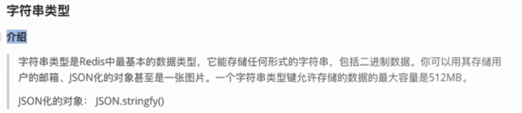
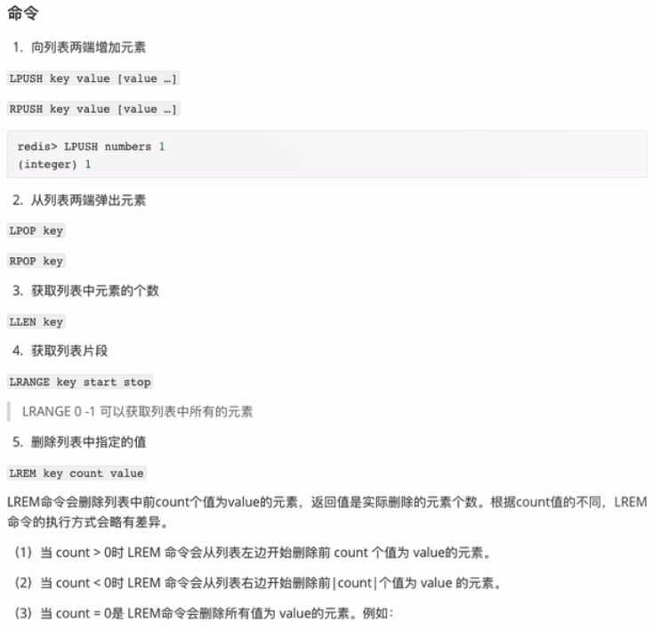
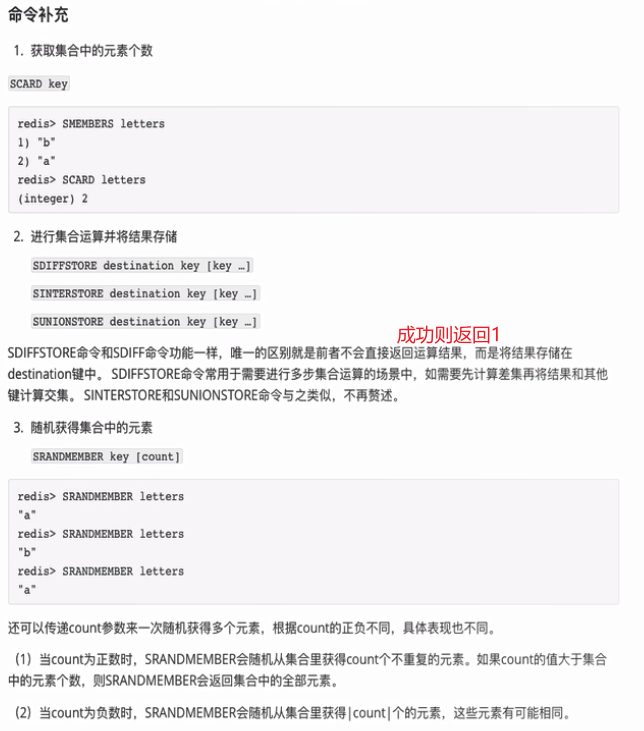
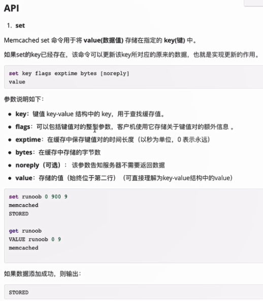

# NoSQL数据库

## 课程介绍

### 主要内容

非关系型数据库：

- **Redis开发与实战**(内存型)
- **Memcached入门**(内存型)
- MongoDb入门(存储型)

**着重讲解redis**，存储型数据库还是mysql的天下。

### 学习目标

- 掌握非关系性数据库的特点以及使用
- 掌握NoSQL 技术在实际开发中的应用

### NoSQL主要应用场景

专门应对高并发，需要高速读写的场景，而就Redis技术而言，它的性能十分优越，可以支持每秒十几万次的读/写操作，**其性能远超数据库**，并且还支持集群、分布式、主从同步等配置。

- 天猫双11
- 抢红包，抢手机，抢火车票， 抢门票
- ssr 服务端渲染

## 第一节Redis


### Redis 安装和启动

对于Mac OS：brew install redis

对于Windows，下载地址：https://github.com/tporadowski/redis/releases

Redis启动：redis-server

修改端口（默认端口6379，这里修改为6389）：redis-server --port 6389

#### 初始化配置文件

每次redis服务启动时都会读取redis.conf，对于mac os，该文件的路径在/usr/local/etc/redis.conf

```bash
# Redis默认不是以守护进程的方式运行，可以通过该配置项修改，使用yes启用守护进程（维持进程数稳定不变）
# 启用守护进程后，Redis会把pid写到一个pidfile（文件）中，即在/var/run/redis.pid中
daemonize no

# 当Redis以守护进程方式运行时，Redis默认会把pid写入/var/run/redis.pid文件，可以通过pidfile参数指定
pidfile /var/run/redis.pid

# 指定Redis监听端口，默认端口为6379
# 如果指定0端口，表示Redis不监听TCP连接
port 6379

# 绑定的主机地址
# 然后，可以向单一接口进行绑定，如果没有绑定，则所有接口都会监听到来的连接
bind 127.0.0.1
# 也就是本机

# 当客户端闲置多长时间后关闭连接；如果指定为0，表示关闭该功能，即不会关闭连接
timeout 0

# 指定日志记录级别，Redis总共支持四个级别：debug、verbose、notice、warning，默认为verbose
# debug (很多信息, 对开发／测试比较有用)
# verbose (many rarely useful info, but not a mess like the debug level)
# notice (moderately verbose, what you want in production probably)
# warning (only very important / critical messages are logged)
loglevel verbose

# 日志记录方式，默认为标准输出，如果配置为redis为守护进程方式运行，而这里又配置为标准输出，则日志将会发送给/dev/null
logfile stdout

# 设置数据库的数量，默认数据库的dbid为0，可以使用select <dbid>命令在连接上指定数据库id
# dbid是从0到‘databases’-1的数目
databases 16
# 层次关系：数据库-》键值对：值可为字符串、对象（对象键值对）等等

################################ SNAPSHOTTING  #################################
# 指定在多长时间内，有多少次更新操作，就将数据同步到数据文件，可以多个条件配合
# Save the DB on disk:
#
#   save <seconds> <changes>
#
#   Will save the DB if both the given number of seconds and the given
#   number of write operations against the DB occurred.
#
#   满足以下条件将会同步数据:
#   900秒（15分钟）内有1个更改
#   300秒（5分钟）内有10个更改
#   60秒内有10000个更改
#   Note: 可以把所有“save”行注释掉，这样就取消同步操作了
save 900 1
save 300 10
save 60 10000

# 指定存储至本地数据库时是否压缩数据，默认为yes，Redis采用LZF压缩，如果为了节省CPU时间，可以关闭该选项，但会导致数据库文件变的巨大
rdbcompression yes

# 指定本地数据库文件名，默认值为dump.rdb
dbfilename dump.rdb

# 工作目录.
# 指定本地数据库存放目录，文件名由上一个dbfilename配置项指定
# Also the Append Only File will be created inside this directory.
# 注意，这里只能指定一个目录，不能指定文件名
dir ./
```

### redis-cli命令行客户端

#### 常见命令

redis-cli类似node命令，是交互式的命令行客户端。

redis-cli执行时会自动按照默认配置（服务器地址为127.0.0.1，端口号为6379）连接Redis，通过-h和-p参数可以自定义地址和端口号：

```bash
redis-cli -h 127.0.0.1 -p 6379
或直接：redis-cli
```

①考虑到redis有可能正在将内存中的数据同步到硬盘中，强行终止redis进程可能会导致数据丢失，正确停止redis的方式应该是向redis发送 shutdown 命令，方法为：`SHUTDOWN`（关闭连接的命令）。


②状态回复：`PING`命令（在redis中，ping命令不分大小写）。

③输出：`ECHO hello`命令。

④错误回复：当出现命令不存在或命令格式有错误等情况时，Redis会返回错误回复（error reply）。错误回复以（error）开头，并在后面跟上错误信息。如执行一个不存在的命令时的返回：`(error) ERR unknown command 'xxx', with args beginning with:`


⑤整数回复：
`Incr`命令将 key 中储存的数字值增1。
如果 key 不存在，那么 key 的值会先被初始化为 0 ，然后再执行 INCR 操作。
如果值包含错误的类型，或字符串类型的值不能表示为数字，那么返回一个错误。


⑥字符串回复：`get xxx`。没有该字符串则返回`(nil)`

⑦多行字符串回复：`keys *`。（获取所有变量）


#### 修改配置

可以通过redis-cli的方式（cli的方式）去修改`/usr/local/etc/redis.conf`中的配置，如修改 loglevel 配置为 warning：


#### 多数据库

Redis是一个字典解构的存储服务器，而实际上一个Redis实例提供了多个用来存储数据的字典（数据库），客户端可以指定将数据存储在哪个字典（数据库）中。跟在一个关系数据库实例中可以创建多个数据库类似，所以可以将其中的每个字典都理解成一个独立的数据库。每个数据库对外都是一个从0开始的递增数字命名，Redis默认支持16个数据库（可以通过配置文件支持更多，无上限），可以通过配置参数databases来修改这一数字。客户端与Redis建立连接后会自动选择0号数据库，不过可以随时使用SELECT命令更换数据库，如要选择1号数据库：

```bash
redis 127.0.0.1:6379>SELECT 1
 OK
redis 127.0.0.1:6379[1]> GET foo
(nil)
```

然而这些以数字命名的数据库不是常规的数据库。
首先Redis不支持自定义数据库的名字，每个数据库都以编号命名，开发者必须记录哪些数据库存储了哪些数据。
另外Redis也不支持为每个数据库设置不同的访问密码，所以一个客户端要么可以访问全部数据库，要么连一个数据库也没有权限访问。
最重要的一点是，多个数据库之间并不是完全隔离的，比如FLUSHALL命令可以清空一个Redis实例中所有数据库中的数据。

综上所述，这些数据库更像是一种命名空间，而不适宜存储不同应用程序的数据。比如可以使用0号数据库存储某个应用生产环境中的数据、使用1号数据库存储测试环境中的数据，但不适宜使用0号数据库存储A应用的数据而使用1号数据库存储B应用的数据，不同的应用应该使用不同的Redis实例存储数据。由于Redis非常轻量级，一个空Redis实例占用的内存只有1M左右，所以不用担心多个Redis实例会额外占用很多内存。

### Redis数据类型


#### 字符串类型




#### 散列类型


```js
// hash_demo.js
var data = { a: 1, b: 2 }
// 原对象为"{a: 1, b: 2}" // a做了一个操作   data.a = 10; // b 也做了一个操作 data.b = 20;
// 对于a  "{a: 10, b: 2}" // 对于b  "{a: 1, b: 20}"

var redis = require('redis');
var client = new redis({
    // option.........
});
var $post_id =  client.incr('post:count');
var $slug = 'hello-world'; // 缩略名
var $title = 'hello world'; // 标题
var $content = 'xxxxxxxxxxxxxx'; // 文章内容（其中一个属性）
var $views = 0; // 文章浏览量（其中一个属性）

// 存储 // 逻辑：生成文章之前，校验缩略名是否可用    hsetnx, 属性存在则修改失败，反之成功
// 另外，如果用关系性数据库，则（一般都要）额外建一张表来存储  文章的ID  和 缩略名直接的映射关系。
// 而用散列类型可以 （slug.to.ld，可以理解成一个redis数据库里特殊的散列）专门存储 文章的ID和缩略名
var isSlug = client.hsetnx(`slug.to.id ${$slug} ${$post_id}`);  // 缩略名（键）和id（值）就能一一对应
if (isSlug === 0) {
    client.exit('缩略名已存在');
} else {  // 散列存储逻辑
    client.hmset(`post:${$post_id} title ${$title} content ${$content} views ${$views}`);
}

// 读取 // 1. 获取id（一般都是根据缩略标题获取）
var postID = client.hget(`slig.to.id ${$slug}`);
if (!postID) {
    client.exit('文章不存在')
} else {
    var post = client.hgetall(`post:${postID}`, (err, data) => { //node会封装
        console.log(data);
    });
}

// 修改缩略名
var newSlug = 'xxxxx';
var isSlugExit = client.hsetnx(`slug.to.id ${newSlug} 42`); // 假设原文章id为42
if(!isSlugExit) {
    client.exit('缩略名已经存在'); // 保证不能和现有的其它缩略名冲突（包括原先的缩略名）
} else { // 已经在slug.to.id散列创建了，下一步做剩下的收尾工作
    var olgSlug = client.hget(`post:42 slug`);  // 先获取旧的缩略名
    client.hdel(`slug.to.id ${olgSlug}`);
    client.hset(`post:42 slug ${newSlug}`);  // 赋值新的
}
```

#### 列表类型





实战例子：


```js
// \chapter1\list_demo.js
var redis = require('redis');
var client = new redis({
    // 配置
});
// 假设通过lpush，已经让post:list有值。下面直接做分页获取：
var currentPage = 1;  // 当前页面为1
var listLength = 10;
var start = (currentPage - 1) * listLength;
var end = currentPage * listLength - 1; // 0-9
var postIdArrHash = client.lrange(`post:list ${start} ${end}`);  // postIdArr此时还是一个列表？里面存储的是散列？数组？
postIdArrHash.forEach((id) => {
    client.hgetall(`post:${id}`, (data) => {
        console.log(data);
    })
});

// 评论只需要用字符串存储 
var commentStr = JSON.stringify({
    author: 'xxx',
    time: 'xxx',
    content: 'xxx',
});
// 评论要存到列表中，因为一篇文章会有多个评论（而且每一篇文章都有评论）
client.lpush(`post:${id}:comments ${commentStr}`);
```

#### 集合类型





#### 有序集合类型


## 第二节 redis进阶与实战

### 事务


### 过期时间


### 排序


### Redis中的一些优化


### Node.js操作redis数据库


## 第三节 memcached





## 第四节 MongoDb

### 介绍


### 增删改查

```js
const MongoClient = require('mongodb').MongoClient;  // 引入库

// Connection URL
const url = 'mongodb://localhost:27017';   // mongo默认端口 27017
// Database Name
const dbName = 'myproject';  // 定义数据库的名称  

const client = new MongoClient(url);   // 实例化一个客户端  并且连接数据库
const insertDocuments = function(db, callback) {
  // Get the documents collection
  const collection = db.collection('documents');  //概念：集合，建了一张 documents这样的表
  // Insert some documents
  collection.insertMany([
    {a : 1, b: 2}, {a : 2, b: 2}, {a : 3, b:3}  // 增：添加3条数据,字段有2个分别是：a,b
  ], function(err, result) {
    console.log("Inserted 3 documents into the collection");
    callback(result);
  });
}
const selectData = function(db, callback) {
    const collection = db.collection('documents');
    var whereStr = { b: 2 };   // 语法简洁
    collection.find(whereStr).toArray((err, result) => {
        callback(result)
    })
}
const updateData = function(db, callback) {
    const collection = db.collection('documents');
    var whereStr = {
        a: 1
    };
    var updataStr = {
        $set: {
            b: 1
        }
    };
    collection.update(whereStr, updataStr, function() {
        callback();
    });
}
const delData = function(db, callback) {
    const collection = db.collection('documents');
    var whereStr = { a: 1 };
    collection.remove(whereStr, (err, result) => {
        callback(result)
    });
}

// Use connect method to connect to the server
client.connect(function(err) {
  console.log("Connected successfully to server");
  const db = client.db(dbName);  // 创建一个数据库 叫做 myproject 或者链接
// 建表  
  insertDocuments(db, function() {  // 插入数据
    client.close();
  });
// 查
  selectData(db, function(data) {
    console.log(data);
    client.close();
  });
// 改
  updateData(db, function() {
    client.close();
  });
// 删
  delData(db, function() {
    client.close();
  });
});
```


## 第五节 Egg+Redis+MongoDb实现登录流程


### 说明


### 实现代码

#### 项目初始化

```
npm init egg --type=simple
```

#### 项目依赖

- egg-mongoose
- egg-redis
- egg-session

#### 项目目录：


package.json：项目依赖

```json
{
  "name": "redis-login",
  "version": "1.0.0",
  "description": "",
  "private": true,
  "egg": {
    "declarations": true
  },
  "dependencies": {
    "egg": "^2.15.1",
    "egg-mongoose": "^3.2.0",
    "egg-redis": "^2.4.0",
    "egg-scripts": "^2.11.0",
    "egg-session": "^3.1.0",
    "egg-view-nunjucks": "^2.2.0"
  },
  "devDependencies": {
    "autod": "^3.0.1",
    "autod-egg": "^1.1.0",
    "egg-bin": "^4.13.1",
    "egg-ci": "^1.11.0",
    "egg-mock": "^3.21.0",
    "eslint": "^5.13.0",
    "eslint-config-egg": "^7.1.0"
  },
  "engines": {
    "node": ">=10.0.0"
  },
  "scripts": {
    "start": "egg-scripts start --daemon --title=egg-server-session-redis",
    "stop": "egg-scripts stop --title=egg-server-session-redis",
    "dev": "egg-bin dev",
    "debug": "egg-bin debug",
    "test": "npm run lint -- --fix && npm run test-local",
    "test-local": "egg-bin test",
    "cov": "egg-bin cov",
    "lint": "eslint .",
    "ci": "npm run lint && npm run cov",
    "autod": "autod"
  },
  "ci": {
    "version": "10"
  },
  "repository": {
    "type": "git",
    "url": ""
  },
  "author": "",
  "license": "MIT"
}
```

config.default.js：配置文件

```js
/* eslint valid-jsdoc: "off" */

'use strict';

/**
 * @param {Egg.EggAppInfo} appInfo app info
 */
module.exports = appInfo => {
  /**
   * built-in config
   * @type {Egg.EggAppConfig}
   **/
  const config = exports = {};

  // use for cookie sign key, should change to your own and keep security
  config.keys = appInfo.name + '_1565698426145_5854';

  // add your middleware config here
  config.middleware = [];

  // 模板配置
  config.view = {
    mapping: {
      '.html': 'nunjucks',
    },
  }

  // session 
  config.session = {
    encrypt: false,  // 加密，在这个案例里暂不需要
    signed: false,  // 签名
    // maxAge: 10000
  }

  // redis
  config.redis = {
    client: {
      port: 6379,          // Redis port
      host: '127.0.0.1',   // Redis host
      password: 'auth',
      db: 0,
    }
  }

  config.mongoose = {
    url: 'mongodb://127.0.0.1/redis-mongoose',
    options: {},
    // mongoose global plugins, expected a function or an array of function and options
  }

  // add your user config here
  const userConfig = {
    // myAppName: 'egg',
  };

  return {
    ...config,
    ...userConfig,
  };
};
```

plugin.js：用到的插件

```js
'use strict';

/** @type Egg.EggPlugin */
module.exports = {
  // had enabled by egg
  // static: {
  //   enable: true,
  // }
  nunjucks: {
    enable: true,
    package: 'egg-view-nunjucks', // 模板
  },
  redis: {
    enable: true,
    package: 'egg-redis',
  },
  session: true,
  mongoose: {
    enable: true,
    package: 'egg-mongoose',
  }
};
```

app.js：session的读取、设置和删除

```js
module.exports = app => {
    app.sessionStore = {
      async get(key) {
        const res = await app.redis.get(key);
        if (!res) return null;
        return JSON.parse(res);
      },
      async set(key, value, maxAge) {
        // maxAge not present means session cookies
        // we can't exactly know the maxAge and just set an appropriate value like one day
        if (!maxAge) maxAge = 24 * 60 * 60 * 1000;
        value = JSON.stringify(value);
        await app.redis.set(key, value, 'PX', maxAge);
      },
      async destroy(key) {
        await app.redis.del(key);
      },
    };
};
```

router.js：路由控制

```js
'use strict';

/**
 * @param {Egg.Application} app - egg application
 */
module.exports = app => {
  const { router, controller } = app;
  router.get('/', controller.home.index);
  
  router.get('/login', controller.login.loginHtml);
  router.get('/sign', controller.login.signHtml);
  
  // 注册接口
  router.post('/api/sign', controller.login.sign);
  // 登录接口
  router.post('/api/login', controller.login.login);
  // 退出登录
  router.get('/logout', controller.login.logout)
};
```

home.js：路由控制器之home

```js
'use strict';

const Controller = require('egg').Controller;
class HomeController extends Controller {
  async index() {
    const { ctx } = this;
    // 需要加上权限判断
    if (ctx.session.login) {
      await ctx.render('home');
    } else {
      ctx.redirect('/login');
    }
  }
}
module.exports = HomeController;
```

login.js：路由控制器之login

```js
'use strict';

const Controller = require('egg').Controller;
class LoginController extends Controller {
  async loginHtml() {
    const { ctx } = this;
    await ctx.render('login');
  }
  async signHtml() {
    const { ctx } = this;
    await ctx.render('sign');
  }

  async sign() {
      // 1. 获取request 的 body
      // 2. 存储到mongo
      const {ctx} = this;
      // 1. 获取request 的 body
      var requestBody = ctx.request.body;
      // 2. 存储到mongo
      await ctx.model.User.insertMany({
          username: requestBody.username,
          password: requestBody.password
      });
      ctx.body = '<h1>注册成功</h1>'
  }

  async login() {
      // 1. 获取request 的 body // 2.校验 // 3. 将 session和redis进行同步
      const {ctx} = this;
      var requestBody = ctx.request.body; // 获取request 的 body
        // 数据库查询
      const findUser = await ctx.model.User.find({
          username: requestBody.username
      });
      // 校验
      if (findUser.length && findUser[0].password === requestBody.password) {
        ctx.session.login = true; // 将 session和redis进行同步，只需要一行代码就够了
        ctx.redirect('/');
      } else {
        ctx.redirect('/login');
      }
  }

  async logout(){
    const {ctx} = this;
    ctx.session.login = false;
    ctx.redirect('/login');
  }
}
module.exports = LoginController;
```

user.js：定义User模块用于把（账号密码）数据存储到mongodb数据库

```js
// {app_root}/app/model/user.js
module.exports = app => {
    const mongoose = app.mongoose;
    const Schema = mongoose.Schema;

    const UserSchema = new Schema({
        username: { type: String },
        password: { type: String },
    });

    return mongoose.model('User', UserSchema);
}
```

sign.html：注册页面

```html
<!DOCTYPE html>
<html lang="en">
<head>
    <meta charset="UTF-8">
    <meta name="viewport" content="width=device-width, initial-scale=1.0">
    <meta http-equiv="X-UA-Compatible" content="ie=edge">
    <title>Document</title>
</head>
<body>
    <h1>注册</h1>
    <form action="/api/sign" method="POST">
        用户名：<input name="username" type="text">
        <br>
        密码：<input name="password" type="text">
        <br>
        <button type="submit">注册</button>
    </form>
</body>
</html>
```

login.html：登陆页面

```html
<!DOCTYPE html>
<html lang="en">
<head>
    <meta charset="UTF-8">
    <meta name="viewport" content="width=device-width, initial-scale=1.0">
    <meta http-equiv="X-UA-Compatible" content="ie=edge">
    <title>Document</title>
</head>
<body>
    <h1>登录</h1>
    <!-- // 登录接口地址 -->
    <form action="/api/login" method="POST">  
        用户名：<input name="username" type="text">
        <br>
        密码：<input name="password" type="text">
        <br>
        <button type="submit">登录</button>
    </form>
</body>
</html>
```

home.html：已登录之后的首页页面

```html
<!DOCTYPE html>
<html lang="en">
<head>
    <meta charset="UTF-8">
    <meta name="viewport" content="width=device-width, initial-scale=1.0">
    <meta http-equiv="X-UA-Compatible" content="ie=edge">
    <title>Document</title>
</head>
<body>
    <h1>我是一个需要登录的页面</h1>
    <h1>恭喜您，已经登录！ 可以正常访问</h1>
    <a href="/logout">退出登录</a>>
</body>
</html>
```

