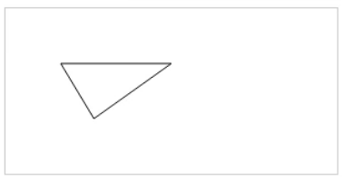
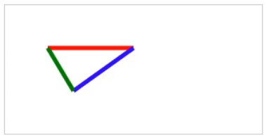
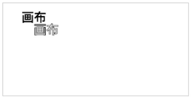
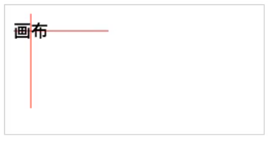
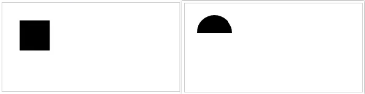
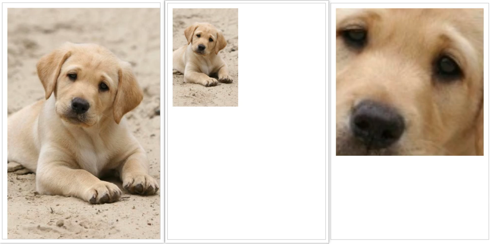
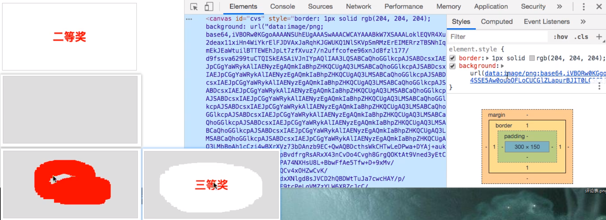

# 页面游戏开发基础

理解并掌握使用**画布**元素开发游戏的**步骤**、**技巧**和发布过程，并能手动地使用**画布**开发一个页面游戏。

## 第1节 画布元素的使用

### 绘制线条

画布的作用：Canvas 元素作为HTML5标准的一部分，允许你通过脚本动态渲染图像。每一个 canvas 元素都有一个上下文环境对象，在其中可以绘制任意图形。

基本使用：

1. 在页面中添加画布元素
2. 获取画布元素的上下文环境对象（context，可理解为画板提供的工具集，可以画线、圆、图片等等）
3. 使用上下文环境对象（工具集）绘制图形（绘制一个起始点和绘制一个终止点），（把路径）保存在内存中
4. 绘制一个线条（用画笔描点）

```html
<!DOCTYPE html>
<html lang="en">
<head>
    <meta charset="UTF-8">
    <meta name="viewport" content="width=device-width, initial-scale=1.0">
    <meta http-equiv="X-UA-Compatible" content="ie=edge">
    <title>Document</title>
</head>
<body>
    <!-- 默认宽300、高150 -->
    <canvas id="cvs" style="border: solid 1px #ccc"></canvas>
    <script type="text/javascript">
        var cvs=document.getElementById("cvs"); // 获取画布元素
        var cxt=cvs.getContext("2d"); // 获取工具集
        cxt.moveTo(30,30); // 定位开始点：moveTo(x,y) 定位一个开始坐标点
        cxt.lineTo(90,30)  // 拖动并结束点：lineTo(x,y) 在当前坐标基础绘制一条线到x,y。再保存内存。注意到这里仅仅是绘制一个路径。
        cxt.stroke(); // 绘制点
    </script>
</body>
</html>
```

### 绘制不同线条颜色的三角形

绘制三角形：



```html
<!DOCTYPE html>
<html lang="en">
<head>
    <meta charset="UTF-8">
    <meta name="viewport" content="width=device-width, initial-scale=1.0">
    <meta http-equiv="X-UA-Compatible" content="ie=edge">
    <title>Document</title>
</head>
<body>
    <canvas id="cvs" style="border: solid 1px #ccc"></canvas>
    <script type="text/javascript">
        var cvs = document.getElementById("cvs"); // 获取画布元素
        var cxt = cvs.getContext("2d"); // 获取工具集
        cxt.moveTo(50,50); // 定位一个起始点
        cxt.lineTo(150,50) // 绘制第二个点
        cxt.lineTo(80,100) // 绘制第三个点
        // cxt.lineTo(50,50) // 方式一：拖动当前点回到原点
        cxt.closePath(); // 方式二：闭合路径，形成三角形
        cxt.stroke() // 绘制线条
    </script>
</body>
</html>
```

绘制不同的线条颜色与线条宽度的三角形：



```html
<!DOCTYPE html>
<html lang="en">
<head>
    <meta charset="UTF-8">
    <meta name="viewport" content="width=device-width, initial-scale=1.0">
    <meta http-equiv="X-UA-Compatible" content="ie=edge">
    <title>Document</title>
</head>
<body>
    <canvas id="cvs" style="border: solid 1px #ccc"></canvas>
    <script type="text/javascript">
        var cvs=document.getElementById("cvs");
        var cxt=cvs.getContext("2d");
       
        cxt.lineWidth=5; // 设置绘制图形的线条宽度（以像素为单位）：context.lineWidth=number
        cxt.strokeStyle='red'; // 设置绘制图形的颜色：context.strokeStyle=color
        cxt.moveTo(50,50); // 定位一个起始点
        cxt.lineTo(150,50) // 绘制第二个点
        cxt.stroke()
        // 开始一条新的路径，重置当前的（绘制的）路径，并切断和上一个图形的路径联系（包括上一个线条原点、宽度等等）
        cxt.beginPath(); // 重置当前路径，可以实现不同大小和颜色图形的单独绘制

        cxt.strokeStyle='blue';
        cxt.moveTo(150,50); // 设置绘制第二条线起始点
        cxt.lineTo(80,100) // 绘制第二个点
        cxt.stroke()
        cxt.beginPath();

        cxt.strokeStyle='green';
        cxt.moveTo(80,100); // 设置绘制第二条线起始点
        cxt.lineTo(50,50) // 返回原始点
        cxt.stroke()
    </script>
</body>
</html>
```

## 第2节 其他绘制API

### 文字绘制

```javascript
// 在指定位置和宽度内绘制文字
context.fillText(text,x,y,maxWidth); // 第三个参数为最大宽度，可选
context.strokeText(text,x,y,[max]);
// 设置字体名称和形状（设置文字的样式）
context.font='字体属性' // 如：bold 32px sans-serif
```

```html
<!DOCTYPE html>
<html lang="en">
<head>
    <meta charset="UTF-8">
    <meta name="viewport" content="width=device-width, initial-scale=1.0">
    <meta http-equiv="X-UA-Compatible" content="ie=edge">
    <title>Document</title>
</head>
<body>
    <canvas id="cvs" style="border: solid 1px #ccc"></canvas>
    <script type="text/javascript">
        var cvs=document.getElementById("cvs"); // 获取画布元素
        var cxt=cvs.getContext("2d"); // 获取工具集
        cxt.font='bold 20px 黑体'; // 设置文字的样式
        // 调用工具集中的API绘制文字。效果如下图
        cxt.fillText('画布',30,30); // 填充
        cxt.strokeText('画布',50,50); // 不填充
    </script>
</body>
</html>
```



```javascript
// 设置文本内容水平对齐方式
context.textAlign='水平方位值' // left（默认）|center|right
// 设置文本内容垂直对齐方式
context.textBaseline='垂直方位值' //top（默认）|middle|bottom
// 把当前绘制内容另存为图片
// 第一个参数可传人image/png图片格式，返回一个字符集字符串；第二个参数为0到1区间，表示图片质量（越大质量越高）
context.toDataURL(type, encoderOptions);
```

```html
<!DOCTYPE html>
<html lang="en">
<head>
    <meta charset="UTF-8">
    <meta name="viewport" content="width=device-width, initial-scale=1.0">
    <meta http-equiv="X-UA-Compatible" content="ie=edge">
    <title>Document</title>
</head>
<body>
    <canvas id="cvs" style="border: solid 1px #ccc"></canvas>
    <script type="text/javascript">
       
        var cvs=document.getElementById("cvs");
        var cxt=cvs.getContext("2d"); // 获取工具集
        cxt.font='bold 20px 黑体';

        cxt.strokeStyle='red';
        cxt.moveTo(10,30);
        cxt.lineTo(120,30);
        cxt.stroke(); // 横线

        cxt.beginPath();
        cxt.moveTo(30,10);
        cxt.lineTo(30,120);
        cxt.stroke(); // 竖线

        cxt.textAlign='center'; // 水平方向居中对齐
        cxt.textBaseline='middle'; // 垂直方向居中对齐
        cxt.fillText('画布',30,30); // 调用工具集中的API绘制文字
        var imgUrl=cvs.toDataURL('image/png',1); // 将绘制内容另存为图片
        console.log(imgUrl); // 输出到控制台
    </script>
</body>
</html>
```



### 绘制矩形和圆形和图片

绘制矩形和圆形：

```javascript
//绘制矩形的路径
context.rect(x,y,width,height);
//绘制无填充的矩形
context.strokeRect(x,y,width,height);
//绘制填充的矩形
context.fillRect(x,y,width,height);
//清空指定矩形内像素
context.clearRect(x,y,width,height);
// 绘制有弧度的圆形 // 在指定位置绘制一个圆形：
context.arc(x,y,r,sAngle,eAngle,clockwise); // 第六个参数表示是否为逆时针
```

```html
<!DOCTYPE html>
<html lang="en">
<head>
    <meta charset="UTF-8">
    <meta name="viewport" content="width=device-width, initial-scale=1.0">
    <meta http-equiv="X-UA-Compatible" content="ie=edge">
    <title>Document</title>
</head>
<body>
    <canvas id="cvs" style="border: solid 1px #ccc"></canvas>
    <script type="text/javascript">
        var cvs=document.getElementById("cvs");
        var cxt=cvs.getContext("2d");
        // 绘制描边矩形：
        // 方式一：
        //cxt.rect(30,30,50,50); // 先绘制路径
        //cxt.stroke(); // 再描边
        // 方式二：
        //cxt.strokeRect(30,30,50,50); // 调用一次方法完成

        // 绘制填充矩形：
        // 方式一：
        //cxt.rect(30,30,50,50); // 先绘制路径
        //cxt.fill(); // 再填充
        // 方式二：
        cxt.fillRect(30,30,50,50); // 调用一次方法完成

        cxt.clearRect(30,30,50,50); // 清空绘制好的正方形
        // 绘制一个半径为30的圆形（的路径）
        cxt.arc(50,50,30,0,Math.PI,true);
        // 绘制圆形的边
        cxt.fill();
    </script>
</body>
</html>
```



绘制不同大小的图片

```javascript
//在画布上绘制固定坐标的图像
context.drawImage(img,x,y);
//在画布上绘制不仅固定坐标，且规定图像的宽度和高度图像
context.drawImage(img,x,y,width,height);
//在画布上剪切图像，并在画布上绘制被剪切的部分
// sx,sy,swidth,sheight表示对原来的图片进行操作（获取起始点为sx,sy且宽高为swidth,sheight的图片）
// x,y,width,height表示对画布进行操作（把裁剪好的图片放在起始点为x,y且宽高为width,height框内，拉伸铺满）
context.drawImage(img,sx,sy,swidth,sheight,x,y,width,height);
```

```html
<!DOCTYPE html>
<html lang="en">
<head>
    <meta charset="UTF-8">
    <meta name="viewport" content="width=device-width, initial-scale=1.0">
    <meta http-equiv="X-UA-Compatible" content="ie=edge">
    <title>Document</title>
</head>
<body>
    <!-- 设置画布宽320、高480 -->
    <canvas id="cvs" width="320" height="480" style="border: solid 1px #ccc"></canvas>

    <script type="text/javascript">
        var cvs=document.getElementById("cvs");
        var cxt=cvs.getContext("2d");
        var img=new Image(); //先定义图片对象
        img.src='img/dog.jpg';
        img.onload=function(){
            //cxt.drawImage(this,10,10); //绘制加载好的图片
            //cxt.drawImage(this,10,10,133,200); //绘制加载好的指定宽高的图片
            //x1,y1,w1,h1, x2,y2,w2,h2
            cxt.drawImage(this,120,120,100,100,10,10,300,300); //绘制加载放大的图片
        }
    </script>
</body>
</html>
```



## 第3节 实现刮刮卡效果

```html
<!DOCTYPE html>
<html lang="en">
<head>
    <meta charset="UTF-8">
    <meta name="viewport" content="width=device-width, initial-scale=1.0">
    <meta http-equiv="X-UA-Compatible" content="ie=edge">
    <title>Document</title>
</head>
<body>
    <canvas id="cvs" style="border: solid 1px #ccc"></canvas>
    <script type="text/javascript">
        var cvs=document.getElementById("cvs"); // 1.获取画布元素
        var cxt=cvs.getContext("2d");
        var arrGifs=['一等奖','二等奖','三等奖','没中奖']; //定义一个中奖信息的数组
        var rdmGif=arrGifs[Math.floor(Math.random()*arrGifs.length)]; //随机生成一个中奖信息元素
        cxt.font='bold 25px 黑体';
        cxt.textAlign='center';
        cxt.textBaseline='middle';
        cxt.fillStyle='red'; // 对文字进行样式设置（注意不是线条）
        cxt.fillText(rdmGif,cvs.width/2,cvs.height/2); //将获取的中奖信息（文字）绘制到画布中间 // 2.随机生成卡面文字
        //将绘制的中奖信息另存图片并作为画布元素的背景图片
        var imgUrl=cvs.toDataURL('image/png',1); // 3.卡面内容存储为图片
        cvs.style.background='url('+imgUrl+')';
        cxt.clearRect(0,0,cvs.width,cvs.height); // 清除内容（清除）上面绘制的文字信息，但注意此时背景图还在。
        //绘制一个矩形盖住中奖信息
        cxt.fillStyle='#ddd'; //设置矩形的绘制颜色为灰色
        cxt.fillRect(0,0,cvs.width,cvs.height); //绘制盖住的区域

        //设置一个变量控制绘制的触发
        var flag=false;
        cvs.addEventListener("mousedown",function(){
            flag=true;
            cxt.globalCompositeOperation='destination-out'; // 设置目标为（使其）透明
        })
        cvs.addEventListener("mousemove",function(e){
            if(flag){
                var x=e.clientX;
                var y=e.clientY;
                cxt.fillStyle='red'; // 对矩形进行样式设置。实际上，上面设置了globalCompositeOperation之后则不会为红色，而是会使其透明
                cxt.fillRect(x,y,30,30); // 在鼠标移动时不断绘制固定宽高的正方形 // 4.鼠标移动时刮动画布
            }
        })
        cvs.addEventListener("mouseup",function(){
            flag=false;
        })
    </script>
</body>
</html>
```


