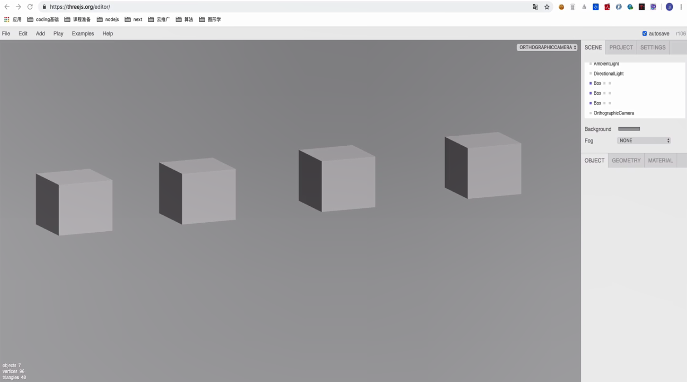
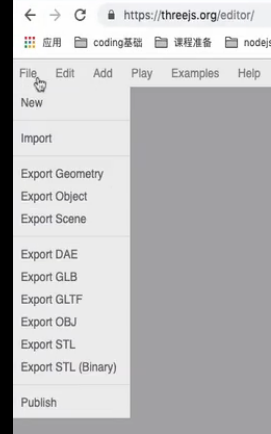

# 图形化开发

## Threejs

**课程主要学习目标**：①Threejs  (做 3d，是对webGL的封装 )；②D3  (做数据可视化，如echarts)。

**未来前端发展的三个方向**：①主流前端工程师（PC 、桌面、移动端）：岗位多，竞争激烈；②nodejs服务端工程师：岗位适中， 竞争中等；③图形化、游戏等：岗位比较少，竞争少， 数学难度高。

前言：**webGL太难用，太复杂！但是现代浏览器都支持 WebGL**（这样就不必使用 **Flash**、**Java** 等插件就能在浏览器中创建三维图形）。而 Three.js 的出现完美地解决了这个矛盾。它提供一个很简单的关于 **WebGL** 特性的 **JavaScript API**，使得用户不需要详细地学习 **WebGL**，就能轻松创作出好看的三维图形样例。

> WebGL原生的api是一种非常低级的接口（跟c语音这种低级语言靠的比较近），而且还需要一些数学和图形学的相关技术。对于没有相关基础的人来说，入门很难。而Three.js将入门的门槛降低了整整的一大截，对WebGL进行封装，能简化创建三维动画场景的过程。只要有一定的JavaScript基础和前端经验，则三维制作会变得很简单。

通过学习**Three.js这个WebGL框架**，来入门3D开发不仅门槛低，而且学习曲线不会太陡，即使以后转向WebGL原生开发，也能通过Three.js学习到很多有用的知识。 并且在webGL封装的各种库来讲，threejs现在是独领风骚。**现在较火的微信小游戏跳一跳，也是在Three.js的基础上开发出来的。**

### 基本介绍

**Threejs 该项目的目的是使用默认的WebGL渲染器创建一个易于使用，轻量级的3D库。另外，该库还在示例中提供了Canvas 2D，SVG和CSS3D渲染器。**

https://github.com/mrdoob/three.js


#### 特点

由于Three.js的易用性和扩展性，使得它能够满足大部分的开发需求。优点：

1. **Three.js掩盖了3D渲染的细节**：Three.js将WebGL原生API的细节抽象化，将3D场景拆解为网格、材质和光源(即它内置了图形编程常用的一些对象种类)。
2. **面向对象**：oop（面向对象编程，Object Oriented Programming。对象程序设计），开发者可使用上层的JavaScript对象，而不仅仅调用JavaScript函数。
3. **功能非常丰富**：Three.js除了封装了WebGL原始API之外，还包含了许多实用的内置对象，可以方便地应用于游戏开发、动画制作、幻灯片制作、髙分辨率模型和一些特殊的视觉效果制作。
4. **速度很快**：Three.js采用了3D图形最佳实践来保证在不失可用性的前提下，保持极高的性能。
5. **支持交互**：WebGL本身并不提供拾取（picking）功能（即是否知道鼠标正处于某个物体上）。而Three.js则固化了拾取支持，这就使得你可以轻松为你的应用添加交互功能。
6. **包含数学库**：Three.js拥有一个强大易用的数学库，可以在其中进行矩阵、投影和矢量运算。
7. **内置文件格式支持**：可以使用流行的3D建模软件导出文本格式的文件，然后使用Three.js加载；也可以使用Three.js加载其它的JSON格式或二进制格式。
8. **扩展性很强**：为Three.js添加新的特性或进行自定义优化很容易。如果需要某个特殊的数据结构，则只需要封装到Three.js即可。

缺点：

1. 官网文档非常粗糙，对于新手极度不友好。
2. 国内的相关资源匮乏。
3. Three.js所有的资料都是以英文格式存在，对国内的开发者又提高了门槛。
4. Three.js不是游戏引擎，一些游戏相关的功能没有封装在里面，如果需要相关的功能则需要进行二次开发。

#### 对比Babylon.js

Babylon.JS是最好的JavaScript3D游戏引擎（用TS编写），它能创建专业级三维游戏，主要以游戏开发和易用性为主。与Three.js之间的对比： 
1. Three.js比较全面，而Babylon.js专注于游戏方面。 
2. Babylon.js提供了对碰撞检测、场景重力、面向游戏的照相机；Three.js本身不自带，需要依靠引入插件来实现。 
3. 对于WebGL的封装，双方做的各有千秋，Three.js浅一些，好处是易于扩展，易于向更底层学习；Babylon.js深一些，好处是易用，但扩展难度大一些。 
4. Three.js的发展是依靠社区推动，出来的比较早，发展比较成熟；Babylon.js是由微软公司在2013推出，文档和社区都比较健全，但国内还不怎么火。


#### 兼容性

PC兼容性：基本上所有的**现代**浏览器都支持 **Three.js**：①**Firefox**：**4.0** 版本后开始支持；②**Chrome**：**9.0** 版本后开始支持；③**Safari**：**5.1** 版本后开始支持；④**Opera**：**12.00** 版本后开始支持；⑤**IE**：**IE11** 起才开始支持（唯一一个很长时间都不支持 **WebGL** 的浏览器）。

移动端兼容性：①**Android（谷歌）**：**Android** 原生的浏览器是不支持 **WebGL** 的。如果想在 **Android** 上运行 **WebGL**，需要安装最新的移动版本的 **Chrome**、**Firefox** 或者 **Opera**；②**iOS（苹果）**：从 **iOS8** 起就开始支持；③**Windows mobile（微软）**：从 **8.1** 版本后开始支持。

#### 在线编辑器

https://threejs.org/editor/：可以通过可视化的方式导出并生成代码，也可以导入的代码进行在线演示。

### Hello World

Three.js 的第一个案例：

```html
<!DOCTYPE html>
<html>
<head>
    <meta charset=utf-8>
    <title>我的第一个Three.js案例</title>
    <style>
        body {
            margin: 0;
        }
        canvas {
            width: 100%;
            height: 100%;
            display: block;
        }
    </style>
</head>
<!-- ready和onload的区别：ready加载完js和css就执行，onload必须加载完图片之后。 -->
<body onload="init()">
<script src="https://cdn.bootcss.com/three.js/92/three.js"></script>
<!-- <script src="http://www.wjceo.com/lib/js/libs/stats.min.js"></script> -->
<script>
    // 性能插件，监听fps
    // stats = new Stats();
    // document.body.appendChild(stats.dom);
    //声明一些全局变量。而对于webgl里的属性和位置等，都存储在缓存对象内部。
    var renderer, camera, scene, geometry, material, mesh;
    //初始化渲染器
    function initRenderer() {
        renderer = new THREE.WebGLRenderer(); //实例化渲染器
        renderer.setSize(window.innerWidth, window.innerHeight); //设置宽和高
        document.body.appendChild(renderer.domElement); //添加到dom
    }
    //初始化场景
    function initScene() {
        scene = new THREE.Scene(); //实例化场景
    }
    //初始化相机
    function initCamera() {
        camera = new THREE.PerspectiveCamera(45, window.innerWidth / window.innerHeight, 0.1, 200); //实例化相机
        camera.position.set(0, 0, 15);
    }
    //创建模型
    function initMesh() {
        geometry = new THREE.BoxGeometry( 2, 2, 2 ); //创建几何体
        material = new THREE.MeshNormalMaterial(); //创建材质
        mesh = new THREE.Mesh( geometry, material ); //创建网格
        mesh.name = 'lft';
        scene.add( mesh ); //将一个网格(模型)添加到场景
    }
    //运行动画
    function animate() {
        requestAnimationFrame(animate); //循环调用函数
        mesh.rotation.x += 0.01; //每帧网格模型的沿x轴旋转0.01弧度，半圆是180弧度
        mesh.rotation.y += 0.02; //每帧网格模型的沿y轴旋转0.02弧度，这里上下翻转会比左右翻转快
        // stats.update(); // 更新性能插件。每运行一次则更新fps
        renderer.render( scene, camera ); //渲染界面
    }
    //初始化函数，页面加载完成时调用。
    function init() {
        initRenderer(); // 渲染器（元素实例？）
        initScene(); // 场景（定义着色器？）
        initCamera(); // 相机（创建程序？）
        initMesh();
        animate();
        console.log('renderer', renderer instanceof THREE.Object3D); // false
        console.log('camera', camera instanceof THREE.Object3D); //true
        console.log('scene', scene instanceof THREE.Object3D); //true
        console.log('geometry', geometry instanceof THREE.Object3D); // false
        console.log('material', material instanceof THREE.Object3D); // false
        console.log('mesh', mesh instanceof THREE.Object3D); //true
        console.log(scene.getObjectByName('lft')); // 通过场景去获取实例对象
    }
</script>
</body>
</html>
```


#### 分析

使用`Three.js`显示创建的内容，需要的三大件（三要素）是：`渲染器、场景和相机`。相机获取到场景内显示的内容，然后再通过渲染器渲染到画布上面。

WebGL坐标系统作为3D坐标，在原来的2D坐标xy轴上面又多了一个z轴，注意z轴的方向的正轴是朝向我们的方向，眼看去的方向是是z轴的负方向。


**创建渲染器：**

```js
function initRenderer() {
    renderer = new THREE.WebGLRenderer();
    renderer.setSize(window.innerWidth, window.innerHeight);
    document.body.appendChild(renderer.domElement);
}
```

第一行，实例化了一个THREE.WebGLRenderer，这是一个基于WebGL渲染的渲染器。当然，Three.js向下兼容，还有CanvasRenderer，CSS2DRenderer，CSS3DRenderer和SVGRenderer，这四个渲染器分别基于canvas2D，CSS2D，CSS3D和SVG渲染的渲染器。由于在3D渲染中，WebGL渲染的效果最好，并且支持的功能更多，所以大多数情况下只会用到THREE.WebGLRenderer。

第二行，调用了一个设置函数`setSize`方法，这个是设置需要显示的窗口大小。该案例是基于浏览器全屏显示，所以设置了浏览器窗口的宽和高。

第三行，`renderer.domElement`是在实例化渲染器时生成的一个`canvas`画布，渲染器渲染界面生成的内容，都将在这个画布上显示。所以，将这个画布添加到了dom当中，用来显示渲染的内容。

**创建场景：**

```js
function initScene() {
	scene = new THREE.Scene();
}
```

场景只是作为一个容器，要将需要显示的内容都放到场景对象当中。如果要将一个模型放入到场景当中，则可以用`scene.add`方法，如`scene.add(mesh);`

**创建相机：**

```js
function initCamera() {
    camera = new THREE.PerspectiveCamera(45, window.innerWidth / window.innerHeight, 0.1, 200);
    camera.position.set(0, 0, 15);
}
```

`Three.js`里面有几个不同的相机，这里使用的是`THREE.PerspectiveCamera`，这个相机的效果是模拟人眼看到的效果，具有透视的效果，近大远小。

第一行，实例化了一个透视相机，需要四个参数值分别是：视野，宽高比，近裁面和远裁面。

- 视野：当前相机视野的宽度，值越大，渲染出来的内容也会更多（可以理解为一个范围角度）。
- 宽高比：默认是按照画布的显示的宽高比例来设置，如果比例设置的不对，会发现渲染出来的画面有拉伸或者压缩的感觉。
- 近裁面和远裁面：这个是设置相机可以看到的场景内容的范围，如果场景内的内容位置不在这两个值之内的话，将不会被显示到渲染的画面中。

第二行，camera.position.set函数是设置当前相机的位置，函数传的三个值分别是x轴坐标，y轴坐标和z轴坐标。只是将相机放到了z正轴坐标轴距离坐标原点的15的位置。相机默认的朝向是朝向0点坐标的，也可以设置相机的朝向。


**创建第一个模型：**

渲染器、场景和相机都全了，但场景内没有内容，所以即使渲染出来也是一片漆黑，所以需要往场景里面添加内容：查看`initMesh`方法，创建一个最简单的模型：

```js
function initMesh() {
    geometry = new THREE.BoxGeometry( 2, 2, 2 );
    material = new THREE.MeshNormalMaterial();
    mesh = new THREE.Mesh( geometry, material );
    scene.add( mesh );
}
```

第一行，实例化了一个`THREE.BoxGeometry`立方体的几何体对象，实例化的三个传值分别代表着立方体的长度，宽度和高度。如果全部设置的相同的值，则渲染出一个标准的正立方体。

第二行，实例化了一个THREE.MeshNormalMaterial材质，这种材质的特点是会根据面的朝向不同来显示不同的颜色。

第三行，通过`THREE.Mesh`方法实例化创建了一个网格对象，`THREE.Mesh`实例化需要传两个值，分别是几何体对象和材质对象，才可以实例化成功。

第四行，添加模型到场景内。

**动画：**

```js
function animate() {
    requestAnimationFrame(animate);
    mesh.rotation.x += 0.01;
    mesh.rotation.y += 0.02;
    renderer.render( scene, camera )
}
```

在循环调用的函数中，每一帧都让页面重新渲染相机拍摄下来的内容。渲染的`render`方法需要两个值，第一个值是场景对象，第二个值是相机对象。这意味着可以有多个场景和多个相机，可以通过渲染不同的场景和相机让画布上显示不同的画面。每一个实例化的网格对象mesh都有一个`rotation`的值，通过设置这个值可以让立方体旋转起来。在每一帧里让立方体沿x轴方向旋转0.01弧度，沿y轴旋转0.02弧度（1π弧度等于180度角度）。

**性能监测插件：**

在`Three.js`里面，遇到的最多的问题就是性能问题，所以需要时刻检测当前的`Three.js`的性能。现在`Three.js`常使用的一款性能检测插件叫`stats`，它的性能检测核心指标是FPS（画面每秒传输帧数），越大则性能越好。

引入：`<script src="http://www.wjceo.com/lib/js/libs/stats.min.js"></script>`。

实例化一个`stats`对象，然后把对象内生成的`dom`添加到页面当中：`stats = new Stats(); document.body.appendChild(stats.dom);`。

最后要在`requestAnimationFrame`的回调（animate函数）里面进行每次渲染的更新：`stats.update();`。


### 场景（scene）

场景（最核心）是每个`Three.js`项目里面放置内容的容器，可以在场景内放置**模型**、**灯光**和**照相机**，也可以拥有多个场景进行切换展示。还可以通过调整场景的位置，让场景内的所有内容都一起跟着调整位置。

**THREE.Object3D：**

为了方便操作，Three.js将每个能够**直接添加到场景内**的对象都继承至一个基类（THREE.Object3D），以后将继承自这个基类的对象称为3d对象。而判断一个对象是否是继承至THREE.Object3D，可以这么判断：`obj instanceof THREE.Object3D`，继承则返回true，否则返回false。

注意：渲染器、网格和材料没有继承THREE.Object3D；而模型（mesh）继承自THREE.Object3D，所以mesh也可以使用add，即往模型里添加模型。


**向场景（或3d对象）内添加一个3d对象：** ①`scene.add(mesh);` ②`parent.add(child);`

**获取一个3d对象：**

```js
mesh.name = 'lft'; // object3D.name = "xxxObj";
......
console.log(scene.getObjectByName('lft')); //返回第一个匹配的3d对象
```


**删除一个3d对象：**

如果一个模型不再被使用到，需要彻底删除掉，可以使用`remove`方法进行删除：`scene.remove(mesh);`，将一个模型从场景中删除。

如果只是想隐藏一个`3d`对象，而不让它显示，可以通过设置它的`visible`的值：`mesh.visible = false;`，设置为false，模型将不会被渲染到场景内。

### 模型

**修改位置：**

①单独设置

```js
mesh.position.x = 3; //将模型的位置调整到x正轴距离原点为3的位置。
mesh.position.y += 5; //将模型的y轴位置以当前的位置向上移动5个单位。
mesh.position.z -= 6; // 往后移动6个单位，所以看起来更小
```

②一次性设置所有

```
mesh.position.set(3, 5, -6);  //直接将模型的位置设置在x轴为3，y轴为5，z轴为-6的位置
```

③直接重新赋值一个新的对象，因为`Three.js`的模型的位置属性是一个`THREE.Vector3`（三维向量）的对象

```js
mesh.position = new THREE.Vector3(3, 5, -6);
```


**修改大小：**

①单独设置：

```
mesh.scale.x = 2; //模型沿x轴放大一倍
mesh.scale.y = 0.5; //模型沿y轴缩小一倍
mesh.scale.z = 1; //模型沿z轴保持不变
```

②一次性设置所有：

```js
mesh.scale.set(2, 2, 2); //每个方向等比放大一倍
```

③通过赋值的方式重新修改，因为`scale`属性也是一个三维向量

```js
mesh.scale = new THREE.Vector3(2, 2, 2); //每个方向都放大一倍
```

**修改模型的转向：**

①单独设置每个轴的旋转：

```js
mesh.rotation.x = Math.PI; //模型沿x旋转180度
mesh.rotation.y = Math.PI * 2; //模型沿y轴旋转360度，跟没旋转一样的效果
mesh.rotation.z = - Math.PI / 2; //模型沿z轴逆时针旋转90du
```

②一次性设置所有：

```js
mesh.rotation.set(Math.PI, 0, - Math.PI / 2); //旋转效果和第一种显示的效果相同
```

③通过重新赋值一个欧拉角对象来实现旋转调整，因为模型的`rotation`属性其实是一个欧拉角对象（`THREE.Euler`）

```js
mesh.rotation = new THREE.Euler(Math.PI, 0, - Math.PI / 2, "YZX"); 
```

### 调式工具

有些时候，需要调整模型的位置或者大小什么的需要每次都去场景内（或切换到编辑器）进行调试，比较麻烦。现在推荐一种常用的插件`dat.GUI`：https://github.com/dataarts/dat.gui


**功能：**①参数调整；②自动匹配参数类型 (字符串-编辑、数值-滑块、布尔值-checkbox、函数-点击等)；③可以自定义函数。

**使用：**

①引入

```html
<script src="https://cdn.bootcss.com/dat-gui/0.7.1/dat.gui.min.js"></script>
```

②建一个对象，在里面设置需要修改的一些数据：

```
controls = {
    positionX:0,
    positionY:0,
    positionZ:0
};
```

③实例化`dat.GUI`对象，将需要修改的配置添加对象中，并监听变化回调：

```js
gui = new dat.GUI();
gui.add(controls, "positionX", -1, 1).onChange(updatePosition); // -1和1代表设置值的边界
gui.add(controls, "positionY", -1, 1).onChange(updatePosition);
gui.add(controls, "positionZ", -1, 1).onChange(updatePosition);
// 只要每次都修改对象里面的值，都会触发`updatePosition`回调，来更新模型的位置
function updatePosition() {
    mesh.position.set(controls.positionX, controls.positionY, controls.positionZ);
}
```


### Geometry几何体

一个（几何体）模型是由几何体`Geometry`和材质`material`组成。`Three.js`内置了很多的几何体种类，如立方体、三棱锥、球、八面体、十二面体、二十面体等，下面是这些类型几何体（`Three.js`内置的一些基础的几何体）的模型创建和通用方法（当然`Three.js`还内置了一些其它的几何体模型，如字体几何体、拉伸几何体、车床几何体等）。官网演示： https://threejs.org/docs/#api/en/geometries/TubeGeometry

#### Geometry和BufferGeometry

当前`Three.js`内置了这两种几何体类型Geometry和BufferGeometry，**这两个几何体类型都是用于存储模型的顶点位置、面的索引、法向量、颜色、uv纹理以及一些自定义的属性。区别**：

Geometry：①使用了Three.js提供的THREE.Vector3或者THREE.Color这样的对象来存储数据；②易与阅读和编辑；③性能弱一些；④适合动画场景。

BufferGeometry：①存储数据原始；②不易阅读和编辑；③性能好；④适合存储一些放入场景内不需要再额外操作的模型。

**两种几何体类型可以互转：**

①`BufferGeometry`转换成`Geometry`：

```js
var geo = new THREE.Geometry(); //实例化一个Geometry对象
geo.fromBufferGeometry(bufferGeometry); //调用Geometry对象的fromBufferGeometry方法，并将需要转换的bufferGeometry传入
//现在，geo是由BufferGeometry转换成的Geometry
```

②`Geometry`转换成`BufferGeometry`：

```js
var bufferGeo = new THREE.BufferGeometry(); //实例化一个BufferGeometry对象
bufferGeo.fromGeometry(geometry); //调用对象的fromGeometry方法，并将需要转换的geometry传入
//现在，bufferGeo是由Geometry转换成的BufferGeometry
```

#### 立方体

在`WebGL`里面，所有的模型都是通过三角形面组成。创建：

```js
var geometry = new THREE.BoxGeometry( 1, 1, 1 );
var material = new THREE.MeshBasicMaterial( {color: 0x00ff00} );
var cube = new THREE.Mesh( geometry, material );
scene.add( cube );
```

**构造函数：**`BoxGeometry(width : 浮点类型, height : 浮点类型, depth : 浮点类型, widthSegments : 整数类型, heightSegments : 整数类型, depthSegments : 整数类型)`。

width — 沿x轴的宽度，默认值为1。height — 沿y轴的高度，默认值为1。depth — 沿z轴的深度，默认值为1。widthSegments — 可选，沿着边的宽度的分割面的数量。默认值为1。heightSegments — 可选，沿着边的高度的分割面的数量。默认值为1。depthSegments — 可选，沿着边的深度的分割面的数量，缺省值是1。（**widthSegments，heightSegments，depthSegments这三个参数有点就像分别朝3个方向将几何体切成一块一块**）

**在线示意：**https://threejs.org/docs/scenes/geometry-browser.html#BoxGeometry


#### 圆形

**圆形是由多个三角形分段构成**（在计算机里没有圆形，所以绘图软件里的圆形都由三角形组成），这些三角形分段围绕一个中心点延伸并且延伸到给定半径以外。创建：

```js
var geometry = new THREE.CircleGeometry( 5, 32 );
var material = new THREE.MeshBasicMaterial( { color: 0xffff00 } );
var circle = new THREE.Mesh( geometry, material );
scene.add( circle );
```

**构造函数：**`CircleGeometry(radius : 浮点类型, segments : 整数类型, thetaStart : 浮点类型, thetaLength : 浮点类型)`。

radius — 圆的半径，默认值为1。segments — 段数（三角形），最小值为3，默认值为8。thetaStart — 第一段的起始角度，默认值为0。thetaLength — 圆形扇形的中心角，通常称为theta。默认值是2 * Pi，画出一个整圆。

**在线示意：**https://threejs.org/docs/scenes/geometry-browser.html#CircleGeometry


#### 圆锥

创建：

```js
var geometry = new THREE.ConeGeometry( 5, 20, 32 );
var material = new THREE.MeshBasicMaterial( {color: 0xffff00} );
var cone = new THREE.Mesh( geometry, material );
scene.add( cone );
```

**构造函数：**`ConeGeometry(radius : 浮点类型, height : 浮点类型, radialSegments : 整数类型, heightSegments : 整数类型, openEnded : 布尔类型, thetaStart : 浮点类型, thetaLength : 浮点类型)`。

radius — 底部圆锥的半径，默认值为1。height — 圆锥体的高度，默认值为1。radialSegments — 圆锥周围的分段面数，默认值为8。heightSegments — 沿圆锥体高度的面的行数，默认值为1。openEnded — 圆锥体底部是是隐藏还是显示，默认值为false，显示。thetaStart — 第一段的起始角度，默认值是0（Three.js的0度位置）。thetaLength — 圆形扇形的中心角，通常称为theta。默认值是2 * Pi，画出一个整圆。

**在线示意：**https://threejs.org/docs/scenes/geometry-browser.html#ConeGeometry


#### 圆柱

创建：

```js
var geometry = new THREE.CylinderGeometry( 5, 5, 20, 32 );
var material = new THREE.MeshBasicMaterial( {color: 0xffff00} );
var cylinder = new THREE.Mesh( geometry, material );
scene.add( cylinder );
```

**构造函数：**`CylinderGeometry(radiusTop : 浮点类型, radiusBottom : 浮点类型, height : 浮点类型, radialSegments : 整数类型, heightSegments : 整数类型, openEnded : 布尔类型, thetaStart : 浮点类型, thetaLength : 浮点类型)`。

radiusTop — 顶部圆柱体的半径，默认值为1。radiusBottom — 底部圆柱体的半径，默认值为1。height — 圆柱体的高度，默认值为1。radialSegments — 圆柱周围（圆面）的分段面数，默认值为8。heightSegments — 沿圆柱体高度的面的行数，默认值为1。openEnded — 圆柱体的两端是否显示，默认值是false，显示。thetaStart — 第一段的起始角度，默认值是0（Three.js的0度位置）。thetaLength — 圆形扇形的中心角，通常称为theta，默认值是2 * Pi，画出一个整圆。

**在线示意：**https://threejs.org/docs/scenes/geometry-browser.html#CylinderGeometry


#### 球

创建：

```js
var geometry = new THREE.SphereGeometry( 5, 32, 32 );
var material = new THREE.MeshBasicMaterial( {color: 0xffff00} );
var sphere = new THREE.Mesh( geometry, material );
scene.add( sphere );
```

**构造函数：**`SphereGeometry(radius : 浮点类型, widthSegments : 整数类型, heightSegments : 整数类型, phiStart : 浮点类型, phiLength : 浮点类型, thetaStart : 浮点类型, thetaLength : 浮点类型)`。

radius — 球体半径。默认值是1。widthSegments — 水平线段的数量。最小值是3，默认值是8。heightSegments — 垂直段的数量。最小值是2，默认值是6。phiStart — 指定水平渲染起始角度。默认值为0。phiLength — 指定水平渲染角度大小。默认值是Math.PI * 2。thetaStart — 指定垂直渲染起始角度，默认值为0。thetaLength — 指定垂直渲染角度大小。默认是Math.PI。

**在线示意：**https://threejs.org/docs/scenes/geometry-browser.html#SphereGeometry


#### 平面

创建：

```js
var geometry = new THREE.PlaneGeometry( 5, 20, 32 );
var material = new THREE.MeshBasicMaterial( {color: 0xffff00, side: THREE.DoubleSide} );
var plane = new THREE.Mesh( geometry, material );
scene.add( plane );
```

**构造函数：**`PlaneGeometry(width : 浮点类型, height : 浮点类型, widthSegments : 整数类型, heightSegments : 整数类型)`。

width — 沿X轴的宽度，默认值为1。height — 沿着Y轴的高度，默认值为1。widthSegments — 宽度的分段数，可选，默认值为1。heightSegments — 高度的分段数，可选，默认值为1。

**在线示意：**https://threejs.org/docs/scenes/geometry-browser.html#PlaneGeometry

#### 圆环

创建：

```js
var geometry = new THREE.TorusGeometry( 10, 3, 16, 100 );
var material = new THREE.MeshBasicMaterial( { color: 0xffff00 } );
var torus = new THREE.Mesh( geometry, material );
scene.add( torus );
```

**构造函数：**`TorusGeometry(radius : 浮点类型, tube : 浮点类型, radialSegments : 整数类型, tubularSegments : 整数类型, arc : 浮点类型)`。

radius - 圆环的半径，从圆环的中心到管的中心。默认值为1。tube — 管的半径。默认值是0.4。radialSegments — 横向分段数，默认值是8。tubularSegments — 纵向分段数，默认值是6。arc — 绘制的弧度，默认值是Math.PI * 2，绘制整个圆环。

**在线示意：**https://threejs.org/docs/scenes/geometry-browser.html#TorusGeometry


### 材质

材质：模型的表现，就是看到的模型的外观。材质可以看成是材料和质感的结合，简单的说就是物体看起来是什么质地。在渲染程式中，它是表面各可视属性的结合，这些可视属性是指表面的色彩、纹理、光滑度、透明度、反射率、折射率、发光度等，Three.js封装好了大部分的材质效果。

#### MeshBasicMaterial

这种材质是一种简单的材质，不会受到灯光影响，直接看到的效果是整个物体的颜色都是一样，没有立体的感觉。

①初始化color

```js
var material = new THREE.MeshBasicMaterial({color:0x00ffff});
var geometry = new THREE.BoxGeometry(1, 1, 1);
var mesh = new THREE.Mesh(geometry, material);
scene.add(mesh);
```

②set方法修改color

```js
var material = new THREE.MeshBasicMaterial({color:0x00ffff}); //设置初始的颜色为浅蓝色
material.color.set(0xff00ff); //将颜色修改为紫色
```

③直接赋值一个新的`THREE.Color`对象修改color

```js
var material = new THREE.MeshBasicMaterial({color:0x00ffff});
material.color = new THREE.Color(0xff00ff);
```

#### MeshNormalMaterial

这种材质会根据面的方向不同自动改变颜色，不会受到灯光影响。

```js
geometry = new THREE.BoxGeometry( 2, 2, 2 );
material = new THREE.MeshNormalMaterial();
mesh = new THREE.Mesh( geometry, material );
scene.add( mesh );
```

#### LineBasicMaterial线条材质

要绘制线段则要确定两个点，分别是起点和终点，下面使用了四个顶点创建了三条线，再用`Geometry`对象的方法传入这组顶点配置几何体（lineGeometry），再实例化线的材质（lineMaterial），最后使用`THREE.Line`生成线，不会受到灯光影响。

```js
var pointsArr = [ //添加三条直线
    new THREE.Vector3( -10, 0, -5 ),
    new THREE.Vector3( -5, 15, 5 ),
    new THREE.Vector3( 20, 15, -5 ),
    new THREE.Vector3( 10, 0, 5 )
];
var lineGeometry = new THREE.Geometry(); //实例化几何体
lineGeometry.setFromPoints(pointsArr); //使用当前点的属性配置几何体
var lineMaterial = new THREE.LineBasicMaterial({color:0x00ff00}); //材质
line = new THREE.Line(lineGeometry, lineMaterial);
scene.add(line);
```

#### MeshLambertMaterial兰伯特材质

**添加光：**由于`MeshBasicMaterial`、`MeshNormalMaterial`、`MeshBasicMaterial`不会受光的影响，即使有光也不会影响它的效果，前面也没有添加光。现在添加一个光源，来影响材质的显示效果。

```js
function initLight() { //创建灯光
    var light = new THREE.DirectionalLight(0xffffff); //添加了一个白色的平行光
    light.position.set(20, 50, 50); //设置光的方向
    scene.add(light); //添加到场景
    scene.add(new THREE.AmbientLight(0x222222)); //添加一个全局环境光
}
```

这种材质会对光有反应，但是不会出现高光，可以模拟一些粗糙的材质的物体（如木头或者石头）：

```js
geometry = new THREE.BoxGeometry( 2, 2, 2 );
material = new THREE.MeshLambertMaterial({color:0x00ffff});
mesh = new THREE.Mesh( geometry, material );
scene.add( mesh );
```


#### MeshPhongMaterial高光材质

这种材质会对光有反应，具有高光效果，可以模拟一些光滑的物体的材质效果（如油漆面，瓷瓦等）：

```js
geometry = new THREE.BoxGeometry( 2, 2, 2 );
material = new THREE.MeshPhongMaterial({color:0x00ffff});
mesh = new THREE.Mesh( geometry, material );
scene.add( mesh );
```

### 光照

#### AmbientLight环境全局光

环境光会照亮场景中所有的物体，在计算物体的颜色的时候，都会叠加上环境光的颜色。由于环境光作用于所有的物体，所有的材质，所以环境光是没有方向的，也无法产生阴影效果。在场景中添加一个全局光照：

```js
var light = new THREE.AmbientLight( 0x404040 ); // 创建一个灰色的环境光
scene.add( light );
```

#### DirectionalLight平行光

平行光是以特定的方向发射的光。它产生的光都是平行的状态，主要用于模拟太阳光线。实现在场景中添加光效和阴影效果，所有的光照效果都是通过这种方式创建出来。不同种类的光照，通过实例化，可以接受两个传值，分别是光照颜色和光照强度。第二个参数是光照强度默认值是`1.0`，可以根据项目需求调整光照强度。

```js
var light = new THREE.DirectionalLight(0xffffff); //添加了一个白色的平行光
或var light = new THREE.DirectionalLight(0xffffff, 1.0);
```

```js
var directionalLight = new THREE.DirectionalLight( 0xffffff, 0.5 ); //创建一个颜色为纯白色并且强度为默认的一半的平行光
scene.add( directionalLight );
```

不仅可以动态修改平行光的颜色和强度外，还可以通过设置它的位置和目标位置来确定平行光的照射方向（两点确定一条直线的概念）：

```js
var directionalLight = new THREE.DirectionalLight( 0xffffff, 0.5 ); 
directionalLight.color.set(0x000000);  //将光照颜色修改为黑色
directionalLight.intensity = 1.0; //将光照强度修改为默认
directionalLight.position.set(10, 10, 10); //设置平行光的位置
directionalLight.target.set(0, 0, 0); //设置当前的平行光的朝向位置
scene.add( directionalLight );
```

**添加阴影效果：**

首先，需要设置渲染器可以渲染阴影效果：

```js
renderer.shadowMap.enabled = true; // 渲染器开启阴影
```

然后，平行光是可以产生投影效果的，实例化灯光时，对灯光需要设置渲染阴影：

```js
directionalLight = new THREE.DirectionalLight("#ffffff");
directionalLight.castShadow = true; // 光照开启阴影。设置平行光投射投影
scene.add(directionalLight);
```

最后，还需要设置哪些模型可以产生阴影和哪些模型可以接收阴影：

```js
sphere.castShadow = true; //物体1开启阴影
scene.add(sphere);
......
cube.castShadow = true; //物体2开启阴影
scene.add(cube);
......
plane.receiveShadow = true; //底部平面开启接收阴影
scene.add(plane);
```

上面设置了球体和立方体可以产生阴影，底部的平面可以接收球和立方体产生的阴影，便可以产生下面的图片效果：


由于设置阴影是一项十分耗性能的工作，所以要尽量设置合适的阴影渲染范围和密度。平行光阴影的实现原理是通过正交相机`OrthographicCamera`（directionalLight.shadow.camera就是一个正交相机）来检测当前模型，只要在这个正交相机可视范围内的可以投影的物体才可以被设置投影。并且可以通过设置一些相机的属性来实现产生阴影的范围，如：

```js
directionalLight.shadow.camera.near = 20; //产生阴影的最近距离
directionalLight.shadow.camera.far = 100; //产生阴影的最远距离
directionalLight.shadow.camera.left = -50; //产生阴影距离位置的最左边位置
directionalLight.shadow.camera.right = 50; //最右边
directionalLight.shadow.camera.top = 50; //最上边
directionalLight.shadow.camera.bottom = -50; //最下面
//下面两个值决定生成阴影密度 默认512
directionalLight.shadow.mapSize.height = 1024;
directionalLight.shadow.mapSize.width = 1024;
```

案例：./代码/平行光结合添加阴影效果：进行调试：


#### PointLight点光源

点光源就是从一个点的位置向四面八方发射出去光，一个简单的例子就是一个裸露的灯泡。实现一个最普通的点光源：

```js
var pointLight = new THREE.PointLight(0xff0000); //创建一个白色的点光源
pointLight.position.set( 50, 50, 50 );
scene.add( pointLight );
```

点光源支持四个参数配置，分别是颜色、光的强度、照射范围、衰减度：`var pointLight = new THREE.PointLight(0xff0000, 1, 100, 2);`。

第三个参数是照射范围，如果物体距离点光源超过这个距离，将不会受到点光源的影响，默认是所有的物体会受到点光源的影响。如果设置了照射范围，将按照第四个参数，衰减度的值来慢慢减少影响，默认是1，如果需要模拟现实中的效果，这个参数可以设置为2。这些属性也可以通过动态修改：

```js
pointLight.color.set(0x000000); //修改点光源的颜色
pointLight.intensity = 0.5; //修改点光源的强度
pointLight.distance = 50; //修改点光源的照射范围
pointLight.decay = 1.0; //修改点光源的衰减度
```

实现点光源阴影效果和实现平行光的阴影效果的设置基本一样，而且由于点光源是散射，阴影效果会终止在点光源的影响范围内：`pointLight.castShadow = true;`，告诉点光源需要开启阴影投射。

案例：./代码/点光源：进行调试：


#### SpotLight聚光灯光源

聚光灯光源的效果也是从一个点发出光线，然后沿着一个一个圆锥体进行照射（可以模仿手电筒，带有灯罩的灯泡等效果）实现聚光灯的案例最简单是直接设置一个颜色即可，默认照射原点位置的光照：

```js
var spotLight = new THREE.SpotLight( 0xffffff ); //创建一个白色光照
spotLight.position.set( 100, 1000, 100 );
scene.add( spotLight );
```

聚光灯光源也可以设置光的强度和照射范围：`spotLight = new THREE.SpotLight( 0xffffff, 2.0, 100);`，设置光照强度是默认的两倍，照射范围为100。

聚光灯由于是沿圆锥体照射，可以设置聚光灯的这个椎体的角度来影响：`spotLight = new THREE.SpotLight( 0xffffff, 2.0, 100, Math.PI/4);`，设置光的照射圆锥范围为90度。

因为聚光灯只能照射一定的区域的物体，所以会出现光亮和无法照射地方的交接，可以通过配置第五个值来设置交接渐变的过渡效果：`spotLight = new THREE.SpotLight( 0xffffff, 2.0, 100, Math.PI/4, 0.5);`，设置交界过渡幅度为0.5（默认是0，没有过渡），最大值为1。

可以通过设置第六个值来设置聚光灯的衰减度：`spotLight = new THREE.SpotLight( 0xffffff, 2.0, 100, Math.PI/4, 0.5, 2.0);`，设置衰减度为物理效果的值2.0。

可以动态修改相关配置项：

```js
spotLight.color.set(0x000000); //修改光的颜色
spotLight.intensity = 0.5; //修改光的强度
spotLight.distance = 50; //修改光的照射范围
spotLight.angle = Math.PI/3; //修改光的照射弧度
spotLight.penumbra = 1.0; //修改交界过渡
spotLight.decay = 1.0; //修改衰减度
```

可以修改聚光灯的`target`来修改光的照射方向：`spotLight.target.set(0, 1, 1);`。

实现聚光灯阴影效果和实现平行光和点光源的设置一样，聚光灯的设置也是将可以生成阴影设置打开，并将聚光灯添加到场景中即可：`spotLight.castShadow = true;`，告诉聚光灯需要开启阴影投射。

案例：./代码/聚光灯光源：进行调试：


#### HemisphereLight室外光源

室外光源主要是为了模拟在户外的环境光效果（如在蓝天绿地的户外，模型下面会显示出来绿色的环境光，而上方则会受到蓝天的影响而颜色偏蓝）。实例化室外光源支持三个参数：天空的颜色、地面的颜色、光的强度。添加户外光源：

```js
var hemisphereLight = new THREE.HemisphereLight(0xffffbb, 0x080820, 1);
scene.add(hemisphereLight);
```

同可以通过配置属性实时修改：

```js
hemisphereLight.color.set(0xffffff); //将天空颜色修改为白色
hemisphereLight.groundColor.set(0x000000); //将地面颜色修改为黑色
```

可以修改`position`配置项来修改渲染的方向：`hemisphereLight.position.set(0, -1, 0);`，默认从上往下渲染（即天空在上方），当前修改为了天空颜色从下往上渲染。

案例：./代码/室外光源：进行调试：


### Camera相机

相机是`Three.js`抽象出来的一个对象，使用此对象，可以定义显示的内容，并且可以通过移动相机位置来显示不同的内容。常用的相机（对象）有正交相机(`OrthographicCamera`)和透视相机(`PerspectiveCamera`)两种相机，用于来捕获场景内显示的物体模型。它们有一些通用的属性和方法：

由于相机都是继承至THREE.Object3D对象的，所以像设置位置的position属性、rotation旋转和scale缩放属性，可以直接对相机对象设置。甚至还可以使用add()方法，给相机对象添加子类，移动相机它的子类也会跟随着一块移动，可以使用这个特性制作一些如HUD类型（一个屏幕显示多个方向的场景）的显示界面。

#### target焦点属性和lookAt()方法

这两个方法的效果一样，都是调整相机的朝向，可以设置一个`THREE.Vector3`（三维向量）点的位置：
①`camera.target = new THREE.Vector3(0, 0, 0);`；②`camera.lookAt(new THREE.Vector3(0, 0, 0));`。

上面两个都是朝向了原点，也可以将相机的朝向改为模型网格的`position`，如果物体的位置发生了变化，相机的焦点方向也会跟随变动：

`var mesh = new THREE.Mesh(geometry, material);` ①`camera.target = mesh.position;`； ②`camera.lookAt(mesh.position);`。

#### OrthographicCamera正交相机

使用正交相机`OrthographicCamera`渲染出来的场景，所有的物体和模型都按照它固有的尺寸和精度显示，一般使用在工业要求精度或者2D平面中，因为它能完整的显示物体应有的尺寸。


上面的图片可以清晰的显示出正交相机显示的范围，它显示的内容是一个立方体结构，通过图片发现，只要确定`left`、`top`、`right`、`bottom`、`near`、`far`六个值（即要根据六个值来限制范围），就能确定当前相机捕获场景的区域，在这个区域外面的内容不会被渲染。创建相机的方法：`new THREE.OrthographicCamera( left, right, top, bottom, near, far );`。

案例：创建了一个显示场景中相机位置前方长宽高都为4的盒子内的物体的正交相机：

```js
var orthographicCamera = new THREE.OrthographicCamera(-2, 2, 2, -2, 0, 4);
scene.add(orthographicCamera); //一般不需要将相机放置到场景当中，但如果需要添加子元素等一些特殊操作，还是需要add到场景内
```

正常情况相机显示的内容需要和窗口显示的内容同样的比例，才能显示没有被拉伸变形的效果：

```js
var frustumSize = 1000; //设置显示相机前方1000高的内容
var aspect = window.innerWidth / window.innerHeight; //计算场景的宽高比
var orthographicCamera = new THREE.OrthographicCamera( frustumSize * aspect / - 2, frustumSize * aspect / 2, frustumSize / 2, frustumSize / - 2, 1, 2000 ); //根据比例计算出left，top，right，bottom的值（设置相机宽高比？）
```

也可以动态地修改正交相机的一些属性（注意：修改完以后需要调用相机`updateProjectionMatrix()`方法来更新相机显存里面的内容）：

```js
var frustumSize = 1000; //设置显示相机前方1000高的内容
var aspect = window.innerWidth / window.innerHeight; //计算场景的宽高比
var orthographicCamera = new THREE.OrthographicCamera(); //实例化一个空的正交相机
orthographicCamera.left = frustumSize * aspect / - 2; //设置left的值
orthographicCamera.right = frustumSize * aspect / 2; //设置right的值
orthographicCamera.top = frustumSize / 2; //设置top的值
orthographicCamera.bottom = frustumSize / - 2; //设置bottom的值
orthographicCamera.near = 1; //设置near的值
orthographicCamera.far = 2000; //设置far的值
//注意，最后一定要调用updateProjectionMatrix()方法更新
orthographicCamera.updateProjectionMatrix();
```

由于浏览器的窗口是可以随意修改，有时候需要监听浏览器窗口的变化，然后获取到最新的宽高比，再重新设置相关属性：

```js
var aspect = window.innerWidth / window.innerHeight; //重新获取场景的宽高比
//重新设置left right top bottom 四个值
orthographicCamera.left = frustumSize * aspect / - 2; //设置left的值
orthographicCamera.right = frustumSize * aspect / 2; //设置right的值
orthographicCamera.top = frustumSize / 2; //设置top的值
orthographicCamera.bottom = frustumSize / - 2; //设置bottom的值
//最后，要更新数据
orthographicCamera.updateProjectionMatrix();
//显示区域尺寸变了，也需要修改渲染器的比例
renderer.setSize(window.innerWidth, window.innerHeight);
```

正交相机示例视图：四根红线最终的指向表示相机的显示方向：




#### PerspectiveCamera透视相机

透视相机（默认相机）是最常用的也是模拟人眼的视角的一种相机，它所渲染生成的页面是一种近大远小的效果。


上面的图片就是一个透视相机的生成原理。渲染的范围是生成的方式（通过设置fov垂直角度、aspect视角宽高比例、near最近渲染距离、far最远渲染距离，就能够确定当前透视相机的渲染范围）：

- 首先，需要确定一个fov值，这个值是用来确定相机前方的垂直视角，角度越大，能够查看的内容就越多。
- 然后，又确定了一个渲染的宽高比，这个宽高比最好设置成页面显示区域的宽高比，这样查看生成画面才不会出现拉伸变形的效果，这就可以确定了前面生成内容的范围是一个四棱锥的区域。
- 最后，需要确定的就是相机渲染范围的最小值near和最大值far，注意这两个值都是距离相机的距离，确定完数值后，相机会显示的范围就是一个近小远大的四棱柱的范围，所能看到的内容都是在这个范围内的。

 一个透视相机的创建（下方设置了前方的视角为45度，宽度和高度设置成显示窗口的宽度除以高度的比例即可，显示距离为1到1000距离以内的物体），透视相机的属性创建完成后也可以根据个人需求随意修改，但是相机的属性在修改完成后要调用`updateProjectionMatrix()`方法来更新：

```js
var perspectiveCamera = new THREE.PerspectiveCamera( 45, width / height, 1, 1000 );
scene.add( perspectiveCamera );
//下面为修改当前相机属性
perspectiveCamera.fov = 75; //修改相机的fov
perspectiveCamera.aspect = window.innerWidth/window.innerHeight; //修改相机的宽高比
perspectiveCamera.near = 100; //修改near
perspectiveCamera.far = 500; //修改far
//最后更新
perspectiveCamera.updateProjectionMatrix();
```

如果当前场景浏览器的显示窗口变动了（如修改了浏览器的宽高后），需要设置场景自动更新：

```js
function onWindowResize() {
    camera.aspect = window.innerWidth / window.innerHeight; //重新设置宽高比
    camera.updateProjectionMatrix(); //更新相机
    renderer.setSize(window.innerWidth, window.innerHeight); //更新渲染页面大小
}
window.onresize = onWindowResize;
```


#### 相机插件

下载地址： https://github.com/mrdoob/three.js/blob/master/examples/js/controls/OrbitControls.js

使用方法：①选择摄像机，并实例化；②在animate方法里的每一帧执行update；③执行init方法。之后就可以在视图里进行画面旋转和拉伸摄像机距离了

```js
......
<script src="./init_control.js"></script>
......
function initControl() {
    control = new THREE.OrbitControls(camera, renderer.domElement);
}
......
function animate() {
    requestAnimationFrame(animate); //循环调用函数
    mesh.rotation.x += 0.01;
    mesh.rotation.y += 0.02;
    stats.update();
    control.update(); // 每一帧都执行相机插件的update
    renderer.render(scene, camera);
}
......
function init() {
    initRenderer();
    initScene();
    initCamera();
    initMesh();
    initControl(); // 初始化相机插件
    animate();
}
......
```

### Points 粒子

`Sprite`精灵和`Points`粒子，这两种对象共同点就是通过相机查看它们时，始终看到的是它们的正面，它们总朝向相机。通过它们的这种特性，可以实现广告牌的效果，或雨雪、烟雾等更加绚丽的特效。

#### Sprite 精灵

精灵由于一直正对着相机的特性，一般使用在模型的提示信息（tips）当中。通过THREE.Sprite创建生成，由于THREE.Sprite和THREE.Mesh都属于THREE.Object3D的子类，所以操作模型网格的相关属性和方法大部分对于精灵都适用。和精灵一起使用的还有一个THREE.SpriteMaterial对象，它是专门配合精灵的材质（另外，不能用几何体的那些材质）。注意**精灵没有阴影效果。**

1. 普通方式创建精灵

```js
var spriteMaterialNormal = new THREE.SpriteMaterial({color: 0x00ffff});
var spriteNormal = new THREE.Sprite(spriteMaterialNormal);
spriteNormal.position.set(-30, 10, 0); // 设置位置
spriteNormal.scale.set(5, 5, 1); // 设置scale进行大小设置
scene.add(spriteNormal);
```

2. 图片导入的方式

```js
// 画一个canvas实例后转为base64格式图片，再调用load方法进行图片加载，生成map对象
var spriteMap = new THREE.TextureLoader().load(drawCanvas({text: "球", width: 64, height: 64}).toDataURL()); 
var spriteMaterial = new THREE.SpriteMaterial({map: spriteMap, color: 0xffffff}); // 生成图片类型的材质
var sprite = new THREE.Sprite(spriteMaterial);
sprite.position.set(0, 10, 0); // 设置位置
sprite.scale.set(5, 5, 1); // 设置scale进行大小设置
scene.add(sprite);
```

3. canvas导入的方式

```js
var canvas = drawCanvas({text: "立方体", width: 256, height: 64});
var spriteMapCube = new THREE.Texture(canvas); // 调用Texture方法进行canvas实例加载，生成map对象
spriteMapCube.wrapS = THREE.RepeatWrapping; // 无限延伸
spriteMapCube.wrapT = THREE.RepeatWrapping;
spriteMapCube.needsUpdate = true;
var spriteCube = new THREE.Sprite(new THREE.SpriteMaterial({map: spriteMapCube, color: 0xffffff}));
spriteCube.position.set(30, 10, -5); //设置位置
spriteCube.scale.set(20, 5, 1); //设置scale进行大小设置
spriteCube.center.set(0.5, 0); //设置位置点处于精灵的最下方中间位置
scene.add(spriteCube);
```

案例：./代码/三种方式生成的Sprite精灵：注意下方的“球”和”立方体“文字才是精灵。


#### points 粒子

**粒子和精灵的效果是一样的，它们之间的区别就是如果当前场景内的精灵过多的话，就会出现性能问题**。粒子的作用就是为解决很多精灵而出现的，可以使用粒子去模拟数量很多的效果（如下雨，下雪等），数量很多的时候就适合使用粒子来创建。相应的，提高性能的损失就是失去了对单个精灵的操作，所有的粒子的效果都是一样。总的来说，粒子就是提高性能但减少了一些自由度，而精灵就是为了自由度而损失了一些性能。

**粒子THREE.Points和精灵THREE.Sprite还有网格THREE.Mesh都属于THREE.Object3D的一个扩展**，但是粒子有一些特殊的情况就是THREE.Points是它们粒子个体的父元素，它的位置设置也是基于THREE.Points位置而定位，而修改THREE.Points的scale属性只会修改粒子个体的位置。

粒子的创建：创建一个粒子，需要一个含有顶点的几何体（几何体可以使用任何几何体，甚至可以是自己生成的几何体，粒子会吸附在几何体的表面）和粒子纹理THREE.PointsMaterial：

①案例一：

```js
var sphereGeometry = new THREE.SphereGeometry(5, 24, 16); // 球体
var sphereMaterial = new THREE.PointsMaterial({color: 0xff00ff}); // 粒子材质作为几何体的材质
var sphere = new THREE.Points(sphereGeometry, sphereMaterial);
scene.add(sphere); // 添加到场景中。通过球体几何体创建的一个最简单的粒子特效
```


②案例二：创建星空

```js
var starsGeometry = new THREE.Geometry();
for (var i = 0; i < 10000; i++) { //生成一万个点的位置
    var star = new THREE.Vector3();
    // THREE.Math.randFloatSpread 方法：在区间“ - 范围 / 2 ”到“ 范围 / 2 ”内随机浮动取值。
    star.x = THREE.Math.randFloatSpread(2000);
    star.y = THREE.Math.randFloatSpread(2000);
    star.z = THREE.Math.randFloatSpread(2000);
    starsGeometry.vertices.push(star); // 把每一个粒子放在starsGeometry.vertices上面
}
var starsMaterial = new THREE.PointsMaterial({color: 0x888888});
var starField = new THREE.Points(starsGeometry, starsMaterial);
scene.add(starField);
```


**粒子的纹理：**

如果需要设置粒子的样式，还是需要通过设置`THREE.PointsMaterial`属性实现：`var pointsMaterial = new THREE.PointsMaterial({color: 0xff00ff});`，设置了粒子纹理的颜色。

可以通过`PointsMaterial`的`size`属性设置粒子的大小：`var pointsMaterial = new THREE.PointsMaterial({color: 0xff00ff, size:4});`，把粒子的尺寸改为原来的四倍。之后可以直接设置属性：`pointsMaterial.size = 4;`。

可以给粒子设置纹理：`var pointsMaterial = new THREE.PointsMaterial({color: 0xff00ff, map:texture});`，添加纹理。

可以设置`lights`属性为`true`，让粒子受光照影响（默认粒子是不受光照的影响的）：`var pointsMaterial = new THREE.PointsMaterial({color: 0xff00ff, lights:true}); `。之后可以直接设置属性：`pointsMaterial.lights = true;`，开启受光照影响。

可以设置粒子不受到距离的影响产生近大远小的效果：`var pointsMaterial = new THREE.PointsMaterial({color: 0xff00ff, sizeAttenuation: false}); `；或`pointsMaterial.sizeAttenuation = false;`，关闭粒子的显示效果受距离影响。

案例：./代码/粒子附着在球体和立方体上面：


### 导入模型

官方推荐使用的`3D`模型的格式为`glTF`，由于`glTF`专注于传输，因此它的传输和解析的速度都很快。`glTF`模型功能包括：网格、材质、纹理、蒙皮、骨骼、变形动画、骨骼动画、灯光以及相机。复杂的模型可以借助：①模型制作工具（3dmax、SketchUp）；②素材下载网站（Sketchfab）。


#### json格式

可以查看`Three.js`支持的导入的格式：




这里的JSON格式（与glTF无关）指的是Three.js可以将其转换为场景的3D对象的JSON格式模型（一般用官方的editor导出）。这种格式内部一般必有的四项为：①metadata 当前模型的相关信息以及生成的工具信息；②geometries 存储当前模型所使用的几何体的数组；③materials 存储当前模型所使用的材质的数组；④object 当前模型的结构以及标示所应用到的材质和几何体标示（所有的模型网格，几何体和材质都有一个固定的uuid标识符，JSON格式中都是通过uuid作为引用）。

**3d对象转成JSON（导出）：**所有的`THREE.Object3D`对象都可以转成`JSON`字符串保存成为文件，但不能直接将对象转成`JSON`是因为`JSON`是无法保存函数的，所以`Three.js`给提供了一个`toJSON()`的方法来转换为可存储的`JSON`格式。

```js
var obj = scene.toJSON(); //将整个场景的内容转换成为json对象
var obj = group.toJSON(); //将一个模型组转成json对象
var obj = mesh.toJSON(); //将一个模型网格转成json对象
var JSONStr = JSON.stringify(obj); //将json对象转换成json字符串
```

**使用ObjectLoader加载JSON模型（导入）：**用`Three.js`内置的对象`THREE.ObjectLoader`来加载模型：

①`parse`方法直接加载`Three.js`生成的`JSON`对象：

```js
var obj = scene.toJSON(); //将整个场景的内容转换成为json对象
let loader = new THREE.ObjectLoader(); //实例化ObjectLoader对象
let scene = loader.parse(obj); //将场景的json对象再转换成3D对象
```

②`load`方法加载外部的`JSON`文件（先在editor中导出场景：Export Scene）：

```js
function initMesh() {
    let loader = new THREE.ObjectLoader(); //实例化ObjectLoader对象
    // 注意只要有loader，且有load方法，则引入的文件会发网络请求，所以可能会有跨域的问题，需要开dev server
    loader.load("../js/models/json/file.json", function (group) { //加载物体模型，并在回调中将生成的物体模型对象添加到场景中
        scene.add(group);
    });
}
```


```json
{
	"metadata": {
		"version": 4.5,
		"type": "Object",
		"generator": "Object3D.toJSON"
	},
	"geometries": [
		{
			"uuid": "3C1885D8-9B2F-49E9-8E05-3296AB5BFBAA",
			"type": "BoxBufferGeometry",
			"width": 1,
			"height": 1,
			"depth": 1,
			"widthSegments": 1,
			"heightSegments": 1,
			"depthSegments": 1
		}],
	"materials": [
		{
			"uuid": "4F39C427-F1FA-4BD4-B4D7-BD6927ED7929",
			"type": "MeshBasicMaterial",
			"color": 6684650,
			"depthFunc": 3,
			"depthTest": true,
			"depthWrite": true
		}],
	"object": {
		"uuid": "449AB29E-5281-4B62-9771-2E6E57D32494",
		"type": "Scene",
		"name": "Scene",
		"layers": 1,
		"matrix": [1,0,0,0,0,1,0,0,0,0,1,0,0,0,0,1],
		"children": [
			{
				"uuid": "49183DED-54C4-4A27-81BD-550A4FC5308A",
				"type": "Mesh",
				"name": "Box",
				"layers": 1,
				"matrix": [1,0,0,0,0,1,0,0,0,0,1,0,0,3.095361,0,1],
				"geometry": "3C1885D8-9B2F-49E9-8E05-3296AB5BFBAA",
				"material": "4F39C427-F1FA-4BD4-B4D7-BD6927ED7929"
			}],
		"background": 11184810
	}
}
```

#### glTF格式文件导入

`glTF`格式的3D格式文件（如3dmax、SketchUp导出的格式文件）是官方推荐的使用的格式，这种格式的文件可以在`sketchfab`官网（下载地址：https://sketchfab.com/3d-models?date=week&features=downloadable&sort_by=-likeCount）下载，这是一个国外比较知名的模型网站。

loader地址（glTF加载器）：https://github.com/mrdoob/three.js/blob/master/examples/js/loaders/GLTFLoader.js

1. 首先，将`GLTFLoader`加载器插件引入到页面，插件在官方包的地址`/examples/js/loaders/`（其它一些文件的导入插件都在这一个文件夹内）：

   ```html
   <script src="../js/loaders/GLTFLoader.js"></script>
   ```

2. 然后，创建一个加载器：

   ```js
   var loader = new THREE.GLTFLoader();
   ```

3. 最后，使用加载器去加载模型，并调节一下模型大小在场景内展示：

   ```js
   loader.load('../js/models/gltf/scene.gltf', function (gltf) { // 注意要开使用dev server
       gltf.scene.scale.set(.1,.1,.1);
       scene.add(gltf.scene);
   });
   ```

VScode编辑器的`glTF Tools`插件可以在编辑器里直接显示对应的文件模型：


案例：./代码/摩托车glTF格式文件导入显示/index.html：


### 动画

动画一般可以定义两种：变形动画和骨骼动画。

#### 变形动画

变形动画的实现就是通过修改当前模型的顶点位置来实现动画。比如，一个动画需要变动十次才可以实现，那么就需要为当前模型的每一个顶点定义每一次所在的位置，`Three.js`就是通过每一次修改来实现一个动画（动画的最后的状态）的整个流程。

①定义模型

```js
function initModel() {
    var planeGeometry = new THREE.PlaneGeometry(100, 100); //底部平面
    var planeMaterial = new THREE.MeshLambertMaterial({color: 0xaaaaaa, side: THREE.DoubleSide});
    var plane = new THREE.Mesh(planeGeometry, planeMaterial);
    plane.rotation.x = -0.5 * Math.PI;
    plane.position.y = -.1;
    plane.receiveShadow = true; //可以接收阴影
    scene.add(plane);

    var cubeGeometry = new THREE.BoxGeometry(4, 4, 4); // 正方体
    var cubeMaterial = new THREE.MeshLambertMaterial({morphTargets: true, color: 0x00ffff}); // 材质
    // 创建两个影响立方体的变形目标（另外两个立方体），表示动画完成的终极状态
    var cubeTarget1 = new THREE.BoxGeometry(2, 10, 2);   // 瘦高，立方体a
    var cubeTarget2 = new THREE.BoxGeometry(8, 2, 8); // 矮胖，立方体b
    // 将另外两个geometry的顶点放入到立方体的morphTargets里面，设定需要变化的终极目标
    cubeGeometry.morphTargets[0] = {name: 'target1', vertices: cubeTarget1.vertices}; // 对应立方体a
    cubeGeometry.morphTargets[1] = {name: 'target2', vertices: cubeTarget2.vertices}; // 对应立方体b
    cubeGeometry.computeMorphNormals(); // 进行变形动画（相关计算）
    cube = new THREE.Mesh(cubeGeometry, cubeMaterial);
    cube.position.set(0, 10, 0);
    scene.add(cube);
}
```

②调试器绑定update方法来更新立方体大小

```js
function initGui() {
    gui = { //声明一个保存需求修改的相关数据的对象
        influence1:0.01,
        influence2:0.01,
        update : function () {
            // morphTargetInfluences原生属性：代表权重（程度），值越大则越接近变化目标
            cube.morphTargetInfluences[0] = gui.influence1;
            cube.morphTargetInfluences[1] = gui.influence2; // 注意不能同时处于influence1和influence2的状态？
        }
    };
    var datGui = new dat.GUI();
    //将设置属性添加到gui当中，gui.add(对象，属性，最小值，最大值）
    datGui.add(gui, 'influence1', 0, 1).onChange(gui.update);
    datGui.add(gui, 'influence2', 0, 1).onChange(gui.update);
}
```

案例：./代码/立方体变形动画：


#### 骨骼动画

骨骼动画是需要生成一个与模型相关的骨架，骨架中的骨骼也会存在对应关系，模型的每一个需要动画的顶点需要设置影响它的骨骼以及骨骼影响顶点的程度。骨骼动画和变形动画相比会比较复杂一些，但是它又有更多的灵活性。可以想象一下人体骨骼，如果使用变形动画则需要（把所有的每一次的变动都）存一个顶点数组，而骨骼动画只需要设置骨骼的相关信息，就可以实现更多的动画。

①首先， 创建一个圆柱几何体，然后通过圆柱的几何体每一个顶点的y轴坐标来设置需要绑定的骨骼的**下标和影响程度（权重）**：

```js
function createGeometry(sizing) { //创建几何体
    var geometry = new THREE.CylinderGeometry( // 实例化圆柱体
        5,                       // 顶部圆柱体的半径
        5,                       // 底部圆柱体的半径
        sizing.height,           // 圆柱体的高度
        8,                       // 圆柱周围的分段面数
        sizing.segmentCount * 3, // 沿圆柱体高度的面的行数
        true                     // 圆柱体的末端是打开
    );
    //添加绘制第二个纹理的面
    var len = geometry.faces.length;
    for (var i = 0; i < len; i++) {
        var face = geometry.faces[i].clone();
        face.materialIndex = 1;
        geometry.faces.push(face);
    }
    geometry.faceVertexUvs = []; //删除掉几何体的uv映射，解决报错问题
    //遍历几何体所有的顶点
    for (var i = 0; i < geometry.vertices.length; i++) {
        //根据顶点的位置计算出骨骼影响下标和权重
        var vertex = geometry.vertices[i];
        var y = (vertex.y + sizing.halfHeight);
        var skinIndex = Math.floor(y / sizing.segmentHeight); // skinIndex代表哪些关节影响着哪些关节
        var skinWeight = (y % sizing.segmentHeight) / sizing.segmentHeight; // skinWeight代表index之间的影响权重
        // 几何体的`skinIndices`属性和`skinWeights`属性就是来设置相关的绑定下标和权重（骨骼影响程度）。
        // Vector4不代表任何意义，仅仅是4个float。
        // Vector4比Vector3多了一个参数，如（x,y,z, 1），第4个参数在于自己定义的意义（如比例或透明度或布尔判断）
        geometry.skinIndices.push(new THREE.Vector4(skinIndex, skinIndex + 1, 0, 0));
        geometry.skinWeights.push(new THREE.Vector4(1 - skinWeight, skinWeight, 0, 0));
    }
    return geometry;
}
```

②设置一组相关的骨骼，骨骼具有嵌套关系，这样才能实现一个骨架，这里创建一条骨骼垂直嵌套的骨骼：

```js
function createBones(sizing) { // 创建骨骼（核心：骨骼之间的运动关系）
    bones = [];
    var prevBone = new THREE.Bone(); // 父级
    bones.push(prevBone);
    prevBone.position.y = -sizing.halfHeight;
    for (var i = 0; i < sizing.segmentCount; i++) {
        var bone = new THREE.Bone();
        bone.position.y = sizing.segmentHeight;
        bones.push(bone); //添加到骨骼数组
        prevBone.add(bone); //上一个骨骼定义为父级
        prevBone = bone;
    }
    return bones;
}
```

③创建模型：

```js
function createMesh(geometry, bones) { // 创建模型
    var material = new THREE.MeshPhongMaterial({
        skinning: true, // 创建纹理时，还需要设置当前纹理需要受到骨骼的影响，将材质的`skinning`属性设置为`true`
        color: 0x156289,
        emissive: 0x072534,
        side: THREE.DoubleSide
    });
    var lineMaterial = new THREE.MeshBasicMaterial({
        skinning: true,
        wireframe: true
    });
    mesh = new THREE.SkinnedMesh(geometry, [material, lineMaterial]);
    var skeleton = new THREE.Skeleton(bones); //创建骨架
    mesh.add(bones[0]); //将骨骼添加到模型里面
    mesh.bind(skeleton); //模型绑定骨架
    //添加骨骼辅助标记
    skeletonHelper = new THREE.SkeletonHelper(mesh);
    skeletonHelper.material.linewidth = 2;
    scene.add(skeletonHelper);
    return mesh;
}
```

④执行：

```js
function initModel() {
    var helper = new THREE.AxesHelper(50); // 辅助工具：xyz的辅助线
    scene.add(helper);
    var segmentHeight = 6; //每一节骨骼的的高度
    var segmentCount = 4; //总节数
    var height = segmentHeight * segmentCount; //总高度
    var halfHeight = height * 0.5; //总高度一半的高度
    var sizing = {  // 模型信息
        segmentHeight: segmentHeight,
        segmentCount: segmentCount,
        height: height,
        halfHeight: halfHeight
    };
    var geometry = createGeometry(sizing); //创建几何体
    var bones = createBones(sizing); //创建骨骼
    mesh = createMesh(geometry, bones); //创建网格模型
    scene.add(mesh);
}
```

案例：./代码/圆柱体骨骼动画：


#### 两种动画的区别

**变形动画**主要用于精度要求高的动画（如人物的面部表情）。优点是动画表达会很到位；缺点就是扩展性不强，只能执行设置好的相关动画。

**骨骼动画**主要用于精度要求低，而且需要丰富多样的动画（如人物的走动、攻击防御等动画）。可以通过一套骨骼，修改相应骨骼的位置信息直接实现相应的效果；缺点是没有变形动画的精度高，但是可以实现多种多样的效果（更灵活）。

**总结**：可以根据项目的需求来设置不同的动画（如一个人物模型，说话使用变形动画去实现，而肢体动作使用骨骼动画去实现）。

#### 导入动画

https://sketchfab.com/3d-models?date=week&features=downloadable&sort_by=-likeCount

在Three.js的动画系统中，可以为模型的各种属性设置动画：变形动画、骨骼动画、材质的相关属性（颜色，透明度，是否可见）。动画属性可以设置淡入淡出效果以及各种扭曲特效，也可以单独地改变一个对象或者多个对象上的动画的影响程度和动画时间。为了实现这些，Three.js动画系统在2015年修改为了一个类似于Unity和虚幻引擎4的架构，这套动画系统的主要组件和它们的协同工作：

```html
<!DOCTYPE html>
<html lang="zh">
<head>
    <meta charset="UTF-8">
    <title>JSON模型动画案例</title>
    <style type="text/css">
        html, body {
            margin: 0;
            height: 100%;
        }
        canvas {
            display: block;
        }
    </style>
</head>
<body onload="draw();">
</body>
<script src="https://cdn.bootcss.com/three.js/92/three.js"></script> 
<script src="./control.js"></script>
<script src="http://www.wjceo.com/lib/js/libs/stats.min.js"></script>
<script src="https://cdn.bootcss.com/dat-gui/0.7.1/dat.gui.min.js"></script>
<script>
    var renderer, camera, scene, gui, stats, ambientLight, directionalLight, control;
    var mixer, clock = new THREE.Clock();
    function initRender() {
        renderer = new THREE.WebGLRenderer({antialias: true});
        renderer.setSize(window.innerWidth, window.innerHeight);
        //告诉渲染器需要阴影效果
        renderer.shadowMap.enabled = true;
        renderer.shadowMap.type = THREE.PCFSoftShadowMap; // 默认的是，没有设置的这个清晰 THREE.PCFShadowMap
        document.body.appendChild(renderer.domElement);
    }
    function initCamera() {
        camera = new THREE.PerspectiveCamera(45, window.innerWidth / window.innerHeight, 0.1, 1000);
        camera.position.set(0, 50, 100);
        camera.lookAt(new THREE.Vector3(0, 0, 0));
    }
    function initScene() {
        scene = new THREE.Scene();
    }
    function initGui() {
        gui = {}; //声明一个保存需求修改的相关数据的对象
        var datGui = new dat.GUI();
    }
    function initLight() {
        ambientLight = new THREE.AmbientLight("#111111");
        scene.add(ambientLight);
        directionalLight = new THREE.DirectionalLight("#ffffff");
        directionalLight.position.set(40, 60, 10);
        directionalLight.shadow.camera.near = 1; //产生阴影的最近距离
        directionalLight.shadow.camera.far = 400; //产生阴影的最远距离
        directionalLight.shadow.camera.left = -50; //产生阴影距离位置的最左边位置
        directionalLight.shadow.camera.right = 50; //最右边
        directionalLight.shadow.camera.top = 50; //最上边
        directionalLight.shadow.camera.bottom = -50; //最下面
        //这两个值决定生成阴影密度 默认512
        directionalLight.shadow.mapSize.height = 1024;
        directionalLight.shadow.mapSize.width = 1024;
        //告诉平行光需要开启阴影投射
        directionalLight.castShadow = true;
        scene.add(directionalLight);
    }
    
    function initModel() {
        //底部平面
        var planeGeometry = new THREE.PlaneGeometry(100, 100);
        var planeMaterial = new THREE.MeshLambertMaterial({color: 0xaaaaaa, side: THREE.DoubleSide});
        var plane = new THREE.Mesh(planeGeometry, planeMaterial);
        plane.rotation.x = -0.5 * Math.PI;
        plane.position.y = -.1;
        plane.receiveShadow = true; //可以接收阴影
        scene.add(plane);
        var loader = new THREE.JSONLoader(); // 原生自带
        loader.load("./source/horse.js", function (geometry) {
            mesh = new THREE.Mesh(geometry, new THREE.MeshLambertMaterial({ // 在模型加载成功以后，先将模型创建出来
                vertexColors: THREE.FaceColors,
                morphTargets: true // 材质的`morphTargets`设置为true代表强调是动画，false代表静止的材料
            }));
            mesh.castShadow = true;
            mesh.scale.set(0.2, 0.2, 0.2);
            scene.add(mesh);
            mixer = new THREE.AnimationMixer(mesh); // 创建了一个针对于该模型的混合器，需要实例化
            // 使用变形目标数据和设置每秒渲染的帧数（可以去优化性能）来创建一个动画片段
            var clip = THREE.AnimationClip.CreateFromMorphTargetSequence('gallop', geometry.morphTargets, 30);
            // 使用混合器和动画片段创建一个动画播放器来播放
            var action = mixer.clipAction(clip); //创建动画播放器
            action.setDuration(1); //设置当前动画一秒为一个周期
            action.play(); //设置当前动画播放
            // 或直接mixer.clipAction(clip).setDuration(0.5).play(); 
        });
    }
    function render() { // animate方法里执行render方法
        control.update();
        var time = clock.getDelta();
        if (mixer) { // 由于模型导入是异步的，所以在模型没有加载完之前是获取不到混合器的
            mixer.update(time); // 还需要在重新绘制循环中更新混合器，进行动作更新
        }
        renderer.render(scene, camera);
    }

    function initStats() {
        stats = new Stats();
        document.body.appendChild(stats.dom);
    }
    function initControl() {
        control = new THREE.OrbitControls(camera, renderer.domElement);
    }
    function onWindowResize() {
        camera.aspect = window.innerWidth / window.innerHeight;
        camera.updateProjectionMatrix();
        renderer.setSize(window.innerWidth, window.innerHeight);
    }
    function animate() {
        render(); //更新控制器
        stats.update(); //更新性能插件
        requestAnimationFrame(animate);
    }

    function draw() {
        initRender();
        initScene();
        initCamera();
        initLight();
        initStats();
        initModel();
        initGui();
        initControl();
        animate();
        window.onresize = onWindowResize;
    }
</script>
</html>
```


#### 补间动画

补间（动画）（来自 in-between）是一个概念，允许以平滑的方式更改对象的属性。只需告诉它哪些属性要更改，当补间结束运行时它们应该具有哪些最终值，以及这需要多长时间，补间引擎将负责计算从起始点到结束点的值。在Three.js中，也有一些修改模型的位置、旋转和缩放的需求，但无法直接在webgl中使用css3动画，所以Tween给提供了一个很好的解决方案。实现一个`Three.js`应用`Tween`的案例：

```html
。。。。。。
    <title>Tween简单应用案例</title>
。。。。。。
<script src="https://cdn.bootcss.com/three.js/92/three.js"></script> 
<script src="./source/tween.js"></script>
<script src="./control.js"></script>
<script src="http://www.wjceo.com/lib/js/libs/stats.min.js"></script>
<script src="https://cdn.bootcss.com/dat-gui/0.7.1/dat.gui.min.js"></script>
<script>
    var renderer, camera, scene, gui, stats, ambientLight, directionalLight, control;
    var tween;
    function initRender() {。。。。。。}
    function initCamera() {
        camera = new THREE.PerspectiveCamera(45, window.innerWidth / window.innerHeight, 0.1, 1000);
        camera.position.set(0, 100, 200);
        camera.lookAt(new THREE.Vector3(0, 0, 0));
    }
    function initScene() {。。。。。。}
    function initGui() {
        gui = {
            start:function () {
                tween.start(); // `Tween`对象不会直接执行，需要去调用`start()`方法激活
            }
        };
        var datGui = new dat.GUI();
        datGui.add(gui, "start").name("开始动画");
    }
    function initLight() {。。。。。。}

    function initModel() {
        。。。。。。//底部平面
        //立方体
        var cubeGeometry = new THREE.CubeGeometry(10, 10, 10);
        var cubeMaterial = new THREE.MeshPhongMaterial({color: 0x00ffff});
        var cube = new THREE.Mesh(cubeGeometry, cubeMaterial);
        cube.position.x = -40;
        cube.position.z = -30;
        cube.castShadow = true; //开启阴影
        scene.add(cube);
        //设置tween
        var position = {x:-40, y:0, z:-30}; // 创建一个`position`对象，里面存储当前立方体的位置数据
        tween = new TWEEN.Tween(position); // 通过当前的位置对象position来创建一个补间`Tween`
        //设置移动的目标和移动时间
        tween.to({x:40, y:30, z:30}, 500); // 设置每一个属性的目标位置，并告诉`Tween`在500毫秒内移动到目标位置
        //设置每次更新的回调，然后修改几何体的位置
        tween.onUpdate(function (pos) { // 设置`Tween`对象的每次更新的回调，在每次数据更新以后，将立方体的位置更新掉
            cube.position.set(pos.x, pos.y, pos.z);
        });
    }

    function initStats() {。。。。。。}
    function initControl() {
        control = new THREE.OrbitControls(camera, renderer.domElement);
        // 是否开启当前的控制器 默认值为true
        control.enabled = true;
        // 设置当前控制器的焦点 默认为原点位置
        control.target = new THREE.Vector3();
        // 控制器控制相机可移动的距离焦点的最远距离和最近距离 默认值是0到无限远的距离 此属性适用于透视相机 PerspectiveCamera
        control.minDistance = 0;
        control.maxDistance = Infinity;
        // 控制器控制相机可移动的距离焦点的最远距离和最近距离 默认值是0到无限远的距离 此属性适用于正交相机 OrthographicCamera
        control.minZoom = 0;
        control.maxZoom = Infinity;
        // 相机垂直方向移动的弧度，默认从顶部九十度到底部九十度 默认值是0和Math.PI
        control.minPolarAngle = 0; // 弧度
        control.maxPolarAngle = Math.PI; // 弧度
        // 当前相机水平位置下在焦点的z轴正方向可以偏转的弧度，默认无限旋转。
        // 如果不可以无限旋转，只能够从左方和右方旋转180度，可以设置成minAzimuthAngle = - Math.PI maxAzimuthAngle = Math.PI
        control.minAzimuthAngle = - Infinity; // 弧度
        control.maxAzimuthAngle = Infinity; // 弧度
        // 是否开启拖拽后的惯性（停止拖拽后，相机会慢慢停下来），如果开启了当前的属性，还需要在动画循环中调用相机的update()更新位置
        control.enableDamping = false;
        control.dampingFactor = 0.25; //设置当前的惯性的阻力，值越小阻力越小
        // 设置控制器是否缩放以及缩放速度
        control.enableZoom = true;
        control.zoomSpeed = 1.0;
        // 设置控制器是否可以旋转以及旋转速度
        control.enableRotate = true;
        control.rotateSpeed = 1.0;
        // 是否开启改变视角焦点中心以及移动视角中心的速度
        control.enablePan = true;
        control.panSpeed = 1.0;
        control.screenSpacePanning = false; // 移动相机位置焦点默认是修改x轴和z轴方向，如果将此值修改为true，焦点位置将修改x轴和y轴方向
        control.keyPanSpeed = 7.0;	// 修改焦点位置移动的速度
        // 设置当前是否自动旋转
        control.autoRotate = false;
        control.autoRotateSpeed = 2.0; // 默认速度为30秒旋转一周的速度，一秒60帧的情况下
        // 是否开启键盘控制
        control.enableKeys = true;
        // 控制焦点的位置偏移的键盘按键 默认是上下左右键的 keyCode
        control.keys = { LEFT: 37, UP: 38, RIGHT: 39, BOTTOM: 40 };
        // 控制相机控制器的鼠标按键设置 默认左键旋转，中键缩放，右键移动焦点位置
        control.mouseButtons = { ORBIT: THREE.MOUSE.LEFT, ZOOM: THREE.MOUSE.MIDDLE, PAN: THREE.MOUSE.RIGHT };
    }

    function render() {
        TWEEN.update(); // 完成整个过程，还需要在每帧里面调用`TWEEN.update`，来触发`Tween`对象的update方法更新位置
        control.update();
        renderer.render(scene, camera);
    }
    function onWindowResize() {。。。。。。}
    function animate() {。。。。。。}
    function draw() {。。。。。。}
</script>
</html>
```


### 性能优化建议

#### 尽量共用几何体和材质

例如：需要创建三百个简单的相同颜色的立方体模型：

```js
// 方式一：不推荐
for (let i = 0; i < 300; i++) {
	let geometry = new THREE.BoxGeometry(10, 10, 10);
    let material = new THREE.MeshLambertMaterial({color: 0x00ffff});
    let mesh = new THREE.Mesh(geometry, material);
    //随机位置
    mesh.position.set(THREE.Math.randFloatSpread(200), THREE.Math.randFloatSpread(200), THREE.Math.randFloatSpread(200));
    group.add(mesh);
}

// 方式二：推荐，尽量共用相同的几何体和材质
let geometry = new THREE.BoxGeometry(10, 10, 10);
let material = new THREE.MeshLambertMaterial({color: 0x00ffff});
for (let i = 0; i < 300; i++) {
    let mesh = new THREE.Mesh(geometry, material);
    //随机位置
    mesh.position.set(THREE.Math.randFloatSpread(200), THREE.Math.randFloatSpread(200), THREE.Math.randFloatSpread(200));
    group.add(mesh);
}
```

#### 删除模型时，将材质和几何体从内存中清除

使用`remove()`将模型从场景内删除掉，但内存基本上没有怎么降低，因为几何体和材质还保存在内存当中，所以还需要手动调用`dispose()`方法将其从内存中删除：

```js
function deleteGroup(name) { //删除group
    let group = scene.getObjectByName(name);
    if (!group) return;
    group.traverse(function (item) { //删除掉所有的模型组内的mesh
        if (item instanceof THREE.Mesh) {
            item.geometry.dispose(); //删除几何体
            item.material.dispose(); //删除材质
        }
    });
    scene.remove(group);
}
```

#### 使用merge方法合并不需要单独操作的模型

这个方法新版本整合在了几何体上面，主要应用场景为大量几何体相同材质的模型。可以通过将多个几何体拼接成一个单个整体的几何体来节约性能，缺点就是将缺少对单个模型的控制。如果在不选中combined的时候，选择redraw20000个模型的话，一般只有十几帧的帧率；但是如果选中combined，会发现渲染的帧率能够达到满帧（60帧），性能巨大提升。merge使用方法：

```js
//合并模型，则使用merge方法合并
var geometry = new THREE.Geometry();
//merge方法将两个几何体对象或Object3D里面的几何体对象合并，（使用对象的变换）将几何体的顶点、面、UV分别合并。
//THREE.GeometryUtils: .merge() has been moved to Geometry. Use geometry.merge( geometry2, matrix, materialIndexOffset )instead. 如果新版本用老版本的会报这个错
for(var i=0; i<20000; i++) {
    var cube = addCube(); //创建了一个随机位置的几何体模型
    cube.updateMatrix(); //手动更新模型的矩阵
    geometry.merge(cube.geometry, cube.matrix); //将几何体合并
}
scene.add(new THREE.Mesh(geometry, cubeMaterial));
```

#### 在循环渲染中避免使用更新

这里的更新指的是当前的几何体、材质、纹理等发生了修改，需要`Three.js`重新更新显存的数据。如果它们发生更新，则将其设置为`true`，`Three.js`会通过判断，将数据重新传输到显存当中，并将配置项重新修改为`false`，这是一个很耗运行效率的过程，所以尽量只在需要的时候修改，不要放到`render()`方法当中循环设置。具体包括：

```js
geometry.verticesNeedUpdate = true; //顶点发生了修改
geometry.elementsNeedUpdate = true; //面发生了修改
geometry.morphTargetsNeedUpdate = true; //变形目标发生了修改
geometry.uvsNeedUpdate = true; //uv映射发生了修改
geometry.normalsNeedUpdate = true; //法向发生了修改
geometry.colorsNeedUpdate = true; //顶点颜色发生的修改
material.needsUpdate = true
texture.needsUpdate = true;
```

#### 只在需要的时候渲染

如果在没有操作的时候，让循环一直渲染属于浪费资源，则应该只在需要时渲染：

```js
var renderEnabled;
function animate() {
    if (renderEnabled) { // 虽然animate一直不断执行，但只有在renderEnabled为真时才进行render
        renderer.render(scene, camera);
    }
    requestAnimationFrame(animate);
}
animate();
```

### 王者荣耀demo制作


```html
<!--demo.html：-->
<!DOCTYPE html>
<html lang="en">
    <head>
        <meta charset="UTF-8">
        <meta name="viewport" content="width=device-width, user-scalable=no, initial-scale=1.0, maximum-scale=1.0, minimum-scale=1.0">
        <meta http-equiv="X-UA-Compatible" content="ie=edge">
        <title>游戏操作案例</title>
        <link rel="stylesheet" href="./index.css" type="text/css">
    </head>

    <body onload="draw();">
        <!--游戏移动操作杆-->
        <div id="joystick">
            <div class="bar-wrap">
                <div class="bar"></div>
            </div>
        </div>
        <!--技能按键组-->
        <div id="skills">
            <div class="attack bar"></div>
        </div>
    </body>
    <script src="https://cdn.bootcss.com/three.js/92/three.js"></script>
    <script src="./util/inflate.js"></script>
    <script src="./util/FBXLoader.js"></script>
    <script src="./util/OrbitControls.js"></script>
    <script src="http://www.wjceo.com/lib/js/libs/stats.min.js"></script>
    <script src="https://cdn.bootcss.com/dat-gui/0.7.1/dat.gui.min.js"></script>
    <!--dop.js：用于事件绑定的工具-->
    <script src="./util/dop.js"></script>
    <script src="./demo.js"></script>
</html>
```

#### 初始化渲染器

```js
var renderer, camera, scene, light, mixer, actions, gui, datGui, naruto;
var clock = new THREE.Clock(); // 获取时间
let dop = new Dop(); // `dop`类是一个兼容多端的事件库

function initRender() {
    renderer = new THREE.WebGLRenderer({
        //如果图片和显示器的分辨率出现差错，则可能导致图片拉伸，产生不好的效果；若开启抗锯齿，则会重新计算比例，进而改善画质，但是会有额外的性能开销。
        antialias: true // 开启抗锯齿。
    });
    renderer.setSize(window.innerWidth, window.innerHeight);
    renderer.setClearColor(0xeeeeee);
    // renderer.shawdowMap.enable = true;  // 开启阴影
    document.body.appendChild(renderer.domElement);
}


function draw() {
    initGui();
    initRender();  // 核心的三要素
    initScene();
    initCamera();
    initLight();
    initModel();
    addstick();
    addSkills();
    animate();
}
```

#### 场景搭建

这里创建了场景，并设置了场景一个灰色的背景色。还设置了场景的雾化效果，这个雾的效果主要是针对于场景的相机的距离实现的，三个值分别是雾的颜色、雾的开始距离、完全雾化距离相机的位置。

```js
function initScene() {
    scene = new THREE.Scene();
    scene.background = new THREE.Color(0xa0a0a0);
    // scene.fog = new THREE.Fog(0xa0a0a0, 1000, 11000);
}
```

#### 创建相机

创建一个与地面呈45度角并朝向原点的相机：

```js
function initCamera() {
    camera = new THREE.PerspectiveCamera(45, window.innerWidth / window.innerHeight, 0.1, 20000);
    camera.position.set(0, 800, -800);
    camera.lookAt(new THREE.Vector3());
}
```

#### 创建灯光

创建了两个灯光：照射全局的环境光和可以产生阴影的平衡光。

```js
function initLight() {
    scene.add(new THREE.AmbientLight(0x444444));  // 添加环境光
    light = new THREE.DirectionalLight(0xaaaaaa); // 初始化直射光
    light.position.set(0, 200, 100);
    light.lookAt(new THREE.Vector3()); // 0,0,0
    light.castShadow = true; // 平行光开启阴影投射
    // light.shadow.camera.top = 180;
    // light.shadow.camera.bottom = -180;
    // light.shadow.camera.left = -180;
    // light.shadow.camera.right = 180;
    scene.add(light);
}
```

#### 初始化模型

```js
function initModel() {
    // ①创建草地。使用平面几何体创建了一个贴有草皮贴图的材质的模型：
    var groundTexture = new THREE.TextureLoader().load('./images/grasslight-big.jpg'); // 加载图片，图片赋值给材质的map属性
    groundTexture.wrapS = groundTexture.wrapT = THREE.RepeatWrapping;
    groundTexture.repeat.set(25, 25);
    groundTexture.anisotropy = 16;  //设置草地的清晰度
    var groundMaterial = new THREE.MeshLambertMaterial({ map: groundTexture }); // 材质
    var mesh = new THREE.Mesh(new THREE.PlaneBufferGeometry(20000, 20000), groundMaterial);
    mesh.rotation.x = -Math.PI / 2; // 不旋转则看不到草地（因为视角原因默认图片加载之后会显示一条看不到的细线）
    scene.add(mesh);

    // ②添加人物模型。
    var loader = new THREE.FBXLoader();
    // 加载fbx文件。主人公naruto登场，将模型导入到场景内（注意，案例中的模型较大，加载和处理要一定的时间）
    loader.load('./source/Naruto.fbx', (mesh) => {
        console.log(mesh);
        // 不单单只是将模型添加到场景，还对模型的阴影和位置做了一下调整。设置模型的每个部位都可以投影
        mesh.traverse(function (child) {
            if (child.isMesh) {
                child.castShadow = true;
                child.receiveShadow = true;
            }
        });
        // ③添加动画
        mixer = mesh.mixer = new THREE.AnimationMixer(mesh);
        // 此模型里含27个骨骼动画（mesh.animations），如下图。可以通过设置不同的动画，来实现一整套的动作（实现相应的比如攻击效果，移动效果等）
        // 通过模型的数据生成一下所需的动画：
        actions = [];  // 存储27个动画，用于调用
        for (var i = 0; i < mesh.animations.length; i++) {
            createAction(i);
        }
        function createAction(i) {
            actions[i] = mixer.clipAction(mesh.animations[i]); // 原生方法，传入一个动画对象（把动画一个一个的拿出来），返回一个可用对象
            // actions[i].play();
            // 调用动画， 播放
            gui["action" + i] = function () {
                for (var j = 0; j < actions.length; j++) {
					// 在加载一个动画时应该把其它动画停止掉
                    if (j === i) {
                        actions[j].play();
                    } else {
                        actions[j].stop();
                    }
                }
            }
        }
        gui.stop = function () { // 添加暂停所有动画的功能
            for (var i = 0; i < actions.length; i++) {
                actions[i].stop();
            }
        }
        console.log('xxxxxxxxxxx');
        gui["action" + 24]();  // 模型加载成功（和动画整合）后，需要让模型执行一个普通的站立效果（执行第24个动画）
        mesh.position.y += 110; // 调整模型的位置，站立在草地上面
        light.target = mesh; // 设置光线焦点模型，使灯光一直照射模型
        scene.add(mesh);
        naruto = mesh;
    })
}
```


#### 调试动画

```js
function initGui() {
    gui = { //所有的动作都是调用这样一个对象
    };
    for (let i = 0; i < 26; i++) { // 注意不能用var，否则会因为作用域问题而出错
        gui[`play${i}`] = function () {
            var str = `action${i}`;
            gui[str]();
        }
    }
    datGui = new dat.GUI();
    for (var i = 0; i < 26; i++) {
        datGui.add(gui, `play${i}`); // 添加调试机制
    }
}
```

```js
function animate() {
    render() // animate添加一个render方法。每一帧都执行render方法进行渲染，否则页面中的人物会一动不动站在那（action24）
    renderer.render(scene, camera);
    requestAnimationFrame(animate);
}
let position = new THREE.Vector3();
function render() {
    var time = clock.getDelta();
    if (mixer) {
        mixer.update(time);  // mixer 规定的动画方法
    }
    // 如果模型添加成功，则每帧都移动角色位置。当前的人物模型、灯光、相机都会跟随移动
    if (naruto) {
        //获取当前位置。获取到了模型的每一帧移动的距离，还需要在帧循环中调用。
        position.x += move.x;
        position.z += move.z;
        //修改模型位置
        naruto.position.x = position.x;
        naruto.position.z = position.z;
        //修改平衡光的位置
        light.position.x = position.x;
        light.position.z = position.z + 100;
        //修改相机位置
        camera.position.x = position.x;
        camera.position.z = position.z - 800;
    }
}
```

#### 添加操作

在案例中，主要添加了两种操作：模型位置移动操作和攻击效果。操作按钮为了方便，直接使用的`dom`标签模拟出来的。模型位置移动操作中，需要模型的位置的变动和模型的朝向以及修改站立动画和奔跑动画的切换。攻击效果则是实现攻击并且根据点击速度实现一整套的攻击动作切换。

```js
function addstick() {
    let control = document.querySelector("#joystick");
    let barWrap = control.querySelector(".bar-wrap");
    let bar = control.querySelector(".bar");
    let media = dop.browserRedirect();
    let center = new THREE.Vector2(); //操作杆的中心
    let mouse = new THREE.Vector2(); //鼠标按下的位置
    let doc = dop.$(document);
    // 在实现位置移动效果中，为按钮绑定了三个事件：鼠标按下，鼠标移动，鼠标抬起。在鼠标按下时，获取到了当前操作圆盘的中心点的位置，让模型进入跑步动画，绑定了鼠标的移动和抬起事件。重要的是更新模型的移动方向和移动速度。
    dop.$(control).on("down", function (event) {
        event.preventDefault();
        // 获取圆盘的中心点坐标
        center.x = window.innerWidth - parseFloat(dop.getFinalStyle(control, "right")) - parseFloat(dop.getFinalStyle(control, "width")) / 2;
        center.y = window.innerHeight - parseFloat(dop.getFinalStyle(control, "bottom")) - parseFloat(dop.getFinalStyle(control, "height")) / 2;
        getRadian(event); // 获取角度
        gui["action" + 3](); // 加上移动动画
        doc.on('move', move);
        doc.on('up', up);
    })

    function getRadian(event) {
        // 1.通过event获取实时的鼠标位置
        if (media === "pc") {
            mouse.x = event.clientX;
            mouse.y = event.clientY;
        } else {
            mouse.x = event
                .touches[0]
                .clientX;
            mouse.y = event
                .touches[0]
                .clientY;
        }
        // 2.计算两点之间的夹角。根据圆盘移动来计算人物运动角度。先获取一下当前鼠标位置减去圆盘中心的差值
        mouse.x = mouse.x - center.x;
        mouse.y = mouse.y - center.y;
        console.log('angle', mouse.angle())
        if (naruto) {
            // 浏览器提供的数据总是相差90度（可能跟上面的y坐标相减和tan函数计算有关），所以下面补上 Math.PI/2
            naruto.rotation.y = -mouse.angle() - Math.PI / 2; // 人物角度调整
        }
        // 3.更新圆盘的位置
        let distance = center.distanceTo(mouse); // 二维向量原生的方法
        distance >= parseFloat(dop.getFinalStyle(control, "width")) / 2 && (distance = parseFloat(dop.getFinalStyle(control, "width")) / 2); // 根据位置求出距离操作圆盘中心的位置，并保证最大值也不会超出圆盘的半径
        //修改操作杆的css样式（位置）
        bar.style.marginTop = `-${distance}px`;
        bar.style.transform = `translate(-50%, -50%) rotate(-${(mouse.angle() / Math.PI * 180 + 90) % 360}deg)`;
        barWrap.style.transform = `translate(-50%, -50%) rotate(${(mouse.angle() / Math.PI * 180 + 90) % 360}deg)`;
        // 4.人物的移动。参数：移动的角度（向量）、移动速率系数（效果：离圆盘越远则越快）。将按钮数据转换成为模型实际需要移动的距离。
        characterMove(mouse.normalize(), distance / (parseFloat(dop.getFinalStyle(control, "width")) / 2));
    }

    function move(event) {
        getRadian(event); // 在鼠标移动回调事件中，更新模型的移动方向和移动速度
    }
    // 最后在鼠标抬起事件中，解绑事件、将按键复原、并停止掉模型的移动状态、将模型动画恢复到站立状态。
    function up(event) {
        doc.remove("move", move);
        doc.remove("up", up);
        // 圆盘复位（按钮复原）
        bar.style.marginTop = 0;
        barWrap.style.transform = `translate(-50%, -50%) rotate(0deg)`;
        bar.style.transform = `translate(-50%, -50%) rotate(0deg)`;
        characterMove(new THREE.Vector2(), 0); // 鼠标抬起，人物停止运动。设置移动距离为零
        gui["action" + 24](); // 鼠标抬起切换站立状态。动画停止
        // state.skills === 0 && gui["action" + 24]();
    }
}
```

```js
let direction = new THREE.Matrix4(); //当前移动的旋转矩阵
let move = new THREE.Vector3(); //当前位置移动的距离
// 人物移动。在这个方法中，计算出了模型每一帧需要移动的距离。这里有一个问题，所谓的操作杆向前让模型移动前方，其实是相机朝向的前方。所以需要先求出相机的前方矢量，再通过相机的前方矢量为基础，计算出来模型实际方向。
function characterMove(vector, ratio) {
    // 重置矩阵
    direction.identity();
    // 通过相机的四元数获取旋转矩阵
    let quaternion = camera.quaternion;
    direction.makeRotationFromQuaternion(quaternion);
    // 获取操作杆的移动方向。通过当前的操作杆的方向和旋转矩阵，再相乘计算出来实际模型移动的方向。
    move.x = vector.x;
    move.y = 0;
    move.z = vector.y;
    // 已经得到了move。通过相机方向和操作杆获得最终角色的移动方向。
    move.applyMatrix4(direction); // 结合了相机
    move.normalize();
    // 通过比例和方向得出当前模型每一帧移动的距离，因为不需要修改模型y轴，所以实际上也只是修改两个轴的位置。注意：x，y只是差值，并不是真正的xy的值。
    move.x = move.x * ratio * 10;
    move.z = move.z * ratio * 10;
}

// 在实现攻击效果时，这里只是简单的实现一个普通的攻击
function addSkills() {
    let skill = document.querySelector("#skills"); // 获取dom
    dop.$(skill.querySelector(".attack")).on('tap', function() {
        gui['action' + 12]();
    })
}
```

**拓展学习：实现攻击效果**

在实现攻击效果时，也可以不只是简单的实现一个普通的攻击，而是直接实现一套连招。这一套连招是通过五个动作组成，在执行一个攻击动画时如果再次点击了攻击按钮，执行完这个攻击动画将不会切换到站立动画，而是直接切换到连招的下一个攻击动画中。只要连续点按攻击按钮，模型将完成一整套的动作。实现这个效果，这里只是使用了一个简单的定时器即可实现。

```js
//当前人物状态的对象存储
let state = {
    move: false, //当前人物是否处于移动状态
    skills: 0, //当前人物是否处于攻击或者释放技能状态 0：不处于攻击状态 >0:正处于释放某种技能的状态
};
//添加用户按钮技能操作事件
function addSkills() {
    let skill = document.querySelector("#skills");
    // 普通攻击事件。在实现动画前，先设置一个连招的数组，将需要的动作添加到数组当中。这里添加了五个手部攻击的效果：
    let attackList = [12, 13, 14, 15, 16]; //连招的顺序
    // 还设置了`attackCombo`设置当前是否可以连招的变量，这个变量`state.skills`值不为0时，将变为true。定时器每一次更新的时候，将判断`attackCombo`是否为true，在为true的状态下，将执行连招的下一个动作。否则，将停止连招。
    let attackCombo = false; //是否连招，接下一个攻击
    let attackInterval; //当前攻击的定时器
    dop
        .$(skill.querySelector(".attack"))
        .on("tap", function () {
        //触发攻击事件
        //console.log(naruto.animations);
        //attackIndex 等于0，当前不处于攻击状态  不等于，当前处于攻击状态
        if (state.skills === 0) {
            state.skills++;
            gui["action" + attackList[state.skills - 1]]();
            attackInterval = setInterval(function () {
                if (attackCombo) {
                    //如果设置了连招，上一个攻击动作完成后，进行下一个攻击动作
                    state.skills++;
                    //如果整套攻击动作已经执行完成，则清除定时器
                    if (state.skills - 1 >= attackList.length) {
                        closeAttack();
                        return;
                    }
                    //进行下一个动作
                    gui["action" + attackList[state.skills - 1]]();
                    attackCombo = false;
                } else {
                    closeAttack();
                }
            }, naruto.animations[attackList[state.skills - 1]].duration * 1000);
        } else {
            attackCombo = true;
        }
        //关闭攻击状态。在关闭掉攻击动画的函数内，首先将`state.skills`设置为0，然后恢复到移动或者站立动画，最后清除掉定时器：
        function closeAttack() {
            state.skills = 0;
            //根据状态设置是移动状态还是站立状态
            state.move
                ? gui["action" + 3]()
            : gui["action" + 24](); //回到站立状态
            clearInterval(attackInterval);
        }
    });
}
```


## D3.js

### 基本介绍


**D3.js和threejs的应用场景完全不一样**。threejs主要应用于基于webGL的3D场景，而D3.js却主要应用与2D场景，就是一个数据可视化的库。它们一起形成了一种互补关系。那什么是数据可视化呢？例如，给出一组数据 [10,80,40,100,30,20,50]，则可以显示出一个柱状图。

**D3.js**（**Data-Driven Documents**，这里的Documents指dom）是一个使用动态图形进行[数据可视化](https://zh.wikipedia.org/wiki/資料視覺化)的[JavaScript程序库](https://zh.wikipedia.org/wiki/JavaScript函式庫)。与[W3C](https://zh.wikipedia.org/wiki/W3C)标准兼容，并且利用广泛实现的[SVG](https://zh.wikipedia.org/wiki/SVG)、JavaScript和[CSS](https://zh.wikipedia.org/wiki/CSS)标准，改良自早期的[Protovis](https://zh.wikipedia.org/w/index.php?title=Protovis&action=edit&redlink=1)程序库。与其它的程序库相比，D3对**视图结果有很大的可控性**。D3是2011年面世的，同年的8月发布了2.0.0版。到2018年4月，D3已被更新到了5.5.0版[[1\]](https://zh.wikipedia.org/wiki/D3.js#cite_note-d3_Releases-1)。

类似的库有eharts，ECharts是一个使用 JavaScript 实现的开源可视化库，可以流畅的运行在 PC 和移动设备上，兼容当前绝大部分浏览器，ECharts 提供了常规的[折线图](https://www.echartsjs.com/option.html#series-line)、[柱状图](https://www.echartsjs.com/option.html#series-line)、[散点图](https://www.echartsjs.com/option.html#series-scatter)、[饼图](https://www.echartsjs.com/option.html#series-pie) 等等。eharts是封装好的各种的图表可以直接拿来使用，类似于图表模具，直接拿来使用即可。而D3.js就像画笔一样，一切都由自由发挥。

**发展历史：**

①在D3.js开发之前已经有出现过许多尝试做数据可视化的包，例如[Prefuse](https://zh.wikipedia.org/w/index.php?title=Prefuse&action=edit&redlink=1)，Flare和Protovis程序库，它们都可以视为D3.js的前身。然而Prefuse和Flare皆有缺点，皆不能只透过浏览器完成渲染，皆须要透过额外插件来完成。例如2005年发布的Prefuse是一个数据可视化程序库，但是它需要透过网页的[Java](https://zh.wikipedia.org/wiki/Java)插件才能于[浏览器](https://zh.wikipedia.org/wiki/瀏覽器)中呈现；而Flare是2007年发布的另一个数据可视化工具包，由于其是使用[ActionScript](https://zh.wikipedia.org/wiki/ActionScript)编程语言开发，因此也需要额外插件，即[Flash](https://zh.wikipedia.org/wiki/Adobe_Flash_Player)插件才能完成渲染。

②2009年，[史丹佛大学](https://zh.wikipedia.org/wiki/史丹佛大學)的史丹佛可视化团队（Stanford Visualization Group）的杰佛瑞·赫尔、[迈克·保斯托](https://zh.wikipedia.org/w/index.php?title=邁克·保斯托&action=edit&redlink=1)和瓦迪姆·欧格菲兹齐利用开发Prefuse和Flare的经验开始用Javscript开发了可从给定数据产生SVG图形的Protovis程序库。而Protovis程序库在业界和学界皆有一定的知名度[[3\]](https://zh.wikipedia.org/wiki/D3.js#cite_note-3)。

③2011年，史丹佛可视化团队停止开发Protovis，并开始开发新的数据可视化程序库，借由之前开发Protovis的经验，开发出了D3.js程序库，在注重于Web标准的同时提供了更丰富的平台也有了更好的性能[[4\]](https://zh.wikipedia.org/wiki/D3.js#cite_note-Bostock,_Ogievetsky_&_Heer_2011-4)。

**技术原理：**D3.js透过预先创建好迁入于网页中的[JavaScript](https://zh.wikipedia.org/wiki/JavaScript)函数来选择网页元素、创建[SVG](https://zh.wikipedia.org/wiki/SVG)元素、调整[CSS](https://zh.wikipedia.org/wiki/CSS)来呈现数据，并且也可以设置动画、动态改变对象状态或加入工具提示来完成用户交互功能。使用简单的D3.js函数就能够将大型的数据数据结构与SVG对象进行绑定，并且能生成[格式化文本](https://zh.wikipedia.org/wiki/格式化文本)和各种图表。

### 基本使用

#### hello world

用 D3 写第一个 HelloWorld 程序：

```html
①用 JavaScript 来写 HelloWorld：
<html> 
  <head> 
        <meta charset="utf-8"> 
        <title>HelloWorld</title> 
  </head> 
    <body> 
    <p>Hello World 1</p>
    <p>Hello World 2</p>
        <script>
        var paragraphs = document.getElementsByTagName("p");
        for (var i = 0; i < paragraphs.length; i++) {
          var paragraph = paragraphs.item(i);
          paragraph.innerHTML = "I like dog.";
        }          
        </script> 
    </body> 
</html>

②用 D3 来更改 HelloWorld：
<html> 
  <head> 
        <meta charset="utf-8"> 
        <title>HelloWorld</title> 
  </head> 
    <body> 
        <p>Hello World 1</p>
        <p>Hello World 2</p>
        <!-- <script src="https://d3js.org/d3.v5.js"></script> -->
        <script src="http://d3js.org/d3.v3.min.js" charset="utf-8"></script> 
        <script>  
        //选择<body>中所有的<p>，其文本内容为 www.ourd3js.com，选择集保存在变量 p 中
        var p = d3.select("body").selectAll("p").text("www.ourd3js.com");
        p.style("color","red").style("font-size","30px"); //修改段落的颜色和字体大小
        </script> 
    </body> 
</html>
```


#### 选择元素

在 D3 中，用于选择元素的函数有两个：①d3.select()：是选择所有指定元素的第一个；②d3.selectAll()：是选择指定元素的全部。这两个函数返回的结果称为选择集。选择集的常见用法和示例：

```js
var body = d3.select("body"); //选择文档中的body元素
var p1 = body.select("p");      //选择body中的第一个p元素
var p = body.selectAll("p");    //选择body中的所有p元素
var svg = body.select("svg");   //选择body中的svg元素
var rects = svg.selectAll("rect");  //选择svg中所有的svg元素

示例：假设在 body 中有三个段落元素：
<p>Apple</p>
<p>Pear</p>
<p>Banana</p>

①选择第一个 p 元素：
var p1 = body.select("p");
p1.style("color","red");

②选择三个 p 元素：
var p = body.selectAll("p");
p.style("color","red");

③选择第二个 p 元素：可以给第二个元素添加一个 id 号，然后使用 select 选择元素：
var p2 = body.select("#myid");
p2.style("color","red");

④选择后两个 p 元素：可以给后两个元素添加class，再用selectAll
var p = body.selectAll(".myclass");
p.style("color","red");
```

#### 插入元素

插入元素涉及的函数有两个：①append()：在选择集末尾插入元素；②insert()：在选择集前面插入元素。示例：

```js
①append()：在 body 的末尾添加一个 p 元素：
body.append("p").text("append p element");
结果：
Apple
Pear
Banana
append p element

②insert()：在 body 中 id 为 myid 的元素前添加一个段落元素（指定了 Pear 段落的 id 为 myid）：
body.insert("p","#myid").text("insert p element");
结果：
Apple
insert p element
Pear
Banana
```

#### 删除元素

删除一个元素时，对于选择的元素，使用 remove 即可。示例：

```js
var p = body.select("#myid");
p.remove();
```

#### 绑定数据

选择集和绑定数据通常是一起使用的。D3 有一个很独特的功能：能将数据绑定到 DOM 上，也就是绑定到文档上。绑定之后，可以更方便地依靠这个数据来操作元素。D3 中是通过以下两个函数来绑定数据的：①datum()：绑定一个数据到选择集上；②data()（更常用）：绑定一个数组到选择集上，数组的各项值分别与选择集的各元素绑定。示例：

```js
假设现在有三个段落元素如下：
<p>Apple</p>
<p>Pear</p>
<p>Banana</p>

①使用datum()：假设有一字符串 China，要将此字符串分别与三个段落元素绑定：
var str = "China";
var body = d3.select("body");
var p = body.selectAll("p");
p.datum(str);
p.text(function(d, i){
    // d代表数据，即与某元素绑定的数据。i代表索引，代表数据的索引号，从0开始。
    return "第 "+ i + " 个元素绑定的数据是 " + d;
});
// 或直接body.selectAll("p").datum(str).text(......
结果：
第 0 个元素绑定的数据是 China
第 1 个元素绑定的数据是 China
第 2 个元素绑定的数据是 China

①使用data()：有一个数组，要分别将数组的各元素绑定到三个段落元素上：
var dataset = ["I like dog","I like cat","I like snake"];
var body = d3.select("body");
var p = body.selectAll("p");
// 调用 data() 绑定数据，并替换三个段落元素的字符串为被绑定的字符串
p.data(dataset)
  .text(function(d, i){
    // 当 i == 0 时，d为 I like dog；当 i == 1 时，d为 I like cat；当 i == 2 时，d为 I like snake。
    return d;
});
结果：
I like dog
I like cat
I like snake
```

### SVG 基本使用

SVG 意为可缩放矢量图形（可伸缩矢量图形，Scalable Vector Graphics）。SVG 使用 XML 格式定义图像（图形）。SVG 用来定义用于网络的基于矢量的图形。SVG 图像在放大或改变尺寸的情况下其图形质量不会有所损失。SVG 是万维网联盟的标准。SVG 与诸如 DOM 和 XSL 之类的 W3C 标准是一个整体。

#### SVG 在 HTML 页面

①直接将SVG的代码嵌入到HTML页面中（在Firefox、Internet Explorer9、谷歌Chrome和Safari下）：

```html
<html>
<body>
<h1>My first SVG</h1>
<svg xmlns="http://www.w3.org/2000/svg" version="1.1">
  <circle cx="100" cy="50" r="40" stroke="black" stroke-width="2" fill="red" />
</svg>
</body>
</html>
```

②链接到单独的SVG文件（SVG文件的保存与SVG扩展）：SVG图形例子：

```svg
<?xml version="1.0" standalone="no"?>
<!DOCTYPE svg PUBLIC "-//W3C//DTD SVG 1.1//EN" 
"http://www.w3.org/Graphics/SVG/1.1/DTD/svg11.dtd">

<svg xmlns="http://www.w3.org/2000/svg" version="1.1">
  <circle cx="100" cy="50" r="40" stroke="black" stroke-width="2" fill="red" />
</svg>
```


**第一行**包含了 XML 声明。注意 standalone属性规定此 SVG 文件是否是"独立的"或含有对外部文件的引用，standalone="no" 意味着 SVG 文档会引用一个外部文件 ，在这里，该外部文件是 DTD 文件。**第二和第三行**引用了这个外部的 SVG DTD，该 DTD 位于 "http://www.w3.org/Graphics/SVG/1.1/DTD/svg11.dtd"，该 DTD 位于 W3C，含有所有允许的 SVG 元素。

SVG 代码以 `<svg> `元素开始，包括开启标签` <svg> `和关闭标签 `</svg> `（关闭标签的作用是关闭 SVG 元素和文档本身），这是根元素。width 和 height 属性可设置此 SVG 文档的宽度和高度，version 属性可定义所使用的 SVG 版本，xmlns 属性可定义 SVG 命名空间。

SVG 文件可通过以下标签嵌入 HTML 文档：<embed>、<object> 、 <iframe>、。但是使用object、iframe、img标签引入svg文件会造成一些突出的问题，如兼容性问题。使用 `<embed>` 标签的示例：`<embed src="circle1.svg" type="image/svg+xml" />`

#### SVG图形

SVG有一些预定义的形状元素，可被开发者使用和操作：矩形 <rect>、圆形 <circle>、椭圆 <ellipse>、线 <line>、折线 <polyline>、多边形 <polygon>、路径 <path>。

##### ①圆形

SVG 的 <circle> 标签可用来创建一个圆：

cx 和 cy 属性定义圆中心的 x 和 y 坐标，如果忽略这两个属性，那么圆点会被设置为 (0, 0)；r 属性定义圆的半径；stroke 和 stroke-width 属性控制如何显示形状的轮廓，这里把圆的轮廓设置为 2px 宽黑边框；fill 属性设置形状内的颜色，这里把填充颜色设置为红色。

```html
<svg xmlns="http://www.w3.org/2000/svg" version="1.1">
  <circle cx="100" cy="50" r="40" stroke="black" stroke-width="2" fill="red"/>
</svg>
```

##### ②矩形

<rect> 标签可用来创建矩形，以及矩形的变种：

rect 元素的 width 和 height 属性可定义矩形的高度和宽度、style 属性用来定义 CSS 属性、x 属性定义矩形的左侧位置（例如，x="0" 定义矩形到svg标签左侧的距离是 0px）、y 属性定义矩形的顶端位置（例如，y="0" 定义矩形到svg标签顶部的距离是 0px）；xy坐标指矩形的左上角（注意在 SVG 中，x 轴的正方向是水平向右，y 轴的正方向是垂直向下的）；

CSS 的 fill 属性定义矩形的填充颜色（rgb 值、颜色名或者十六进制值），fill也可以不写在style属性里面，而直接写在标签上面当做属性，如`fill="blue"`；CSS 的 stroke-width 属性定义矩形边框的宽度；CSS 的 stroke 属性定义矩形边框的颜色；CSS 的 fill-opacity 属性定义填充颜色透明度（合法的范围是：0 - 1）；CSS 的 stroke-opacity 属性定义轮廓颜色的透明度（合法的范围是：0 - 1）；

```html
<svg xmlns="http://www.w3.org/2000/svg" version="1.1">
  <rect width="300" height="100" style="fill:rgb(0,0,255);stroke-width:1;stroke:rgb(0,0,0)"/>
</svg>
```

```html
<!-- 如果矩形高度过大而显示不全，则需要手动往svg标签上设置高度 -->
<svg xmlns="http://www.w3.org/2000/svg" version="1.1">
  <rect x="50" y="20" width="150" height="150" style="fill:blue;stroke:pink;stroke-width:5;fill-opacity:0.1;stroke-opacity:0.9"/>
</svg>
```


##### ③椭圆

<ellipse> 元素是用来创建一个椭圆：椭圆有不同的x和y半径（而圆的x和y半径是相同的，所以只需要r属性）：

````html
<!-- 如果椭圆宽度过大而显示不全，则需要手动往svg标签上设置宽度 -->
<svg xmlns="http://www.w3.org/2000/svg" version="1.1">
  <ellipse cx="300" cy="80" rx="100" ry="50" style="fill:yellow;stroke:purple;stroke-width:2"/>
</svg>
````


##### ④直线

<line> 元素是用来创建一个直线：x1 属性在 x 轴定义线条的开始，y1 属性在 y 轴定义线条的开始，x2 属性在 x 轴定义线条的结束，y2 属性在 y 轴定义线条的结束：

```html
<svg xmlns="http://www.w3.org/2000/svg" version="1.1">
  <line x1="0" y1="0" x2="200" y2="200" style="stroke:rgb(255,0,0);stroke-width:2"/>
</svg>
```


##### ⑤多边形

<polygon> 标签用来创建含有不少于三个边的图形。（polygon来自希腊。 "Poly" 意味 "many" ， "gon" 意味 "angle"）

```html
<svg xmlns="http://www.w3.org/2000/svg" version="1.1">
  <polygon points="200,10 250,190 160,210" style="fill:lime;stroke:purple;stroke-width:1"/>
</svg>
```

```html
<svg xmlns="http://www.w3.org/2000/svg" version="1.1">
  <polygon points="220,10 300,210 170,250 123,234" style="fill:lime;stroke:purple;stroke-width:1"/>
</svg>
```


##### ⑥曲线

<polyline> 元素是用于创建任何只有直线的形状：

```html
<svg xmlns="http://www.w3.org/2000/svg" version="1.1">
  <polyline points="20,20 40,25 60,40 80,120 120,140 200,180" style="fill:none;stroke:black;stroke-width:3" />
</svg>
```


##### ⑦路径

<path> 元素用于定义一个路径。可用于路径数据的命令：M = moveto； L = lineto； H = horizontal lineto； V = vertical lineto； C = curveto； S = smooth curveto； Q = quadratic Bézier curve； T = smooth quadratic Bézier curveto； A = elliptical Arc； Z = closepath。

```html
<svg xmlns="http://www.w3.org/2000/svg" version="1.1">
    <path d="M150 0 L75 200 L225 200 Z" />
</svg>
```


##### ⑧文本

<text> 元素用于定义文本。

```html
<svg xmlns="http://www.w3.org/2000/svg" version="1.1">
  <text x="0" y="15" fill="red">I love SVG</text>
</svg>
```


#### Svg与Canvas的区别

**①绘制的图片格式不同**：SVG 可以在H5中直接绘制（不依赖于渲染引擎），但绘制的是矢量图；Canvas 的工具getContext 绘制出来的图形或传入的图片都依赖分辨率（即会失真），能够以 .png 和 .jpg格式保存存储图像，可以说是位图；由于矢量图不依赖分辨率，位图依赖分辨率，所以SVG和Canvas的图片格式的不同实际上是它们绘制出来的图片的格式不同造成的。

**②SVG支持事件处理器，而Canvas不支持事件处理器（只能才有其它间接方法，如计算出鼠标点击的距离，进而计算并判断画布中对应位置的物体）**：Canvas 绘制的图像 都在Canvas这个画布里面，是Canvas的一部分，不能用js获取已经绘制好的图形元素。

**③适用范围不同**：SVG是通过DOM操作来显示的，而Canvas是逐像素进行渲染的，一旦图形绘制完成，就不会继续被浏览器关注；所以SVG最适合带有大型渲染区域的应用程序（如地图，精细化要求高），且SVG由于DOM操作在复杂度高的游戏应用中会减慢渲染速度，所以不适合在游戏应用；而Canvas的文本渲染能力弱，最适合有许多对象要被频繁重绘的图形密集型游戏。

### 示例：做一个的柱状图


#### 画布

要绘图（图形的制作），首要需要的是一块绘图的“**画布**”。HTML 5 提供两种强有力的“画布”：**SVG**（类似标签的画布）和**Canvas**。

添加画布：D3 虽然没有明文规定一定要在 SVG 中绘图，但是 D3 提供了众多的 SVG 图形的生成器，它们都是只支持 SVG 的。因此，建议使用 SVG 画布。有了画布，接下来就可以在画布上作图了。

#### 结合比例尺绘制矩形

直接用数值的大小来代表（矩形宽度的）像素不是一种好方法，因为非常具有局限性，如果数值过大，则画布没有那么长，如果过小，则根本看不见。所以，需要一种计算关系，即结合比例尺来使用（如此一来，所有的数值都按照同一个线性比例尺的关系来计算宽度，且数值之间的大小关系不变）。比例尺（Scale）：**将某一区域的值映射到另一区域，其大小关系不变。**

比例尺，很像数学中的函数。例如，对于一个一元二次函数，有 x 和 y 两个未知数，当 x 的值确定时，y 的值也就确定了。在数学中，x 的范围被称为**定义域**，y 的范围被称为**值域**。
D3 中的比例尺，也有定义域和值域，分别被称为 domain 和 range。开发者需要指定 domain 和 range 的范围，如此即可得到一个计算关系。D3 提供了多种比例尺，而最常用的两种是：

##### ①线性比例尺

线性比例尺，能将一个连续的区间，映射到另一区间。要解决柱形图宽度的问题，就需要线性比例尺。示例：

```js
var dataset = [1.2, 2.3, 0.9, 1.5, 3.3];
var min = d3.min(dataset); // 0.9
var max = d3.max(dataset); // 3.3，与最小相差2.4
// 比例尺的定义域 domain 为：[0.9, 3.3]，比例尺的值域 range 为：[0, 300]。
var linear = d3.scaleLinear().domain([min, max]).range([0, 300]);
linear(0.9); // 返回 0
linear(2.3); // 按照线性函数的规则计算，返回 175
linear(3.3); // 返回 300
```

**d3.scale.linear()** 返回一个线性比例尺（可以当做**函数**来使用）。domain() 和 range() 分别设定比例尺的定义域和值域。而d3.max()和d3.min()这两个函数，能够求数组的最大值和最小值，是 D3 提供的，经常与比例尺一起出现。

##### ②序数比例尺

有时候，定义域和值域不一定是连续的。如希望0对应颜色red，1对应 blue，依次类推。但是这些值都是离散的，线性比例尺不适合，所以要用到序数比例尺。

#### 坐标轴

坐标轴，是可视化图表中经常出现的一种图形，由一些列线段和刻度组成。坐标轴在 SVG 中是没有现成的图形元素的，需要用其它的元素组合构成。但D3提供了坐标轴的组件d3.svg.axis()，这样在 SVG 画布中绘制坐标轴就会变得更方便。

在 SVG 画布的预定义元素里，有六种基本图形：①圆形；②矩形；③椭圆；④线段；⑤多边形；⑥折线；⑦路径（比较特殊、功能最强的元素）。画布中的所有图形，都是由以上七种元素组成。而分组元素g ，是 SVG 画布中的元素，意思是 group。此元素是将其它元素进行组合的容器，在这里是用于将组成坐标轴的元素分组存放。

```html
<!DOCTYPE html>
<html lang="en">
<head>
	<meta charset="UTF-8">
	<meta name="viewport" content="width=device-width, initial-scale=1.0">
	<meta http-equiv="X-UA-Compatible" content="ie=edge">
	<title>Document</title>
</head>
<body>
	<button id="update">Update</button>
	<script src="https://d3js.org/d3.v5.js"></script>
	<script>
		// 1. 添加画布
		var width = 350;
		var height = 300;
		var svg = d3.select('body').append('svg').attr('width', width).attr('height', height);
		// 2. 添加内容
		var dataset = [1, 2, 3, 4, 5];  // 数据源x
		// 比例尺：让图表更加的直观、合理。
		var min = d3.min(dataset);
		var max = d3.max(dataset);
		// scaleLinear可以定义线性比例尺。注意domain里的0如果用min，则dataset里的1（x）对应的矩形的长度为0（y）。
        // range里的0和300表示：将dataset中最小的值映射成0，将最大的值映射成300。
		var linear = d3.scaleLinear().domain([0, max]).range([0, 300]); // x的范围为0到5，对应y的范围为0到300；
		// 定义坐标轴。完成坐标轴的创建，需要用到比例尺，它们二者经常是一起使用的
		var axis = d3.axisBottom(linear); // 坐标点显示在坐标轴之下
		// 在svg中添加坐标轴。定义了坐标轴之后，只需要在 SVG 中添加一个分组元素 ，再将坐标轴的其它属性添加到里面即可。
		svg.append("g") // svg.append("g")返回g标签的对象（方法？）
			.attr('transform', 'translate(20, 130)')
			.call(axis); // 返回g标签的对象
		// 序数比例尺scaleOrdinal
		var index = [0, 1, 2, 3, 4, 5]
		var color = ["red", "blue", "green", "yellow", "black"];
		// console.log(ordinal(1)) // blue
		var ordinal = d3.scaleOrdinal().domain(index).range(color);
		var rectHeight = 25; // 每个矩形所占的像素高度（包括空白）
		svg.selectAll("rect") //选择svg内所有的矩形
          .data(dataset)     //绑定数组
          // 指定选择集的enter部分，类似占位符。
          .enter() //当有数据，而没有足够图形元素时（即用于实际的dom数量比注入的dom数量少的情况），使用enter方法可以添加足够的元素（来占位）。
          .append("rect")     //添加足够数量的矩形元素
          .attr('x', 20).attr('y', function (d, i) { // 添加了元素之后，就需要分别给各元素的属性赋值。
                  return i * rectHeight; // 这里用到索引号
              }).attr('width', function (d, i) {
                  return linear(d); // 结合线性比例尺，这里用到被绑定的数据
              }).attr('height', rectHeight - 2).attr('fill', function (d, i) {
                  // 或ordinal(index[i])？是下标对应还是元素值对应？
                  return ordinal(i); // 结合序数比例尺，这里用到索引号。
              })
	</script>
</body>
</html>
```

### 示例：让坐标轴动起来

```html
<!DOCTYPE html>
<html lang="en">
<head>
	<meta charset="UTF-8">
	<meta name="viewport" content="width=device-width, initial-scale=1.0">
	<meta http-equiv="X-UA-Compatible" content="ie=edge">
	<title>Document</title>
	<style>
		#update {
			position: absolute;
			top: 10px;
			left: 10px;
		}
	</style>
</head>
<body>
	<button id="update">更新</button>
	<script src="https://d3js.org/d3.v5.js"></script>
	<script>
		var width = 960;
		var height = 500;
		var svg = d3.select('body').append('svg').attr('width', width).attr('height', height) // 添加画布
		var scale = d3.scaleLinear().domain([0, 100]).range([100, 860]); // 线性比例尺
		var axis = d3.axisBottom(scale); // 完成静态的坐标轴
		var g = svg.append('g').attr('id', 'g').call(axis);
		d3.select('#update').on('click', function () { // 绑定事件
			scale.domain([0, Math.random() * 100]); // 更新数据
			// g.call(axis); // 虽然该方式可以修改数据，但没有动画效果
			d3.select('#g').transition().call(axis) // transition是d3提供默认的动画。注意g标签的对象无法调用transition方法
		})
	</script>
</body>
</html>
```


