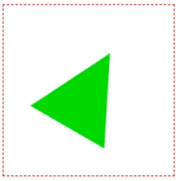
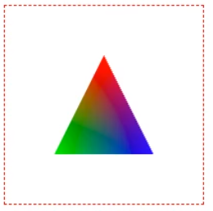

# 页面高性能图形编程

## 第1章-课程介绍

WebGL（全写Web Graphics Library）是一种3D绘图协议，这种绘图技术标准允许把JavaScript和OpenGL ES 2.0结合在一起，通过增加OpenGL ES 2.0的一个JavaScript绑定（即js结合GLSL语言？），WebGL可以为HTML5 Canvas提供硬件3D加速渲染，这样Web开发人员就可以借助系统显卡来在浏览器里更流畅地展示3D场景和模型了，还能创建复杂的导航和数据视觉化。显然，WebGL技术标准免去了开发网页专用渲染插件的麻烦，可被用于创建具有复杂3D结构的网站页面，甚至可以用来设计3D网页游戏等等。    

WebGL 解决了用户在页面中**绘制和渲染 3D 图形**的功能（需求），且使用户通过页面与**三维图形交互成**为可能，这项技术将在下一代开发用户易用直观界面中发挥重要的作用。在接下的几年，WebGL技术将广泛地应用于电子设备的移动终端，包括**平板、手机设备**，因此，WebGL 技术的学习显的特别重要。课程目标：掌握在页面中使用WebGL**绘制3D**展示效果的图形。[WebGL能做什么？](http://127.0.0.1:5500/%E6%BC%94%E7%A4%BA%E6%A1%88%E4%BE%8B/%E6%A1%88%E4%BE%8B%E6%95%88%E6%9E%9C%E5%B1%95%E7%A4%BA.html)

相关技术栈：HTML、HTML5；JavaScript；GLSL ES语言。

## 第2章-WebGL简介

### 使用API绘制一个WebGL图形

```html
<!DOCTYPE html>
<html lang="en">
<head>
    <meta charset="UTF-8">
    <meta name="viewport" content="width=device-width, initial-scale=1.0">
    <meta http-equiv="X-UA-Compatible" content="ie=edge">
    <title>Document</title>
</head>
<body>
    <canvas id="cvs" width="200" height="200" style="border: dashed 1px red">
        你的浏览器不支持画布元素<!-- 不支持则显示该句话 -->
    </canvas>
    <script type="text/javascript">
        var cvs=document.getElementById("cvs"); // 1.获取画布元素
        var gl=cvs.getContext('webgl'); // 2.获取到画布元素的基于webgl的上下文环境对象
        // 3.使用对象中的API实现图形绘制
        gl.clearColor(1.0, 0.0, 0.0, 1.0); //设置绘制图形填充的颜色 // 前三个参数1.0相当于RGBA中的255，第四个参数1.0相当于不透明
        gl.clear(gl.COLOR_BUFFER_BIT); //调用缓存中的值填充图形
    </script>
</body>
</html>
```


### 使用着色器绘制一个 WebGL图形 

WebGL 中的坐标系统：缩放体系（空间坐标系）：每个轴范围是`-1~1`：


注意：不是下图中的体系（直角坐标系）：


着色器：**着色器是**使用 OpenGL ES Shading Language（GLSL）语言编写的程序，负责记录像素点的**位置**和**颜色**，并由**顶点着色器和片段着色器**组成。通过使用GLSL编写这些着色器，并将代码文本传递给WebGL（执行时）来编译。顶点着色器和片段着色器的集合通常称之为**着色器程序**（编写的时候分开编写，使用的时候要合起来）。

**顶点着色器**的功能是将输入顶点从原始坐标系转换到WebGL使用的缩放空间坐标系，每个轴的坐标范围从-1.0到1.0，顶点着色器对顶点坐标进行必要的转换后，保存在名称为gl_Position的特殊变量中备用。

**片段着色器**在顶点着色器处理完图形的顶点后，会被要绘制的每个图形的每个像素点中调用一次，它的功能是确定像素的颜色值，并保存在名称为gl_FragColor的特殊变量中，该颜色值将最终绘制到图形像素的对应位置中。

```html
<!DOCTYPE html>
<html lang="en">
<head>
    <meta charset="UTF-8">
    <meta name="viewport" content="width=device-width, initial-scale=1.0">
    <meta http-equiv="X-UA-Compatible" content="ie=edge">
    <title>Document</title>
</head>
<body>
    <canvas id="cvs" width="200" height="200" style="border: dashed 1px red">你的浏览器不支持画布元素</canvas>
    <script type="text/javascript">
        var cvs=document.getElementById("cvs");
        var gl=cvs.getContext('webgl');

        //顶点着色器变量
        var VSHADER_SOURCE =
           'void main() {' +
           //定义点的坐标并转换成变量保存 // 前三个参数分别是xzy的值
           'gl_Position = vec4(0.0, 0.0, 0.0, 1.0); ' +
           //设置缩放距离的直径
           'gl_PointSize = 10.0; '+
           '} ';
        //片段着色器变量
        var FSHADER_SOURCE =
           'void main() {' +
           //设置图形像素的颜色（RGBA）并保存
           'gl_FragColor = vec4(0.0, 1.0, 0.0, 1.0);' +
           '}';

        var vertShader = gl.createShader(gl.VERTEX_SHADER); //新建一个用于装顶点字符串的着色器对象
        gl.shaderSource(vertShader, VSHADER_SOURCE); //加载保存好的顶点代码字符串变量
        gl.compileShader(vertShader); //编译顶点着色器

        var fragShader = gl.createShader(gl.FRAGMENT_SHADER); //新建一个用于装片段字符串的着色器对象
        gl.shaderSource(fragShader, FSHADER_SOURCE); //加载保存好的片段代码字符串变量
        gl.compileShader(fragShader); //编译片段着色器

        var shaderProgram = gl.createProgram(); //新建一个程序
        //分别附加两个已编译好的着色器对象
        gl.attachShader(shaderProgram, vertShader); // 使用程序来附加顶点着色器
        gl.attachShader(shaderProgram, fragShader); // 使用程序来附加片段着色器
        
        gl.linkProgram(shaderProgram); //链接程序内部的两个已经附加好的着色器
        gl.useProgram(shaderProgram); //开启程序的（正式）使用
        
        // 第一个参数为绘制的类型（如此处为点），第二个参数为开始绘制的地方（如此处为原点），第三个参数为绘制的点的数量
        gl.drawArrays(gl.POINTS, 0, 1); //绘制指定位置的图形（点）
    </script>
</body>
</html>
```


## 第3章-绘制三角形

### 多点绘制方法

attribute变量：它是一种存储限定符，表示定义一个attribute的全局变量，这种变量的数据将由外部向顶点着色器内传输，并保存**顶点**相关的数据，只有顶点着色器才能使用它。使用步骤：①在顶点着色器中，声明一个 attribute 变量；②将 attribute 变量赋值给 gl_Position 变量；③向 attribute 变量（a_Position）传输数据（通过缓存对象）。

使用缓存区关联attribute变量步骤：①创建缓存区对象；②绑定缓存区对象；③将数据写入对象；④将缓存区对象（里的坐标值）分配给attribute变量；⑤开启attribute变量。

绘制一个三角形案例：

```html
<!DOCTYPE html>
<html lang="en">
<head>
    <meta charset="UTF-8">
    <meta name="viewport" content="width=device-width, initial-scale=1.0">
    <meta http-equiv="X-UA-Compatible" content="ie=edge">
    <title>Document</title>
</head>
<body>
    <canvas id="cvs" width="200" height="200" style="border: dashed 1px red">你的浏览器不支持画布元素</canvas>
    <script type="text/javascript">
        var cvs=document.getElementById("cvs");
        var gl=cvs.getContext('webgl');
        
        //顶点着色器变量
        var VSHADER_SOURCE =
           //使用存储限定符（attribute，变量）定义一个用于接收（外部传入的）顶点坐标的变量
           'attribute vec4 a_Position;'+
           'void main() {' +
           //定义点的坐标并转换成变量保存
           'gl_Position = a_Position; ' +
           '} ';
        //片段着色器变量
        var FSHADER_SOURCE =
           'void main() {' +
           'gl_FragColor = vec4(0.0, 1.0, 0.0, 1.0);' +
           '}';
        var vertShader = gl.createShader(gl.VERTEX_SHADER);
        gl.shaderSource(vertShader, VSHADER_SOURCE);
        gl.compileShader(vertShader);
        var fragShader = gl.createShader(gl.FRAGMENT_SHADER);
        gl.shaderSource(fragShader, FSHADER_SOURCE);
        gl.compileShader(fragShader);
        var shaderProgram = gl.createProgram();
        gl.attachShader(shaderProgram, vertShader);
        gl.attachShader(shaderProgram, fragShader);
        gl.linkProgram(shaderProgram);
        gl.useProgram(shaderProgram);

        //先定义一个类型数组保存顶点坐标值
        var vertices = new Float32Array([
                0.0, 0.5, // 该点在正y轴
                -0.5, -0.5, // 该点在第三象限
                0.5, -0.5 // 该点在第四象限
        ]);

        var vertexBuffer = gl.createBuffer(); //创建一个缓存对象
        gl.bindBuffer(gl.ARRAY_BUFFER, vertexBuffer); //说明缓存对象要保存的类型
        gl.bufferData(gl.ARRAY_BUFFER, vertices, gl.STATIC_DRAW); //向缓存对象写入坐标数据 // 三个参数分别代表（数据的）类型、数据、格式

        var a_Position = gl.getAttribLocation(shaderProgram, 'a_Position'); //（通过程序）获取到顶点着色器中的变量（a_Position）
        gl.vertexAttribPointer(a_Position, 2, gl.FLOAT, false, 0, 0); //将（将缓存对象里的）坐标值赋值给变量（a_Position）
        gl.enableVertexAttribArray(a_Position); //开启变量值的使用

        gl.drawArrays(gl.TRIANGLES, 0, 3); //绘制指定位置的图形（三角形）
    </script>
</body>
</html>
```


## 第4章-WebGL动画

### 图形的移动

平移原理：为了平移一个三角形，只需要对它的每个顶点进行移动，即每个顶点加上一个分量，便得到一个新的坐标。公式`X1=X+TX``Y1=Y+TY``Z1=Z+TZ`，如果要图形不变形则要保持每个顶点的偏移量一致，即只需要着色器中为顶点坐标的每个分量加上一个常量就可以实现，当然这需要修改在顶点着色器上。

uniform类型变量：用于保存和传输一致的数据，既可用于顶点，也可用于片断。

绘制一个平移的三角形案例：

```html
<!DOCTYPE html>
<html lang="en">
<head>
    <meta charset="UTF-8">
    <meta name="viewport" content="width=device-width, initial-scale=1.0">
    <meta http-equiv="X-UA-Compatible" content="ie=edge">
    <title>Document</title>
</head>
<body>
    <canvas id="cvs" width="200" height="200" style="border: dashed 1px red">你的浏览器不支持画布元素</canvas>
    <script type="text/javascript">
        var cvs=document.getElementById("cvs");
        var gl=cvs.getContext('webgl');

        //顶点着色器变量
        var VSHADER_SOURCE =
           'attribute vec4 a_Position;'+
           //使用存储限定符定义一个接受（或保存）一致的偏移量的变量
           "uniform vec4 u_Translation;" +
           'void main() {' +
           //定义点的坐标并转换成变量保存
           'gl_Position = a_Position + u_Translation; ' +
           '} ';
        //片段着色器变量
        var FSHADER_SOURCE =
           'void main() {' +
           'gl_FragColor = vec4(0.0, 1.0, 0.0, 1.0);' +
           '}';
        var vertShader = gl.createShader(gl.VERTEX_SHADER);
        gl.shaderSource(vertShader, VSHADER_SOURCE);
        gl.compileShader(vertShader);
        var fragShader = gl.createShader(gl.FRAGMENT_SHADER);
        gl.shaderSource(fragShader, FSHADER_SOURCE);
        gl.compileShader(fragShader);
        var shaderProgram = gl.createProgram();
        gl.attachShader(shaderProgram, vertShader);
        gl.attachShader(shaderProgram, fragShader);
        gl.linkProgram(shaderProgram);
        gl.useProgram(shaderProgram);

        var vertices = new Float32Array([
                0.0, 0.5,
                -0.5, -0.5,
                0.5, -0.5
        ]);
        var vertexBuffer = gl.createBuffer();
        gl.bindBuffer(gl.ARRAY_BUFFER, vertexBuffer);
        gl.bufferData(gl.ARRAY_BUFFER, vertices, gl.STATIC_DRAW);
        var a_Position = gl.getAttribLocation(shaderProgram, 'a_Position');
        gl.vertexAttribPointer(a_Position, 2, gl.FLOAT, false, 0, 0);
        gl.enableVertexAttribArray(a_Position);

        //定义各坐标点的统一偏移量
        var Tx = 0.2, Ty = 0.3, Tz = 0.0;
        //（通过程序）获取到顶点着色器中uniform变量（注意获取的是变量的地址，而不是值）
        var u_Translation = gl.getUniformLocation(shaderProgram, 'u_Translation');
        //将多个偏移量赋值值给uniform变量
        gl.uniform4f(u_Translation, Tx, Ty, Tz, 0.0);

        gl.drawArrays(gl.TRIANGLES, 0, 3); //绘制指定位置的图形（三角形）
    </script>
</body>
</html>
```


### 图形的旋转

旋转原理：为了描述一个图形的旋转过程，必须指明以下内容：①旋转轴（围绕X或Y轴或Z轴旋转）；②旋转的方向，负值是为顺时针，正值时为逆时针；③旋转的角度（图形经过的角度）。


```html
<!DOCTYPE html>
<html lang="en">
<head>
    <meta charset="UTF-8">
    <meta name="viewport" content="width=device-width, initial-scale=1.0">
    <meta http-equiv="X-UA-Compatible" content="ie=edge">
    <title>Document</title>
</head>
<body>
    <canvas id="cvs" width="200" height="200" style="border: dashed 1px red">你的浏览器不支持画布元素</canvas>
    <script type="text/javascript">
        var cvs=document.getElementById("cvs");
        var gl=cvs.getContext('webgl');

        //顶点着色器变量
        var VSHADER_SOURCE =
           //使用存储限定符定义一个接受顶点坐标的变量
           'attribute vec4 a_Position;'+
           'uniform float u_CosB,u_SinB;'+
           'void main() {' +
           //定义点的坐标并转换成变量保存
           'gl_Position.x = a_Position.x * u_CosB - a_Position.y * u_SinB;' +
           'gl_Position.y = a_Position.x * u_SinB + a_Position.y * u_CosB;' +
           'gl_Position.z= a_Position.z;'+
           // gl_Position.w意义不大，只是配合vec4的格式，传够4个值
           'gl_Position.w = 1.0;' +
           '} ';
        //片段着色器变量
        var FSHADER_SOURCE =
           'void main() {' +
           //设置图形像素的颜色并保存
           'gl_FragColor = vec4(0.0, 1.0, 0.0, 1.0);' +
           '}';
        var vertShader = gl.createShader(gl.VERTEX_SHADER);
        gl.shaderSource(vertShader, VSHADER_SOURCE);
        gl.compileShader(vertShader);
        var fragShader = gl.createShader(gl.FRAGMENT_SHADER);
        gl.shaderSource(fragShader, FSHADER_SOURCE);
        gl.compileShader(fragShader);
        var shaderProgram = gl.createProgram();
        gl.attachShader(shaderProgram, vertShader);
        gl.attachShader(shaderProgram, fragShader);
        gl.linkProgram(shaderProgram);
        gl.useProgram(shaderProgram);

        var vertices = new Float32Array([
                0.0, 0.5,
                -0.5, -0.5,
                0.5, -0.5
        ]);
        var vertexBuffer = gl.createBuffer();
        gl.bindBuffer(gl.ARRAY_BUFFER, vertexBuffer);
        gl.bufferData(gl.ARRAY_BUFFER, vertices, gl.STATIC_DRAW);
        var a_Position = gl.getAttribLocation(shaderProgram, 'a_Position');
        gl.vertexAttribPointer(a_Position, 2, gl.FLOAT, false, 0, 0);
        gl.enableVertexAttribArray(a_Position);

        var ANGLE = -30.0; //设置需要旋转的角度
        var radian = Math.PI * ANGLE / 180.0; //将角度转成弧度用于（三角）函数的计算
        //计算并保存正弦和余弦的值
        var cosB = Math.cos(radian);
        var sinB = Math.sin(radian);
        //（通过程序）从顶点着色器中分别取出变量并保存
        var u_CosB = gl.getUniformLocation(shaderProgram, 'u_CosB');
        var u_SinB = gl.getUniformLocation(shaderProgram, 'u_SinB');
        //将计算好的函数值赋给变量
        gl.uniform1f(u_CosB, cosB);
        gl.uniform1f(u_SinB, sinB);

        gl.drawArrays(gl.TRIANGLES, 0, 3); //绘制指定位置的图形（三角形）
    </script>
</body>
</html>
```



### 图形的缩放

缩放的原理：通过改变原有图形中的矩阵值，实现图形的拉大和缩下效果，因此，只需要修改原有图形的矩阵值即可。根据顶点坐标的距离进行相乘，按照位置、方向、值进行缩放。


```html
<!DOCTYPE html>
<html lang="en">
<head>
    <meta charset="UTF-8">
    <meta name="viewport" content="width=device-width, initial-scale=1.0">
    <meta http-equiv="X-UA-Compatible" content="ie=edge">
    <title>Document</title>
</head>
<body>
    <canvas id="cvs" width="200" height="200" style="border: dashed 1px red">你的浏览器不支持画布元素</canvas>
    <script type="text/javascript">
        var cvs=document.getElementById("cvs");
        var gl=cvs.getContext('webgl');

        //顶点着色器变量
        var VSHADER_SOURCE =
           //使用存储限定符定义一个接受顶点坐标的变量
           'attribute vec4 a_Position;'+
           // mat4表示4*4的矩阵
           'uniform mat4 u_xformMatrix;'+
           'void main() {' +
           //定义点的坐标并转换成变量保存
           'gl_Position = a_Position * u_xformMatrix; ' +
           '} ';
        //片段着色器变量
        var FSHADER_SOURCE =
           'void main() {' +
           'gl_FragColor = vec4(0.0, 1.0, 0.0, 1.0);' +
           '}';
        var vertShader = gl.createShader(gl.VERTEX_SHADER);
        gl.shaderSource(vertShader, VSHADER_SOURCE);
        gl.compileShader(vertShader);
        var fragShader = gl.createShader(gl.FRAGMENT_SHADER);
        gl.shaderSource(fragShader, FSHADER_SOURCE);
        gl.compileShader(fragShader);
        var shaderProgram = gl.createProgram();
        gl.attachShader(shaderProgram, vertShader);
        gl.attachShader(shaderProgram, fragShader);
        gl.linkProgram(shaderProgram);
        gl.useProgram(shaderProgram);

        var vertices = new Float32Array([
                0.0, 0.5,
                -0.5, -0.5,
                0.5, -0.5
        ]);
        var vertexBuffer = gl.createBuffer();
        gl.bindBuffer(gl.ARRAY_BUFFER, vertexBuffer);
        gl.bufferData(gl.ARRAY_BUFFER, vertices, gl.STATIC_DRAW);
        var a_Position = gl.getAttribLocation(shaderProgram, 'a_Position');
        gl.vertexAttribPointer(a_Position, 2, gl.FLOAT, false, 0, 0);
        gl.enableVertexAttribArray(a_Position);

        var Sx = 1.5; Sy = 1.5; Sz = 1.0; //设置缩放的距离值
        var xformMatrix = new Float32Array([ //定义一个4*4的距阵
          Sx, 0.0, 0.0, 0.0,
          0.0, Sy, 0.0, 0.0,
          0.0, 0.0, Sz, 0.0,
          0.0, 0.0, 0.0, 1.0
        ]);
        var u_xformMatrix = gl.getUniformLocation(shaderProgram,'u_xformMatrix'); //（通过程序）获取到顶点着色器中距阵变量
        gl.uniformMatrix4fv(u_xformMatrix, false, xformMatrix); //将设置的值（定义的矩阵）赋值给变量

        gl.drawArrays(gl.TRIANGLES, 0, 3); //绘制指定位置的图形（三角形）
    </script>
</body>
</html>
```


### 旋转动画实现

**屏幕刷新频率**：   图像在屏幕上更新的速度，也即屏幕上的图像每秒钟出现的次数，一般是60Hz（每秒60次）的屏幕每16.7ms刷新一次。

**动画原理**：图像被刷新时，引起以连贯的、平滑的方式进行过渡变化。

**核心方法**：执行一个动画，并在下次绘制前调用callback回调函数更新该动画：`requestAnimationFrame(callback)`。

需求：制作一个按旋转三角形的动画。效果：


```html
<!DOCTYPE html>
<html lang="en">
<head>
    <meta charset="UTF-8">
    <meta name="viewport" content="width=device-width, initial-scale=1.0">
    <meta http-equiv="X-UA-Compatible" content="ie=edge">
    <title>Document</title>
</head>
<body>
    <canvas id="cvs" width="200" height="200" style="border: dashed 1px red">你的浏览器不支持画布元素</canvas>
    <script type="text/javascript">
        var cvs=document.getElementById("cvs");
        var gl=cvs.getContext('webgl');

        //顶点着色器变量
        var VSHADER_SOURCE =
            //使用存储限定符定义一个接受顶点坐标的变量
            'attribute vec4 a_Position;' +
            'uniform float u_CosB,u_SinB;' +
            'void main() {' +
            //定义点的坐标并转换成变量保存
            'gl_Position.x = a_Position.x * u_CosB - a_Position.y * u_SinB;' +
            'gl_Position.y = a_Position.x * u_SinB + a_Position.y * u_CosB;' +
            'gl_Position.z= a_Position.z;' +
            'gl_Position.w = 1.0;' +
            '} ';
        //片段着色器变量
        var FSHADER_SOURCE =
            'void main() {' +
            'gl_FragColor = vec4(0.0, 1.0, 0.0, 1.0);' +
            '}';
        var vertShader = gl.createShader(gl.VERTEX_SHADER);
        gl.shaderSource(vertShader, VSHADER_SOURCE);
        gl.compileShader(vertShader);
        var fragShader = gl.createShader(gl.FRAGMENT_SHADER);
        gl.shaderSource(fragShader, FSHADER_SOURCE);
        gl.compileShader(fragShader);
        var shaderProgram = gl.createProgram();
        gl.attachShader(shaderProgram, vertShader);
        gl.attachShader(shaderProgram, fragShader);
        gl.linkProgram(shaderProgram);
        gl.useProgram(shaderProgram);

        var vertices = new Float32Array([
                0.0, 0.5,
                -0.5, -0.5,
                0.5, -0.5
        ]);
        var vertexBuffer = gl.createBuffer();
        gl.bindBuffer(gl.ARRAY_BUFFER, vertexBuffer);
        gl.bufferData(gl.ARRAY_BUFFER, vertices, gl.STATIC_DRAW);
        var a_Position = gl.getAttribLocation(shaderProgram, 'a_Position');
        gl.vertexAttribPointer(a_Position, 2, gl.FLOAT, false, 0, 0);
        gl.enableVertexAttribArray(a_Position);

        function draw(ANGLE) {
            var radian = Math.PI * ANGLE / 180.0;
            var cosB = Math.cos(radian);
            var sinB = Math.sin(radian);
            var u_CosB = gl.getUniformLocation(shaderProgram, 'u_CosB');
            var u_SinB = gl.getUniformLocation(shaderProgram, 'u_SinB');
            gl.uniform1f(u_CosB, cosB);
            gl.uniform1f(u_SinB, sinB);
            gl.clear(gl.COLOR_BUFFER_BIT);
            gl.drawArrays(gl.TRIANGLES, 0, 3);
        }

        var cur_time = Date.now(); // 获取旋转前时间
        var ANGLE_INIT = 20.0; // 初始状态角度值
        var ANGLE_STEP = -10.0; // 旋转角度(度/秒)（负数为顺时针）
        var ANGLE_ACT = 0.0; // 执行时的角度值（一共旋转了的角度）
        function animate(c1, a1, a2) { // 参数分别为上一次时间、初始角度、每秒要旋转的角度
            var act_time = Date.now(); // 计算距离上次调用经过了多长时间
            var dif_time = act_time - c1; //得到这一次调用与一开始的时间间隔
            var ANGLE_NEW = a1 + a2 * (dif_time / 1000.0);
            return ANGLE_NEW %= 360; //返回一个始终是小于360°的角度
        }
        function tick() {
            ANGLE_ACT = animate(cur_time, ANGLE_INIT, ANGLE_STEP);
            console.log(ANGLE_ACT);
            draw(ANGLE_ACT);
            window.requestAnimationFrame(tick); // 建议使用
        }
        // setInterval(tick, 100) // 不建议采用这种人为设置且弹性较大的方式，不够平滑
        tick(); // 首次执行调用
    </script>
</body>
</html>
```

## 第5章-WebGL颜色

### 操作步骤

颜色添加步骤：

1. 在顶点着色器中定义一个接收外部传入颜色值的属性变量a_Color和用于传输获取到的颜色值变量v_Color；
2. 在片段着色器中定义一个同一类型和名称的v_Color变量接收传顶点传入的值（由片段着色器按不同顶点的颜色进行绘制）；
3. 重新传入到顶点坐标和颜色值的类型化数组；
4. 将数组值传入缓存中并取出，赋值给顶点的两个变量；
5. 接收缓存值并绘制图形和颜色。

vertexAttribPointer方法：将保存在缓存里的各个顶点的坐标值（或颜色值）一次性地赋值到顶点着色器的各个变量中。

|   参数    | 说明                                                         |
  | :-------: | ------------------------------------------------------------ |
  | 第1个参数 | 指定待分配attribute变量的存储位置                            |
  | 第2个参数 | 指定缓存区中每个顶点的分量个数（1~4）                        |
  | 第3个参数 | 类型有，无符号字节，短整数，无符号短整数，整型，无符号整型，浮点型 |
  | 第4个参数 | 表示是否将非浮点型的数据归到[0,1][-1,1]区间                  |
  | 第5个参数 | 相邻两个顶点的字节数。默认为0                                |
  | 第6个参数 | 表示缓存区对象的偏移量（以字节为单位），attribute 变量从缓冲区中的何处开始存储 |

案例实现：

1. 添加画布元素，并获取webGL对象，保存在变量中。
2. 定义着色器内容，并进行附件编译。
3. 使用缓存对象向顶点传入多个坐标数据。
4. 根据坐标数据绘制图像。

### 着色器编译与图像绘制

```html
<!DOCTYPE html>
<html lang="en">
<head>
    <meta charset="UTF-8">
    <meta name="viewport" content="width=device-width, initial-scale=1.0">
    <meta http-equiv="X-UA-Compatible" content="ie=edge">
    <title>Document</title>
</head>
<body>
    <canvas id="cvs" width="200" height="200" style="border: dashed 1px red">你的浏览器不支持画布元素</canvas>
    <script type="text/javascript">
        var cvs=document.getElementById("cvs");
        var gl=cvs.getContext('webgl');
        
        //顶点着色器变量
        var VSHADER_SOURCE =
           //使用存储限定符定义一个接受顶点坐标的变量
           'attribute vec4 a_Position;'+
           'attribute vec4 a_Color;'+
           // varying类型的变量负责传输
           'varying vec4 v_Color;'+
           'void main() {' +
           //定义点的坐标并转换成变量保存
           'gl_Position = a_Position; ' +
           // 由外面传过来的a_Color传递给v_Color，再由下面的片段着色器的v_Color进行接收
           'v_Color = a_Color; ' +
           '} ';
        //片段着色器变量
        var FSHADER_SOURCE =
           // 声明变量的精度，此处为中等精度
           'precision mediump float;'+
           'varying vec4 v_Color;'+
           'void main() {' +
           //设置图形像素的颜色并保存
           'gl_FragColor = v_Color;' +
           '}';
        var vertShader = gl.createShader(gl.VERTEX_SHADER);
        gl.shaderSource(vertShader, VSHADER_SOURCE);
        gl.compileShader(vertShader);
        var fragShader = gl.createShader(gl.FRAGMENT_SHADER);
        gl.shaderSource(fragShader, FSHADER_SOURCE);
        gl.compileShader(fragShader);
        var shaderProgram = gl.createProgram();
        gl.attachShader(shaderProgram, vertShader);
        gl.attachShader(shaderProgram, fragShader);
        gl.linkProgram(shaderProgram);
        gl.useProgram(shaderProgram);

        //定义一个类型数组保存顶点坐标值（包含坐标值和每个顶点的颜色值）
        var vertices = new Float32Array([
            // x, y, red, green, blue
            0.0, 0.5, 1.0, 0.0, 0.0,
            -0.5, -0.5, 0.0, 1.0, 0.0,
            0.5, -0.5, 0.0, 0.0, 1.0,
        ]);
        var vertexBuffer = gl.createBuffer(); //先创建一个缓存对象
        gl.bindBuffer(gl.ARRAY_BUFFER, vertexBuffer); //说明缓存对象保存的类型
        gl.bufferData(gl.ARRAY_BUFFER, vertices, gl.STATIC_DRAW); //写入坐标数据
        var FSIZE = vertices.BYTES_PER_ELEMENT; //获取到数组中单个元素的字节数

        var a_Position = gl.getAttribLocation(shaderProgram, 'a_Position'); //（通过程序）获取到顶点着色器中变量
        gl.vertexAttribPointer(a_Position, 2, gl.FLOAT, false, FSIZE*5, 0); //将坐标值赋值给变量（分段读取并赋值）
        gl.enableVertexAttribArray(a_Position); //开启变量值的使用
        var a_Color = gl.getAttribLocation(shaderProgram, 'a_Color'); //（通过程序）获取到顶点着色器中变量
        gl.vertexAttribPointer(a_Color, 3, gl.FLOAT, false, FSIZE*5, FSIZE*2); //将颜色值赋值给变量（分段读取并赋值）
        gl.enableVertexAttribArray(a_Color); //开启变量值的使用

        gl.drawArrays(gl.TRIANGLES, 0, 3);
    </script>
</body>
</html>
```


