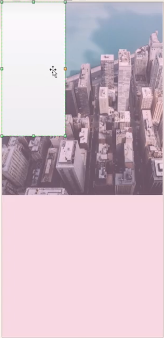

# HTML5游戏引擎

## 前置知识 Typescript基础语法

TypeScript是Microsoft公司（微软）注册商标。TypeScript具有类型系统，且是JavaScript的超集，它可以编译成普通的JavaScript代码。TypeScript支持任意浏览器、任意环境、任意系统，并且是开源的。TypeScript目前还在积极的开发完善之中，不断地会有新的特性加入进来。 


### 安装和编译

安装：`npm install -g typescript`。编译代码：`tsc index.ts`或`tsc --watch index.ts`（监听ts文件并实时编译打包成js文件。另外也可以通过webpack去监听并打包。另外tsc-node插件可以直接执行ts文件，其原理是该插件会在内存中打包成对应的js文件并执行）。

### 基本类型

为了让程序有价值，需要能够处理最简单的数据单元：数字、字符串、布尔值、结构体等，此外还提供了实用的枚举类型方便使用。

#### 数字

TypeScript里的所有数字都是浮点数（和JavaScript一样）， 这些浮点数的类型是`number`。 除了支持十进制和十六进制字面量，TypeScript还支持ECMAScript 2015中引入的二进制和八进制字面量。

```js
let decLiteral: number = 6;
let hexLiteral: number = 0xf00d;
let binaryLiteral: number = 0b1010;
let octalLiteral: number = 0o744;
```

#### 字符串

使用`string`表示文本数据类型，用来处理网页或服务器端的文本数据。可以使用双引号（`"`）或单引号（`'`）表示字符串；还可以使用*模版字符串*，它可以定义多行文本和内嵌表达式。 这种字符串是被反引号包围（\`\`），并且以`${ expr }`这种形式嵌入表达式。

```js
let name: string = "bob";
name = "smith";

let name1: string = `Gene`;
let age: number = 37;
let sentence: string = `Hello, my name is ${ name1 }.
I'll be ${ age + 1 } years old next month.`;
// 与下面定sentence的方式的效果相同
let sentence: string = "Hello, my name is " + name + ".\n\n" +
    "I'll be " + (age + 1) + " years old next month.";
```

#### 布尔值

为true/false值，叫做`boolean`。

```js
let isDone: boolean = false;
```

#### Null 和 Undefined

TypeScript里，`undefined`和`null`的类型分别叫做`undefined`和`null`。 和`void`相似，它们的本身的类型用处不是很大。默认情况下`null`和`undefined`是所有类型的子类型，即可以把`null`和`undefined`赋值给`number`类型的变量。
但当指定了`--strictNullChecks`标记，`null`和`undefined`只能赋值给`void`和它们各自，这能避免很多常见的问题。当在某处要传入一个`string`或`null`或`undefined`，则可以使用联合类型`string | null | undefined`。
建议尽可能地使用`--strictNullChecks`，但在本手册里假设这个标记是关闭的。

```js
// Not much else we can assign to these variables!
let u: undefined = undefined;
let n: null = null;
```

#### 数组

TypeScript像JavaScript一样可以操作数组元素。有两种方式可以定义数组：①可以在元素类型后面接上`[]`，表示由此类型元素组成的一个数组：

```js
let list: number[] = [1, 2, 3];
```

#### 元组

元组（Tuple）类型允许表示一个已知元素数量和类型的数组，各元素的类型不必相同（如可以定义一对值分别为`string`和`number`类型的元组）：

```js
// Declare a tuple type
let x: [string, number];
// Initialize it
x = ['hello', 10]; // OK
// Initialize it incorrectly
x = [10, 'hello']; // Error

// 当访问一个已知索引的元素，会得到正确的类型：
console.log(x[0].substr(1)); // OK
console.log(x[1].substr(1)); // Error, 'number' does not have 'substr'

// 当访问一个越界的元素，会使用联合类型替代：
x[3] = 'world'; // OK, 字符串可以赋值给(string | number)类型
console.log(x[5].toString()); // OK, 'string' 和 'number' 都有 toString
x[6] = true; // Error, 布尔不是(string | number)类型
```

#### 任意值

有时候，要为那些在编程阶段还不清楚类型的变量指定一个类型，这些值可能来自于动态的内容（如来自用户输入或第三方代码库）。这种情况下，则不需要类型检查器对这些值进行检查而是直接让它们通过编译阶段的检查，则可以使用`any`类型来标记这些变量：

```js
let notSure: any = 4;
notSure = "maybe a string instead";
notSure = false; // okay, definitely a boolean

// `any`类型允许在编译时可选择地包含或移除类型检查。另外，`any`类型与`Object`有不同之处，`Object`类型的变量只是允许给它赋任意值，但是不能在它上面调用任意的方法（即便它真的有这些方法）：
let notSure: any = 4;
notSure.ifItExists(); // okay, ifItExists might exist at runtime
notSure.toFixed(); // okay, toFixed exists (but the compiler doesn't check)
let prettySure: Object = 4;
prettySure.toFixed(); // Error: Property 'toFixed' doesn't exist on type 'Object'.

// 当只知道一部分数据的类型时，`any`类型也是有用的（如有一个数组，它包含了不同的类型的数据）：
let list: any[] = [1, true, "free"];
list[1] = 100;
```

#### 空值

在某种程度上，`void`类型像是与`any`类型相反，它表示没有任何类型。 当一个函数没有返回值时，其返回值类型通常是`void`。另外，声明一个`void`类型的变量没有什么大用，因为只能为它赋予`undefined`和`null`：

```js
function warnUser(): void {
    alert("This is my warning message");
}
let unusable: void = undefined;
```

#### Never

`never`类型表示的是那些永不存在的值的类型。例如，`never`类型是那些总是会抛出异常或根本就不会有返回值的函数表达式或箭头函数表达式的返回值类型；当变量被永不为真的类型保护所约束时，也可能是`never`类型。
`never`类型是任何类型的子类型，也可以赋值给任何类型；但没有类型是`never`的子类型或可以赋值给`never`类型（除了`never`本身之外），即使`any`也不可以赋值给`never`。

```js
// 返回never的函数必须存在无法达到的终点
function error(message: string): never {
    throw new Error(message);
}
// 推断的返回值类型为never
function fail() {
    return error("Something failed");
}
// 返回never的函数必须存在无法达到的终点
function infiniteLoop(): never {
    while (true) {
    }
}
```

#### 类型断言

如果比TypeScript更了解某个值的详细信息，通常这会发生在清楚地知道一个实体具有比它现有类型更确切的类型。类型断言好比其它语言里的类型转换，但是不进行特殊的数据检查和解构。 它没有运行时的影响，只是在编译阶段起作用。TypeScript会假设已经进行了必须的检查。

```js
// 当 TypeScript 不确定一个联合类型的变量到底是哪个类型的时候，只能访问此联合类型的所有类型里共有的属性或方法：
function getLength(something: string | number): number {
    return something.length;
}
// index.ts(2,22): error TS2339: Property 'length' does not exist on type 'string | number'.
//   Property 'length' does not exist on type 'number'.

// 当确实需要在还不确定类型的时候就访问其中一个类型的属性或方法，如：
function getLength(something: string | number): number {
    if (something.length) { // 如36.length会报错，而Number(36).length为undefined
        return something.length;
    } else {
        return something.toString().length;
    }
}
// index.ts(2,22): error TS2339: Property 'length' does not exist on type 'string | number'.
//   Property 'length' does not exist on type 'number'.
// 上面获取 something.length 的时候会报错，此时可以使用类型断言，将 something 断言成 string：
function getLength(something: string | number): number {
    if ((<string>something).length) {
        return (<string>something).length; // 但如果something为数字，则运行起来还是会报错
    } else {
        return something.toString().length;
    }
}
```

### 类

#### Class示例

```js
// 声明一个`Greeter`类。这个类有3个成员：一个`greeting`的属性、一个构造函数和一个`greet`方法。注意在引用任何一个类成员时用了`this`，它表示访问的是类的成员。使用`new`构造了`Greeter`类的一个实例，它会调用之前定义的构造函数，创建一个`Greeter`类型的新对象，并执行构造函数初始化它。
class Greeter {
    greeting: string;
    constructor(message: string) {
        this.greeting = message;
    }
    greet() {
        return "Hello, " + this.greeting;
    }
}
let greeter = new Greeter("world");
```

#### 继承

在TypeScript里，可以使用常用的面向对象模式：基于类的程序设计中，一种最基本的模式是允许使用继承来扩展现有的类。

```js
class Animal {
    name: string;
    constructor(theName: string) { this.name = theName; }
    move(distanceInMeters: number = 0) {
        console.log(`${this.name} moved ${distanceInMeters}m.`);
    }
    bark() {
        console.log('Woof! Woof!');
    }
}
// `Snake`是一个派生类，它通过`extends`关键字，派生自`Animal`基类。派生类通常被称作子类，基类通常被称作超类。
class Snake extends Animal { // 类从基类中继承了属性和方法
    constructor(name: string) { super(name); }
    move(distanceInMeters = 5) {
        console.log("Slithering...");
        super.move(distanceInMeters);
    }
}
class Horse extends Animal {
    constructor(name: string) { super(name); }
    move(distanceInMeters = 45) {
        console.log("Galloping...");
        super.move(distanceInMeters);
    }
}
let sam = new Snake("Sammy the Python");
let tom: Animal = new Horse("Tommy the Palomino");
sam.move(); // 因为`Snake`继承了`Animal`的功能，所以创建一个`Dog`的实例，它能够`bark()`和`move()`。
tom.move(34);
```

#### 公共、私有与受保护的修饰符

**①默认为`public`**

 在TypeScript里，成员都默认为`public`。如在上面的例子里，可以自由的访问程序里定义的成员，也可以明确的将一个成员标记成`public`：

```js
class Animal {
    public name: string;
    public constructor(theName: string) { this.name = theName; }
    public move(distanceInMeters: number) {
        console.log(`${this.name} moved ${distanceInMeters}m.`);
    }
}
```

**②private**

当成员被标记成`private`时，则不能在声明它的类的外部访问。如：

```js
class Animal {
    private name: string;
    constructor(theName: string) { this.name = theName; }
}
new Animal("Cat").name; // 错误: 'name' 是私有的
```

**③protected**

`protected`修饰符类似`private`修饰符，但`protected`成员在派生类中仍然可以访问。如：

```js
class Person {
    protected name: string;
    constructor(name: string) { this.name = name; }
}
class Employee extends Person {
    private department: string;
    constructor(name: string, department: string) {
        super(name)
        this.department = department;
    }
    public getElevatorPitch() {
        return `Hello, my name is ${this.name} and I work in ${this.department}.`;
    }
}
let howard = new Employee("Howard", "Sales");
console.log(howard.getElevatorPitch());
// 不能在`Person`类外使用`name`，但是仍然可以通过`Employee`类的实例方法访问，因为`Employee`是由`Person`派生而来的。
console.log(howard.name); // 错误。
```

**④readonly修饰符**

可以使用`readonly`关键字将属性设置为只读的，只读属性必须在声明时或构造函数里被初始化。

```js
class Octopus {
    readonly name: string;
    readonly numberOfLegs: number = 8;
    constructor (theName: string) {
        this.name = theName;
    }
}
let dad = new Octopus("Man with the 8 strong legs");
dad.name = "Man with the 3-piece suit"; // 错误! name 是只读的.
```

## 为什么要HTML5游戏

**①技术角度**

从早期的像素的游戏（俄罗斯方块），到小霸王游戏机（魂斗罗），到2D游戏（传奇、DNF、冒险岛、LOL），3D游戏（CF、吃鸡）。玩家越来越被精美的画面，精美的特效所吸引。传统的游戏绝大多数使用C++编写完成，借助GPU来提升游戏画面的品质和渲染性能，很多游戏都会依赖于游戏引擎开发：

①Creation引擎，代表作有《上古卷轴5：天际》和《辐射》；②Unreal Engine（虚幻引擎），代表作有《战争机器》,《绝地求生》等；③Frostbite Engine（寒霜引擎），代表作有《荣誉勋章》和《战地》。

这些游戏都运行在各自的平台上，如：ps4、switch、windows PC等。而HTML5可以让游戏运行在浏览器，特点：跨平台 （pc、安卓、ios）；点开即玩，适合小快灵的游戏（跳一跳、斗地主、麻将等）；画质和体验不及传统游戏（性能、加载速度、画质）；

**②非技术角度**

传统游戏需要exe文件进行解压安装，或者 买光盘进行游戏。但是html5游戏只需要得到一个URL地址就可以愉快的进行游戏了。

## 为什么要游戏引擎

几年前，很多前端开发者尝试使用Canvas来制作游戏，甚至有的开发者使用DIV来开发游戏，体验可想而知。因为在当时并没有一款真正意义上的游戏引擎，很多的所谓的"HTML5游戏引擎"，实际上仅仅是一个渲染框架。真正的游戏需要考虑很多问题，如渲染、网络（延迟）、音频、碰撞检测等，而Egret提供了大量的工具解决这些问题。

Egret：Egret跨平台，入手容易，性能较好，更新频繁，辅助开发工具较多，团队合作更加得心应手。


Cocos2d-x：Cocos2d-x 最开始的时候主打跨平台使用C++开发较多, 后来才兼容的js。虽然发展的时间很长，但是BUG偏多，性能不如Egret。


历史总是向前发展的，cocos2D 和 Egret就好比angular1 和 React，要选择思想更先进，社区更繁荣的框架。

## 第一节 Egret简介

### Egret介绍

Egret引擎是一个开源免费的游戏框架，用于构建二维游戏、演示程序和其它图形界面交互应用等。Egret使用**TypeScript**脚本语言开发，当游戏完成最终的打包后，可以将程序转换为HTML5游戏，实现跨平台特性。

Egret不仅仅是一个基于HTML5技术的游戏引擎，在Egret产品线中除了Egret引擎还提供了很多辅助游戏开发的工具。**准确地说，Egret是一套游戏开发的解决方案。**可以使用Egret引擎来开发HTML5游戏，并运行在手机和PC端的浏览器中，同时也可以使用Egret提供的相关工具搭建自己的游戏开发工作流。

**①开源免费**

基于BSD开源协议的Egret引擎，可以自由的使用Egret来创作自己的游戏。

> BSD开源协议是一个给于使用者很大自由的协议。基本上使用者可以”为所欲为”，可以自由的使用，修改源代码，也可以将修改后的代码作为开源或者专有软件再发布。
> 
>Apache Licence是著名的非盈利开源组织Apache采用的协议。该协议和BSD类似，同样鼓励代码共享和尊重原作者的著作权，同样允许代码修改，再发布（作为开源或商业软件），需要满足的条件也和BSD类似。
> 
> GPL协议的主要内容是只要在一个软件中使用（”使用”指类库引用，修改后的代码或者衍生代码）GPL协议的产品，则该软件产品必须也采用GPL协议，既必须也是开源和免费。(代表： linux)

**②优秀的设计思想**

Egret的设计思想大量借鉴了优秀的2D动画软件Flash的一些设计思想（，且更加针对游戏开发）。在引擎的设计中，Egret底层使用了弹性跑道模型、显示列表、脏矩阵、事件模型等技术。在这些技术基础之上，封装了对用户极为友好的API。开发者在开发游戏时，无需考虑底层渲染逻辑，只关心游戏逻辑即可。

**③高效的渲染模块**

在图形图像渲染中，Egret完全使用HTML5标准中的canvas技术。极大程度上保证了使用Egret引擎开发的游戏在各个浏览器上的兼容性。同时，为了给玩家更好的游戏体验，不仅提供了CPU渲染，还提供了性能更为强大的硬件加速渲染模式。该模式无需开发者自动开启，引擎会根据当前用户硬件类型智能判断启用。

**④完善的配套工具**

Egret引擎的设计宗旨始终围绕在简化游戏开发上，用户在使用Egret的时候，能够体会到所有的引擎设计全部围绕游戏开发。同时Egret提供的配套工具也极大简化了游戏开发流程。从游戏的代码编写、UI制作、地图拼接、关卡制作到最终游戏上线，研发过程中都有大量工具支撑。

**⑤灵活的工作流**

Egret不限制开发工具的使用，也为一些优秀的第三方工具提供了相关插件，让用户在不改变开发习惯的情况下无缝迁移到Egret。

**⑥社区支持**

Egret为用户建立了用户社区，如果在使用Egret过程中遇到了哪些问题，可以直接在用户社区中得到答案。同时也为用户提供了大量文档手册（https://bbs.egret.com/portal.php），方便用户学习。


### 主要功能

- 显示列表：清晰、稳健、高效的视觉抽象结构；
- 精灵：一种轻量级显示容器；
- 事件机制：提供了一套生成和处理事件消息的标准方法；
- 纹理集合：将大量图片汇集为一张纹理图进行处理；
- 矢量绘图：封装了方便简单的矢量绘图功能；
- 网络加载：封装了常用的网络通讯协议；
- 位图字体：可通过位图字体方式显示文本；
- 性能监控：可在游戏中快速开启性能监控面板；
- 反射：对TypeScript增加了反射机制，方便模块化开发；
- XML处理：提供标准的XML格式解析生成功能；
- 骨骼动画：支持业内最优骨骼动画解决方案DragonBones；
- 资源加载：提供了整套资源加载方案，优化网络加载功能；
- EUI：提供大量组件，可快速开发游戏中的UI控件；

## 第二节 安装与创建项目

### 安装Launcher

`Egret Launcher`，是egret的一个开发平台，类似微信小程序的调试工具。打开 Egret Launcher，会显示登录界面，登陆成功后会显示 Egret Launcher 主界面。https://egret.com/downloads/engine.html


### 安装引擎

Egret Engine，选择自己需要的版本进行安装，如微信小程序依赖的版本等。


### 安装编辑器

Egret Wing3。


### 创建项目

步骤：点击菜单 `项目` -> `创建项目` 来创建项目（也可以选择`导入项目`来导入已有项目），项目可以直接在Egret Launcher 中进行打开和管理。在弹出的新建项目面板中，设置项目的基本配置：

项目名称：当前项目的名称，如HelloWorld。项目路径：该项目所存放的文件路径。
项目类型：该项目的项目类型，如 Egret 游戏项目、Egret EUI 项目。引擎版本：当前项目所使用的 Egret 的版本。
选择扩展库：项目中需要使用的系统库，更多关于扩展库选择的介绍可以参考[扩展库简介](http://developer.egret.com/cn/github/egret-docs/Engine2D/projectConfig/extendRepSummary/index.html)。
舞台尺寸：默认游戏舞台的高度与宽度，以像素为单位。
缩放模式：屏幕的适配方式，这里选择showALL模式，更多关于缩放模式的介绍可以参考[屏幕适配](http://developer.egret.com/cn/github/egret-docs/Engine2D/screenAdaptation/screenAdaptation/index.html)。
旋转方式：屏幕的旋转模式，这里选择auto模式，更多关于旋转设置的介绍可以参考[屏幕适配](http://developer.egret.com/cn/github/egret-docs/Engine2D/screenAdaptation/screenAdaptation/index.html)。


**项目结构：**在Egret Wing左侧，可看到当前项目的目录结构，各文件夹功能说明：

- .wing：包括 Egret 项目的任务配置文件和启动配置文件。
- bin-debug：项目调试时，所产生的文件存放于此目录。
- libs：库文件，包括 Egret 核心库和其他扩展库存放于此目录。
- resource：项目资源文件存放于此目录。
- scripts：项目构建和发布时需要用到的脚本文件存放在此目录。
- src：项目代码文件存放于此目录。
- template：项目模板文件存放于此目录。
- egretProperties.json：项目的配置文件，具体的配置说明可以参考[EgretProperties说明](http://developer.egret.com/cn/github/egret-docs/Engine2D/projectConfig/configFile/index.html)。
- index.html：入口文件，具体的配置说明可以参考[入口文件说明](http://developer.egret.com/cn/github/egret-docs/Engine2D/projectConfig/indexFile/index.html)。
- manifest.json：网页清单文件。
- tsconfig.json：typescript编译配置文件。
- wingProperties.json：Egret Wing项目配置文件。

### 运行项目

点击菜单“项目”->“构建”，编译项目。构建完成之后点击菜单“项目”->“调试”，运行项目（或直接点击调试图标）。（egret会对ts文件进行编译打包为js并运行在内存里？）


或通过命令行来运行项目：`egret run`或`egret run -a`


### 快速上手

#### 程序入口

像所有的开发语言一样，总有一个入口，整个程序都从这里开始启动。文档类是可以配置的，**每个Egret项目都有一个index.html文件**，可以在Egret项目的根目录找到这个文件（index文件）。index.html可以打开直接编辑，打开该文件，找到div标签可以看到一些配置属性：

①**`data-entry-class`，其值默认为`Main`，就是指Main.ts（src目录下）中所定义的类Main。**当然这只是个默认值，可以根据自己的喜好随意修改，只要确保项目设定文件中的index.html属性值所指定的类名在项目中有其类定义即可。

②`data-scale-mode`：用于调整屏幕的适配模式。Egret项目建立后，默认的屏幕适配模式是不进行缩放的，在Egret中表示为`showAll`（保持固定比例，不根据大小进行填充）。而Egret目前应用最广泛的是移动设备，通常需要的屏幕适配模式是整体显示，即占满屏幕，为`fixedWidth`，`fixedWidth`模式下会保持原始宽高比缩放内容，缩放后应用程序内容在水平和垂直方向都填满播放器窗口，但只保持应用程序内容的原始宽度不变，高度可能会改变。 

```html
<!DOCTYPE HTML>
<html>
<head>
    <meta charset="utf-8">
    <title>Egret</title>
    <meta name="viewport" content="width=device-width,initial-scale=1, minimum-scale=1, maximum-scale=1, user-scalable=no" />
    <meta name="apple-mobile-web-app-capable" content="yes" />
    <meta name="full-screen" content="true" />
    <meta name="screen-orientation" content="portrait" />
    <meta name="x5-fullscreen" content="true" />
    <meta name="360-fullscreen" content="true" />
    <style>
        html, body {
            -ms-touch-action: none;
            background: #888888;
            padding: 0;
            border: 0;
            margin: 0;
            height: 100%;
        }
    </style>
</head>
<body>
    <!--注意： data-entry-class是js的入口类，而不是css里面的class-->
    <div style="margin: auto;width: 100%;height: 100%;" class="egret-player"
         data-entry-class="Main"
         data-orientation="auto"
         data-scale-mode="showAll"
         data-frame-rate="30"
         data-content-width="640"
         data-content-height="1136"
         data-multi-fingered="2"
         data-show-fps="false" data-show-log="false"
         data-show-fps-style="x:0,y:0,size:12,textColor:0xffffff,bgAlpha:0.9">
    </div>
<script>
    var loadScript = function (list, callback) {
        var loaded = 0;
        var loadNext = function () {
            loadSingleScript(list[loaded], function () {
                loaded++;
                if (loaded >= list.length) {
                    callback();
                }
                else {
                    loadNext();
                }
            })
        };
        loadNext();
    };
    var loadSingleScript = function (src, callback) {
        var s = document.createElement('script');
        s.async = false;
        s.src = src;
        s.addEventListener('load', function () {
            s.parentNode.removeChild(s);
            s.removeEventListener('load', arguments.callee, false);
            callback();
        }, false);
        document.body.appendChild(s);
    };
    var xhr = new XMLHttpRequest();
    xhr.open('GET', './manifest.json?v=' + Math.random(), true);
    xhr.addEventListener("load", function () {
        var manifest = JSON.parse(xhr.response);
        var list = manifest.initial.concat(manifest.game);
        loadScript(list, function () {
            /**
             * {
             * "renderMode":, //Engine rendering mode, "canvas" or "webgl"
             * "audioType": 0 //Use the audio type, 0: default, 2: web audio, 3: audio
             * "antialias": //Whether the anti-aliasing is enabled in WebGL mode, true: on, false: off, defaults to false
             * "calculateCanvasScaleFactor": //a function return canvas scale factor
             * }
             **/
            egret.runEgret({ renderMode: "webgl", audioType: 0, calculateCanvasScaleFactor:function(context) {
                var backingStore = context.backingStorePixelRatio ||
                    context.webkitBackingStorePixelRatio ||
                    context.mozBackingStorePixelRatio ||
                    context.msBackingStorePixelRatio ||
                    context.oBackingStorePixelRatio ||
                    context.backingStorePixelRatio || 1;
                return (window.devicePixelRatio || 1) / backingStore;
            }});
        });
    });
    xhr.send(null);
</script>
</body>
</html>
```

#### 代码编写

```typescript
// src/Main.ts
......
class Main extends eui.UILayer { // js的入口
......
    /**
     * 创建场景界面
     * Create scene interface
     */
    protected createGameScene(): void {
        // 1.绘制单色背景。添加一个背景（当然背景也可以是一张图片，需要将图片作为资源载入）
        var bg:egret.Shape = new egret.Shape(); // 创建背景实例
        bg.graphics.beginFill( 0x336699 ); // 配置。传入颜色
        bg.graphics.drawRect( 0,0, this.stage.stageWidth, this.stage.stageHeight ); // 参数分别代表x、y、width、height
        bg.graphics.endFill();
        this.addChild(bg); // 添加到场景
        // 2.添加文字
        var tx:egret.TextField = new egret.TextField(); // 创建文字实例
        tx.text = "I'm Jack, I will use Egret create a fantasy mobile game!";  // 配置
        tx.size = 32; 
        this.addChild( tx ); // 添加到场景
		// 调整文字显示格式，这里通过文本的width、x、y来调整。
        tx.width = this.stage.stageWidth - 40;
        tx.x = 20;
        tx.y = 20;
        // 3.响应用户操作。让文字点击之后变色。
        tx.touchEnabled = true;  // 打开实例的事件绑定开关。Egret通过此开关的设置，可以提升游戏性能。
        // 进行事件绑定。参数分别代表事件对象、处理函数（需要事件处理函数中对用户操作做出对应的反应）、this
        tx.addEventListener( egret.TouchEvent.TOUCH_TAP, this.touchHandler, this );
    }
    private touchHandler( evt:egret.TouchEvent ):void{
        var tx:egret.TextField = evt.currentTarget;
        tx.textColor = 0x00ff00; 
    }
......
```

注意：设置touchEnabled为true，意即允许该显示对象响应Touch事件，这是Egret中特别需要注意的问题。因为所有的显示对象，默认都是不响应Touch事件的，这是基于性能考虑，因为打开对这种事件的响应，是对性能有不可忽略的影响的。

## 第三节 Egret项目配置


### 入口文件

`index.html` 为项目的入口文件，可以根据项目需求修改`body`标签里的默认配置：

data-entry-class：文件类名称。data-orientation：旋转模式。data-scale-mode：适配模式。data-frame-rate：帧频数（帧率，每秒多少次）。data-content-width：游戏内舞台的宽。data-content-height：游戏内舞台的高。data-multi-fingered：多指最大数量。data-show-fps：是否显示 fps 帧频信息。data-show-log：是否显示 egret.log 的输出信息。

在 `script` 标签内的`egret.runEgret`方法，有（传入的）项目的启动参数，该参数是一个对象，包括3个可选属性：
①“renderMode”：引擎渲染模式，”canvas” 或 “webgl”；
②“audioType”：使用的音频类型，0是默认、2是web audio、3是audio；
③“calculateCanvasScaleFactor”：像素比，屏幕的物理像素适配方法，使用默认的即可。

### 入口文件模板

在根目录的template（入口）文件夹下，如果游戏在浏览器运行，则需要关注web文件夹，如果游戏在客户端运行，则需要关注runtime文件夹。

web：如果项目的配置文件 `egretProperties.json` 里有 `template` 字段，那么发布 `Html5` 项目时，就会使用 `template/web/index.html` 来作为入口文件。
runtime：发布原生项目的配置文件。

### 项目配置文件

项目的根文件夹的 `egretProperties.json` 配置文件，引擎所涉及的配置都存储在里面。

```json
{
  "engineVersion": "5.2.25",
  "compilerVersion": "5.2.25",
  "template": {},
  "target": {
    "current": "web"
  },
  "modules": [
    {
      "name": "egret"
    },
    {
      "name": "eui"
    },
    {
      "name": "assetsmanager"
    },
    {
      "name": "tween"
    },
    {
      "name": "promise"
    }
  ]
}
```

①engineVersion 字段：项目当前用来运行游戏的 egret 引擎版本，

②compilerVersion 字段：项目当前使用的 egret 命令行版本，如执行 `build`、`publish` 等命令，每个版本略有不同。

③template 字段：里面默认是web相关的配置，即运行在浏览器里的游戏；该字段只要存在，（在发布 `Html5` 项目时）就会使用 `template/web/index.html` 来作为入口文件。

④target字段：执行 `build` 和 `publish` 命令时的目标类型（`web`：会编译成 Html5 项目；`wxgame`：会编译成微信小游戏项目；`bricks`：会编译 QQ 玩一玩项目；`android`：会编译成安卓项目；`iOS`：会编译成 iOS 项目）。

⑤module 字段：用于定义项目中引用的所有库文件；modules里依赖的包既有egret原生提供的，也有第三方包；每一个库都是形如 `{ "name":"moduleName" , "path":"modulePath"}` 的配置信息，`name` 字段是库名。`path` 字段是库文件存放路径，如果没有此字段，则取默认值`${EGRET_DEFAULT}`；**内置库**主要包括：`egret` 引擎核心库、`egret3d` 引擎 3D 库、`eui` UI 组件库、`assetsmanager` 资源管理模块、`tween` 缓动动画库、`dragonBones` 龙骨、`game` 游戏库、`media` 多媒体库、`socket` websocket 网络通讯库。

## 第四节 Egret绘制

### 显示对象

“显示对象”，是可以在舞台（可理解为canvas画布，或threejs里的房间scene）上显示的对象。可以显示的对象，既包括可以直接看见的图形、文字、视频、图片等，也包括不能看见但真实存在的显示对象容器。在Egret中，视觉图形都是由显示对象和显示对象容器组成的。在Egret中，可显示的对象（视觉图形）被分为两大类：一种是单纯的显示对象，除自身以外不能包括其它显示对象，简称“非容器对象”；另外一种是可以包括其它显示对象的显示对象容器，简称为“容器”。

**核心显示类：**不同的内容对应不同的显示对象，Egret 中一共封装了8个显示相关的核心（注意：`DisplayObject`类是所有显示对象的父类，该类包含显示对象共有的属性与方法），如：


显示对象的全部**可视属性**：alpha：透明度；width：宽度；height：高度；rotation：旋转角度；scaleX：横向缩放；scaleY：纵向缩放；skewX：横向斜切；skewY：纵向斜切；visible：是否可见；x：X轴坐标值；y：Y轴坐标值；anchorOffsetX：对象绝对锚点X；anchorOffsetY：对象绝对锚点Y；

**（显示对象的）可视属性：**可视属性用来定量描述显示对象在舞台中的显示状态，如下图（说明的可视属性）：

①在Egret中定义舞台的坐标系中，原点在屏幕左上角。横轴使用X表示，向右为正；纵轴使用Y表示，向下为正。图1中包含一个灰色的矩形，该矩形拥有一个“锚点”，Egret使用该点的坐标表示矩形的坐标，通过 x 和 y 属性访问修改显示对象的坐标位置，如：

```typescript
var shape:egret.Shape = new egret.Shape();
shape.x = 100;
shape.y = 20;
```

②缩放是指将显示对象的宽或高进行比例缩放，缩放功能通过 scaleX 和 scaleY 属性来实现。图2中展示了显示对象的缩放功能，对灰色的矩形宽高进行0.5倍缩放，如：

```typescript
var shape:egret.Shape = new egret.Shape();
shape.scaleX = 0.5; 
shape.scaleY = 0.5;
```

③显示对象的默认透明度为”1”，表示完全不透明，通过 alpha 属性访问修改透明度，alpha取值范围为 0-1。图3中展示了关于透明度的操作，如：

```typescript
var shape:egret.Shape = new egret.Shape();
shape.alpha = 0.4;
```

④旋转角度可通过 rotation 属性访问修改。图4中展示了显示对象的旋转操作，将矩形旋转30°，如：

```typescript
var shape:egret.Shape = new egret.Shape();
shape.rotation = 30;
```


**自定义显示对象类：**自定义显示对象类需要继承自 `DisplayObject`的具体子类，如`Shape`或`TextField`。示例：

```typescript
// src/Main.ts
class Gezi extends egret.Shape {  // 创建一个名称为 `Gezi` 的类，并且继承自 Shape（矢量图）
	public constructor() {
		super();
		this.drawGrid();
	}
	private drawGrid() { // 具体的绘制逻辑：绘制了一个红蓝相间的2*2格子
		this.graphics.beginFill(0x0000ff);
		this.graphics.drawRect(0, 0, 50, 50);
		this.graphics.endFill();
		this.graphics.beginFill(0x0000ff);
		this.graphics.drawRect(50, 50, 50, 50);
		this.graphics.endFill();
		this.graphics.beginFill(0xff0000);
		this.graphics.drawRect(50, 0, 50, 50);
		this.graphics.endFill();
		this.graphics.beginFill(0xff0000);
		this.graphics.drawRect(0, 50, 50, 50);
		this.graphics.endFill();
	}
}
......
	protected createGameScene() {
		var gezi = new Gezi(); // 画一个各格子，再添加到舞台中
		this.addChild(gezi);
	}
......
```


### 显示容器

显示容器（显示对象容器）能用来存放显示对象，也能存放显示容器；而显示对象不能存放显示对象，也不能存放显示容器。

所有的显示容器全部继承自 `DisplayObjectContainer` 类，该类继承自 `DisplayObject` （即在Egret中，所有的容器都继承自 `DisplayObject`）。在Egret中，`DisplayObjectContainer` 封装了一些显示列表中常用的功能，这些常用操作主要分为四类：添加和删除子对象、访问子对象、检测子对象、设置叠放次序。

**Sprite**：在Egret中，`Sprite`是一个常用矢量图的容器（类），它继承自 `DisplayObjectContainer`，同时添加了Graphics功能（涉及渲染矢量图的方法）。

**自定义显示容器**：可编写一个自定义（显示）容器（类），继承 `DisplayObjectContainer` ；如果要同时实现Graphics绘图功能，可继承 `Sprite`。示例：

```js
class GridSprite extends egret.Sprite { // 定义了一个`GridSprite`类,这个类默认绘制一个红蓝相间的格子。
	public constructor() {
		super();
		this.drawGrid();
	}
	private drawGrid() {
		this.graphics.beginFill(0x0000ff);
		this.graphics.drawRect(0, 0, 50, 50);
		this.graphics.endFill();
		this.graphics.beginFill(0x0000ff);
		this.graphics.drawRect(50, 50, 50, 50);
		this.graphics.endFill();
		this.graphics.beginFill(0xff0000);
		this.graphics.drawRect(50, 0, 50, 50);
		this.graphics.endFill();
		this.graphics.beginFill(0xff0000);
		this.graphics.drawRect(0, 50, 50, 50);
		this.graphics.endFill();
	}
}
......
var _myGrid:GridSprite = new GridSprite(); // 在文档类中，实例化 `GridSprite` 
this.addChild( _myGrid );
```

### 显示列表

显示列表用来管理和组织容器和非容器对象，当某个显示对象处在显示列表中，就可以在画面中看到该对象。当显示对象从显示列表中移除后，该对象从画面中消失。在Egret内部维护着一个显示列表，开发者无需关心该列表是如何运行，只需对自己的显示对象进行相应的操作。
在实际的操作中，可以把显示列表看成树状结构，在这个树状结构中，处于最上层的是“舞台”，对应到程序中，是 `stage` 对象，舞台是Egret显示架构中最根本的显示容器，每个Egret应有且只有一个`stage`对象，舞台是这个显示树结构的根节点。在舞台中，还拥有一个主容器，这个容器就是文档类所创建的容器，每一个Egret都会拥有一个文档类，这个文档类必须是一个显示对象容器。

例子（说明显示列表的工作方式）：在这个场景中，包含了一个场景背景（容器），背景是由背景图和一颗大树组成的，另外两个元素分别是人物（容器）和草地（容器），其树状结构（Egret的显示列表）如下图：


### 变换操作

#### 斜切

斜切是对图像在2D空间进行的一种平行矩阵变形。斜切可从两个方向进行控制，对X方向的斜切将导致矩形的底边在X方向发生相应的偏移。

设定对象的X方向斜切：`mySprite.skewX = 10;`。如下图对白鹭小鸟进行X方向斜切10所达到的结果，左边是未变形的原始图片，右边是变形后的图片：


设定对象的Y方向斜切：`mySprite.skewY = 10;`。如下图对白鹭小鸟进行Y方向斜切10所达到的结果，对Y方向的斜切将导致矩形的右侧边在Y方向发生相应的偏移：


#### 锚点操作

每个显示对象都包含一个锚点，锚点默认位于显示对象的左上角。当设置一个显示对象的坐标位置时，会以锚点为参照改变显示对象的绘图位置（锚点为物体左上角，改变左上角的坐标位置，另外锚点相对于显示对象的位置也是可以改变的（还是改变左上角的坐标位置）。

```typescript
......
	protected createGameScene() {
		var bg: egret.Shape = new egret.Shape();
		bg.graphics.beginFill(0x336699);
		bg.graphics.drawRect(0, 0, this.stage.stageWidth, this.stage.stageHeight);
		bg.graphics.endFill();
		this.addChild(bg);
		var shp: egret.Shape = new egret.Shape(); // 绘制一个绿色的正方形，锚点默认在正方形的左上角位置。
		shp.graphics.beginFill(0x00ff00);
		shp.graphics.drawRect(0, 0, 100, 100);
		shp.graphics.endFill();
		shp.x = 100; // 通过设置 `shp` 的 `x`、`y`属性来改变正方形的位置。
		shp.y = 100;
		this.addChild(shp);
        // 修改锚点的位置，让锚点基于正方形（相对于正方形自己）左上角x轴100像素的位置
        // 注意锚点的xy方向与坐标轴的xy方向相反，即锚点的偏移和xy的偏移是相反的。实际位置：100 - 100 = 0
		shp.anchorOffsetX = 100;  // 可通过`anchorOffsetX`和 `anchorOffsetY`属性访问修改锚点的位置。
		shp.anchorOffsetY = 100;
	}
```


#### 本地坐标和舞台坐标

x 和 y 属性始终是指显示对象相对于其父显示对象坐标轴的 (0,0) 坐标的位置（即相对于父级，而不是相对于舞台）。因此，对于包含在 DisplayObjectContainer 实例内的 Shape 实例（如圆），如果将 Shape 对象的 x 和 y 属性设置为 0，会将圆放在 DisplayObjectContainer 的左上角，但该位置不一定是舞台的左上角。

若要确定对象是相对于全局舞台坐标的位置，则可以使用任何显示对象（显示对象容器？）的 globalToLocal() 方法将坐标从全局（相对于舞台的全局坐标）坐标转换为本地（全局坐标相对于显示对象容器）坐标。同样，也可以使用 DisplayObject 类的 localToGlobal() 方法（显示对象调用？）将本地坐标（显示对象相对于容器的坐标）转换为舞台坐标。如：

```js
......
	protected createGameScene() {
		var bg: egret.Shape = new egret.Shape();
		bg.graphics.beginFill(0x336699);
		bg.graphics.drawRect(0, 0, this.stage.stageWidth, this.stage.stageHeight);
		bg.graphics.endFill();
		this.addChild(bg);
		//创建一个空的 DisplayObjectContainer，并改变它的 x 和 y 坐标为200（相对于舞台）
		var container: egret.DisplayObjectContainer = new egret.DisplayObjectContainer();
		container.x = 200;
		container.y = 200;
		this.addChild(container);
		var circle: egret.Shape = new egret.Shape(); //画一个红色的圆，添加到 container 中
		circle.graphics.beginFill(0xff0000);
		circle.graphics.drawCircle(25, 25, 25);
		circle.graphics.endFill();
		container.addChild(circle);
		circle.touchEnabled = true;
		circle.addEventListener(egret.TouchEvent.TOUCH_TAP, onClick, this); //给圆增加点击事件
		function onClick(): void {
			//把舞台左上角的坐标(0,0)转换为 container 内部的坐标
			var targetPoint: egret.Point = container.globalToLocal(0, 0);
			//重新定位圆，则圆形移到了屏幕的左上角
			circle.x = targetPoint.x;
			circle.y = targetPoint.y;
		}
		// this.removeChild(container); // 移除该显示容器，则下级的显示对象也会从渲染过程中删除。
	}
```


### 添加与删除显示对象

在Egret中建立显示对象和渲染显示对象是两个过程。建立显示对象后，对象会处于内存中，但不会参与渲染过程，只有把显示对象放到显示列表后，显示对象才会参与渲染过程。如果想将某个显示对象从渲染过程中删除，只需要将其移除显示列表即可。

**①添加显示对象**

添加显示对象到显示列表：当创建一个显示对象（或显示容器）后，就可以将其添加到显示列表中。

```typescript
// 绘制一个Sprite，这个Sprite是一个宽高为100的绿色正方形（显示容器）
// 下面四行代码是建立显示对象的过程，在舞台中看不到任何内容
var spr:egret.Sprite = new egret.Sprite();
spr.graphics.beginFill( 0x00ff00 );
spr.graphics.drawRect(0, 0, 100, 100);
spr.graphics.endFill();
// 将 spr 添加到显示列表中。注意：spr（显示对象）独立于显示列表
this.addChild( spr ); //该对象存在，被添加到显示列表中，在画面中显示。
// this.removeChild( spr ); //该对象仍然存在，驻于内存中，但已被移除显示列表，画面上不显示。
```

**②删除显示对象**

使用 `removeChild()` 方法可删除显示对象，将被删除的显示对象作为参数传递给 `removeChild` 方法，如：`this.removeChild( spr );`。

上面的 `spr` 的上一级就是 `this`，也就是文档类。文档类是 `stage` 舞台的第一个子对象。层级示意图：


注意：**显示对象独立于显示列表**。虽然显示对象在运行时会被高频率的添加到显示列表或从中删除，但显示对象独立于显示列表：

当创建一个显示对象`Sprite`时，该对象拥有自己的坐标属性、旋转角度属性等，这些属性都是显示对象独立拥有的，一旦该显示对象被添加到显示列表之中，Egret就会按照显示对象的状态进行显示；**当用户将显示对象从显示列表中移除后，这些状态依然存在，且该显示对象并非在内存中被销毁，只是不让显示对象参与渲染而已。**

### 深度管理

每一个容器都有深度管理功能，它就像排队一样。每一个显示对象在其父级的容器中都拥有一个属于自己的深度值（同深度下的显示对象的次序值？），而且这个值相对于同级显示对象是唯一的。

深度值实际上就是一个显示对象的叠放次序，也可称为 “z-次序”。深度是由每个容器的子对象列表所管理，每个容器都清楚自己拥有多少个子对象，可以通过容器的 `numChildren` 属性来获取当前容器的子对象数量。

#### 深度顺序

Egret中容器的深度都是从0开始的，当第一个显示对象被添加到容器中时，它的深度值为0，且这个显示对象处于容器的最底层；当添加第二个显示对象的时候，它的深度值为1，并且在第一个显示对象上方；如果两个显示对象发生了相交，那么可以从视觉上看到，第二个显示对象遮挡住第一个显示对象。如：创建两个显示对象，并发生遮挡，依次查看显示对象的深度值关系：

```js
var spr1:egret.Sprite = new egret.Sprite();
spr1.graphics.beginFill( 0xff0000 );
spr1.graphics.drawRect( 0, 0, 100, 100);
spr1.graphics.endFill();
this.addChild( spr1 );  // 深度0
var spr2:egret.Sprite = new egret.Sprite();
spr2.graphics.beginFill( 0x00ff00 );
spr2.graphics.drawRect( 0, 0, 80, 80);
spr2.graphics.endFill();
spr2.x  = 50;
spr2.y = 50;
this.addChild( spr2 ); // 深度1
```


#### 添加或删除指定深度对象

使用 `addChild()` 方法会默认按照当前子对象深度进行排序，从0开始，每次深度加1，以此类推。若要将某一个显示对象添加到一个指定深度的时候（添加指定深度的对象），需要使用 `addChildAt()` 方法，具体使用：`容器.addChildAt( 显示对象, 深度值 )`。

在删除显示对象时，可以使用 `容器.removeChild( 显示对象 )` 将一个显示对象从显示列表中移除，也可以使用`容器.removeChildAt( 深度值 )` 来删除一个指定深度的显示对象。

若要一次性将一个容器内的所有子对象全部删除，Egret 提供了一个方便快捷的方法，使用 `removeChildren()` 方法可以将当前容器内的所有子对象全部移除显示列表，使用方法：`容器.removeChildren();`。

如：随机绘制四个颜色不同的正方形，依次叠加排列，然后新建一个显示对象，并且放到深度为1的位置，后面再将深度值为2的显示对象移除显示列表。

```typescript
var sprcon: egret.Sprite = new egret.Sprite();
this.addChild(sprcon);
sprcon.x = 10;
for (var i: number = 0; i < 4; i++) {
	var spr: egret.Sprite = new egret.Sprite();
	spr.graphics.beginFill(0xffffff * Math.random());
	spr.graphics.drawRect(0, 0, 100, 100);
	spr.graphics.endFill();
	spr.x = i * 20;
	sprcon.addChild(spr);
}
var sprNew: egret.Sprite = new egret.Sprite();
sprNew.graphics.beginFill(0xff0000);
sprNew.graphics.drawRect(0, 0, 300, 150);
sprNew.graphics.endFill();
sprNew.x = 10;
sprNew.y = 50;
sprcon.addChildAt(sprNew, 1);
// sprcon.removeChildAt( 2 ); // 如下图2
// 若此时使用sprcon.removeChildren();，则编译并运行后，sprcon内没有任何显示对象显示。
```


#### 交换不同深度对象

Egret 为开发者提供了两个方法实现交换不同对象深度的功能。一个是 `swapChildren()` 方法，另外一个是 `swapChildrenAt()` 方法。使用方法：`容器.swapChildren( 显示对象, 显示对象 )`、`容器.swapChildrenAt( 深度值, 深度值 )`。

如：`sprcon.swapChildren( spr1, spr2 );`或`sprcon.swapChildrenAt( 0, 1 );`。

#### 重设子对象深度

①当一个显示对象添加到显示列表中后，可以手动重设这个显示对象的深度。实现显示对象深度重置的方法是 `setChildIndex()` （[使用 setChildIndex ](http://developer.egret.com/cn/github/egret-docs/Engine2D/displayObject/depthManagement/index.html#4.重设子对象深度)），使用方法：`容器.setChildIndex( 显示对象, 新的深度值 );`。

如：`sprcon.setChildIndex( spr1, 1 );`，对spr1的深度重置（重置为1）将其放置于其它方块上方或下方。

②重设子对象深度另一种方法：使用 zIndex（属性）。从 Egret 5.2.24 版本开始，`DisplayObject` 中新增加了一个 `zIndex` 属性，可以设置对象的 Z 轴顺序，该值越大，越靠近顶部。

在 PC 的 Chrome 浏览器和安卓系统中，`zIndex` 的效率比 `setChildIndex` 高很多，极限测试时可以达到10倍以上；在 iOS 系统中，两种方式的效率基本一致，没有很大区别，这跟系统浏览器的内核有关。**注意：要给一个对象使用 zIndex，包含此显示对象的 DisplayObjectContainer 对象一定要设置 sortableChildren = true，开启排序功能，否则设置 zIndex 是无效的。**如：

```js
let container = new egret.Sprite();
container.sortableChildren = true; //注意，一定要设置为true
this.addChild(container);
let texture: egret.Texture = RES.getRes('bird_png');
let b1 = new egret.Bitmap(); // 第一个，0
b1.texture = texture;
b1.x = 100;
this.addChild(b1)
let b2 = new egret.Bitmap(); // 第二个，1
b2.texture = texture;
b2.x = 270;
this.addChild(b2)
let b3 = new egret.Bitmap(); // 第三个，2
b3.texture = texture;
b3.x = 440;
this.addChild(b3)
b2.zIndex = 3; //将第二个图片设置到顶部
```

#### 访问容器子对象

Egret 提供两种访问容器子对象的方法: `getChildAt()` 和 `getChildByName()` 方法。使用方法：`容器.getChildAt( 深度值 );`、`容器.getChildByName( 显示对象 )`。两种获取方式对比：

通过深度值和 `name` 属性获取子对象的作用是相同的，**但Egret在内部的实现原理却大大不同。**

使用深度值获取子对象时，Egret会根据当前容器的显示列表查找指定深度的显示对象，并作为返回值返回给用户。这种检索方式是快速的，不需要进行大量运算。

通过name属性来获取子对象，Egret内部首先会对当前容器的所有子对象进行编译，同时匹配相同的 `name` 属性值，当发现相同 `name`属性的时候，则将该子对象作为返回值返回给用户。虽然在Egret内部进行了相关算法优化，但还是在消耗了一些性能。

**因此推荐使用第一种方法，通过深度值来获取子对象。**

如：向一个容器中存放了两个方块，可以通过深度来获取其中一个方块（也可以通过显示对象的 `name` 获取其中一个方块），并调整它的透明度。

```js
var sprcon:egret.Sprite = new egret.Sprite();
this.addChild( sprcon );
sprcon.x = 10;
var spr1:egret.Sprite = new egret.Sprite();
spr1.graphics.beginFill( 0xff0000 );
spr1.graphics.drawRect( 0, 0, 100, 100 );
spr1.graphics.endFill();
spr1.x = 50;
spr1.name = "sprite1";
sprcon.addChild( spr1 ); // 深度0
var spr2:egret.Sprite = new egret.Sprite();
spr2.graphics.beginFill( 0x00ff00 );
spr2.graphics.drawRect( 0, 0, 100, 100 );
spr2.graphics.endFill();
spr2.x = 100;
spr2.y = 50;
spr2.name = "sprite2";
sprcon.addChild( spr2 ); // 深度1
var _spr:egret.DisplayObject = sprcon.getChildAt( 1 );
// var _spr:egret.DisplayObject = sprcon.getChildByName( "sprite2" ); // 通过显示对象的 `name` 获取
_spr.alpha = 0.5;
```

### 矢量绘图

Egret中封装了 `Graphics` 类实现矢量绘图功能，可以绘制矩形、圆形、直线、曲线、圆弧等。`Graphics` 类中封装的绘图方法不能直接使用，而要在显示对象中使用。一些显示对象（如 `Shape` 和 `Sprite` ）中已经包含了绘图方法，因此可以在这些显示对象中直接调用绘图方法进行绘图。

#### 绘制矩形

 `drawRect()` 方法。

```js
class GraphicsTest extends egret.DisplayObjectContainer {
	public constructor() {
		super();
		this.addEventListener(egret.Event.ADDED_TO_STAGE, this.onAddToStage, this);
	}
	private onAddToStage(event: egret.Event) {
		var shp: egret.Shape = new egret.Shape();
        // 调用 `beginFill()` 方法设置矩形的填充颜色，这里将填充颜色设置为红色（颜色值0xff0000），同时将`alpha`设置为1，表示完全不透明。
		shp.graphics.beginFill(0xff0000, 1);
        // 调用 `drawRect()` 方法设置矩形的位置和大小，这里在 (0, 0) 点绘制了一个 100*200 的矩形。
        // drawRect()方法，前两个参数分别为矩形左上角的X、Y轴坐标（相对于 `shp` 的锚点计算），后两个参数分别为矩形的宽和高。
		shp.graphics.drawRect(0, 0, 100, 200);
        // 调用 `endFill()` 方法结束当前绘制操作。
		shp.graphics.endFill();
		this.addChild(shp);
	}
}
```


#### 绘制圆形

`drawCircle()` 方法：`drawCircle( x:number, y:number, radius:number): void`。`drawCircle()` 方法接受三个参数：第一个参数为圆心的X轴坐标，第二个参数为圆心的Y轴坐标，第三个参数为半径。注意：圆心的X轴和Y轴位置是相对于 `Shape` 对象的锚点计算的。

```js
class GraphicsTest extends egret.DisplayObjectContainer {
	public constructor() {
		super();
		this.addEventListener(egret.Event.ADDED_TO_STAGE, this.onAddToStage, this);
	}
	private onAddToStage(event: egret.Event) {
		var shp: egret.Shape = new egret.Shape();
		shp.x = 100;
		shp.y = 100;
		shp.graphics.lineStyle(10, 0x00ff00);
		shp.graphics.beginFill(0xff0000, 1);
		shp.graphics.drawCircle(0, 0, 50); // 绘制了一个半径为50像素的圆形
		shp.graphics.endFill();
		this.addChild(shp);
	}
}
```


#### 绘制直线

使用Graphics绘制直线要使用两个方法：`moveTo()` 和 `lineTo()`，输入参数是一对坐标值。`moveTo()` 负责绘制直线的起始点（`moveTo( x:number, y:number): void`），`lineTo()` 负责绘制直线的终点（`lineTo( x:number, y:number): void`）。

在绘图直线前，要先制定线条的样式，设置 `lineStyle()` 方法：`shp.graphics.lineStyle( 2, 0x00ff00 );`。然后使用 `moveTo()` 来设定线条的起始点，使用 `lineTo()` 来设定线条的终点。如：

```js
class GraphicsTest extends egret.DisplayObjectContainer {
	public constructor() {
		super();
		this.addEventListener(egret.Event.ADDED_TO_STAGE, this.onAddToStage, this);
	}
	private onAddToStage(event: egret.Event) {
		var shp: egret.Shape = new egret.Shape();
		shp.graphics.lineStyle(2, 0x00ff00);
		shp.graphics.moveTo(10, 10);
		shp.graphics.lineTo(100, 20);
		shp.graphics.endFill();
		this.addChild(shp);

		// 也可以连续绘制多条首尾相接的直线，形成一条折线：绘制折线时，无需多次使用moveTo()方法，连续使用lineTo()方法即可。
        // var shp:egret.Shape = new egret.Shape();
        // shp.graphics.lineStyle( 2, 0x00ff00 );
        // shp.graphics.moveTo( 68, 84 );
        // shp.graphics.lineTo( 167, 76 );
        // shp.graphics.lineTo( 221, 118 );
        // shp.graphics.lineTo( 290, 162 );
        // shp.graphics.lineTo( 297, 228 );
        // shp.graphics.lineTo( 412, 250 );
        // shp.graphics.lineTo( 443, 174 );
        // shp.graphics.endFill();
        // this.addChild( shp );
	}
}
```


### 遮罩

遮罩的作用是指定一个显示对象的可见区域，所有显示对象都具备遮罩功能。

#### 矩形遮罩

矩形遮罩，即显示对象的可见区域是方形显示区域（而非不规则显示区域）。

用法是将一个矩形对象赋值给显示对象的 `mask` 属性：`shp.mask = new egret.Rectangle(20,20,30,50);`。（注意：如果 `rect` 发生变化，需要重新将 `rect` 赋值给 `shp.mask`）


```js
class Test extends egret.DisplayObjectContainer {
	public constructor() {
		super();
		this.addEventListener(egret.Event.ADDED_TO_STAGE, this.onAddToStage, this);
	}
	private onAddToStage(event: egret.Event) {
        // 绘制了两个 `Shape` 对象，对其中shp使用矩形遮罩，另外一个shp2当做参考
		var shp: egret.Shape = new egret.Shape();
		shp.graphics.beginFill(0xff0000); // 红色
		shp.graphics.drawRect(0, 0, 100, 100);
		shp.graphics.endFill();
		this.addChild(shp);
		var shp2: egret.Shape = new egret.Shape();
		shp2.graphics.beginFill(0x00ff00); // 绿色
		shp2.graphics.drawCircle(0, 0, 20);
		shp2.graphics.endFill();
		this.addChild(shp2);
		shp2.x = 20;
		shp2.y = 20;
        // 对 `shp` 添加遮罩。如如下图右方
		var rect: egret.Rectangle = new egret.Rectangle(20, 20, 30, 50);
		shp.mask = rect;
        // 红色的正方形添加了遮罩后只显示了(20,20,30,50)这部分的图像，而未添加遮罩的绿色圆形依然显示完整。
	}
}
```


#### 显示对象遮罩

显示对象遮罩，即显示对象的可见区域由另一个显示对象确定，可实现不规则遮罩，用法是将被遮罩显示对象的 `mask` 属性设置为遮罩对象：`mySprite.mask = maskSprite;`，将`maskSprite`设置为`mySprite`的遮罩。通过将 `mask` 属性设置为 `null` 可以删除遮罩：`mySprite.mask = null;`。

注意：不能使用一个遮罩对象来遮罩另一个遮罩对象；显示对象作为遮罩，无需像矩形遮罩那样重复赋值 `mask`，但是 `mask` 必须是显示列表里的元素。

用作遮罩的显示对象可设置动画或动态调整大小：遮罩显示对象不一定需要添加到显示列表中，但是，如果希望在缩放舞台时也缩放遮罩对象，或者希望支持用户与遮罩对象的交互（如调整大小），则必须将遮罩对象添加到显示列表中。

被遮罩的显示对象的显示区域，在用作遮罩的显示对象的全部不透明区域之内。如：

```js
// 创建一个包含 100 x 100 像素的红色正方形的 `Shape` 实例和一个包含半径为 25 个像素的蓝色圆的 `Sprite` 实例，它被设置为正方形的遮罩
// 正方形的显示区域是由圆的不透明区域覆盖的那一部分
var square:egret.Shape = new egret.Shape(); //画一个红色的正方形
square.graphics.beginFill(0xff0000);
square.graphics.drawRect(0,0,100,100);
square.graphics.endFill();
this.addChild(square); // 这样会将遮罩对象添加到显示列表中
var circle:egret.Shape = new egret.Shape(); //画一个蓝色的圆形。将设置为正方形的遮罩
circle.graphics.beginFill(0x0000ff);
circle.graphics.drawCircle(25,25,25);
circle.graphics.endFill();
this.addChild(circle);
square.mask = circle;
```


### 碰撞检测

**①矩形碰撞检测：**

碰撞检测，判断显示对象是否与一点相交。矩形碰撞检测（这里的矩形是指显示对象以矩形的模式进行检测，而不是指矩形显示对象），是判断显示对象的包围盒是否与一点相交。Egret 提供 `hitTestPoint()` 方法进行碰撞检测，矩形碰撞检测的用法：`var isHit:boolean = shp.hitTestPoint( x: number, y:number );`，`shp` 是待检测的显示对象，(x, y)是待检测的点的位置，如果发生碰撞，则方法返回 `true`，如果没有发生碰撞，则返回 `false`。

**②像素碰撞检测：**


像素碰撞检测（这里的像素是指显示对象以实际形状的模式进行检测，而不是指矩形显示对象），是判断显示对象的图案（非透明区域，包围盒里的非透明区域？）是否与一点相交，使用 `hitTestPoint()` 方法，用法：`var isHit:boolean = shp.hitTestPoint( x: number, y:number, true:boolean );`，相比于矩形碰撞检测，增加了第三个参数 `true` ，表示要使用像素碰撞检测。注意：大量使用像素碰撞检测，会消耗更多的性能。

```js
// 示例1：
class HitTest extends egret.DisplayObjectContainer {
	public constructor() {
		super();
		this.addEventListener(egret.Event.ADDED_TO_STAGE, this.onAddToStage, this);
	}
	private onAddToStage(event: egret.Event) {
		this.drawText();
		var shp: egret.Shape = new egret.Shape();
		shp.graphics.beginFill(0xff0000);
		shp.graphics.drawRect(0, 0, 100, 100);
		shp.graphics.endFill();
		shp.width = 100;
		shp.height = 100;
		this.addChild(shp);
		// 矩形碰撞检测：
		var isHit: boolean = shp.hitTestPoint(10, 10);
		// 像素碰撞检测：
		// var isHit:boolean = shp.hitTestPoint( 10, 10, true ); // 效果一样
		this.infoText.text = "isHit: " + isHit;
	}
	private infoText: egret.TextField;
	private drawText() {
		this.infoText = new egret.TextField();
		this.infoText.y = 200;
		this.infoText.text = "isHit";
		this.addChild(this.infoText);
	}
}
```


```js
// 示例2：
......
		var shp: egret.Shape = new egret.Shape();
		shp.graphics.beginFill(0xff0000);
		shp.graphics.drawCircle(0, 0, 20);
		shp.graphics.endFill();
		shp.width = 100;
		shp.height = 100;
		this.addChild(shp);
		// 注意：该点并未与红色圆形直接相交，而是与红色圆形的包围盒相交。
		// 矩形碰撞检测：
		var isHit: boolean = shp.hitTestPoint(25, 25); // 返回碰撞的结果为true，因为其是判断显示对象的包围盒是否与一点相交
		// 像素碰撞检测：
		// var isHit:boolean = shp.hitTestPoint( 25, 25, true ); // 返回碰撞的结果为false，因为其判断显示对象的图案是否与一点相交
		this.infoText.text = "isHit: " + isHit;
	}......
```


### 事件机制


#### 事件处理机制

Egret中的事件机制是一套业内标准的事件处理架构，所提供的事件模式也非常的清晰、强大和高效。在Egret中，事件模型定义了一套标准的生成和处理事件消息的方法，使程序中的对象可以相互交互、通信、保持自身状态和相应变化。**数据的提供者只管发出数据对象，只要确保数据对象是 `egret.Event` 类或子类的实例即可，这种数据对象称为`事件（Event）`。数据对象的发出者，称之为事件`发送者（Event dispatcher）`；接受事件的对象，称为 `事件侦听者（Event listener)`。**

#### 事件的执行流程

事件机制包含4个步骤：**注册侦听器、发送事件、侦听事件、移除侦听器**，这四个步骤是按照顺序来执行的：
①注册侦听器，即指定事件由哪个对象的哪个方法来接受（在约会例子中，指定由男朋友来发送事件，由女朋友来接受事件）；
②在注册侦听器后，发送的事件必须和侦听器事件的类型匹配；
③在发送事件后，侦听器才能侦听到事件。

```js
// 示例：
......
	private async runGame() {
		new SampleDate() // 创建事件
......
// 文档类
class SampleDate extends egret.DisplayObjectContainer {
	public constructor() {
		super();
		var boy: Boy = new Boy(); //创建一个男朋友
		boy.name = "男朋友";
		var girl: Girl = new Girl(); //创建一个女朋友
		girl.name = "女朋友";
		boy.addEventListener(DateEvent.DATE, girl.getDate, girl); //注册侦听器
		boy.order(); // 在里面触发发送事件。男朋友发送邀请
		boy.removeEventListener(DateEvent.DATE, girl.getDate, girl); //约会邀请完成后，移除侦听器
	}
}
// 男朋友类
class Boy extends egret.Sprite {
	public constructor() {
		super();
	}
	public order() {
		var daterEvent: DateEvent = new DateEvent(DateEvent.DATE); //生成约会事件对象
		//添加对应的约会信息
		daterEvent._year = 2014;
		daterEvent._month = 8;
		daterEvent._date = 2;
		daterEvent._where = "肯德基";
		daterEvent._todo = "共进晚餐";
		this.dispatchEvent(daterEvent); //发送邀请事件
	}
}
// 女朋友类
class Girl extends egret.Sprite {
	public constructor() {
		super();
	}
	public getDate(evt: DateEvent) {
		console.log("得到了" + evt.target.name + "的邀请！");
		console.log("会在" + evt._year + "年" + evt._month + "月" + evt._date + "日，在" + evt._where + evt._todo);
	}
}
// 约会事件类（Event类，自定义事件类）
class DateEvent extends egret.Event { // 自定义事件类`DateEvent`继承自 `egret.Event` 类
	public static DATE: string = "约会"; // 定义一个名称为 `DATE` 的属性，该属性为静态属性，类型为字符串
	// 定义了一些事件中所需要的数据，包括日期、地点、做什么。
	public _year: number = 0;
	public _month: number = 0;
	public _date: number = 0;
	public _where: string = "";
	public _todo: string = "";
	public constructor(type: string, bubbles: boolean = false, cancelable: boolean = false) {
		super(type, bubbles, cancelable);
	}
}
```

#### Event类

**Event类**是所有事件类的基类。当创建一个自定义事件的时候，事件应该继承自Event类，同时Event类也包含一些事件，这些事件通常与显示列表、显示对象的状态有关。在使用Event类时，要注意几个属性与方法：

①构造函数中的三个参数：`type`指定事件的类型，在上面示例中，`type`事件类型为“DATE”，其它经常使用的事件类型还有“ADDED”、“COMPLETE”等；`bubbles`是指定事件是否参与事件流的冒泡阶段；`cancelable`表示是否可以取消与事件关联的默认动作。

②还需要关注的属性是`target`（事件委托就是基于target实现），这个属性表示事件的目标，也就是事件的发送者。

**自定义事件（类）：**通常情况下，游戏中都会编写一些自定义事件；在自定义事件类的时候，开发者可以根据自己的需要来定义事件类型和事件数据。

**事件侦听器：**事件侦听器也就是事件的处理者（如上例的Girl里的getDate？），负责接收事件携带的信息，并在接收到该事件后执行特定的代码。在Egret中，事件的侦听器必须是一个函数，事件的发送者（如上例的Boy？）必须是 `egret.EventDispatcher` 类或子类的实例，只有事件发送者才能侦听事件，并且可以注册（事件）侦听器。注意（事件）侦听器和事件发送者是两个东西。

侦听事件分为两个部分：第一是建立侦听器，侦听器可以是独立的函数，也可以是某一个对象的方法；第二是注册侦听器，使用事件发送者的 `addEventListener()` 将相应的事件分配给侦听器。注册侦听函数的定义：`public addEventListener(type:string, listener:Function, thisObject:any, useCapture:boolean = false, priority:number = 0)`，其参数有：

①`type`：事件类型，必选。
②`listener`：用来处理事件的侦听器，必选。
③`thisObject`：作用域，必选，一般填写this，因为TypeScript与JavaScript的this作用域不同，其this指向也会不同，如果不填写this的话，那么编译后的代码会发生错误。
④`useCapture`：确定侦听器是运行于捕获阶段还是运行于冒泡阶段，可选；设置为 true，则侦听器只在捕获阶段处理事件，而不在冒泡阶段处理事件；设置为 false，则侦听器只在冒泡阶段处理事件。
⑤`priority`： 事件侦听器的优先级，可选；可（在注册侦听器的时候）通过制定事件的优先级来设置事件侦听器的执行顺序，优先级由一个带符号的整数指定，数字越大，优先级越高，优先级为 n 的所有侦听器会在优先级为 n -1 的侦听器之前得到处理；如果两个或更多个侦听器共享相同的优先级，则按照它们的添加顺序进行处理，默认优先级为 0。

**（事件）侦听器相关操作：**

①创建侦听器：侦听器必须是函数，它可以是一个独立函数，也可以是一个实例的方法；侦听器必须有一个参数，并且这个参数必须是 Event 类实例或其子类的实例；侦听器的返回值必须为空（void）。如：`listenerName(evt:Event):void {...}`。

②注册侦听器与移除侦听器：只有事件的发送者才可以注册侦听器，事件的发送者必须是 `EventDispatcher` 类或其子类的实例；移除侦听器也同理，通常情况下，注册侦听器与移除侦听器都是成对出现。注册侦听器：`事件发送者.addEventListener(事件类型, 侦听器, this);`；移除侦听器：`事件发送者.removeEventListener(事件类型, 侦听器, this);`。

③检测侦听器：如果需要在逻辑中检测某一个事件发送者是否注册了侦听器，有两个方法：一个是 `hasEventListener`，另外一个是 `willTrigger`，两个方法执行效果相同，都是判断一个事件发送者是否注册了某一个类型的事件。如果该事件类型已经被注册过，返回 `true`，如果没有被注册过，返回 `false`。如：`事件发送者.hasEventListener(事件类型);`

④TouchEvent的启动开关：TouchEvent的启动开关 `touchEnabled` 指定此对象是否接收触摸或其他用户输入，默认值为 false（即实例将不接收任何触摸事件或其他用户输入事件）；如果将 `touchEnabled`设置为 true，则显示对象实例将会接收触摸事件或其他用户输入事件。要更改显示对象的所有子级的 touchEnabled 行为，请使用 `DisplayObjectContainer.touchChildren`。实际使用过程，如果某些显示对象需要侦听TouchEvent，则要设置 `显示对象实例.touchEnabled = true;`。

#### 触摸事件

对于移动游戏，触摸事件是最常用的用户交互事件类型，Egret 为触摸事件设置了专门的触摸事件类`egret.TouchEvent`。在Egret中使用触摸事件时，需要打开显示对象的触摸事件开关，即将该显示对象的`touchEnabled`属性设置为`true`。触摸事件类包含的事件类型主要有：

①TOUCH_BEGIN：当用户第一次触摸启用触摸的设备时（如用手指触摸配有触摸屏的移动电话或平板电脑）触发。
②TOUCH_CANCEL：由于某个事件取消了触摸时触发。
③TOUCH_END：当用户移除与启用触摸的设备的接触时（如将手指从配有触摸屏的移动电话或平板电脑上抬起）触发。
④TOUCH_MOVE：当用户触碰设备并移动时进行触发，而且会连续触发，直到接触点被删除。
⑤TOUCH_TAP：当用户在触摸设备上与开始触摸的同一 DisplayObject 实例上抬起接触点时触发（相当与点击事件）。

```typescript
class TouchEventTest extends egret.DisplayObjectContainer {
	public constructor() {
		super();
		this.addEventListener(egret.Event.ADDED_TO_STAGE, this.onAddToStage, this);
	}
	private onAddToStage(event: egret.Event) {
		this.drawText(); //添加显示文本
		var spr1: egret.Sprite = new egret.Sprite(); //绘制一个透明度为1的绿色矩形，宽高为100*80
		spr1.graphics.beginFill(0x00ff00, 1);
		spr1.graphics.drawRect(0, 0, 100, 80);
		spr1.graphics.endFill();
		spr1.width = 100;
		spr1.height = 80;
		this.addChild(spr1);
		spr1.touchEnabled = true; //设置显示对象可以相应触摸事件
		//注册事件
		spr1.addEventListener(egret.TouchEvent.TOUCH_TAP, this.onTouch, this);
		this.addEventListener(egret.TouchEvent.TOUCH_TAP, this.onTouchTap, this);
		this.addEventListener(egret.TouchEvent.TOUCH_TAP, this.onTouchTaps, this, true);
	}
	private onTouch(evt: egret.TouchEvent) {
		this.txt.text += "\n点击了spr1";
	}
	private onTouchTap(evt: egret.TouchEvent) {
		this.txt.text += "\n容器冒泡侦听\n---------";
	}
	private onTouchTaps(evt: egret.TouchEvent) {
		this.txt.text += "\n容器捕获侦听";
	}
	private txt: egret.TextField; //绘制文本
	private drawText(): void {
		this.txt = new egret.TextField();
		this.txt.size = 12;
		this.txt.x = 250;
		this.txt.width = 200;
		this.txt.height = 200;
		this.txt.text = "事件文字";
		this.addChild(this.txt);
	}
}
```

### 发送http请求

Egret 中封装了 `XMLHttpRequest` 进行异步的数据交互。

①**GET 方法**：GET 方法是HTTP请求的默认方法，数据经过简单的编码发送出去，并作为 URL 的一部分发送到服务器；由于浏览器对 URL 长度的限制，提交的数据长度也有限制。发送GET请求：

```js
var request = new egret.HttpRequest();
request.responseType = egret.HttpResponseType.TEXT;
request.open("http://httpbin.org/get", egret.HttpMethod.GET); // 发送一个GET请求到`http://httpbin.org/get`
request.setRequestHeader("Content-Type", "application/x-www-form-urlencoded");
request.send();
// 回调函数的绑定跟浏览器里的绑定方式有区别
request.addEventListener(egret.Event.COMPLETE,this.onGetComplete,this); // 添加回调事件，当请求成功或失败之后来获取数据
request.addEventListener(egret.IOErrorEvent.IO_ERROR,this.onGetIOError,this);
request.addEventListener(egret.ProgressEvent.PROGRESS,this.onGetProgress,this);
......
private onGetComplete(event:egret.Event):void { // 通过`COMPLETE`事件的`response`属性可获取到返回的信息
    var request = <egret.HttpRequest>event.currentTarget;
    console.log("get data : ",request.response);
    var responseLabel = new egret.TextField();
    responseLabel.size = 18;
    responseLabel.text = "GET response: \n" + request.response.substring(0, 50) + "...";
    this.addChild(responseLabel);
    responseLabel.x = 50;
    responseLabel.y = 70;
}
private onGetIOError(event:egret.IOErrorEvent):void {
    console.log("get error : " + event);
}
private onGetProgress(event:egret.ProgressEvent):void { // 通过 `ProgressEvent` 事件的`bytesLoaded`和`bytesTotal`获取可加载进度
    console.log("get progress : " + Math.floor(100*event.bytesLoaded/event.bytesTotal) + "%");
}
```

②**POST 方法**：POST 方法克服了 GET 方法的一些缺点，可以发送较大的数据，数据也不再是明文发送的，出于安全的考虑一般选用 POST 方法；POST 提交的数据也可以从标准输入输出流中获取。发送 POST 请求：

```js
// var params = "p1=postP1&p2=postP2"; //拼接参数
var request = new egret.HttpRequest();
request.responseType = egret.HttpResponseType.TEXT;
request.open("http://httpbin.org/post", egret.HttpMethod.POST); //设置为 POST 请求
request.setRequestHeader("Content-Type", "application/x-www-form-urlencoded"); //设置响应头
// request.send(params); //发送参数 post
request.send();
request.addEventListener(egret.Event.COMPLETE,this.onPostComplete,this);
request.addEventListener(egret.IOErrorEvent.IO_ERROR,this.onPostIOError,this);
request.addEventListener(egret.ProgressEvent.PROGRESS,this.onPostProgress,this);
......
```

#### 发送带参数的请求

上例发送了一段空的请求到服务端，实际使用过程中一般都要发送带参数的请求到服务端。发送数据的格式：在 HTTP 客户端发送的数据，一般以`key`和`value`的形式组成，多个数据之间用`&`相连。拼接之后的形式：`key1=value1&key2=valueP2`。

通过 GET 方法发送的参数会加到 URL 的后面拼接起来（通过url传递），并以`?`分隔。

POST 方法发送的参数需要先设置 HTTP 请求的头信息，告诉服务端是以什么样的形式来发送的数据，最常用的就是`application/x-www-form-urlencoded`，表示以`key`和`value`方式来格式化参数，服务端也可以用同样的方法来取到参数。发送 POST 请求，需要注意的是发送 POST 请求需要将参数放到`send`方法的参数中，再发送出去，并且要设置其响应头。

### 位图纹理

#### 加载位图文件

①案例一：Egret 提供了 `ImageLoader` 类，用于加载位图文件，如：

```js
......
	protected createGameScene() {
        var imgLoader:egret.ImageLoader = new egret.ImageLoader; // 实例化图片加载器
        imgLoader.once( egret.Event.COMPLETE, this.imgLoadHandler, this ); // 添加回调函数
        imgLoader.load( "resource/assets/bg.jpg" ); // 加载图片
	}
    imgLoadHandler( evt:egret.Event ):void{
        let loader:egret.ImageLoader = evt.currentTarget;
        let bmd:egret.BitmapData = loader.data; // 获取图片对应的BitmapData
        let texture = new egret.Texture(); //创建纹理对象
        texture.bitmapData = bmd;
        let bmp:egret.Bitmap = new egret.Bitmap(texture); // 显示对象装载。
        // 或var img: egret.Bitmap = new egret.Bitmap();img.texture = RES.getRes("box");？
        // 或直接let bmp:egret.Bitmap = new egret.Bitmap(RES.getRes("bg_jpg"));？
        this.addChild(bmp);
    }......
```

②案例二：**加载base64图片：**

```js
let str64 = "iVBORw0KGgoAAAANSUhEUgAAAHM..."
egret.BitmapData.create("base64", str64, (bitmapData) => {
    let texture = new egret.Texture();
    texture.bitmapData = bitmapData;
    let bmp = new egret.Bitmap(texture);
    this.addChild(bmp)
})
```

③案例三：位图的使用需要纹理的支持，在Egret中，默认隐藏了纹理的操作，所有操作均针对于显示对象进行，但位图的显示依然基于纹理。在显示一张图片时， 需要使用 `Bitmap` 类，这是egret中的图片类，而纹理则来自于所加载的资源图片。通常情况下，用单张图片作为纹理，游戏中也会大量使用纹理集来进行渲染。

```typescript
var img:egret.Bitmap = new egret.Bitmap(); // 使用 `Bitmap` 类创建图片对象，得到一个位图对象。将它添加到显示列表中，还不会看到任何内容，因为该位图对象仅仅是一个“空对象”，还没有为它指定任何的纹理。
img.texture = RES.getRes("bg_jpg"); // 给该位图对象指定一个纹理，在画面中显示出渲染的文件，而指定纹理的方式是设置 `Bitmap` 中的 `texture` 属性。注意：RES是一种获取资源的模块；这里的bg_jpg实际位置对应`resource/assets/bg.jpg`。
this.addChild(img);
```

**资源配置：**为位图添加纹理，有一个输入参数：”图片ID”。所有加载的资源都会有一个唯一ID，这个ID绝大部分取自图片文件名称，也有一些资源会定义一些其它的ID，这些图片的组织方式都是由一个json文件描述的。在一个json资源配置文件中，应该包含两大部分：一个是组，一个是资源。如（一个标准的资源配置文件）：

```js
{
    "resources": [
        { "name": "bgImage", "type": "image", "url": "assets/bg.jpg" },
        { "name": "egretIcon", "type": "image", "url": "assets/egret_icon.png" },
        { "name": "description", "type": "json", "url": "config/description.json" }
    ],
    "groups": [
        { "name": "preload", "keys": "bgImage,egretIcon" }
    ]
}
```


#### 九宫格

通常情况下为了游戏画面中的美观程度，会使用一些圆角矩形或者边缘不规则的矩形。 在游戏中，经常会对这些图形进行拉伸，那么拉伸后的图形会发生变形，为了让边缘不会因为拉伸而变形，可以使用“九宫格”，如：一个圆角矩形，将这个圆角矩形横向拉伸，则边缘会因拉伸而变化，这样的效果不符合要求，会影响美观，此时，采用九宫格系统可以实现无论图片如何拉伸，圆角始终不会变形。


在九宫格中（如上图），用四条虚线将圆角矩形分割为9个区域，其中四个区域（图中区域编号1，3，7，9）包含了圆角矩形的四个圆角。拉伸图像时，1、3、7、9区域不拉伸，2、8区域仅横向拉伸，4、6区域仅纵向拉伸，而5区域横向纵向都拉伸。设置九宫格的属性是用 `Bitmap` 类中的 `scale9Grid` 属性。如：

```js
......
	protected createGameScene() {
        // 放置两个 `Bitmap` 对象，两个 `Bitmap` 对象都将 width 设置为原来的2倍。
        var img:egret.Bitmap = new egret.Bitmap(); // 该图片不添加九宫格数据
        img.texture = RES.getRes("grid_png");
        img.width *= 2;
        this.addChild(img);
        var img2:egret.Bitmap = new egret.Bitmap(); // 该图片将添加添加九宫格数据
        img2.texture = RES.getRes("grid_png");
        // 四个参数分别代表：区域1的宽度值、区域1的高度值、区域2的宽度值、区域4的高度值。
        var rect:egret.Rectangle = new egret.Rectangle(30,31,40,41); // 创建了一个类型为 `Rectangle` 的对象，用来存放九宫格数据
        img2.scale9Grid =rect;
        img2.width *= 2;
        img2.y = 150;
        this.addChild(img2);
	}......
```


#### 纹理填充方式

位图的填充方式有两种：

**①拉伸图像以填充区域：**创建 `Bitmap` 对象时会默认选择该填充方式。

**②重复图像以填充区域：**设置填充方法需要改变 `Bitmap` 中的 `fillMode` 属性，`img.fillMode = egret.BitmapFillMode.REPEAT`。

```js
// 示例：使用拉伸图像模式（默认填充方式）或使用重复图像模式。使用的纹理图片为一张100*100的图片。图像宽度设置为2倍，高度设置为3倍。
class BitmapTest extends egret.DisplayObjectContainer {
	public constructor() {
		super();
		this.addEventListener(egret.Event.ADDED_TO_STAGE, this.onAddToStage, this);
	}
	private onAddToStage(event: egret.Event) {
		RES.addEventListener(RES.ResourceEvent.GROUP_COMPLETE, this.onGroupComp, this);
		RES.loadConfig("resource/resource.json", "resource/");
		RES.loadGroup("preload");
	}
	private onGroupComp() {
		var img: egret.Bitmap = new egret.Bitmap();
		img.texture = RES.getRes("box");
		// img.fillMode = egret.BitmapFillMode.REPEAT; // 使用重复图像模式，如下图右方。（注释该行则默认使用拉伸图像模式，如下图左方）
		img.width *= 2;
		img.height *= 3;
		this.addChild(img);
	}
}
```


#### 纹理集的使用

纹理集是将一些零碎的小图放到一张大图当中（纹理集就类似浏览器中经常使用的雪碧图），**在游戏中会经常使用到纹理集**。使用纹理集的好处：

①在游戏中使用纹理集能够让游戏提高加载速度，从而减少你的带宽成本（减少图片请求），有更快速的 HTTP 加载时间。
②在 webgl 模式下，能够进行硬件加速，这也就意味着 GPU 将处理图像和转化（即原来需要渲染多次，现在一张图片只需渲染一次）。这时使用了纹理集可以降低 GPU 渲染批次（Draw）来提升渲染性能，因为每个纹理都必须在绘制出几何体图像前与 GPU 连接在一起，并且特定的 GPU 都必须拥有一个特定数量的纹理槽，所以在抽样单位间进行纹理转化将需要花费大量的时间，而纹理集则能够通过让 GPU 将一个单一纹理绑定在图像驱动器上而减少转化所需要的额外开销，也就是减少 Draw 的次数，而提升游戏的性能。

Egret内置了纹理集的支持，在编写代码之前，要先制作一张纹理集，具体使用的工具可以选择业内比较流行的 Texture Merger（可在`Egret Launcher`里的工具里进行下载），如：

①制作一张纹理集并拼合后的效果，同时还生成的对应的json文件：


```json
{
    "file": "dogs.png",
    "frames": {
        "dog1": {
            "x": 322,
            "y": 2,
            "w": 184,
            "h": 222,
            "offX":0,
            "offY":0,
            "sourceW":184,
            "sourceH":222
        },
        "dog2": {
            "x": 307,
            "y": 226,
            "w": 147,
            "h": 154,
            "offX":0,
            "offY":0,
            "sourceW":147,
            "sourceH":154
        },
        "dog3": {
            "x": 2,
            "y": 2,
            "w": 318,
            "h": 217,
            "offX":0,
            "offY":0,
            "sourceW":318,
            "sourceH":217
        },
        "dog4": {
            "x": 2,
            "y": 393,
            "w": 298,
            "h": 201,
            "offX":0,
            "offY":0,
            "sourceW":298,
            "sourceH":201
        },
        "dog5": {
            "x": 2,
            "y": 221,
            "w": 303,
            "h": 170,
            "offX":0,
            "offY":0,
            "sourceW":303,
            "sourceH":170
        },
        "dog6": {
            "x": 2,
            "y": 596,
            "w": 245,
            "h": 125,
            "offX":0,
            "offY":0,
            "sourceW":245,
            "sourceH":125
        }
    }
}
```

②将资源文件拷贝到项目文件夹中的 `resource/assets/` 目录下，同时修改资源配置文件 `default.res.json`：

```js
{
	"resources": [
			{ "name": "dogs", "type": "sheet", "url": "assets/dogs.json" }
	],
	"groups": [
			{ "name": "preload", "keys": "dogs" }
	]
}
```

③运行代码：

```js
class BitmapTest extends egret.DisplayObjectContainer {
    public constructor() {
        super();
        this.addEventListener(egret.Event.ADDED_TO_STAGE, this.onAddToStage, this);
    }
    private onAddToStage(event: egret.Event) {
        RES.addEventListener(RES.ResourceEvent.GROUP_COMPLETE, this.onGroupComplete, this);
        RES.loadConfig("resource/default.res.json", "resource/");
        RES.loadGroup("preload");
    }
    private onGroupComplete() {
        var txtr: egret.Texture = RES.getRes("dogs#dog1"); // 关键
        var img: egret.Bitmap = new egret.Bitmap(txtr);
        this.addChild(img);
    }
}
```


### 颜色效果

#### 混合模式

混合模式是指同一个显示容器中的两个显示对象重叠时，重叠区域如何呈现的方式，即两个显示对象的重叠区域像素如何混合产生结果像素。

**①覆盖混合：**覆盖混合，表示为”normal”，该显示对象出现在背景前面。显示对象的像素值将覆盖背景的像素值。但在显示对象为透明的区域，背景是可见的。**通常不设置混合模式，默认就是覆盖混合。**设置图片为覆盖混合模式：`img.blendMode = egret.BlendMode.NORMAL;`。使用覆盖混合的效果：


**②叠加混合：**叠加混合，表示为”add”，将显示对象的原色值添加到它的背景颜色中，上限值为 0xFF。此设置通常用于使两个对象间的加亮溶解产生动画效果。设置图片为叠加混合模式：`img.blendMode = egret.BlendMode.ADD;`。


**③擦拭混合：**擦除混合，表示为”erase”，根据显示对象的 Alpha 值擦除背景，即不透明区域将被完全擦除。设置图片为擦拭混合模式：`img.blendMode = egret.BlendMode.ERASE;`。


#### 滤镜

使用 `GlowFilter` 类可以对显示对象应用发光效果，发光样式的选项包括内侧发光、外侧发光和挖空模式。

```js
......
// 创建滤镜：（白鹭小鸟在程序中用一张位图表示：var img:egret.Bitmap;）
var color:number = 0x33CCFF;        // 光晕的颜色，十六进制，不包含透明度
var alpha:number = 0.8;             // 光晕的颜色透明度，是对 color 参数的透明度设定，有效值为 0.0 到 1.0。如0.8为设置透明度值为80%。
var blurX:number = 35;              // 水平模糊量。有效值为 0 到 255.0（浮点）
var blurY:number = 35;              // 垂直模糊量。有效值为 0 到 255.0（浮点）
var strength:number = 2;            // 压印的强度，值越大，压印的颜色越深，而且发光与背景之间的对比度也越强。有效值为 0 到 255。暂未实现
var quality:number = egret.BitmapFilterQuality.HIGH;        // 应用滤镜的次数，建议用 BitmapFilterQuality 类的常量来体现
var inner:boolean = false;            // 指定发光是否为内侧发光，暂未实现
var knockout:boolean = false;            // 指定对象是否具有挖空效果，暂未实现
var glowFilter:egret.GlowFilter = new egret.GlowFilter( color, alpha, blurX, blurY, strength, quality, inner, knockout );
img.filters = [ glowFilter ]; // 对位图对象应用发光滤镜（上面创建的一个函数用来对传入的显示对象用给定的参数进行发光滤镜处理）
```


#### 颜色矩阵滤镜

ColorMatrixFilter–颜色矩阵滤镜（egret.ColorMatrixFilter）在颗粒等级上提供更好的控制显示对象的颜色转换方式，ColorMatrixFilter为4行5列的多维矩阵（20个元素的数组）。颜色转换的实现效果的关键是颜色转换矩阵的设置，计算方法是将每个颜色通道都乘相同的系数来实现灰度效果。如（等效的矩阵，即与原来完全相同的矩阵转换）：


**矩阵数据说明：**颜色矩阵的含义，实际的颜色值由下面的公式决定：

```js
redResult   = (a[0] * srcR)  + (a[1] * srcG)  + (a[2] * srcB)  + (a[3] * srcA)  + a[4];
greenResult = (a[5] * srcR)  + (a[6] * srcG)  + (a[7] * srcB)  + (a[8] * srcA)  + a[9];
blueResult  = (a[10] * srcR) + (a[11] * srcG) + (a[12] * srcB) + (a[13] * srcA) + a[14];
alphaResult = (a[15] * srcR) + (a[16] * srcG) + (a[17] * srcB) + (a[18] * srcA) + a[19];
```

公式中 srcR、srcG、srcB、srcA 表示原始显示对象的像素值，a（数组）是颜色矩阵；新的红绿蓝和alpha通道实际由颜色矩阵和原始图片的像素值同时（共同）决定；颜色矩阵中的 Off 可以直接设置偏移量，其加上相应的 R G B A 的值的乘积（的和）即为最终的颜色值；需要注意的 R G B 通道和 Alpha 通道对应的偏移量Off （的取值范围）的值应该为 -255 到 255，且应避免传入除数字外其他类型的值。示例（图片灰度化）：

```typescript
var hero:egret.Bitmap = new egret.Bitmap();
hero.texture = RES.getRes("hero_png");
this.addChild(hero);
//颜色矩阵数组（通过颜色转换矩阵`ColorMatrixFilter`，添加一个“灰度化”的效果）
// 示例一矩阵：
var colorMatrix = [
    0.3, 0.6, 0, 0, 0,
    0.3, 0.6, 0, 0, 0,
    0.3, 0.6, 0, 0, 0,
    0, 0, 0, 1, 0
];
// 示例二矩阵：
// var colorMatrix = [
//     1, 0, 0, 0, 100,
//     0, 1, 0, 0, 0,
//     0, 0, 1, 0, 0,
//     0, 0, 0, 1, 0
// ];
// 示例三矩阵：
// var colorMatrix = [ // 绿色加倍：如果想使绿色通道加倍，则让 colorMatrix[6] 加倍即可
//     1,0,0,0,0,
//     0,2,0,0,0,
//     0,0,1,0,0,
//     0,0,0,1,0
// ];
// 示例四矩阵：
// var colorMatrix = [ // 增加亮度：最简单的途径是给每个颜色值添加相同的偏移量
//     1,0,0,0,100,
//     0,1,0,0,100,
//     0,0,1,0,100,
//     0,0,0,1,0
// ];
var colorFlilter = new egret.ColorMatrixFilter(colorMatrix);
// 显示对象的 `filters` 属性包含当前与显示对象关联的每个滤镜对象的索引数组。
hero.filters = [colorFlilter]; // 通过显示对象的 `filters` 属性来设置滤镜。
```


### 时间控制

#### Timer计时器

需求：游戏中设计一个倒计时功能，要求玩家在x秒内进行游戏操作，并达到一定要求方可过关。在这个需求中，需要一个倒计时功能，在Egret中提供了计时器 `Timer` 来实现类似功能，`Timer` 相关的有两个属性、三个方法和两个事件：

①两个属性：`delay` 与 `repeatCount`，分别表示每次间隔的时间（以毫秒为单位）和执行的次数（如果次数为0，则表示不停的执行）。
②三个方法：`start`、`reset`、`stop`，作用分别是开始计时、重新计时、暂停计时。
③两个事件：`TimerEvent.TIMER` 和 `TimerEvent.TIMER_COMPLETE`，分别在计时过程中触发和计时结束后触发。

```js
class TimerDemo extends egret.DisplayObjectContainer {
	public constructor() {
		super();
		var timer: egret.Timer = new egret.Timer(500, 5); // 关键。创建一个计时器对象
		//注册事件侦听器
		timer.addEventListener(egret.TimerEvent.TIMER, this.timerFunc, this);
		timer.addEventListener(egret.TimerEvent.TIMER_COMPLETE, this.timerComFunc, this);
		timer.start(); //开始计时。最终在控制台输出5个'计时'和1个'计时结束'
	}
	private timerFunc() {
		console.log("计时");
	}
	private timerComFunc() {
		console.log("计时结束");
	}
}
```

#### 帧事件

帧事件 `ENTER_FRAME`（监听每一帧的的事件）**在下一帧开始时回调**，它的回调速率是跟帧率相关的。示例：

```js
// 测试了不同帧率下的表现
class startTickerTest extends egret.DisplayObjectContainer {
    public constructor() {
        super();
        this.once(egret.Event.ADDED_TO_STAGE, this.onLoad, this); // once监听方法说明可以写在Main类外面，并在Main类里面调用？
    }
    private timeOnEnterFrame: number = 0;
    private onLoad(event: egret.Event) {
        this.addEventListener(egret.Event.ENTER_FRAME, this.onEnterFrame, this); // 关键
        this.timeOnEnterFrame = egret.getTimer();
    }
    private onEnterFrame(e: egret.Event) {
        var now = egret.getTimer();
        var time = this.timeOnEnterFrame;
        var pass = now - time;
        console.log("onEnterFrame: ", (1000 / pass).toFixed(5));
        this.timeOnEnterFrame = egret.getTimer();
    }
}
```

#### Ticker心跳

`startTick`（而停止则是`stopTick`）**全局函数将以 60 帧（1秒渲染60次）速率回调函数。**它与 `ENTER_FRAME` 事件不同，`ENTER_FRAME` 是每帧回调，改变帧率会改变回调速度；`startTick`是定时回调，改变帧率也不会影响回调速度（ticker可以理解为浏览器中的requestAnimationFrame）。示例：

```js
class startTickerTest extends egret.DisplayObjectContainer {
	public constructor() {
		super();
		this.once(egret.Event.ADDED_TO_STAGE, this.onLoad, this);
	}
	private star: egret.Bitmap;
	private speed: number = 0.05;
	private time: number = 0;
	private onLoad(event: egret.Event) {
		var star: egret.Bitmap = new egret.Bitmap(RES.getRes("star"));
		this.addChild(star);
		this.star = star;
		this.time = egret.getTimer();
        // `startTick` 函数有两个传入参数：第一个参数是回调函数，该回调函数要求有返回值，如果返回为`true`则将在回调函数执行完成之后立即重绘，为`false`则不会重绘；第二个参数是`this`对象，通常传入`this`即可。
		egret.startTick(this.moveStar, this); // 关键
	}
	private moveStar(timeStamp: number): boolean {
		var now = timeStamp;
		var time = this.time;
		var pass = now - time;
		console.log("moveStar: ", (1000 / pass).toFixed(5));
        // this.star.x += this.speed * pass; // 可以加一些对显示对象的操作，让效果更明显
        // if(this.star.x > 300) egret.stopTick(this.moveStar,this);
		this.time = now;
		return false;
	}
}
```

### 固定宽高图适配

固定宽高图适配（屏幕适配？）：根据不同的项目需求，可能需要不同的缩放模式。Egret 目前支持的模式有：`showAll`、`noScale`、`noBorder`、`exactFit`、`fixedWidth`、`fixedHeight`、`fixedNarrow`、`fixedWide`。

缩放模式的设置方法有两种：①在 index.html 文件中修改 `data-scale-mode` 属性。②在项目代码中随时修改，修改方式：`this.stage.scaleMode = egret.StageScaleMode.SHOW_ALL;`。

示例：以一个图例（用到一张600*600的图片）说明各种缩放模式的含义。原始显示效果：


```typescript
// Main.ts
......
    protected createGameScene() {
        let sky = this.createBitmapByName("screen_png");
        this.addChild(shy);
        let stageW = this.stage.stageWidth;
        let stageH = this.stage.stageHeight;
        sky.width = stageW;
        sky.height = stageH;
    }......
```


对于h5来讲，设置`data-content-width`和`data-content-height`无用，且舞台强制为整个屏幕窗口？

#### ①showAll

在index.html文件中设置 `data-scale-mode="showAll"`或在项目代码中写`this.stage.scaleMode = egret.StageScaleMode.SHOW_ALL;`。showAll模式（一种常用模式）原理：showAll 模式是保持宽高比，显示全部内容，缩放后应用程序内容向较窄方向填满播放器窗口，另一个方向的两侧可能会不够宽而留有黑边。在此模式下，舞台尺寸（stage.stageWidth,stage.stageHeight）始终等于初始化时外部传入的应用程序内容尺寸。


#### ②noScale

在index.html文件中设置 `data-scale-mode="noScale"`或在项目代码中写`this.stage.scaleMode = egret.StageScaleMode.NO_SCALE;`。noScale模式原理：noScale 模式是不对内容进行任何缩放，保持原始的1:1比例，然后直接把舞台对齐到浏览器的左上角；即使在更改播放器窗口大小时，它仍然保持不变；如果播放器窗口比内容小，则可能进行一些裁切。在此模式下，舞台尺寸（stage.stageWidth,stage.stageHeight）始终跟播放器窗口大小保持一致。

但实际效果强制铺满？


#### ③noBorder

在index.html文件中设置 `data-scale-mode="noBorder"`或在项目代码中写`this.stage.scaleMode = egret.StageScaleMode.NO_BORDER;`。noBorder模式原理：noBorder 模式会根据屏幕的尺寸等比缩放内容，缩放后应用程序内容向较宽方向填满播放器窗口，不会有黑边存在，另一个方向的两侧可能会超出播放器窗口而被裁切，只显示中间的部分。在此模式下，舞台尺寸（stage.stageWidth,stage.stageHeight）始终等于初始化时外部传入的应用程序内容尺寸。


#### ④exactFit

在index.html文件中设置 `data-scale-mode="exactFit"`或在项目代码中写`this.stage.scaleMode = egret.StageScaleMode.EXACT_FIT;`。exactFit模式原理：exactFit 模式是不保持原始宽高比缩放应用程序内容，缩放后应用程序内容正好填满播放器窗口（即不按照原来内容的比例，直接拉伸，暴力填充整个屏幕）。在此模式下，舞台尺寸（stage.stageWidth,stage.stageHeight）始终等于初始化时外部传入的应用程序内容尺寸。


#### ⑤fixedWidth

在index.html文件中设置 `data-scale-mode="fixedWidth"`或在项目代码中写`this.stage.scaleMode = egret.StageScaleMode.fixedWidth;`。fixedWidth模式原理：**fixedWidth 模式是保持原始宽高比缩放应用程序内容**，缩放后应用程序内容在水平和垂直方向都填满播放器窗口，但只保持应用程序内容的原始宽度不变，高度可能会改变。在此模式下，舞台宽度（stage.stageWidth）始终等于初始化时外部传入的应用程序内容宽度，舞台高度（stage.stageHeight）由当前的缩放比例与播放器窗口高度决定。





#### ⑥fixedHeight

在index.html文件中设置 `data-scale-mode="fixedHeight"`或在项目代码中写`this.stage.scaleMode = egret.StageScaleMode.fixedHeight;`。fixedHeight模式原理：fixedHeight 模式保持原始宽高比缩放应用程序内容，缩放后应用程序内容在水平和垂直方向都填满播放器窗口，但只保持应用程序内容的原始高度不变，宽度可能会改变。在此模式下，舞台高度（stage.stageHeight）始终等于初始化时外部传入的应用程序内容高度，舞台宽度（stage.stageWidth）由当前的缩放比例与播放器窗口宽度决定。


#### ⑦fixedNarrow

在index.html文件中设置 `data-scale-mode="fixedNarrow"`或在项目代码中写`this.stage.scaleMode = egret.StageScaleMode.fixedNarrow;`。**保持原始宽高比缩放应用程序内容**，缩放后应用程序内容在水平和垂直方向都填满播放器视口，**应用程序内容的较窄方向可能会不够宽而填充。**在此模式下，舞台高度（Stage.stageHeight）和舞台宽度（Stage.stageWidth）由当前的缩放比例与播放器视口宽高决定。

#### ⑧fixedWide

在index.html文件中设置 `data-scale-mode="fixedWide"`或在项目代码中写`this.stage.scaleMode = egret.StageScaleMode.fixedWide;`。**保持原始宽高比缩放应用程序内容**，缩放后应用程序内容在水平和垂直方向都填满播放器视口，**应用程序内容的较宽方向的两侧可能会超出播放器视口而被裁切。**在此模式下，舞台高度（Stage.stageHeight）和舞台宽度（Stage.stageWidth）由当前的缩放比例与播放器视口宽高决定。

## 第五节 踩格子游戏


**步骤：**

①StartGame场景：Main.ts的在init方法添加startGamePanel实例，StartGamePanel.ts的StartGamePanel类（重点是里面的init方法）。
②事件注册与全局配置：GameEvent.ts的自定义事件，GameData.ts的各种属性和方法。
③游戏中的场景骨架：GameView.ts的init方法和GroupRect.ts的init方法。
④静态游戏场景绘制：BoxGraphics.ts的init方法和drawBox方法、GroupRect.ts的create方法、GameView.ts的startgame方法、Main.ts的init方法添加gameview实例。
⑤让格子动起来：GameView.ts的move方法、Main.ts的init方法添加定时器。
⑥格子事件绑定：BoxGraphics.ts的click方法、GroupRect.ts的boxGameOver方法、GameView.ts的gameOver方法、Main.ts的在gameOver方法。
⑦游戏细节补充：GroupRect.ts的clickRight方法、GameView.ts的clickRight方法和在init方法添加BitmapText、Main.ts的startgame方法、Main.ts的在init方法给startGamePanel和gameoverPanel添加自定义事件监听、StartGamePanel.ts的click方法。

### 事件绑定

GameEvent.ts文件：游戏里的自定义事件。

```js
/**
 * GameEvent
 * 游戏事件
 */
class GameEvent extends egret.Event {
    public static GAME_OVER:string = "game_over_event"; // 游戏结束
    public static GAME_HIT:string = "game_hit_event"; // 下一步（点击正确）
    public static GAME_START:string = "game_start_event"; // 开始游戏
    public constructor(type:string, bubbles:boolean = false, cancelable:boolean = false) {
        super(type,bubbles,cancelable);
    }
}
```

### 游戏配置

egretProperties.json配置文件：注意要引入game游戏库，因为该项目涉及到egret.MainContext。

```json
{
  "engineVersion": "5.2.25",
  "compilerVersion": "5.2.25",
  "template": {},
  "target": {
    "current": "web"
  },
  "modules": [
    {
      "name": "egret"
    },
    {
      "name": "eui"
    },
    {
      "name": "game"
    },
    {
      "name": "assetsmanager"
    },
    {
      "name": "tween"
    },
    {
      "name": "promise"
    }
  ]
}
```

GameData.ts配置文件：

```js
class GameData {
	private static score: number = 0; //分数
	public static row: number = 4; //行数
	public static column: number = 4; //列数
	public static speed: number = 10; //移动速度
	private static _boxWidth: number = 0;   //盒子宽度
	private static _boxHeight: number = 0;  //盒子高度

	// 获取分数
	public static getScore(): number {
		return GameData.score;
	}
	// 设置分数
	public static setScore(val: number) {
		GameData.score = val;
		GameData.speed = 10 + GameData.score;
	}

	// getBoxWidth获取格子宽度
	public static getBoxWidth(): number {
		if (GameData._boxWidth == 0) {
			GameData._boxWidth = egret.MainContext.instance.stage.stageWidth / GameData.column;
		}
		return GameData._boxWidth;
	}
	// getBoxHeight获取格子的高度
	public static getBoxHeight(): number {
		if (GameData._boxHeight == 0) {
			GameData._boxHeight = egret.MainContext.instance.stage.stageHeight / GameData.row;
		}
		return GameData._boxHeight;
	}
	// getStageHeight获取舞台高度
	public static getStageHeight(): number {
		return egret.MainContext.instance.stage.stageHeight;
	}
	// getStageWidth获取舞台的宽度
	public static getStageWidth(): number {
		return egret.MainContext.instance.stage.stageWidth;
	}
}
```

### 入口文件

Main.ts文件：项目入口文件，在构造函数中启动init方法。

```js
// 游戏主入口文件
class Main extends egret.DisplayObjectContainer {
	public constructor() {
		// 构造函数会被index.html自动地实例化
		super(); // 在DisplayObjectContainer 构造函数里面必须调用super
		console.log('start');
		this.addEventListener(egret.Event.ADDED_TO_STAGE, this.addStage, this); // 添加初始化事件
	}

	private addStage() {
		// 移除事件并初始化游戏
		this.removeEventListener(egret.Event.ADDED_TO_STAGE, this.addStage, this); // 事件销毁，以免占用内存
		this.init(); // 场景初始化
	}

	/**
 * 游戏参数
 * gameview 画布
 * timer 定时器
 * gameoverPanel 游戏结束画布
 * startgamePanel 开始游戏画布
 */
	private gameview: GameView;
	private timer: egret.Timer;
	private gameoverPanel: GameOverPanel;
	private startGamePanel: StartGamePanel;

	/**
 * 初始化游戏函数
 * 初始化gameview
 * 初始化定时器
 * 初始化开始|结束 画布
 * 添加事件监听
 */
	private init() {
		// 1. 开始游戏的界面
		console.log('init');
		this.gameview = new GameView();
		this.addChild(this.gameview);
		this.gameview.startgame();
		this.gameview.addEventListener(GameEvent.GAME_OVER, this.gameover, this);
		// 创建定时器
		this.timer = new egret.Timer(20, 0);
		this.timer.addEventListener(egret.TimerEvent.TIMER, this.timers, this);
		// this.timer.start(); // 应该在startgame方法里调用
		this.gameoverPanel = new GameOverPanel();
		this.gameoverPanel.addEventListener(GameEvent.GAME_START, this.startgame, this);
		// 目标： new 游戏开始的类，可以给我们返回一个显示对象
		this.startGamePanel = new StartGamePanel();
		this.startGamePanel.addEventListener(GameEvent.GAME_START, this.startgame, this);
		this.addChild(this.startGamePanel);
	}

	// 自动移动
	private timers() {
		this.gameview.move();
	}

	// 游戏结束
	private gameover() {
		// 1. 定时器停止
		// 2. 进入游戏结束画面
		this.timer.stop();
		this.gameoverPanel.update();
		this.addChild(this.gameoverPanel);
	}

	private startgame() { // 开始游戏
		// 重新设置游戏速度 分数
		GameData.speed = 10; // 1. 游戏速度修正
		GameData.setScore(0); // 2. 分数初始化
		this.timer.start(); // 3. 定时器要开始
		this.gameview.startgame(); // 4. 调用游戏开始的方法
		// 5. 删除  游戏 开始 和结束的场景（去除游戏开始|结束画布）
		if (this.startGamePanel.parent) {
			this.removeChild(this.startGamePanel);
		}
		if (this.gameoverPanel.parent) {
			this.removeChild(this.gameoverPanel);
		}
	}
}
```

### 游戏场景GameView

GameView.ts文件：游戏中的整体逻辑。

```js
/**
 * GameView
 * 游戏界面
 */
class GameView extends egret.Sprite {
	public constructor() {
		super();
		this.init();
	}

	/**
	 * _boxGroups
	 * msg: 一行格子
	 * type: Array => GroupRect
	 */
	private _boxGroup: Array<GroupRect>;
	private scoreText: egret.BitmapText

	// init()初始化函数
	private init() {
		this._boxGroup = []; // 里面的元素是每一行，一行为一组，一组里面又有4个格子，每个格子都会绑定一些事件
		var len: number = GameData.row + 1; // 5
		// 循环生成每一列格子
		for (var i: number = 0; i < len; i++) {
			var boxg: GroupRect = new GroupRect(); // 1. new 每一行的显示对象
			this._boxGroup.push(boxg); // 2. push到 _boxGroup
			this.addChild(boxg);
			boxg.addEventListener(GameEvent.GAME_OVER, this.gameOver, this);
			boxg.addEventListener(GameEvent.GAME_HIT, this.clickRight, this);
		}
		/*
		this.scoreText = new egret.TextField();
		this.scoreText.textColor = 0xff0000;
		this.scoreText.bold = true;
		this.scoreText.size = 100;
		*/
		// 设置分数，注意用的是BitmapText
		this.scoreText = new egret.BitmapText();
		this.scoreText.x = 180;
		this.scoreText.y = 50;
		this.scoreText.text = String(0);
		this.addChild(this.scoreText);
	}

	// 开始游戏
	public startgame(): void {
		this.scoreText.text = String(0); // 初始化分数
		var len: number = GameData.row + 1;
		// 循环创建每一行，并给每一行赋值对应位置y
		for (var i: number = 0; i < len; i++) { // 或this._boxGroup.length
			this._boxGroup[i].create();
			this._boxGroup[i].y = 0 - GameData.getBoxHeight() * (1 + i);
		}
	}

	// 移动格子
	public move() {
		console.log('move')
		var len: number = GameData.row + 1;
		for (var i: number = 0; i < len; i++) {
			this._boxGroup[i].y += GameData.speed; // 关键代码。修改y
			// 当每一行格子被移出场景外的时候（移动到舞台外侧）
			if (this._boxGroup[i].y >= GameData.getStageHeight()) {
				if (!this._boxGroup[i].isHit) {
					this.gameOver(); // 如果格子没有被点击则游戏结束
					return;
				}
				// 当格子被移出之后，我们需要创建新的格子
				if (i === 0) {
					this._boxGroup[i].y = this._boxGroup[4].y - GameData.getBoxHeight();
				} else {
					this._boxGroup[i].y = this._boxGroup[i - 1].y - GameData.getBoxHeight();
				}
				this._boxGroup[i].create(); // 每次有（一行）格子被移出场景之外，就需要（对该行）进行重新创建
			}
		}
	}

	// 游戏结束，继续冒泡
	private gameOver(evt: GameEvent = null): void {
		var event: GameEvent = new GameEvent(GameEvent.GAME_OVER);
		this.dispatchEvent(event);
	}

	// 游戏继续
	private clickRight(evt: GameEvent): void {
		GameData.setScore(GameData.getScore() + 1);
		this.scoreText.text = String(GameData.getScore());
	}
}
```

### 一行格子GroupRect

GroupRect.ts文件：每一排格子的抽象类，会生成4个格子。

```js
/**
 * GroupRect
 * 一行格子
 */
class GroupRect extends egret.Sprite {
	public constructor() {
		super();
		this.init();
	}
	private _boxs: Array<BoxGraphics>;
	private _isHit: boolean = false; // 本行是否被击中。如果是正确击中则为true
	public get isHit(): boolean {
		return this._isHit;
	}

	private init() {
		this._boxs = [];
		// 完成每一行4个格子的创建。生成一行中的每一个格子，并给每个格子添加对应事件
		for (var i: number = 0; i < GameData.column; i++) {
			// 完成单个格子的创建
			var box: BoxGraphics = new BoxGraphics(); // 定义一个新的显示类，叫做 BoxGraphics
			this._boxs.push(box);
			// 接受冒泡上来的事件（其实也不算冒泡，实际上就是它自己监听自己，在BoxGraphics自己触发这个事件）
			box.addEventListener(GameEvent.GAME_HIT, this.clickRight, this);
			box.addEventListener(GameEvent.GAME_OVER, this.boxGameOver, this);
			this.addChild(box);
			box.x = GameData.getBoxWidth() * i;
		}
	}

	// 绘制，创建新的一行box。create在GameView里面去执行
	public create(): void {
		this._isHit = false;
		var touchIndex: number = Math.floor(Math.random() * 4);
		var len: number = this._boxs.length;
		// 在一行中创建4个格子
		for (var i: number = 0; i < len; i++) {
			if (i === touchIndex) {
				this._boxs[i].drawBox(true);
			} else {
				this._boxs[i].drawBox();
			}
		}
	}

	// 点击正确，继续向父级冒泡
	private clickRight(evt: GameEvent): void {
		// _isHit的作用是为了在GameView判断每一行触底后是否游戏结束，以及防止重复点击
		if (!this._isHit) {
			this._isHit = true;
			var event: GameEvent = new GameEvent(GameEvent.GAME_HIT);
			this.dispatchEvent(event);
		}
	}

	// 点击错误，继续向父级冒泡
	private boxGameOver(evt: GameEvent): void {
		var event: GameEvent = new GameEvent(GameEvent.GAME_OVER); // 游戏结束事件
		this.dispatchEvent(event);
	}
}
```

### 一个格子BoxGraphics

BoxGraphics.ts文件：每一个小格子，可以绑定点击事件，决定游戏的成功与失败。

```js
/**
 * BoxGraphics
 * 单个格子class
 */
class BoxGraphics extends egret.Shape {
	public constructor() {
		super();
		this.init(); // init() 初始化格子
	}

	private init() {
		// 注意在BoxGraphics类里，不去执行渲染，而是把渲染的控制权交给GroupRect
		this.touchEnabled = true;
		// 格子的宽高
		this.width = GameData.getBoxWidth();
		this.height = GameData.getBoxHeight();
		this.addEventListener(egret.TouchEvent.TOUCH_BEGIN, this.click, this); // 点击事件
	}

	//参数表示当前方块是否可以被点击
	private _canTouch: boolean = false;

	// 绘制内容
	public drawBox(canTouch: boolean = false) {
		this._canTouch = canTouch;
		// this.graphics.clear();
		// 格子的绘制
		if (canTouch) {
			this.graphics.beginFill(0);
		} else {
			this.graphics.beginFill(0xffffff);
		}
		this.graphics.lineStyle(1, 0);
		this.graphics.drawRect(0, 0, GameData.getBoxWidth(), GameData.getBoxHeight());
		this.graphics.endFill();
	}

	// 当前方块被点击后的响应事件
	private click(evt: egret.TouchEvent): void {
		// 1. 我是黑色 还是 白色的啊？ 黑色代表游戏继续， 白色代表游戏结束
		this.graphics.clear();
		if (this._canTouch) {
			this.graphics.beginFill(0xcccccc)
		}
		this.graphics.lineStyle(1, 0);
		this.graphics.drawRect(0, 0, GameData.getBoxWidth(), GameData.getBoxHeight());
		this.graphics.endFill();
		// 处理事件。黑色代表游戏继续，白色代表游戏结束。
		var event: GameEvent;
		if (!this._canTouch) {//不能点击，抛出游戏结束事件
			event = new GameEvent(GameEvent.GAME_OVER); // 点击错误
		} else {
			event = new GameEvent(GameEvent.GAME_HIT); // 点击正确
		}
		this.dispatchEvent(event);
	}
}
```

### 游戏开始场景

StartGamePanel.ts文件：

```js
/**
 * 游戏开始时画布
 */
class StartGamePanel extends egret.Sprite {
	public constructor() {
		super(); // 继承矢量图对象
		this.init();
	}
	private _background: egret.Shape; // 游戏背景
	private _startBtn: egret.TextField; // 游戏按钮

	private init() {
		// 设置背景
		this._background = new egret.Shape();
		this._background.graphics.beginFill(0);
		this._background.graphics.drawRect(0, 0, GameData.getStageWidth(), GameData.getStageHeight());
		this._background.graphics.endFill();
		this.addChild(this._background);
		// 设置文字按钮
		this._startBtn = new egret.TextField;
		this._startBtn.text = "开始";
		this._startBtn.size = 50;
		this._startBtn.x = 180;
		this._startBtn.y = 200;
		this.addChild(this._startBtn);
		// 添加事件 
		this._startBtn.touchEnabled = true;
		this._startBtn.addEventListener(egret.TouchEvent.TOUCH_BEGIN, this.click, this);
	}

	// 开始游戏
	private click(evt: egret.TouchEvent): void {
		var event: GameEvent = new GameEvent(GameEvent.GAME_START);
		this.dispatchEvent(event);
	}
}
```

### 游戏结束场景

GameOverPanel.ts文件：

```js
/**
 * GameOverPanel
 * 游戏结束时的画布
 */
class GameOverPanel extends egret.Sprite {
	public constructor() {
		super();
		this.init();
	}
	private _background: egret.Shape; // 结束游戏时背景
	private _score: egret.TextField; // 显示得分
	private _startGameBtn: egret.TextField; // 重新开始游戏按钮

	private init(): void {
		// 绘制背景
		this._background = new egret.Shape();
		this._background.graphics.beginFill(0);
		this._background.graphics.drawRect(0, 0, GameData.getStageWidth(), GameData.getStageHeight());
		this._background.graphics.endFill();
		this.addChild(this._background);
		// 添加分数
		this._score = new egret.TextField();
		this._score.textColor = 0xffffff;
		this._score.text = "分数：" + GameData.getScore();
		this._score.size = 50;
		this._score.x = 150;
		this._score.y = 50;
		this.addChild(this._score);
		// 按钮
		this._startGameBtn = new egret.TextField();
		this._startGameBtn.text = "重玩";
		this._startGameBtn.size = 40;
		this._startGameBtn.textColor = 0xffffff;
		this._startGameBtn.x = 180;
		this._startGameBtn.y = 200;
		this.addChild(this._startGameBtn);
		// 添加重新开始游戏事件
		this._startGameBtn.touchEnabled = true;
		this._startGameBtn.addEventListener(egret.TouchEvent.TOUCH_BEGIN, this.restartGame, this);
	}

	// 更新得分
	public update() {
		this._score.text = "分数：" + GameData.getScore();
	}

	// 重新开始游戏
	private restartGame(evt: egret.TouchEvent) {
		var event: GameEvent = new GameEvent(GameEvent.GAME_START);
		this.dispatchEvent(event);
	}
}
```


