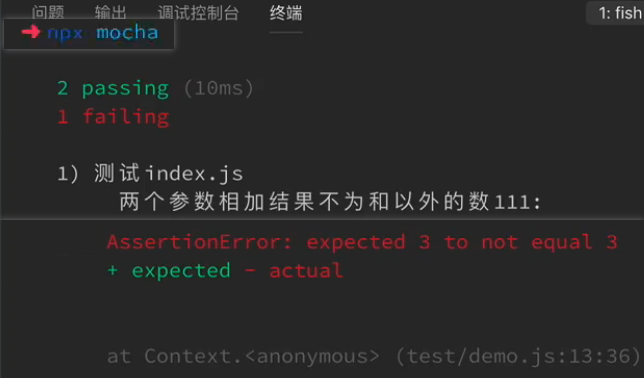
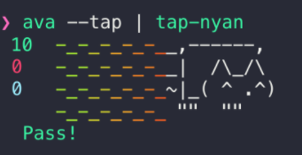
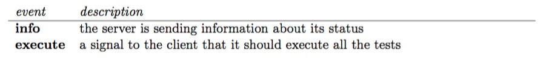

# 自动化测试

## 前端自动化测试

**（自动化）测试的目的：**①项目经过不断的开发，最终肯定会趋于稳定，在**适当的时机下**引入自动化测试能及早发现问题，**保证产品的质量**；②有利于写出高质量的代码；③有利于代码的扩展；④有利于代码的维护。

测试作为完整的开发流程中最后的一环，是保证产品质量重要的一环。前端测试一般在产品开发流程中属于偏后的环节，在整个开发架构中属于较高层次，且前端测试更加偏向于GUI的特性，因此前端的测试难度很大。程序员不愿意写测试的原因：①不熟悉；②浪费时间；③知识不成体系；④团队氛围；⑤缺少实践。

### 测试的分类

①按测试执行阶段划分：单元测试（常用，Unit Testing）、集成测试（Integration Testing，比单元测试颗粒度大）、端到端测试（常用，E2E Testing，比集成测试颗粒度大）、系统测试、验收测试（正式验收测试、Alpha测试、Beta测试）。

端到端测试模拟用户的行为，从用户层面对整个程序的流程和交互做测试，在 Web 应用程序中，会启动服务器，打开浏览器，模拟用户的行为进行点击、输入、提交等动作，断言浏览器中发生了特定的事情或得到了期待的结果，从而看出功能可以正常的运行。单元测试是根据代码单元的公共 API 运行它们，是针对功能模块的，需要创建一个类的实例，使用特定的输入调用它的方法，断言被调用的方法达到了预期的效果。

在多浏览器的自动化测试，多半是进行端到端的测试工作，其它一小部分是大粒度的单元测试。这两种测试的实践，有时候区分度并不大，有时候也是混合起来的，可能无法明显地区分哪些是端对端测试哪些是单元测试。

按照软件工程自底而上的概念，前端测试一般分为单元测试、集成测试和端到端测试，从底向上测试的复杂度将不断提高，另一方面测试的收益反而不断降低的。


②按测试技术划分：白盒测试（知道盒子里的所有功能代码和逻辑，再进行测试）、黑盒测试（如端到端测试，不知道盒子里的任何东西，但通过给输入能得到输出，从而在盒子的外部对程序进行测试）、灰盒测试。

③按被测试对象是否运行划分：动态测试、静态测试（文档检查、代码走查、界面检查）。

④按不同的测试手段划分：手工测试、自动化测试。

⑤按测试包含的内容划分：功能测试、界面测试、安全测试、兼容性测试、易用性测试、性能测试、压力测试、负载测试、恢复测试。

⑥其他测试：冒烟测试（试运行程序，看看会不会垮掉）、回归测试、探索性测试/自由测试（测试思维）。

### 测试的工具

#### 测试工具的选择

测试框架，就是运行测试的工具，其可以为JavaScript应用添加测试，从而保证代码的质量。测试框架基本上都做的事情：描述要测试的东西（功能或模块或需要做的操作）；对其进行测试；判断是否符合预期。

前端的测试工作也需要选择一套技术栈，**考虑点：**

①测试框架是否有简明的语法与文档（单元测试工具有Mocha、Jest、AVA、Jasmine、Karma(不完全是一个单元测试的工具，更像是一个运行环境)；E2E测试工具有Nightmare）

②断言（Assertions）：用于判断结果是否符合预期，但有些框架（如Mocha）需要单独的断言库，而Should.js、chai、expect.js等断言库提供了很多语义化的方法来对值做各种各样的判断。当然也可以不用断言库，Node.js中也可以直接使用原生assert库。

③是否适合 TDD / BDD（ 测试驱动型 / 行为驱动型 的测试风格）：TDD（Testing Driven Developement，测试驱动开发）和BDD（Bebavior Driven Developement，行为驱动开发）均有各自的适用场景。注意：本文TDD专指 UTDD（Unit Test Driven Development，单元测试驱动开发，[测试驱动开发（TDD）总结——原理篇](https://juejin.im/post/5c3e73876fb9a049d37f5db1)）。

TDD的特点（偏向于快速开发迭代和测试功能模块的场景，以快速完成开发为目的，相对而言更加高效，且能保证项目前期健壮性，降低项目后期维护成本）：
需求分析，快速编写对应的输入输出测试脚本；
**仅在自动测试失败时才编写新代码**；
重构去除不必要的依赖关系，然后重复测试，最终让程序符合所有要求。

TDD 的目标：Kent Beck 在他的著作《Test-Driven Development》一书中提到：**代码简洁可用**这句言简意赅的话，正是 TDD 所追求的目标。**对于如何保证“代码简洁可用”可以使用分而治之的方法，先达到“可用”目标，再追求“简洁”目标。**
可用：保证代码通过自动化测试。
代码简洁：在不同阶段对简洁的理解不一样，不过遵循的原则差不多（如 OOD 的 SOLID 原则，Kent Beck 的 Simple Design 原则等）。

BDD的特点（偏向于系统功能和业务逻辑的自动化测试的设计，从系统的层面进行全局统筹）：
从业务逻辑的角度定义具体的输入与预期输出，以及可衡量的目标；
尽可能覆盖所有的测试用例情况；
描述一系列可执行的行为，根据业务的分析来定义预期输出（如expect, should, assert）；
设定关键的测试通过节点输出提示，便于测试人员理解；
最大程度的交付出符合用户期望的产品，避免输出不一致带来的问题。

④支持异步测试：有些框架对异步测试支持良好。

⑤使用的语言：大部分测试框架使用 js，部分测试框架使用ts。

⑥用于特定目的：每个框架可能会擅长处理不同的问题。

⑦社区是否活跃。

#### 测试工具的功能

有些测试框架只提供了一种功能，有些则提供了一种组合功能（为了实现最灵活的集合功能，通常使用多种工具的组合）。

①提供UI界面或CLI工具（[Karma](https://karma-runner.github.io/)，[Jasmine](http://jasmine.github.io/)，[Jest](https://facebook.github.io/jest/)，[TestCafe](https://github.com/DevExpress/testcafe)，[Cypress](https://www.cypress.io/)）：**CLI工具**会给出一系列测试，以及运行这些测试所需的各种配置和脚手架（运行什么浏览器，使用什么babel插件，如何格式化输出等）。

②提供测试框架，形成文件目录（[Mocha](https://mochajs.org/), [Jasmine](http://jasmine.github.io/), [Jest](https://facebook.github.io/jest/), [Cucumber](https://github.com/cucumber/cucumber-js), [TestCafe](https://github.com/DevExpress/testcafe), [Cypress](https://www.cypress.io/)）。

③提供断言（[Chai](http://chaijs.com/)，[Jasmine](http://jasmine.github.io/)，[Jest](https://facebook.github.io/jest/)，[Unexpected](http://unexpected.js.org/)，[TestCafe](https://github.com/DevExpress/testcafe)，[Cypress](https://www.cypress.io/)）：**断言函数**检查测试返回的结果是否符合预期。

④生成和展示测试结果（[Mocha](https://mochajs.org/)，[Jasmine](http://jasmine.github.io/)，[Jest](https://facebook.github.io/jest/)，[Karma](https://karma-runner.github.io/)，[TestCafe](https://github.com/DevExpress/testcafe)，[Cypress](https://www.cypress.io/)）：注意这里不同于测试的覆盖率。

⑤快照测试（[Jest](https://facebook.github.io/jest/)，[Ava](https://github.com/avajs/ava)）：快照测试（snapshot testing），测试 UI 或数据结构是否和之前完全一致，通常 UI 测试不在单元测试中。

⑥提供仿真（[Sinon](http://sinonjs.org/)，[Jasmine](http://jasmine.github.io/)，[enzyme](http://airbnb.io/enzyme/docs/api/)，[Jest](https://facebook.github.io/jest/)，[testdouble](https://testdouble.com/)）：仿真（mocks, spies, and stubs），获取方法的调用信息、模拟方法、模块、服务器。

⑦生成测试覆盖率报告（[Istanbul](https://gotwarlost.github.io/istanbul/), [Jest](https://facebook.github.io/jest/), [Blanket](http://blanketjs.org/)）。

⑧提供类浏览器环境（[Nightwatch](http://nightwatchjs.org/), [Nightmare](http://www.nightmarejs.org/), [Phantom](http://phantomjs.org/)**,** [Puppeteer](https://github.com/GoogleChrome/puppeteer), [TestCafe](https://github.com/DevExpress/testcafe), [Cypress](https://www.cypress.io/)）。

⑨可视化回归工具（[Applitools](https://applitools.com/), [Percy](https://percy.io/), [Wraith](http://bbc-news.github.io/wraith/), [WebdriverCSS](https://github.com/webdriverio-boneyard/webdrivercss)）。

#### 单元测试类工具

单元测试流程：引入待测试的文件、定义测试、执行引入测试的方法、做出断言。

①**Karma**：一个Runner（即运行环境）。`A test runner is the library or tool that picks up an assembly (or a source code directory) that contains unit tests, and a bunch of settings, and then executes them and writes the test results to the console or log files.   there are many runners for different languages. See Nunit and MSTest for C#, or Junit for Java.`

karma 设计目标主要有四点：高效、扩展性、运行在真实设备、无缝的使用流程。karma 是一个典型的 C/S 程序（包含client 和 server），通讯方式基于Http，通常情况下，客户端和服务端基本都运行在开发者本地机器上。一个服务端实例对应一个项目，假如想同时运行多个项目，得同时开启多个服务端实例。

Karma 的**优点**是能通过插件和配置的方式集成大部分的主流的测试框架和前端库，能方便的一次在多浏览器环境执行测试用例，并集成了测试覆盖率生成功能，生成页面形式覆盖率报告并能导出不同形式的覆盖率报告数据；**缺点**是对测试页面环境的搭建和资源文件的加载不是常见的形式，最开始搭建环境时会有很多跟预期不一致的情况，配置不直观。

②**Jasmine**：Jasmine 带有 assertions（断言）、spies（用来模拟函数的执行环境）和 mocks（mock工具）。Jasmine 初始化设置简单，如果需要一些单元功能时，可以加一些库进来。

③**Mocha**：Mocha 是一个灵活的库，提供给开发者的只有一个基础测试结构，其它功能性的功能（如 assertions， spies和mocks），需要引用添加其它库/插件来完成。

④**Jest**：在Jasmine的基础之上进行了一些改进，Jest 得到了很好的支持，被 Facebook 和各种 React 应用推荐和使用，开发人员主要是用 Jest 去测试 React 应用，Jest可以很容易地集成到其它应用程序中。Jest也是一个在平行测试报告中非常快速的测试库。

对于小型项目来说你可能在开始的时候不用过多担心，而性能的提高，对于希望全天持续部署的大型应用 app 来说是非常之好的。

⑤**AVA**：其优势是利用了JavaScript的异步特性（优化了在部署的等待时间）和并发运行测试，保留了简单的 API 来提供需要的功能，但是搭配 mocking 来使用则要安装一个单独的库。

npm trends：[点击链接](https://www.npmtrends.com/mocha-vs-jest-vs-ava-vs-jasmine-core)。


#### E2E测试类工具

端到端测试主要做的是黑盒测试，更多的是从用户的角度来出发并进行的一些测试，在程序外部不了解程序内部的逻辑走向的时候，去对浏览器进行操作，来了解程序的整个交互（包括逻辑流程），检验是否按照期望那样来给出结果。

npm trends：[点击链接](https://www.npmtrends.com/cypress-vs-nightmare-vs-nightwatch-vs-testcafe-vs-webdriverio)。


### 最佳实践

测试不代表一上来就要写出100%场景覆盖的测试用例，**最佳的实践是基于投入产出比来做测试**。由于维护测试用例也是一大笔开销（毕竟没有多少测试会专门帮前端写业务测试用例，而前端使用的流程自动化工具更是没有测试参与了），所以对于像基础组件、基础模型之类的不常变更且复用较多的部分，可以优先考虑去写测试用例来保证质量，达到先写少量的测试用例覆盖到80%+的场景，保证覆盖主要的使用流程。而一些极端场景出现的bug可以在迭代中形成测试用例沉淀，场景覆盖也将逐渐趋近100%，但对于迭代较快的业务逻辑以及生存时间不长的活动页面之类的就别花时间写测试用例了，因为维护测试用例的时间太多，成本太高。

对于大型项目，可以使用Jest快速形成配置（做比较少的配置）并且开始单元测试；需要测试快照的，则可以选择Jest或Ava；对于配置性要求高（配置要求多），对测试框架性能要求比较高的，可以选择Mocha；对模拟还原浏览器业务操作有很大的需求的，可以选择Nightmare。另外，可以通过配合CI工具完成自动化测试、测试覆盖率、测试结果推送。


## Mocha

[`Mocha`](https://mochajs.org/)（发音"摩卡"）诞生于2011年，是现在最流行的JavaScript测试框架之一，在浏览器和Node环境中都可以使用，它的配置比较简单，但要注意Mocha不提供断言库，而且是在一个进程运行所有的测试的。

### 安装

全局安装Mocha：`npm install -g mocha`。使用方式：直接使用mocha，也可以在package.json中的`scripts`节点下加入`"test": "mocha"`脚本来运行。

项目中安装Mocha：`npm install --save-dev mocha`。使用方式（查看版本）：①`./node_modules/.bin/mocha --version`；②`npx mocha --version`。

Chai 是一个针对Node.js和浏览器的行为驱动测试和测试驱动测试的**断言库**，可与任何 JavaScript 测试框架集成，是Mocha的好帮手。安装：`npm install --save-dev chai`。关于断言：`expect`断言的优点是很接近自然语言（除此之外，还有should语法和asset语法）。例子：

```js
// 使用方式：
const expect = require('chai').expect // commonjs // // 或使用：import { expect } from 'chai' // es6，需要安装相关依赖
// 相等或不相等
expect(4 + 5).to.be.equal(9);
expect(4 + 5).to.be.not.equal(10);
expect(foo).to.be.deep.equal({ bar: 'baz' });
// 布尔值为true
expect('everthing').to.be.ok;
expect(false).to.not.be.ok;
// typeof
expect('test').to.be.a('string');
expect({ foo: 'bar' }).to.be.an('object');
expect(foo).to.be.an.instanceof(Foo);
// include
expect([1,2,3]).to.include(2);
expect('foobar').to.contain('foo');
expect({ foo: 'bar', hello: 'universe' }).to.include.keys('foo');
// empty
expect([]).to.be.empty;
expect('').to.be.empty;
expect({}).to.be.empty;
// match
expect('foobar').to.match(/^foo/);
```

### 测试命令

如果测试单一的测试js，可以用`mocha test/index.test.js`；如果测试多个js，则`mocha test/index.test.js test/add.test.js`。

也可以用通配符测试某个文件夹下所有的js和jsx：①node通配符：`mocha 'test/some/*.@(js|jsx)'`（表示匹配到test目录下的some文件夹下的以js或jsx为后缀的文件）；②shell通配符：`mocha test/unit/*.js` 或 `mocha spec/{my,awesome}.js`（匹配其中一个字符串）。

### 测试案例


```js
// src/index.js文件（里的测试代码）：
/**
 * 加法函数
 * @param {第一个数} a
 * @param {第二个数} b
 */
function addNum(a,b) {
    return a + b;
}
module.exports = addNum;
```

```js
// test/demo.js文件（测试脚本，Mocha会默认在test目录之下执行测试用例）
// 案例一，控制台打印结果如下图一：
const addNum = require('../src/index') // 或使用import { addNum } from '../src/index'
const expect = require('chai').expect
describe('测试index.js', function () {
  // test suite。测试区块，可以进行嵌套
  describe('测试addNum函数', function () {
    // test case
    // beforeEach fn
    it('两个参数相加结果为两个数字的和', function () { // it才代表实际的每一个的测试用例
      expect(addNum(1, 2)).to.be.equal(3);
    }) // afterEach fn
    // beforeEach fn
    it('两个参数相加结果不为和以外的数', function () {
      expect(addNum(1, 2)).to.be.not.equal(4);
    }) // afterEach fn
  })
  // beforeEach fn
  it('true is not equal false', function () {
    expect(addNum(true)).to.be.not.equal(false);
  }) // afterEach fn
})
// after fn

// 案例二，控制台打印结果如下图二：
......
describe('测试index.js', function () {
  it('两个参数相加结果为两个数字的和', function () {
    expect(addNum(1, 2)).to.be.equal(3);
  })
  it('两个参数相加结果不为和以外的数', function () {
    expect(addNum(1, 2)).to.be.not.equal(4);
  })
  it('两个参数相加结果不为和以外的数111', function () {
    expect(addNum(1, 2)).to.be.not.equal(3);
  })
})......
```




### ES6语法支持

①将代码修改为采用ES6的语法：

```js
// index.js文件：
function addNum(a, b) {
  return a + b
}
export {
  addNum
}
```

```js
// test/demo.js文件：
import { expect } from 'chai'
import { addNum } from '../src/index'
......
```

②需要安装babel（否则直接运行mocha会报错）：`npm install --save-dev @babel/cli @babel/core @babel/node @babel/register @babel/preset-env chai mocha nodemon`（前五个是）。

③在项目目录下新建`.babelrc`文件：

```json
{
  "presets": ["@babel/preset-env"]
}
```

④可修改package.json中的`scripts`脚本后运行：其中test命令表示使用mocha时要使用bable插件进行语法转义；build命令表示使用bable进行打包后的文件的输出目录修改为根目录下的dist文件夹下，并打开sourcemaps。

```json
......
"scripts": {
  "test": "mocha --require @babel/register",
  "build": "bable src --out-dir ./dist --source-maps"
},......
```

### 超时

官方默认的超时是2000毫秒（2s）。修改超时的方式：

①使用`--no-timeout`参数或在`debug`模式中，全局禁用超时；

②在`--timeout`后面接时间（毫秒），全局修改本次执行测试用例的超时时间；

③在测试用例里使用`this.timeout`方法（适合在长时间的测试用例里，使用局部的超时设置）：

```js
it('should take less than 500ms', function(done) {
  this.timeout(500); // 另外，可以使用 this.timeout(0) 禁用超时
  setTimeout(done, 300);
});
```

④在[钩子方法](#钩子方法（生命周期函数）)里使用：

```js
describe('a suite of tests', function() {
  beforeEach(function(done) {
    this.timeout(3000); // A very long environment setup.
    setTimeout(done, 2500);
  });
});
```

### 钩子方法

```js
// 在describe块之中，提供测试用例的四个钩子方法（生命周期函数：before()、after()、beforeEach()、afterEach()），会在指定时间执行
describe('测试index.js',()=> {
  before(()=>console.info("在本区块的所有测试用例之前执行"))
  after(()=>console.info("在本区块的所有测试用例之后执行"))
  beforeEach(()=>console.info("在本区块的每个测试用例之前执行"))
  afterEach(()=>console.info("在本区块的每个测试用例之后执行"))
  describe('测试addNum函数', ()=> {
    it('两个参数相加结果为两个数字的和', function () {
      expect(addNum(1, 2)).to.be.equal(3);
    })
    it('两个参数相加结果不为和以外的数', function () {
      expect(addNum(1, 2)).to.be.not.equal(4);
    })
  })
})......
```


### 异步测试

Mocha是支持异步测试的：

①可以为`describe`回调函数添加一个`done`参数， 成功时调用`done()`，失败时调用`done(err)`。例子：

```js
var expect = require('chai').expect;
describe('db', function() {
    // Mocha判断回调函数的形参个数的方式（判断是否要等待异步断言）：JavaScript中的Function有一个`length`属性，通过传入回调的`length`可以获得该函数的形参个数，判断是否需要等待。
    it('#get', function(done) { // 如果未添加`done`参数，Mocha会直接返回成功，不会捕获到异步的断言失败
        db.get('foo', function(err, foo){
            if(err) done(err);        
            expect(foo).to.equal('bar');
            done(); // 如果未调用`done`函数，Mocha会一直等待直到超时
        });
    });
});
// 运行该测试Mocha会提示Passing
```

②可以返回Promise（而不是使用回调）。例子：

```js
beforeEach(function() {
  return db.clear().then(function() {
    return db.save([tobi, loki, jane]);
  });
});
describe('#find()', function() {
  it('respond with matching records', function() {
    return db.find({type: 'User'}).should.eventually.have.length(3);
  });
});
```

③可以使用 async / await（注意：需要Babel支持）。例子：

```js
beforeEach(async function() {
  await db.clear();
  await db.save([tobi, loki, jane]);
});
describe('#find()', function() {
  it('responds with matching records', async function() {
    const users = await db.find({type: 'User'});
    users.should.have.length(3);
  });
});
```

### 示例项目


**创建项目和安装依赖：**初始化一个nodejs项目，`npm init -y`，形成`package.json`文件；安装依赖，`npm install --save-dev @babel/cli @babel/core @babel/node @babel/register @babel/preset-env chai mocha nodemon`。

**测试过程：**

①新建待测试的文件（`src/index.js`）：

```js
const sayHello = () => "Hello world!!!"
console.log(sayHello())
export default sayHello
```

②新建测试脚本文件（`test/index.spec.js`）：

```js
import { expect } from "chai"
import sayHello from "../src/index"
describe("index test", () => {
  describe("sayHello function", () => {
    it("should say Hello world!!!", () => {
      const str = sayHello();
      expect(str).to.equal("Hello world!!!")
    })
  })
})
```

③在`package.json`中新增脚本：

```json
  "scripts": {
    // "start": "nodemon ./src/index.js",  // 针对ES5语法
    "start:babel": "nodemon --exec babel-node ./src/index.js", // 实时监听，能够实时用babel-node执行index.js文件
    "test": "mocha --require @babel/register", // 用上babel解析ES6语法
    "test:watch": "mocha --require @babel/register --watch", // mocha自带的实时监听功能，能够实时进行测试
    "report": "mocha --require @babel/register --reporter mochawesome",
    "build": "babel src --out-dir ./dist --source-maps",
    "serve": "node ./dist/index.js",
    "debug": "node --inspect-brk ./dist/index.js"
  },
```

④开始测试：


⑤修改index.js文件：`const sayHello = () => "Hello world!!"。。。。。。`。结果：报错了，因为期望的值与实际值不一致。


⑥使用`mochawesome`展示你的测试结果：


安装：`npm install --save-dev mochawesome`。然后执行`npm run report`，就会生成`mochawesome-report`目录和相关文件。把形成出来的报告在浏览器中打开：


## Jest


Jest是由Facebook发布的、开源的、基于[Jasmine](http://jasmine.github.io/)的JavaScript单元测试框架，Jest与Jasmine框架的区别是在后者之上增加了一些层。Jest的目标是减少开始测试一个项目所要花费的时间和认知负荷，因此它提供了大部分需要的现成工具：快速的命令行接口、Mock工具集以及它的自动模块Mock系统。另外，如果在寻找隔离工具（如Mock库），大部分其它工具将在测试中（甚至经常在主代码中）写一些不尽如人意的样板代码，以使其生效。运行测试时，Jest会自动模拟依赖。Jest自动为每个依赖的模块生成Mock，并默认提供这些Mock，这样就可以很容易地隔离模块的依赖。

特点：

①Jest支持Babel，使用ES6的高级语法（[babel官网](https://babeljs.io/)）；支持webpack，用它管理项目更方便；支持TypeScript，让书写测试用例更严谨（[Using Typescript](https://jestjs.io/docs/en/getting-started#using-typescript)）。

②简化API：Jest简单、强大、开箱即用。内置支持的功能有：
灵活的配置（如可用文件名通配符来检测测试文件）；
测试的事前步骤（Setup）和事后步骤（Teardown），同时也包括测试范围；
匹配表达式（Matchers），能使用期望`expect`句法来验证不同的内容；
测试异步代码，支持promise数据类型和异步等待`async` / `await`功能；
模拟函数，可修改或监查某个函数的行为；
手动模拟，测试代码时可以忽略模块的依存关系；
虚拟计时，帮助控制时间推移。

③性能与隔离：Jest能运用所有的工作部分，并列运行测试（即并行测试，而Mocha用一个进程运行所有的测试），使性能最大化（缺点是吃内存）。终端上的信息经过缓冲，最后与测试结果一起打印出来。沙盒中生成的测试文件，以及在每个测试里，自动全局状态都会得到重置，这样就不会出现两个测试冲突的情况。

④沉浸式监控模式：

快速互动式监控模式可以监控到测试文件的改动，可以只运行与改动过的文件相关的测试，并且由于优化作用，能迅速放出监控信号。设置简单，而且本身还提供其它选项，可以用文件名或测试名来过滤测试（Mocha时也有监控模式，不过没有那么强大，要运行某个特定的测试文件夹或文件，就要用其它解决方法）。

⑤代码覆盖率和测试报告：Jest内置有代码覆盖率报告功能，设置简单，可以在整个项目范围里收集代码覆盖率信息（包括未经受测试的文件）。要使完善Circle CI整合，只要一个自定义报告功能，用[jest-junit-reporter](https://github.com/michaelleeallen/jest-junit-reporter)就可以做到（用法和Mocha几乎相同）。

⑥快照功能（快照测试的目的不是要替换现有的单元测试，而是要使之更有价值，让测试更轻松）：在某些情况下，某些功能（如React组件功能）有了快照测试则无需再做单元测试，但这两者不是非此即彼。

### 安装

全局安装：`npm install -g jest`；通过yarn来安装：`yarn add --dev jest`。使用方式：直接使用jest，也可以在package.json中的`scripts`节点下加入`"test": "jest"`脚本来运行。

项目中安装Mocha：`npm install --save-dev jest`。使用方式（查看版本）：①`./node_modules/.bin/jest --version`；②`npx jest --version`。

Jest 的测试脚本名是形如`.test.js`或`test.js`的文件，即Jest会执行当前目录下所有的`*.test.js` 或 `*.spec.js` 文件并完成测试。

**ES6语法支持：**安装依赖，`yarn add --dev babel-jest @babel/core @babel/preset-env`；配置`babel.config.js`（如下代码）（或通过在`.babelrc`文件直接写该对象即可）。

```json
module.exports = {
  "presets": [
    [
      "@babel/preset-env",
      {
        "targets": {
          "node": "current"
        }
      }
    ]
  ]
}
```

### 测试案例

关于test suite与test case：一个完整的项目可以分为多个测试包（describe属于 test suite 的描述，而test suite可以进行嵌套），一个测试包里可以包含多个测试用例（每个 test 或 it 描述了每个 test case）。


```js
// src/math.js文件：
export const add = (a, b) => a + b;
export const multiple = (a, b) => a * b;
```

```js
// test.js文件（测试脚本）：
// 引入待测试的功能模块
import { add, multiple } from './src/math'
// test suite
describe("math.js testing", () => {
  // test case
  it("test add method", () => {
    const result = add(3, 4)
    expect(result).toEqual(5) // assertion
  });
  describe("testsuite", () => {
    test("test add method 3", () => {
      expect(add(1, 2)).toEqual(3)
    });
  });
});
// 直接使用test方法，可以让test case脱离test suite独立运行
test("test add method 2", () => {
  expect(add(1, 2)).toEqual(3)
});
```


另外，使用`beforeAll`钩子函数可以做一些前置的数据准备的工作：

```js
import { add, multiple } from './src/math'
describe("math.js testing", () => {
  let a
  let b
  beforeEach(function () {
    a = 2;
    b = 3;
  });
  it("test add method", () => {
    const result = add(a, b)
    expect(result).toEqual(5)
  });
  it("test multiple method", () => {
    const result = multiple(a, b)
    expect(result).toEqual(6)
  });
});
```


### Mock与Spy

**mock**测试是在测试过程中，对于某些不容易构造或者不容易获取的对象，用一个虚拟的对象来创建以便测试的测试方法。Mock 是单元测试（测试的重点是某个具体单元）中经常使用的一种技术，而在实际代码中，代码与代码之间、模块与模块之间总是会存在着相互引用，这个时候，剥离出这种单元的依赖，让测试更加独立，使用到的技术就是 Mock。

在项目中，一个模块的方法内常常会去调用另外一个模块的方法。在单元测试中，可能并不需要关心内部调用的方法的执行过程和结果，只想知道它是否被正确调用（甚至会指定该函数的返回值），所以使用Mock函数是十分有必要。

Mock其实就是一种Spies，在Jest中使用spies来“spy”（窥探）一个函数的行为。[Jest文档](https://jestjs.io/docs/en/mock-function-api.html#content)对于spies的解释：Mock函数也称为“spies”，因为它们窥探一些由其它代码间接调用的函数的行为，而不仅仅是测试输出，一个spy是另一个内置的能够记录对其调用细节的函数（如调用它的次数，使用什么参数等）。①可以通过`jest.spyOn`（[spyOn介绍](https://jestjs.io/docs/en/jest-object#jestspyonobject-methodname)）具体地执行要监视的函数；②也可以通过使用 `jest.fn()` 创建一个mock函数，jest.fn是模拟了整个方法以及它的返回值（当然也可以监视模拟后的方法？）。

Mock函数提供的三种特性，在写测试代码时非常有用：①捕获函数调用情况；②设置函数返回值；③改变函数的内部实现。


#### **例子一：**


```javascript
// test/mock.test.js
test('测试jest.fn()调用', () => {
  // `jest.fn()`是创建Mock函数最简单的方式，如果没有定义函数内部的实现，`jest.fn()`会返回`undefined`作为返回值。
  let mockFn = jest.fn();
  let result = mockFn(1, 2, 3);
  expect(result).toBeUndefined(); // 断言mockFn的执行后返回undefined
  expect(mockFn).toBeCalled(); // 断言mockFn被调用了
  expect(mockFn).toBeCalledTimes(1); // 断言mockFn被调用了一次
  expect(mockFn).toHaveBeenCalledWith(1, 2, 3); // 断言mockFn传入的参数为1, 2, 3
})
```


#### **例子二：**


```js
// src/math.js
export const getFooResult = () => {
  // foo logic here
};
export const getBarResult = () => {
  // bar logic here
};
```

```js
// src/caculate.js
import { getFooResult, getBarResult } from "./math";
export const getFooBarResult = () => getFooResult() + getBarResult();
```

①情景一：设置函数的返回值：

```js
// test/calculate.test.js
import { getFooBarResult } from "./calculate";
// getFooResult() 和 getBarResult() 是 getFooBarResult 函数的依赖。
// 如果关注点是getFooBarResult，则应该把getFooResult和getBarResult给Mock掉，剥离这种依赖。
import * as fooBar from './math';
test('getResult should return result getFooResult() + getBarResult()', () => {
  // 进行mock
  fooBar.getFooResult = jest.fn(() => 10);
  fooBar.getBarResult = jest.fn(() => 5);
  const result = getFooBarResult();
  expect(result).toEqual(15);
  // 监控getFooResult和getBarResult的调用情况.
  expect(fooBar.getFooResult).toHaveBeenCalled();
  expect(fooBar.getBarResult).toHaveBeenCalled();
});
```


②情景二：捕获函数调用情况：

```js
// test/sayhello.test.js
const bot = { // bot method
  sayHello: name => {
    console.log(`Hello ${name}!`);
  }
};
describe("test bot Object", () => {
  it("should say hello to the Name", () => {
    // 通过 `jest.spyOn` 创建了一个监听 `bot` 对象的 `sayHello` 方法的 spy，监听了所有对 `bot#sayHello` 方法的调用。
    const spy = jest.spyOn(bot, "sayHello");
    bot.sayHello("itheima");
    expect(spy).toHaveBeenCalledWith("itheima");
    // 由于创建spy时，Jest实际上修改了`bot`对象的`sayHello`属性（包括jest.fn()也是修改了原来属性？）
    // 在断言完成后，要通过`mockRestore`来恢复`bot`对象原本的`sayHello`方法，否则在后面的测试实例中会受到影响。
    spy.mockRestore();
  });
});
```


③情景三：修改函数的内容实现：

```js
// test/sayhello.test.js
const bot = {
  sayHello: name => {
    console.log(`Hello ${name}!`);
  }
};
describe("test bot Object", () => {
  it("should say hello to the Name", () => {
    const spy = jest.spyOn(bot, "sayHello").mockImplementation(name => {
      console.log(`Hello mix ${name}`)
    });
    bot.sayHello("itheima");
    expect(spy).toHaveBeenCalledWith("itheima");
    // spy.mockRestore(); // 若取消该恢复的注释，则结果如下图二（因为mockRestore之后的`bot.sayHello`不再被spy，所以会报错）
  });
  it("should be hello name", () => {
    bot.sayHello("itheima1");
    expect(bot.sayHello).toHaveBeenCalled;
  });
});
```


拓展：使用spyOn方法，还可以去修改Math.random这样的函数。例子：

```js
// getNum.js
const arr = [1,2,3,4,5,6];
const getNum = index => {
  if (index) {
    return arr[index % 6];
  } else {
    return arr[Math.floor(Math.random() * 6)];
  }
};

// num.test.js
import { getNum } from '../src/getNum'
describe("getNum", () => {
  it("should select numbber based on index if provided", () => {
    expect(getNum(1)).toBe(2);
  });
  it("should select a random number based on Math.random if skuId not available", () => {
    const spy = jest.spyOn(Math, "random").mockImplementation(() => 0.9);
    expect(getNum()).toBe(6);
    expect(spy).toHaveBeenCalled();
    spy.mockRestore();
  });
});
```

### CLI命令

```
➜ npx jest --help
Usage: jest [--config=<pathToConfigFile>] [TestPathPattern]

选项：
  --help, -h                    显示帮助信息                              [布尔]
  --version, -v                 Print the version and exit                [布尔]
  --config, -c                  The path to a jest config file specifying how to
                                find and execute tests. If no rootDir is set in
                                the config, the directory containing the config
                                file is assumed to be the rootDir for the
                                project.This can also be a JSON encoded value
                                which Jest will use as configuration.   [字符串]
  --coverage                    Indicates that test coverage information should
                                be collected and reported in the output.  [布尔] 
  --timers                      Setting this value to fake allows the use of
                                fake timers for functions such as setTimeout.
                                                                        [字符串]
  --verbose                     Display individual test results with the test
                                suite hierarchy.                          [布尔]
  --watch                       Watch files for changes and rerun tests related
                                to changed files. If you want to re-run all
                                tests when a file has changed, use the
                                `--watchAll` option.                      [布尔]
  --watchAll                    Watch files for changes and rerun all tests. If
                                you want to re-run only the tests related to the
                                changed files, use the `--watch` option.  [布尔]
...
```

常见使用：

①`--verbose`显示详细的测试信息，包括测试suite和case：


②`--watch`和`--watchAll`用来监听测试文件的变化，如使用watchAll之后，可直接输入相应的键值再回车执行：


③`--coverage`用来形成测试覆盖率报告


### Jest的应用

**①Jest在React项目中的应用：**

在`create-react-app`中的应用：安装对应的依赖，`npm install -D react-test-renderer enzyme enzyme-adapter-react-16`。

react-test-renderer会把react组件使用纯的js对象的形式来进行渲染，而不是依赖一个dom或原生的移动端的环境。
[Enzyme](https://github.com/airbnb/enzyme)是一个React组件测试测试库（Enzyme is a JavaScript Testing utility for React that makes it easier to test your React Components' output. You can also manipulate, traverse, and in some ways simulate runtime given the output.    Enzyme's API is meant to be intuitive and flexible by mimicking jQuery's API for DOM manipulation and traversal）。

- 要配置Adapter，不同的React版本所对应的Adapter不同：

  | Enzyme Adapter Package      | React semver compatibility |
  | --------------------------- | -------------------------- |
  | `enzyme-adapter-react-16`   | `^16.4.0-0`                |
  | `enzyme-adapter-react-16.3` | `~16.3.0-0`                |
  | `enzyme-adapter-react-16.2` | `~16.2`                    |
  | `enzyme-adapter-react-16.1` | `~16.0.0-0 || ~16.1`       |
  | `enzyme-adapter-react-15`   | `^15.5.0`                  |
  | `enzyme-adapter-react-15.4` | `15.0.0-0 - 15.4.x`        |
  | `enzyme-adapter-react-14`   | `^0.14.0`                  |
  | `enzyme-adapter-react-13`   | `^0.13.0`                  |


- 要初始化配置`setUpTests.js`，使用Jest框架的默认加载文件（`src/setUpTests.js`）来设置jest配置：

  ```js
  import { configure } from 'enzyme';
  import Adapter from 'enzyme-adapter-react-16'
  configure({ adapter: new Adapter() })
  ```

测试案例：


**②Jest在Vue项目中的应用：**

在vue工程化项目中，添加依赖和配置scripts：

```json
"scripts": {
  "test": "vue-cli-service test:unit"
},
。。。。。。
"devDependencies": {
  "@vue/cli-plugin-unit-jest": "^3.9.0",
  "@vue/test-utils": "1.0.0-beta.29",
  "babel-core": "7.0.0-bridge.0",
  "babel-eslint": "^10.0.1",
  "babel-jest": "^23.6.0",
  "babel-preset-env": "^1.7.0",
},
```

配置`jest.config.js`

```js
module.exports = {
  // 处理vue结尾的文件
  moduleFileExtensions: [
    'js',
    'jsx',
    'json',
    'vue'
  ],
  // es6转义
  transform: {
    '^.+\\.vue$': 'vue-jest',
    '.+\\.(css|styl|less|sass|scss|svg|png|jpg|ttf|woff|woff2)$': 'jest-transform-stub',
    '^.+\\.jsx?$': 'babel-jest'
  },
  transformIgnorePatterns: [
    '/node_modules/'
  ],
  // cli配置了webpack别名解析（如把`@`设置为`/src`的别名）
  moduleNameMapper: {
    '^@/(.*)$': '<rootDir>/src/$1'
  },
  snapshotSerializers: [ // 快照
    'jest-serializer-vue'
  ],
  testMatch: [
    '**/tests/unit/**/*.spec.(js|jsx|ts|tsx)|**/__tests__/*.(js|jsx|ts|tsx)'
  ],
  testURL: 'http://localhost/',
  watchPlugins: [
    'jest-watch-typeahead/filename',
    'jest-watch-typeahead/testname'
  ]
}
```

测试案例：


## AVA


简约之美AVA：ava是mocha的替代品：
①es6语法支持更好，对aysnc/await有支持；
②执行效率更高，使用io并发，让测试可以并发执行（并行测试），保证测试的原子性，测试文件也可以在不同的进程里并行运行，让每一个测试文件可以获得更好的性能和独立的环境；
③语义上更简单，集众家之长。

特点：①轻量和高效；②简单的测试语法；③并发运行测试；④强制编写**原子测试**（一旦开始，就一直运行到结束，中间不会切换到另一个测试）；⑤没有隐藏的全局变量；⑥为每个测试文件隔离环境；⑦**用 ES2015 编写测试**，支持 Promise，支持 Generator，支持 Async，支持 Observable；⑧强化断言信息；⑨可选的 TAP 输出显示；⑩简明的堆栈跟踪。

**ava中的断言：**

```json
.pass([message])
.fail([message])
.assert(value, [message])
.truthy(value, [message])
.falsy(value, [message])
.true(value, [message])
.false(value, [message])
.is(value, expected, [message])
.not(value, expected, [message])
.deepEqual(value, expected, [message])
.notDeepEqual(value, expected, [message])
.deepEqual()。
.throws(fn, [expected, [message]])
.throwsAsync(thrower, [expected, [message]])
.notThrows(fn, [message])
.notThrowsAsync(nonThrower, [message])
.regex(contents, regex, [message])
.notRegex(contents, regex, [message])
.snapshot(expected, [message])
.snapshot(expected, [options], [message])
```

### 安装

情景一（推荐）：测试ava正常安装，`npx ava --version`

```bash
npm init -y
npm install -D ava // npm
yarn add ava -D // yarn
```

情景二：

```bash
// 创建一个ava项目
npm init ava
// 形成package.json文件
{
	"name": "ava-project", 
	"scripts": {
		"test": "ava"
	},
	"devDependencies": {
		"ava": "^1.0.0"
	}
}
```

### 测试案例


流程：引用ava的测试API、执行测试（`npm run test`或`npx ava`或`npx ava test.js`）、使用断言。

```js
// test.js文件：
import test from 'ava';
const testfn = (a, b) => a + b
const testfnPromise = (a, b) => {
  return new Promise((resolve) => {
    setTimeout(() => {
      resolve(a + b)
    }, 2000)
  })
}
test('hello ava', t => {
  t.pass()
})
test('my first test of ava assertion', async t => {
  const str = 'hello ava!!!!'
  t.is(str, 'hello ava!!!!')
});
test('add method test', async t => {
  const result = testfn(3, 4)
  t.is(result, 7)
})
// 异步相关
// 如果异步操作使用promise，则应返回promise：
// test('fetches foo', t => {
// 	return fetch().then(data => {
// 		t.is(data, 'foo');
// 	});
// });
// 也可以使用async/await：
test.failing('add method testPromise', async t => {
  const result = await testfnPromise(3, 4)
  t.is(result, 7)
})
```

```js
// assertion.test.js文件：
import test from 'ava';
test('pass assertion', async t => {
  t.pass(); // 告诉当前测试通过了测试
});
test('fail assertion', async t => {
  t.is.skip() // 跳过当前测试，避开错误（t.fail()）
})
test('assert test', async t => {
  t.assert(true, 'assert function , assert assertion') // 如果第一个参数为false，则测试不通过
})
test('not test', async t => {
  t.not(1, 2) // 与is方法相反，期望前面的值与后面的值不相等
})
test('regex test', async t => {
  t.regex('jsx', new RegExp('js')) // 正则匹配
})
test('throws fn test', async t => {
  t.throws(() => {
    throw new TypeError('type error in ava')
  }, TypeError)
})
const fn = () => {
  throw new TypeError('🦄');
};
test('throws', t => {
  const error = t.throws(() => {
    fn();
  }, TypeError);
  console.log(error.message)
  t.is(error.message, '🦄');
});
```


### CLI命令

使用`--help`命令查看ava支持的cli参数

```bash
➜ npx ava --help

  Testing can be a drag. AVA helps you get it done.

  Usage
    ava [<file> ...]

  Options
    --watch, -w             Re-run tests when tests and source files change
    --match, -m             Only run tests with matching title (Can be repeated)
    --update-snapshots, -u  Update snapshots
    // `--fail-fast`，遇到失败之后则进行停止，不用等到所有测试用例全部执行完。
    --fail-fast             Stop after first test failure
    --timeout, -T           Set global timeout (milliseconds or human-readable, e.g. 10s, 2m)
    --serial, -s            Run tests serially
    --concurrency, -c       Max number of test files running at the same time (Default: CPU cores)
    --verbose, -v           Enable verbose output
    --tap, -t               Generate TAP output
    --color                 Force color output
    --no-color              Disable color output
    --reset-cache           Reset AVA's compilation cache and exit
    --config                JavaScript file for AVA to read its config from, instead of using package.json
                            or ava.config.js files

  Examples
    ava
    ava test.js test2.js
    ava test-*.js
    ava test

  The above relies on your shell expanding the glob patterns.
  Without arguments, AVA uses the following patterns:
    **/test.js **/test-*.js **/*.spec.js **/*.test.js **/test/**/*.js **/tests/**/*.js **/__tests__/**/*.js
```

#### 文件匹配

**ava会自动搜索如下文件结尾的文件：**`**/test.js`、`**/test-*.js`、`**/*.spec.js`、`**/*.test.js`、`**/test/**/*.js`、`**/tests/**/*.js`、`**/__tests__/**/*.js`。

**可以使用`match`指令，匹配对应需要测试的文件：**

匹配标题以`foo`结尾：`npx ava --match ='* foo'`；

匹配标题以`foo`开头：`npx ava --match ='foo *'`；

匹配标题包含`foo`：`npx ava --match ='* foo *'`；

匹配是完全相同 `foo`：`npx ava --match ='foo'`；

匹配标题不包含`foo`：`npx ava --match ='！* foo *'`；

匹配以`foo`开头和以`bar`结尾的标题：`npx ava --match ='foo * bar'`；

匹配以`foo`开头或以`bar`结尾的标题：`npx ava --match ='foo *' -  match ='* bar'`；

#### reporter

默认情况下，AVA使用最小的报告：


使用`--verbose`标志则启用详细的报告者（除非启用TAP报告，否则始终在CI环境中使用此选项）。


**TAP报告（推荐）：**AVA支持TAP格式，因此与任何TAP报告器兼容，使用`--tap`标志则启用TAP输出，`npx ava --tap | npx tap-nyan`。一些格式：[tap-dot](https://github.com/scottcorgan/tap-dot) - Dotted output、[tap-spec](https://github.com/scottcorgan/tap-spec) - Mocha-like spec reporter、[tap-nyan](https://github.com/calvinmetcalf/tap-nyan) - Nyan cat、[tap-min](https://github.com/gummesson/tap-min) - Minimal output、[tap-difflet](https://github.com/namuol/tap-difflet) - Minimal output with diffing、[tap-diff](https://github.com/axross/tap-diff) - Human-friendly output with diffing、[tap-simple](https://github.com/joeybaker/tap-simple) - Simple output、[faucet](https://github.com/substack/faucet) - Human-readable summarizer、[tap-mocha-reporter](https://github.com/isaacs/tap-mocha-reporter) - Use any of the [Mocha reporters](https://github.com/isaacs/tap-mocha-reporter/tree/master/lib/reporters)、[tap-summary](https://github.com/zoubin/tap-summary) - Summarized output、[tap-pessimist](https://github.com/clux/tap-pessimist) - Only shows failed tests、[tap-prettify](https://github.com/toolness/tap-prettify) - Nice readable output with diffing、[tap-colorize](https://github.com/substack/tap-colorize) - Colorize the output while preserving machine-readability、[tap-bail](https://github.com/juliangruber/tap-bail) - Bail out when the first test fails、[tap-notify](https://github.com/axross/tap-notify) - Notifier for macOS, Linux and Windows、[tap-json](https://github.com/gummesson/tap-json) - JSON output、[ava-tap-json](https://github.com/yovasx2/ava-tap-json) - JSON output with AVA compatibility、[tap-xunit](https://github.com/aghassemi/tap-xunit) - xUnit output、[tap-teamcity](https://github.com/smockle/tap-teamcity) - Output for TeamCity。





#### 快照功能

更新快照可使用`ava --update-snapshots`。ava自动进行项目测试快照。如果文件放置在`test`或者`tests`目录，则快照会放置在`snapshots`目录；如果测试放置在`__test__`目录，则快照放置在`__snapshots__`目录。可以指定一个固定位置，在`package.json`配置中指定存储快照文件的位置：

**package.json：**

```json
{
	 "ava"：{
		 "snapshotDir"："自定义目录"
	}
}
```

#### 设置超时

AVA中的超时行为与其它测试框架中的行为不同，AVA没有默认超时，且在每次测试后会重置计时器，如果在指定的超时内没有收到新的测试结果，则强制测试退出，这可用于处理停滞的测试。

可以使用超时`--timeout` 命令行选项配置（或在配置文件中设置）：如10秒是`npx ava --timeout = 10s `，2分钟是`npx ava --timeout = 2m `，100毫秒是`npx ava --timeout = 100`。

可以为每个测试单独设置超时，每次进行断言时都会重置这些超时：

```js
test('foo', t => {
	t.timeout(100); // 100 milliseconds
	// Write your assertions here
});
```

### 配置文件

```json
{
	"ava": {
		"files": [
			"test/**/*",
			"!test/exclude-files-in-this-directory",
			"!**/exclude-files-with-this-name.*"
		],
		"helpers": [
			"**/helpers/**/*"
		],
		"sources": [
			"src/**/*"
		],
		"match": [
			"*oo",
			"!foo"
		],
		"cache": true,
		"concurrency": 5,
		"failFast": true,
		"failWithoutAssertions": false,
		"environmentVariables": {
			"MY_ENVIRONMENT_VARIABLE": "some value"
		},
		"tap": true,
		"verbose": true,
		"compileEnhancements": false,
		"require": [
			"@babel/register"
		],
		"babel": {
			"extensions": ["js", "jsx"],
			"testOptions": {
				"babelrc": false
			}
		}
	}
}
```

- `files`：用于选择测试文件的glob模式数组（带有下划线前缀的文件将被忽略）。默认情况下，仅选择具有`js`扩展名的文件（即使该模式与其他文件匹配），而指定`extensions`并`babel.extensions`则允许其它文件扩展名。注意，在CLI上提供文件会覆盖该`files`选项。

- `helpers`：用于选择帮助文件的glob模式数组，这里匹配的文件永远不会被视为测试。默认情况下，仅选择具有`js`扩展名的文件，即使该模式与其它文件匹配，而指定`extensions`并`babel.extensions`允许其他文件扩展名。

- `sources`：一组glob模式，用于匹配文件，这些文件在更改时会导致重新运行测试（在监视模式下）。有关详细信息，[请参阅](https://github.com/avajs/ava/blob/master/docs/recipes/watch-mode.md#source-files-and-test-files)。

- `match`：通常在`package.json`配置中没用，但等同于在CLI上指定`--match`。

- `cache`：缓存编译的测试和帮助文件`node_modules/.cache/ava`。如果`false`，则文件缓存在临时目录中。

- `failFast`：一旦测试失败，停止运行进一步的测试。

- `failWithoutAssertions`：如果设置成`false`，那么如果没有运行断言，则测试失败。
- `environmentVariables`：指定要供测试使用的环境变量，此处定义的环境变量会覆盖其中的环境变量`process.env`。
- `tap`：设置成 `true`，启用TAP报告。
- `verbose`：设置成 `true`，启用详细输出。
- `snapshotDir`：指定用于存储快照文件的固定位置。如果快照最终位于错误的位置，请使用此选项。
- `compileEnhancements`：设置成 `false`，禁用了 [`power-assert`](https://github.com/avajs/ava/blob/master/docs/03-assertions.md#enhanced-assertion-messages)，否则有助于提供更具描述性的错误消息，并检测`t.throws()`断言的不当使用。
- `extensions`：未使用AVA的Babel预设进行预编译的测试文件的扩展名。请注意，文件仍然会被编译为启用`power-assert`和其它功能，因此可能还需要设置`compileEnhancements`为`false`文件是否为有效的JavaScript。设置此`"js"`值会覆盖默认值，因此请确保在列表中包含该扩展名，只要它不包含在`babel.extensions`内。
- `require`：在运行测试之前需要额外的模块，工作进程中需要模块。
- `babel`：测试文件特定的Babel选项。有关详细信息，请参阅[Babel配置](https://github.com/avajs/ava/blob/master/docs/recipes/babel.md#configuring-babel)。
- `babel.extensions`：将使用AVA的Babel预设进行预编译的测试文件的扩展，设置此选项会覆盖默认`"js"`值，因此请确保在列表中包含该扩展名。
- `timeout`：AVA中的超时行为与其它测试框架中的行为不同，AVA在每次测试后重置计时器，如果在指定的超时内没有收到新的测试结果，则强制测试退出。这可用于处理停滞的测试。请参阅我们的[超时文档](https://github.com/avajs/ava/blob/master/docs/07-test-timeouts.md)以获取更多选

### ava设置ESLint

如果使用了ESLint，则要在eslint配置文件里添加[eslint-plugin-ava](https://github.com/avajs/eslint-plugin-ava)插件：

```json
{
	plugins: [
		"ava"
	]
}
```


## Karma

测试环境与帮手Karma：一个基于 Node.js 的 JavaScript 测试执行过程管理工具（Test Runner，运行环境），可以协助CI工具或其它框架把浏览器的环境应用到测试用例上。Karma可用于测试所有主流 Web 浏览器，也可以集成到 CI（Continuous integration）工具，还可以和其它代码编辑器或测试框架一起使用。

Karma 会监控配置文件中所指定的每一个文件，每当文件发生改变，它都会向测试服务器发送信号，来通知所有的浏览器再次运行测试代码，此时浏览器会重新加载源文件，并执行测试代码，其结果会传递回服务器，并以某种形式显示给开发者。

访问浏览器执行结果，可通过以下的方式：①手工方式，直接通过浏览器刷新；②自动方式，让 karma 来启动对应的浏览器。

### 工作原理

`karma` 是一个典型的 `C/S` 程序，包含 client 和 server ，通讯方式基于 `Http`。通常情况下，客户端和服务端基本都运行在开发者本地机器上，一个服务端实例对应一个项目（如果要运行多个项目，则要同时开启多个服务端实例）。

**Server**：框架的主要组成部分之一，它内部保存了所有的程序运行状态（如 client 连接、当前运行的单测文件），根据这些数据状态而提供的功能有：①`FS Watcher`：用于监视文件系统（File System）的文件的变化；②`Manager`管理终端：与 client 进行通讯；③`Reporter`：向开发者输出测试结果；④`Web Server`：提供 client 端所需的资源文件等。

server 端会发送这些消息：




**Client**：单测最终运行的地方（类似一个web app），与server端利用`socket.io`进行通讯， 而单测是执行在一个独立的 `iframe` 中。其中，`Adapter`为适配器，将Client与其它测试框架进行对接；`Testing Framework`代表其它的一些测试框架，可以是第三方的。

client 端会发送这些消息：


### 安装

对于Nodejs版本的要求：Karma currently works on Node.js **6.x**, **8.x**, and **10.x**. See [FAQ](https://karma-runner.github.io/4.0/intro/faq.html) for more info.

全局安装：`npm install -g karma`。使用方式：可以在任何位置直接运行 karma 命令。

本地安装（推荐，因为有时候需要在特定的版本下执行依赖，以及做一些项目层级的升级操作，而全局安装可能会导致不同项目的兼容性错误）：`npm install karma --save-dev`。使用方式：①`./node_modules/.bin/karma`；②`npx karma --version`。

如果安装 `karma-cli`（`npm install -g karma-cli`），则它就会在当前目录下寻找 karma 的可执行文件，这样就可在一个系统内运行多个版本的Karma。

### 配置文件

karma配置文件可以用JavaScript，CoffeeScript或TypeScript编写，并作为常规的Node.js模块加载。除非作为参数提供，否则Karma CLI将以如下顺序查找配置文件（从左至右）： `./karma.conf.js` 、 `./karma.conf.coffee` 、 `./karma.conf.ts` 、 `./.config/karma.conf.js` 、 `./.config/karma.conf.coffee` 、 `./.config/karma.conf.ts`。在配置文件中，配置代码通过设置`module.exports`指向一个接受一个参数的函数（配置对象），而配置文件中的基本的属性介绍在[Overview](https://karma-runner.github.io/4.0/config/configuration-file.html)。

```javascript
// karma.conf.js
module.exports = function(config) {
  config.set({
    basePath: '../..',
    frameworks: ['jasmine'],
    //...
  });
};

# karma.conf.coffee
module.exports = (config) ->
  config.set
    basePath: '../..'
    frameworks: ['jasmine']
    # ...

// karma.conf.ts。关于typescript的支持，需要使用到`ts-node`，配置ts-node以使用`commonjs`模块格。
module.exports = (config) => {
  config.set({
    basePath: '../..',
    frameworks: ['jasmine'],
    //...
  });
}
```

可以使用CLI工具，快速创建配置（`npx karma init`）：

```bash
~/Downloads/Demo is 📦 v1.0.0 via ⬢ v10.16.0 
➜ npx karma init

# 如果在应用中用到了其它的测试框架，那就需要安装它们所对应的插件，并在配置文件中标注它们（详见 karma.conf.js 中的 plugins 项）
Which testing framework do you want to use ?
Press tab to list possible options. Enter to move to the next question.
> jasmine
# mocha
# qunit
# nodeunit
# nunit

# Require.js 是异步加载规范（AMD）的实现，常被作为基础代码库，应用在了很多的项目与框架之中（如Dojo, AngularJs等）
Do you want to use Require.js ?
This will add Require.js plugin.
Press tab to list possible options. Enter to move to the next question.
> no
# yes

# 选择需要运行测试用例的浏览器。注意，必须保证所对应的浏览器插件已经安装成功。
Do you want to capture any browsers automatically ?
Press tab to list possible options. Enter empty string to move to the next question.
> Chrome
# ChromeHeadless
# ChromeCanary
# Firefox
# Safari
# PhantomJS
# Opera
# IE

# 选择测试用例所在的目录位置。Karma 支持通配符的方式配置文件或目录（如*.js, test/**/*.js等）。如果目录或文件使用相对位置，则此时的路径是相对于当前运行karma命令时所在的目录。
What is the location of your source and test files ?
You can use glob patterns, eg. "js/*.js" or "test/**/*Spec.js".
Enter empty string to move to the next question.
> src/*.js

# 目录中不包括的那些文件（即例外的文件，不需要被Karma监管的文件）。
Should any of the files included by the previous patterns be excluded ?
You can use glob patterns, eg. "**/*.swp".
Enter empty string to move to the next question.

# 是否需要 Karma 自动监听文件，且文件一旦被修改，就重新运行测试用例。
Do you want Karma to watch all the files and run the tests on change ?
Press tab to list possible options.
> yes
```

生成了一个`karma.conf.js`文件：

```js
// Karma configuration
// Generated on Wed Jul 10 2019 22:46:32 GMT+0800 (GMT+08:00)

module.exports = function(config) {
  config.set({

    // base path that will be used to resolve all patterns (eg. files, exclude)
    basePath: '',


    // frameworks to use
    // available frameworks: https://npmjs.org/browse/keyword/karma-adapter
    frameworks: ['mocha'],


    // list of files / patterns to load in the browser
    files: [
      'src/*js'
    ],


    // list of files / patterns to exclude
    exclude: [
    ],


    // preprocess matching files before serving them to the browser
    // available preprocessors: https://npmjs.org/browse/keyword/karma-preprocessor
    preprocessors: {
    },


    // test results reporter to use
    // possible values: 'dots', 'progress'
    // available reporters: https://npmjs.org/browse/keyword/karma-reporter
    reporters: ['progress'],


    // web server port
    port: 9876,


    // enable / disable colors in the output (reporters and logs)
    colors: true,


    // level of logging
    // possible values: config.LOG_DISABLE || config.LOG_ERROR || config.LOG_WARN || config.LOG_INFO || config.LOG_DEBUG
    logLevel: config.LOG_INFO,


    // enable / disable watching file and executing tests whenever any file changes
    autoWatch: true,


    // start these browsers
    // available browser launchers: https://npmjs.org/browse/keyword/karma-launcher
    browsers: ['Chrome'],


    // Continuous Integration mode
    // if true, Karma captures browsers, runs the tests and exits
    singleRun: false,

    // Concurrency level
    // how many browser should be started simultaneous
    concurrency: Infinity
  })
}
```

### 测试案例


Karma对babel是支持的，可以选择[karma-babel-preprocessor](https://github.com/babel/karma-babel-preprocessor)插件，但是 `babel and karma-babel-preprocessor only convert ES6 modules to CommonJS/AMD/SystemJS/UMD**（karma-babel-preprocessor不支持CommonJS等语法）. If you choose CommonJS, you still need to resolve and concatenate CommonJS modules on your own**. We recommend **karma-browserify + babelify** or **webpack + babel-loader** in such cases.`，这里选择webpack。

①安装依赖（这里结合另一测试框架mocha）：`npm install @babel/core @babel/preset-env chai mocha webpack webpack-cli babel-loader -D`；

②安装karma的适配器：`npm install karma-webpack karma-chrome-launcher karma-mocha karma-chai -D`；

③配置`karma.config.js`：

```js
// Karma configuration
// Generated on Thu Jul 11 2019 23:23:44 GMT+0800 (GMT+08:00)
module.exports = function (config) {
  config.set({
    // base path that will be used to resolve all patterns (eg. files, exclude)
    basePath: '',
    // frameworks to use
    // available frameworks: https://npmjs.org/browse/keyword/karma-adapter
    frameworks: ['mocha'],
    // list of files / patterns to load in the browser
    files: [
      'src/**/*.js', // 自动执行js文件
      'test/**/*.js' // 对测试用例进行监视并执行
    ],
    ......
    // preprocess matching files before serving them to the browser
    // available preprocessors: https://npmjs.org/browse/keyword/karma-preprocessor
    preprocessors: {
      'src/**/*.js': ['webpack'],
      'test/**/*.js': ['webpack']
    },
    webpack: {
      mode: "none",
      node: {
        fs: 'empty' // 设置为empty，否则在浏览器上运行时fs不存在
      },
      module: {
        rules: [
          { test: /\.js?$/, loader: "babel-loader", options: { presets: ["@babel/env"] }, }
        ]
      }
    },
    .......
    plugins: [
      'karma-mocha',
      'karma-chai',
      'karma-chrome-launcher',
      'karma-webpack'
    ]
  })
}
```

④书写`src/index.js`和测试用例`test/test.js`：

```js
// src/index.js
console.log('info from src')
```

```js
// test/test.js
import { describe } from "mocha";
import { expect } from 'chai'
describe('first karma test', () => {
  it('hello mocha and karma', () => {
    console.log('hello mocha')
    expect(true).to.be.equal(true)
  })
})
```

⑤开始测试：`npx karma start`或`npm run karma`（注意要在package.json中的`scripts`节点下加入`"karma": "karma start"`脚本），此时修改后重新保存也会自动重新编译；


## Nightmare


UI测试利器Nightmare：它是[Segment](https://segment.com/)的高级浏览器自动化库，使用的底层框架是electron，与[PhantomJS](http://phantomjs.org/)类似，但大约[快两倍](https://github.com/segmentio/nightmare/issues/484#issuecomment-184519591)，且更现代，与其它e2e测试框架相比更轻量。其主要负责的是对浏览器进行操作的工作，目标是公开一些模仿用户操作（例如`goto`，`type`和`click`）的简单方法，使用对每个脚本块同步的API，而不是深层嵌套的回调。它最初的设计用于在站点之间自动执行任务，但最常用于UI测试和爬网。

### 安装

初始化项目后进行安装：`npm install --save-dev nightmare`，可使用淘宝源加速electron的安装：`export ELECTRON_MIRROR="https://npm.taobao.org/mirrors/electron/"`。

### 配合mocha测试 

nightmare可以进行网页的抓取，配合mocha（安装：`npm install --save-dev mocha`）进行页面的测试（`npx mocha`或`npm run test`，注意后者要在package.json中的`scripts`节点下加入`"test": "mocha"`脚本），还可以安装一些断言库（如`chai`）。

   ```js
// 测试例子：test/test.js
const Nightmare = require('nightmare')
const assert = require('assert') // nightmare的断言库？
describe('first mocha and nightmare test', () => {
    this.timeout('30s') // Recommended: 5s locally, 10s to remote server, 30s from airplane ¯\_(ツ)_/¯
    let nightmare = null
    beforeEach(() => {
        nightmare = new Nightmare()
    })
    it('should load nightmare', done => {
        nightmare.goto('https://www.baidu.com') // your actual testing urls will likely be `http://localhost:port/path`
            .end()
            .then(function (result) { done() })
            .catch(done)
    })
    it('should load nightmare', done => {
        const selector = 'em'
        nightmare.goto('https://www.baidu.com')
            .type('#kw', 'nightmare') // 选中id为kw的输入框，输入nightmare
            .click('#su') // 点击搜索按钮
            .wait('em') // em标签元素
            .evaluate(selector => { // 通过selector来筛选元素
                return document.querySelector(selector).innerText // now we're executing inside the browser scope.
            }, selector) // <-- that's how you pass parameters from Node scope to browser scope
            .end()
            .then(function (result) {
                console.log(result)
                assert.equal(result, 'nightmare')
                done()
            })
            .catch(done)
    })
})
   ```


### API介绍


**①nightmare的配置项：**（配置链接：https://github.com/segmentio/nightmare#nightmareoptions）

```
waitTimeout (default: 30s)
gotoTimeout (default: 30s)
loadTimeout (default: infinite)
executionTimeout (default: 30s)
paths
switches
electronPath
dock
openDevTools
typeInterval (default: 100ms)
pollInterval (default: 250ms)
maxAuthRetries (default: 3)
certificateSubjectName
.engineVersions()
.useragent(useragent)
.authentication(user, password)
.authentication(user, password)
.halt(error, done)
```

**②页面交互相关：**（[配置参考链接](https://github.com/segmentio/nightmare#interact-with-the-page)）

```
.back()
.forward()
.refresh()
.click(selector)
.mousedown(selector)
.mouseup(selector)
.mouseover(selector)
.mouseout(selector)
.type(selector[, text])
.insert(selector[, text])
.check(selector)
.uncheck(selector)
.select(selector, option)
.scrollTo(top, left)
.viewport(width, height)
.inject(type, file)
.evaluate(fn[, arg1, arg2,...])
.wait(ms)
.wait(selector)
.wait(fn[, arg1, arg2,...])
.header(header, value)
```

**③页面提取（信息）：**（[配置参考链接](https://github.com/segmentio/nightmare#extract-from-the-page)）

```
.exists(selector)
.visible(selector)
.on(event, callback)
.once(event, callback)
.removeListener(event, callback)
.screenshot([path][, clip])
.html(path, saveType)
.pdf(path, options)
.title()
.url()
.path()
```


## 其它

版本控制管理工具：SVN、Git。Bug管理工具：禅道。抓包和定位问题：Fiddler。接口测试：postman、jmeter、soapui。性能和压力测试：Loadrunner、Jmeter。

2019年Javascript测试概览：https://medium.com/welldone-software/an-overview-of-javascript-testing-in-2019-264e19514d0a；
2018年的译文（在文中介绍了测试类型，并举了大量例子）：[展望 2018 年 JavaScript Testing](https://zhuanlan.zhihu.com/p/32702421)；
[使用Jest测试JavaScript(Mock篇)](https://zhuanlan.zhihu.com/p/47009664)。


