### 项目质量监测

通常来说，项目的质量决定了：①软件项目的命运；②软件项目的可维护性；③软件项目的运维成本；④软件项目的扩展性

为什么要进行代码质量检查？①避免低级bug；②统一代码习惯（为了便于后期维护和阅读，我们编写的代码也需要符合一定的格式规范）；③保证线上代码质量；

代码质量监测包括：代码规范（代码编写层面，以eslint为例子）、功能实现（测试层面，包含单元测试和端到端测试，以e2e test为例子,即黑盒测试,即End to End Test,即端到端的测试）、Code Review（团队协作层面）。

开源测试平台：Codecov介绍——配合Ci工具，让测试过程自动化，大大提升效率：

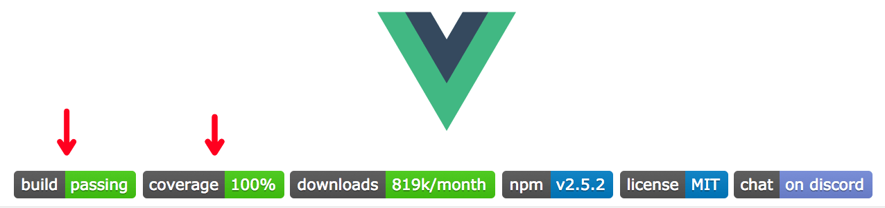

图中的徽章是可以点击的，第一个是 https://travis-ci.org/，travis-ci 是一个 CI（Continuous integration，持续集成） 平台，主要提供集群编译、单测、集成测试的环境。`.org` 的服务对公有仓库免费，`.com` 面向私人、团队、公司的项目提供商业支持（收费）。使用时用 Github 帐号登录进去，就能看见开始界面。

第二个徽章是 [codecov.io](https://codecov.io/)（单测覆盖率统计平台），接入过程也很简单，也是不同语言选择不同的[配置文件](https://docs.codecov.io/docs/supported-languages)，codecov 可以无缝衔接 travis-ci，只需要在原来的配置文件上稍作修改即可，核心就是生成单测的结果文件。

### 代码质量检查

①代码规范问题：通过Lint工具，其会通过源代码去查找：格式问题，不遵守编码标准和惯例，精确定位程序中可能存在的逻辑错误。

②高度耦合问题：一个函数几百行、一个文件数千行、一个类几十个方法、方法参数定义随意、没有任何注释、方法与变量命名无明确的语义、数据修改与变更穿插在各种方法中等等。 这样的编码方式会导致很难理解其内部的逻辑。

### 代码质量监测

Lint（或Linter）是一种分析源代码以标记编程过程中（代码、样式、构建）书写错误的工具或过程。它能动态的监测代码编写的错误，以便写出高质量代码。（Lint只会检测代码中的错误或者不符合规范的地方，而Prettier或Format是用来对格式进行调整的）

> **Lint**, or a **linter**, is a tool that analyzes [source code](https://en.wikipedia.org/wiki/Source_code) to flag programming errors, [bugs](https://en.wikipedia.org/wiki/Software_bug), stylistic errors, and suspicious constructs.[[1\]](https://en.wikipedia.org/wiki/Lint_(software)#cite_note-1) The term originates from a [Unix](https://en.wikipedia.org/wiki/Unix) [utility](https://en.wikipedia.org/wiki/List_of_utility_software) that examined [C language](https://en.wikipedia.org/wiki/C_(programming_language)) source code.[[2\]](https://en.wikipedia.org/wiki/Lint_(software)#cite_note-BellLabs-2)

相对于后端，前端代码规范的质量检查涉及到HTML, CSS，Javascript ，如今还涉及到SCSS，ES5，JSX,  React，Vue，Angular等。

如何进行代码质量监测(How to Lint)？常见的代码质量Lint工具：①HTML / tpl:  [HTMLHint](http://htmlhint.com/) ②CSS / SCSS: [StyleLint](https://stylelint.io/) ③JS / JSX: [ESLint](https://eslint.org/) 

### 常见的Js检验工具比较

常见的有三个可以使用的js校验器：[JSLint](http://www.jslint.com/)、[JSHint](http://jshint.com/)、[ESLint](http://eslint.org/)。它们用相同的基本方式工作，都有一套用户分析、报告js文件错误的规则，且都可以通过npm安装，都可以通过命令行使用、都支持使用注释进行配置，都可以作为IDE插件使用，可以集成到编辑器中。

#### JSLint

JSLint是其中最老的工具。在2002年 Douglas Crockford开发了该工具，根据其经验，强制使用js语言中精粹的部分。如果同意这些精粹，JSLint能成为一个好的工具。优点是参数配置完成，可以直接使用。

缺点是不存在配置文件，如果想改变参数设置，那就存在问题；而且它的配置选项是有限的，许多规则不能禁掉；也不能增加个性化规则；并且很多规则缺少文档，官方文档非常不友好，没有文档记录规则，很难弄清楚是哪个规则引起的错误。

#### JSHint

JSHint被开发出来（作为一个可配置的JSLint版本）。优点是JSHint支持基本的ES6；且对每个规则有较好的文档，所以可以准确知道每个规则的作用；且可以配置每个规则并放到一个配置文件中，这样在大项目中容易使用；且大多数参数都可以进行配置。且将JSHint集成到编辑器也是简单的。且已经支持需要类库，如jQuery、QUnit、NodeJS、Mocha等

缺点是存在两类选项，即强制选项和松散选项，使得配置有些混乱；而里面的松散默认配置，也就是在让一些规则可以使用之前必须将它启动。和ESLint相比，确定哪个规则用户开启或关闭错误信息，JSHint是更加困难（较难知道哪个规则产生错误）；且不支持自定义规则

#### ESLint

ESLint是比较新的工具。它被设计得更容易拓展（需要可用的插件）、拥有大量的自定义规则。它给出准确的输出，而且包括规则名，这样可以知道哪个规则造成了错误。且支持ES6，支持JSX的工具，支持自定义报告。

缺点是ESLint文档多少有些混乱。虽然规则容易查找且被分为逻辑组，但是配置指南上有些地方容易弄混。

> [JSCS](http://jscs.info/)已经合并到ESlint

| 分类                     | JSLint       | JSHint | ESLint |
| :----------------------- | ------------ | ------ | ------ |
| 初始配置                 | 有           | 有     | 可配置 |
| 自定义                   | 命令行，有限 | 可配置 | 可配置 |
| 配置文件                 | 否           | 是     | 是     |
| ES6                      | 是           | 是     | 是     |
| JSX                      | 否           | 是     | 是     |
| 执行效率（基本察觉不到） | 高           | 中     | 低     |
| 输出友好度               | 低           | 中     | 高     |
| Stars                    | 3.3k         | 8.2k   | 14.2k  |

### Lint工具介绍

Lint是一种工具，可以分析源代码，并在出现错误或与团队编码约定不符时通知用户。在某些情况下，它还可以自动修复错误。

ESLint是JavaScript的linting实用程序。ESLint不依赖于特定的编码约定，用户也可以自由地启用或禁用各个编码约定，从这个意义上讲，它的一个主要特点是其高度可定制性。用户可以通过定义原始[规则](https://eslint.org/docs/rules/)来灵活地设置编码标准，这些规则是ESLint中默认可用的编码规则。另外，第三方共享的著名的编码约定，例如“Google JavaScript Style Guide”或“Airbnb JavaScript Style Guide”也可以重复使用。甚至可以在遵循这些编码约定的同时启用或禁用特定文件的特定规则。

#### 安装与起步（基本使用）

一、在项目里面去使用（本地安装）：使用本地安装的 ESLint 时，使用的任何插件或可分享的配置也都必须在本地安装。

```json
npm init  // npm init 指令会在项目根目录下生成 package.json 文件
npm install eslint --save-dev  // --save-dev或-D会把eslint安装到package.json文件中的devDependencies属性中
```

方式1：新增并使用package.json 脚本（npm run）

```
//第一个是检测src目录下的所有文件，第二个是创建ESLint的配置文件（初始化）
"scripts": {
    "lint": "eslint src",
    "lint:create": "eslint --init"
}
①使用run命令：npm run lint
```

方式2：使用npx命令 或 执行bin下eslint：

运行npx时，会到node_modules/.bin路径和环境变量$PATH里，找这个命令。npx除了调用项目内部模块，还能避免进行全局模块的安装。

```bash
①npx eslint --init 或(等同于) ./node_modules/.bin/eslint --init //执行.bin文件夹下对应的二进制指令
②./node_modules/.bin/eslint yourfile.js
```

二、在全局使用（如果让 ESLint 适用于所有的项目，则建议全局安装 ESLint。但是ESLint的全局包的更新相对更麻烦）

```bash
npm install -g eslint
①eslint --init 或 npx eslint --init
②eslint yourfile.js  //全局安装可以在任何文件或目录运行 ESLint
```

#### ESLint初始化(.eslintrc.js文件)

配置方法使用 `eslint --init`方法

```bash
➜ npx eslint --init
? How would you like to use ESLint? (Use arrow keys)
  To check syntax only 
❯ To check syntax and find problems 
  To check syntax, find problems, and enforce code style 
? What type of modules does your project use? (Use arrow keys)
❯ JavaScript modules (import/export) 
  CommonJS (require/exports) 
  None of these 
? Which framework does your project use? // 这里可以针对你的开发项目进行配置
  React 
  Vue.js 
❯ None of these 
? Where does your code run? // 可以配置代码运行的地方，是浏览器还是Node环境还是都有
❯◉ Browser
 ◉ Node
? What format do you want your config file to be in? (Use arrow keys)
❯ JavaScript 
  YAML 
  JSON 
Successfully created .eslintrc.js file in /Users/itheima/Downloads/Demo  // 成功创建了配置文件
```

配置文件`.eslintrc.js`：eslint使用配置的顺序：`.eslintrc.js` > `.eslintrc.yaml` > `.eslintrc.yml` > `.eslintrc.json` > `.eslintrc` > `package.json`

①示例：如果是`.eslintrc.js`文件：

```js
module.exports = {
    "env": {
        "browser": true,
        //"commonjs" true,  // 这个也可以加上
        "es6": true,
        "node": true
    },
    "extends": "eslint:recommended",
    "globals": {
        "Atomics": "readonly",
        "SharedArrayBuffer": "readonly"
    },
    "parserOptions": {
        "ecmaVersion": 2018,
        "sourceType": "module"
    },
    "rules": {
    }
};
```

②示例：如果是`.eslintrc.yaml`文件：

```yaml
env:
  browser: true
  es6: true
  node: true
extends: 'eslint:recommended'
globals:
  Atomics: readonly
  SharedArrayBuffer: readonly
parserOptions:
  ecmaVersion: 2018
  sourceType: module
rules: {}
```

③该文件导出一个对象，对象包含属性` root`、`env`、`extends`、`globals`、`parserOptions`、`plugins`、`rules` 七个属性：

1.`root`：根。

2.`env`：指定脚本的运行环境。每种环境都有一组特定的预定义全局变量（如：nodejs，browser，commonjs等）。

3.`extends`: 对默认规则进行扩展，可以使用`Airbnb`或`Standard`规则，即使用别人提供的包， 如google，通过使用这个现成的配置，则可以轻松使用Google JavaScript样式指南中的编码约定，而无需从头开始编写设置。

4.`globals`：执行代码时脚本需要访问的额外全局变量。

5.`parserOptions`：用于指定想要支持的JavaScript语言选项，里面的属性有：

- `ecmaVersion`：默认设置为3，5， 可以使用 6、7、8 或 9 来指定要使用的 ECMAScript 版本。也可以使用年份命名的版本号进行指定，如2015（同 6），2016（同 7）， 2017（同 8）， 2018（同 9）

- `sourceType`：设置为 `"script"` (默认) 或 `"module"`（如果代码是 ECMAScript 模块)。
- `ecmaFeatures`：这是个对象，表示要使用的额外的语言特性：可选值有：`globalReturn`允许在全局作用域下使用return语句，`impliedStrict`启用全局 [strict mode](https://developer.mozilla.org/en-US/docs/Web/JavaScript/Reference/Strict_mode) (如果 `ecmaVersion` 是 5 或更高)，`jsx`启用 [JSX](http://facebook.github.io/jsx/)

6.`plugins`：ESLint提供的默认规则涵盖了基本规则，但JavaScript可以使用的范围非常广泛，如果ESLint的默认规则未提供希望要使用的规则，则可以在ESLint中（通过插件plugins）开发自己的独立规则。为了让第三方开发独立规则，ESLint允许使用[插件](https://eslint.org/docs/developer-guide/working-with-plugins)。如果你在npm中搜索eslint-plugin- *，则可以找到第三方提供的大量自定义插件。

```js
//例如，如果要对React代码执行静态分析，可以安装名为[eslint-plugin-react](https://www.npmjs.com/package/eslint-plugin-react)的插件，并使用以下设置来执行React语法特有的静态分析。
{......
    "extends": "google",
    "plugins": [ 
        "react" 
    ],
    "rules": {
        //关闭 不许存在冗余的未使用的变量
        "no-used-vars": "off", //等同于"no-used-vars": 0,
        //末尾逗号
        "comma-dangle": ["error", "never"],
        //分号
        "semi": ["error", "never"], //等同于"semi": [2, "never"],
        //引号
        "quotes": ["error", "single"],
        //不许出现多余的空行，下面配置最大间距空行是1，文件结尾不许有空行
        "no-multiple-empty-lines": ["error", { "max": 1, "maxEOF": 0 }],
        //驼峰命名
        "camelcase": "error",
        //日志输出，在生产环境下不可以有console，在非生产环境(开发环境)则可以使用
        "no-console": process.env.NOED_ENV === 'production' ? "error" : "off",
        "no-debugger": process.env.NOED_ENV === 'production' ? "error" : "off",
        //强等判断
        "eqeqeq": "error",
        //语句块之间的空格(关键字后的空格,函数名后的空格,小括号前后的空格)
        "space-before-blocks": "error",
        //缩进
        "indent": ["error", 2]
    } 
}
```

7.`rules`：开启某些规则，也可以设置规则的等级。里面的规则（属性）的值的含义：

- “off” 或 `0` - 关闭规则
- “warn” 或 `1` - 开启规则，使用警告级别的错误：warn (不会导致程序退出)
- “error” 或 `2` - 开启规则，使用错误级别的错误：error (当被触发的时候，程序会退出)

#### .eslintignore文件

可在项目根目录创建`.eslintignore`文件（纯文本文件），让ESLint忽略某些文件或者目录。常见内容：

```
node_modules/*
**/node_modules/*
dist/*
/build/**
/coverage/**
/docs/**
/jsdoc/**
/templates/**
/tests/bench/**
/tests/fixtures/**
/tests/performance/**
/tmp/**
/lib/rules/utils/unicode/is-combining-character.js
test.js
!.eslintrc.js

或在react项目中配置：
node_modules/
build
my-app*
packages/react-scripts/template
packages/react-scripts/fixtures
fixtures/
```

#### 常用ESlint配置

ESLint的规范：①Standard: https://github.com/standard/eslint-config-standard（具体地址:[eslintrc.json](https://github.com/standard/eslint-config-standard/blob/master/eslintrc.json)）；②Airbnb: https://github.com/airbnb/javascript

ESLint中文网里的（所有）配置选项：https://cn.eslint.org/docs/rules/

#### 在IDE中的配置

①在VSCode中，ESLint的ide插件配置：

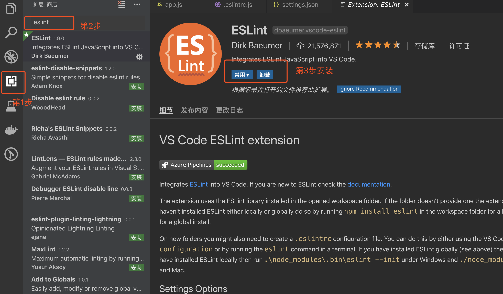

安装后可在右下角点击ESLint后看到有这个面板：

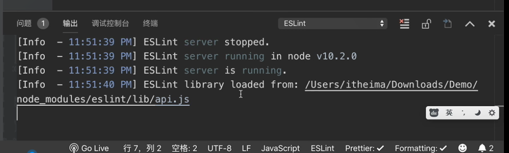

VSCode的配置文件（settings.json）：

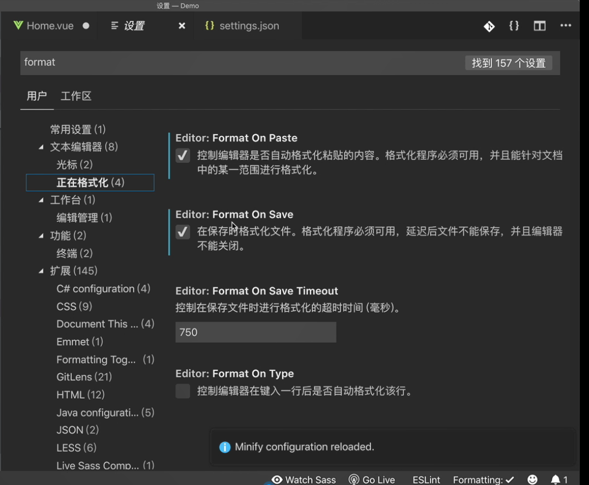

```json
//编辑器配置： //或者在UI界面里面设置，如上图
"editor.formatOnPaste": true,
"editor.formatOnSave": true,  //具体使用什么工具进行格式化则需要再次进行指定
//ESLint：
"eslint.alwaysShowStatus": true,
"eslint.autoFixOnSave": true, //在保存的时候，使用ESLint的配置规则来修改文档，相当于执行 eslint --fix 命令
"eslint.validate": [ //指定要强制验证的文件的语言标识符数组
    "javascriptreact",
    {
        "language": "html",
        "autoFix": true
    },
    {
        "language": "vue",  //对vue文件
        "autoFix": true
    },
    {
        "language": "react",  //对react文件
        "autoFix": true
    },
    {
        "language": "javascript",  //对js文件
        "autoFix": true
    },
    {
        "language": "typescript",
        "autoFix": true
    }
],
"eslint.options": {
    "plugins": ["html"]
},
```

②在Webstorm中，ESLint的ide插件配置：（相比于vscode就更智能）

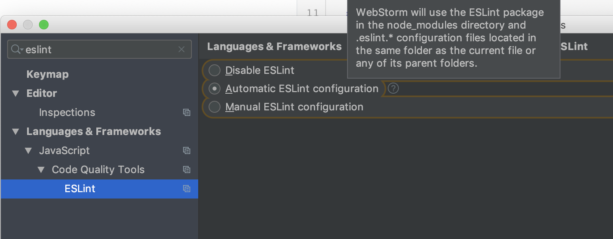

#### 实战vue项目配置

ESlint配置文件：

```js
module.exports = {
  //对于vue项目，vue的脚手架内部会自动执行 读取配置文件并执行eslint命令 来检查代码规范
  root: true,
  env: {
    node: true,
  },
  extends: [
    'plugin:vue/essential',
    '@vue/standard',
  ],
  rules: {
    'no-console': process.env.NODE_ENV === 'production' ? 'error' : 'off',
    'no-debugger': process.env.NODE_ENV === 'production' ? 'error' : 'off',
    semi: ['error', 'never'],
  },
  parserOptions: {
    parser: 'babel-eslint',
  },
}
```

使用prettier-eslint插件：

```json
//prettier-eslint插件能让代码在格式化时，使用prettier-eslint插件进行格式化，而这个插件的格式化规则是按照ESLint的配置规则来进行格式化的
安装：yarn add prettier-eslint -D

然后在VSCode的settings.json文件里进行配置
//Vetur插件（本身不是格式化插件）能根据不同的 模板（标签结构，如对HTML部分,对JS部分,对CSS部分等等）里面的内容使用特定的格式化插件
//Vetur //或者在UI界面里面设置，如下图
"vetur.format.defaultFormatter.js": "prettier-eslint",
"vetur.format.defaultFormatter.html": "prettier",
```

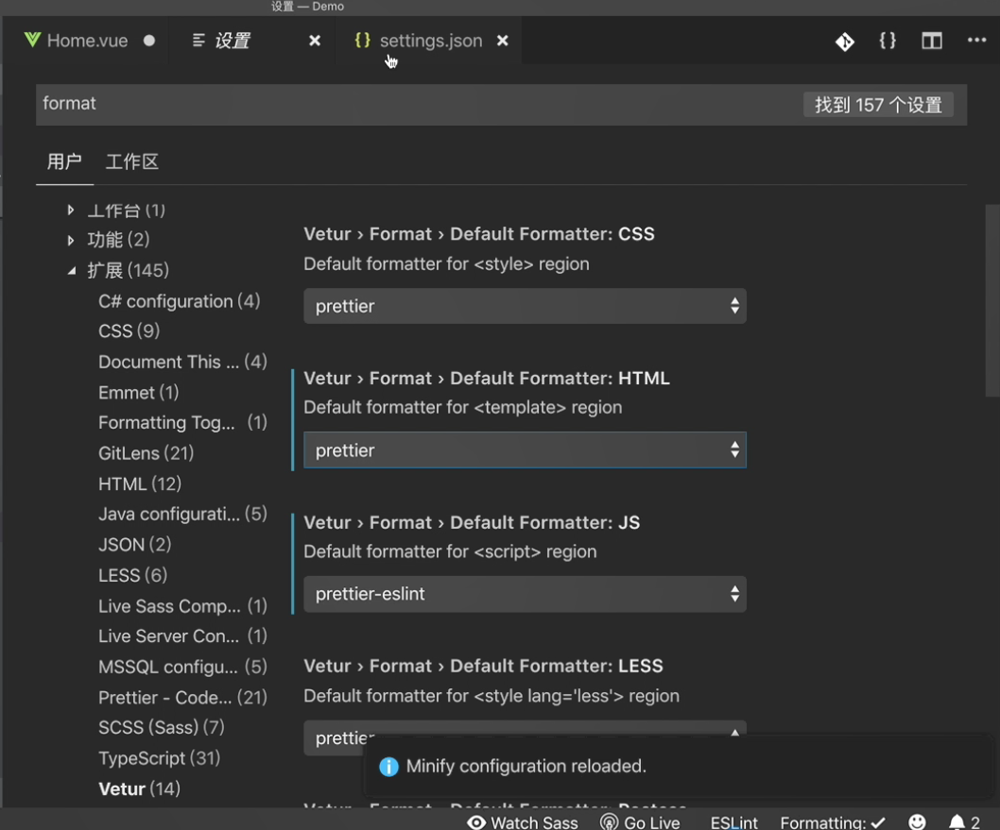

推荐安装的VSCode插件：vue(高亮语法)，vetur(安排格式化插件)，Vue peek(组件跳转)，vue beautify(vue格式化)，Vue VSCode Snippets 和 Vue Snippets(代码提示)，Prettier(格式化插件，可与Vetur结合使用，被Vetur安排)：

```json
//Prettier插件用来替代lint中的一些场景，如分号、tab缩进、空格、引号等（这些问题lint工具不能自动修复）
//Prettier
"prettier.trailingComma": "es5",
"prettier.semi": false,
"prettier.jsxSingleQuote": true,
"prettier.singleQuote": true,
"prettier.eslintIntegration": true,
```

在文件修改并进行保存之后的执行顺序：

①ide的ESLint插件对不符合配置规则的地方进行实时标红（保存之前）

②读取配置文件.eslintrc.js，ide的ESLint插件进行修改。（相当于编辑器帮你执行了eslint --fix）

③读取配置文件.prettier，ide的Prettier插件进行修改。（相当于编辑器帮你执行了prettier --write .文件）

④用prettier-eslint进行更符合ESLint规则的更细致的格式化

⑤（重新运行项目）对于vue项目，脚手架内部会使用eslint进行代码规范检查（不符合规范则在终端里报错）（相当于vue项目帮执行了eslint的检查文件命令）

#### 实战react项目配置

```bash
先使用create-react-app创建react项目：npx create-react-app my-app
（如果没有npx命令，则全局安装create-react-app：npm install -g create-react-app）
然后进入项目：cd my-app
运行项目：npm start
```

安装eslint相关依赖：

```json
"devDependencies": {
  "eslint": "^5.16.0",
  "babel-eslint": "^10.0.2",
  "eslint-plugin-html": "^6.0.0",
  "eslint-plugin-react": "^7.14.2"
}
```

安装（配置）Airbnb规范相关包：

```bash
npm --save-dev install eslint-config-airbnb eslint-plugin-import eslint-plugin-jsx-a11y babel-eslint //Airbnb有后面三个依赖
```

配置eslint配置文件，或使用`eslint --init`进行初始化：

```js
module.exports = {
    "env": {
        "browser": true,
        "commonjs": true,
        "node": true,
        "es6": true
    },
    "extends": [
        "eslint:recommended",
        "plugin:react/recommended",
        "plugin:import/errors",  //新加配置
        "plugin:jsx-a11y/recommended",  //新加配置
        "airbnb"  //新加配置
    ],
    "globals": {
        "Atomics": "readonly",
        "SharedArrayBuffer": "readonly"
    },
    "parser": "babel-eslint",  //新加配置
    "parserOptions": {
        "ecmaFeatures": {
            "jsx": true,
            "arrowFunctions": true,
            "classes": true,
            "modules": true,
            "defaultParams": true
        },
        "ecmaVersion": 2018,
        "sourceType": "module"
    },
    "plugins": [
        "react",
        "jsx-a11y",  //新加配置
        "import"  //新加配置
    ],
    "rules": {
      // 这里可以添加jsx-ally与import相关的自定义rules
    },
    "settings": {
        "react": {
            "pragma": "React",
            "version": "latest",
        },
    },
};
```

#### Settings Sync（VSCode插件）的使用

功能：能够把配置文件上传到云端（github上），以后若配置文件里的内容丢失了，则可以重新在这个云端拉回来。

搜索并安装：

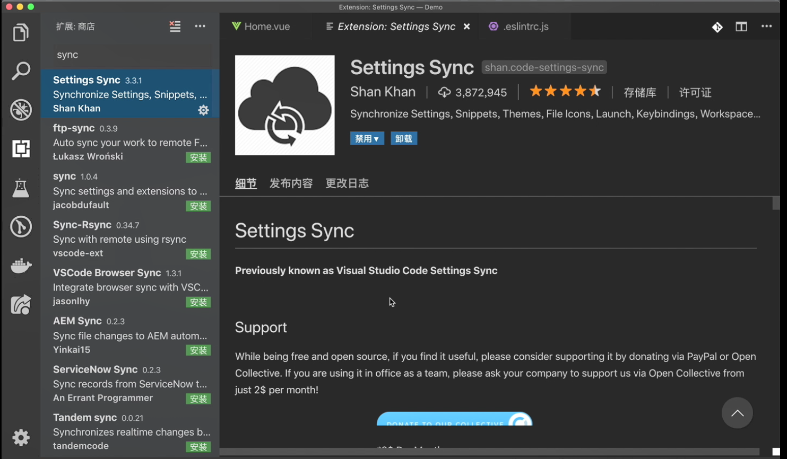

使用（先点击同步设置，会跳转到github网站）：

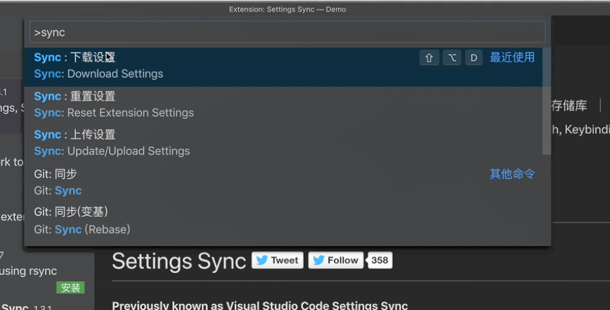

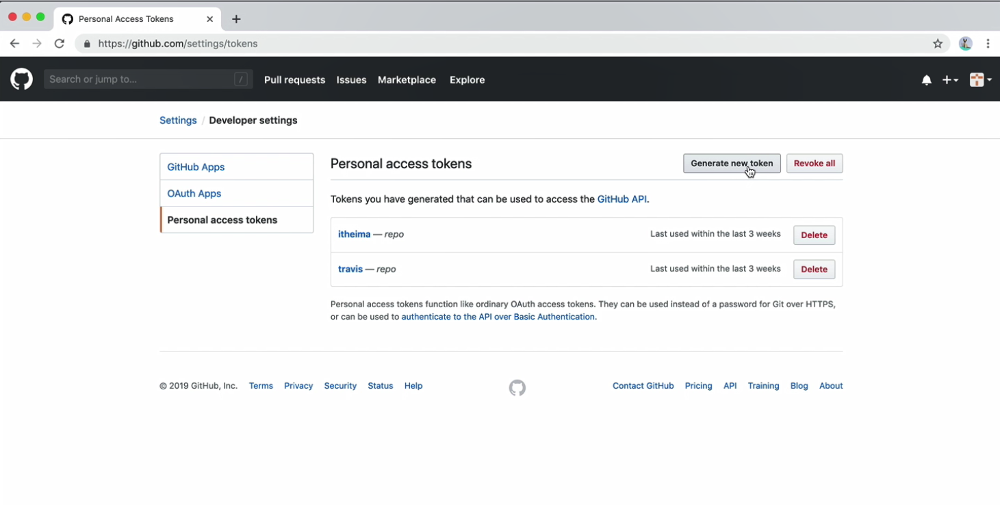

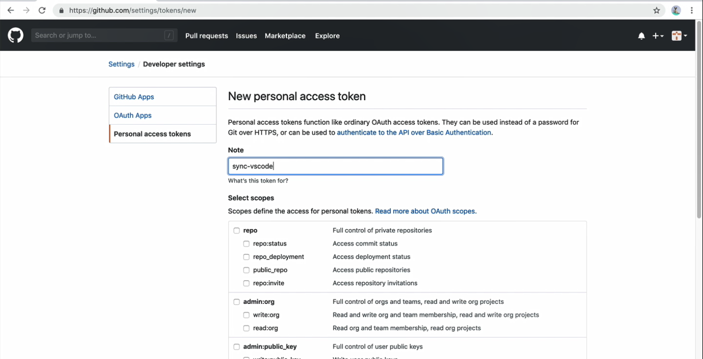

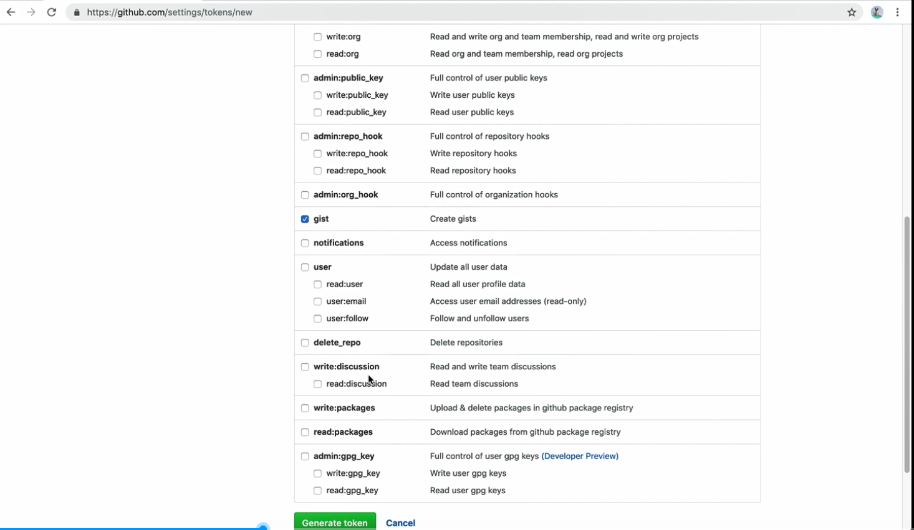

生成tokens

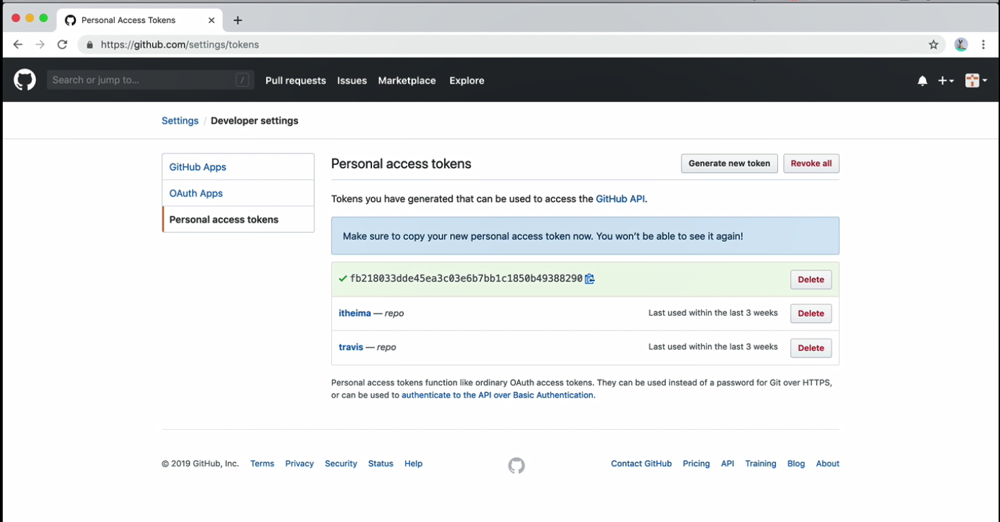

回到编辑器里输入刚才生成的tokens进行（配置文件的）上传：

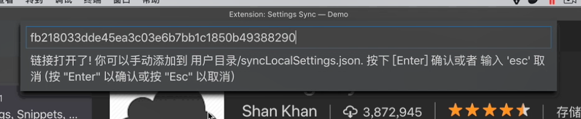

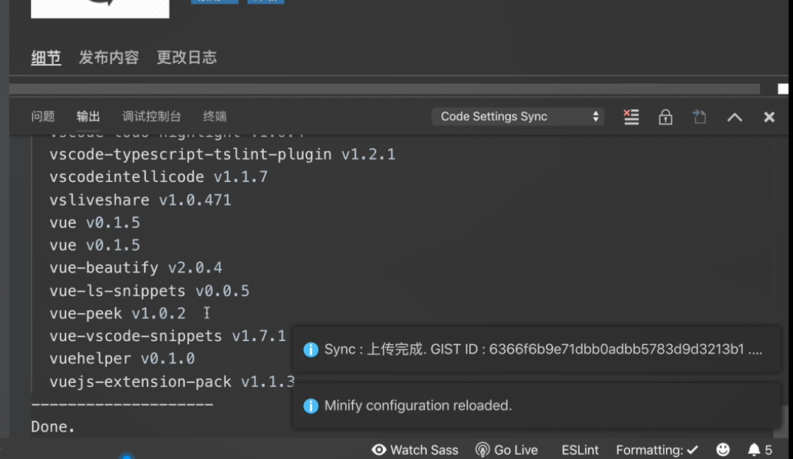

上传完成，生成gist内容

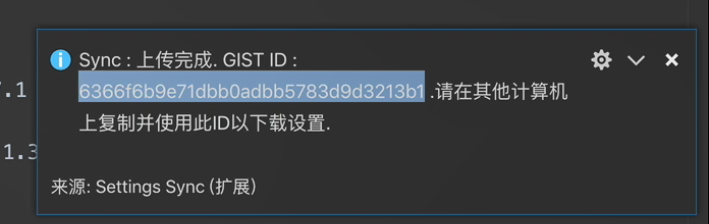

日后若想把配置文件的内容回到之前的配置则，点击下载设置：

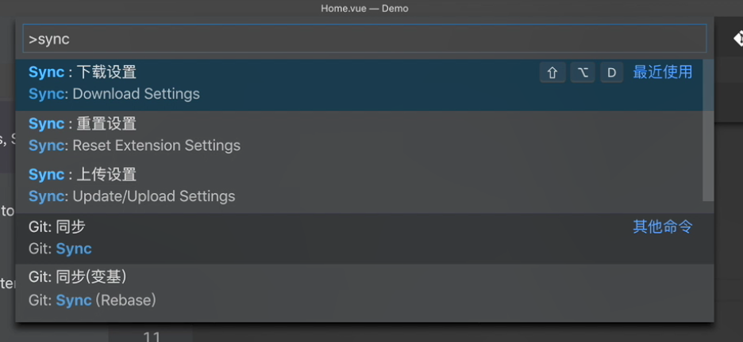

输入tokens和gist内容

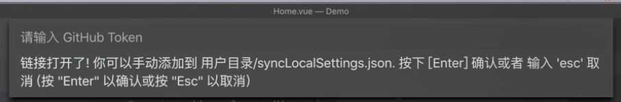

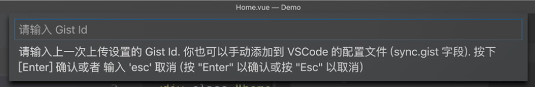

配置文件下载成功

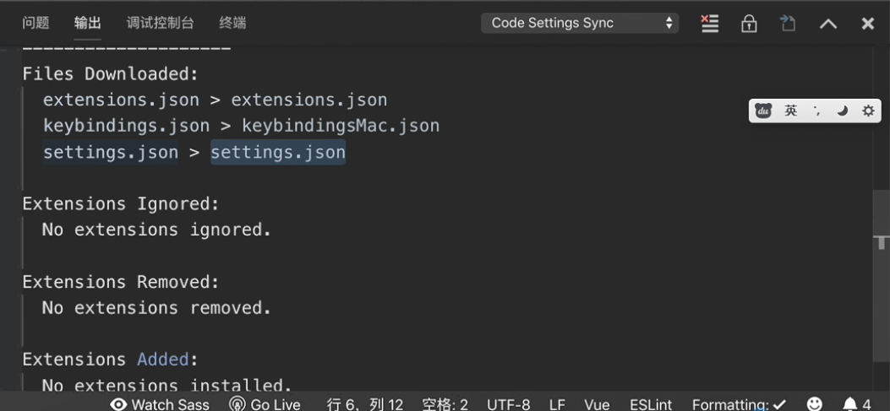

VSCode的对settings.json文件的sync插件的配置：

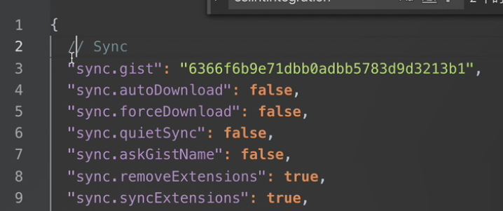

#### cross-env（npm包）的使用

```
//拓展知识：
安装：npm install cross-env -D  这个库可以用于设置环境的变量

//在package.json里：
//第一个lint原先为"lint": "eslint app.js",更改之后
//第一个lint传入环境NODE_ENV为production，则使用node运行时则可打印出production
"scripts": {
    "lint": "cross-env NODE_ENV=production node app.js",
    "lint:create": "eslint --init"
}

//在app.js文件里
console.log(process.env.NODE_ENV)
```

### StyleLint

官网：https://stylelint.io/。先安装依赖：

```bash
npm install -D stylelint-config-recommended stylelint-config-standard
或使用yarn
yarn add stylelint-config-recommended stylelint-config-standard -D
```

`.stylelintignore`（忽略）配置文件：

```
/src/**/*.css
```

`.stylelintrc.js`（规则）配置文件：

```js
module.exports = {
  "extends": ["stylelint-config-recommended", "stylelint-config-standard"],
  "rules": {
    "indentation": 2
  }
}
```

基本使用（检验文件）：

```
npx stylelint yourcss.css
或 npm run stylelint（要先把命令加入到package.json中的scripts中）
```

在vscode的配置：安装`stylelint`的ide插件，方便格式化代码：

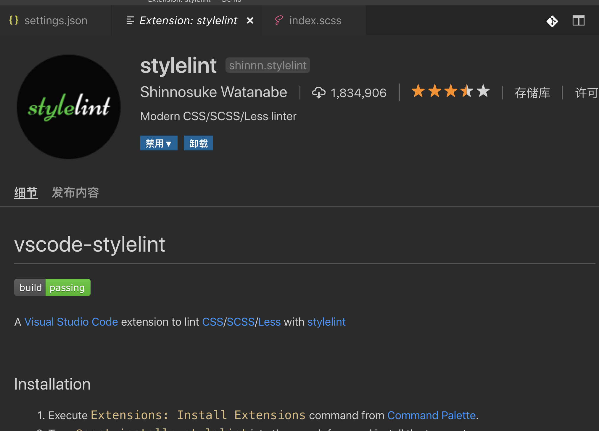

在vscode的settings.json配置文件里：

```
  "[scss]": {
    "editor.formatOnSave": true
  },
  // 打开scss的validate配置
  "scss.validate": true,
```

### HTMLHint

官网：[https://htmlhint.io](https://htmlhint.io/)。github: https://github.com/htmlhint/HTMLHint。先安装依赖：

```bash
npm install htmlhint --save-dev
或使用yarn
yarn add htmlhint -D
```

然后配置（忽略）配置文件。

`.htmlhintrc`（规则）配置文件：示例：

```json
/** //示例：
标签名必须小写
属性名必须小写
属性值必须放在双引号中
属性值一定不可为空
属性值一定不可重复
Doctype必须是 HTML 文档的第一行
标签必须成对
标签必须自封闭
特殊字符必须
ID 属性必须唯一
src 属性一定不可为空
title 属性必须出现在标签中
img 标签必须包含 alt 属性
Doctype 必须是 HTML5
ID 和 Class 的命名规则必须统一
不该使用样式标签
不该使用行内样式
不该使用行内脚本
空格和制表符一定不可混合在行前
ID 和 Class 一定不可使用广告关键词
href 必须是绝对路径或者相对路径
属性值一定不可使用不安全字符
script 标签不该使用在头部
*/
{
  "tagname-lowercase": true, 
  "attr-lowercase": true,
  "attr-value-double-quotes": true,
  "attr-value-not-empty": false,
  "attr-no-duplication": true,
  "doctype-first": true,
  "tag-pair": true,
  "empty-tag-not-self-closed": true,
  "spec-char-escape": true,
  "id-unique": true,
  "src-not-empty": true,
  "title-require": true,
  "alt-require": true,
  "doctype-html5": true,
  "id-class-value": "dash",
  "style-disabled": false,
  "inline-style-disabled": false,
  "inline-script-disabled": false,
  "space-tab-mixed-disabled": "space",
  "id-class-ad-disabled": false,
  "href-abs-or-rel": false,
  "attr-unsafe-chars": true,
  "head-script-disabled": true
}
```

在vscode的配置：安装`HTMLHint`的ide插件，方便格式化代码：

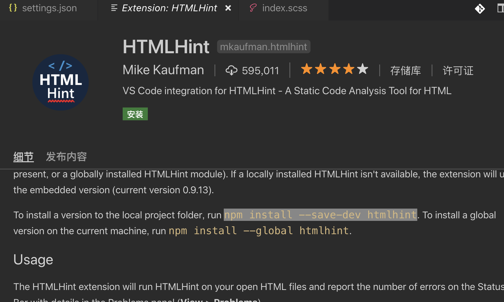

在vscode的settings.json配置文件里：

```
  "[html]": {
    "editor.defaultFormatter": "esbenp.prettier-vscode"
  },
  // 打开scss的validate配置
  "files.associations": {
  	"*.ext": "html"
  },
```

### 测试

通常对Web应用程序执行两种类型的测试：①单元测试；②端到端（E2E）测试：如客户端到服务端。

#### 单元测试：

①函数测试：

在测试中使用“单元”的想法是将代码分解为易于测试的小部件。通常，单元是单个函数，但也可以是类或甚至是复杂的算法。单元测试的一个关键概念是函数的给定输入应始终产生相同的输出。例如：

```js
//add.spec.js文件
//如果有一个函数add添加了两个调用的数字，则可以编写一个单元测试来确保 输入的（两个）参数（提供的特定数字）总是返回期望的输出。
// Function we want to test
const add = (x, y) => x + y;
// Unit test
test("should add two numbers", () => {
  const result = add(2, 3);
  expect(result).toBe(5);  //在任何时候，如果运行该测试且它不等于5，则可以得出一个错误。
});
```

②组件测试：

在大多数Vue.js应用程序中，函数并不真正代表应用程序的原子组成（虽然也可以对里面的方法进行单元测试），Vue.js app测试中的单元是一个组件，更为重要的是生成的HTML。例如：

```js
//displayGreeting.js文件
export default {
  template: `<div>Hello, {{ name }}</div>`,
  props: ['name']
};
```

```js
//displayGreeting.spec.js文件
//对于给定输入（支柱），单元测试必须返回一致的输出（文本内容）
import displayGreeting from "./displayGreeting.js";
//如果使用像Vue Test Utils这样的库，则可以在内存中安装Vue组件并创建一个“包装器”对象，然后可以查询到包装器对呈现的HTML进行断言
test("displays message", () => {
  const name = "Michael";
  const wrapper = mount(displayGreeting, { propsData: { name } });
  expect(wrapper.text()).toBe(`Hello, ${name}`);
});
```

单元测试优点：测试运行得很快；测试是精确的，允许识别确切的问题。

单元测试缺点：为应用程序的每个方面编写测试都非常耗时；尽管单元测试通过，整个应用程序可能仍然无法正常工作。

#### e2e test：

e2e test（End to End test端到端）测试是一种功能测试。与单元测试不同，它不会将应用程序分解为更小的部分以进行测试，而是测试整个应用程序。

e2e测试应用程序的交互，就像真实用户一样。例如，可以编写一个E2E测试用于：①加载一个网站；②点击“注册”链接；③为注册表单中的输入提供一些有效的详细信息；④单击“注册按钮”，如果身份验证令牌已存储在Cookie中并且应用程序重定向到配置文件页面，则应通过此测试。

E2E测试优点：可以一次隐式测试很多东西；e2e测试可确保拥有一个工作系统。

e2e测试缺点：运行缓慢，通常需要5或10分钟才能运行一个站点；测试很脆弱，一个无关紧要的变化，如一旦改变组件逻辑就要重新设计e2e test；测试无法查明失败的原因。所以，主要的业务流程可能会写E2E（不过规模要小很多），主要目的是：①便于给PM展示业务流程；②便于修改Bug之后的回归。

### e2e test的工具介绍

#### Cypress

Cypress由TypeScript进行编写，对chrome浏览器支持较好，对其它浏览器的支持不太好。

1. 安装

   ```bash
   npm install cypress --save-dev
   // 或者直接下载桌面应用（软件）：https://download.cypress.io/desktop
   ```

   npm包版：（执行Cypress的对应的命令后会弹出这个窗口）

   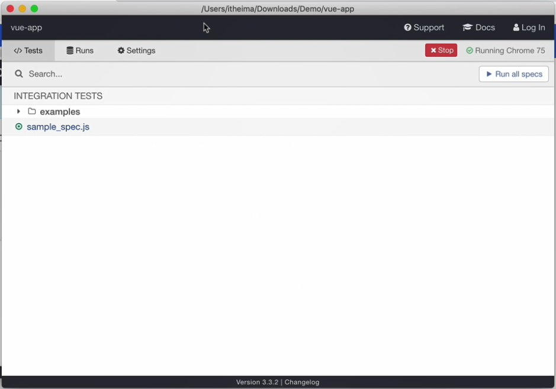

   桌面应用版：

   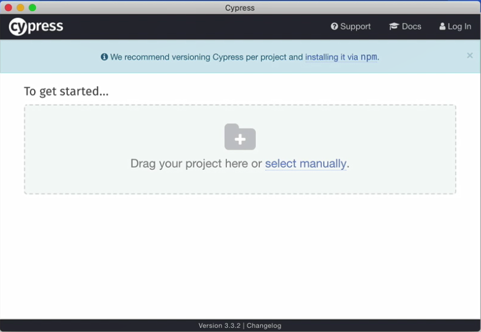

2. 使用方式

   ```bash
   ./node_modules/.bin/cypress open  或  npx cypress open
   // 或使用yarn ：yarn run cypress open
   
   //或在package.json中添加如下内容，然后npm run cypress:open
     "scripts": {
       "cypress:open": "cypress open"
     }
   ```

   然后就会在项目根目录生成一个cypress文件夹。

3. 创建一个测试（文件）

   可以先学习测试案例如何写：

   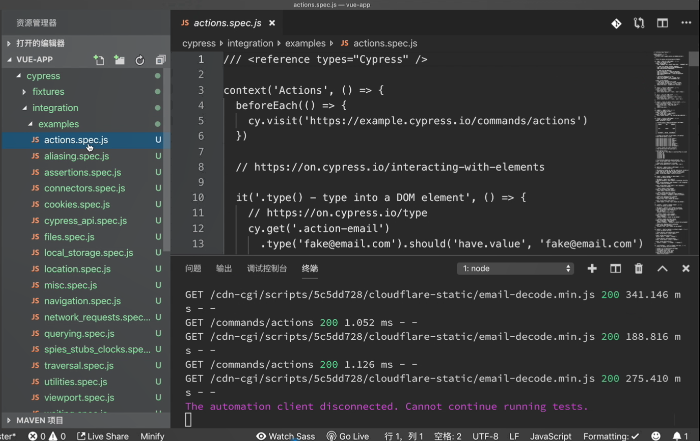

4. 在intergration目录下面创建一个sample_spec.js（测试）文件：（第一行是用于代码提示）

   ```js
   /// <reference types="cypress" />
   describe('My first Test', function () {
       it('Hello World!', function () {
           expect(true).to.equal(true)  // 通过
       })
   })
   ```

   用于代码提示的另一种解决方法：（无需在每个测试文件写那一行，但要在cypress目录下创建并配置tsconfig.json文件）：

   ```
   {
   	"compilerOptions": {
   		"allowsJs": true,
   		"baseUrl": "../node_modules",
   		"target": "es5",
   		"types": ["cypress"]
   	},
   	"include": ["**/*.*"]
   }
   ```

   接下来，鼠标移入describe则会有代码提示（上面的部分）。下面的部分提示是eslint的，解决这个“错误”提示的方法：

   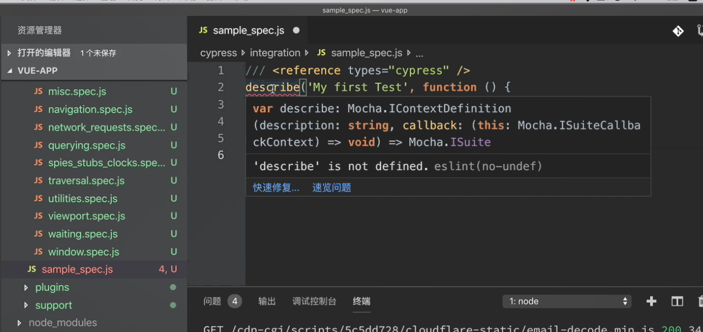

   ```
   先安装插件：
   npm install eslint-plugin-cypress --save-dev 或 yarn add eslint-plugin-cypress -D
   再在.eslintrc.js文件里的plugins和env添加：
   {
   	"plugins": [
   		"cypress"
   	],
   	"env": {
   		"cypress/globals": true
   	}
   }
   ```

   运行结果：

   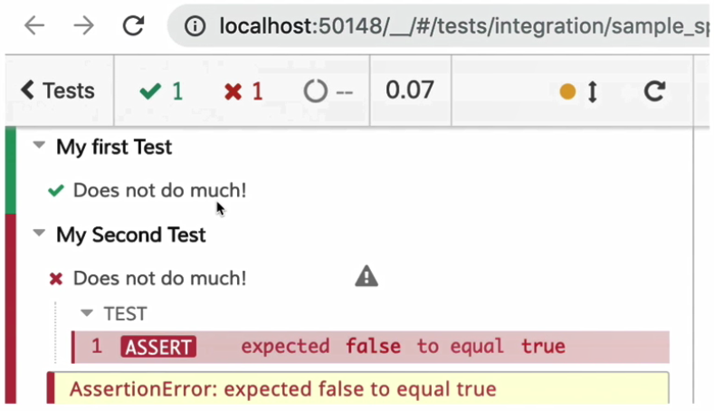

#### Nightwatch

Nightwatch是一套基于Node.js的测试框架,使用 Selenium Webdriver API以将Web应用测试自动化。它提供了简单的语法，支持使用 javaScript和CSS选择器，来编写运行在 Selenium服务器上的端到端测试。Nightwatch通过与 WebDriver服务器（例如 ChromeDriver或 Selenium Server）通过 REST API进行通信，该协议由 W3C WebDriver规范定义，该规范源自 JSON Wire协议。

官网：

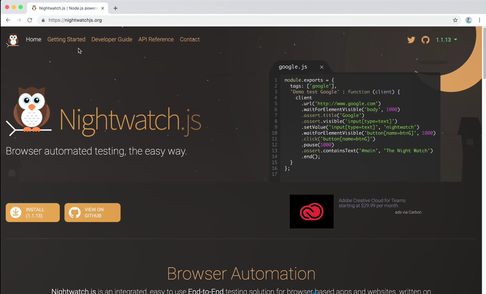

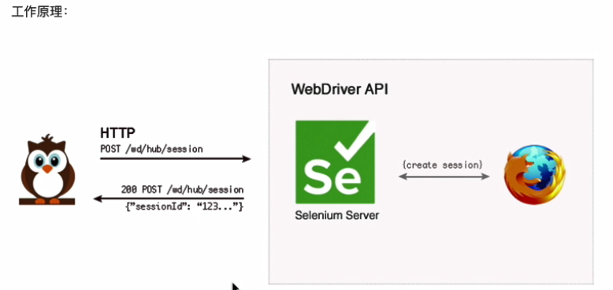

①安装nightwatch：

```bash
npm install nightwatch
// 可以使用-g命令在全局进行安装使用 或 使用--save-dev命令保存到package.json的开发依赖里（yarn add nightwatch -D）
```

②安装WebDriver Service（根据需要进行安装）：

1.Firefox：npm install geckodriver --save-dev

2.Chrome：npm install chromedriver --save-dev（yarn add chromedriver -D）

3.Microsoft Edge：DISN.exe /online /Add-Capability /CapabilityName:Microsoft Webdriver~~~~0.0.1.0

4.Safari：safaridriver --enable

③如果是（主要针对）旧的浏览器环境测试（才要安装，如老IE）：

从Nightwatch 1.0开始不再需要安装，也不建议使用。方法

1.下载JAVA环境，JDK7

2.下载selenium-server-standalone-{VERSION}.jar

3.运行兼容测试环境java -jar selenium-server-standalone-{VERSION}.jar

4.可以使用--help命令进行查看帮助

> Starting with Selenium 3 . Firefoxdriver is no longer included in the package . Also , starting withversion 48 , Firefox is no longer compatible with Firefoxdriver which is shipped with Selenium 2 . x .Firefox users are advised to use Gecko Driver for their testing . For more info , refer to the browsersetup section

④创建测试配置文件`nightwatch.json`和`nightwatch.conf.js`（也可以不配置这个文件），并进行配置，示例：

```json
{
	"src_folders" : ["tests"],
	
	"webdriver": {
		"start_process": true,
		"sever_path": "node_modules/.bin/chromedriver",
		"port": 9515
	},
	
	"test_settings": {
		"default": {
			"desiredCapabilities": {
				"browserName": "chrome"
			}
		}
	}
}
```

```js
module.exports = (function(settings) {
	settings.test_workers = false;
	return settings;
})(require('./nightwatch.json'));
```

⑤创建test目录并创建demo.js

```js
module.exports = {
  'Demo test Google': function (browser) {
    browser
      .url('https://www.google.com')
      .waitForElementVisible('body')
      .setValue('input[type=text]', 'nightwatch')
      .waitForElementVisible('input[name=btnK]')
      .click('input[name=btnK]')
      .pause(1000)
      .assert.containsText('.LC201b', 'Nightwatch')
      .end();
  },

  'Demo test baidu': function (browser) {
    browser
      .url('https://www.baidu.com')
      .waitForElementVisible('body')
      .setValue('#kw', 'nightwatch')
      .click('#su')
      .pause(1000)
      .assert.containsText('em', 'Nightwatch')
      .end();
  }
};
```

⑤执行测试文件

```bash
npx nightwatch
//然后就会自动打开浏览器，并进行自动测试（这里演示Demo test baidu）
```

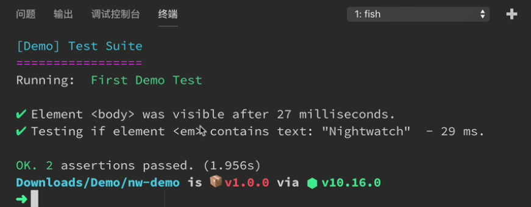

#### TestCafe

智能度更高，更适合小项目。特点：创建稳定的测试案例；支持TypeScript；检测JS错误（类似ESlint在终端报错）；并行测试；REST API；持续集成支持（Travis，Jenkins）。官网：https://devexpress.github.io/testcafe/


①安装testcafe：

```bash
全局安装：npm install -g testcafe 
或 局部安装：npm install -D testcafe 或 yarn add testcafe -D
//安装后可以查看testcafe的版本：./node_modules/.bin/testcafe --version
```

②创建测试案例文件test.js

```js
import { Selector } from 'testcafe';

fixture `Getting Started`
	.page `http://devexpress.github.io/testcafe/example`;

test('My first test', async t => {
    // Test code
    console.log('Hello Testcafe')
    await t
    	.typeText('#developer-name', 'John Smith')
    	.click('#submit-button');
    const articleHeader = await Selector('.result-content').find('h1');
    // Obtain the text of the article header
    let headerText = await articleHeader.innerText;
    console.log(headerText)
});

test('My second test', async t => {
    await t
    	.typeText('#developer-name', 'John Smith')
    	.click('#submit-button');
    // Use the assertion to check if the actual header text is equal to the expected one
    	.expect(Selector('#article-header').innerText).eql('Thank you, John Smith!');
});
```

③运行testcafe进行测试

```bash
使用npx的方式：npx testcafe chrome test.js
或使用npm run的方式：在package.json中添加如下内容，然后npm run test
"scripts": {
	"test": "testcafe chrome test.js"
}
```

#### e2e test案例

测试流程：①设置应用程序状态；②开始测试；③对结果应用程序状态进行断言；

以vue-cli的工程化项目为例：①访问网页；②查询元素；③与该元素交互；④断言页面上的内容；

```js
describe('My vue-app Test', () => {
	it('Visits the Website', () => {
		cy.visit('http://localhost:8080')
		cy.contains('Welcome to Your Vue.js App')
		cy.contains('About').click()
		cy.url().should('include', '/about')
	});
});
```

另外，在创建vue项目时，也可以选择`E2E Testing`，生成的vue项目则会带有一个tests文件夹：

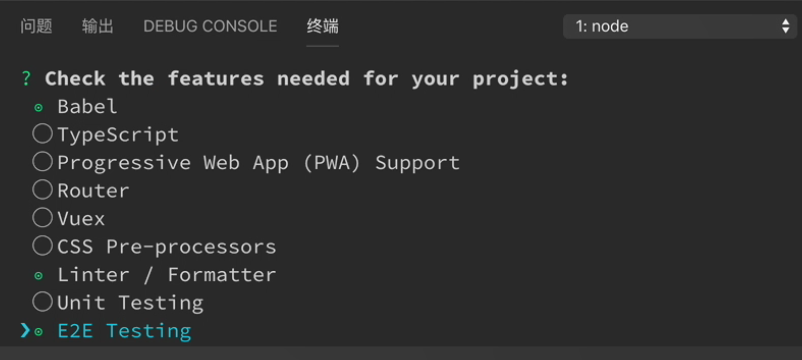

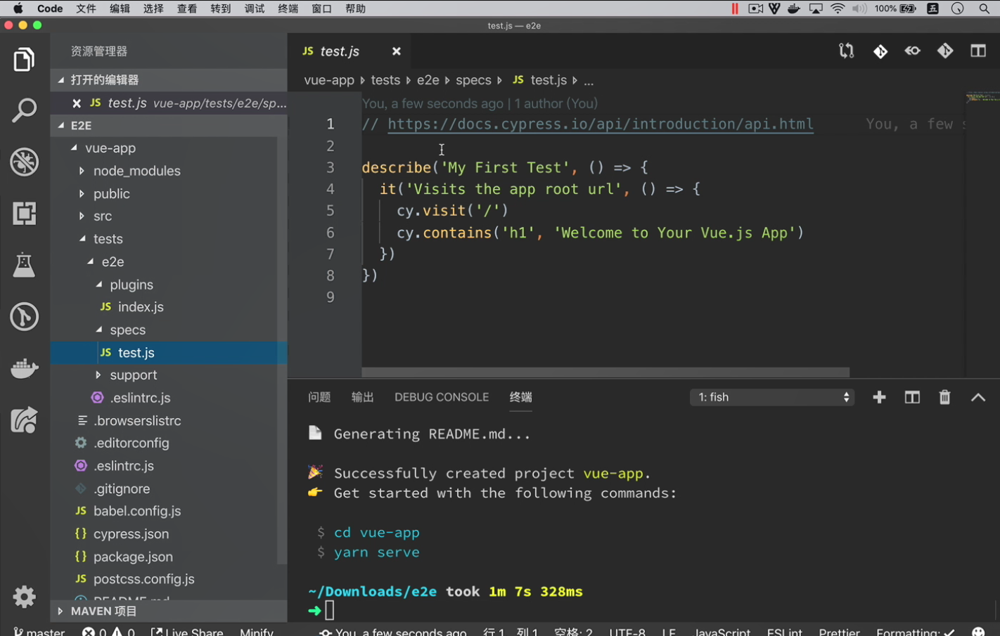

### Codecov

Codecov是单测覆盖率统计平台（开源的测试结果展示平台），可以无缝衔接 travis-ci，是针对单元测试的。但Codecov本身不是一个用来做测试的平台（不同于mocah，Jest，karma等），它只用于（进行测试覆盖率的）展示，所以Codecov需要与提供测试覆盖报告的js库（Istanbul，Mocha+Blanket，Jest等）进行结合使用。

Codecov的作用：与travis-ci（Codecov形成可视化的测试结果）和github进行联接（Codecov提供徽章链接）；自动合并测试结果，分文件夹进行存储管理；并行运行，智能提示。

Travis是一个托管的，分布式持续集成工具，主要用来构建和自动测试项目。当push一段代码到github的时候，Travis则会按照预先配置的测试文件进行自动测试，并返回pass或fail的结果。

①生成一个vue项目，生成时勾选Unit Testing（能够自动形成测试框架，使用的是mocha这个库）

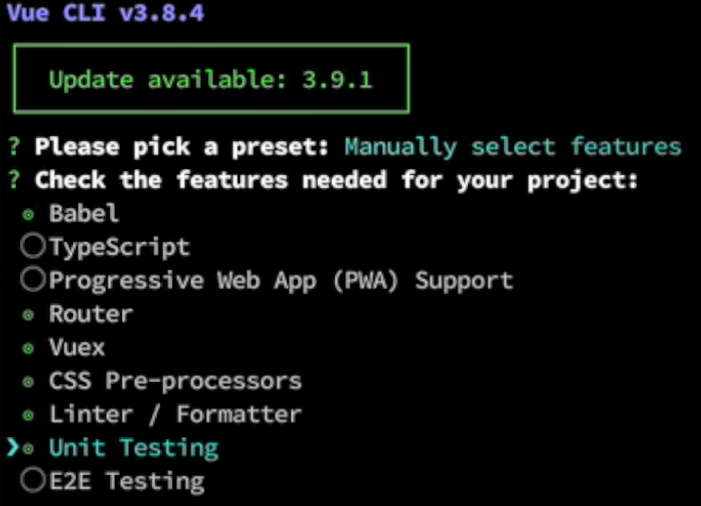

②安装codecov（用于把形成测试率的报告上传到codecov）和安装nyc（npm包）用于形成测试覆盖率（报告）

```bash
yarn add codecov -D 和 yarn add nyc -D
```

③（测试一下）可以查看package.json文件，可以使用npm run来单元测试

```bash
npm run test:unit
```

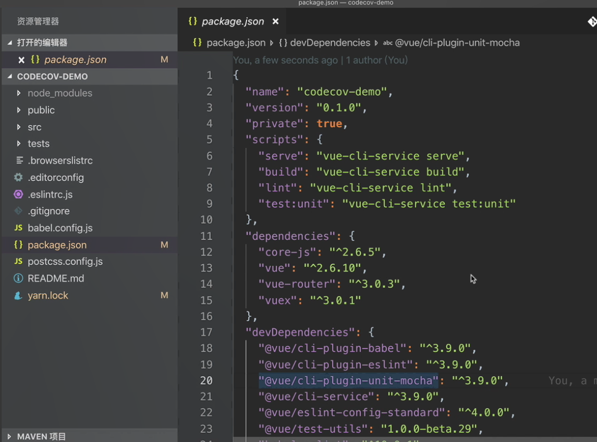

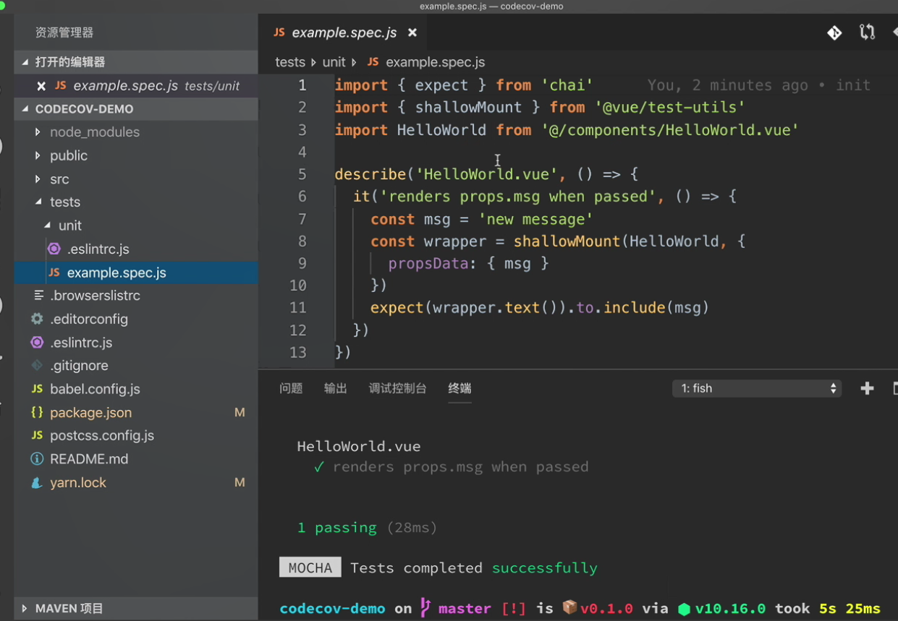

④再修改"scripts"下的"test:uint"为（前面加了一个nyc）：

```json
"test:uint": "nyc vue-cli-service test:unit"
```

（测试一下）可以重新运行`npm run test:unit`，则会在项目目录下多了一个`.nyc_output`文件夹，且在终端会显示含文件及其覆盖率

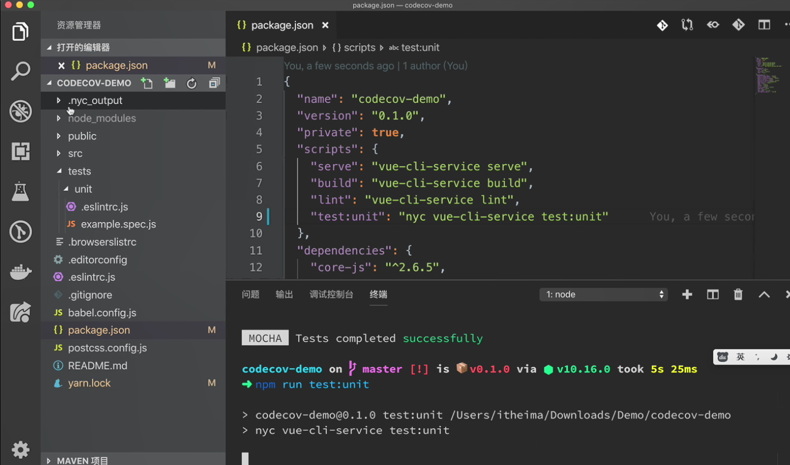

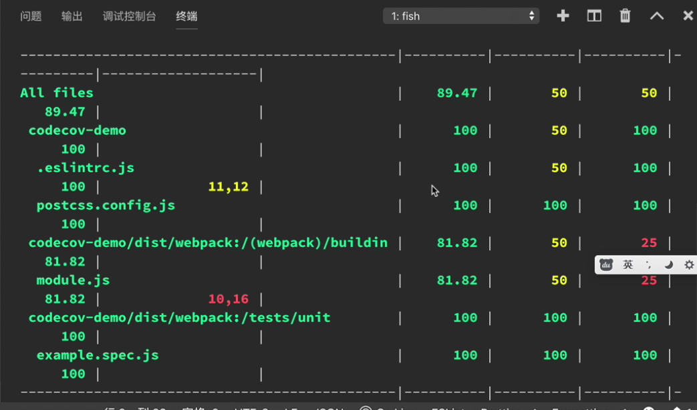

⑤再在"scripts"下增加"coverage"（用于通过Travis CI网站上传到codecov网站）

```
"scripts": {
	"coverage": "nyc report --reporter=text-lcov > coverage.lcov && codecov"
}
```

⑥新建`.travis.yml`配置文件（用于通过Travis CI网站执行里面的命令，即进行打包和测试）

```
language: node_js
node_js:
	- '10'

# Travis-CI Caching
cache:
	directories:
		- node_modules

# S: Build Lifecycle
install:
	- yarn install

script:
	- npm run test:unit

after_success:
	- npm run coverage
```

⑦在github上新建一个仓库xxxx，然后执行git命令推送到远端

```bash
git init
git remote add origin git@github.com:xxx/xxxx.git
git add .
git commit -m "xxxxx"
git push origin master
```

⑧在Travis CI进行github授权并添加仓库，然后在仓库的settings里设置环境变量

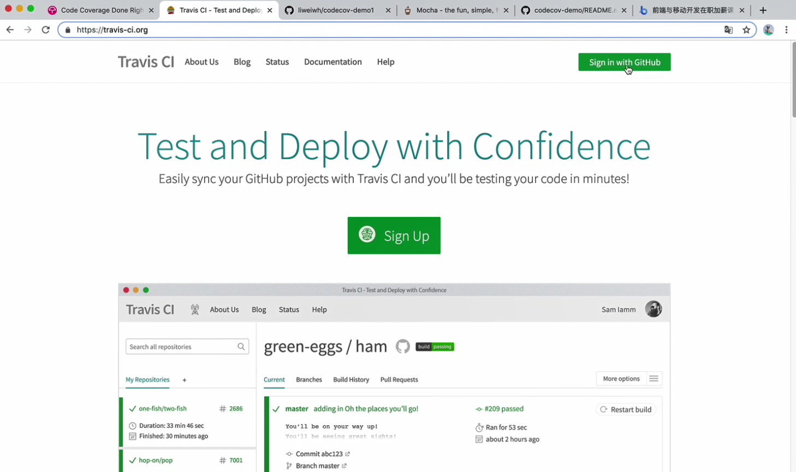

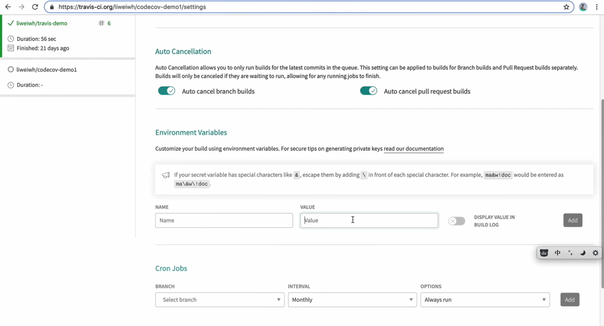

⑨在codecov官网生成CODECOV_TOKEN（Upload Token）添加到环境变量里，然后对测试覆盖率进行上传，上传成功后复制并打开链接，即可在codecov里看到可视化面板（可在settings里拿到徽章链接，该徽章可导航到该面板）


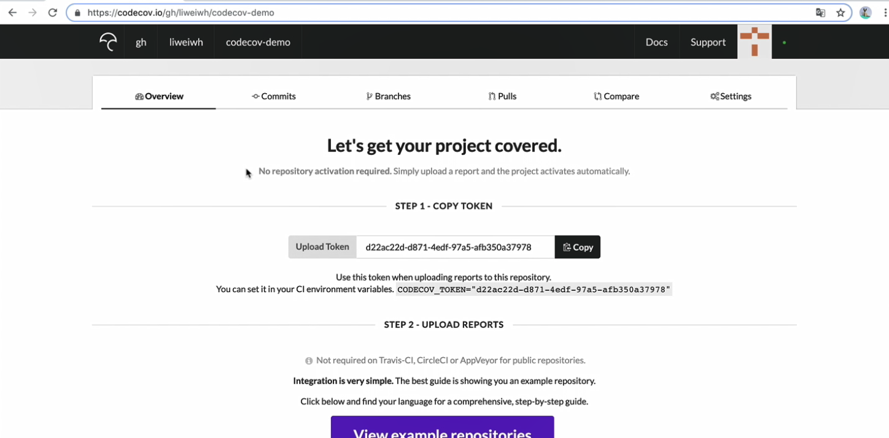

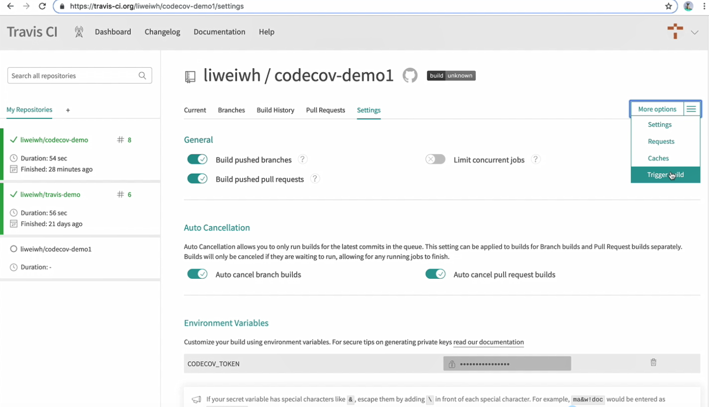

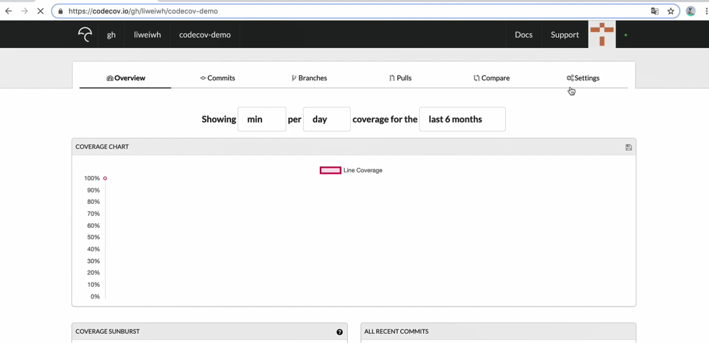


## 补充学习：

### [代码质量管控的四个阶段](https://zhuanlan.zhihu.com/p/29086959)


代码质量管控通常需要经历的四个阶段，称之为“四个现代化”：

①规范化 - 建立代码规范与Code Review制度；②自动化 - 使用工具自动检查代码质量；

③流程化 - 将代码质量检查与代码流动过程绑定；④中心化 - 以团队整体为视角，集中管理代码规范，并实现质量状况透明化；

### 软件测试的分类

**第一部分：软件测试的分类**

①按测试执行阶段划分：单元测试、集成测试、系统测试、验收测试（正式验收测试、Alpha测试、Beta测试）

②按测试技术划分：白盒测试、黑盒测试、灰盒测试

③被测试对象是否运行划分：动态测试、静态测试（文档检查、代码走查、界面检查）

④按不同的测试手段划分：手工测试、自动化测试*

⑤按测试包含的内容划分：功能测试、界面测试、安全测试、兼容性测试、易用性测试、性能测试、压力测试、负载测试、恢复测试

⑥其他测试：冒烟测试、回归测试、探索性测试/自由测试（测试思维）

**第二部分：接下来对软件测试分类进行一个说明**


其它：

①SVN,Git>版本控制管理工具；禅道>Bug管理工具；Fiddler>抓包，定位问题；postman,jmeter,soapui>接口测试；Loadrunner,Jmeter>性能，压力测试

②[What is “Linting”?](https://stackoverflow.com/questions/8503559/what-is-linting)

③React中的配置资料：[Configure ESLint, Prettier, and Flow in VS Code for React Development](https://medium.com/@sgroff04/configure-eslint-prettier-and-flow-in-vs-code-for-react-development-c9d95db07213) ； [React开发团队如何使用ESLint](https://blog.sideci.com/how-the-react-developer-team-uses-eslint-2828564814da)

### 完整的ESLint文件配置属性的解释

```json
/*
 * ESLint的JSON文件是允许JavaScript注释的，但在gist里显示效果不好，所以我把.json文件后缀改为了.js
 */

/*
 * 你可以通过在项目根目录创建一个.eslintignore文件告诉ESLint去忽略特定的文件和目录
 * .eslintignore文件是一个纯文本文件，其中的每一行都是一个glob模式表明哪些路径应该忽略检测
 */

{
  //ESLint默认使用Espree作为其解析器
  //同时babel-eslint也是用得最多的解析器
  "parser": "espree",

  //parser解析代码时的参数
  "parserOption": {
    //指定要使用的ECMAScript版本，默认值5
    "ecmaVersion": 5,
    //设置为script(默认)或module（如果你的代码是ECMAScript模块)
    "sourceType": "script",
    //这是个对象，表示你想使用的额外的语言特性,所有选项默认都是false
    "ecmafeatures": {
      //允许在全局作用域下使用return语句
      "globalReturn": false,
      //启用全局strict模式（严格模式）
      "impliedStrict": false,
      //启用JSX
      "jsx": false,
      //启用对实验性的objectRest/spreadProperties的支持
      "experimentalObjectRestSpread": false
    }
  },

  //指定环境，每个环境都有自己预定义的全局变量，可以同时指定多个环境，不矛盾
  "env": {
    //效果同配置项ecmaVersion一样
    "es6": true,
    "browser": true,
    "node": true,
    "commonjs": false,
    "mocha": true,
    "jquery": true,
     //如果你想使用来自某个插件的环境时，确保在plugins数组里指定插件名
     //格式为：插件名/环境名称（插件名不带前缀）
    "react/node": true
  },

  //指定环境为我们提供了预置的全局变量
  //对于那些我们自定义的全局变量，可以用globals指定
  //设置每个变量等于true允许变量被重写，或false不允许被重写
  "globals": {
    "globalVar1": true,
    "globalVar2": false
  },

  //ESLint支持使用第三方插件
  //在使用插件之前，你必须使用npm安装它
  //全局安装的ESLint只能使用全局安装的插件
  //本地安装的ESLint不仅可以使用本地安装的插件还可以使用全局安装的插件
  //plugin与extend的区别：extend提供的是eslint现有规则的一系列预设
  //而plugin则提供了除预设之外的自定义规则，当你在eslint的规则里找不到合适的的时候
  //就可以借用插件来实现了
  "plugins": [
    "eslint-plugin-airbnb",
    //插件名称可以省略eslint-plugin-前缀
    "react"
  ],

  //具体规则配置
  //off或0--关闭规则
  //warn或1--开启规则，警告级别(不会导致程序退出)
  //error或2--开启规则，错误级别(当被触发的时候，程序会退出)
  "rules": {
    "eqeqeq": "warn",
    //你也可以使用对应的数字定义规则严重程度
    "curly": 2,
    //如果某条规则有额外的选项，你可以使用数组字面量指定它们
    //选项可以是字符串，也可以是对象
    "quotes": ["error", "double"],
    "one-var": ["error", {
      "var": "always",
      "let": "never",
      "const": "never"
    }],
    //配置插件提供的自定义规则的时候，格式为：不带前缀插件名/规则ID
    "react/curly": "error"
  },

  //ESLint支持在配置文件添加共享设置
  //你可以添加settings对象到配置文件，它将提供给每一个将被执行的规则
  //如果你想添加的自定义规则而且使它们可以访问到相同的信息，这将会很有用，并且很容易配置
  "settings": {
    "sharedData": "Hello"
  },

  //Eslint检测配置文件步骤：
  //1.在要检测的文件同一目录里寻找.eslintrc.*和package.json
  //2.紧接着在父级目录里寻找，一直到文件系统的根目录
  //3.如果在前两步发现有root：true的配置，停止在父级目录中寻找.eslintrc
  //4.如果以上步骤都没有找到，则回退到用户主目录~/.eslintrc中自定义的默认配置
  "root": true,

  //extends属性值可以是一个字符串或字符串数组
  //数组中每个配置项继承它前面的配置
  //可选的配置项如下
  //1.字符串eslint：recommended，该配置项启用一系列核心规则，这些规则报告一些常见问题，即在(规则页面)中打勾的规则
  //2.一个可以输出配置对象的可共享配置包，如eslint-config-standard
    //可共享配置包是一个导出配置对象的简单的npm包，包名称以eslint-config-开头，使用前要安装
    //extends属性值可以省略包名的前缀eslint-config-
  //3.一个输出配置规则的插件包，如eslint-plugin-react
    //一些插件也可以输出一个或多个命名的配置
    //extends属性值为，plugin：包名/配置名称
  //4.一个指向配置文件的相对路径或绝对路径
  //5.字符串eslint：all，启用当前安装的ESLint中所有的核心规则
    //该配置不推荐在产品中使用，因为它随着ESLint版本进行更改。使用的话，请自己承担风险
  "extends": [
    "eslint:recommended",
    "standard",
    "plugin:react/recommended",
    "./node_modules/coding-standard/.eslintrc-es6",
    "eslint:all"
  ]
}
```

