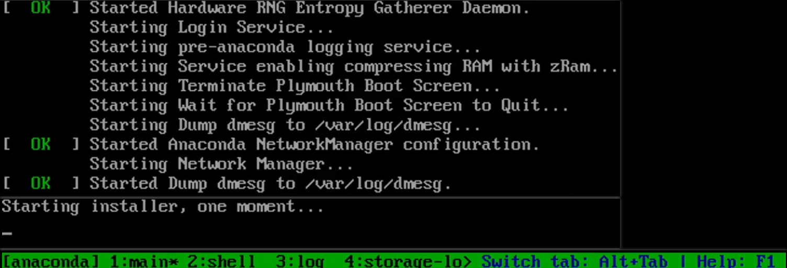
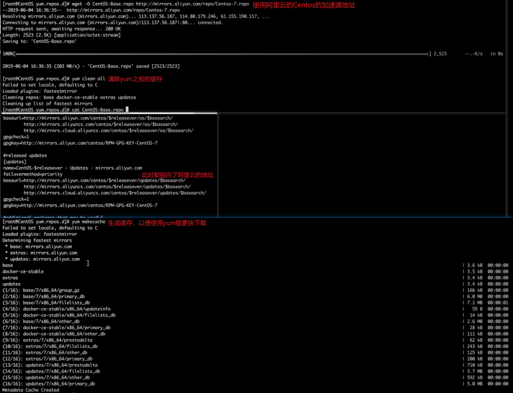
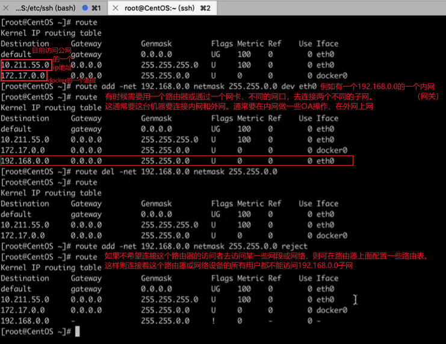
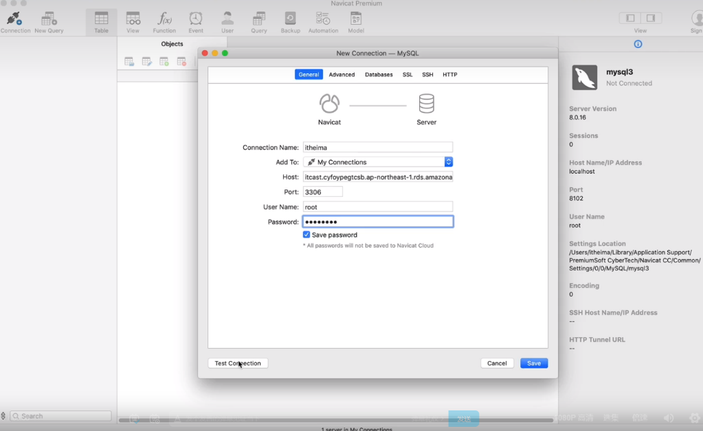

# Linux服务器

## Linux操作系统

**Linux是操作系统：**Linux作为[自由软件](https://zh.wikipedia.org/wiki/自由软件)和[开放源代码软件](https://zh.wikipedia.org/wiki/开放源代码软件)发展中最著名的例子，背靠社区与商业化的使用，使其得到了广泛的应用与发展。

**Linux无处不在**，世界上500个最快的超级计算机90％以上运行Linux发行版或变种，包括最快的前10名超级计算机运行的都是基于Linux内核的操作系统。Linux也广泛应用在嵌入式系统上，如手机（Mobile Phone）、平板电脑（Tablet）、路由器（Router）、电视（TV）和电子游戏机等。在移动设备上广泛使用的Android操作系统就是创建在Linux内核之上。

### 版本


Linux的发行版本可以大体分为两类：一类是商业公司维护的发行版本，如著名的Redhat（RHEL），一类是社区组织维护的发行版本，如Debian。（参考资料：[Linux发行版及年份](https://upload.wikimedia.org/wikipedia/commons/1/1b/Linux_Distribution_Timeline.svg)）

Fedora是基于RHEL、CentOS、Scientific Linux和Oracle Linux的社区版本。Fedora打包了显著的更多的软件包（相比RHEL），其中一个原因是，多样化的社区参与Fedora的建设，它不只是一家公司。而CentOS用于活动、演示和实验，因为它是对最终用户免费提供的，并具有比Fedora的一个更长的发布周期（通常每隔半年左右发布一个新版本）。

Debian是包括Ubuntu在内许多发行版的上游，而Ubuntu又是Linux Mint及其它发行版的上游。Debian在服务器和桌面电脑领域都有着广泛的应用，Debian是一个纯开源计划并着重在一个（稳定性）关键点上，它同时也给用户提供了最大的和完整的软件仓库。

**各个发行版本的特点：**

**①Centos（Redhat）：**

Redhat（Redhat系列），包括RHEL（Redhat Enterprise Linux），也就是Redhat Advance Server（收费版本）、Fedora Core（由原来的Redhat桌面版本发展而来，免费版本）、CentOS（RHEL的社区克隆版本，免费）。CentOS是RHEL发行版对应的开源版本，通常在RedHat的发布后就会很快发行，它既稳定，占用资源少，有一些可配置的预选项，在网络上能方便搜索到安装配置的文档，帮助文档也非常强大，推荐学习使用（本课程后续的操作与演示将会使用Centos 7.6 64-bit版本）。

包管理方式：采用的是基于`rpm`包的`yum`包管理方式。

**②Debian：**

Debian是社区类Linux的典范，是迄今为止最遵循GNU规范的Linux系统，它追求一个极致的系统运行的稳定性，所以没有任何的预装项，资源占用非常小。Debian最早由Ian Murdock于1993年创建，分为三个版本分支（branch）： `stable`、`testing` 和 `unstable`。`unstable`为最新的测试版本，其中包括最新的软件包，但是也有相对较多的bug，适合桌面用户；`testing`的版本都经过`unstable`中的测试，相对较为稳定，也支持了不少新技术（如SMP等）；`stable`一般只用于服务器，上面的软件包大部分都比较过时，但是稳定和安全性都非常的高。

包管理方式：采用的是基于是`apt-get`、`dpkg`包管理方式。

**③Ubuntu：**

Ubuntu严格来说不能算一个独立的发行版本，Ubuntu是基于Debian的`unstable`版本加强而来。Ubuntu就是一个拥有Debian所有的优点，以及自身所加强的优点的近乎完美的Linux桌面系统。根据选择的桌面系统不同，有三个版本可供选择：基于`Gnome`的Ubuntu、基于`KDE`的Kubuntu、基于`Xfc`的 Xubuntu。特点是预装了一些软件，而且提供了图形化的操作，界面非常友好，容易上手，对硬件的支持非常全面，是最适合做桌面系统的Linux发行版本，但占用资源大。

包管理方式：采用的是基于是`apt-get`、`dpkg`包管理方式。

| 分类         | Centos   | Debian   | Ubuntu   |
| :----------- | :------- | -------- | -------- |
| 包管理       | yum      | apt-get  | apt-get  |
| 桌面应用     | 支持     | 需要另装 | 支持     |
| 系统资源占用 | 小       | 非常小   | 大       |
| 资料         | 最多     | 依赖社区 | 多       |
| 更新频次     | 长达10年 | 1-2年    | 3-5年    |
| 软件资源     | 较新     | 最新     | 新       |
| 漏洞更新     | 慢       | 依赖社区 | 依赖社区 |
| 默认安装     | 非常全   | 无       | 非常全   |
| 稳定性       | 较稳定   | 稳定     | 相对稳定 |
| 系统操作要求 | 较高     | 高       | 低       |
| 维护要求     | 低       | 高       | 较高     |
| 易用性       | 一般     | 差       | 较好     |
| 定制化       | 一般     | 高       | 差       |

### 应用场景

| 分类     | Linux（如Centos、Ubuntu）  | Windows（Windows10/8/7） |
| -------- | -------------------------- | ------------------------ |
| 费用     | 免费                       | 付费                     |
| 软件支持 | 社区，免费                 | 官方支持，收费           |
| 安全性   | 很安全                     | 各种漏洞                 |
| 使用习惯 | 命令行与界面操作，需要学习 | 图形界面操作，简单       |
| 可定制性 | 高                         | 低                       |
| 应用范畴 | 服务器                     | 工作、娱乐               |
| 更新     | 依赖社区                   | 官方更新                 |
| 系统内核 | 透明                       | 封闭                     |

Linux的优势：**稳定的系统**、安全性高和漏洞的快速修补、多用户管理和权限配置的划分较细致、用户和用户组的规划、**相对较少的系统资源占用**、可定制裁剪或移植到嵌入式平台（如安卓设备）、可选择的多种图形用户界面（如GNOME、KDE）。

Windows的优势：特定的支持厂商、**足够的游戏娱乐支持度**和足够的专业软件支持度（如vscode、各种语言等）、应用广度更广、受众更广。

#### Linux的GUI界面

参考[Google Trends](https://trends.google.com/trends/explore?date=today%205-y&q=GNOME,KDE,%2Fm%2F0dsbk0n)。几款有代表性的桌面：

①GNOME[[官方地址]](https://www.gnome.org/)（centos6.x上默认是gnome2，7.x默认是gnome3），操作相对方便，下图为GNOME3。


②KDE [[官方地址]](https://kde.org/)，性能相对较好，下图为Plasma 5.12 LTS。


③Unity：**Unity**是[Canonical公司](https://zh.wikipedia.org/wiki/Canonical公司)为[GNOME](https://zh.wikipedia.org/wiki/GNOME)[桌面环境](https://zh.wikipedia.org/wiki/桌面环境)所开发的[图形用户界面](https://zh.wikipedia.org/wiki/图形用户界面)，用于[Ubuntu](https://zh.wikipedia.org/wiki/Ubuntu)[操作系统](https://zh.wikipedia.org/wiki/操作系统)。直到Ubuntu16.04LTS使用的都是Unity，但从Ubuntu 18.04 LTS 开始，默认的 Ubuntu 桌面将重归 GNOME，原因是人事调整与钱的问题（[这里](https://insights.ubuntu.com/2017/04/05/growing-ubuntu-for-cloud-and-iot-rather-than-phone-and-convergence/)）。参考资料：[Ubuntu官方下载地址：获取 Ubuntu](http://www.ubuntu.org.cn/download)、[Ubuntu18.04（Gnome桌面）主题美化](https://blog.csdn.net/zyqblog/article/details/80152016)、[Ubuntu 18.04配置及美化](https://blog.csdn.net/ice__snow/article/details/80152068)、[Ubuntu18.04完美配置优化美化](https://heliu.io/2018/12/22/Ubuntu18.04%E5%AE%8C%E7%BE%8E%E9%85%8D%E7%BD%AE/#%E6%95%88%E6%9E%9C%E9%A2%84%E8%A7%88)。


#### 常见软件应用

数据库：MySQL、Oracle、 MongoDB、Redis。
web服务器：`Nginx`、Apache。
浏览器：Chromium（Chrome）、Firefox。
编辑器：Emacs，`Vim`，Nano，Atom，VScode，IntelliJ IDEA&Webstorm。
文档：WPS Office、LibreOffice、Calligra（Ubuntu/Debian）。
下载工具：`Aria2`、uGet（Ubuntu/Debian）、XDM、qBittorrent。
虚拟化：VirtualBox、VMWare。
系统工具：`git`、rsync、sudo、unzip、tar。
其它：音乐Netease Music、图片GIMP、聊天Wine QQ、播放器VLC。

### Centos安装方法

参考资料：[官方U盘安装说明](https://wiki.centos.org/zh/HowTos/InstallFromUSBkey)、[镜像下载](https://www.centos.org/download/)、[Centos7安装教程](https://linux.cn/article-8048-1.html)、[Ubuntu官方安装教程](https://tutorials.ubuntu.com/tutorial/tutorial-install-ubuntu-desktop#0)。

常见问题：[centos7 U盘安装卡在 starting dracut initqueue hook ](https://blog.jinchuang.org/2062.html)、[U盘安装CentOS7遇到：Warning: dracut-initqueue timeout - starting timeout scripts](https://blog.csdn.net/zgrjkflmkyc/article/details/78293504)。

#### 下载镜像

按需选择下载：DVD（包含了更多的工具集，可以选择性安装）和Minimal（最小化的安装，只包含系统需要运行的基础服务或组件）。

| 类型       | DVD                              | Minimal  |
| ---------- | -------------------------------- | -------- |
| 图形安装   | 支持（可以直接安装一个桌面应用） | 支持     |
| 自带软件包 | 全家桶，可选择                   | 无       |
| 镜像大小   | 4G+                              | 800-900M |


#### 制作U盘启动盘

Windows参考（[Windows中制作USB启动盘](#Windows中制作USB启动盘)）、Mac/Linux参考（[MacOS中制作USB启动盘](#MacOS中制作USB启动盘)）。

**①Windows中制作USB启动盘：**

操作步骤：格式化U盘（FAT32格式）、下载ISO镜像并下载资源文件中的写入程序、写入镜像（Centos官网推荐的软件工具：[USBwriter](https://sourceforge.net/projects/usbwriter/)、[Win32 Disk Imager](https://sourceforge.net/projects/win32diskimager/)。Ubuntu官网推荐：[rufus](https://rufus.ie/)。）


**②MacOS中制作USB启动盘：**

格式化U盘：


使用 `diskutil list` 查看U的设备名，如下图size为123GB且排较后的盘就是U盘（`/dev/disk2`）：

```
$ diskutil list
/dev/disk0 (internal):
   #:                       TYPE NAME                    SIZE       IDENTIFIER
   0:      GUID_partition_scheme                         500.3 GB   disk0
   1:                        EFI EFI                     314.6 MB   disk0s1
   2:                 Apple_APFS Container disk1         500.0 GB   disk0s2

/dev/disk1 (synthesized):
   #:                       TYPE NAME                    SIZE       IDENTIFIER
   0:      APFS Container Scheme -                      +500.0 GB   disk1
                                 Physical Store disk0s2
   1:                APFS Volume APPLE SSD               342.6 GB   disk1s1
   2:                APFS Volume Preboot                 47.6 MB    disk1s2
   3:                APFS Volume Recovery                509.7 MB   disk1s3
   4:                APFS Volume VM                      4.3 GB     disk1s4

/dev/disk2 (external, physical):
   #:                       TYPE NAME                    SIZE       IDENTIFIER
   0:     FDisk_partition_scheme                        *123.0 GB   disk2
   1:               Windows_NTFS LIWEI                   123.0 GB   disk2s1

```

卸载U盘（不是推出或弹出）：

```
$ diskutil umountDisk /dev/disk2
Unmount of all volumes on disk1 was successful
```

镜像DMG写入到U盘（假如U盘是 /dev/disk2，写错了则可能会把其它盘的资料抹除掉，且难以恢复），写入完成后会提示`此电脑不能读取能插入的磁盘`，这里选择直接推出即可：

```
$ sudo dd if=~/Downloads/ubuntu-17.04-desktop-amd64.iso of=/dev/disk2 bs=1m
Password:
2151+1 records in
2151+1 records out
2256076800 bytes transferred in 90.277905 secs (24990354 bytes/sec)
```

#### 调整服务器

在需要安装的服务器上，修改BIOS启动顺序并重启（就会以插入的U盘作为启动盘来启动）

#### 安装的配置


回车之后就开始加载U盘的镜像，建议选择英语安装方式，这样就可以配置很多可选的安装包，后面可以再选择中文的输入法或语言包。注意，如果没有鼠标键，则可以使用tab键等键盘键。




安装Centos需要配置的基本配置项：


开始安装（安装完成之后选择Reboot重启即可）：


设置密码和添加用户（可设置为管理员或非管理员）：


重启后选第一个：


使用注册的root用户和输入密码，即可登录成功：


### Linux目录结构

蓝色代表目录，绿色代表解释说明，红色代表里面的东西（如操作命令）。


| 目录        | 说明                                                   | 备注                         |
| ----------- | ------------------------------------------------------ | ---------------------------- |
| /bin        | 常用二进制命令                                         | ls, cp, rm, mkdir            |
| /usr        | 系统程序目录                                           | 命令、帮助文件、系统配置     |
| /var        | 这个目录中存放着在不断扩充（变化）着的东西             | 日志、缓存、临时文件等       |
| /lib        | 系统最基本的动态连接共享库                             | 类似于Windows中的DLL         |
| /srv        | 存放一些服务启动之后需要提取的数据                     | 通常是空的                   |
| /home       | 用户主目录                                             | 如果是超级管理员则通常是空的 |
| /boot       | Linux内核及系统引导文件目录，包含一些驱动程序          |                              |
| /dev        | 设备文件的目录                                         | 声卡，磁盘，光驱等           |
| /etc        | 二进制软件包配置文件的默认路径                         | 系统信息，网络配置           |
| /lost+found | 系统崩溃时，产生的一些碎片文件                         |                              |
| /mnt        | 临时挂载存储设备                                       | U盘                          |
| /opt        | 软件可选的安装目录                                     | 通常是空的                   |
| /proc       | 操作系统进程信息目录                                   |                              |
| /sbin       | 管理员命令，系统级命令。超级管理员的一个执行文件的目录 | sudo用户                     |
| /tmp        | 临时文件目录                                           | 重启后，被清空               |
| /run        | 临时文件系统，存储系统启动以来的信息                   | 重启后，被清空               |
| /sys        | 系统中的设备组织成层次结构                             | 通过文件查看硬件信息         |

在Linux操作系统里，硬件信息、网络信息、内存信息和资源信息都是以文件的形式存在（查看）；但在Windows操作系统里，如果要查看一个进程，则在工具栏的资源信息所弹出的GUI界面上查看内存和网络等信息。

①查看系统内核的一些基本信息（如版本）：

```bash
# Centos
$ cat /proc/version
Linux version 3.10.0-957.10.1.el7.x86_64 (mockbuild@kbuilder.bsys.centos.org) (gcc version 4.8.5 20150623 (Red Hat 4.8.5-36) (GCC) ) #1 SMP Mon Mar 18 15:06:45 UTC 2019

# Ubuntu
$ cat /proc/version
Linux version 4.15.7-041507-generic (kernel@gloin) (gcc version 7.2.0 (Ubuntu 7.2.0-8ubuntu3.2)) #201802280530 SMP Wed Feb 28 10:31:47 UTC 2018
```

②查看网络信息和设置一个网卡（通常使用`ifconfig`来查看网卡的信息）：

```bash
# Centos DHCP
$ cat /etc/sysconfig/network-scripts/ifcfg-eth0
DEVICE=eth0
BOOTPROTO=dhcp
ONBOOT=yes

# 或指定IP
$ cat /etc/sysconfig/network-scripts/ifcfg-em1
TYPE=Ethernet
PROXY_METHOD=none
BROWSER_ONLY=no
BOOTPROTO=none
DEFROUTE=yes
IPV4_FAILURE_FATAL=no
IPV6INIT=yes
IPV6_AUTOCONF=yes
IPV6_DEFROUTE=yes
IPV6_FAILURE_FATAL=no
IPV6_ADDR_GEN_MODE=stable-privacy
NAME=em1
UUID=fa335568-27db-47fd-a055-424173c42430
DEVICE=em1
ONBOOT=yes
IPADDR=192.168.4.252 # 配置ip地址
PREFIX=24 # 配置子网掩码
GATEWAY=192.168.4.50 # 配置网关
DNS1=192.168.4.50 # 配置DNS
IPV6_PRIVACY=no
ZONE=public
```

```bash
# Ubuntu
$ vi /etc/network/interfaces
# This file describes the network interfaces available on your system
# and how to activate them. For more information, see interfaces(5).

source /etc/network/interfaces.d/*

# The loopback network interface
auto lo
iface lo inet loopback

# The primary network interface。这里的网卡是ens3，配置成static静态的
auto ens3
iface ens3 inet static
        address 192.168.4.60
        netmask 255.255.255.0 # 子网掩码
        network 192.168.4.0 # 网络网关
        broadcast 192.168.4.255 # 广播地址
        gateway 192.168.4.50
        # dns-* options are implemented by the resolvconf package, if installed
        dns-nameservers 192.168.4.50
        dns-search itheima
```

③DNS配置：

```bash
$ cat /etc/resolv.conf
options timeout:2 attempts:3 rotate single-request-reopen
; generated by /usr/sbin/dhclient-script
nameserver 100.100.2.136
nameserver 100.100.2.138
```

④host文件（方便做一些伪代理的请求）：

```bash
$ cat /etc/hosts
127.0.0.1   localhost localhost.localdomain localhost4 localhost4.localdomain4
::1         localhost localhost.localdomain localhost6 localhost6.localdomain6
```

⑤用户/组（信息）：

查看用户：

```bash
$ cat /etc/passwd
root:x:0:0:root:/root:/bin/bash
daemon:x:1:1:daemon:/usr/sbin:/usr/sbin/nologin
bin:x:2:2:bin:/bin:/usr/sbin/nologin
sys:x:3:3:sys:/dev:/usr/sbin/nologin
sync:x:4:65534:sync:/bin:/bin/sync
games:x:5:60:games:/usr/games:/usr/sbin/nologin
man:x:6:12:man:/var/cache/man:/usr/sbin/nologin
lp:x:7:7:lp:/var/spool/lpd:/usr/sbin/nologin
....
```

查看组：

```bash
$ cat /etc/group
root:x:0:
daemon:x:1:
bin:x:2:
sys:x:3:
adm:x:4:syslog,bttech
tty:x:5:
disk:x:6:
lp:x:7:
mail:x:8:
news:x:9:
uucp:x:10:
man:x:12:
proxy:x:13:
....
```

⑥查看CPU/内存：

```bash
# 查看CPU
$ cat /proc/cpuinfo
processor	: 0
vendor_id	: GenuineIntel
cpu family	: 6
model		: 45
model name	: Intel(R) Xeon(R) CPU E5-2670 0 @ 2.60GHz
stepping	: 7
microcode	: 0x714
cpu MHz		: 2117.419
cache size	: 20480 KB
...

# 查看内存（这里是128GB）
$ cat /proc/meminfo
MemTotal:       131812048 kB
MemFree:          460820 kB
MemAvailable:   36657836 kB
Buffers:               0 kB
Cached:         34910784 kB
SwapCached:      1051944 kB
Active:         95183532 kB
Inactive:       32382012 kB
Active(anon):   77764844 kB
Inactive(anon): 15015220 kB
Active(file):   17418688 kB
...
```

⑦其它：/etc/fstab（开机自动挂载列表）、/etc/rc.local（开机自启动文件、自启动命令、脚本）、/etc/init.d（服务启动命令脚本目录）、/etc/profile（全局环境变量）、/usr/local（编译安装软件默认安装目录）、/var/log/message（系统日志）、/var/log/secure（系统安全日志）、/proc/mounts（系统挂载信息）。

### Linux启动过程

①内核的引导：首先是BIOS开机自检，按照BIOS中设置的启动设备（通常是硬盘）来启动，主要是一些驱动和基本的操作指令，用来接管所有的硬件。

②运行init（进程）：就像main函数，有一个起点，初始一个服务进程daemon，就像windows中的服务，（各应用？）按运行级别依次启动。

③系统初始化：用户及软件服务自启动。

④建立终端：Linux的多用户管理，针对用户的登录方式有三种，分别是ssh登录（最常见）、命令行登录、图形界面登录。

⑤用户登录系统。


### 常用命令

#### 文件相关

**①目录相关：**

`ls`：列出目录，加上`-la`参数可以查看隐藏文件和文件的一些基础属性。
`cd`：切换目录（如回到上级目录`cd ..`、回到根目录`cd /`），可以使用绝对路径`/`，也可以使用相对路径`./`。
`pwd`：显示目前所处的目录（顺序层级）。
`mkdir`：创建一个新的目录。
`rmdir`：删除一个空的目录。
`cp`：复制文件或目录，`cp source target`。
`rm`：移除文件或目录，删除目录`rm -r dirpath`，强制删除`rm -rf dirpath€`。
`mv`: 移动文件与目录，或修改文件与目录的名称，`mv source target`。
`cat`：用来查看文件内的内容。
`touch`：用来创建文件。
`echo`：用来往文件里面写入内容。
`more`：可以用来查看显示长文件内容，再使用`ctrl+f`来翻下一页或`ctrl+b`来翻上一页。


**②基本属性：**

（文件所属）权限管理`chmod`：`chmod -R`（递归执行）相当于是把目录下所有的文件都修改对应的权限。文件基本属性分为10个字符 `drwxrwxrwx`，`d`代表着目录，`r`代表着read读权限，`w`代表着write写权限，`x`代表着execute执行权限。对于后9个字母，前面的3个是所有者用户的权限，中间的3个是组用户的权限，后面的3个是其它用户的权限。

修改权限的两种方式： **数字方式**（推荐），`7`-`rwx`、`6`-`-rw-`、`4`-`r--`、`0`-`---`（什么权限都没有），如`chmod 600 ...`（对所属用户有读写权限）、`chmod 755 ...`（对应 -rwxr-xr-x，相当于是取消了组与其它用户的写权限）；**加减方式**，`a`代表all所有、`u`代表user、`g`代表group、`o`代表other、`+`代表增加、`-`代表减少，如`chmod +x`（给所有用户对文件的一个执行权限）、`chmod a+r ...`（增加所有用户的读的权限）、`chmod ug+w ..`（增加所有者用户与组的写的权限）。

（文件所属）用户/组权限管理`chown`：`chown <所属用户>:<所属组> <文件>`（修改文件/文档的所属/所属组），`chown -R <所属用户>:<所属组> <文件>`（目录，`-R` 代表着递归）。


#### 用户管理

添加用户`useradd`。删除用户`userdel`。用户口令修改`passwd`。用户组`groupadd`/`groupdel`/`groupmod`。


#### 网络

配置yum加速：




①远程连接`ssh`：

ssh登录命令的格式：`ssh -p Port <用户名>@<服务器的地址>`，如 `ssh -p 10022 root@192.168.0.1`。window推荐使用[xftp](https://www.netsarang.com/zh/xftp/)终端，mac推荐使用[iterm](https://www.iterm2.com/)。

配置文件的路径是在`/etc/ssh/sshd_config`目录下，如果需要修改port，则要修改`sshd_config`中的`Port`参数，（Centos）还需要使用`semanage port -a -t ssh_port_t -p tcp <Port>`、`service sshd restart`（Centos）/ `service ssh restart` （Debian、Ubuntu）。如果提示没有semanage这个命令，则可用`sudo yum install -y policecoreutils-python`方式来安装，或使用`yum whatprovides semange`来反查。


②查看网卡配置`ifconfig`：

如果没有这个命令，则可用yum安装net-tools。修改网卡的ip地址和子网掩码（`ifconfig eth0 <ip> netmask 255.255.255.0`）。修改网卡状态，对网口进行禁用或启用`ifconfig eth0 down/up`。


③查看网络`netstat`：

`-t`（列出TCP协议端口）、`-u`（列出UDP协议端口）、`-n`（不使用域名与服务名，而使用IP地址和端口号）、`-l`（仅列出在监听状态的网络服务）、`-a`（列出所有的网络连接）、`-p`（列出所对应的进程信息）。`netstat -anpl | grep ssh`（grep表示筛选）。如果一页显示不完，则可使用`netstat | more`进行查看和使用`ctrl+b/f`进行翻上下页。


④路由配置命令`route`：

route（查看路由）；`route add -net 192.168.0.0 netmask 255.255.0.0 dev etho`（add/del添加删除路由）；`route del -net 192.168.0.0 netmask 255.255.0.0`（del删除）；`route add -net 192.168.0.0 netmask 255.255.0.0 reject`（reject，屏蔽）。



⑤IP命令`ip`：

`ip <命令> help`（查看命令的一些参数）；`ip link`（查看有哪些网口或网络设备及其状态）；`ip addr show`（展示具体的网卡或地址信息）；`ip route show`（查看路由信息）；`ip link set eth0 up/down`（设置某网口打开或关闭）。


⑥DNS解析：

`nslookup`，可以查看DNS解析是否正常。Centos中如果没有该命令，可以使用`sudo yum install bind-utils`的方式进行安装。


⑦查看本机IP：

`curl [链接]`。[ip.cn](http://ip.cn/)（推荐）、[ipinfo.io](http://ipinfo.io/)（推荐）、[cip.cc](http://cip.cc/)（推荐）、[ifconfig.me](http://ifconfig.me/)、[myip.ipip.net](http://myip.ipip.net/)。


⑧GUI网络配置操作：

`nmtui`。如果提示`not found`命令，则可使用`yum install -y NetworkManager-tui`进行安装。


#### 性能和硬件状态

①`top`命令：

top命令替代命令：[参考1](https://linux.cn/article-10323-1.html)、[参考2](https://tutorials.ubuntu.com/tutorial/tutorial-install-ubuntu-desktop#0)。输入`m`切换显示内存信息、输入`t`切换显示CPU信息、输入`M`对内存占用倒序排序显示、输入`P`根据CPU的使用百分比进行排序。


②性能测试：

Bench.sh使用方法：`wget -qO- bench.sh | bash`或`curl -Lso- bench.sh | bash`（测试本机内存、CPU、基本配置等并给出报告）。

Github地址：https://github.com/teddysun/across/blob/master/bench.sh

LemonBench使用方法：`curl -fsSL https://ilemonrain.com/download/shell/LemonBench.sh | bash`或`wget -qO- https://ilemonrain.com/download/shell/LemonBench.sh | bash`。


## Nginx服务

nginx是一个HTTP和反向代理服务器（可用于分发给具体服务器承载web上的一些静态资源），也可以作为一个邮件代理服务器和一个通用的TCP / UDP代理服务器，最初由[Igor Sysoev](http://sysoev.ru/en/)编写。据Netcraft称，nginx 在2019年5月服务或代理了 26.43％最繁忙的网站，一些成功案例有[Dropbox](https://blogs.dropbox.com/tech/2017/09/optimizing-web-servers-for-high-throughput-and-low-latency/)、[Netflix](https://openconnect.netflix.com/en/software/)、[Wordpress.com](https://www.nginx.com/case-studies/nginx-wordpress-com/)、[FastMail.FM](http://blog.fastmail.fm/2007/01/04/webimappop-frontend-proxies-changed-to-nginx/)。

Nginx的轻量级、内存占用少、启动极快、高并发能力强的特性，使它在互联网项目中广泛应用，可看出Nginx在网络中的位置与重要性。Service-Oriented Architecture，即是**SOA**面向服务的架构。


### Nginx简介

**正向代理：**例如，由于防火墙的原因，并不能直接访问谷歌，则可以借助VPN来实现。这里**正向代理“代理”的是客户端**，客户端是知道目标服务器的，而目标服务器是不知道客户端是通过VPN访问的。


**反向代理：**例如，当在外网访问百度的时候，其实会进行一个转发，代理到内网去。**反向代理“代理”的是服务器端**，这一个过程对于客户端而言是透明的。


**Nginx的技术架构：**参考资料：[浅谈Nginx服务器的内部核心架构设计](https://juejin.im/post/5b4bdb54e51d45191e0cd774)、[Architecture and scalability](https://nginx.org/en/#architecture_and_scalability)。

特点：

①主进程Master：Master进程的作用是**读取并验证配置文件nginx.conf、管理worker进程**。`Nginx`启动时，会生成两种类型的**进程**：一个**主进程**、**一个**或**多个工作进程**（`windows` 版本的目前只有一个）。**主进程**并不处理网络请求，主要负责**调度工作进程**（即**加载配置**、**启动工作进程**及**非停升级**），所以`Nginx` 启动以后，查看操作系统的进程列表，就能看到**至少有两个**`Nginx`进程。

②工作进程Worker：Worker进程的作用是**每一个Worker进程都维护一个线程（避免线程切换）、处理连接和请求**。服务器实际**处理网络请求**及**响应**的是**工作进程**，在类`unix`系统上，`Nginx`可以配置**多个**`worker`，而每个 `worker` **进程**都可以同时处理数以千计的网络请求。注意，Worker进程的个数由配置文件决定，一般和CPU个数相关（有利于进程切换），配置几个就有几个Worker进程。

③模块化设计：标准HTTP模块、可选的HTTP模块（gzip等）、邮件服务、第三方（Lua），其代码的模块化设计，使得可以根据需要对**功能模块**进行适当的选择和修改，编译成具有**特定功能**的服务器。`Nginx`的`worker`进程，包括**核心**和**功能性模块**，**核心模块**负责维持一个**运行循环**（`run-loop`）、执行网络请求处理的**不同阶段**的模块功能（如网络读写**、**存储读写**、**内容传输**、**外出过滤、将请求发往上游服务器等）。

④事件驱动模型：基于**异步及非阻塞**的**事件驱动模型**，同时也得益于对`Linux`、`Solaris`及类`BSD`等操作系统内核中**事件通知**及`I/O`**性能增强功能**的采用（如`kqueue`、`epoll`及`event ports`），可以说是`Nginx`得以获得**高并发**、**高性能**的关键因素。

⑤代理设计。


**Nginx高可用：**VRRP（Virtual Router Redundancy Protocol），即[虚拟路由冗余协议](https://link.jianshu.com?t=http://en.wikipedia.org/wiki/VRRP)，可以认为它是实现路由器高可用的容错协议，即将多台提供相同功能的路由器组成一个路由器组（Router Group），这个组里面有一个master和多个backup，但在外界看来就像一台一样。（整体？）构成虚拟路由器，拥有一个虚拟IP（vip，既路由器所在局域网内其它机器的默认路由，用于把请求分发到对应的Nginx服务里），占有（真实？）IP的master实际负责ARP相应和转发IP数据包，组中的其它路由器作为备份的角色处于待命状态。master会发组播消息，当backup在超时时间内收不到vrrp包时就认为master宕掉了，这时就需要根据VRRP的优先级来选举一个backup当master（如从Nginx-1切换到Nginx-2），保证路由器的高可用。

Keepalived是一个基于VRRP协议来实现的服务高可用方案，可以利用其来避免IP单点故障（类似的工具还有heartbeat、corosync、pacemaker），但是它一般不会单独出现，而是与其它负载均衡技术（如lvs、haproxy、nginx）一起工作来达到集群的高可用。用`KeepAlived + Nginx`来组成高可用的方案：第一，请求不要直接打到Nginx上（真实IP），应该先通过Keepalived（即虚拟IP，VIP）；第二，Keepalived能监控Nginx的生命状态（提供一个用户自定义的脚本，定期检查Nginx进程状态，进行权重变化,，从而实现Nginx故障切换）。


### Nginx服务安装

#### 在Centos安装

| 分类     | yum方式（在线安装方式，推荐）             | 源码安装                                        |
| -------- | ----------------------------------------- | ----------------------------------------------- |
| 网络     | 需要                                      | 可以不需要，只需要安装相关依赖项                |
| 安装位置 | 安装在/usr/sbin/nginx，配置文件/etc/nginx | 安装在/usr/local/nginx目录                      |
| 管理命令 | 提供                                      | 不提供，需要自行添加管理文件或管理命令          |
| 启动     | 用管理命令`service nginx start`           | 执行绝对路径/usr/local/nginx/sbin/nginx，可加-c |
| 删除     | `yum remove nginx`或`rpm -e nginx`        | 使用`rm -rf /usr/local/nginx`删除目录           |

**①yum方式：**


**②源码安装：**


注意，使用源码安装方式，需要创建管理脚本`vi /etc/init.d/nginx`（用于开机启动？），并输入如下内容：

```bash
#!/bin/sh
#
# nginx - this script starts and stops the nginx daemon
#
# chkconfig:   - 85 15
# description:  NGINX is an HTTP(S) server, HTTP(S) reverse \
#               proxy and IMAP/POP3 proxy server
# processname: nginx
# config:      /usr/local/nginx/conf/nginx.conf
# config:      /etc/sysconfig/nginx
# pidfile:     /usr/local/nginx/logs/nginx.pid
# Source function library.
. /etc/rc.d/init.d/functions
# Source networking configuration.
. /etc/sysconfig/network
# Check that networking is up.
[ "$NETWORKING" = "no" ] && exit 0
nginx="/usr/local/nginx/sbin/nginx"
prog=$(basename $nginx)
NGINX_CONF_FILE="/usr/local/nginx/conf/nginx.conf"
[ -f /etc/sysconfig/nginx ] && . /etc/sysconfig/nginx
lockfile=/var/lock/subsys/nginx
make_dirs() {

   # make required directories
   user=`$nginx -V 2>&1 | grep "configure arguments:" | sed 's/[^*]*--user=\([^ ]*\).*/\1/g' -`
   if [ -z "`grep $user /etc/passwd`" ]; then
       useradd -M -s /bin/nologin $user
   fi
   options=`$nginx -V 2>&1 | grep 'configure arguments:'`
   for opt in $options; do
       if [ `echo $opt | grep '.*-temp-path'` ]; then
           value=`echo $opt | cut -d "=" -f 2`
           if [ ! -d "$value" ]; then
               # echo "creating" $value
               mkdir -p $value && chown -R $user $value
           fi
       fi
   done
}
start() {
    [ -x $nginx ] || exit 5
    [ -f $NGINX_CONF_FILE ] || exit 6
    make_dirs
    echo -n $"Starting $prog: "
    daemon $nginx -c $NGINX_CONF_FILE
    retval=$?
    echo
    [ $retval -eq 0 ] && touch $lockfile
    return $retval
}
stop() {
    echo -n $"Stopping $prog: "
    killproc $prog -QUIT
    retval=$?
    echo
    [ $retval -eq 0 ] && rm -f $lockfile
    return $retval
}
restart() {
    configtest || return $?
    stop
    sleep 1
    start
}
reload() {
    configtest || return $?
    echo -n $"Reloading $prog: "
    killproc $nginx -HUP
    RETVAL=$?
    echo
}
force_reload() {
    restart
}
configtest() {
  $nginx -t -c $NGINX_CONF_FILE
}
rh_status() {
    status $prog
}
rh_status_q() {
    rh_status >/dev/null 2>&1
}
case "$1" in
    start)
        rh_status_q && exit 0
        $1
        ;;
    stop)
        rh_status_q || exit 0
        $1
        ;;
    restart|configtest)
        $1
        ;;
    reload)
        rh_status_q || exit 7
        $1
        ;;
    force-reload)
        force_reload
        ;;
    status)
        rh_status
        ;;
    condrestart|try-restart)
        rh_status_q || exit 0
            ;;
    *)
        echo $"Usage: $0 {start|stop|status|restart|condrestart|try-restart|reload|force-reload|configtest}"
        exit 2
esac
```


#### 在Ubuntu安装

**①在线方式：**（相比于yum，不需要配置源）

```bash
sudo apt-get install nginx
```

**②源码方式：**

```bash
# 安装依赖：
# 安装gcc g++
sudo apt-get install build-essential
sudo apt-get install libtool
# 安装pcre依赖库（http://www.pcre.org/）
sudo apt-get update
sudo apt-get install libpcre3 libpcre3-dev
# 安装zlib依赖库（http://www.zlib.net）
sudo apt-get install zlib1g-dev
# 安装SSL依赖库（16.04默认已经安装了）
sudo apt-get install openssl
```

```bash
# 下载源码启动：
# 下载最新版本：
# http://nginx.org/download/nginx-1.17.0.tar.gz（version可改为其它对应的版本）
wget -O /tmp/nginx.tar.gz http://nginx.org/download/nginx-<version>.tar.gz
# 解压：
cd /tmp/
tar -zxvf nginx.tar.gz
# 进入解压目录：
cd nginx-1.13.6
# 配置：
./configure --prefix=/usr/local/nginx 
# 编译：
make
# 安装：
sudo make install
# 启动：（注意，如果有配置文件，则可以加`-c`指定配置文件的路径`，不加则nginx会自动加载默认路径的配置文件，可以通过-h查看帮助命令）
sudo /usr/local/nginx/sbin/nginx -c /usr/local/nginx/conf/nginx.conf
# 查看进程启动状态
ps -ef | grep nginx
```

### Nginx配置

#### 配置文件

主要目的是发挥反向代理最大的性能（或web服务器的整体性能）等优化作用。配置文件结构：

**①全局块**：配置影响nginx全局的指令，一般有运行nginx服务器的用户组、nginx进程pid存放路径、日志存放路径、配置文件引入、允许生成的`worker process`数等。

**②events块**：配置影响nginx服务器或与用户的网络连接，有每个进程的最大连接数、选取哪种事件驱动模型处理连接请求、是否允许同时接受多个网路连接、开启多个网络连接序列化等。

**③http块**：可以嵌套多个server，用于配置代理、缓存、日志定义等绝大多数功能，以及第三方模块的配置，如文件引入、mime-type定义、日志自定义、是否使用sendfile传输文件、连接超时时间、单连接请求数等。

**④server块**：配置虚拟主机的相关参数，一个http中可以有多个server，即在同一个端口（http？）上可配置多个虚拟主机（domain1、domain2等域名）?。

**⑤location块**：配置请求的路由，以及各种页面的处理情况。

```bash
... #全局块
events {  #events块
   ...
}
http #http块
{
    ... #http全局块--start
    server #server块
    { 
        ... #server全局块
        location [PATTERN] #location块
        {
            ...
        }
        location [PATTERN] 
        {
            ...
        }
    }
    server
    {
      ...
    }
    ... #http全局块--end
}
```

配置优化后的配置文件：

```bash
user www-data;
pid /run/nginx.pid;

# worker_processes用来设置Nginx服务的进程数（相当于worker进程的数量）。推荐是CPU内核数或者内核数的倍数，推荐使用CPU内核数
worker_processes 4;
# 默认情况下，Nginx的多个进程有可能跑在某一个CPU或CPU的某一核上，导致Nginx进程使用硬件的资源不均。
# worker_cpu_affinity用于指定某进程跑在某一个CPU上，1代表跑在，0代表不跑在，这里给单独的每一个进程指定一个CPU进行运行。
worker_cpu_affinity 0001 0010 0100 1000;
worker_rlimit_nofile 65535;

events {
		# 设置事件驱动模型，是内核2.6以上支持
        use epoll;
        # linux系统中有个指令`open file resource limit`，它设置了进程可以打开的文件句柄数量，可以用指令`cat /proc/sys/fs/file-max`查看该指令的值，也可以将该指令设置为23900251。
        # 设置一个进程理论允许的最大连接数，理论上越大越好，但不可以超过worker_rlimit_nofile的值。
        worker_connections 65535;
        accept_mutex off;
        multi_accept off;
}

http {
        ##
        # Basic Settings
        ##
        sendfile on;
        tcp_nopush on;
        tcp_nodelay on;
        keepalive_timeout 60 50;
        send_timeout 10s;
        types_hash_max_size 2048;
        client_header_buffer_size 4k;
        client_max_body_size 8m;
        include /etc/nginx/mime.types;
        default_type application/octet-stream;

        ##（日志）
        # Logging Settings
        ##
        access_log /var/log/nginx/access.log;
        error_log /var/log/nginx/error.log;

        ##
        # Gzip Settings
        ##（对网络资源进行压缩）
        gzip on;
        gzip_disable "msie6";
        gzip_min_length 1024; # 进行压缩所要求的最小文件大小
        gzip_vary on;
        gzip_comp_level 2;
        gzip_buffers 32 4k; # gzip的缓存区间
        gzip_types text/plain text/css application/json application/x-javascript text/xml application/xml application/xml+rss text/javascript; # 需要压缩的文件类型

        ##（虚拟主机）
        # Virtual Host Configs
        ##（引用nginx的配置文件）
        include /etc/nginx/conf.d/*.conf;
        include /etc/nginx/sites-enabled/*;
}
```

其它优化：

```bash
net.ipv4.ip_forward = 0
net.ipv4.conf.default.rp_filter = 1
net.ipv4.conf.default.accept_source_route = 0
kernel.sysrq = 0
kernel.core_uses_pid = 1

# 开启SYN Cookies，当出现SYN等待队列溢出时，启用cookies来处理。
net.ipv4.tcp_syncookies = 1
kernel.msgmnb = 65536
kernel.msgmax = 65536
kernel.shmmax = 68719476736
kernel.shmall = 4294967296

# timewait的数量，默认是180000
net.ipv4.tcp_max_tw_buckets = 6000
net.ipv4.tcp_sack = 1
net.ipv4.tcp_window_scaling = 1
net.ipv4.tcp_rmem = 4096        87380   4194304
net.ipv4.tcp_wmem = 4096        16384   4194304
net.core.wmem_default = 8388608
net.core.rmem_default = 8388608
net.core.rmem_max = 16777216
net.core.wmem_max = 16777216

# # 每个网络接口接收数据包的速率比内核处理这些包的速率快时，允许送到队列的数据包的最大数目。
net.core.netdev_max_backlog = 262144

# web应用中listen函数的backlog默认会给我们内核参数的net.core.somaxconn限制到128，而nginx定义 的NGX_LISTEN_BACKLOG默认为511，所以有必要调整这个值
net.core.somaxconn = 262144

# 系统中最多有多少个TCP套接字不被关联到任何一个用户文件句柄上。如果超过这个数字，孤儿连接将即刻被复位并打印出警告信息。这个限制仅仅 是为了防止简单的DoS攻击，不能过分依靠它或者人为地减小这个值，更应该增加这个值(如果增加了内存之后)。
net.ipv4.tcp_max_orphans = 3276800

# 记录的那些尚未收到客户端确认信息的连接请求的最大值。对于有128M内存的系统而言，缺省值是1024，小内存的系统则是128。
net.ipv4.tcp_max_syn_backlog = 262144

# 时间戳可以避免序列号的卷绕。一个1Gbps的链路肯定会遇到以前用过的序列号。时间戳能够让内核接受这种“异常”的数据包。这里需要将其关掉。
net.ipv4.tcp_timestamps = 0

# 为了打开对端的连接，内核需要发送一个SYN并附带一个回应前面一个SYN的ACK。也就是所谓三次握手中的第二次握手。这个设置决定了内核放弃连接之前发送SYN+ACK包的数量。
net.ipv4.tcp_synack_retries = 1

# 在内核放弃建立连接之前发送SYN包的数量。
net.ipv4.tcp_syn_retries = 1

# 启用timewait快速回收
net.ipv4.tcp_tw_recycle = 1

# 开启重用。允许将TIME-WAIT sockets重新用于新的TCP连接。
net.ipv4.tcp_tw_reuse = 1
net.ipv4.tcp_mem = 94500000 915000000 927000000

# 如果套接字由本端要求关闭，这个参数决定了它保持在FIN-WAIT-2状态的时间。对端可以出错并永远不关闭连接，甚至意外当机。缺省值是60秒。 2.2 内核的通常值是180秒，你可以按这个设置，但要记住的是，即使你的机器是一个轻载的WEB服务器，也有因为大量的死套接字而内存溢出的风险，FIN- WAIT-2的危险性比FIN-WAIT-1要小，因为它最多只能吃掉1.5K内存，但是它们的生存期长些。
net.ipv4.tcp_fin_timeout = 1

# 当keepalive起用的时候，TCP发送keepalive消息的频度。缺省是2小时
net.ipv4.tcp_keepalive_time = 30

# 允许系统打开的端口范围
net.ipv4.ip_local_port_range = 1024   65000
```

#### 压力测试

要测试 nginx 的负载能力，这里使用 Apache 服务器自带的一个 web 压力测试工具 ApacheBench（简称ab）。ab是一个命令行工具，即通过 `ab` 命令行，可模拟多个请求同时对某一 URL 地址进行访问（模拟的网络测试），因此可以用来测试目标服务器的负载压力。


## HTTP/HTTPS协议

**超文本传输协议**（**H**yper**T**ext **T**ransfer **P**rotocol，缩写**HTTP**）是一种用于分布式、协作式和超媒体信息系统的应用层协议，HTTP是万维网的数据通信的基础。请求信息包括请求行、请求头、空行和其它消息体。

HTTP的特点：

①一定有客户端和服务端。

②简单：客户向服务器请求服务时，只需传送请求方法和路径（和传递的数据类型？）。请求方法常用的有GET、HEAD、POST，每种方法规定了客户与服务器联系的类型不同。由于HTTP协议简单，使得HTTP服务器的程序规模小，因而通信速度很快。

③灵活：HTTP允许传输任意类型的数据对象。正在传输的类型由Content-Type（HTTP包中用来表示内容类型的标识）加以标记。

④建立连接：含义是限制每次连接只处理一个请求（http1.0？）。服务器处理完客户的请求，并收到客户的应答后，即断开连接，采用这种方式可以节省传输时间。

⑤无状态有会话：HTTP协议是无状态协议（HTTP本质是无状态的），无状态是指协议对于事务处理没有记忆能力（但使用Cookies或本地存储等可以创建有状态的会话）。缺少状态意味着如果后续处理需要前面的信息，则它必须重传，这样可能导致每次连接传送的数据量增大（但在服务器不需要先前信息时它的应答就较快）。

HTTP的不足之处：通信内容使用明文，内容可能被窃听；不验证通信方的身份，可能遭遇伪装；无法验证报文的完整性，报文有可能已遭篡改。


**超文本传输安全协议**（英语：**H**yper**T**ext **T**ransfer **P**rotocol **S**ecure，缩写**HTTPS**，常称为HTTP over TLS、HTTP over SSL或HTTP Secure）是一种通过计算机网络进行安全通信的传输协议。HTTPS经由HTTP进行通信，但利用SSL/TLS来加密数据包，主要作用是在不安全的网络上创建一个安全信道。HTTPS开发的主要目的，是提供对网站服务器的身份认证，保护交换数据的隐私与完整性。这个协议由网景公司（Netscape）在1994年首次提出，随后扩展到互联网上。

### HTTPS认证原理

认证方式：数字证书。认证机构：数字证书认证机构（Certificate Authority CA，CA证书，最通用）、EV SSL证书（Extended Validation SSL Certificate，EV证书，公信力相比于CA证书低一点）、OpenSSL自认证（不被公认，除非在公司内使用）。

证书信任方式：操作系统和浏览器内置、证书颁发机构或手动指定证书。

SSL握手过程：注意，公钥是数字证书，上面有服务器本身签名和公共签名（如找第三方的认证机构作为见证者）这两个签名。


### 配置HTTPS

[Let's Encrypt](https://letsencrypt.org/)组织：


用acme（脚本）来自动化申请：https://github.com/Neilpang/acme.sh。前置条件：需要域名（使用国内的虚拟主机做网站时，需要做域名备案），配置DNS解析，支持列表见https://github.com/Neilpang/acme.sh/wiki/dnsapi；有公网IP的服务器（可选）；安装nginx和acme.sh。

配置过程：

①安装nginx与acme.sh（安装命令`curl  https://get.acme.sh | sh`，再使用`source`命令使安装生效`source ~/.bashrc`）。

普通用户和 root 用户都可以安装使用，在安装过程中，会把acme.sh安装到**home**目录下（`~/.acme.sh/`），并创建一个bash的alias，方便使用`alias acme.sh=~/.acme.sh/acme.sh`，并自动创建cronjob（每天 0:00 点自动检测所有的证书，如果快过期了需要更新，则会自动更新证书）。

②配置证书（激活SSL证书）。有两种方式：

- **http 方式：**需要在网站根目录下放置一个文件，来验证域名所有权，完成验证就可以生成证书了（`acme.sh  --issue  -d mydomain.com -d www.mydomain.com  --webroot  /home/wwwroot/mydomain.com/`，只需要指定域名，并指定域名所在的网站根目录，**acme.sh**会全自动的生成验证文件，并放到网站的根目录，然后自动完成验证，最后删除验证文件，整个过程没有任何副作用）。

  如果用的**apache**服务器，**acme.sh** 还可以智能地从**apache**的配置中自动完成验证，不需要指定网站根目录（`acme.sh --issue  -d mydomain.com   --apache`）。

  如果用的**nginx**服务器或反代，**acme.sh** 还可以智能地从**nginx**的配置中自动完成验证，不需要指定网站根目录（`acme.sh --issue  -d mydomain.com   --nginx`）。

- **dns 方式**（推荐）：在域名上添加一条 txt 解析记录，验证域名所有权。这种方式的好处是，不需要任何服务器，不需要任何公网ip，只需要 dns 的解析记录即可完成验证。坏处是如果不同时配置Automatic DNS API，使用这种方式 acme.sh 将无法自动更新证书，每次都需要手动再次重新解析验证域名所有权。

  使用`acme.sh  --issue  --dns   -d mydomain.com`，**acme.sh**会生成相应的解析记录显示出来，只需要在域名管理面板中添加这条 txt 记录即可。等待解析完成之后, 重新生成证书（`acme.sh  --renew   -d mydomain.com`）。

  dns方式的真正强大之处在于可以使用域名解析商提供的 api 自动添加 txt 记录完成验证，**acme.sh**目前支持cloudflare、dnspod、cloudxns、godaddy、ovh等数十种解析商的自动集成。以dnspod为例，需要先登录到dnspod账号，生成 api id 和 api key，都是免费的，然后`export DP_Id="1234"`、`export DP_Key="sADDsdasdgdsf"`、`acme.sh   --issue   --dns dns_dp   -d aa.com  -d www.aa.com`，证书就自动生成了，这里给出的 api id 和 api key 会被自动记录下来，后面在使用 dnspod api 的时候就不需要再次指定，直接生成即可（`acme.sh  --issue   -d  mydomain2.com   --dns  dns_dp`）。

③配置nginx配置，设置定时任务。

生成dhparam.pem文件，用于协助网站的评级（能有一个比较高的安全等级）：`openssl dhparam -out dhparam.pem 2048`。

在nginx中正确的使用方法是使用 `--installcert` 命令，并指定目标位置（指定的ssl目录），然后证书文件会被copy到相应的位置，主要作用是让该脚本定时更新（检测），以便在升级脚本时证书不会被丢失，如：

```bash
acme.sh  --installcert  -d  <domain>.com   \
        --key-file   /etc/nginx/ssl/<domain>.key \
        --fullchain-file /etc/nginx/ssl/fullchain.cer \
        --reloadcmd  "service nginx force-reload"
```

而nginx的配置文件：

```bash
# server部分
    ssl_protocols TLSv1 TLSv1.1 TLSv1.2;
    ssl_prefer_server_ciphers on;
    ssl on;
    ssl_certificate         /etc/nginx/ssl/fullchain.cer;
    ssl_certificate_key     /etc/nginx/ssl/<domain>.key;
    # ssl_dhparam
    ssl_dhparam             /etc/nginx/ssl/dhparam.pem;
```

④对网站的SSL进行检验（对域名的加密等级做验证，最好的等级是A级。推荐https://ssllabs.com/ssltest/analyze.html）。如果开启了防火墙，需要把80和43添加到例外规则里，让这两个端口放行，以便访问nginx服务。


## 云服务器

### 虚拟化技术

像阿里云、腾讯云、百度云、华为云等云服务商提供的大量的云平台，不可能是一台一台机器进行组装的（否则效率低下），而是会买一台配置非常高的主机（服务器，可能60+核和200+GB内存），在上面安装一个虚拟化的平台，使用虚拟化技术让平台（主机）可以虚拟化多个云服务器出来。

**虚拟化**：在计算机技术中，虚拟化（技术）或虚拟技术（Virtualization）是一种资源管理技术，是将计算机的各种实体资源（CPU、内存、磁盘空间、网络适配器等），予以抽象、转换后呈现出来并可供分区、组合为一个或多个电脑配置环境。目标是把物理主机上的资源进行切分，分到单独的虚拟主机去。主要的目的是降低成本，提高应用兼容性，提高服务可用性，提升资源复用率。分类主要有全虚拟化（虚拟主机就像是一台真实的主机）和半虚拟化（虚拟化软件或虚拟层协助处理了一些内核指令，会修改操作系统内核，优化和配置的空间范围更小），典型的全虚拟化软件有VMWare、Hyper-V、KVM-x86（复杂指令集），典型的半虚拟化软件有Xen、KVM-PowerPC（简易指令集）。参考资料：[虚拟化的发展历程和实现原理——图文详解](https://yq.aliyun.com/articles/48867)，[虚拟化类型](http://virtual.51cto.com/art/201803/569228.htm)。


### 选择云服务器

如阿里云ECS：


**①从费用**。

**②从硬件**：使用阿里云的工具进行筛选（[ECS 实例规格可购买地域总览](https://ecs-buy.aliyun.com/instanceTypes)）


**③从网络**：云服务器 ECS 的入网带宽和出网带宽皆以服务器角度出发。推荐公司使用固定带宽，而对于测试用户或流量比较小的用户则使用按量计费带宽，如公司网站是展示类型则选按量计费、是视频类型则选固定带宽。后期还可以购买CDN加速，分担静态资源的流量。

| 带宽类别 （Mbit/s） | 描述                                                         |
| :------------------ | :----------------------------------------------------------- |
| 入网带宽            | 流入云服务器 ECS 的带宽 从云服务器 ECS 内部下载外部网络资源，或者从客户端 FTP 等方式上传资源到云服务器 ECS 都是入网带宽。 |
| 出网带宽            | 流出云服务器 ECS 的带宽 从云服务器 ECS 对外提供访问，或者从客户端 FTP 等方式下载云服务器 ECS 内部资源都是出网带宽，云服务器 ECS 出网带宽就是购买的带宽值。 |


**④从地域**：

中国大陆：一般情况下建议选择和目标用户所在地域最为接近的数据中心，可以进一步提升用户访问速度。不过，在基础设施、BGP 网络品质、服务质量、云服务器操作使用与配置等方面，阿里云中国大陆地域没有太大区别，BGP 网络可以保证中国大陆全部地域的快速访问。

其它国家及地区：提供国际带宽，主要面向非中国大陆地区用户，如果在中国大陆，使用这些地域会有较长的访问延迟，不建议使用。对香港、东南亚有需求的用户，可以选择香港地域、亚太东南 1 地域、亚太东南 3 地域或亚太东南 5 地域；对日、韩有需求的用户，可以选择亚太东北 1 地域；对印度有需求的用户，可以选择亚太南部 1 地域；对澳大利亚地区有需求的用户，可以选择亚太东南 2 地域；对美洲有需求用户，可以选择美国地域；对欧洲大陆有需求的用户，可以选择欧洲中部 1 地域；对中东地区有需求的用户，可以选择中东东部 1 地域。

每个地域完全独立，每个可用区完全隔离，但同一个地域内的可用区之间使用低时延链路相连，关系：


**⑤其它步骤**：


### 云数据库RDS

#### 介绍

亚马逊系产品：Amazon Relational Database Service（Amazon RDS）能够在云中轻松设置、操作和扩展关系数据库。它在自动执行耗时的管理任务（如**硬件预置、数据库设置、修补和备份**）的同时，可提供经济实用的可调容量，这能腾出时间专注于应用程序，为它们提供所需的快速性能、高可用性、安全性和兼容性。Amazon RDS 在多种类型的数据库实例（针对内存、性能或 I/O 进行了优化的实例）上均可用，并提供六种常用的数据库引擎供选择（包括 Amazon Aurora、PostgreSQL、MySQL、MariaDB、Oracle Database 和 SQL Server），可以使用 AWS Database Migration Service **轻松**将现有的**数据库迁移或复制到 Amazon RDS**。

阿里云系产品：云数据库RDS（ApsaraDB for RDS，简称RDS）是一种稳定可靠、可弹性伸缩的在线数据库服务，基于飞天分布式系统和全SSD盘高性能存储，支持MySQL、SQL Server、PostgreSQL和PPAS（高度兼容Oracle）引擎，默认部署主备架构且提供了容灾、备份、恢复、监控、迁移等方面的全套解决方案，方便进行数据库的运维。

特点：①轻松管理（GUI页面，从部署到生产数据库）；②可扩展（修改CPU/内存/存储资源）；③高可用（自动备份、快照 、自动主机更换）；④速度快（可选SSD）；⑤安全（可建立专网，或连接到使用VPN）；⑥经济（网络成本、运维成本低）。

#### 常见RDS-MySQL

①亚马逊：https://aws.amazon.com/cn/rds/




②阿里云：https://cn.aliyun.com/product/rds


### 负载均衡SLB

#### 介绍

负载均衡（Server Load Balancer）是对多台云服务器进行流量**分发**的负载均衡服务。负载均衡可以通过流量分发扩展应用系统对外的服务能力，通过消除单点故障提升应用系统的可用性。负载均衡通过设置虚拟服务地址，将添加的ECS实例虚拟成一个高性能、高可用的应用服务池，并根据转发规则，将来自客户端的请求分发给云服务器池中的ECS实例。

负载均衡默认检查云服务器池中的ECS实例的健康状态，自动隔离异常状态的ECS实例，消除了单台ECS实例的单点故障，提高了应用的整体服务能力，而且负载均衡还具备抗DDoS攻击的能力，增强了应用服务的防护能力。

基本功能：

①调度：**负载均衡支持轮询、加权轮询（WRR）、加权最小连接数（WLC）和一致性哈希（CH）调度算法。**

②健康检查 ：负载均衡会检查后端服务器的运行状况，当探测到后端服务器运行状况不佳时，会停止向其发送流量，然后将流量转发给其它正常运行的后端服务器。

③会话保持：负载均衡提供会话保持功能，在会话的生命周期内，可以将同一客户端的请求转发到同一台后端服务器上。

④安全防护：结合云盾，可提供5Gbps的防DDoS攻击能力。

⑤高可用：负载均衡可以将流量转发给多个可用区的后端服务器，且负载均衡已经在大部分地域支持了多可用区部署，当主可用区出现故障时，负载均衡可自动切换到备可用区上提供服务。


⑥访问控制、监控、证书管理、重定向、WS/WSS支持、HTTP/2支持（HTTP/2，即`Hypertext Transfer Protocol Version 2`是超文本传输协议的第二版，向下兼容HTTP1.X协议版本，同时带来性能的大幅提升）。

**SLB技术架构：**多个Listener监听多个服务，当一个Listener挂掉时，就会进行切换。


#### 阿里云SLB


## 扩展知识

### 域名解析（DNS解析）

**A记录**：将域名指向一个IPv4地址（如100.100.100.100），需要增加A记录。

**AAAA记录**：将主机名（或域名）指向一个IPv6地址（如ff03:0:0:0:0:0:0:c1），需要添加AAAA记录。

**CNAME记录**：如果将域名指向一个域名，实现与被指向域名相同的访问效果，需要增加CNAME记录，这个域名一般是主机服务商提供的一个域名。

**MX记录**：建立电子邮箱服务，将指向邮件服务器地址，需要设置MX记录。建立邮箱时，一般会根据邮箱服务商提供的MX记录填写此记录。

**NS记录**：域名解析服务器记录，如果要将子域名指定某个域名服务器来解析，需要设置NS记录。

**TXT记录**：可任意填写，可为空，一般做一些验证记录时会使用此项，如做SPF（反垃圾邮件）记录。

**SRV记录**：添加服务记录服务器的服务记录时会添加此项，SRV记录了哪台计算机提供了哪个服务，格式为`服务的名字.协议的类型`（如_example-server._tcp）。

**SOA记录**：SOA叫做起始授权机构记录，NS用于标识多台域名解析服务器，SOA记录用于在众多NS记录中那一台是主服务器。

**PTR记录**：PTR记录是A记录的逆向记录，又称做IP反查记录或指针记录，负责将IP反向解析为域名。

**TTL值**：`TTL`，即生存时间（Time To Live），表示解析记录在DNS服务器中的缓存时间，`TTL`的时间长度单位是秒，一般为3600秒。如在访问`www.itcast.cn`时，如果在DNS服务器的缓存中没有该记录，就会向某个NS服务器发出请求，获得该记录后，该记录会在DNS服务器上保存`TTL`的时间长度，在`TTL`有效期内访问`www.itcast.cn`，DNS服务器会直接缓存中返回刚才的记录。

**shell脚本入门**：https://www.runoob.com/w3cnote/shell-quick-start.html。

**vim编辑器入门**：https://zhuanlan.zhihu.com/p/34733089。

#### A记录与AAAA记录

二者都是指向一个IP地址，但对应的IP版本不同。`A记录`指向`IPv4`地址，`AAAA记录`指向`IPv6`地址。`AAAA记录`是`A记录`的升级版本。

`IPv4`是互联网协议（Internet Protocol，IP）的第四版，也是第一个被广泛使用的版本，是构成现今互联网技术的基础协议。`IPv4` 的下一个版本就是`IPv6`，在将来将取代目前被广泛使用的`IPv4`。`IPv4`中规定IP地址长度为32位（按TCP/IP参考模型划分) ，即有2^32-1个地址，而`IPv6`的提出最早是为了解决随着互联网的迅速发展导致的`IPv4`地址空间将被耗尽的问题，为了扩大地址空间，`IPv6`将IP地址的长度由32位增加到了128位。在`IPv6`的设计过程中除了一劳永逸地解决了地址短缺问题以外，还解决了`IPv4`中的其它问题，如端到端IP连接、服务质量（QoS）、安全性、多播、移动性、即插即用等。

#### A记录与CNAME记录

`A记录`是把一个域名解析到一个IP地址，而`CNAME记录`是把域名解析到另外一个域名，而这个域名最终会指向一个A记录，在功能实现在上`A记录`与`CNAME记录`没有区别。但`CNAME记录`在做IP地址变更时要比`A记录`方便。`CNAME记录`允许将多个名字映射到同一台计算机，当有多个域名需要指向同一服务器IP，此时可以将一个域名做A记录指向服务器IP，然后将其它的域名做别名（即CNAME）到A记录的域名上。当服务器IP地址变更时，只需要更改A记录的那个域名到新IP上，其它做别名的域名会自动更改到新的IP地址上，而不必对每个域名做更改。


