# 容器化运维操作

## 容器和Docker

### 容器化

在日趋复杂的运维开发环境下，对虚拟服务器及应用服务的要求更加的多元化。而且在复杂的软硬件环境下，需要配置的选项太多。而容器化运维（容器化应用）则非常方便，它提供了更加容易扩展、性能优越、方便监控的管理服务。

**容器化**是将应用程序或服务、其依赖项及其配置（抽象化为部署清单文件）一起打包为容器映像的一种软件**开发方法**。软件容器充当软件部署的标准单元，其中可以包含不同的代码和依赖项，按照这种方式容器化软件，开发人员和 IT 专业人员只需进行极少修改或不修改，即可将其部署到不同的环境。

容器化的特点：
①一致的运行环境：都是运行在docker上，在Dockerfile里配置环境。
②可伸缩性：只要在容器的承载范围内，有一定的系统资源，则可以去拓展上面的服务，且容器里的配置、需要的硬件资源和提供的服务是可以调整的。
③更方便的移植：可以在不同机器上跑相同的服务。
④隔离性：把服务需要的依赖项放在自己的包内，不影响其它的包（如一台服务器上可以跑多个nginx，并指定到不同的端口上，映射到不同的位置上，达到相对独立）。

### Docker

[Docker](https://github.com/moby/moby)（现已改名为moby）是用GO语言开发的应用容器引擎，是基于容器化和沙箱机制的应用部署技术。docker是docker镜像的运行环境，用该具象化的技术来实现容器化，常用于环境，可适用于自动化测试、打包、持续集成和发布应用程序等场景（包括阿里云、亚马逊在内的云计算服务商都采用了docker来打造serverless服务平台），也可以用于部署项目、数据库搭建、nginx服务搭建、nodejs、php等编程语言环境搭建。

容器（container）：一个承载空间，用于承载服务和进程，提供镜像运行的环境，由Docker进程创建和管理（文件系统+系统资源+网络配置+日志管理）。

镜像（image）：（打包的）分片的（只读）文件系统，即打包后的应用程序，是一个只读文件，由Dockerfile创建（内含配置项，告诉容器使用什么服务、基于什么环境、操作什么指令、暴露什么端口），其独立、易扩展、且更具有效率。

仓库（registry）：用来远端存储docker镜像，有Dockerfile生成的镜像，有版本控制和变更管理，为持续集成与快速部署提供便利。

**Docker和虚拟机的对比：**

容器是应用层的抽象，它将代码和依赖关系打包在一起。多个容器可以在同一台机器上运行，并与其它容器共享操作系统内核，每个容器在用户空间中作为独立进程运行。容器化应用程序在容器主机上运行，而容器主机在OS（Linux 或 Windows）上运行，所以容器的占用比虚拟机映像小得多，容器占用的空间比VM少（容器映像的大小通常为几十MB），使用更少的系统资源，可以处理更多的应用程序，并且需要更少的VM和操作系统。docker是把打包后的镜像文件从仓库复制下来，再运行应用进程，docker的运行会更加接近于原生的运行环境。

虚拟机（VM）是物理硬件的抽象，将一台服务器转变为多台服务器，并需要单独的虚拟环境来运行应用，占用更多的系统资源，耗费较多的硬件资源，且创建虚拟机要花费一定的时间。管理程序允许多台VM在单台机器上运行，每个VM都包含操作系统的完整副本、应用程序、必要的二进制文件和库，占用数十GB，且虚拟机也可能很慢启动。虚拟机做监控或日志管理时，需要进入到虚拟机里，而docker支持shell脚本的运维。

**相同点：**文件隔离和文件共享（沙箱）、资源隔离、网络隔离、支持多种宿主环境（如支持Linux或macOS或Windows）、支持快照和镜像（版本控制和变更管理，但容器因为有远程仓库而做得更丰富）。

**不同点：**不同的资源管理/依赖//释放（虚拟机占用更多的系统资源）、不同的应用运行环境、不同的日志方式（Docker会收集日志，而虚拟机要在虚拟系统里看日志）、不同的交互方式（Docker偏shell，而虚拟机偏GUI）、Docker是写时复制（如果之前本地已运行某一个镜像，后面再运行同样的镜像则不需要再从仓库里拉取）。

| 特性          | 容器                       | 虚拟机                     |
| :------------ | :------------------------- | :------------------------- |
| 启动          | 秒级                       | 分钟级（因为有操作系统）   |
| 硬盘使用      | 一般为 `MB`                | 一般为 `GB`                |
| 性能          | 接近原生                   | 相对弱（要配置复杂的环境） |
| 系统支持量    | 单机支持上千个容器         | 一般几十个                 |
| 开发/环境定制 | 方便（命令行、面向对象式） | 进入虚拟机                 |

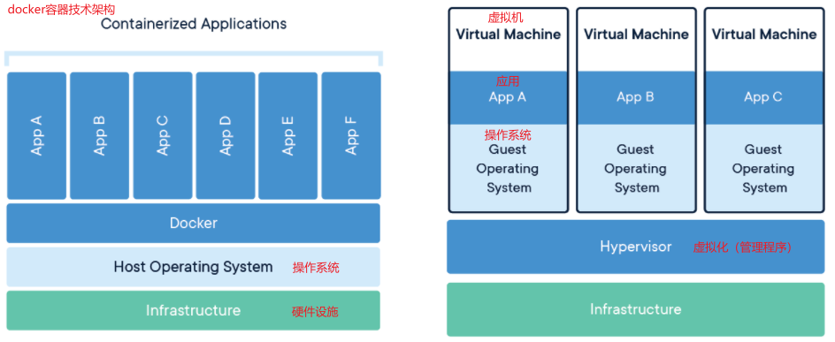

### Docker的工作原理

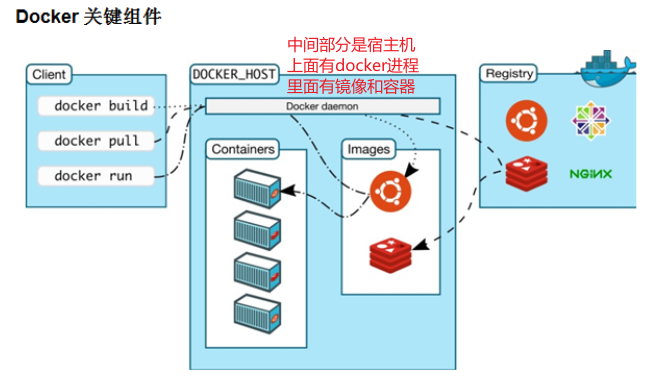

Docker是容器化部署技术，其基础是Linux容器（LXC：Linux Containers）等技术。它主要作用是通过运行容器来实现应用部署（容器基于镜像运行），即将项目和依赖包（基础镜像）打成一个带有启动指令的项目镜像，再从远程仓库拉取要运行的镜像，然后在服务器创建一个容器，给容器指定要运行的环境目录和端口号，并把镜像放在容器内运行，从而实现项目的部署。

服务器就是容器的宿主机，docker容器与宿主机之间是相互隔离的，且只要不把服务从容器里映射出来，就能做到网络隔离（容器里的网络和宿主机的网络）。

**一般情况下（的项目部署）：**Linux（服务器） -> tomcat安装 -> Java依赖 -> maven依赖 ->放置在/usr/lib目录 -> 配置tomcat端口/目录 -> 运行tomcat中的startup.sh脚本 -> 配置网络、防火墙等 -> 服务启动。

**Docker：**使用基于java的tomcat镜像 -> docker run -> 指定端口/挂载webapp目录 -> 服务启动。

具体过程：Docker会拉取镜像（若本地已经存在该镜像，则不用到网上去拉取），再创建新的容器，再分配文件系统并且挂着一个可读写的层（任何修改容器的操作都会被记录在这个读写层上，可以保存这些，修改成新的镜像，也可以选择不保存，那么下次运行改镜像的时候所有修改操作都会被消除），再分配网络和桥接接口（创建一个允许容器与本地主机通信的网络接口），再设置ip地址（从池中寻找一个可用的ip地址附加到容器上，以便能访问到容器），再运行指定的程序，并捕获和提供应用输出（包括输入、输出、报错信息）。

Docker的价值：①从应用架构角度：统一复杂的构建环境，只需要在Dockerfile里对镜像做一些配置；②从应用部署角度：解决依赖不同、构建麻烦的问题，可结合自动化工具（如jenkins）提高效率；③从集群管理角度：有规范的服务调度、服务发现、负载均衡等。

案例：部署nginx：

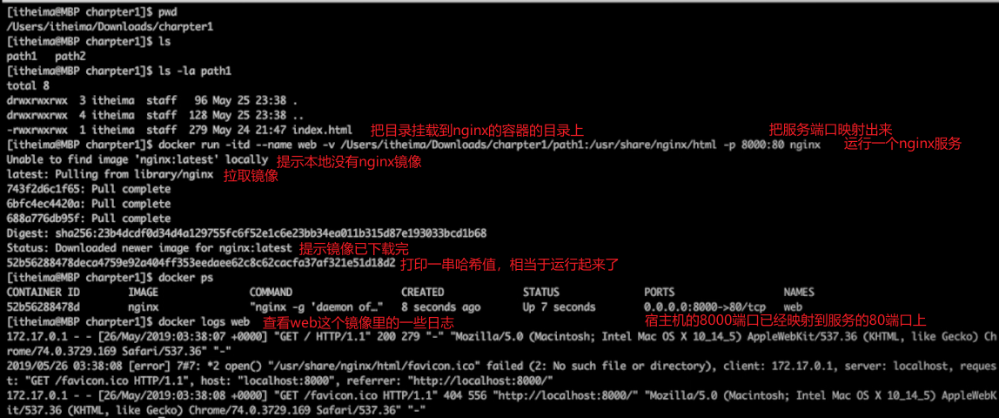

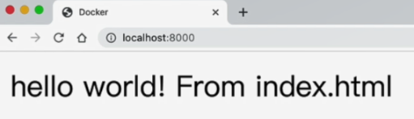


## 常见的应用场景

Docker提供了轻量级的虚拟化，相比于虚拟机，可以在同一台机器上创建更多数量的容器。

### 快速部署

案例：部署一个mysql：

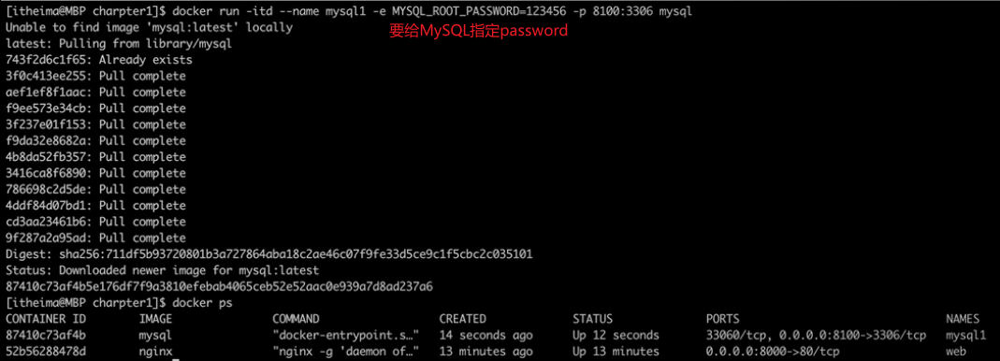

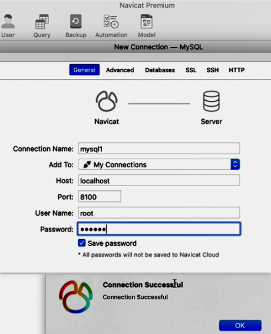

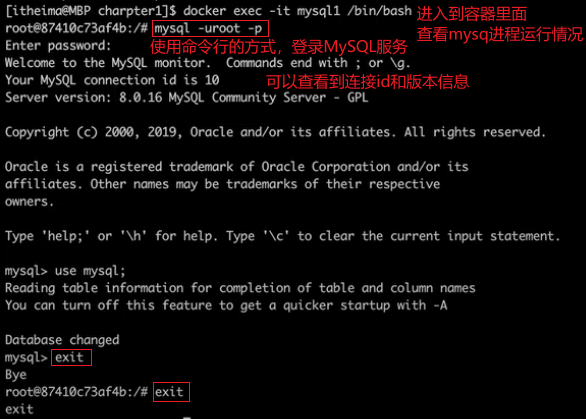

### 隔离应用

一个docker进程上可以运行多个服务，且服务与服务之间是相互隔离的，使用不同的系统资源。

案例：同时跑两个mysql，指定不同的端口进行映射，不需要给每一个MySQL配置单独的端口号：

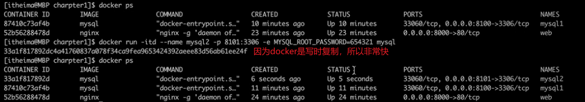

### 版本控制

Docker容器可以像git仓库一样，可以让提交变更到Docker镜像中并通过不同的版本来管理。

案例：之前创建的`mysql2`，使用`commit`命令给它做一个快照，并打上一个`tag`。（另外，使用`push`或`pull`等操作指令，可以对远程仓库做一些对镜像的推送和拉取操作，实现版本控制）

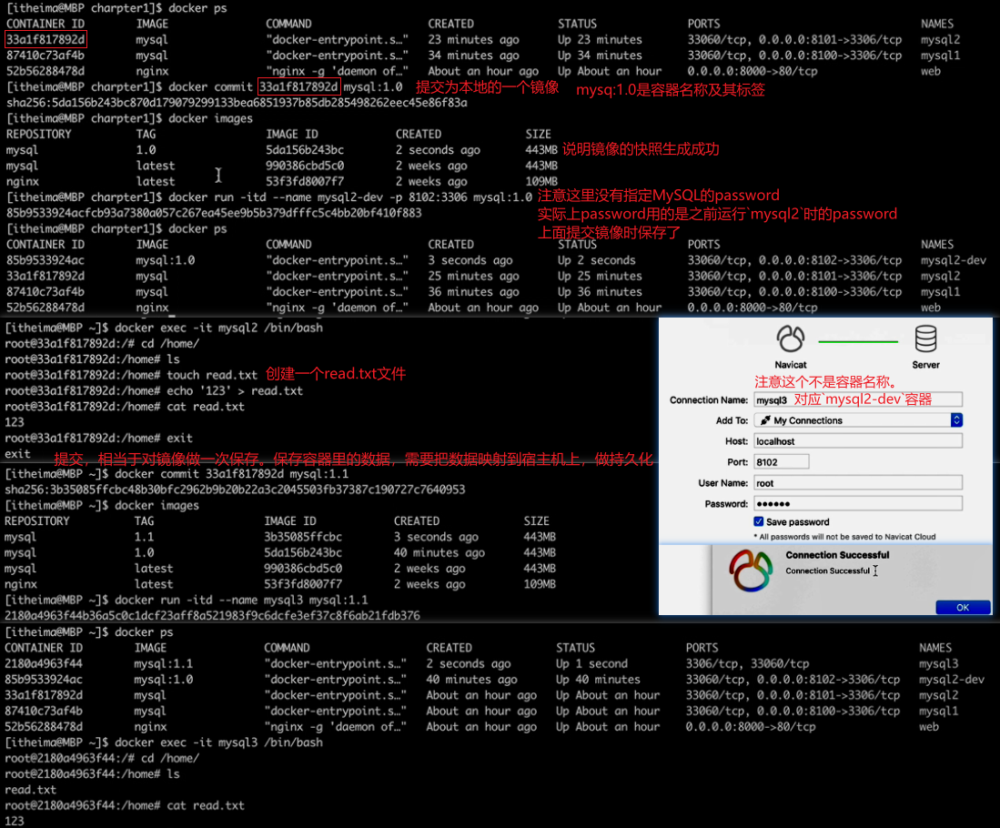

### 提高开发效率

①一致的运行环境：由于 Docker 确保了执行环境的一致性，使得应用的迁移更加容易。Docker 可以在很多平台上运行，无论是物理机、虚拟机、公有云、私有云或笔记本，其运行结果是一致的，因此用户可以很轻易的将在一个平台上运行的应用，迁移到另一个平台上，不用担心运行环境的变化导致应用无法正常运行的情况。

②更快速的启动时间：传统的虚拟机技术启动应用服务往往需要数分钟，而 Docker 容器应用由于直接运行于宿主内核，无需启动完整的操作系统，因此可以做到秒级或毫秒级的启动时间，大大的节约了开发、测试和部署的时间。

③更高效的复用系统资源：容器不需要进行硬件虚拟和运行完整操作系统等额外开销，Docker对系统资源的利用率更高，无论是应用执行速度、内存损耗或文件存储速度，都要比传统虚拟机技术更高效，所以相比虚拟机技术，一个相同配置的主机可以运行更多数量的应用。

④仓库和镜像机制：使用仓库可以方便的在任何有docker进程的虚拟机（或服务器，或主机）上运行docker应用，而环境的统一也让部署变得简单。

### 简化配置和整合资源

对开发和运维（[DevOps](https://zh.wikipedia.org/wiki/DevOps)）人员来说，最希望的就是一次创建或配置，可以在任意地方正常运行。使用 Docker 可以通过定制应用镜像来实现持续集成、持续交付和部署，开发人员可以通过[Dockerfile](https://yeasy.gitbooks.io/docker_practice/image/dockerfile)（使镜像构建透明化）来进行镜像构建，并结合[持续集成(Continuous Integration)](https://en.wikipedia.org/wiki/Continuous_integration)系统进行集成测试，而运维人员则可以直接在生产环境中快速部署该镜像，可结合[持续部署(Continuous Delivery/Deployment)](https://en.wikipedia.org/wiki/Continuous_delivery) 系统进行自动部署。

在DevOps流程中使用docker：当完成代码开发，推送到线上版本仓库后，触发相应的自动化流程，自动化程序就可以进行打包镜像、上传到镜像仓库、拉取镜像和运行镜像操作。


## 使用Docker

### 安装Docker

#### 系统需求

如果是服务器：

| 平台                                                         | x86_64 / amd64 | ARM  | ARM64 / AARCH64 | IBM Power (ppc64le) | IBM Z (s390x) |
| :----------------------------------------------------------- | :------------: | :--: | :-------------: | :-----------------: | :-----------: |
| [CentOS](https://docs.docker.com/install/linux/docker-ce/centos/) |       √        |      |        √        |                     |               |
| [Debian](https://docs.docker.com/install/linux/docker-ce/debian/) |       √        |  √   |        √        |                     |               |
| [Fedora](https://docs.docker.com/install/linux/docker-ce/fedora/) |       √        |      |        √        |                     |               |
| [Ubuntu](https://docs.docker.com/install/linux/docker-ce/ubuntu/) |       √        |  √   |        √        |          √          |       √       |

如果是平台类：

| 操作系统                                                     | x86_64 |
| :----------------------------------------------------------- | :----: |
| [Docker Desktop for Mac (macOS)](https://docs.docker.com/docker-for-mac/install/) |   √    |
| [Docker Desktop for Windows (Microsoft Windows 10)](https://docs.docker.com/docker-for-windows/install/) |   √    |

#### Linux

脚本介绍：https://github.com/docker/docker-install

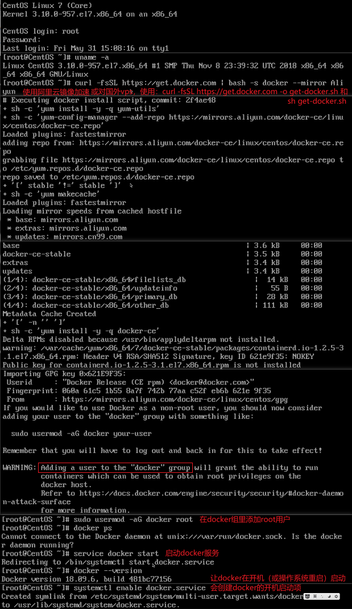

#### Windows

Docker for Windows【系统：专业版及企业版】: https://download.docker.com/win/stable/Docker%20for%20Windows%20Installer.exe

Docker ToolBox for Windows【系统：windows7以上】：https://download.docker.com/win/stable/DockerToolbox.exe

安装Docker的系统需求：①系统版本为Windows 10 64bit: Pro, Enterprise or Education (Build 15063 or later)。②在BIOS中开启虚拟化（virtualization），正常情况下会默认开启（可在系统管理中查看）。③CPU特性：SLAT-capable。④4GB以上的内存。

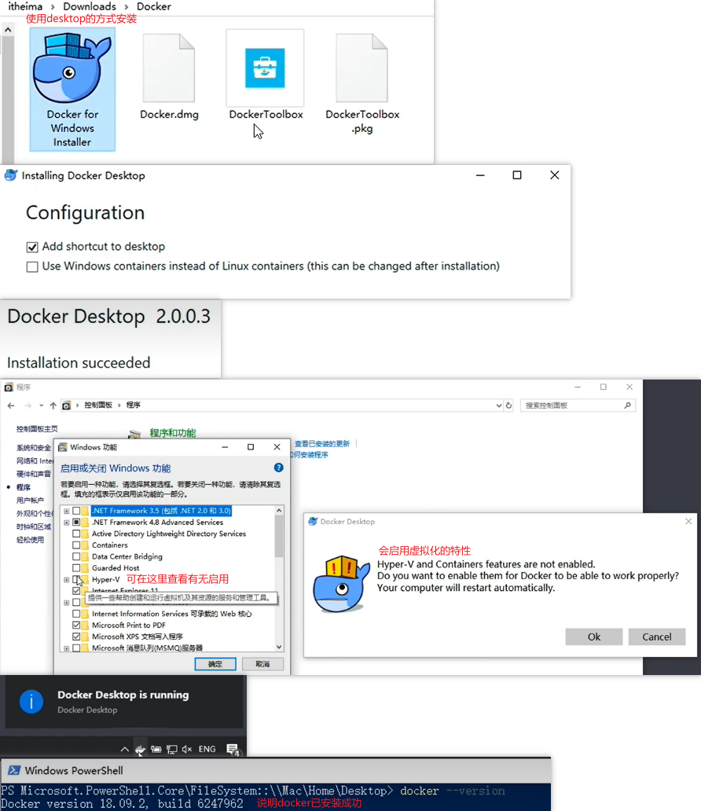

如果启动时出现这个错误，则需要删除MobyLinuxVM，再重新启动docker：

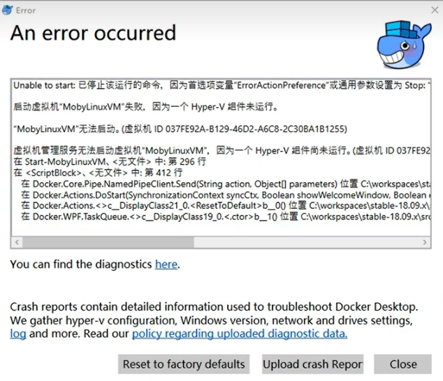

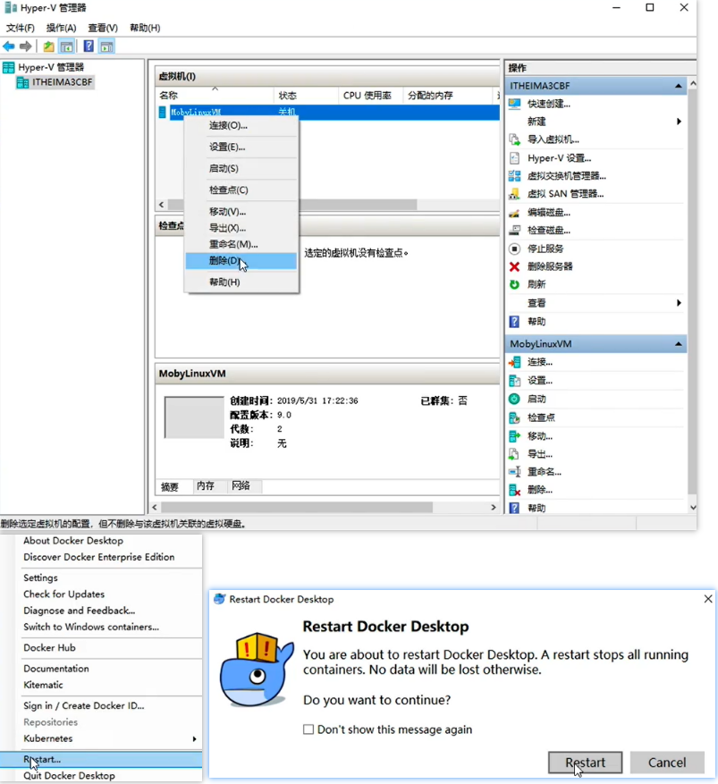

另外，如果不满足上面的需求，则要使用[Docker Toolbox](https://docs.docker.com/toolbox/overview/)（相当于运行了一个virtualbox的虚拟镜像）。**对于Windows7操作系统：**

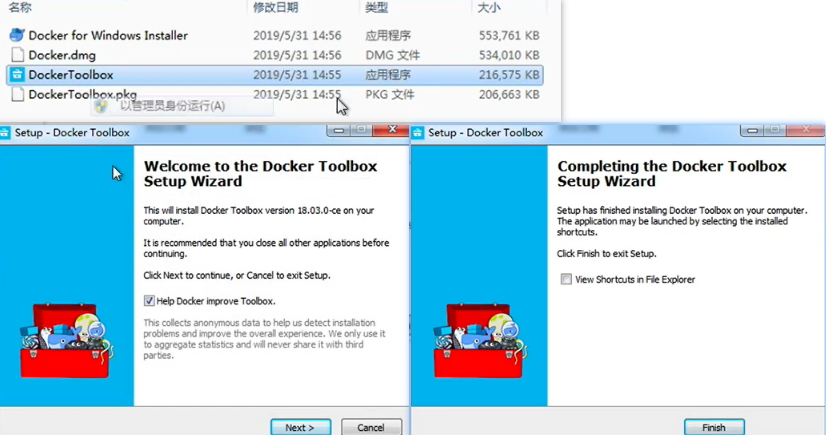

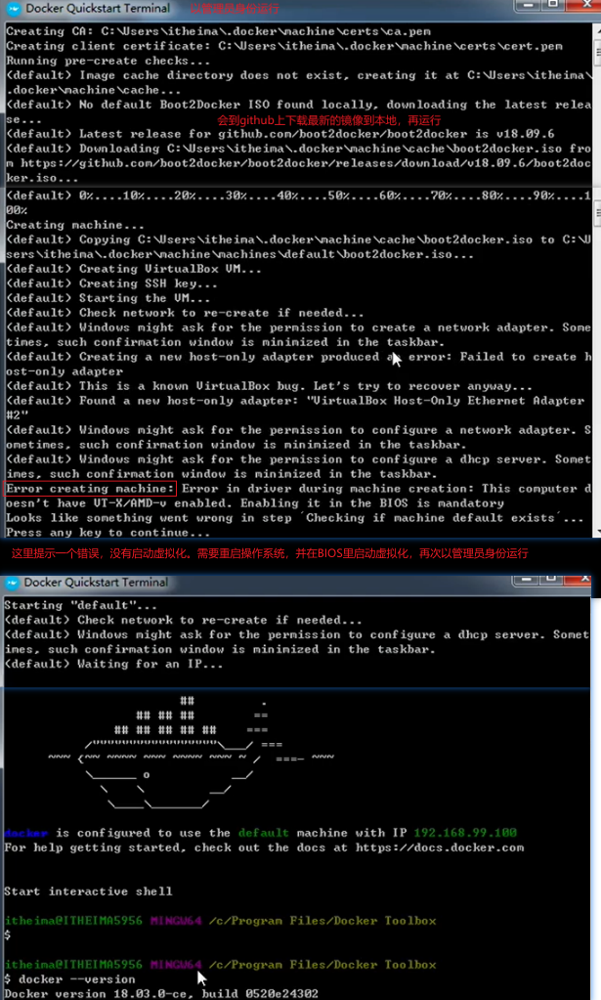

#### MacOS

Docker for Mac【系统：10.12以上】: https://download.docker.com/mac/stable/Docker.dmg

Docker ToolBox for Mac【系统：10.10.3以上】: https://download.docker.com/mac/stable/DockerToolbox.pkg 

**方法一**：官方`dmg`。官方下载地址：[Docker Descktop for Mac](https://hub.docker.com/editions/community/docker-ce-desktop-mac)。下载完`Docker.dmg`安装包之后，双击即可以安装，可能需要系统管理员权限，输入密码即可。

对系统的要求：Requires Apple Mac OS Sierra 10.12 or above. Download [Docker Toolbox](https://docs.docker.com/toolbox/overview/) for previous OS versions.

安装完之后，在终端工具中使用`docker version`来查看Docker版本：

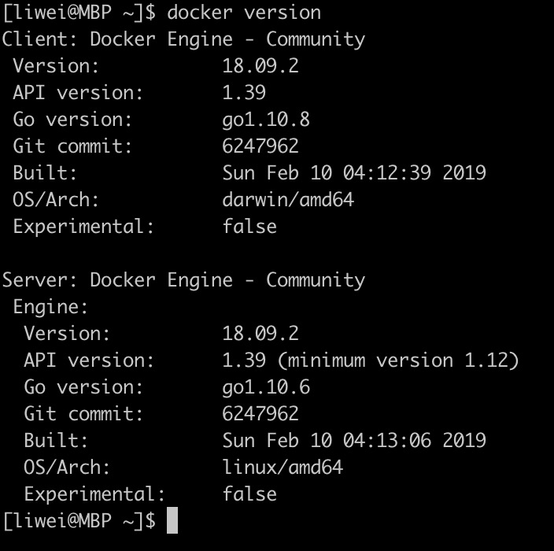

**方法二**：brew cask。会把Docker安装在`Applications`目录下。

```shell
brew update
brew cask install docker
brew cask uninstall docker # 删除的方法（还需要手动删除Docker.app）
```

### 配置Docker国内加速

Docker镜像加速，主要是对`docker pull`拉取镜像操作进行网络加速优化。这里注册阿里云的账号，登录[容器Hub服务](https://cr.console.aliyun.com/)，在左侧的加速器帮助页面就会显示独立分配的加速地址。而Docker的Toolbox镜像站（推荐），主要是针对低版本的windows与mac用户（[http://mirrors.aliyun.com/docker-toolbox/](http://mirrors.aliyun.com/docker-toolbox/)）。

**①对Linux用户：**

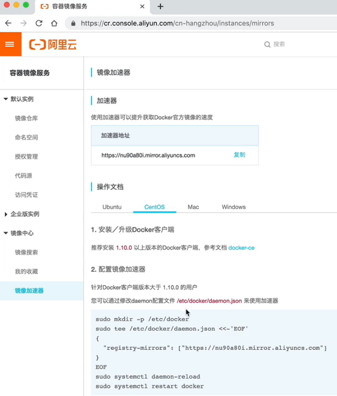

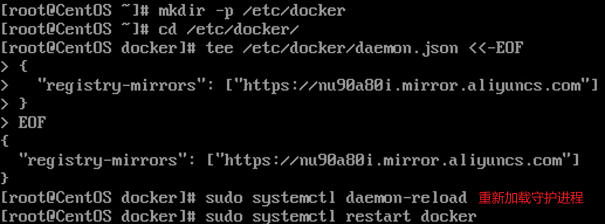

**②对Mac用户：**

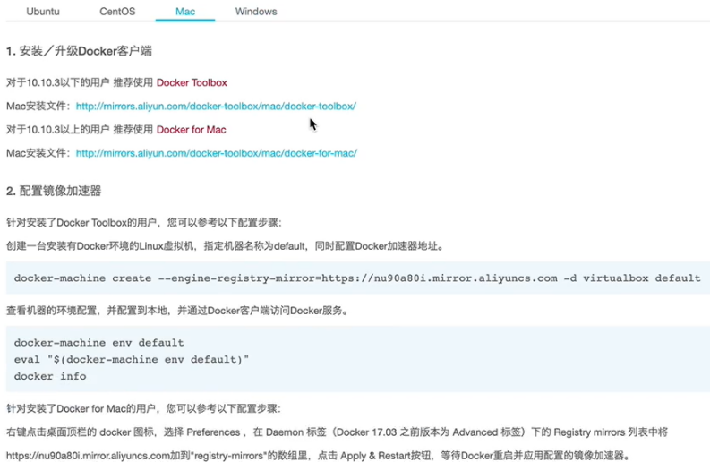

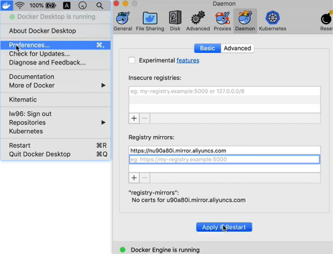

**③对Windows10用户：**

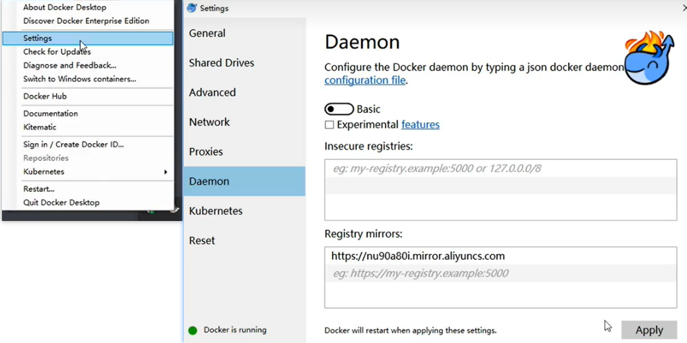

**④对Windows7用户：**

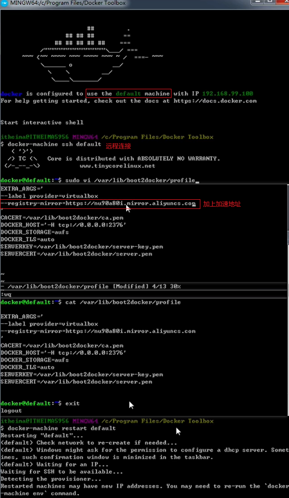

### Docker应用案例

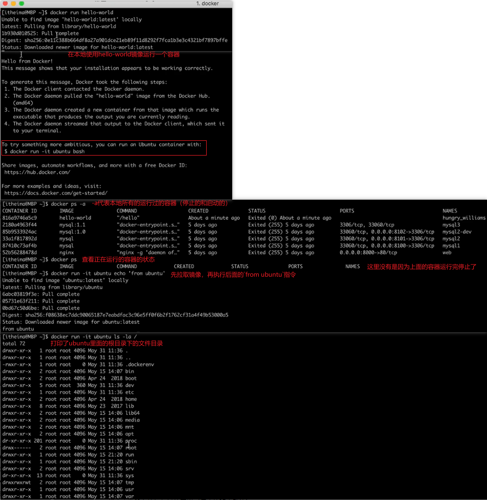

### Docker常见命令

所有的docker命令都是以docker开头，然后接空格，再接命令指令。

①**创建并启动`run`**。`-it`是提供交互式的终端工具（i代表交互，t代表终端），`-d` 是让镜像容器在后台去持续运行，`--name` 指定容器的名称，`exec`可以进入到容器里面去，`-e`传递环境变量，`-p` 映射宿主机的端口给镜像服务使用（把容器里的某个端口映射出来），`-v` 挂载宿主机的文件目录到镜像（容器）里面去。如：

```bash
docker run -it -d --name test ubuntu
docker exec -it test /bin/bash（`docker exec -it <container_name> /bin/bash`、`docker exec -it <container_name> /bin/sh`）
docker run -p 8000:3306 -e MYSQL_ROOT_PASSWORD=123456 -itd --name mysql-4 mysql
docker run -v ~/Downloads/:/home -itd --name test1 ubuntu（把宿主机的Downloads目录挂载到home目录下面运行后可进入到容器home目录里ls查看）
```

②**启动（创建了的并停止的容器）`start`，停止`stop`，重启`restart`，删除已停止的容器`rm`**。如`docker stop test`、`docker rm test`（后面可以继续接容器名称或容器ID）、`docker restart mysql-4`。

③**登录仓库`login`，拉取远程的镜像`pull`，推送`push`，提交镜像`commit`，给指定容器标签`tag`**。

使用`pull`命令来拉取远程仓库的镜像到本地（`docker pull <namespace>/<image_name>:tag`）：

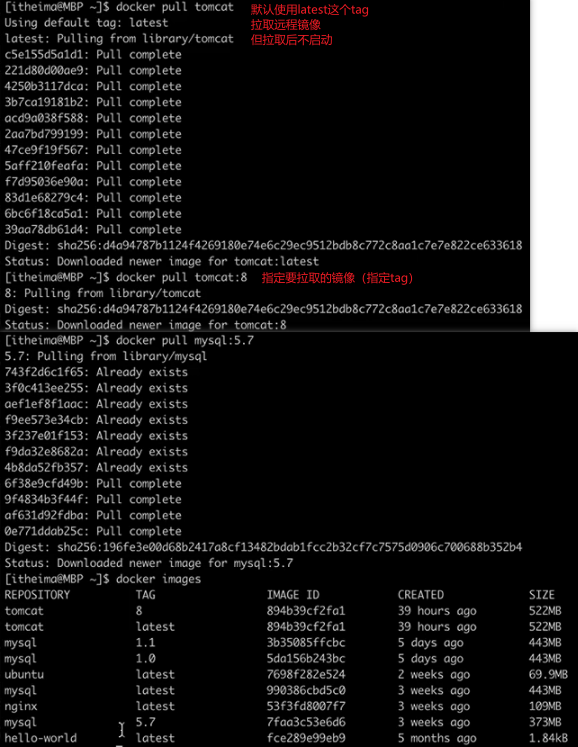

要在`docker hub`上注册账号，才能使用`login`；使用docker commit来给运行中的容器打tag（`docker commit <container_id> <namespace>/<image_name>:tag`），tag默认为latest；使用`push`命令来推送本地的镜像到远程仓库（`docker push <namespace>/<image_name>:tag`）。

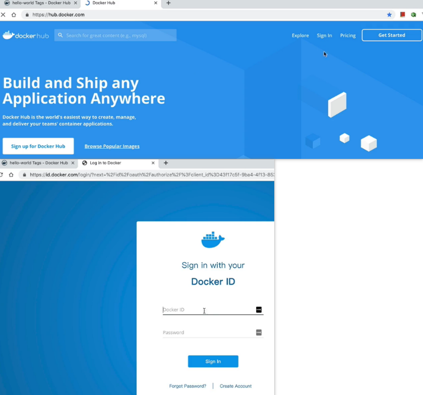

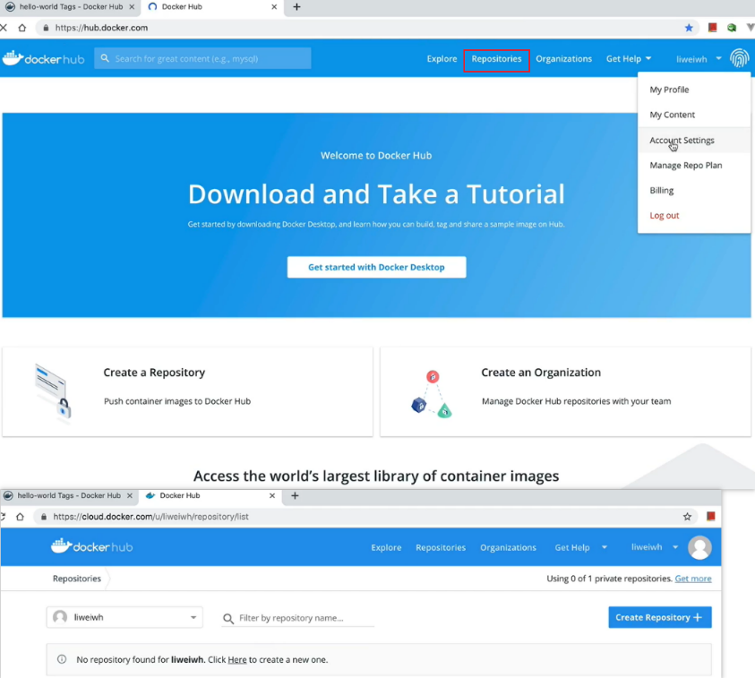

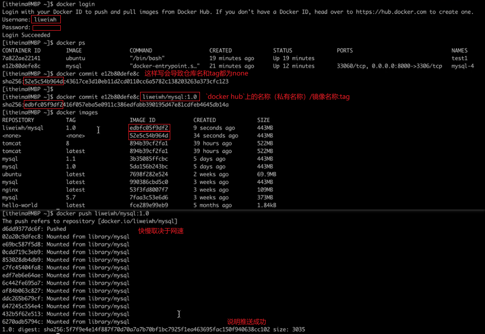

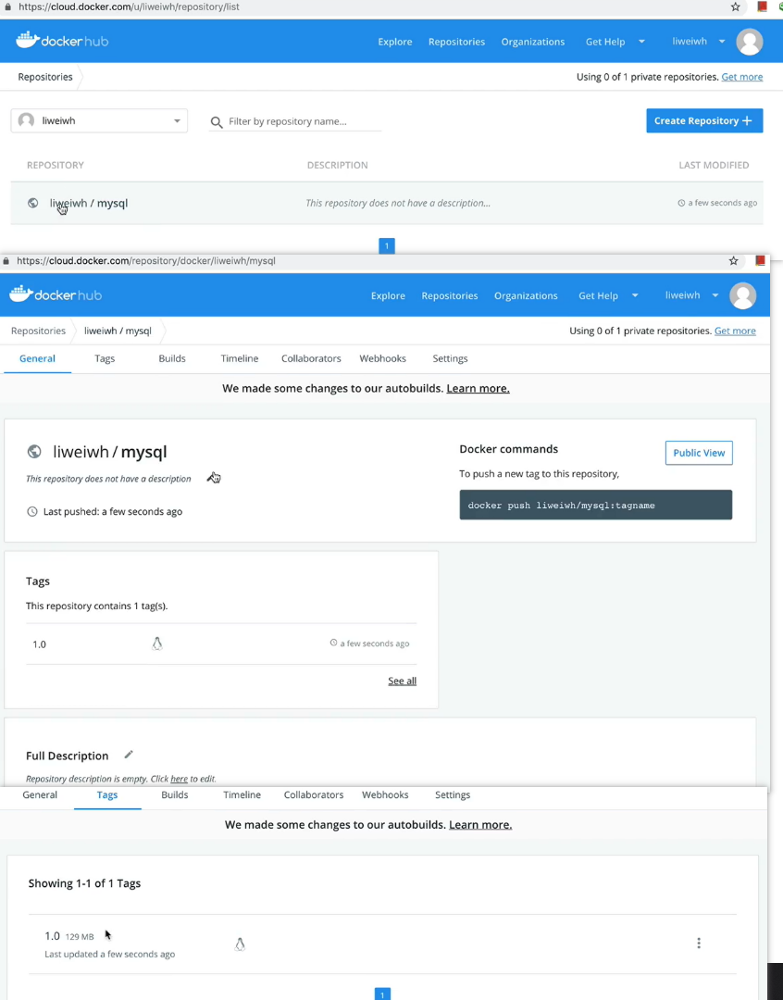

④**查看所有本地镜像`images`，删除本地镜像`rmi`（删除镜像之前，要停止`stop`并删除`rm`运行中的容器）**。

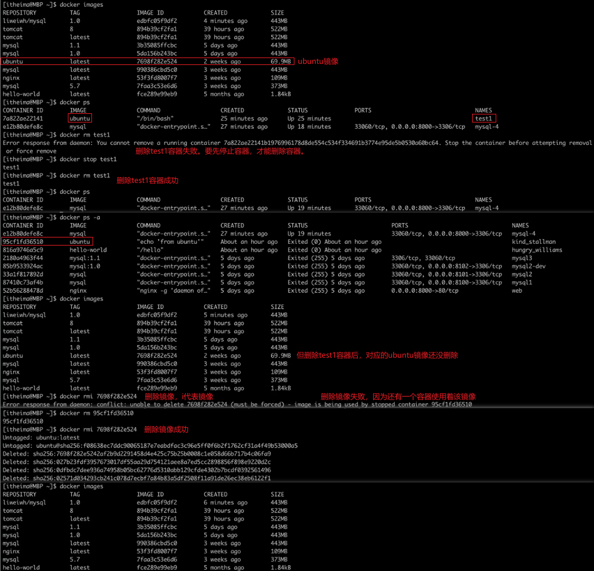

⑤**查看容器服务打印的日志`logs`，检阅容器`inspect`（更详细的容器信息、容器的初始化的配置或属性，如硬件、网络、版本、挂载到宿主机的目录位置、传进去的环境变量等），查看docker的版本信息`version`，查看docker进程的状态或属性信息`info`，查看命令帮助`docker <run/pull/...> --help`，进入容器`exec`**。

如`docker logs mysql-4`（接容器ID或容器名称）、`docker logs -f mysql-4`（持续查看窗口里打印的日志）、`docker inspect`、`docker version`、`docker info`、`docker run --help`。


## 扩展知识

### 制作Docker镜像

**①方式一（不方便维护）**：exec进入容器，在容器里安装服务，使用commit把服务提交并推送到远程仓库。

**②方式二：**使用Dockerfile。

Dockerfile是一个由一堆命令和参数构成的脚本，使用`docker build`即可执行脚本（自动）构建镜像，主要用于进行持续集成。一般Dockerfile共包括四个部分：基础镜像信息、维护者信息、镜像操作指令、容器启动时执行指令。

在docker里运行一个koa应用案例：

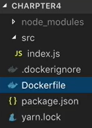

```javascript
// src/index.js文件
const Koa = require('koa');
const app = new Koa();
// response
app.use(ctx => {
  ctx.body = 'Hello Koa!!';
});
app.listen(3000);
```

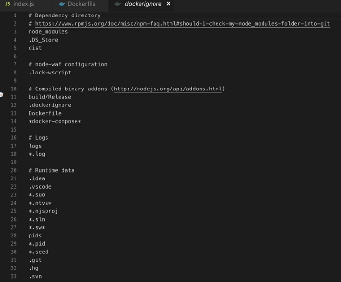

```dockerfile
# Dockerfile文件
FROM node:10 # 拉取镜像，使用官方提供的`node:10`作为基础镜像。

LABEL maintainer=itheima@itcast.cn # 维护者信息

# 操作指令，每一个操作指令都对应一个分片的文件系统
WORKDIR /app # 在镜像里创建app目录，作为工作目录
# COPY ["package.json","*.lock","./"] # 把package.json，yarn.lock（或package-lock.json(npm@5+)）复制到工作目录(相对路径)
# COPY src ./src # 拷贝src下的文件到工作目录的src目录之下（注意要指定工作目录中的文件名）
# 使用.dockerignore文件，上面两个COPY可写成：
COPY . . # 注意这里没有把Dockerfile、.dockerignore、node_modules文件拷贝进去。
RUN ls-la /app # 查看app目录，检查有无拷贝文件进来
# 打包 app 源码。使用Yarn包管理工具安装app依赖，如果需要构建生产环境下的代码，则使用`--prod`参数。
RUN yarn --prod --registry=https://registry.npm.taobao.org
EXPOSE 3000 # 对外暴露端口到宿主机上。如这里的3000对应-p参数后面的端口值（`-p 4000:3000`，把容器服务端口3000映射到宿主机的4000端口）

# 容器启动时执行指令，执行`src/index.js`文件
CMD [ "node", "src/index.js" ]
```

使用`docker build`打包（`docker build -t ${your_name}/${image_name}:${tag} .`），本地就会有这个镜像。`your_name`代表的是远程仓库中的用户名或仓库地址，`image_name`为镜像名称，`tag`是给镜像打的标签（用于版本控制），`.`表示默认使用当前目录下的Dockerfile进行构建。

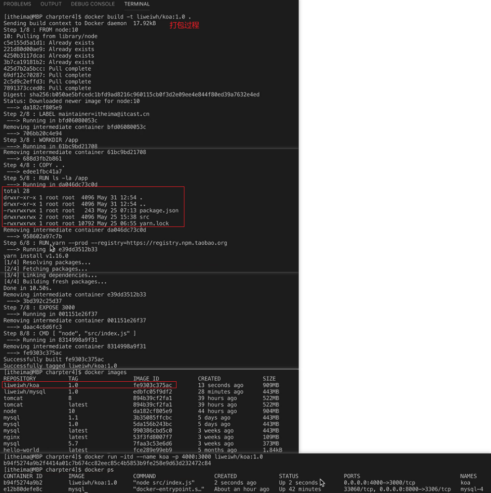


### docker-compose

`docker-compose`是docker的集成化的命令，可批量执行一些docker的命令，解决了容器与容器之间如何管理编排的问题。通过`docker-Compose`，用户可以用一个配置文件定义一个多容器的应用，然后使用一条指令安装这个应用的所有依赖，完成构建。

服务 (service) ：一个应用的容器，实际上可以包括若干运行相同镜像的容器实例。项目 (project) ：由一组关联的应用容器组成的一个完整业务单元，在`docker-compose.yml`文件中定义，即相关容器的配置项都写在`docker-compose.yml`文件里。

对于Linux操作系统，Docker Compose 是 Docker 的独立产品，因此需要安装 Docker 之后再单独安装 Docker Compose（而macOS和Windows安装docker后会自带）。

```bash
安装方法：
sudo curl -L https://github.com/docker/compose/releases/download/1.20.0/docker-compose-`uname -s`-`uname -m` -o /usr/local/bin/docker-compose #下载
chmod +x /usr/local/bin/docker-compose #执行安装，给该文件执行权限
docker-compose --version #查看版本
```

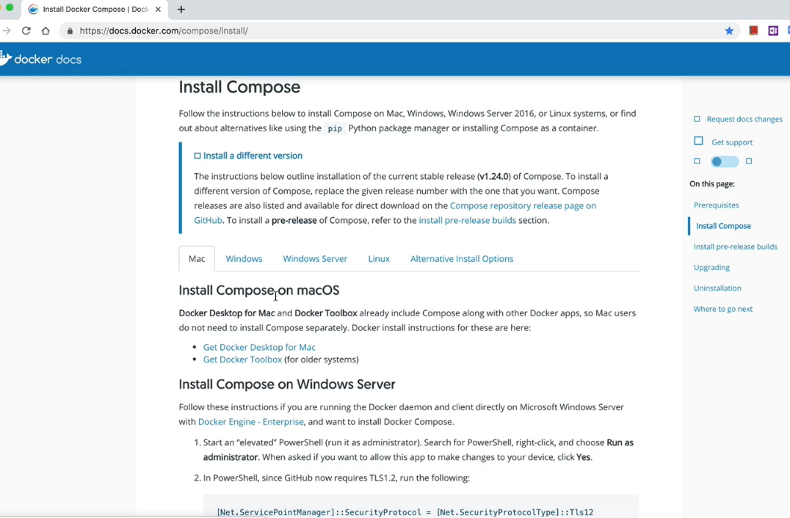

生命周期管理：①创建：`docker run ...`或`docker-compose up -d`（默认执行当前目录下的`docker-compose.yml`文件）。②启动和停止和重启和删除：`start`和`docker-compose stop`和`restart`和`docker-compose rm`。③检视和日志：`docker ps`和`docker-compose logs`。

**案例一：**

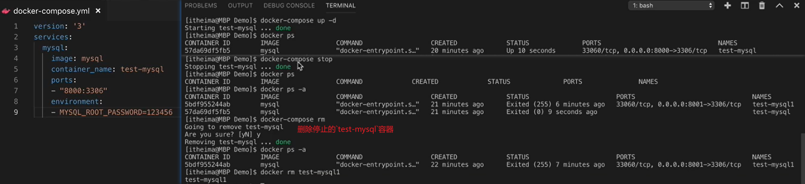

**案例二：**搭建本地mongo + mongo-express服务。

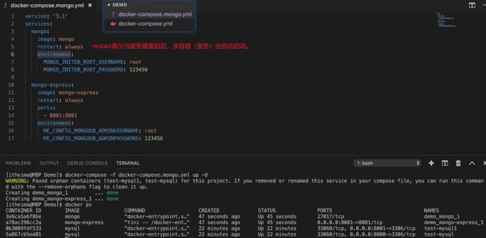

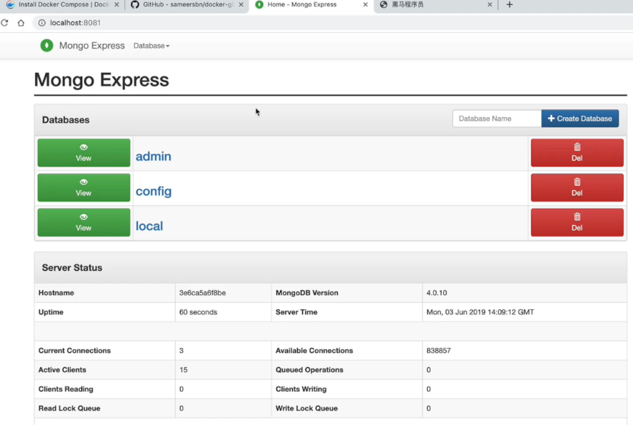

**案例三：**搭建一个git服务器GitLab。项目地址https://github.com/sameersbn/docker-gitlab。volumes表示挂载的地址。

服务器配置：2core，2GB+2GB(swap，虚拟内存空间) ，适用于10人的小团队。

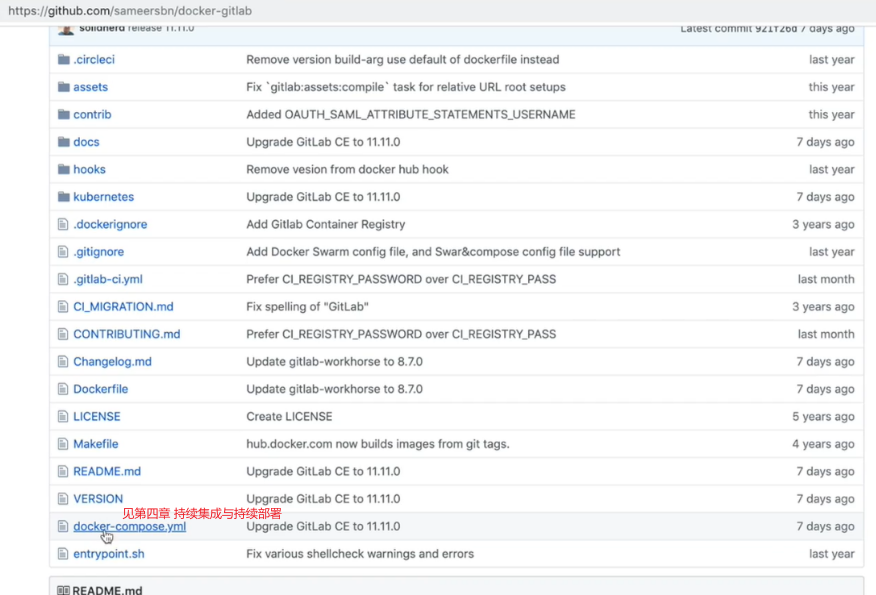

**案例四：**Nodejs + mongodb + koa + vue的应用组合。

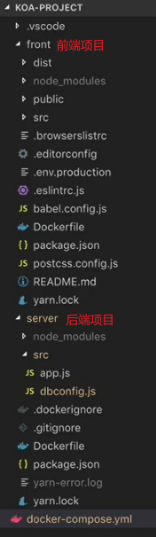

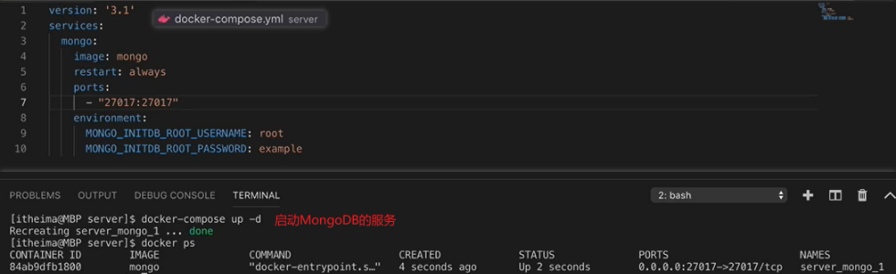

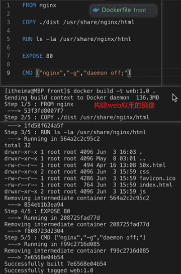

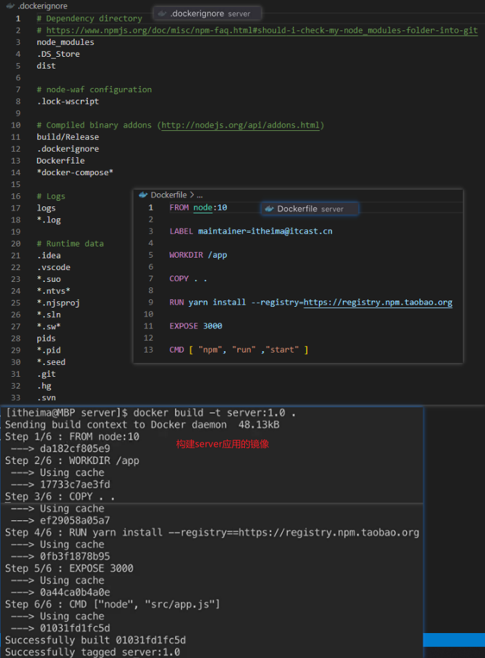

```yaml
# KOA-PROJECT/docker-compose.yml
version: '3'
services:
  web:
    image: web:1.0
    ports:
    - "8080:80"

  server:
    image: server:1.0
    ports:
    - "3000:3000"
    # depends_on决定了容器加载的先后顺序，这里`mongdb`、`web`先加载，`mongdb`创建完成之后再来创建`server`。
    depends_on:
    - mongodb
    # 使用links能从一个镜像访问到另一个镜像，其它方法还有创建网络、映射到公网、使用同一个ip段、使用宿主机的网络等。
    links:
    - mongodb:db # 前面的参数代表要访问的服务名，后面的参数代表该服务的网络进行映射的别名。

  mongodb:
    image: mongo
    restart: always
    environment:
      MONGO_INITDB_ROOT_USERNAME: root
      MONGO_INITDB_ROOT_PASSWORD: 123456
```

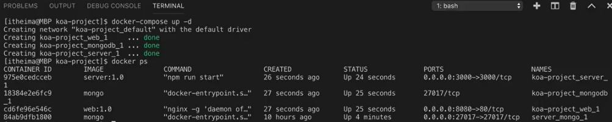

### Docker的文件系统原理

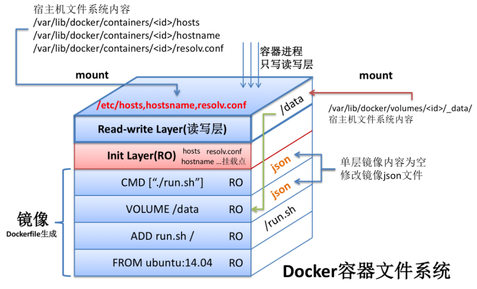

### Docker的一般开发流程

寻找基础镜像；基于基础镜像编写Dockerfile脚本；根据Dockerfile脚本创建项目镜像；将创建的镜像推送到docker仓库（根据需要，可选）；基于项目镜像创建并运行docker容器（实现最终部署）。这里可变成自动化开发流程（如加入版本控制git -> 使用webhook -> jenkins自动打包  -> docker自动构建 -> 推送镜像 -> 生产环境部署）。

### 简单的DevOps流程

参考链接：[从一张图看Devops全流程](https://cloud.tencent.com/developer/article/1070465)。

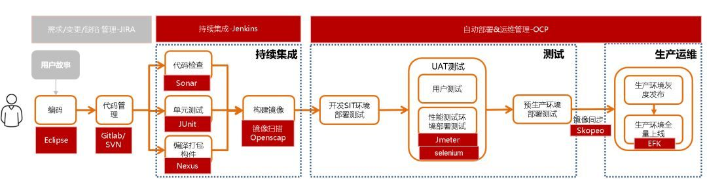

### Kubernetes

Kubernetes（中文意思是舵手或导航员），是一个容器集群管理系统，主要职责是容器编排（Container Orchestration），即启动容器、自动化部署、扩展和管理容器应用、回收容器。文档https://kubernetes.io/zh/。集群相关：[Mesos](http://mesos.apache.org/)，[Docker Swarm](https://github.com/docker/swarm)。


