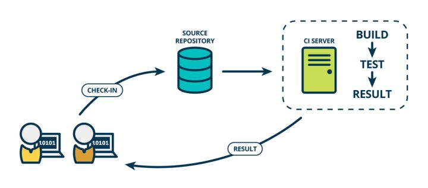
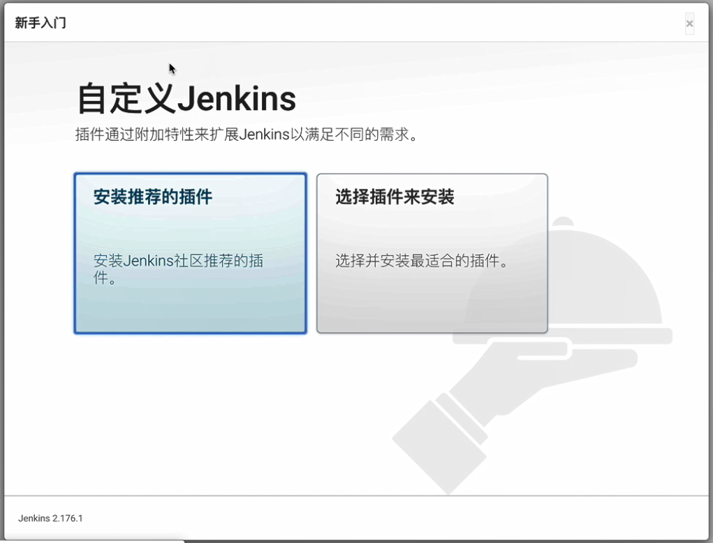
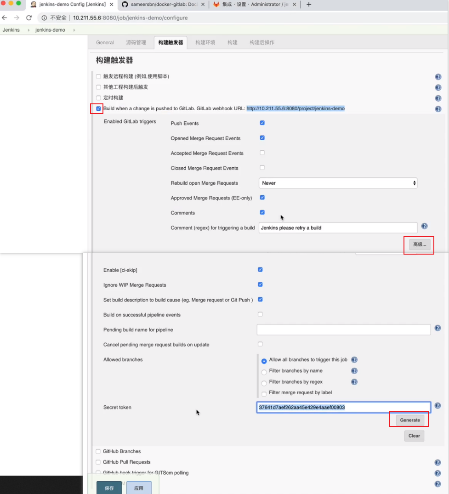
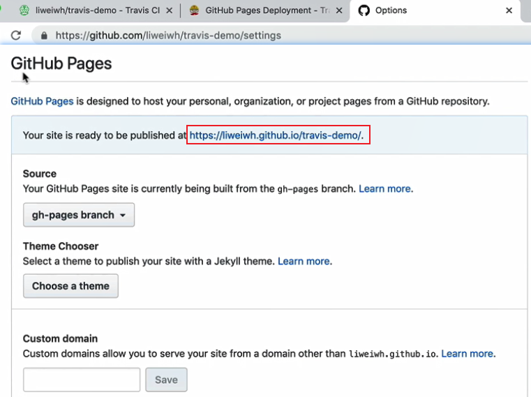

#  持续集成与持续部署

**传统的开发过程中的坑：**BUG总是在最后才发现、越到项目后期的加班越严重、交付无法保障、变更频繁导致效率低下（代码层面和交付层面）、无效的等待多和用户满足度低。

**持续集成解决的问题：**提高软件质量、效率迭代、便捷部署、快速交付和便于管理（有日志和记录，且配置项是可视化的，进而控制构建过程）；不用管开发或测试环境（的不一致），且只用专注代码的开发、不用麻烦运维人员帮忙调试环境、不用手动进行测试，且可以在模拟环境中进行自测、不用手动发布和部署，且自动化实现发布部署。


## 持续集成

### 概念

**集成，就是一些孤立的事物或元素通过某种方式集中在一起，产生联系，从而构成一个有机整体的过程**。各行各业基本都会用到集成：对于传统行业，在研发成功以后，可以通过流水线的方法批量生产进行集成；在软件行业中，集成并不是一个简单的“搬箱子”的过程。因为软件工业是一个知识生产活动，其内在逻辑非常复杂，需求又很难一次性确定，完成的产品与最初的设计往往相差很远。

敏捷宣言中就有一条是说响应变化重于遵循计划，而且由于软件行业的迅猛发展，软件变的越来越复杂，单靠个人是根本无法完成。大型软件为了重用及解耦，往往还需要分成好几个模块，这样集成就成了软件开发中不可或缺的一部分，而持续就是指**长期的对项目代码进行集成。**

**持续集成（英文：Continuous Integration，简称CI）：**在软件工程中，持续集成是指将所有开发者工作副本每天多次合并到主干的做法，并调开发人员提交了新代码之后，立刻进行构建和（单元）测试。根据测试结果，可以确定新代码和原有代码能否正确地集成在一起。对于一天需要集成多少次数，并没有一个明确的定义，一般就是按照自己项目的实际需要来设置一定的频率，少则可能几次，多则可能达几十次。可以设置按照代码的变更来触发集成，或设置一个固定时间周期来集成，也可以手工点击集成的按钮来“一键集成”。

Grady Booch 在1991年的 Booch method 中首次命名并提出了 CI 的概念，尽管在当时他并不主张每天多次集成。而 XP（Extreme programming，极限编程）采用了 CI 的概念，并提倡每天不止一次集成。在《持续集成》一书中，对持续集成的定义如下：持续集成是一种软件开发实践。在持续集成中，团队成员频繁集成工作成果，一般每人每天至少集成一次，也可以多次。每次集成会经过自动构建（包括自动测试）的检验，以尽快发现集成错误。自从在团队中引入这样的实践之后，`Martin Fowler`发现这种方法可以显著减少集成引起的问题，并可以加快团队合作软件开发的速度。



**持续交付（英文：Continuous Delivery，简称CD）：**完成 CI 中构建及单元测试和集成测试的自动化流程后，持续交付可自动将已验证的代码发布到存储库（存储空间），然后再手动地发布这些应用或程序或代码库。为了实现高效的持续交付流程，务必要确保 CI 已内置于开发管道。持续交付的目标是拥有一个可随时部署到生产环境的代码库。

在持续交付中，每个阶段（从代码更改的合并，到生产就绪型构建版本的交付）都涉及测试自动化和代码发布自动化。在流程结束时，运维团队可以快速、轻松地将应用部署到生产环境中。例如，完成单元测试后，可以把代码部署到连接数据库的 Staging 环境中更多的测试，如果代码没有问题，可以继续手动部署到生产环境中。


**持续部署（英文：Continuous Deployment，简称CD）：**对于一个成熟的 CI/CD 管道来说，最后的阶段是持续部署。持续部署是在持续交付的基础上，把部署到生产环境的过程自动化（它是作为由持续交付再到自动将生产就绪型构建版本发布到代码存储库的延伸，可以自动将应用发布到生产环境）。由于在生产之前的管道阶段没有手动门控，因此持续部署在很大程度上都得依赖精心设计的测试自动化。实际上，持续部署意味着开发人员对应用的更改在编写后的几分钟内就能生效（假设它通过了自动化测试），这更加便于持续接收和整合用户反馈。

所有这些 CI/CD 的关联步骤都有助于降低应用的部署风险，且更便于以小件的方式（而非一次性）发布对应用的更改。但由于还需要编写自动化测试以适应 CI/CD 管道中的各种测试和发布阶段，因此前期投资还是会很大。


### 组成要素

**一个最小化的持续集成系统需要包含的要素：**

①**版本管理系统：**项目的源代码需要托管到适合的版本管理系统中，一般我们使用git作为版本控制库，版本管理软件可以使用github、gitlab、stash等。

②**构建脚本&工具：**每个项目都需要有构建脚本来实现对整个项目的自动化构建。比如Java的项目就可以使用gradle作为构建工具。通过构建工具实现对编译、静态扫描、运行测试、样式检查、打包、发布等活动串起来，可以通过命令行自动执行。

③**CI服务器：**CI服务器可以检测项目中的代码变动，并及时的通过构建机器运行构建脚本，并将集成结果通过某种方式反馈给团队成员。

### 应用场景

打包平台：Java应用（Gradle/Maven）、前端应用（npm/yarn）、移动端打包（Android/iOS）。

测试平台：接口测试、自动化测试（Robotium、Testlink）、单元测试（junit）、性能测试（Jmeter）。

自动部署：FTP、Shell、Tomcat/Dokcer、Kubernetes/Rancher/Cluster。

持续集成：Git（gitlab、github、gitee等）、Jenkins/TravisCi/CircleCI。

### 工作流

**传统的工作流：**参与人员有开发、项目经理、测试。传统的瀑布式开发模型，可参考[软件开发模式对比(瀑布、迭代、螺旋、敏捷)](https://www.cnblogs.com/-OYK/archive/2012/10/08/2714669.html)。这种传统模式可以适用于（几千块钱或几万块钱的）小项目，但不适用于大型项目。

主要流程：
项目一开始是先划分好模块，分配模块给相应的开发人员；
开发人员开发好一个模块就进行单元测试；
等所有的模块都开发完成之后，由项目经理对所有代码进行集成；
集成后的项目由项目经理部署到测试服务器上，并交由测试人员进行集成测试；
测试过程中出现 Bug 就把问题记录在 Bug 列表中；
项目经理分配 Bug 给相应的责任人进行修改；
修改完成后，项目经理再次对项目进行集成，并部署到测试服务器上；
测试人员在下一次的集成测试中进行回归测试；
通过之后就部署到生产环境中，但如果测试不通过，则重复上述`分配 Bug -> 修改 Bug -> 集成代码 -> 部署到测试服务器上 -> 集成测试`工作。

带来的问题：

①重复性劳动，无效的等待变多：重复的进行发布部署。流程上，有可能开发在等待集成其他人的模块，测试人员在等待开发人员修复 Bug，产品经理在等待新版本上线好给客户做演示，项目经理在等待其他人提交代码，而等待意味低效。

②很晚才发现缺陷，并且难以修复：实践证明，缺陷发现的越晚，需要修复的时间和精力就越大，因为从上一个可工作的软件到发现缺陷之间可能存在很多次提交，而要从这些提交中找出问题并修复的成本会很大，开发人员需要回忆每个提交的上下文来评估影响点。

③低品质的软件，软件交付时机无法保障：由于集成时每次包含的代码很多，所以关注点主要都是如何保证编译通过和自动化测试通过，而往往很容易忽略代码是否遵守了编码规范、是否包含有重复代码、是否有重构的空间等问题，这些问题又反过来会影响今后的开发和集成，久而久之集成变得越来越困难，软件的质量越来越低。

④项目缺少可见性和可控性：由于产品经理在与客户交流过程中，往往实际的软件就是最好的原型，所以软件会被当作原型作为跟客户交流的工具，当然，客户最希望的是客户的想法能够马上反映到原型上，这会导致程序会经常被修改和变更，特别是对于敏捷开发的实践者，这也意味着`分配 Bug -> 修改 Bug -> 集成代码 -> 部署到测试服务器上 -> 集成测试`工作又爆增了。虽然项目经理可以催促相关人员，但整个项目的进展并不能通过一些直白的测试结果或监控平台去观察项目的进度和薄弱欠缺的环节。

**常见的工作流（自动化）：**


dev代表开发（人员），ops代表操作或运维（人员）。循环迭代的过程（敏捷开发模型）：plan（功能拆分）、code（代码编写）、build（代码构建）、test（测试）、release（发布）、deploy（部署）、operate（运维）、monitor（监控）。自动化部署工作解放了集成、测试、部署等重复性劳动，且机器集成的频率明显可以比手工的高很多。`“You build it, you run it”，这是 Amazon 一年可以完成 5000 万次部署，平均每个工程师每天部署超过 50 次的核心秘籍。`

流程：当把代码发布到代码平台之后，代码平台会发一个钩子hook或事件请求到自动化平台，自动化平台会从代码仓库中下载代码，并在一个沙盒或沙箱里面进行构建和测试，测试通过之后就会把代码发布到指定的一台测试服务器或生产服务器上去。

该系统的各个组成部分发挥作用的顺序：
开发者检入代码到源代码仓库；
CI系统会为每一个项目创建了一个单独的工作区，当预设或请求一次新的构建时，CI系统通常会根据请求发起相应的操作（如即时构建、生成报告，或检索一些构建好的构件），它将把源代码仓库的源码存放到对应的工作区；
CI系统会在对应的工作区内执行构建过程；
构建完成后，CI系统会在一个新的构件中执行定义的一套测试，完成后触发通知（Email,RSS等）给相关的当事人；
如果测试通过，这个构件会被打包并转移到一个部署目标（如应用服务器）或存储为软件仓库（软件仓库可以是CI系统的一部分，也可以是一个外部的仓库，如一个文件服务器或像Java.net、SourceForge之类的网站）中的一个新版本。

### 解决的问题

**高效率：**高效率的发布，避免了重复性的劳动，更快地修复BUG，更快地交付成果，减少了等待时间。

**高质量：**在重复性动作上，机器犯错的几率几乎为零，当搭建完成集成服务器后，就可以交给集成服务器来打理，且集成活动不一定在一个标准的构建机器上生成，也可以在某个开发人员的机器上构建的（可能存在在其它机器上无法运行的问题）。

**高产出：**持续集成可以在任何时间发布可以部署的软件。在外界看来，这是持续集成最明显的好处；对客户来说，可以部署的软件产品是最实际的资产。利用持续集成，可以经常对源代码进行一些小改动，并将这些改动和其它代码进行集成，做到便捷的部署和项目的可预期。

### 常见问题

接触持续集成平台时的常见问题：观念的问题、钱的问题、安全的问题。

①无法接受新事物或新技术（求稳心态的人还是多，总是有人认为老的技术代表稳定，新的事物往往会带来问题）、认为手工集成也没有多少工作量（不是所有的人都参与到整个持续集成的环节，所以没有办法认识到问题全貌）。**针对这个问题，可以通过设置一定的持续集成技术培训、宣讲得到改观。**

②管理层的抵触：培训持续集成需要投入资金、持续集成服务器要增加软硬件成本、开发人员领高工资则应该多干活多加班。**针对这一点，可以从开发人员的成本和持续集成的投入（软硬件）的成本上做估算。**

硬件参考：Jenkins主服务器一般2C4G，slave服务器根据生产需要进行选购；git服务器一般2C4G（10人团队）；Docker服务器8C32G（Rancher + harbor），主要是为了配置一些测试环境或预验证环境或生产环境，起到辅助的效果，可以让程序得到快速的迭代和部署（如在其它地方进行部署时，可以直接使用镜像进行部署）。

③生产环境的复杂：例如，部署的生成环境是在政务外网，无法从互联网直接访问持续集成平台等，导致构建效率低下和任务多。目前，这个是最麻烦的，还在研究中，初步设想是让政务外网开辟一个白名单，给持续集成服务器设置一个单独的通道（只是思路，未验证。可能持续集成平台本身也有安全问题）。

### 注意事项

实施持续集成的开发人员可以尽早并经常提交，这能尽早发现冲突。如果存在任何问题，则使用较小的提交可以更轻松地对代码进行故障排除。虽然每天或甚至更频繁地提交软件对于持续集成是必要的，但还不够，要成功使用持续集成，团队必须：
**①使测试成为开发过程中不可或缺的一部分，应该在创建代码时编写测试。**公司成功持续整合，所需的最重要因素是严格的测试文化，工程师应该定期对代码进行测试，且在开发每个功能时编写测试。

**②确保测试环境反映生产一致。**为了支持严格的测试文化，测试环境必须反映生产环境，否则无法保证正在测试的内容将在生产中起作用，这也意味着测试环境应使用相同版本的数据库、Web服务器配置、工件等。

**③使用编码最佳实践（如结对编程）。**软件开发的另一个最佳实践是在编码期间进行配对。对于更复杂的功能，团队在编写单行代码之前讨论体系结构方法。在将任何代码合并到生产环境之前，其他开发人员始终会检查代码，这有助于确保使用编码最佳实践（代码不会与其他开发人员正在处理的现有代码或代码冲突，并且新功能是可扩展的）。

**④自动化部署工作流程。**为确保整个软件开发流程快速高效，构建需要快速，部署工作流程也应自动化。通过自动化部署工作流程，团队可以更快地将完成的代码生成。

### 效率工具对比


| 分类       | Jenkins          | Travis CI                 | Circle CI             |
| ---------- | ---------------- | ------------------------- | --------------------- |
| 本地部署   | 支持             | 不支持                    | 支持                  |
| REST API   | 支持             | 支持                      | 支持                  |
| 配置       | 复杂，高度可配置 | YAML文件                  | YAML文件              |
| 按需安装   | 是               | 否                        | 是                    |
| 跨平台支持 | 是               | Linux + MacOS             | Linux + MacOS(付费)   |
| 多服务器   | 是               | 按需                      | 否                    |
| 快速构建   | 手动配置复杂     | 快(需要写配置文件)        | 最快                  |
| 基本环境   | Java             | 云环境                    | 云环境                |
| 费用       | 免费             | 特定免费，其它(69$/c)'月' | 特定免费，其它(50$/c) |

#### **Jenkins**

原名Hudson，它是一个开源的实现持续集成的软件工具，能实时**监控集成中存在的错误**，提供**详细的日志文件和提醒**功能，还能用图表的形式形象地展示**项目构建的趋势和稳定性**，适合大中型项目。官网[http://jenkins-ci.org/](http://jenkins-ci.org/)。

Jenkins特点：
①**易安装**：Jenkins是一个独立的基于Java的程序（java环境），随时可以运行，包含Windows、Mac OS X和其它类Unix操作系统的软件包。仅仅一个 java -jar jenkins.war，从官网下载该文件后，直接运行，无需额外的安装，更无需安装数据库。
②**易配置**：提供友好的GUI配置界面。
③**变更支持**：Jenkins能从代码仓库（Subversion/CVS）中获取并产生代码更新列表并输出到编译输出信息中。
④**支持永久链接**：用户是通过web来访问Jenkins的，而这些web页面的链接地址都是永久链接地址，可以在各种文档中直接使用该链接。
⑤**集成E-Mail/RSS/IM：**当完成一次集成时，可通过这些工具实时告诉集成结果。
⑥**JUnit/TestNG测试报告**：也就是用以图表等形式提供详细的测试报表功能。
⑦**支持分布式构建**：Jenkins可以把**集成构建等工作分发到多台计算机中完成**。
⑧**文件指纹信息**：Jenkins会保存哪次集成构建产生了哪些jars文件，哪一次集成构建使用了哪个版本的jars文件等构建记录。
⑨**支持第三方插件**：使得 Jenkins 变得越来越强大；凭借更新中心中的插件，Jenkins几乎集成了持续集成和持续交付工具链中的所有工具。
⑩**Rest API**：可以访问控制获取的数据量，获取或更新config.xml，删除作业，检索所有构建，获取或更新作业说明，执行构建，禁用或启用作业。

**优点：**价格免费、可定制化、有插件系统、完全控制系统（可本地部署）。**缺点：**需要专用服务器（或多个服务器）而导致额外的费用、配置和定制需要时间。

#### **Travis CI**

它是一个托管的持续集成服务，用于构建和测试在GitHub上托管的软件项目。

Travis CI的特点：
①基于云：TravisCI是一个**基于云**的系统（云环境），不需要专用服务器，无需管理它。
②支持Docker运行测试。
③使用YAML文件进行配置。
④可选择Linux和Mac OSX上同时运行测试。
⑤开箱即用的支持的语言：Android，C，C＃，C ++，Clojure，Crystal，D，Dart，Erlang，Elixir，F＃，Go，Groovy，Haskell，Haxe，Java，JavaScript（使用Node.js），Julia，Objective-C，Perl，Perl6， PHP，Python，R，Ruby，Rust，Scala，Smalltalk，Visual Basic。
⑥支持多环境构建矩阵：构建矩阵是一种工具，可以使用不同版本的语言和包运行测试，可以以不同的方式自定义它（如Python 2.7 , 3.4, 3.5 +  Django 1.8, 1.9, 1.10），某些环境的失败可以触发通知但不会使所有构建失败（这对包的开发版本有帮助）。

**优点：**开箱即用构建矩阵、快速启动、轻量级YAML配置、开源项目的免费计划、无需专用服务器。**缺点：**与CircleCI相比价格更高，没有免费的企业计划，对于某些需要第三方的东西需要定制和收费。

#### **Circle CI**

在GitHub或Bitbucket上的软件存储库被授权并作为项目添加到[circleci.com](https://circleci.com/)后，每个代码更改都会在干净的容器或VM中触发自动化测试，适合小型轻量级项目。

Circle CI的特点：
①**云和本地化**：CircleCI是一个**基于云**的系统（云环境），不需要专用服务器，无需管理它。另外，它还**提供了一个本地解决方案**，允许在私有云或数据中心中运行它。
②**商业和免费**：商业帐户也有免费计划，但只有一个container。
③**Rest API**：可以访问项目，构建和工件（artifacts）。构建的结果是工件或工件组，工件可以是已编译的应用程序或可执行文件（如android APK）或元数据（如关于测试成功的信息）。
④**按需安装**：CircleCI 缓存**必要的安装**（requirements installation），它会检查第三方依赖项，准备安装所需的环境。
⑤**SSH模式**：可以触发**SSH模式**访问容器并进行自己的调查（如果出现任何问题）。
⑥**最小化配置**：这是一个完整的开箱即用解决方案，需要**最少的配置或调整**。

**优点：**快速启动、有一个免费的企业项目计划、快速上手、轻量级且YAML配置易读、不需要任何专用服务器来运行CircleCI。**缺点：**CircleCI仅支持2个版本的Ubuntu免费（12.04和14.04）和MacOS作为付费部分；尽管CircleCI可以使用并运行所有语言，但支持“开箱即用”的编程语言仅有Go（Golang），Haskell，Java，PHP，Python，Ruby / Rails，Scala；如果想进行自定义，可能需要一些第三方软件来进行调整；虽然是作为基于云的系统，但系统也可以停止支持任何软件，这将无法阻止。

#### 其它

其它的一些持续集成的工具：AnthillPro（商业的构建管理服务器，提供C功能）、Bamboo（商业的CI服务器，对于开源项目免费）、Build Forge（多功能商业构建管理工具，特点是高性能和分布式构建）、Cruise Control（基于java实现的持续集成构建工具）、CruiseControl.NET（基于C#实现的持续集成构建工具）、Lunt build（开源的自动化构建工具）、Para Build（商业的自动化软件构建管理服务器）、TeamCity、Continuum等。


## Jenkins

### 简介

Jenkins是开源CI&CD软件领导者， 提供超过1000个插件来支持构建、部署、自动化， 满足任何项目的需要。

流水线：`Jenkins Pipeline`（简称"Pipeline"）是一套插件，将持续交付的实现和实施集成到 Jenkins 中，主要是为了把构建和部署等环节区分开来，以环节的方式去对待工程项目的（自动化）过程。`Jenkins Pipeline`提供了一套可扩展的工具，用于将“简单到复杂”的交付流程实现为“持续交付即代码”，其定义通常被写入到一个文本文件（称为 `Jenkinsfile` ）中，该文件可以被放入项目的源代码控制库中。

节点：节点是一个机器（服务器），主要用于执行jenkins任务。

阶段：定义不同的执行任务（如构建、测试、发布或部署）。

步骤：相当于告诉Jenkins现在要做些什么（如shell命令）。


### 安装方式

机器（服务器）要求：256 MB 内存（建议大于 512 MB），10 GB 的硬盘空间（用于 Jenkins 和 Docker 镜像）。

安装软件：Java 8 (JRE 或 JDK)、[Docker](https://www.docker.com/)（可选项，可下载适合您平台的Docker）。

环境：服务器以`CentOS发行版 7.6.1810`为例。


#### 常规安装

①安装JDK：在[官方地址](https://www.oracle.com/technetwork/java/javase/downloads/jdk8-downloads-2133151.html)下载对应的操作系统的JDK（最新版本），上传到（Linux）服务器，然后解压进行安装。

```bash
# 创建目录
mkdir -p /opt/jdk8
# tar解压JDK安装包。参数1表示解压安装包之后，不要保留一级的解压名称，否则会解压出`jdk-8u211-linux-x64`的文件夹。
tar zxvf jdk-8u211-linux-x64.tar.gz -C /opt/jdk8 --strip-components 1
# 进入`/opt/jdk8`目录，执行命令`vi /etc/profile`，设置jdk的环境变量（在最下方加上）
export JAVA_HOME=/opt/jdk8
export JRE_HOME=${JAVA_HOME}/jre
export CLASSPATH=.:${JAVA_HOME}/lib:${JRE_HOME}/lib
export PATH=${JAVA_HOME}/bin:$PATH
# 执行命令`source /etc/profile`让其生效
# 执行命令`java -version`查看java版本
```

②安装Jenkins：

```bash
# 创建`/opt/jenkins`目录并进入
mkdir -p /opt/jenkins && cd /opt/jenkins
# 下载Jenkins最新的war包（[Latest](http://mirrors.jenkins.io/war-stable/latest/jenkins.war)）
wget -O /opt/jenkins/jenkins.war http://mirrors.jenkins.io/war-stable/latest/jenkins.war
# 使用`java -jar`来运行jenkins的war包，运行后即可打开`http://localhost:8080`
java -jar jenkins.war --httpPort=8080

注意运行成功后出现下面的`xxxxxxxxxxxxxxxxxxxxxxxxxxxxxxxx`就是初始的安装的管理员密码，用于登录jenkins的后台：
。。。。。。
Jenkins initial setup is required. An admin user has been created and a password generated.
Please use the following password to proceed to installation:
xxxxxxxxxxxxxxxxxxxxxxxxxxxxxxxx
This may also be found at: /root/.jenkins/secrets/initialAdminPassword
。。。。。。
```

但可能会出现无法访问（http://localhost:8080）的情况，则可能是防火墙的原因，可连接上服务器后执行命令`firewall -cmd --state`查看，如果防火墙处于`running`状态，则解决办法：①添加一个例外端口；②直接关闭防火墙（执行`systemctl stop firewalld.service`）并验证检查（执行`systemctl status firewalld.service`）。





Jenkins的界面：（注意：红色球代表任务构建失败）


Jenkins的任务详情页面：


Jenkins的（构建）任务日志：


#### 用Docker安装

Docker是容器化的技术，提供了软件编译、打包、测试和运行的环境，是一个常见的、流行的、比较节约资源的、稳定性较好的技术。用Docker安装Jenkins更常见，也方便在Jenkins的主机上做一些docker的操作。

①安装Docker：

```bash
# From https://get.docker.com:
# 生成`get-docker.sh`脚本
curl -fsSL https://get.docker.com -o get-docker.sh
# sudo表示给管理员权限，再使用sh执行，安装docker
sudo sh get-docker.sh

#From https://test.docker.com: `curl -fsSL https://test.docker.com -o test-docker.sh`；`sh test-docker.sh`
# From the source repo (This will install latest from the test channel): `sh install.sh`
```

常见命令：`docker --version`查看当前docker的版本。`docker ps` 查看容器运行状态。`docker logs 容器ID/容器名称`可用于查看Jenkins的管理员初始密码。`docker stop 容器名称` 用于停止某容器。

②配置Docker镜像加速，使用阿里云[容器加速服务](https://cr.console.aliyun.com/?spm=a2c4e.11153940.blogcont29941.9.52027e29w2jv9P)：

加速器帮助页面就会显示独立分配的加速地址（例如，公网Mirror：[系统分配前缀].mirror.aliyuncs.com）


编辑配置文件 `/etc/docker/daemon.json`（没有时新建该文件），可以使用vi编辑器（执行`vi /etc/docker/daemon.json`）：

```bash
{
    "registry-mirrors": ["<your accelerate address>"]
}
```

最后重启Docker Daemon：`systemctl daemon-reload`和`systemctl restart docker`。

例子：运行hello-world镜像：


③**通过Docker-compose.yml文件安装Jenkins（可选）**，`docker-compose`是docker的集成化的命令。

创建Jenkins的Docker-compose.yml文件。注意：创建本地jenkins数据目录（`mkdir -p /home/jenkins`）；查看docker用户组的ID（`cat /etc/group |grep docker`）。

```bash
version: '3'
services:
  jenkins:
    container_name: 'jenkins'
    image: jenkins/jenkins
    restart: always
    user: jenkins:<这里填Docker用户组的ID，见下面>
    ports:
    - "8080:8080"
    - "50000:50000"
    volumes:
    - /home/jenkins/data:/var/jenkins_home
    - /usr/bin/docker:/usr/bin/docker
    - /var/run/docker.sock:/var/run/docker.sock
```

安装方法：

```bash
#下载
sudo curl -L https://github.com/docker/compose/releases/download/1.20.0/docker-compose-`uname -s`-`uname -m` -o /usr/local/bin/docker-compose
#执行安装，给该文件执行权限
chmod +x /usr/local/bin/docker-compose
#运行
docker-compose up -d
#查看版本
docker-compose --version
```

④安装Jenkins：

**版本选择：**Jenkins（默认版本https://hub.docker.com/r/jenkins/jenkins/）、Jenkins with Blue Ocean（https://hub.docker.com/r/jenkinsci/blueocean）。

`Blue Ocean`重新思考Jenkins的用户体验，从头开始设计[Jenkins Pipeline](https://jenkins.io/zh/doc/book/pipeline/)，但仍然与自由式作业兼容，Blue Ocean减少了混乱而且进一步明确了团队成员，其主要特性包括：
持续交付（CD）Pipeline的**复杂可视化**，可以快速直观地理解管道状态；
**Pipeline 编辑器**，引导用户通过直观的、可视化的过程来创建Pipeline，从而使Pipeline的创建变得平易近人；
**个性化**，以适应团队中每个成员不同角色的需求；在需要干预或出现问题时**精确定位**，展示Pipeline中需要关注的地方，简化异常处理，提高生产力；
**本地集成分支和合并请求**，在与GitHub 和 Bitbucket中的其他人协作编码时实现最大程度的开发人员生产力。

```bash
安装命令：
# Jenkins
docker run \
  -itd \ # 交付终端，在后台运行镜像。相当于一个进程，关掉窗口则进程依然存在
  -u root \ # 使用root用户
  -p 8080:8080 \ # 映射8080端口
  -v jenkins-data:/var/jenkins_home \ # 指定Jenkins的工作目录
  -v /var/run/docker.sock:/var/run/docker.sock \ # 把docker的sock映射到镜像里，方便Jenkins使用docker的容器服务。
  -v /usr/bin/docker:/usr/bin/docker \ # 或`-v "$HOME":/home \`映射home目录到Jenkins的home目录下面
  --name jenkins-master \ # 容器的名称
  jenkins/jenkins # 镜像的名称

# Jenkins blueocean
# 斜线换行的方式
docker run \
  -itd \
  -u root \
  -p 8080:8080 \
  -v jenkins-data:/var/jenkins_home \ 
  -v /var/run/docker.sock:/var/run/docker.sock \
  -v /usr/bin/docker:/usr/bin/docker \
  --name jenkins-master \
  jenkinsci/blueocean
# 一条命令方式（下面以其为例）
docker run -itd -u root -p 8080:8080 -v /home/jenkins:/var/jenkins_home -v /var/run/docker.sock:/var/run/docker.sock -v /home:/home --name jenkins jenkinsci/blueocean
```


### 环境配置

系统设置（如Jenkins 的URL路径等）：


全局工具的配置（如Docker、JDK(JAVA环境)等）：


### 用户权限配置

全局安全设置：可设置用户的查看权限和创建任务权限、配置矩阵权限（添加管理员用户所有的权限）、添加[Authorize Project](https://wiki.jenkins-ci.org/display/JENKINS/Authorize+Project+plugin)插件（并且在系统管理中进行配置）等。


### 配置Jenkins插件加速

进入jenkins系统管理->插件管理中->高级选项卡->升级站点，使用清华源（加速地址）：`https://mirrors.tuna.tsinghua.edu.cn/jenkins/updates/current/update-center.json`，后面下载插件时都会从清华源拉取插件。


### 插件介绍

①Publish over SSH：这个是一个远程Shell工具，可以远程去执行一些shell命令。

②HTTP Request Plugin：跨平台调用，在构建前后可以通过该插件以http形式调用各种api接口实现和内部系统的联动。

③Publish Over FTP：用于远程使用FTP发布，比较合适于静态资源的发布。


④Performance Plugin：该插件（https://plugins.jenkins.io/performance）可以读取和解析测试框架输出的报告，并且在 Jenkins 上绘制性能和稳定性相关的图表，支持的测试框架有 JUnit、JMeter, Twitter 的 Lago 和 Taurus。下图是该插件输出的示例图：


⑤Gitlab Merge Request Builder Plugin：该插件（https://github.com/timols/jenkins-gitlab-merge-request-builder-plugin）可以方便的自动发起代码审查，它在创建 pull request 的时候，会自动带上关联任务的运行结果，以方便代码审查，确认改动的正确性。这款插件还支持自动合并，即在代码审查通过后自动合并该 pull request 内容。

⑥JIRA Plugin：该插件（https://plugins.jenkins.io/jira）可以让 Jenkins 任务和 JIRA 集成起来，这样项目管理者可以通过 JIRA 了解项目进度，开发者也可以通过该插件直接更改 JIRA 上的 issue 状态。

⑦Kubernetes Plugin：容器编排框架 Kubernetes 集成（https://github.com/jenkinsci/kubernetes-plugin）。另外，Jenkins 对执行机的管理一直比较弱，无法做到快速的扩容和缩容，而`Kubernetes Plugin`通过引入 Kubernetes 的容器编排能力，让 Jenkins 执行机运行在 Kubernetes 环境中。

⑧Build Pipeline plugin：对一个系统的持续集成会包含很多个方面，如果将它们都杂糅在一个 Jenkins 任务中，会提高排查成本，也不利于整个持续集成的运作，而`Build Pipeline plugin`（https://github.com/jenkinsci/build-pipeline-plugin）可以让项目管理员针对系统持续集成步骤设置一系列关联的任务，让整个持续集成流程变得非常直观，且任务之间可以设置不同的触发条件，以确认何时需要人工介入。


### 配置自动化任务

与Gitlab进行联接：①设置一个SSH Key，方便Jenkins去拉取Gitlab中的项目；②GItlab项目中去配置SSH Key的Deploy权限，`Settings -> Repository -> Deploy keys -> Public Deploy Keys`；③Jenkins添加SSH的私钥。这样就完成了Jenkins可以访问gitlab的联接的过程。

注意，要安装Gitlab，且在Jenkins层面要安装Gitlab相关插件。选择gitlab是因为内网环境，如果选择配置github则需要配置一个回调地址（但此时不能回调到内网环境）。


#### 配置自由风格的项目





#### 使用Jenkinsfile配置Pipeline

Jenkinsfile文件代表对Pipeline的定义的过程。这种方法没有使用代码仓库的钩子hook来触发构建，但可以手动触发Pipeline的构建，或通过设置Pipeline对代码仓库的轮询来触发构建。推荐安装`JenkinsFile Support`插件，用来高亮相关代码。


#### 其它执行方法

①使用Jenkins配合Docker Hub，把前端代码打包成镜像，再远程部署。
②Jenkins配合自建Docker容器服务，把前端代码打包（把构建和打包的工作放在Docker容器里面，用于应对不同的node的开发环境需求），使用Kubernetes进行发布。
③使用Docker进行远程发布（远程服务器上有Docker服务，并且设置了远程连接）。

### 前端项目中的应用

**①Jenkins+gitlab+nodejs（+Pipeline+vue+docker）自动化项目：**


set命令用法：set指令能设置所使用shell的执行方式，可依照不同的需求来做设置。
`-a` 　标示已修改的变量，以供输出至环境变量。 
`-b` 　使被中止的后台程序立刻回报执行状态。 
`-C` 　转向所产生的文件无法覆盖已存在的文件。 
`-d` 　Shell预设会用杂凑表记忆使用过的指令，以加速指令的执行。使用-d参数可取消。 
`-e` 　若指令传回值不等于0，则立即退出shell。　　 
`-f`　 取消使用通配符。 
`-h` 　自动记录函数的所在位置。 
`-H`     Shell 可利用"!"加<指令编号>的方式来执行history中记录的指令。 
`-k` 　指令所给的参数都会被视为此指令的环境变量。 
`-l` 　记录for循环的变量名称。 
`-m` 　使用监视模式。 
`-n` 　只读取指令，而不实际执行。 
`-p` 　启动优先顺序模式。 
`-P` 　启动-P参数后，执行指令时，会以实际的文件或目录来取代符号连接。 
`-t` 　执行完随后的指令，即退出shell。 
`-u` 　当执行时使用到未定义过的变量，则显示错误信息。 
`-v` 　显示shell所读取的输入值。 
`-x` 　执行指令后，会先显示该指令及所下的参数。
`+<参数>` 取消某个set曾启动的参数。


**②Jenkins+gitlab+nodejs（+配置自由风格的项目+vue+docker）自动化项目**


**③其它思路：**使用一台单独的Nginx服务器发布，使用Publish Over SSH插件上传。可以使用Docker在本地发布或远程发布。使用Dockerfile进行镜像内的构建，使用docker镜像进行发布。


## TravisCI

### 简介

Travis CI 只支持 Github，不支持其它代码托管服务。使用 Travis CI要满足的条件：拥有 GitHub 帐号、该帐号下面有项目、该项目包含构建或测试脚本。

访问官方网站 [travis-ci.org](https://travis-ci.org/)，点击右上角的个人头像，使用 Github 账户登入 Travis CI，并进入到授权页面授权（主要是读取用户信息）。


### 使用步骤

**①面板设置**

进入设置页面同步仓库项目：


进入`Dashboard`选项卡，Dashboard（页面）会列出所有Github中有`.travis.yml`配置文件的仓库：


开始创建并提交代码到仓库项目：


Travis 会列出 Github 上面的所有仓库，以及所属于的组织。


选择需要 Travis 构建的仓库，打开仓库旁边的开关。一旦激活了一个仓库，Travis 会监听这个仓库的所有变化。


进入项目，在`Settings`中可配置项目的构建条件，并点击`Trigger build`手动触发构建：


在`Requests`可以查看构建记录：


**②获取github的token（用于部署到`github pages`？）**

在settings->Developer settings->Personal access tokens->Generate new token


**③配置项目的`.travis.yml`文件**：Node项目和Script脚本等。在Travis的运行流程里，任何项目都会经过两个阶段：install 阶段（安装依赖）、script 阶段（运行脚本）。

```yaml
# .travis.yml文件：
# 配置Node.js应用：
language: node_js # 设置项目语言
node_js:
  - "10"

# Travis-CI Caching。要缓存的文件或目录
cache:
  directories:
    - node_modules

# S: Build Lifecycle
# 如果不需要安装，即跳过安装阶段，就直接设为`true`（install: true）
install:
  - yarn install

# `script`字段用来指定构建或测试脚本。
script:
  - npm run build
# 如果有多个脚本，可以写成下面的形式：
# script:
#   - command1
#   - command2

# 部署到`github pages`：配置一个Vue实例并发布到`github pages`（github.io）：
deploy:
  # 其它的一些配置项，可以参考：https://docs.travis-ci.com/user/deployment/pages/
  # 这里指定发布到`github pages`
  provider: pages # 指定`github pages`
  skip_cleanup: true # 跳过清理的过程
  local_dir: dist/
  github_token: $GITHUB_TOKEN # Set in the settings page of your repository, as a secure variable
  keep_history: false
  on:
    branch: master
```


注意，`vue.config.js`文件需要做根路径的相关配置，才能在`github pages`的域名上正常显示。


再次进行提交和推送，（Travis会检测到）并构建成功后，会发现代码仓库的项目里会多出`gh-pages`分支（构建之后会把dist目录下的所有内容发布到`gh-pages`分支里），`gh-pages`是github默认的发布分支。




### 其它

Travis在运行阶段提供了7个钩子：before_install（install 阶段之前执行）、before_script（script 阶段之前执行）、after_failure（script 阶段失败时执行）、after_success（script 阶段成功时执行）、before_deploy（deploy 步骤之前执行）、after_deploy（deploy 步骤之后执行）、after_script（script 阶段之后执行）。

完整的生命周期（从开始到结束）：before_install、install、before_script、script、aftersuccess or afterfailure、[OPTIONAL] before_deploy、[OPTIONAL] deploy、[OPTIONAL] after_deploy、after_script。

资料：[Auto-deploying built products to gh-pages with Travis](https://gist.github.com/domenic/ec8b0fc8ab45f39403dd)、[SSH deploys with Travis CI](https://oncletom.io/2016/travis-ssh-deploy/)、[持续集成服务 Travis CI 教程](http://www.ruanyifeng.com/blog/2017/12/travis_ci_tutorial.html)。


## CircleCI

### 简介

打开 [CircleCI](https://circleci.com/) 官方网站，使用GitHub帐户登录，并进行授权：


### 使用步骤

**①启动存储库**

检查在 CircleCI 上管理的存储库的开关按钮。


**②编写`.circleci/config.yml`配置文件**（这里以发布到github page为示例）

官方参考文档：https://circleci.com/docs/2.0/configuration-reference/#version


注意，生成sshkeys的做法：


注意，在deploy.sh文件里的内容：

说明 `>/dev/null 2>&1` 的含义： **文件描述符**（参考资料：[Shell脚本———— /dev/null 2>&1详解](https://www.cnblogs.com/tinywan/p/6025468.html)，[shell中>/dev/null 2>&1](https://blog.csdn.net/jackyechina/article/details/54582146)，[Linux Shell 1>/dev/null 2>&1 含义](https://blog.csdn.net/ithomer/article/details/9288353)）。当执行shell命令时，会默认打开3个文件，每个文件有对应的文件描述符来方便使用：

| 类型                        | 文件描述符 | 默认情况               | 对应文件句柄位置 |
| :-------------------------- | :--------- | :--------------------- | :--------------- |
| 标准输入（standard input）  | 0          | 从键盘获得输入         | /proc/slef/fd/0  |
| 标准输出（standard output） | 1          | 输出到屏幕（即控制台） | /proc/slef/fd/1  |
| 错误输出（error output）    | 2          | 输出到屏幕（即控制台） | /proc/slef/fd/2  |

如`echo "123" > /home/123.txt` ：`1` 表示`stdout`标准输出，系统默认值是`1`，所以`>/dev/null`等同于`1>/dev/null`；`2` 表示`stderr`标准错误 ；`&` 表示等同于的意思，`2>&1`，表示`2`的输出重定向等同于`1`。


注意，设置相关的环境变量：


**③提交并推送代码后，查看任务**（红色为构建失败，绿色为构建成功）


## 扩展

**自动化流程的发展趋势：**

**①集中化**：以集群为基础，服务采用Saas方式进行交付。所有折构建、测试、发布全集中进行管理。

**②微服务+无服务的应用模式**：**无服务器风格的架构（Serverless architecture）**把DevOps技术在微服务领域的应用推向极致。应用程序执行环境的管理被新的编程模型和平台取代后，团队的交付生产率得到了进一步的提升。一方面它免去了很多环境管理的工作（包括设备、网络、主机以及对应的软件和配置工作），使得软件运行时环境更加稳定；另一方面，它大大降低了团队采用DevOps的技术门槛。在微服务端到端交付流程上，Netflix开源了自家的[Spinnaker](http://www.spinnaker.io/)，Netflix作为微服务实践的先锋，不断推出新的开源工具来弥补社区中微服务技术和最佳实践的缺失；而[Spring Cloud](http://projects.spring.io/spring-cloud/)则为开发者提供了一系列工具，以便他们在所熟悉的Spring技术栈下使用这些服务协调技术(coordination techniques)，如服务发现、负载均衡、熔断和健康检查。

**③人工智能领域的应用**：DevOps的最早实践来自于互联网企业的Web应用，相应的思想被引入企业级应用并促进了一系列工具的发展，如人工智能领域的[TensorFlow](https://www.tensorflow.org/)，它可以有多种DevOps友好的安装和部署方式 （如采用Docker进行部署）。

随着Python在大数据、人工智能、区块链、微服务以及Docker中的发展，可以预见Python在日后的领域仍然会发挥重要的作用。

**④安全推动DevOps的发展**：安全是DevOps永远绕不开的话题，也往往是新技术在传统行业（如金融和电信）应用中的最大阻碍。一方面，组织结构的转型迫使企业要打破原先的部门墙，这意味着很多原先的控制流程不再适用；另一方面，由于大量的DevOps技术来源于开源社区，缺乏强大技术实力的企业，在应用相关技术时不免会有所担忧。

**⑤Windows平台下.net的技术潜力巨大**：长期以来，Windows和.NET平台下的DevOps一直都是一个被低估的领域。一方面，社区缺乏对 Windows Server平台的兴趣；另一方面，[Windows Server却有接近90%的市场占用率](https://community.spiceworks.com/networking/articles/2462-server-virtualization-and-os-trends)，在Web服务器领域则有[33.5%的市场占有率](https://w3techs.com/technologies/overview/operating_system/all)。

**⑥非功能性自动化测试工具逐渐完善**：自动化测试水平往往是衡量DevOps技术能力高低的重要指标，尤其是针对生产环境应用程序的非功能性自动化测试工具。一直以来，技术雷达都在尝试从不同的角度宣扬自动化测试的重要性，从软件的开发阶段延展到了整个应用生命周期甚至整体IT资产的管理上。

**复杂的DevOps相关工具：**


**Jenkins的一些应用场景：**

打包平台：`使用Jenkins搭建iOS/Android`。

测试平台：`jenkins + python + selenium`、`Jmeter+maven+Jenkins构建云性能测试平台`、`Jenkins+PMD构建自动化静态代码检测`、`使用jenkins+Emma统计`、`客户端单元测试覆盖率`、`Jenkins+Ant+Java+Junit+SVN执行junit单元测试`、`jenkins+ant+jmeter搭建持续集成的接口测试平台`。

自动部署：`Jenkins+GitLab+蒲公英+FTP`、`jenkins结合ansible用shell实现自动化部署和回滚`。

持续集成：`Tomcat+Sonar搭建持续集成环境`、`Maven+Nexus+Jenkins+git/SVN`。

**gitlab的docker启动配置文件（docker-compose.yml）：**（项目地址：https://github.com/sameersbn/docker-gitlab）

```yaml
version: '2'

services:
  redis:
    restart: always
    image: sameersbn/redis:4.0.9-1
    command:
    - --loglevel warning
    volumes:
    - /srv/docker/gitlab/redis:/var/lib/redis:Z

  postgresql:
    restart: always
    image: sameersbn/postgresql:10
    volumes:
    - /srv/docker/gitlab/postgresql:/var/lib/postgresql:Z
    environment:
    - DB_USER=gitlab
    - DB_PASS=password
    - DB_NAME=gitlabhq_production
    - DB_EXTENSION=pg_trgm

  gitlab:
    restart: always
    image: sameersbn/gitlab:11.11.2
    depends_on:
    - redis
    - postgresql
    ports:
    - "10080:80"
    - "10022:22"
    volumes:
    - /srv/docker/gitlab/gitlab:/home/git/data:Z
    environment:
    - DEBUG=false

    - DB_ADAPTER=postgresql
    - DB_HOST=postgresql
    - DB_PORT=5432
    - DB_USER=gitlab
    - DB_PASS=password
    - DB_NAME=gitlabhq_production

    - REDIS_HOST=redis
    - REDIS_PORT=6379

    - TZ=Asia/Kolkata
    - GITLAB_TIMEZONE=Kolkata

    - GITLAB_HTTPS=false
    - SSL_SELF_SIGNED=false

    # 这里修改成服务器的IP或者域名
    - GITLAB_HOST=localhost
    - GITLAB_PORT=10080
    - GITLAB_SSH_PORT=10022
    - GITLAB_RELATIVE_URL_ROOT=
    - GITLAB_SECRETS_DB_KEY_BASE=long-and-random-alphanumeric-string
    - GITLAB_SECRETS_SECRET_KEY_BASE=long-and-random-alphanumeric-string
    - GITLAB_SECRETS_OTP_KEY_BASE=long-and-random-alphanumeric-string

		# 这里给一个长度大于8的密码
    - GITLAB_ROOT_PASSWORD=12345678
    - GITLAB_ROOT_EMAIL=itheima@itcast.cn

    - GITLAB_NOTIFY_ON_BROKEN_BUILDS=true
    - GITLAB_NOTIFY_PUSHER=false

    - GITLAB_EMAIL=notifications@example.com
    - GITLAB_EMAIL_REPLY_TO=noreply@example.com
    - GITLAB_INCOMING_EMAIL_ADDRESS=reply@example.com

    - GITLAB_BACKUP_SCHEDULE=daily
    - GITLAB_BACKUP_TIME=01:00

    - SMTP_ENABLED=false
    - SMTP_DOMAIN=www.example.com
    - SMTP_HOST=smtp.gmail.com
    - SMTP_PORT=587
    - SMTP_USER=mailer@example.com
    - SMTP_PASS=password
    - SMTP_STARTTLS=true
    - SMTP_AUTHENTICATION=login

    - IMAP_ENABLED=false
    - IMAP_HOST=imap.gmail.com
    - IMAP_PORT=993
    - IMAP_USER=mailer@example.com
    - IMAP_PASS=password
    - IMAP_SSL=true
    - IMAP_STARTTLS=false

    - OAUTH_ENABLED=false
    - OAUTH_AUTO_SIGN_IN_WITH_PROVIDER=
    - OAUTH_ALLOW_SSO=
    - OAUTH_BLOCK_AUTO_CREATED_USERS=true
    - OAUTH_AUTO_LINK_LDAP_USER=false
    - OAUTH_AUTO_LINK_SAML_USER=false
    - OAUTH_EXTERNAL_PROVIDERS=

    - OAUTH_CAS3_LABEL=cas3
    - OAUTH_CAS3_SERVER=
    - OAUTH_CAS3_DISABLE_SSL_VERIFICATION=false
    - OAUTH_CAS3_LOGIN_URL=/cas/login
    - OAUTH_CAS3_VALIDATE_URL=/cas/p3/serviceValidate
    - OAUTH_CAS3_LOGOUT_URL=/cas/logout

    - OAUTH_GOOGLE_API_KEY=
    - OAUTH_GOOGLE_APP_SECRET=
    - OAUTH_GOOGLE_RESTRICT_DOMAIN=

    - OAUTH_FACEBOOK_API_KEY=
    - OAUTH_FACEBOOK_APP_SECRET=

    - OAUTH_TWITTER_API_KEY=
    - OAUTH_TWITTER_APP_SECRET=

    - OAUTH_GITHUB_API_KEY=
    - OAUTH_GITHUB_APP_SECRET=
    - OAUTH_GITHUB_URL=
    - OAUTH_GITHUB_VERIFY_SSL=

    - OAUTH_GITLAB_API_KEY=
    - OAUTH_GITLAB_APP_SECRET=

    - OAUTH_BITBUCKET_API_KEY=
    - OAUTH_BITBUCKET_APP_SECRET=

    - OAUTH_SAML_ASSERTION_CONSUMER_SERVICE_URL=
    - OAUTH_SAML_IDP_CERT_FINGERPRINT=
    - OAUTH_SAML_IDP_SSO_TARGET_URL=
    - OAUTH_SAML_ISSUER=
    - OAUTH_SAML_LABEL="Our SAML Provider"
    - OAUTH_SAML_NAME_IDENTIFIER_FORMAT=urn:oasis:names:tc:SAML:2.0:nameid-format:transient
    - OAUTH_SAML_GROUPS_ATTRIBUTE=
    - OAUTH_SAML_EXTERNAL_GROUPS=
    - OAUTH_SAML_ATTRIBUTE_STATEMENTS_EMAIL=
    - OAUTH_SAML_ATTRIBUTE_STATEMENTS_NAME=
    - OAUTH_SAML_ATTRIBUTE_STATEMENTS_USERNAME=
    - OAUTH_SAML_ATTRIBUTE_STATEMENTS_FIRST_NAME=
    - OAUTH_SAML_ATTRIBUTE_STATEMENTS_LAST_NAME=

    - OAUTH_CROWD_SERVER_URL=
    - OAUTH_CROWD_APP_NAME=
    - OAUTH_CROWD_APP_PASSWORD=

    - OAUTH_AUTH0_CLIENT_ID=
    - OAUTH_AUTH0_CLIENT_SECRET=
    - OAUTH_AUTH0_DOMAIN=

    - OAUTH_AZURE_API_KEY=
    - OAUTH_AZURE_API_SECRET=
    - OAUTH_AZURE_TENANT_ID=
```

安装gitlab：


# 使用Jenkins配合github hook持续集成

环境：Centos 7.4、JDK 1.8。

## 主要步骤

### 安装JDK

Jenkins需要JDK才可以运行，先安装JDK。（除非Docker）

**下载：** `cd /usr/local/src`、`wget 'your download url'`。[下载链接查看地址](http://www.oracle.com/technetwork/java/javase/downloads/jdk8-downloads-2133151.html)，点击Accept License Agreement，选择Linux对应版本。另外，若想要直接获取下载链接，使用wget进行下载是不行的，可以先点击链接进行下载，然后在chrome中的下载任务中查看下载链接进行复制。

**解压：** `tar -zxvf jdk-8u91-linux-x64.tar.gz`。

**环境变量：**

```bash
# 将以下内容追加到 /etc/profile末尾，替换对应的解压路径
JAVA_HOME=/usr/local/tools/jdk1.8.0_144
JRE_HOME=$JAVA_HOME/jre
PATH=$PATH:$JAVA_HOME/bin:$JRE_HOME/bin
CLASSPATH=:$JAVA_HOME/lib/dt.jar:$JAVA_HOME/lib/tools.jar:$JRE_HOME/lib/dt.jar
export JAVA_HOME JRE_HOME PATH CLASSPATH
```

**启用配置：**`source /etc/profile`。

**查看版本：**`java -version`。

### 安装Jenkins

```bash
# 使用yum进行安装
# 安装自动选择最快源的插件
$ yum install yum-fastestmirror -y
# 添加Jenkins源:
$ sudo wget -O /etc/yum.repos.d/jenkins.repo http://jenkins-ci.org/redhat/jenkins.repo
$ sudo rpm --import http://pkg.jenkins-ci.org/redhat/jenkins-ci.org.key
# 安装jenkins
$ yum install jenkins

**启动：**`service jenkins start`。
**更改端口：**`vim /etc/sysconfig/jenkins`和`service jenkins restart`。

初始化Jenkins：
访问IP:8080，cat /var/lib/jenkins/secrets/initialAdminPassword 把密码输入进去，Install suggested plugins进行安装，设置账户密码。
```

### Github配置

设置webhooks（配置`Github webhooks`）：进入GitHub上指定项目 –> setting –> WebHooks&Services –> add webhook –> 输入部署jenkins的服务器的IP。

[](http://callmedadaxin.github.io/images/jenkins-2.png)

### 配置Jenkins的Git Plugin

主要是在github上生成key，然后在Jenkins与项目进行绑定即可。

在对项目有写权限的用户上获取token，进入github –> setting –> Personal Access Token –> Generate new token，点击保存，获取token。

[](http://callmedadaxin.github.io/images/jenkins-1.png)

新版Jenkins在初始的时候已经默认安装了Git Plugin和相关依赖的Plugin，不用再重复进行安装，直接配置即可。系统管理 –> 系统设置 –> GitHub –> Add GitHub Sever。填写API URL为[https://api.github.com](https://api.github.com/)。

[](http://callmedadaxin.github.io/images/jenkins-3.png)

点击旁边的Add按钮, 添加Secret Text
[](http://callmedadaxin.github.io/images/jenkins-4.png)

### 配置任务

**①新建：**回到主页 –> 新建任务 –> 新建一个自由风格的软件项目

[](http://callmedadaxin.github.io/images/jenkins-5.png)

**②配置源码管理：**

[](http://callmedadaxin.github.io/images/jenkins-6.png)

**③构建触发器，构建环境：**

[](http://callmedadaxin.github.io/images/jenkins-7.png)

**④编写你的构建脚本：**（注意，项目会自动clone在`/var/lib/jenkins/workspace/`；执行的全局脚本确定已经链接到 /usr/bin，否则访问不到）

[](http://callmedadaxin.github.io/images/jenkins-8.png)

# Travis CI和Docker的持续集成

代码托管在Github上，使用github集成的Travis CI自动触发CI流程，在CI中自动build新的image上传到Docker Hub，然后通过sshpass远程登录server触发部署脚本，部署脚本pull新的image然后部署。

## Dockerfile

由于项目都是基于python的，所以dockerfile比较简单：

```dockerfile
#首先申明使用的基础镜像，然后写上维护这个镜像的作者和这个镜像的用途。
FROM ubuntu:latest
MAINTAINER Shaobo Liu <shaobo@mkdef.com>
LABEL Description="This image is used to flask-kraken"

#安装python3，如果有其它的工具或lib，也要写在这里。
RUN apt-get update -y
RUN apt-get install -y python3-pip python3-dev build-essential

#复制源代码到docker里，然后切换工作目录，安装三方依赖。
#有时候这里需要安装一些系统级的依赖，比如lxml或者psycopg2之类的，就需要加到前面`apt-get install`里去。
COPY src /app
COPY requirements.txt /app
WORKDIR /app
RUN pip3 install -r requirements.txt

#最后是需要执行的命令。根据docker的userguide，一个image最好只干一件事。
ENTRYPOINT ["python3"]
CMD ["app.py"]
```

## Travis CI

在项目根目录添加`.travis.yml`来定义CI流程：主要介绍一下这个部分和其他部分是怎么联动的。Travis和Github是有集成服务的，在`Setting -> integrations & services`里选择添加Travis就可以了，然后在Travis上就可以设置相应的CI流程，默认是master有新的commit就会自动触发一次CI，每次CI结束后的结果可以通过[badge](https://travis-ci.org/saukymo/odes.svg?branch=master)查看。

```yaml
sudo: required

language: python

services:
  - docker

python:
    - "3.5"

before_install:
  - sudo apt-get update
  - sudo apt-get install sshpass

install: "pip install -r requirements.txt"

script: 
  - python --version

#重点在于测试完成后build和push docker image的过程：
#敏感信息这里全部通过Travis的Environment Variables，这样可以避免因为公开而泄露。
#如果需要将一些敏感信息传递到image里面去，可通过`--build-arg`参数传递进去，然后保存为环境变量
#参考[reference](https://docs.docker.com/engine/reference/builder/#label)。
#最后通过`sshpass`执行部署脚本，这一步也可以使用`ansible`代替。
after_success:
  - docker login -u="$DOCKER_USERNAME" -p="$DOCKER_PASSWORD"
  - docker build -t shaobol/kraken:$TRAVIS_BRANCH-$TRAVIS_BUILD_ID . 
  - docker push shaobol/kraken:$TRAVIS_BRANCH-$TRAVIS_BUILD_ID;
  - sshpass -p $VPS_PASSWORD ssh -o stricthostkeychecking=no root@45.32.137.234 "sudo /home/saukymo/kraken/deploy.sh $TRAVIS_BRANCH-$TRAVIS_BUILD_ID"
```

## docker 部署脚本

脚本很简单，接收CI传过来的参数(image tag)，pull新的image，然后干掉之前的container，run一个新的，这样就完成了update整个过程。

```sh
#!/bin/bash

docker pull shaobol/odes:$1

if docker ps -a | grep -q odes; then
    docker rm -f odes
fi

docker run -d --name odes -p 9000:9000 --link postgres:postgres shaobol/odes:$1
```


